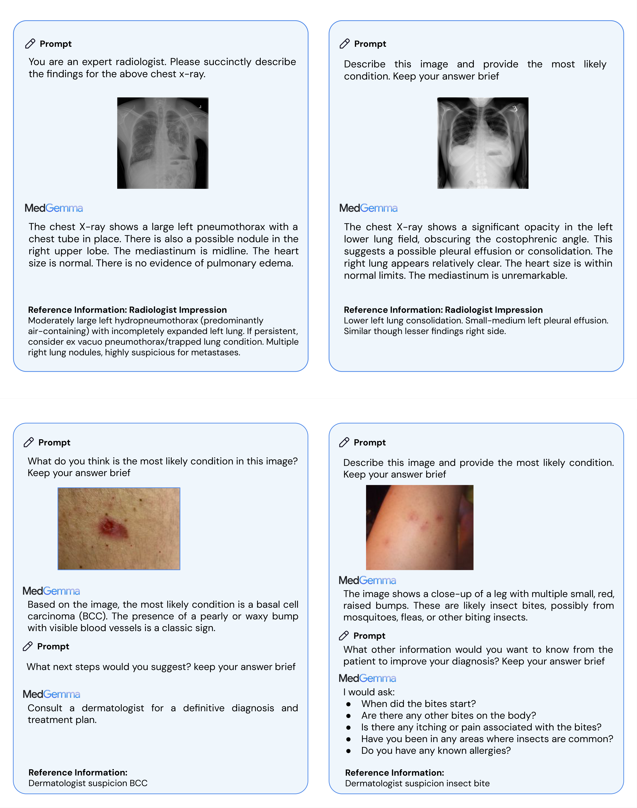
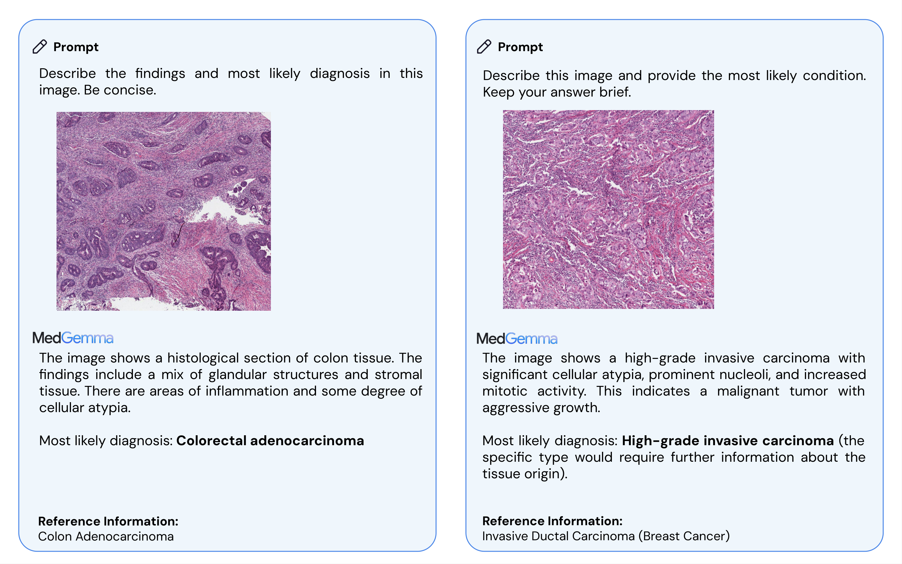
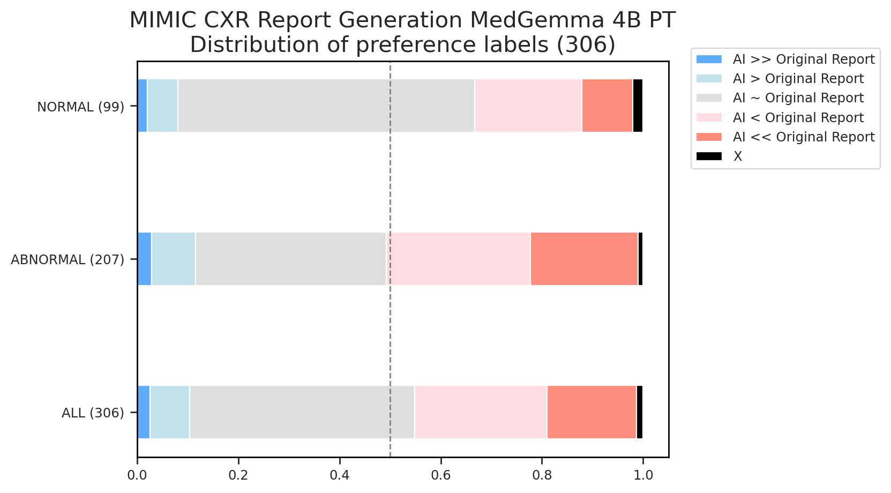
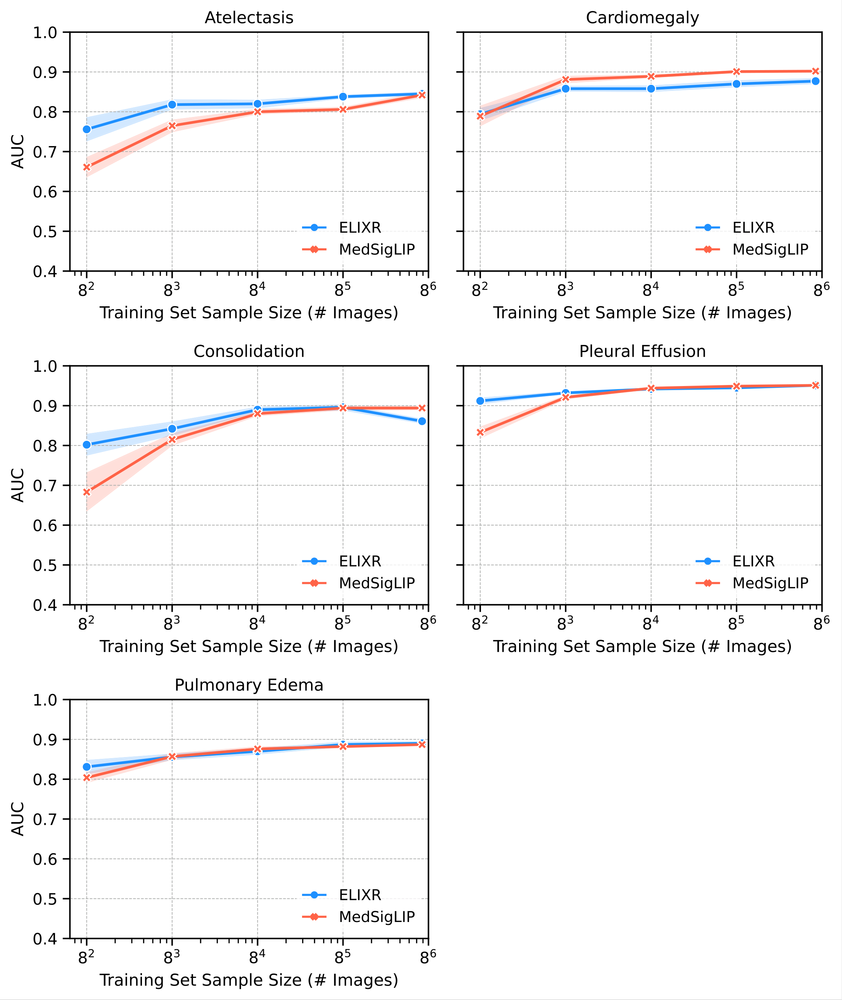
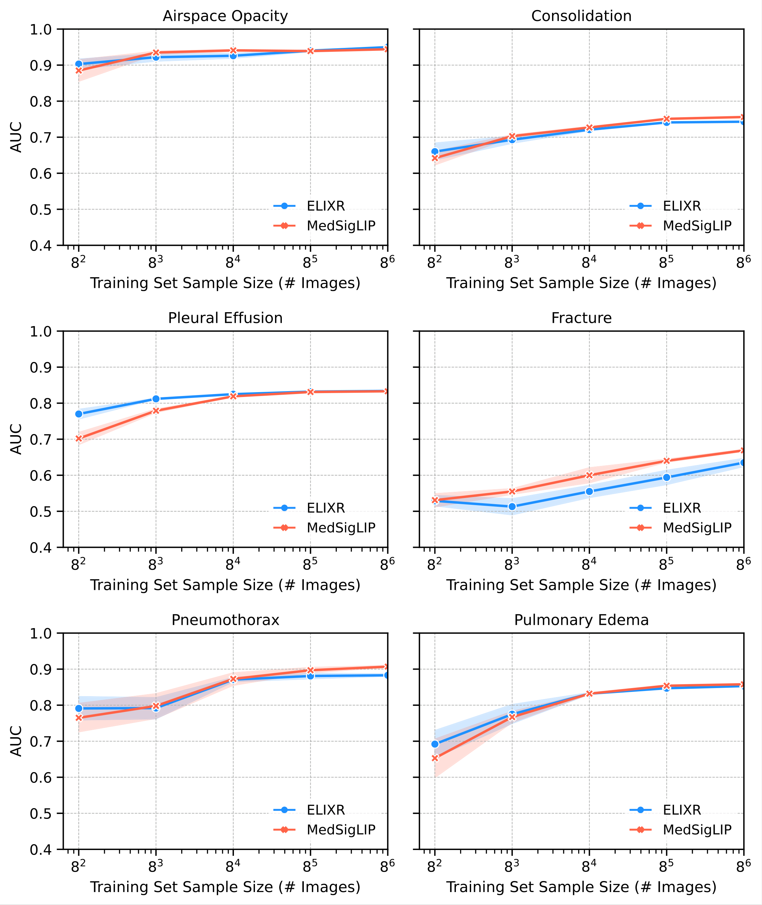
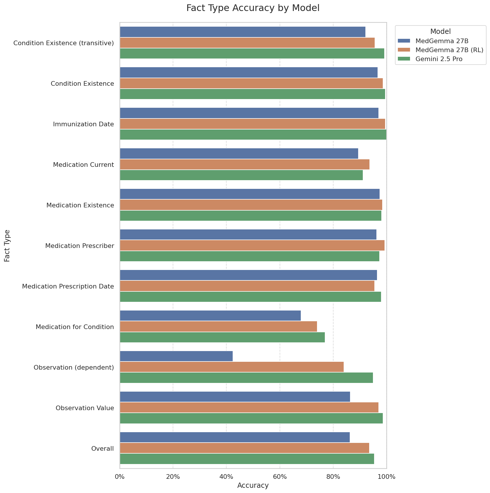

# MedGemma テクニカルレポート

> 原題: MedGemma Technical Report
> 著者: Google Research and Google DeepMind（全著者リストは原典 §11 を参照）
> 責任著者: {linyan, dangolden, asellerg}@google.com
> 出典: arXiv:2507.05201
> モデル: <https://goo.gle/medgemma>

> 翻訳メモ: 本翻訳は CLAUDE.md §4 の標準ルールと異なり、**Appendix A・C・D・F も翻訳対象に含めている**（ユーザーからの個別指示による）。ただし **Appendix B（Evaluation Prompts）は原文の英語プロンプト文字列の列挙**であり、日本語に訳すと再現性を損なうため**要旨のみ記載**した。**Appendix E（医学推論の追加例）は代表例 1 件に絞っている**。§11 Contributions（著者リスト・謝辞）と References は除外。原典 markdown には画像が 3 枚しか埋め込まれていなかったため、図はすべて arXiv e-print（arXiv:2507.05201）に同梱された PDF から生成した。巨大な HTML テーブル（MathML 埋め込み）は markdown テーブルに変換している。

## Abstract（要旨）

人工知能（AI）は医療の応用において大きな可能性を持つが、医療のデータの多様性、起こりうるタスクの複雑な広がり、そしてプライバシーを保護する必要性ゆえに、その訓練と展開は困難である。さまざまな医療タスクで良好に機能し、タスク特化の調整データをより少なく必要とする基盤モデルは、医療応用のための AI の開発を加速するうえで決定的に重要である。本テクニカルレポートでは、**Gemma 3 4B と 27B に基づく医療の視覚–言語基盤モデルの新しいコレクションである MedGemma** を紹介する。MedGemma は画像とテキストに対する高度な医学的理解と推論を示し、同程度のサイズの生成モデルの性能を大きく上回り、タスク特化モデルの性能に近づく一方で、Gemma 3 のベースモデルの汎用的能力を維持する。分布外（out-of-distribution）のタスクについて、MedGemma はベースモデルと比較して、**医療マルチモーダル質問応答で 2.6〜10% の改善、胸部 X 線所見分類で 15.5〜18.1% の改善、エージェント評価で 10.8% の改善**を達成する。MedGemma をさらに微調整すると下位領域の性能が改善され、**電子健康記録（EHR）の情報検索の誤りが 50% 減少**し、気胸分類と組織病理学パッチ型分類において既存の特化した最先端手法と同等の性能に達する。加えて、**SigLIP から派生した医学的に調整された視覚エンコーダである MedSigLIP** を導入する。MedSigLIP は MedGemma の視覚理解の能力を支えており、エンコーダとして、特化した医療画像エンコーダと同等かそれ以上の性能を達成する。総合すると、MedGemma のコレクションは医療画像とテキストの能力の強固な基盤を提供し、医学研究と下流応用の開発を大幅に加速する可能性を持つ。

## 1 Introduction（はじめに）

現代の医療の状況は、前例のない量と多様性のデータの生成と利用によって特徴づけられる。診断・治療・モニタリングは、異なる情報源と専門領域からの情報の統合に依存している。最近開発された**大規模マルチモーダルモデル（LMM）**は、巨大で多様なデータセットで訓練され、複雑なパターンの検出、首尾一貫したテキストの生成、視覚情報の処理において目覚ましい能力を示している。これらの能力は、現在のワークフローを支援し新たな洞察を引き出すうえでの潜在的なパラダイムシフトを示すものである。

汎用の（医学的に調整されていない）LMM は印象的に広い能力を示すが、**汎用のモデルは機微な医学的理解と、医療データを頑健に解釈し推論する能力を欠きうる**。このギャップを認識し、我々は MedGemma を作成した。これは開かれた、医学的に調整された視覚–言語の基盤モデルの新しいスイートである。これらのモデルは **Health AI Developer Foundations** コレクションへの最新の追加である。**Gemma 3** の頑健なアーキテクチャの上に構築された MedGemma のモデルは、**Gemma 3 に存在する強力な汎用能力を保持しながら**、医療画像とテキストを解釈し推論するよう設計されている。

<figure>

<figcaption>図1: MedSigLIP 画像エンコーダ、MedGemma 4B マルチモーダル、MedGemma 27B テキストを特徴とする MedGemma モデルコレクションの概観。医療画像（放射線科・皮膚科・デジタル病理・眼科）は MedSigLIP と MedGemma 4B マルチモーダルへ、医療テキストは MedGemma 27B テキストへ入力される。</figcaption>
</figure>

本レポートでは 2 つの MedGemma モデルに焦点を当てる。**テキスト、画像、またはその両方を入力として受け取れる 4B 版**と、**テキストのみの入力に最適化された 27B 版**である。両モデルともテキストを出力する。MedGemma 4B は、はるかに小さいにもかかわらず、Med-Gemini のような従来の SOTA モデルと比較して **VQA（Visual Question Answering）**のベンチマークで強い性能を示す。MedGemma 4B と 27B はどちらも、MedQA、MedMCQA、PubMedQA、MMLU Med、AfriMed-QA、AgentClinic を含む困難なテキストのみの医療ベンチマークタスクにおいて、同程度の規模の他のオープンなモデルと比較して非常に競争力がある。これらの強力な即応的能力に加えて、胸部 X 線レポート、組織病理学分類、EHR 情報検索のような下位領域で MedGemma を微調整することで性能をさらに改善できることを示す。

追加の MedGemma 派生として、**MedGemma 27B のマルチモーダル版**も開発され、他のモデルとともに公開されている。このマルチモーダル 27B 版のより徹底した評価は進行中であり、予備的な結果は Appendix F にある。本レポートで特に断りのない限り、「MedGemma 27B」を参照する評価は **27B のテキストのみの版**を指す。

MedGemma のモデルに加えて、我々は独立した **MedSigLIP という 4 億パラメータの医療画像エンコーダ**を記述する。MedSigLIP は SigLIP-400M に基づいており、MedGemma の画像解釈の能力を支えているのと同じエンコーダである。単独で用いると、MedSigLIP は**データ効率的かつゼロショットの画像分類と検索**を可能にし、その性能は特化した画像エンコーダと同等かそれを上回る。

## 2 Methods（手法）

### 2.1 Datasets（データセット）

事前学習中の汎用データのリプレイには、SigLIP と Gemma 3 の元のデータ混合を活用した。医療の訓練・評価データセットは概ね Med-Gemini のデータセットに従った。本節では、Med-Gemini と比較した具体的な変更点または差異を概説する。

#### 2.1.1 Training datasets（訓練データセット）

**表1**: MedGemma の訓練データセットの概観。Vision: 視覚エンコーダ強化、PT: 事前学習、Distill: 蒸留、RL: 強化学習。

| モダリティ | データセット | 事例数 | 訓練段階 | 説明 |
| --- | --- | --- | --- | --- |
| テキストのみ | MedQA | 9,275 | Distill, RL | USMLE 形式の試験問題 |
| | MedMCQA | 182,806 | Distill, RL | インドの医学入学試験問題 |
| | AfriMed-QA | 1,003 | Distill, RL | 汎アフリカの英語による多専門領域 QA |
| | MedExpQA | 434 | Distill, RL | スペインの医学研修医試験問題 |
| | PubMedQA | 1,000 | Distill, RL | PubMed の抄録から編纂された生物医学 QA |
| | LiveQA | 634 | Distill, RL | 米国国立医学図書館（NLM）の消費者向け健康質問 |
| | HealthSearchQA | 3,375 | Distill, RL | 検索エンジンからの一般的な消費者向け医療質問 |
| | Synthetic | 200,000 | Distill | 大規模 IT 教師から生成 |
| 放射線科 | SLAKE | 450 | Vision, PT, RL | QA 対から生成されたキャプション |
| | VQA-Rad | 1,391 | RL | 放射線画像 QA 対 |
| | MIMIC-CXR | 231,483 | Vision, PT, RL | 胸部 X 線画像と自由形式レポート |
| | Digital Knee X-ray | 1,469 | Vision, PT | 膝 X 線画像とラベル |
| | CT-US1 | 59,979 | Vision, PT | 2D CT スライスと自由形式レポート |
| | MRI-US1 | 47,622 | Vision, PT | 2D MRI スライスと自由形式レポート |
| 組織病理学 | Internal histopathology | **32,550,599** | Vision, PT, RL | 組織病理学画像パッチとキャプション対 |
| 皮膚科 | PAD-UFES-20 | 2,047 | Vision, PT | 皮膚病変画像とラベル |
| | Internal dermatology | 51,049 | Vision, PT, RL | 皮膚病変画像とラベル |
| 眼科 | EyePACS | 199,258 | Vision, PT, RL | 眼底画像とラベル |
| 一般医療 | PMC | 41,853 | Vision, PT | 単一パネルの医療画像とキャプション対 |

##### テキストのみのデータセット:

テキストのデータセットについては、MedQA、MedMCQA、PubMedQA、MedExpQA、AfriMed-QA、HealthSearchQA、LiveQA を含む複数の医療 QA データセットの訓練分割を用いて、**大規模な IT（instruction-tuned）教師から応答とロジットをサンプル**した。また、上記のデータセットからランダムにサンプルした 5 問を例として同じ大規模 IT 教師に新しい質問を生成させることで作った**約 20 万問の合成医療質問**についても応答とロジットをサンプルした。

##### マルチモーダルデータセット:

Med-Gemini と比較して、MedGemma のマルチモーダル能力は現在**2D の医療画像**（例: X 線、CT/MRI からの 2D スライス）に焦点を当てている。Med-Gemini で記述された 3D ボリュームとゲノムのデータセットは含めなかった。加えて、我々と他の研究者は **PathVQA と MedVQA に潜在的なデータ品質の問題**を特定した。したがってそれらを訓練データセットから除外した。PAD-UFES-20 は非常に特定の病変型の 6 クラス分類に焦点を当てており、より汎用的な皮膚科の能力とユースケースという目標と一致しないため、後訓練のデータセットには含めなかった。訓練データの PMC-OA の構成要素については、より良いデータ品質のため PMC-OA からの**単一パネルの医療画像のみ**を含めた。Med-Gemini と比較して、眼科（網膜眼底画像 184,852 枚を追加）、皮膚科（210 の異なる皮膚疾患を持つ皮膚科画像 51,049 枚を追加）、組織病理学（合計約 3,250 万のパッチ–テキスト対）、放射線科データ（CT 2D スライス 54,573 枚、MRI 2D スライス 47,622 枚を追加）について、より大規模な内部コレクションも導入した。訓練に利用した追加の CT と MRI のスライスは、**放射線レポート中で異常所見に関連する特定のスライスへの言及に基づいて**キュレートされた。

#### 2.1.2 Data Preprocessing（データ前処理）

データ準備は Med-Gemini に近く従った。画像のパディングとリサイズのアルゴリズムは同じままであるが、**Gemma 3 では視覚エンコーダが異なるため、画像は 768×768 ではなく 896×896 にリサイズ**された。Gemma 3 に従い、262,000 エントリの SentencePiece トークナイザを用いる。加えて、**CT 画像については 3 つのウィンドウを事前選択し、それらを入力画像の RGB カラーチャネルに変換**して次を強調した。(1) 骨と肺、window-width: 2250、window-level: -100、(2) 軟部組織、window-width: 350、window-level: 40、(3) 脳、window-width: 80、window-level: 40。

### 2.2 Modeling Methodology（モデリング手法）

#### 2.2.1 Modeling Architecture and Training Infrastructure（アーキテクチャと訓練基盤）

**MedGemma のモデルアーキテクチャは Gemma 3 に従い、既存の Gemma の基盤すべてと互換性がある。** Gemma 3 の視覚エンコーダは SigLIP エンコーダの 400M 派生であり、異なる Gemma 言語モデルのサイズ（4B、27B）で共有される。入力画像の解像度は 896×896 で、画素値は [-1, 1] に正規化される。言語モデルの構成要素も Gemma 3 に従い、**任意の画像–テキストのインターリーブと長い文脈（128k）**を特徴とする。Gemma 3 と同様に、MedGemma は TPUv4、TPUv5e、TPUv5p で訓練され、メモリ節約のために事前計算された視覚トークンを活用し、マルチポッド訓練のためにデータとモデルのシャーディングを用いた。

#### 2.2.2 Model Training（モデルの訓練）

MedGemma 4B マルチモーダルモデルは以下のすべての段階を利用し、**MedGemma 27B のテキストのみの版は後訓練の段階のみ**を活用した。

##### MedGemma のための視覚エンコーダ強化:

医療画像における微妙な差異を符号化し区別する視覚エンコーダの能力を改善するため、表1 に挙げた **3,300 万を超える医療の画像–テキスト対**（各種医療モダリティから 63.5 万、組織病理学パッチから 3,260 万）を用いて Gemma 3 の視覚エンコーダ（SigLIP-400M）を微調整した。**SigLIP の既存の性能を保持するため、その元の訓練データ（例: WebLI）を残し、医療データを 2% の重みで訓練に混合した。** Gemma 3 の視覚エンコーダは 896×896 の解像度で動作するが、我々は多くの医療の視覚タスクが **448×448 の解像度でも十分うまく機能する**ことを見出した（表15）。したがって、MedGemma 4B の画像エンコーダは Gemma 3 との互換性と一貫性のために 896×896 の解像度に基づく一方、**公開される MedSigLIP モデルは、より効率的な実験とコミュニティによる適応のために 448×448 の解像度に基づく**。448×448 のエンコーダは 896×896 のエンコーダと**同じモデル重みを共有**しており、唯一の違いは、より低い解像度からのより少ない入力パッチで動作するように**位置埋め込みをダウンサンプルしている**ことだけである。

##### マルチモーダルデコーダ事前学習:

視覚エンコーダの強化の後、Gemma の言語モデルはこの新しい視覚エンコーダに再適応される必要があった。医療データについてだけでなく、**視覚–言語の推論能力を保持するために一般的な画像領域についても**である。この目標は、元の混合からのテキストとインターリーブされた画像データと、新たに導入された医療領域の画像–テキスト対データの両方を組み込んだ事前学習の段階で達成された。注目すべきは、元の Gemma 3 の混合が既に汎用的かつ大規模であったため、**この段階でさらなる医療のテキストのみのデータは導入しなかった**ことである。計算要求を減らすため、元の Gemma 3 の事前学習済みチェックポイントの上で事前学習を継続し、**医療画像データを 10% の重みで混合**し、この混合比のもとで医療の混合について約 5 エポック訓練し、胸部 X 線レポート生成と放射線科・皮膚科・眼科の VQA についての検証セットの性能に基づいてチェックポイントを選んだ。

##### 後訓練:

事前学習から獲得された知識は、後訓練の段階で能力として表出させる必要がある。Gemma 3 で以前概説されたとおり、2 つの主要な後訓練の構成要素がある。蒸留と強化学習（RL）のレシピは Gemma 3 の開発におけるものと同じで、以下の追加がある。(1) **蒸留**: 大規模な IT 教師からこれらの領域についてさらに学習できるようにするため、この構成要素の際に医療テキストデータを追加。(2) **強化学習**: 対になったテキストを持つ医療画像データを後訓練の RL 段階で利用した。**マルチモーダルの訓練については、教師ありの微調整（SFT）と比較して RL の方がより良い汎化を可能にすることを見出したため、マルチモーダルの後訓練はすべて RL を介して行った。**

## 3 MedGemma Evaluations（MedGemma の評価）

### 3.1 General evaluation approach（一般的な評価の方針）

（比較対象モデルの選定基準、内部で計算した指標と先行研究から引用した指標の区別などが記述されている。）

### 3.2 Medical text question-answering（医療テキスト質問応答）

MedQA、MedMCQA、PubMedQA、MMLU の医療サブセット、AfriMed-QA、および分布外の MedXpertQA で評価した。

### 3.3 Medical image classification（医療画像分類）

訓練データで最も多く表現されているモダリティを横断して MedGemma を評価するため、放射線科・組織病理学・皮膚科・眼科にわたる画像ベースの分類タスクの集合を利用した。**分類をゼロショットの生成タスクとして扱うことは、埋め込みベースの分類器を訓練する場合と比べて最大の性能を提供しないかもしれない**が、これらの評価はモデルの視覚表現の質と有用性についての追加の洞察を提供する。

### 3.4 Medical visual question-answering（医療 VQA）

SLAKE（英語）と VQA-RAD で評価した。

### 3.5 Chest X-ray report generation（胸部 X 線レポート生成）

**MedGemma 4B の事前学習済み（PT）モデル**を用いて MIMIC-CXR のテストセットから放射線レポートを生成した。ここで後訓練済みモデルではなく事前学習済みモデルを選んだのは、**RadGraph F1 のような指標がレポートのスタイルに敏感である**ためである。MIMIC-CXR のレポートは訓練で使われているので事前学習済みモデルの方が MIMIC-CXR のスタイルによく従えたが、後訓練済みモデルはレポート生成の点で元の Gemma 3 のスタイルにより近く適合していた。

胸部 X 線レポート生成の精度は、MedGemma が生成したレポートを元の放射線科医のレポートと、impression と findings の両方について **RadGraph F1 指標**を用いて 912 枚の画像セットで比較することで測定した。

我々はまた、**米国の認定を受けた心臓胸部放射線科医 1 名**とともに同じ 306 症例の画像セットで**人間の専門家による評価**を行い、対応する胸部 X 線画像に対して元のレポートと MedGemma が生成したレポートの両方を評価した。評価タスクは Appendix 表 A1 に示す 5 段階尺度でレポートを比較した。**評価者は評価において中立を保つよう求められたが、どちらのレポートが元の放射線科医のものでどちらが AI システムのものかについては盲検化されていなかった。** この評価は、重大な問題と軽微な問題を区別できること、および元の MIMIC-CXR のレポート自体に誤りや欠落が含まれる場合を考慮できることから、RadGraph に基づく自動評価を補完する。

### 3.6 Medical agentic behavior（医療におけるエージェント的挙動）

AgentClinic ベンチマークで評価した。

### 3.7 General purpose benchmarks（汎用ベンチマーク）

医学的に特化した多くのモデルが非医療のタスクに直面したときに示す限界と低い性能を踏まえ、**特化による起こりうるトレードオフ**についても評価した。MMLU Pro、Global MMLU Lite、MMMU のベンチマークデータセットで評価した。

## 4 MedGemma Results（MedGemma の結果）

##### 医療テキスト質問応答:

評価したすべてのテキストのみの生物医学 QA タスクを横断して、**MedGemma は同サイズの標準的な Gemma 3 モデルの派生を上回る性能**を示し、多くの場合においてはるかに大きなモデルとも競争力のある性能を示した。

**表3**（抜粋）: テキストのみの医療ベンチマークにおける精度。

| Model | Open | MedQA | MedMCQA | PubMedQA | MMLU Anatomy | MMLU Clinical Knowl. | MMLU Prof. Medicine |
| --- | --- | --- | --- | --- | --- | --- | --- |
| *Small Models* | | | | | | | |
| **MedGemma 4B** | ✓ | **64.4** | **55.7** | **73.4** | 59.3 | 71.3 | 76.8 |
| Gemma 3 4B | ✓ | 50.7 | 45.4 | 68.4 | 54.1 | 69.8 | 65.4 |
| **MedGemma 27B**（test-time scaling あり） | ✓ | **87.7** | **74.2** | **76.8** | 83.7 | 86.0 | 93.4 |
| Gemma 3 27B | ✓ | 74.9 | 62.6 | 73.4 | 74.8 | 86.0 | 85.7 |
| BioMistral DARE 7B | ✓ | 51.1 | 48.7 | 77.7 | 55.8 | 62.3 | 61.4 |
| JSL-MedLlama 3 8B v2.0 | ✓ | 61.4* | 61.2 | 74.2 | 71.9 | 78.1 | 78.7 |
| OpenBioLLM 8B | ✓ | 59.0 | 56.9 | 74.1 | 69.8 | 76.1 | 78.2 |
| IQVIA Med-R1 8B | - | 73.3 | 63.3 | 76.4 | 72.6 | 78.5 | 84.9 |
| *Large Models* | | | | | | | |
| OpenBioLLM 70B | ✓ | 78.2 | 74.0 | 79.0 | 83.9 | 92.9 | 93.8 |
| DeepSeek R1 | ✓ | 90.1 | 78.8 | 77.2 | 91.1 | 91.7 | 95.6 |
| Gemini 2.5 Flash | - | 92.0 | 79.7 | 76.2 | 91.1 | 91.7 | 96.0 |

**表4**: MedXpertQA（分布外）における精度。

| Type | MedGemma 4B | Gemma 3 4B | MedGemma 27B | Gemma 3 27B | Gemini 2.5 Flash | Gemini 2.5 Pro | o3 |
| --- | --- | --- | --- | --- | --- | --- | --- |
| Text-only | 14.2 | 11.6 | 25.7 | 15.7 | 36.2 | 43.1 | **54.6** |
| Multi-modal only | 24.4 | 22.3 | N/A | 29.8 | 47.4 | 58.9 | **67.5** |

MedGemma は開放的な臨床推論のタスクに従事する能力も持つ。そのようなタスクの例は、モデルの性能に対する臨床的な論評とともに表5（長文の MedGemma の応答）と表6（簡潔な MedGemma の応答）に示されている。

##### 医療画像分類:

**表7**: 胸部 X 線の所見分類（マクロ F1）。

| Dataset | Metric | MedGemma 4B | Gemma 3 4B | Gemma 3 27B | Gemini 2.5 Flash | Gemini 2.5 Pro | o3 | SOTA VLM |
| --- | --- | --- | --- | --- | --- | --- | --- | --- |
| MIMIC-CXR (Med-Gemini test set) | macro F1（5 条件） | **88.9** | 81.2 | 71.7 | 81.0 | 85.8 | N/A | 90.7（Med-Gemini） |
| MIMIC-CXR (MAIRA test set) | | 40.5 | 26.7 | 25.0 | 32.2 | 31.9 | N/A | 51.6（Med-PaLM M） |
| CheXpert (OOD) | macro F1（5 条件） | **48.1** | 32.6 | 26.2 | 37.4 | 37.0 | 40.9 | 49.0（RadVLM） |
| CXR14 (OOD) | macro F1（3 条件） | **50.1** | 32.0 | 31.4 | 36.6 | 39.2 | 32.0 | 46.7（Med-Gemini） |

**表8**: 組織病理学・皮膚科・眼科の分類（精度）。

| Modality | Dataset | MedGemma 4B | Gemma 3 4B | Gemma 3 27B | Gemini 2.5 Flash | Gemini 2.5 Pro |
| --- | --- | --- | --- | --- | --- | --- |
| Histopath. | PathMCQA | **69.8** | 37.1 | 42.2 | 46.9 | 42.7 |
| Skin | US-Derm MCQA | 71.8 | 52.5 | 66.9 | 78.4 | **81.0** |
| Retina | EyePACS | **64.9** | 14.4 | 20.3 | 17.5 | 27.7 |

<figure>

<figcaption>図2: MedGemma 4B との開放的な質問応答による胸部 X 線（上）と皮膚科（下）の画像対話の例。</figcaption>
</figure>

<figure>

<figcaption>図3: MedGemma 4B による組織病理学の開放的な質問応答の例。</figcaption>
</figure>

##### 医療 VQA:

**表9**: SLAKE（英語）と VQA-RAD における結果。

| Model | SLAKE overall token F1 | SLAKE open-ended token recall | SLAKE closed-ended accuracy | VQA-RAD overall token F1 | VQA-RAD closed Q&A accuracy |
| --- | --- | --- | --- | --- | --- |
| *Small Models* | | | | | |
| **MedGemma 4B** | 72.3 | 63.3 | 87.6 | 49.9 | 69.1 |
| Gemma 3 4B | 40.2 | 33.3 | 53.0 | 33.6 | 48.7 |
| Gemma 3 27B | 42.5 | 30.8 | 64.5 | 42.7 | 59.4 |
| BiomedGPT-B | **85.2** | - | **89.9** | * | * |
| LLaVA-Med (BioMedCLIP) | - | **87.1** | 86.8 | * | * |
| *Large Models* | | | | | |
| Med-Gemini | 75.8 | 72.2 | 84.6 | 50.1 | 69.7 |
| Gemini 2.5 Flash | 54.6 | 42.2 | 80.9 | 53.6 | 70.2 |
| Gemini 2.5 Pro | 53.1 | 40.4 | 78.6 | **54.2** | 71.4 |
| o3 | 55.5 | 45.0 | 76.3 | 52.5 | **71.9** |

##### 胸部 X 線レポート生成:

**表10**（抜粋）: MIMIC-CXR における自動レポート生成の指標。*Sections* 列はモデルが FINDINGS（F）と IMPRESSION（I）のどちらを生成するかを示す。**MedGemma は正面像の胸部 X 線について両方のセクション（F + I）を作成するという、より困難なタスクに取り組んでいる。**

| Model | Sections | RadGraph F1 (%) |
| --- | --- | --- |
| CXR-RePaiR | F only | 9.1 |
| M² Transformer | F only | 22.0 |
| Med-PaLM M, 12B | F only | 25.2 |
| Med-PaLM M, 84B | F only | 26.7 |
| MAIRA-1 | F only | 24.3 |
| MAIRA-2 | F only | **34.6** |
| R2Gen | F + I | 13.4 |
| WCT | F + I | 14.3 |
| CvT-21DistillGPT2 | F + I | 15.4 |
| Flamingo-CXR | F + I | 20.5 |
| Med-Gemini-2D | F + I | 24.4 |
| PaliGemma 2 10B | F + I | 29.5 |
| MedVersa | F + I | **30.0** |
| **MedGemma 4B PT** | F + I | **29.5** |

<figure>

<figcaption>図4: MedGemma 4B PT モデルを用いて MIMIC-CXR テストセットに対して放射線レポートを生成した。認定を受けた胸部放射線科医 1 名が MIMIC-CXR のレポート、生成されたレポート、および対応する胸部 X 線画像を精査してレポートの品質を判定した。画像は臨床診断ビューアで元の DICOM を用いて精査された。全症例を通して、MedGemma の胸部 X 線レポートの 81% が元のレポートと比較して同等または優れた臨床判断をもたらした。</figcaption>
</figure>

##### 医療におけるエージェント的挙動:

**表11**: AgentClinic ベンチマークにおける性能。

| Model | AgentClinic-MedQA 精度 (%) | AgentClinic-MIMIC (OOD) 精度 (%) |
| --- | --- | --- |
| *Small Models* | | |
| **MedGemma 27B** | **56.2** | **46.0** |
| Gemma 3 27B | 50.7 | 35.2 |
| *Large Models* | | |
| DeepSeek R1 | 58.1 | 43.8 |
| Gemini 2.5 Pro | 58.3 | 48.4 |
| o3 | **65.8** | **50.6** |
| Human physician | 54.0* | N/A |

##### 汎用ベンチマーク:

**表12**: 汎用ベンチマークにおける性能（特化のトレードオフの評価）。

| Type | Benchmark | MedGemma 4B | Gemma 3 4B | MedGemma 27B | Gemma 3 27B |
| --- | --- | --- | --- | --- | --- |
| Text-only | MMLU Pro | 39.1 | 43.6 | 60.2 | 67.5 |
| | Global MMLU Lite | 55.5 | 54.5 | 74.5 | 75.1 |
| Multi-modal | MMMU (val) | 47.3 | 48.8 | N/A | 64.9 |

**MedGemma は同サイズの汎用モデルと比較してわずかな性能低下しか示さず**、指示追従や多様なユーザーとの対話のような、特化した能力と汎化した能力の両方を必要とする下流応用への潜在的な有用性をさらに示唆している。

## 5 MedGemma Fine-tuning Demonstration（MedGemma の微調整のデモンストレーション）

### 5.1 Fine-tuning for multimodal tasks（マルチモーダルタスクのための微調整）

**表13**: 微調整の効果。

| Task | Dataset | Metric | MedGemma 4B（即応） | MedGemma 4B（微調整後） | SOTA |
| --- | --- | --- | --- | --- | --- |
| CXR レポート生成 | MIMIC-CXR | RadGraph F1 | 29.5 | **30.3** | 30.0（MedVersa） |
| CXR 二値分類 | SIIM-ACR Pneumothorax (OOD) | Accuracy | 85.9 | **87.8** | 88.9（Unichest FT） |
| | | F1 | 59.7 | **71.5** | 72.5（Unichest FT） |
| 組織病理学分類 | CRC100k (OOD) | Weighted F1 | 32.8 | **94.5** | 97.3（Virchow） |

### 5.2 Fine-tuning for EHR information retrieval and reasoning（EHR 情報検索と推論のための微調整）

**表14**: EHRQA における性能。

| Type | MedGemma 27B Text-only | Gemma 3 27B | **MedGemma 27B Text-only (RL)** | Gemini 2.5 Flash | Gemini 2.5 Pro | o3 |
| --- | --- | --- | --- | --- | --- | --- |
| EHRQA | 86.3 | 84.2 | **93.6** | 95.0 | 95.4 | 92.5 |

**RL による調整で 86.3 → 93.6 と、誤りが約 50% 減少している。**

## 6 MedSigLIP Evaluations（MedSigLIP の評価）

MedSigLIP は**ゼロショット分類の性能**と**linear probe 分類の性能**（データ効率的分類とも呼ぶ）の両方で評価した。ゼロショット分類の性能はベースラインの性能の尺度として評価し、linear probe の性能は対象条件に対するロジスティック回帰による追加の訓練の後の性能を測るために評価した。

評価データセットは胸部 X 線、皮膚科、眼科、組織病理学の 4 モダリティにわたる。胸部 X 線については **ELIXR** の評価データセットと枠組みに従った。linear probe には CheXpert と CXR14 の同じデータを利用し、7 つの所見（無気肺、心拡大、含気腔の陰影、骨折、気胸、硬化、胸水、肺水腫）で評価した。ゼロショットについては CheXpert テストセットの 13 の陽性所見で ELIXR と比較した。

##### ゼロショット評価の方針と指標:

各条件内の各クラスについて、1 つ以上のテキストプロンプトを用いてそのクラスを表現した。同じクラスに複数のプロンプトがある場合、各プロンプトのテキスト埋め込みを平均してクラスごとに単一の埋め込みを得た。次に画像埋め込みとクラスの選択肢のテキスト埋め込みの間で**コサイン類似度**を計算し、softmax を適用してスコアを出力し、**AUC**（受信者動作特性曲線下面積）を計算した。

##### Linear probe 評価の方針と指標:

Linear probe（データ効率的）分類は、**MedSigLIP から画像埋め込みを抽出し（テキストエンコーダは用いない）**、訓練セットの埋め込みで **SAGA ソルバ**を用いたロジスティック回帰を訓練し、ハイパーパラメータを検証セットで選び、テストセットで評価することで評価した。

## 7 MedSigLIP Results（MedSigLIP の結果）

<figure>

<figcaption>図5: CheXpert と CXR14 のデータセットにおける 7 つの胸部 X 線所見のデータ効率的学習の平均結果。ELIXR に基づく HAI-DEF の CXR Foundation モデルとの比較。横軸は訓練セットのサンプルサイズ、縦軸は AUC。条件ごと・データセットごとの個別の結果は Appendix の図 A1 と A2 にある。</figcaption>
</figure>

胸部 X 線について、MedSigLIP は ELIXR に基づく HAI-DEF の CXR Foundation モデルと比較され、ゼロショットの結果は表16 に、linear probe 分類の結果は図5 に示されている。**平均して、MedSigLIP のゼロショットの胸部 X 線の性能は CXR Foundation より 2.0% 高かった。MedSigLIP の方が画像解像度が低い（448×448 対 1280×1280）にもかかわらず、また多領域の専門性を持つにもかかわらず**である。これは MedSigLIP が強力な基盤モデルとして機能しうることを示唆する。特に、骨折の分類は……

（HAI-DEF の Derm Foundation と Path Foundation のモデルについては、比較対象のモデルが画像のみの性質を持つためゼロショット分類は不可能であった。）

## 8 Discussion（考察）

我々は医療の視覚–言語基盤モデルの新しいコレクションである MedGemma と、多領域の医療画像エンコーダである MedSigLIP を導入した。これらのモデルは Gemma 3 の上に、医療領域への最適化とともに構築された。臨床推論、生物医学の知識、レポート生成、医療画像分類にわたる一連の医療ベンチマークで評価し、MedGemma と MedSigLIP について強い性能を見出した。**微調整の後に性能はさらに改善し**、これらの開かれたモデルが医療のための有用な AI 応用を開発する出発点として使われる可能性を強調している。

医療における AI 応用を構築する開発者に利用可能な選択肢が増えるなか、MedGemma は汎用のモデルに対して特定の優位を提供する。これらの優位は主として事前学習と後訓練の両方に領域特有のデータを最適化して組み込んだことによるものであり、評価したすべてのベンチマークにおけるベースの Gemma 3 のモデルに対する改善と、はるかに大きなモデルと同等の性能の達成によって例証される。

**Gemini のような汎用の API ベースのモデルと比較したとき、ユースケースが次のいずれかを必要とするなら MedGemma がおそらく好ましいモデルである。** 文書化と信頼性のための**凍結されたモデル**、訓練または推論の**コストへの感度**、**ローカルまたはオフラインで実行する能力**、特定の医療画像とテキストの能力、**モデルの適応に対する完全な制御**。Gemini のような大規模なモデルは、上記の制約なしに最適な広範な性能をユーザーが必要とする場合には有効な選択肢であり続け、加えて大規模なモデルはエージェント的な設定において MedGemma のようなモデルと**協調して**用いられうる。

MedGemma のモデルのコレクションは、開発者コミュニティのための幅広い潜在的な下流応用を可能にする。画像とテキストの埋め込みへのアクセスを含むマルチモーダルの能力は、**医療画像検索**に特に有用でありうる。これは類似の過去症例を参照することによる解釈の補助や、研究コホートの開発と教育ツールの作成を可能にしうる。

本レポートでは、モデルの能力のスナップショットを提供するために、確立された幅広いベンチマークで MedGemma と MedSigLIP の性能を評価した。しかしながら、**これらのベンチマークには限界が存在する**ことに注意したい。第一に、**自動化されたベンチマークは実世界の有用性を検証するための最初の一歩にすぎない**。加えて、**一部のベンチマークはモデルの性能の点で飽和に近く、改善のための余地が最小限であり、進歩の測定を妨げている**。したがって、新しく高品質な……ベンチマークでこれらのモデルの評価を継続するさらなる作業が正当化される。

我々はコミュニティによる広範な評価、改善、適応を促進するため MedGemma と MedSigLIP を**公開して**リリースした。**開放性は多くの医療応用において決定的に重要**であり、それは開発者に予測可能性と、広範なモデルの適応と評価のための柔軟性を提供するからである。

## 9 Conclusion（結論）

本研究では、MedGemma のモデルが多様な視覚–言語およびテキストのみの医療タスクにわたって頑健な能力を示すことを示した。また MedSigLIP が頑健な多領域の能力を示し、したがって強力な医療の基盤モデルとして機能しうることも示した。これらのモデルの幅と効率は、さまざまなユースケースに対応する刺激的な可能性を提供する。同時に、**あらゆる下流応用について安全性・性能・信頼性を慎重に検証することは、医療におけるマルチモーダル AI モデルの利用を前進させるうえで決定的に重要な側面であり続ける**。

## 10 Model availability（モデルの入手性）

モデルは Google Health AI Developer Foundations のサイト <https://goo.gle/hai-def> で公開されている。MedGemma のコレクションについての詳細は <https://goo.gle/medgemma> にある。

## Appendix A Manual Evaluation of Radiology reports（放射線レポートの人手評価）

表 A1 は、生成された胸部 X 線レポートを採点するために放射線科医に提供された詳細なルーブリックの定義を提供する。

**表A1**: AI が生成した放射線レポートを元のレポートと比較する人間評価のルーブリック。

| ルーブリックのスコア | ルーブリックの定義 |
| --- | --- |
| **AI >> Original Report** | AI のレポートが、元のレポートには見られない臨床的に重要な主要所見を捉えている。**AI のレポートは正しい患者管理をもたらし、元のレポートはもたらさない**。 |
| **AI > Original Report** | AI のレポートがより多くの関連所見を捉えているが、**どちらも同じ正しい患者管理をもたらす**。 |
| **AI ~ Original Report** | どちらのレポートも画像中の同様の所見を捉えており、**正しい患者管理をもたらす**。 |
| **AI < Original Report** | 元のレポートがより多くの関連所見を捉えているが、**どちらも同じ正しい患者管理をもたらす**。 |
| **AI << Original Report** | 元のレポートが、AI のレポートには見られない臨床的に重要な主要所見を捉えている。**元のレポートは正しい患者管理をもたらし、AI のレポートはもたらさない**。 |
| **X** | **どちらのレポートも正しい患者管理をもたらさない**。 |

## Appendix B Evaluation Prompts（評価プロンプト）

> 翻訳メモ: 本章は各評価タスク（胸部 X 線分類、皮膚科・眼科・病理の分類、VQA、レポート生成など）で用いた**英語のプロンプト文字列がそのまま列挙されている**。日本語に訳すと評価の再現性を損なうため、本翻訳では訳出せず要旨のみ記す。プロンプトは概ね「あなたは専門医である」という役割指定に続けて、対象となる所見のリストと出力形式（JSON、選択肢の記号のみ、など）を厳密に指定する形式を取っている。原文は原典 Appendix B を参照されたい。

## Appendix C Comparison of CXR data-efficient learning（胸部 X 線のデータ効率的学習の比較）

画像エンコーダに基づくデータ効率的学習に関する先行研究と比較するため、MedSigLIP を **ELIXR** と比較した。MedSigLIP と ELIXR の性能を、CheXpert（図 A1）と CXR14（図 A2）における異なる訓練セットのサイズでのさまざまな胸部 X 線所見について比較している。

<figure>

<figcaption>図A1: CheXpert データセットにおける胸部 X 線のデータ効率的学習の所見ごとの個別結果。ELIXR との比較。</figcaption>
</figure>

<figure>

<figcaption>図A2: CXR14 データセットにおける胸部 X 線のデータ効率的学習の所見ごとの個別結果。ELIXR との比較。</figcaption>
</figure>

## Appendix D Additional details about EHRQA（EHRQA についての追加の詳細）

EHRQA の詳細な結果は図 A3 にあり、ベースの MedGemma 27B テキストモデルが微調整済みの MedGemma 27B モデルおよび Gemini 2.5 Pro と比較されている。EHRQA の質問カテゴリの詳細は表 A8 に、質問の書き換えと評価のプロンプトは表 A9 に示されている。

<figure>

<figcaption>図A3: EHRQA の詳細な結果。MedGemma 27B（テキストのみ）の RL 調整の前後と Gemini 2.5 Pro の比較。ファクト型ごとの精度を示す。</figcaption>
</figure>

**表A8**（抜粋）: EHRQA の質問カテゴリと、テンプレート生成された例および LLM による言い換えの例。

| カテゴリ | 説明 |
| --- | --- |
| Condition existence (transitive) | 患者が一般的なクラスの医学的状態の既往を持つかに関する質問 |
| Condition existence | 患者が所与の医学的状態の既往を持つかに関する質問 |
| Immunization date | 患者の予防接種の有無とその接種日に関する質問 |
| Medication current | 患者が所与の薬剤の有効な処方を持つかに関する質問 |
| Medication existence | 患者が所与の薬剤または薬剤の型を服用したことがあるかに関する質問 |
| Medication prescriber | 患者への所与の薬剤の処方者に関する質問 |
| Medication prescription date | 薬剤の処方日に関する質問 |
| Medication for condition | 薬剤と医学的状態の既往の関係に関する質問 |
| Observation (dependent) | ある医学的事象に関連する患者の検査所見に関する質問 |
| Observation value | 患者の検査所見とその値に関する質問 |

（表 A9 の質問書き換え・評価プロンプトは Appendix B と同じ理由で訳出しない。質問を「不必要な括弧内の詳細を省きつつ曖昧さを残さない程度の詳細は保持して、より自然に聞こえるように書き換えよ」と指示するもの、および患者の EHR 全体を文脈として与えて「説明なしで簡潔に答えよ」と指示するものである。）

## Appendix E Additional medical reasoning examples（医学推論の追加例）

> 翻訳メモ: 本章は MedGemma 27B による長文の臨床推論の対話例が複数収録されている。本翻訳では代表例の構造のみ示す。各例は「症例の呈示（年齢・主訴・画像所見・生検結果・ゲノム検査結果など）」→「MedGemma の応答」→「該当領域の米国認定専門医による論評」という 3 部構成を取っており、論評はモデルの応答の妥当な部分と不正確・不完全な部分の両方を指摘している。

## Appendix F MedGemma 27B multimodal model（MedGemma 27B マルチモーダルモデル）

本レポートで先に記述した MedGemma 4B マルチモーダルと 27B テキストのみの派生に加えて、我々は **MedGemma 27B マルチモーダル派生**も公開している。この派生の訓練手法は MedGemma 4B マルチモーダルモデルと同じであり、2 つの訓練データセットが追加されている。**EHRQA**（詳細は §5.2）はモデルの内在的な EHR 理解を改善するため、**Chest ImaGenome** は胸部 X 線画像における解剖学的局在化を可能にするためである。

MedGemma 27B マルチモーダル派生は 4B マルチモーダル派生のすべての能力を提供するが、**大幅に改善された言語能力に加えて、改善された EHR 理解と解剖学的局在化**を持つ。この派生の正式な評価は進行中であるが、予備的な結果は表 A14 にある。

**表A14**: MedGemma 27B マルチモーダルモデルの予備的結果。

| Task | Metric | MedGemma 4B Multimodal | MedGemma 27B Text-only | MedGemma 27B Multimodal |
| --- | --- | --- | --- | --- |
| *テキスト評価* | | | | |
| MedQA (4-op) | Accuracy | 64.4 | **87.7** | 85.3 |
| MedMCQA | Accuracy | 55.7 | **74.2** | 70.2 |
| PubMedQA | Accuracy | 73.4 | 76.8 | **77.2** |
| MMLU Med | Accuracy | 70.0 | **87.0** | 86.2 |
| MedXpertQA (text only) | Accuracy | 14.2 | **25.7** | 23.7 |
| AfriMed-QA | Accuracy | 52.0 | **84.0** | 72.0 |
