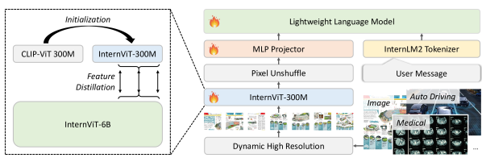
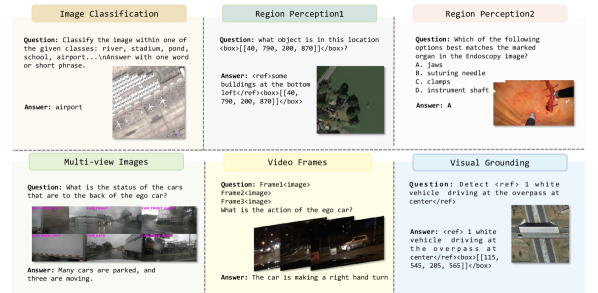
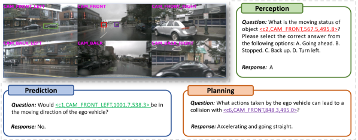
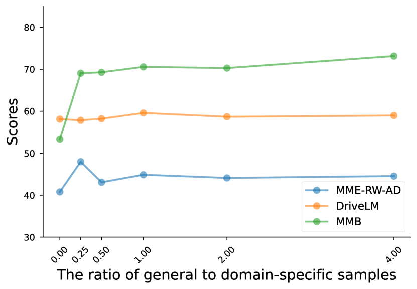
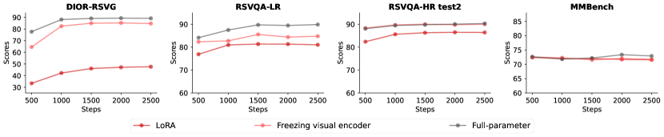

# Mini-InternVL: 5% のパラメータと 90% の性能を実現する柔軟転移可能なポケット型マルチモーダルモデル

> 原題: Mini-InternVL: A Flexible-Transfer Pocket Multimodal Model with 5% Parameters and 90% Performance
> 著者: Zhangwei Gao, Zhe Chen, Erfei Cui, Yiming Ren, Weiyun Wang, Jinguo Zhu, Hao Tian, Shenglong Ye, Junjun He, Xizhou Zhu, Lewei Lu, Tong Lu, Yu Qiao, Jifeng Dai, Wenhai Wang
> 所属: Shanghai AI Laboratory / Tsinghua University / Nanjing University / Fudan University / The Chinese University of Hong Kong / SenseTime Research / Shanghai Jiao Tong University
> 出典: arXiv:2410.16261（2024 年 10 月）
> リポジトリ: <https://github.com/OpenGVLab/InternVL>

---

## Abstract（要旨）

マルチモーダル大規模言語モデル（multimodal large language models, MLLMs）は、幅広い領域における視覚言語タスクで印象的な性能を示してきた。しかし、その大規模なモデル規模とそれに伴う高い計算コストは、コンシューマ向け GPU やエッジデバイス上での訓練・展開に大きな課題をもたらし、広範な応用を妨げている。本研究では、**1B から 4B のパラメータを持つ MLLM 系列 Mini-InternVL** を導入し、わずか 5% のパラメータで 90% の性能を達成する。この効率と有効性の顕著な改善により、本モデルはより身近で多様な実世界シナリオに適用可能となる。さらに本モデルの普及を促進するため、Mini-InternVL のための **統一的な適応フレームワーク** を開発した。これにより、自律走行、医療画像、リモートセンシングを含む下流タスクで、専門特化モデルを上回る性能を発揮する。本研究が効率的かつ効果的な MLLM の発展に資する貴重な洞察と資源を提供することを願う。

---

## 1. Introduction（はじめに）

近年、マルチモーダル大規模言語モデル（MLLMs）は、事前学習済み大規模言語モデル（LLM）と視覚基盤モデル（vision foundation models, VFMs）の強力な能力を活用することで、大きな進展を遂げてきた。これらのモデルは、画像-テキストデータの広範な多段階訓練を経て、VFM からの視覚表現を LLM の潜在空間に効果的に整列させ、汎用視覚言語理解・推論・対話タスクで有望な性能を発揮する。しかしながら、**膨大な計算負荷と、長尾領域特化タスクでの貧弱な性能** が、実用シナリオにおける MLLM の広範な応用を妨げてきた。

軽量 MLLM の登場は、パラメータ規模と性能のあいだに良好なバランスをもたらし、高価な計算機器への依存を緩和して種々の下流応用の発展を後押ししている。しかし依然としていくつかの課題がある。(1) 既存の MLLM の大半は CLIP のような視覚エンコーダを採用するが、これは Internet ドメインの画像-テキストデータで訓練されており、BERT 系と整列している。**その結果、これらの視覚エンコーダは広範な視覚ドメインをカバーできず、LLM の表現と不整合である**。(2) MLLM を特殊ドメインに適応させるため、既存手法は主にモデル構造の改変、関連訓練データの大量収集、対象ドメイン用に訓練プロセスをカスタマイズすることに注力してきた。**しかし LLM の下流適応に関する統一フレームワークの合意はまだなく、ドメインごとにモデル設計・データ形式・訓練スケジュールが異なる**。

これらの問題に対処するには、**包括的な視覚知識を持つ強力な視覚エンコーダ** と、**多様なドメインの下流タスクに低い限界コストで効率的に応用できる汎用転移学習パラダイム** の両方が必要である。

本研究では、種々の特殊ドメインへ容易に転移可能な、強力なポケットサイズ MLLM 系列 **Mini-InternVL** を導入する。そのため、まず軽量視覚エンコーダの表現能力を強化する。**CLIP の重みで初期化した 300M 視覚エンコーダに対し、InternViT-6B を教師として知識蒸留を適用** する。続いて、本視覚エンコーダを事前学習済み LLM（**Qwen2-0.5B, InternLM2-1.8B, Phi-3-Mini**）と統合し、**1B、2B、4B パラメータ** の Mini-InternVL 系列を開発する。頑健な視覚エンコーダの恩恵により、Mini-InternVL は MMBench、ChartQA、MathVista のような汎用マルチモーダルベンチマークで優れた性能を示す。注目すべきは、提案する Mini-InternVL-4B が **InternVL2-76B の 90% の性能を 5% のパラメータで** 達成し、計算オーバーヘッドを大幅に削減することである。

さらに本モデルを特定ドメインの下流タスクに適応させるため、シンプルかつ効果的な転移学習パラダイムを導入する。このパラダイム内で、**自律走行、医療画像、リモートセンシングを含む種々の下流タスクに適用可能な統一的転移アプローチ** を開発した。本アプローチは **モデル構造、データ形式、訓練スケジュールを標準化** する。結果は、本手法がドメイン特化シナリオでの視覚理解と推論能力を高め、対象ドメイン内で独自商用モデルに匹敵する性能を達成することを示す。

要約すると、本研究の貢献は以下の 3 点である。

(1) **Mini-InternVL** を提案する。**40 億パラメータ未満で頑健なマルチモーダル性能** を達成しつつ、種々のドメインの下流タスクへ低い限界コストで容易に転移可能なポケットマルチモーダルモデルである。

(2) Mini-InternVL のためにいくつかの設計特徴を開発した。これは多様な視覚ドメインに頑健な軽量視覚エンコーダ **InternViT-300M** を含む。さらに、効果的な下流タスク転移のためにモデル構造、データ形式、訓練スケジュールを標準化する **シンプルだが効果的なパラダイム** を導入する。

(3) 汎用および特定ドメインのベンチマークでの広範な実験を通じて本モデルを包括的に評価する。結果は、本マルチモーダルモデルが汎用マルチモーダルベンチマークで顕著に少ないパラメータで 90% の性能を達成することを示す。特定ドメインタスクでは、最小限の微調整計算コストで、クローズドソース商用モデルに匹敵する性能を発揮する。データサンプルサイズがドメイン適応に与える影響に関する一連のアブレーション研究を実施し、専門ドメインでの MLLM 応用への洞察を提供することを願う。

---

## 2. Related Works（関連研究）

### Multimodal Large Language Models（マルチモーダル大規模言語モデル）

LLM の発展の恩恵を受け、MLLM も大きな進歩を遂げてきた。初期の研究はマルチモーダル理解を **ツール利用タスクの 1 つ** とみなし、LLM が他のモデルに対応する入力モダリティのキャプションを書くよう促し、これにより LLM がマルチモーダル入力を理解できるようにした。事前学習済み LLM と VFM の能力を効果的に活用するため、一連の研究は両者間の埋め込み空間を整列させる **コネクタ（connector）** を提案し、制御可能なコストで有望な性能を達成している。別の系統の研究は、視覚特徴を融合する追加層で事前学習済み LLM を拡張し、LLM に入力される視覚トークン数を削減するが、追加訓練コストを伴う。

最近では、Fuyu、MoMa、Chameleon のような **視覚エンコーダ不要アーキテクチャ** を提案する研究もある。このタイプは単一の Transformer モデルで構成され、追加エンコーダを必要とせず視覚情報とテキスト情報を同時に処理し、より展開しやすい。これらの進展にもかかわらず、MLLM の重い推論コストは下流応用での展開を妨げる。この問題に対処するため、**MiniCPM-V** のような軽量 MLLM が提案されている。しかし、これらは大半が CLIP-L を視覚エンコーダとして使用し、自然画像ドメインでのみ訓練されているため、汎用ドメインに限定され他ドメインへの汎化に失敗する。本研究では、InternViT-6B から蒸留され多様な画像ドメインで訓練された **InternViT-300M** を提案する。

### Vision Foundation Models for MLLMs（MLLM 向け視覚基盤モデル）

視覚中心の観点では、ほとんどの MLLM は **CLIP** や **SigLIP** といった大規模 Web 画像-テキストデータで訓練された視覚モデルを採用する。しかし、これらの視覚エンコーダはパラメータ規模と表現能力に大きな制約がある。複数の研究がこの問題を探求している。例えば Tong らは CLIP と DINOv2 の視覚パターンに顕著な違いを見出し、これら 2 つの VFM を統合する mixture-of-features モジュールを開発した。**LLaVA-HR** は CLIP-ViT を低解像度経路に、CLIP-ConvNext を高解像度経路に用いる dual-branch 視覚エンコーダを導入した。同様に **DeepSeek-VL** は SigLIP-L を低解像度、SAM-B を高解像度に用いる dual vision encoder 設計を採用した。

しかしこれらの手法は **過度に複雑な経路** を伴い、モデルの実用応用を複雑化する。さらに、これらのアプローチは視覚エンコーダが多様なドメインの包括的視覚知識を欠くという問題を解決しない。これに対し InternViT は **段階的画像-テキスト整列** を実装し、多様な分野にわたるデータセットで生成的訓練を行うことで複数ドメインの表現能力を獲得している。我々は **強力な視覚エンコーダから軽量視覚モデルへ視覚知識を注入** することを提案し、反復的な生成的事前学習に伴う計算コストを回避する。

### Domain-Specialized Adaptation of MLLMs（MLLM のドメイン特化適応）

MLLM を特定ドメインに応用するため、いくつかの手法が探求されてきた: リモートセンシング向けの **GeoChat** や **EarthGPT**、医療画像向けの **LLaVA-Med** や **Qilin-Med-VL**、化学向けの **ChemVLM**、自律走行向けの **DriveVLM**, **DriveMLM**, **DriveGPT4** などである。これらの手法は有望な結果を達成しているが、モデル構造の改変、ドメイン特化訓練データの大量収集、対象ドメイン用の訓練プロセスのカスタマイズが必要である。それでもなお、MLLM の下流適応に関する普遍的に受け入れられたフレームワークはまだない。我々はシンプルだが効果的な転移学習パラダイムを提案し、異なる分野の MLLM 間の大きな差異が相互運用性を妨げることを防ぐことを目指す。

---

<figure>



<figcaption>図1: Mini-InternVL の訓練手法とアーキテクチャ。左: InternViT-6B を教師モデルとして用い、生徒モデルに対して知識蒸留を実施。右: Mini-InternVL は人気の MLLM（MiniCPM-V, DeepSeek-VL 等）に類似する ViT-MLP-LLM アーキテクチャを採用し、InternViT-300M を軽量 LLM 系列と MLP プロジェクタで接続する。シンプルな pixel unshuffle を用いて視覚トークン数を 1/4 に削減する。</figcaption>
</figure>

## 3. Method（手法）

本節では軽量 MLLM 系列 Mini-InternVL を紹介する。§3.1 で Mini-InternVL の全体概要、§3.2 で知識蒸留により開発した軽量視覚モデル **InternViT-300M** の詳細、§3.3 で下流タスク適応を強化する転移学習フレームワークを述べる。

### 3.1 Mini-InternVL

図 1 に示すように、Mini-InternVL は 3 つの主要コンポーネントから成る: **InternViT**、**MLP プロジェクタ**、**LLM**。視覚エンコーダとして強力な視覚エンコーダの能力を継承した軽量視覚モデル **InternViT-300M** を採用する。InternViT-300M に基づき、3 バージョンの Mini-InternVL を開発した: **Mini-InternVL-1B / 2B / 4B**。各バージョンはそれぞれ事前学習済みの **Qwen2-0.5B / InternLM2-1.8B / Phi-3-mini** に接続される。他のオープンソース MLLM と同様、Mini-InternVL は視覚エンコーダと LLM を接続する **MLP プロジェクタ** を採用する。

[[entities/internvl-1-5|InternVL 1.5]] と同様の **動的解像度入力戦略** を採用し、細部把握能力を高める。さらに **pixel unshuffle 操作** で視覚トークン数を元の 1/4 に削減する。その結果、448×448 画像は **256 視覚トークン** で表現され、最大 40 タイル（つまり 4K 解像度）を処理可能となる。

Mini-InternVL の訓練は 2 段階から成る: **(1) Language-Image Alignment（言語-画像整列）**: この段階では MLP コンポーネントのみを学習可能とする。InternVL 1.5 に従い、キャプショニング、検出、grounding、OCR を含む種々のタスクをカバーする多様な訓練データセットを使用する。データセットの多様性により、Mini-InternVL の頑健な事前学習が保証され、異なるタスクにわたる種々の言語的・視覚的要素を扱える。**(2) Visual Instruction Tuning（視覚指示チューニング）**: InternVL 1.5 と同様、幅広いマルチモーダルタスクで性能を高めるデータセットを慎重に選定する。画像キャプショニング、図表解釈、OCR、分野横断推論を含む。これらのデータで **全パラメータ微調整** を実施し、世界知識をさらに注入してモデルにユーザ指示への追従を教える。

### 3.2 InternViT-300M

既存 MLLM の大半は Web 規模の画像-テキスト対データで訓練された CLIP のような視覚エンコーダを採用するが、これらは視覚世界の包括的知識を欠き、LLM との反復的生成的事前学習を通じて獲得する必要がある。補助経路（auxiliary pathways）で視覚基盤モデルを強化する他のアプローチとは異なり、本手法は **多様なデータセットで生成的訓練を受けた強力な視覚モデル** を直接活用し、軽量視覚モデルに知識を転移する。具体的には、**InternViT-6B を教師モデル** とし、生徒モデルの重みを **CLIP-ViT-L-336px** で初期化する。生徒モデルの表現を教師の表現に整列させるため、**最後の K 層の Transformer 隠れ状態間で負のコサイン類似度損失** を計算する。結果として得られたモデルを **InternViT-300M** と命名する。

この知識転移の主目的は、InternViT-6B に埋め込まれた事前学習知識を継承することである。これを達成するため、多様な公開ソースから得たデータセットを表 1 に示すとおりキュレーションした。本データセットは 4 つの主要タイプから成る: **自然画像、OCR 画像、図表、分野横断画像**。すべての画像は 448×448 解像度にリサイズし、訓練効率のため動的解像度は無効化する。最終的に多様な知識が注入され、種々の言語モデルに適応可能な視覚エンコーダ **InternViT-300M** を開発する。

**表1**: 視覚エンコーダの知識蒸留で使用したデータセット。

| Type | Dataset |
|---|---|
| **Natural images** | Laion, COYO, GRIT, COCO, LVIS, Objects365, Flickr30K, VG, All-Seeing, MMInstruct, LRV-Instruction |
| **OCR** | TextCaps, Wukong-OCR, CTW, MMC-Inst, LSVT, ST-VQA, RCTW-17, ReCTs, ArT, SynthDoG, LaionCOCO-OCR, COCO-Text, DocVQA, TextOCR, LLaVAR, TQA, SynthText, DocReason25K, Common Crawl PDF |
| **Chart** | AI2D, PlotQA, InfoVQA, ChartQA, MapQA, FigureQA, IconQA, MMC-Instruction |
| **Multidisciplinary** | CLEVR-Math/Super, GeoQA+, UniChart, ScienceQA, Inter-GPS, UniGeo, PMC-VQA, TabMWP, MetaMathQA |
| **Other** | Stanford40, GQA, MovieNet, KonIQ-10K, ART500K, ViQuAE |

### 3.3 Domain Adaptation（ドメイン適応）

<figure>



<figcaption>図2: 本適応フレームワークのデータ形式。他の視覚タスク（画像分類、領域知覚、複数視点画像タスク、動画関連タスク、視覚的グラウンディング）を VQA 形式に定式化する。</figcaption>
</figure>

多くの研究が MLLM を下流タスクへ応用してきたが、これらの応用への MLLM 適応のための普遍的に受け入れられたフレームワークはまだ存在しない。種々のドメイン間のモデル設計、データ形式、訓練戦略の違いは MLLM 間の大きな不均一性をもたらし、標準化を困難にしている。この問題に対処するため、シンプルだが効果的な転移学習フレームワークを提案する。

#### Data Format（データ形式）

指示チューニングはモデルにユーザ指示への追従を教える重要な訓練段階であり、訓練データは **VQA + 対話形式** で定式化される。下流タスクの VQA データセット（RSVQA, PMC-VQA など）はそのまま指示追従データとして使用する。他の従来タスクについては、図 2 に示すとおり以下のアプローチで VQA 形式に定式化する。

**(1) 画像分類タスク**。特殊ドメインの伝統的分類タスクの多くは技術用語を含む。多くの場合、**多肢選択問題（multiple-choice question）** として容易に定式化できる。画像 `<image>`、候補ラベル集合 $O$、正解 $G\in O$ が与えられた場合、テンプレートは次のように表現される:

```
USER: [Image][Prompt_Prefix][Candidate Labels][Prompt_Suffix]
ASSISTANT: [Ground Truth]
```

リモートセンシング画像分類の例: "Classify the image within one of the given classes: dense residential area,..., school. Answer with one word or short phrase." のプロンプト使用。自律走行の ego vehicle 挙動予測では DriveLM に倣い "Predict the behavior of the ego vehicle. Please select the correct answer from the following options: A. ..." のテンプレート。

**(2) 視覚的グラウンディングタスク**。Mini-InternVL は視覚的グラウンディングタスクをネイティブにサポートする。特殊トークン `<ref></ref>` で検出対象オブジェクトの名前を囲み、モデルが `<box></box>` 形式で位置 `[[x1, y1, x2, y2]]` を返すよう促す（座標は 0〜1000 の範囲）。これにより物体グラウンディングや指示表現検出を会話形式に変換できる。リモートセンシング指示データに広く適用する。例: "Detect <ref>1 overpass near some trees at the center</ref>" を指示、"<ref>1 overpass near some trees at the center</ref><box>[[x1, y1, x2, y2]]</box>" を応答とする。

**(3) 領域知覚タスク**。領域レベルの会話タスクは特殊ドメインで広く使われる。これらは質問入力に加え空間位置情報をモデルに供給する必要がある。実装方法は 2 つ: (a) 画像上に bounding box・マスク・輪郭でアノテーション、(b) 質問内で `<box>[[x1,y1,x2,y2]]</box>` 表記でオブジェクトを示す（座標 0〜1000 正規化）。これによりモデルの注目を特定領域に誘導し、領域レベルキャプショニングや領域固有 VQA が可能となる。

**(4) 複数視点画像**。自律走行では 6 つの異なる視点から画像が撮影される。図 3 に示すように、**動的解像度** を活用してこのタイプを処理する。各画像を 896×448 にリサイズし、固定順序で結合して 2688×896 の最終解像度とする。これにより自動的に 12 タイルに分割され、グローバル文脈用にサムネイルが追加される。さらに各視点画像に "CAM_FRON" のようなカメラ位置のテキスト注釈を付ける。

**(5) 動画フレーム**。InternVL は動画フレームを **interleaved image 形式** でサポート。フレーム列を "Frame1: <IMG_CONTEXT></img> Frame2: <IMG_CONTEXT></img>." のテンプレートで表現。448×448 解像度で最大 40 フレーム対応可能。

<figure>



<figcaption>図3: Mini-InternVL-DA の定性的結果。左上は DriveLM-nuScenes version-1.1 からのマルチビュー画像（データ処理後）。バウンディングボックスの色は質問対象オブジェクトの c タグのフォント色と対応する（入力画像はこれら手動描画のバウンディングボックスを含まない）。本モデルの perception・prediction・planning タスクでの予測回答を示す。モデルの出力は人間の運転行動と整合する。</figcaption>
</figure>

#### Training Strategy（訓練戦略）

ドメイン適応段階では Mini-InternVL に **全パラメータ微調整** を実施する。ドメイン特化応用シナリオでは、対応データを必要形式に変換し訓練データセットに組み込む。**一定割合の汎用マルチモーダルデータを追加** することは、特定ドメインの性能に影響せず、モデルの汎用マルチモーダル能力を維持する。実験では、汎用データの追加が他タスクでの汎化能力を改善することを発見。したがってドメイン適応時には、計算オーバーヘッドと性能のバランスを前提に適切な汎用データ比率を選択できる。

---

## 4. Experiments（実験）

本節ではまず、代表的視覚言語ベンチマークで Mini-InternVL を主要 MLLM と包括的に比較する（§4.1）。続いて §3.3 で導入したドメイン適応フレームワークを **自律走行**（§4.2.1, §4.2.2）、**医療画像**（§4.2.3）、**リモートセンシング**（§4.2.4）の 3 つの特殊ドメインへ転移適用する。さらにデータサンプルサイズとモデルサイズがドメイン適応に与える影響について広範なアブレーションを実施する（§4.3）。

### 4.1 Results on General Multimodal Benchmark（汎用マルチモーダルベンチマーク結果）

#### 設定

本モデルのマルチモーダル理解・推論能力を種々のベンチマークで包括的に評価する。OCR 関連（DocVQA, OCRBench, InfographicVQA）、図表理解（AI2D, ChartQA）、汎用マルチモーダル（MMBench）、マルチモーダル推論（MMMU, MathVista）の 4 分類。さらに **OpenCompass** での平均スコアも報告する。

**表2**: マルチモーダルベンチマークでの他モデルとの比較。括弧内は InternVL2-Llama3-76B を 100% とする相対パラメータ・性能。Avg. Score は全ベンチマークの平均（OCRBench スコアは 10 で割って正規化）。

| model | open-source | #param | MMMU (val) | MathVista (testmini) | AI2D | ChartQA | DocVQA | InfoVQA | OCRBench | MMB-EN | MMB-CN | Avg. Score |
|---|---|---|---|---|---|---|---|---|---|---|---|---|
| GPT-4V-0409 | ✗ | – | 61.7 | 58.1 | 89.4 | 78.1 | 87.2 | – | 678 | 81.0 | 80.2 | 75.4 |
| Gemini-Pro-1.5 | ✗ | – | 60.6 | 57.7 | 80.3 | 81.3 | 86.5 | 72.7 | 754 | 73.9 | 73.8 | 73.6 |
| Claude3.5-Sonnet | ✗ | – | 65.9 | 67.7 | 94.7 | 90.8 | 95.2 | – | 788 | 79.7 | 80.7 | 81.7 |
| GPT-4o | ✗ | – | 69.2 | 63.8 | 94.2 | 85.7 | 92.8 | – | 736 | 83.4 | 82.1 | 80.6 |
| Cambrian-1 | ✓ | – | 50.4 | 53.2 | 79.7 | 75.6 | 75.5 | – | 600 | 81.4 | – | 68.0 |
| DeepSeek-VL-1.3B | ✓ | 2B | 33.8 | 29.8 | 51.5 | – | – | – | 413 | 64.6 | 62.9 | 47.3 |
| MiniCPM-V 2.0 | ✓ | 3B | 38.2 | 38.7 | 62.9 | – | 71.9 | – | 605 | 69.1 | 66.5 | 58.3 |
| Qwen2-VL-2B | ✓ | 2B | 42.2 | 43.0 | 74.7 | 73.5 | 90.1 | 65.5 | 794 | 74.9 | 73.5 | 68.5 |
| InternVL2-Llama3-76B | ✓ | 76B | 58.2 | 65.5 | 87.6 | 88.4 | 94.1 | 82.0 | 839 | 86.5 | 86.3 | 81.4 |
| **Mini-InternVL-1B** | ✓ | **1B (1%)** | 36.7 | 37.7 | 64.1 | 72.9 | 81.7 | 50.9 | 754 | 65.4 | 60.7 | **60.6 (74%)** |
| **Mini-InternVL-2B** | ✓ | **2B (3%)** | 36.3 | 46.3 | 74.1 | 76.2 | 86.9 | 58.9 | 784 | 73.2 | 70.9 | **66.8 (82%)** |
| **Mini-InternVL-4B** | ✓ | **4B (5%)** | 48.3 | 58.6 | 78.9 | 81.5 | 89.2 | 67.0 | 788 | 78.6 | 73.9 | **72.8 (90%)** |

#### 結果

表 2 に示すように、Mini-InternVL は大半のベンチマークで強い性能を示す。最小モデル（1B）は DeepSeek-VL-1.3B や MiniCPM-V 2.0（2B クラス）に匹敵する性能。他の軽量モデルと比較し、Mini-InternVL-4B は **MMBench, ChartQA, DocVQA, MathVista** などで突出し、Gemini-Pro-1.5 のような商用モデルに匹敵する性能。**InternVL2-Llama3-76B と比較し、Mini-InternVL は約 90% の性能を 5% のパラメータで達成**。これは本知識蒸留戦略の有効性を強調する。

### 4.2 Transfer to Various Specialized Domains（特殊ドメインへの転移）

#### 4.2.1 Multi-View Image-Based Autonomous Driving（複数視点画像ベースの自律走行）

**設定**。**DriveLM-nuScenes version 1.1** を訓練データとする（317K サンプル、perception/prediction/planning の包括理解）。6 視点画像を 896×448 にリサイズし固定順序で結合して 2688×896 とし、12 タイル + サムネイルに自動分割。各視点画像に "CAM_FRON" などのカメラ位置テキスト注釈を付ける。c タグの座標は 0〜1000 に正規化。汎用データを **1:4 比率（汎用:特化）** で混合。8 A100 GPU で全パラメータ微調整、1 epoch、学習率 1e-5。CVPR 2024 Autonomous Driving Challenge と MME-Realworld 自律走行で評価。

**表4**: DriveLM 公式リーダーボード結果。"DA" は DriveLM でドメイン適応後のモデル。

| Method | #Param | Accuracy | ChatGPT | Bleu 1 | Bleu 4 | ROUGE L | CIDEr | Match | Final Score |
|---|---|---|---|---|---|---|---|---|---|
| InternVL4Drive-v2 | 26B | 0.7339 | 65.25 | 0.7787 | 0.6059 | 0.7449 | 0.2061 | 47.65 | 0.6002 |
| MTMM† | – | 0.7473 | 65.59 | 0.76 | 0.59 | 0.74 | 0.18 | 0.45 | 0.5974 |
| Team NVIDIA | – | 0.7746 | 59.89 | – | – | – | – | – | 0.5884 |
| MMFM_AD | – | 0.6658 | 63.92 | – | – | – | – | – | 0.5732 |
| Mini-InternVL-4B | 4B | 0.0 | 54.45 | 0.2405 | 0.0084 | 0.1927 | 0.0018 | 34.30 | 0.3051 |
| InternVL2-Llama3-76B | 76B | 0.0 | 52.50 | 0.2100 | 0.0078 | 0.1848 | 0.0001 | 34.22 | 0.2963 |
| **Mini-InternVL-DA-1B** | 1B | 0.7007 | 63.84 | 0.7362 | 0.5678 | 0.7365 | 0.1669 | 39.76 | 0.5686 |
| **Mini-InternVL-DA-2B** | **2B** | **0.7628** | **65.23** | 0.7616 | 0.5908 | 0.7447 | 0.1914 | 43.24 | **0.5958** |
| **Mini-InternVL-DA-4B** | 4B | 0.7296 | 63.97 | 0.7642 | 0.5914 | 0.7427 | 0.1976 | 42.16 | 0.5821 |

**表5**: MME-RealWorld 自律走行ドメインの結果。

| Method | Perception | Reasoning | Avg. |
|---|---|---|---|
| GPT-4o | 21.14 | 26.41 | 24.60 |
| Claude 3.5 Sonnet | 32.43 | 31.92 | 32.10 |
| LLaVA-OneVision-7B | 45.77 | 34.08 | 41.75 |
| Qwen2-VL-7B | 34.62 | 31.47 | 33.54 |
| InternVL2-Llama3-76B | 47.46 | 35.71 | 44.30 |
| Mini-InternVL-1B | 31.34 | 22.47 | 28.96 |
| Mini-InternVL-2B | 39.86 | 30.13 | 37.25 |
| Mini-InternVL-4B | 38.96 | 33.11 | 37.39 |
| **Mini-InternVL-DA-1B** | 42.95 | 27.75 | 38.87 |
| **Mini-InternVL-DA-2B** | 50.74 | 40.48 | 47.98 |
| **Mini-InternVL-DA-4B** | **53.14** | 39.14 | **49.38** |

**結果**。Mini-InternVL-2B の最終スコア **0.5958** は CVPR 2024 Autonomous Driving Challenge リーダーボード最良 InternVL4Drive-v2 に匹敵。**わずか 1/10 のパラメータ**。Match スコアがやや低いのは Mini-InternVL がオブジェクト中心点予測に未熟だから（InternVL4Drive-v2 は SAM で中心点を box に変換）。MME-Realworld では DriveLM のみのドメイン特化訓練でも **10 ポイント以上の改善**、LLaVA-OneVision-7B や GPT-4o / Claude 3.5 Sonnet を凌駕、強い汎化能力を示す。

#### 4.2.2 Autonomous Driving with Temporal Information（時間情報付き自律走行）

**設定**。単一フレーム画像のみでは不十分なため時間拡張を探求。**DriveGPT4 が BDD-X から構築した指示データ**（26K 動画クリップ）を訓練データとする。各サンプルは Action Description / Action Justification / Speed Signal Prediction / Turning Angle Signal Prediction の 4 種類。汎用:特化 = **1:1**。CIDEr, BLEU4, ROUGE-L で評価。制御信号予測は RMSE と閾値精度 $A_\tau$ で評価。

**表6**: BDD-X データセットの行動タスク結果（CIDEr / BLEU4 / ROUGE-L）。

| Method | Description CIDEr/B4/ROUGE | Justification CIDEr/B4/ROUGE | Full CIDEr/B4/ROUGE |
|---|---|---|---|
| ADAPT | 219.35 / 33.42 / 61.83 | 94.62 / 9.95 / 32.01 | 93.66 / 17.76 / 44.32 |
| DriveGPT4 | 254.62 / 35.99 / 63.97 | 101.55 / 10.84 / 31.91 | 102.71 / 19.00 / 45.10 |
| Mini-InternVL-DA-1B | 223.85 / 34.17 / 62.11 | 95.52 / 9.70 / 32.58 | 83.72 / 16.78 / 44.29 |
| Mini-InternVL-DA-2B | 242.14 / 35.77 / 63.03 | 105.06 / 10.63 / 32.46 | 98.47 / 18.05 / 44.52 |
| Mini-InternVL-DA-4B | 237.41 / 35.94 / 63.67 | 104.62 / 9.51 / 32.23 | 97.42 / 17.70 / 44.98 |

**表7**: BDD-X 制御信号予測結果（Speed RMSE↓ / Turning angle RMSE↓ + 各 $A_\tau$↑）。

| Method | Speed RMSE | Turning RMSE |
|---|---|---|
| ADAPT | 3.02 | 11.98 |
| DriveGPT4 | 1.30 | 8.98 |
| Mini-InternVL-DA-1B | 1.28 | 9.45 |
| Mini-InternVL-DA-2B | **1.26** | 9.52 |
| Mini-InternVL-DA-4B | 1.31 | 9.46 |

**結果**。大規模独占ドメインデータの事前学習なしでも、DriveGPT4 に匹敵し ADAPT を凌駕。

#### 4.2.3 Medical Image Question Answering（医療画像 QA）

**設定**。複数公開医療画像-テキスト対データセット（PMC-OA, MedICaT, PMC-Image, Open-i, MedPix, Quilt-1M, RP3D, MIMIC-CXR, Retina Image Bank）から **500K 画像-テキスト対** を訓練データに採用。汎用:特化 = **1:1**、全パラメータ訓練 1 epoch。

**表9**: GMAI-MMBench 結果。

| Model | Size | Seg C | Seg M | 2D Cls | 2D Det | 2D Mcls_acc |
|---|---|---|---|---|---|---|
| Qwen-VL-Chat | 9.6B | 34.45 | 35.20 | 39.55 | 22.04 | 42.88 |
| LLaVA-NeXT-mistral-7B | 7.6B | 36.29 | 35.20 | 39.34 | 27.87 | 44.05 |
| LLaVA-Med | – | 18.45 | 18.97 | 21.15 | 17.14 | 45.84 |
| RadFM | 14B | 20.43 | 20.27 | 25.71 | 18.83 | 40.98 |
| Claude3-Opus | – | 33.56 | 33.36 | 32.17 | 24.72 | 45.31 |
| GPT-4V | – | 47.87 | 46.58 | 42.24 | 30.32 | 45.21 |
| Mini-InternVL-4B | 4B | 36.60 | 36.99 | 38.74 | 26.01 | 43.99 |
| **Mini-InternVL-DA-4B** | 4B | **41.41** | **40.45** | **41.34** | 24.84 | 44.33 |

**結果**。SFT 後本モデルは大半の指標で顕著改善。**2D Cls, 2D Det, 2D Mcls_acc で突出**、医療特化モデル（LLaVA-Med, RadFM）や Claude3-Opus を凌駕。多肢選択問題には改善見られず（訓練データに不足）。

#### 4.2.4 Remote Sensing（リモートセンシング）

**設定**。GeoChat 指示集を主要訓練データ。高解像度画像のため RSVQA-HR、FIT-RS からの 100K VQA、視覚的グラウンディング用 DIOR-RSVG を追加。汎用データ **20%** を含める。

**表11**: リモートセンシング VQA + 視覚的グラウンディング結果。

| Method | Size | RSVQA-LR Avg | RSVQA-HR-T1 Avg | RSVQA-HR-T2 Avg | DIOR-RSVG (acc@0.5) |
|---|---|---|---|---|---|
| RSVQA | – | 86.32 | 86.26 | 77.50 | – |
| Bi-Modal | – | 91.63 | 84.98 | 80.54 | – |
| GeoChat | 7B | 90.70 | – | 83.19 | 72.30 |
| SkyEyeGPT | – | 84.19 | 85.29 | 81.89 | 88.59 |
| SkySenseGPT | – | 92.69 | – | 76.64 | – |
| Mini-InternVL-4B | 4B | 69.55 | 71.72 | 73.55 | 16.89 |
| InternVL2-Llama3-76B | 76B | 73.77 | 70.04 | 71.71 | 29.65 |
| **Mini-InternVL-DA-1B** | 1B | 87.37 | 91.98 | 90.24 | 89.73 |
| **Mini-InternVL-DA-2B** | 2B | 89.87 | 92.27 | 90.30 | 89.24 |
| **Mini-InternVL-DA-4B** | 4B | 89.46 | 92.25 | 90.18 | **92.04** |

**結果**。動的解像度を活用し、GeoChat / SkySenseGPT のような単一解像度しか扱えない既存リモートセンシング MLLM を凌駕。3 サイズすべて SkyEyeGPT を DIOR-RSVG で上回り、本フレームワークが視覚的グラウンディングタスクを効果的にモデル化することを実証。

### 4.3 Ablation Study（アブレーション研究）

**表12**: Mini-InternVL-2B と Mini-InternVL-CLIP-2B の比較（DriveLM val で微調整後評価）。

| Method | MMB-EN | MMB-CN | ChartQA | DocVQA | InfoVQA | MMMU | MME-RW (AD) | DriveLM |
|---|---|---|---|---|---|---|---|---|
| Mini-InternVL-CLIP-2B | 70.3 | 68.1 | 70.9 | 77.5 | 49.6 | 32.9 | 43.7 | 0.580 |
| **Mini-InternVL-2B** | **73.2** | **70.9** | **76.2** | **85.9** | **57.7** | **34.3** | **48.0** | 0.578 |

<figure>



<figcaption>図4(a): 汎用データ比率の影響。汎用データを完全に除くと下流性能は最適にならず、適切な比率（自律走行で r=0.25）で性能ピーク。</figcaption>
</figure>

<figure>



<figcaption>図5: 3 つの適応手法（LoRA / Freezing ViT / Full-parameter）の異なる訓練ステップでの性能。1500 ステップ後に収束。汎用マルチモーダルベンチマーク MMBench では 3 手法とも安定。</figcaption>
</figure>

**表13**: 3 手法の GPU メモリと訓練速度比較（8 A100 + ZeRO1）。

| Method | GPU memory (GB) | Training Speed (iter/h) |
|---|---|---|
| LoRA | 23.40 | 263.02 |
| Freezing ViT | 29.87 | 260.76 |
| Full-parameter | 33.11 | 185.13 |

#### Importance of Knowledge Distillation（知識蒸留の重要性）

Mini-InternVL-CLIP-2B（CLIP-ViT-L-336px に置換）を訓練して比較。表 12 の結果は、Mini-InternVL-2B が汎用ベンチマークで Mini-InternVL-CLIP-2B を顕著に上回ることを示す。特に文書関連タスクで差が大きい。本知識蒸留が InternViT に視覚世界知識を効果的に獲得させていることを明確に示す。自律走行ドメイン適応でも独自ドメイン転移の優位性を実証。

#### Impact of Data Ratio Balancing（データ比率バランスの影響）

自律走行で DriveLM 全サンプルに汎用データを $r$ 倍追加して実験（図 4(a)）。**ドメイン特化データのみでは最適性能にならず、適切な汎用データ比率が必要**。自律走行では **$r=0.25$ で性能ピーク**、それ以上は若干低下。

#### Influence of Training Sample Size（訓練サンプルサイズの影響）

汎用:特化 = 1:1 で訓練データ量を変化。**全データの 1/4 で訓練しても性能は微減のみ**、計算負荷を大幅削減可能。汎用ベンチマークでのスコアは比率を保つ限り大きく変化しない。

#### Effect of Different Adaptation Methods（異なる適応手法の効果）

LoRA / Freezing ViT / Full-parameter の 3 手法を比較。**1500 ステップで収束**、各手法に明確な性能上限。**Full-parameter 微調整が特定ドメインタスクで最高スコア**。LoRA は視覚的グラウンディングで劣性、Freezing ViT は性能と計算効率のバランス。全 3 手法とも汎用マルチモーダルベンチマークで安定し、長期訓練でも汎用ドメインの強い性能を維持。

---

## 5. Conclusion（結論）

本研究では、資源制約環境での MLLM 展開課題に対応するために設計された軽量オープンソース MLLM 系列 **Mini-InternVL** を導入した。Mini-InternVL は **InternViT-300M** を小型視覚エンコーダとして活用し、より強力な教師モデルからの **知識蒸留** で複数ドメインにわたる世界知識を統合し、CLIP-ViT のようなエンコーダの制約に対処する。Mini-InternVL は **顕著に少ないパラメータで約 90% の性能を達成**、特に OCR とドメイン特化画像理解で優れる。小規模マルチモーダルモデルの専門分野応用を促進するため **統一転移形式** を採用し、複数特定ドメインへの効果的適応を可能とし、他のドメイン特化アプローチに匹敵する性能を達成する。本研究が MLLM 応用への貴重な洞察を提供することを願う。
