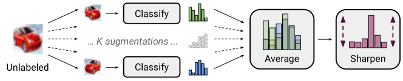
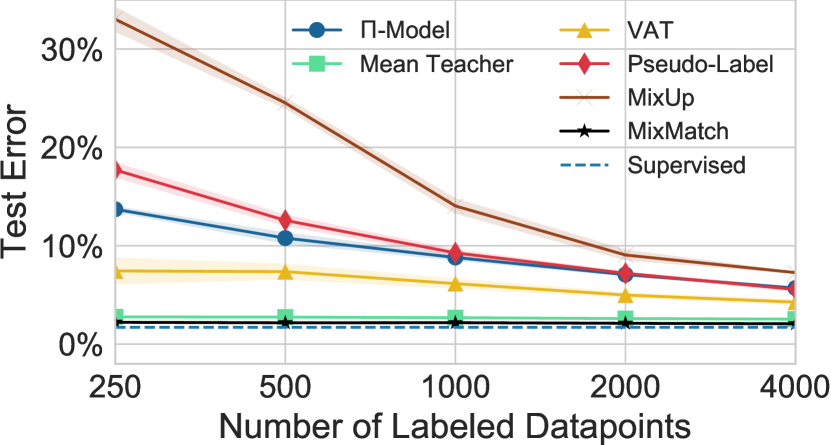

# MixMatch: 半教師あり学習への総合的アプローチ

> 原題: MixMatch: A Holistic Approach to Semi-Supervised Learning
> 著者: David Berthelot, Nicholas Carlini, Ian Goodfellow, Avital Oliver, Nicolas Papernot, Colin Raffel
> 所属: Google Research
> 出典: NeurIPS 2019 / arXiv: 1905.02249

## Abstract（要旨）

半教師あり学習は、大規模なラベル付きデータセットへの依存を軽減するためにラベルなしデータを活用する強力なパラダイムとして実証されてきた。本研究では、半教師あり学習における現在の主要なアプローチを統一して新しいアルゴリズム $\operatorname{MixMatch}$ を生み出す。このアルゴリズムは、データ拡張された未ラベル例に対して低エントロピーなラベルを推定し、$\operatorname{MixUp}$ を用いてラベルあり・なしデータを混合する。$\operatorname{MixMatch}$ は多くのデータセットおよびラベル数において、大差で最先端の結果を達成する。例えば、250 ラベルの CIFAR-10 において、エラー率を 4 倍改善し（38% から 11%）、STL-10 では 2 倍改善する。また、差分プライバシーのための精度-プライバシートレードオフを劇的に向上させる方法も示す。最後に、$\operatorname{MixMatch}$ の各構成要素のうち、その成功に最も重要なものを解明するアブレーション研究を行う。実験で使用したすべてのコードを公開する。

## 1 Introduction（はじめに）

大規模で深いニューラルネットワークを訓練する近年の成功の多くは、部分的に大規模なラベル付きデータセットの存在によるものである。しかし、多くの学習タスクではラベル付きデータの収集は高価であり、それが必然的に専門知識を必要とするためである。これは医療タスクによって最もよく示される。医療では計測に高価な機械が必要であり、ラベルは複数の専門家から引き出される時間のかかる分析の産物である。さらに、データラベルにはプライベートな情報が含まれている場合がある。これに対して、多くのタスクではラベルなしデータを取得する方がはるかに簡単またはコストが低い。

半教師あり学習 [^6] は、モデルがラベルなしデータを活用することを可能にすることで、ラベル付きデータへの必要性を大幅に軽減することを目指す。半教師あり学習への多くの最近のアプローチは、ラベルなしデータに対して計算され、モデルが未知データへより良く汎化するよう促す損失項を追加する。最近の研究の多くでは、この損失項は（セクション 2 でさらに論じる）3 つのクラスのうちの 1 つに属する：エントロピー最小化 [^18] [^28]——未ラベルデータに対してモデルが確信ある予測を出力するよう促す；一貫性正則化——入力が摂動されたときにモデルが同一の出力分布を生成するよう促す；一般的正則化——モデルが訓練データへの過学習を避けてうまく汎化するよう促す。

本論文では、半教師あり学習のためのアルゴリズム $\operatorname{MixMatch}$ を提案する。このアルゴリズムは、これらの主要な半教師あり学習アプローチを優雅に統合する単一の損失を導入する。従来の手法とは異なり、$\operatorname{MixMatch}$ はすべての性質を同時に対象とし、以下の利点につながることを示す：

- 実験的に、$\operatorname{MixMatch}$ がすべての標準的な画像ベンチマーク（セクション 4.2）で他の手法を有意に上回り、CIFAR-10 のエラー率を 4 倍改善することを示す；
- さらに、$\operatorname{MixMatch}$ がその各部分の総和以上であることをアブレーション研究で示す；
- セクション 4.3 において、$\operatorname{MixMatch}$ が差分プライバシー学習に有用であり、PATE フレームワーク [^36] の学生がプライバシー保証と精度の両方を同時に強化する新たな最先端結果を達成することを示す。

要約すると、$\operatorname{MixMatch}$ は、未ラベルデータに対して、一貫性を維持しながらエントロピーをシームレスに削減し、従来の正則化手法とも互換性のある統一された損失項を導入する。

<figure>

<figcaption>図1: MixMatch で使用されるラベル推定プロセスの図。確率的データ拡張を未ラベル画像に K 回適用し、各拡張画像を分類器に通す。次に、これらの予測の平均を、分布の温度を調整することで「シャープニング」する。完全な説明はアルゴリズム 1 を参照。</figcaption>
</figure>

## 2 Related Work（関連研究）

$\operatorname{MixMatch}$ の背景を説明するために、まず半教師あり学習の既存手法を紹介する。ここでは主に現在最先端であり $\operatorname{MixMatch}$ が基づく手法に焦点を当てる；半教師あり学習手法に関する幅広い文献（例えば「トランスダクティブ」モデル [^14] [^22] [^21]、グラフベース手法 [^49] [^4] [^29]、生成的モデリング [^3] [^27] [^41] [^9] [^17] [^23] [^38] [^34] [^42] 等）についてはここでは論じない。より包括的な概観は [^49] [^6] に提供されている。以下では、パラメータ $\theta$ を持つ入力 $x$ に対してクラスラベル $y$ の分布を生成する汎用モデル ${\rm p}_{\rm{model}}(y\mid x;\theta)$ を参照する。

### 2.1 一貫性正則化（Consistency Regularization）

教師あり学習における一般的な正則化手法はデータ拡張であり、クラスの意味を変えないと仮定される入力変換を適用する。例えば画像分類では、入力画像を弾性変形したりノイズを加えたりすることが一般的であり、画像のピクセル内容を劇的に変えながらそのラベルを変えない [^7] [^43] [^10]。大まかに言えば、これは変形された新しいデータの無限のストリームを生成することで訓練セットのサイズを人工的に拡大できる。一貫性正則化は、「分類器は、未ラベル例が拡張された後でも同じクラス分布を出力すべきである」というアイデアを活用することで、データ拡張を半教師あり学習に適用する。より形式的には、一貫性正則化は、未ラベル例 $x$ が $\operatorname{Augment}(x)$（その拡張）と同じに分類されるべきであることを強制する。

最も単純な場合、未ラベル点 $x$ に対して、先行研究 [^25] [^40] は次の損失項を追加する：

$$
\|{\rm p}_{\rm{model}}(y\mid\operatorname{Augment}(x);\theta)-{\rm p}_{\rm{model}}(y\mid\operatorname{Augment}(x);\theta)\|_{2}^{2}.
$$

$\operatorname{Augment}(x)$ は確率的変換であるため、式 1 の 2 つの項は同一ではないことに注意されたい。「Mean Teacher」[^44] は式 1 の一方の項を、モデルパラメータの指数移動平均を使用したモデルの出力で置き換える。これはより安定したターゲットを提供し、経験的に結果を有意に改善することが示された。これらのアプローチの欠点は、ドメイン固有のデータ拡張戦略を使用することである。「Virtual Adversarial Training」[^31]（VAT）は、代わりに出力クラス分布を最大限に変える入力への加法的摂動を計算することでこれに対処する。MixMatch は、標準的なデータ拡張（ランダムな水平反転とクロップ）を使用することで一貫性正則化の形を活用する。

### 2.2 エントロピー最小化（Entropy Minimization）

多くの半教師あり学習手法に共通する基本的な仮定は、分類器の決定境界が周辺データ分布の高密度領域を通るべきではないということである。これを強制する 1 つの方法は、分類器が未ラベルデータに対して低エントロピーな予測を出力することを要求することである。これは [^18] において、未ラベルデータ $x$ に対する ${\rm p}_{\rm{model}}(y\mid x;\theta)$ のエントロピーを最小化する損失項によって明示的に行われる。このエントロピー最小化の形は、より強い結果を得るために [^31] で VAT と組み合わせられた。「Pseudo-Label」[^28] は、未ラベルデータに対する高信頼度の予測からハード（1-hot）ラベルを構築し、これを標準的なクロスエントロピー損失における訓練ターゲットとして使用することで、暗黙的にエントロピー最小化を行う。MixMatch も、セクション 3.2 で説明する未ラベルデータのターゲット分布に対する「シャープニング」関数の使用を通じて、暗黙的にエントロピー最小化を達成する。

### 2.3 従来の正則化（Traditional Regularization）

正則化とは、訓練データを記憶することをモデルにとってより困難にし、それによって未知データへのより良い汎化を促すことを目的として、モデルに制約を課すという一般的なアプローチを指す [^19]。我々はモデルパラメータの $L_{2}$ ノルムにペナルティを課す重み減衰を使用する [^30] [^46]。また、例「間」の凸的な振る舞いを促すために $\operatorname{MixMatch}$ に $\operatorname{MixUp}$ [^47] を使用する。我々は $\operatorname{MixUp}$ を正則化器として（ラベルありデータポイントに適用）および半教師あり学習手法として（ラベルなしデータポイントに適用）の両方に利用する。$\operatorname{MixUp}$ は半教師あり学習に以前も適用されており；特に [^45] の同時期の研究は MixMatch で使用される方法論のサブセットを使用している。アブレーション研究（セクション 4.2.3）でその違いを明確にする。

## 3 MixMatch

このセクションでは、提案する半教師あり学習手法 $\operatorname{MixMatch}$ を紹介する。$\operatorname{MixMatch}$ は、セクション 2 で論じた SSL の主要パラダイムからのアイデアと構成要素を取り入れた「総合的な」アプローチである。one-hot ターゲット（$L$ 個の可能なラベルのうちの 1 つを表す）を持つラベルあり例のバッチ $\mathcal{X}$ と、同じサイズのラベルなし例のバッチ $\mathcal{U}$ が与えられたとき、$\operatorname{MixMatch}$ は拡張されたラベルあり例の処理済みバッチ $\mathcal{X}^{\prime}$ と、「推定」ラベルを持つ拡張されたラベルなし例のバッチ $\mathcal{U}^{\prime}$ を生成する。その後、$\mathcal{U}^{\prime}$ と $\mathcal{X}^{\prime}$ は、別々のラベルあり・なし損失項の計算に使用される。より形式的には、半教師あり学習の結合損失 $\mathcal{L}$ は次のように定義される：

$$
\mathcal{X}^{\prime}, \mathcal{U}^{\prime} = \operatorname{MixMatch}(\mathcal{X},\mathcal{U},T,K,\alpha)
$$

$$
\mathcal{L}_{\mathcal{X}} = \frac{1}{|\mathcal{X}^{\prime}|}\sum_{x,p\in\mathcal{X}^{\prime}}\operatorname{H}(p,{\rm p}_{\rm{model}}(y\mid x;\theta))
$$

$$
\mathcal{L}_{\mathcal{U}} = \frac{1}{L|\mathcal{U}^{\prime}|}\sum_{u,q\in\mathcal{U}^{\prime}}\|q-{\rm p}_{\rm{model}}(y\mid u;\theta)\|_{2}^{2}
$$

$$
\mathcal{L} = \mathcal{L}_{\mathcal{X}}+\lambda_{\mathcal{U}}\mathcal{L}_{\mathcal{U}}
$$

ここで $\operatorname{H}(p,q)$ は分布 $p$ と $q$ の間のクロスエントロピーであり、$T$、$K$、$\alpha$、$\lambda_{\mathcal{U}}$ は以下に説明するハイパーパラメータである。$\operatorname{MixMatch}$ の完全なアルゴリズムはアルゴリズム 1 に示されており、ラベル推定プロセスの図は図 1 に示されている。次に、$\operatorname{MixMatch}$ の各部分を説明する。

**アルゴリズム 1**: $\operatorname{MixMatch}$ はラベルありデータのバッチ $\mathcal{X}$ とラベルなしデータのバッチ $\mathcal{U}$ を受け取り、処理済みラベルあり例のコレクション $\mathcal{X}^{\prime}$（および推定ラベルを持つラベルなし例のコレクション $\mathcal{U}^{\prime}$）を生成する。

| ステップ | 操作 |
|---|---|
| 入力 | ラベルあり例とその one-hot ラベルのバッチ $\mathcal{X}=\big{(}(x_{b},p_{b});b\in(1,\ldots,B)\big{)}$、ラベルなし例のバッチ $\mathcal{U}=\big{(}u_{b};b\in(1,\ldots,B)\big{)}$、シャープニング温度 $T$、拡張数 $K$、$\operatorname{MixUp}$ のための $\operatorname{Beta}$ 分布パラメータ $\alpha$ |
| $b=1$ to $B$ の各繰り返し | |
| 3行目 | $\hat{x}_{b}=\operatorname{Augment}(x_{b})$ — $x_{b}$ にデータ拡張を適用 |
| $k=1$ to $K$ の各繰り返し | |
| 5行目 | $\hat{u}_{b,k}=\operatorname{Augment}(u_{b})$ — $u_{b}$ に $k$ 回目のデータ拡張を適用 |
| 7行目 | $\bar{q}_{b}=\frac{1}{K}\sum_{k}{\rm p}_{\rm{model}}(y\mid\hat{u}_{b,k};\theta)$ — $u_{b}$ のすべての拡張での平均予測を計算 |
| 8行目 | $q_{b}=\operatorname{Sharpen}(\bar{q}_{b},T)$ — 平均予測に温度シャープニングを適用（式 7 参照） |
| 10行目 | $\hat{\mathcal{X}}=\big{(}(\hat{x}_{b},p_{b});b\in(1,\ldots,B)\big{)}$ — 拡張されたラベルあり例とそのラベル |
| 11行目 | $\hat{\mathcal{U}}=\big{(}(\hat{u}_{b,k},q_{b});b\in(1,\ldots,B),k\in(1,\ldots,K)\big{)}$ — 拡張されたラベルなし例と推定ラベル |
| 12行目 | $\mathcal{W}=\operatorname{Shuffle}\big{(}\operatorname{Concat}(\hat{\mathcal{X}},\hat{\mathcal{U}})\big{)}$ — ラベルあり・なしデータを結合してシャッフル |
| 13行目 | $\mathcal{X}^{\prime}=\big{(}\operatorname{MixUp}(\hat{\mathcal{X}}_{i},\mathcal{W}_{i});i\in(1,\ldots,|\hat{\mathcal{X}}|)\big{)}$ — ラベルありデータと $\mathcal{W}$ のエントリに MixUp を適用 |
| 14行目 | $\mathcal{U}^{\prime}=\big{(}\operatorname{MixUp}(\hat{\mathcal{U}}_{i},\mathcal{W}_{i+|\hat{\mathcal{X}}|});i\in(1,\ldots,|\hat{\mathcal{U}}|)\big{)}$ — ラベルなしデータと $\mathcal{W}$ の残りに MixUp を適用 |
| 出力 | $\mathcal{X}^{\prime},\mathcal{U}^{\prime}$ |

### 3.1 データ拡張（Data Augmentation）

多くの SSL 手法で典型的なように、ラベルあり・なしデータの両方にデータ拡張を使用する。ラベルありデータのバッチ $\mathcal{X}$ における各 $x_{b}$ に対して、変換されたバージョン $\hat{x}_{b}=\operatorname{Augment}(x_{b})$ を生成する（アルゴリズム 1, 3 行目）。ラベルなしデータのバッチ $\mathcal{U}$ における各 $u_{b}$ に対して、$K$ 個の拡張 $\hat{u}_{b,k}=\operatorname{Augment}(u_{b}),k\in(1,\ldots,K)$ を生成する（アルゴリズム 1, 5 行目）。これらの個別の拡張を使用して、次のサブセクションで説明するプロセスを通じて各 $u_{b}$ の「推定ラベル」$q_{b}$ を生成する。

### 3.2 ラベル推定（Label Guessing）

$\mathcal{U}$ の各ラベルなし例に対して、$\operatorname{MixMatch}$ はモデルの予測を使用してその例のラベルの「推定値」を生成する。この推定値は後で教師なし損失項に使用される。そのために、$u_{b}$ の $K$ 個のすべての拡張にわたるモデルの予測クラス分布の平均を次式で計算する：

$$
\bar{q}_{b}=\frac{1}{K}\sum_{k=1}^{K}{\rm p}_{\rm{model}}(y\mid\hat{u}_{b,k};\theta)
$$

（アルゴリズム 1, 7 行目）。ラベルなし例の人工的なターゲットを得るためにデータ拡張を使用することは、一貫性正則化手法 [^25] [^40] [^44] では一般的である。

##### シャープニング（Sharpening）

ラベル推定の生成において、半教師あり学習におけるエントロピー最小化の成功に着想を得た追加ステップを実行する（セクション 2.2 で論じた）。拡張にわたる平均予測 $\bar{q}_{b}$ が与えられたとき、ラベル分布のエントロピーを減少させるためにシャープニング関数を適用する。実際には、シャープニング関数として、この分類分布の「温度」を調整する一般的なアプローチ [^16] を使用する。これは次の操作として定義される：

$$
\operatorname{Sharpen}(p,T)_{i}:=p_{i}^{\frac{1}{T}}\bigg{/}\sum_{j=1}^{L}p_{j}^{\frac{1}{T}}
$$

ここで $p$ はある入力分類分布（特に $\operatorname{MixMatch}$ では、$p$ は拡張にわたる平均クラス予測 $\bar{q}_{b}$ であり、アルゴリズム 1 の 8 行目に示されている）であり、$T$ はハイパーパラメータである。$T\rightarrow 0$ となるにつれて、$\operatorname{Sharpen}(p,T)$ の出力はデルタ（「one-hot」）分布に近づく。後で $q_{b}=\operatorname{Sharpen}(\bar{q}_{b},T)$ を $u_{b}$ の拡張に対するモデルの予測のターゲットとして使用するため、温度を下げることでモデルがより低エントロピーな予測を生成することが促される。

### 3.3 MixUp

半教師あり学習のために $\operatorname{MixUp}$ を使用する。過去の SSL 研究とは異なり、ラベルあり例とラベル推定付きラベルなし例の両方を混合する（セクション 3.2 で説明したように生成される）。別々の損失項と互換性を持たせるために、$\operatorname{MixUp}$ のわずかに修正されたバージョンを定義する。対応するラベル確率 $(x_{1},p_{1}),(x_{2},p_{2})$ を持つ 2 つの例のペアに対して、$(x^{\prime},p^{\prime})$ を次のように計算する：

$$
\lambda \sim\operatorname{Beta}(\alpha,\alpha)
$$

$$
\lambda^{\prime} = \max(\lambda,1-\lambda)
$$

$$
x^{\prime} = \lambda^{\prime}x_{1}+(1-\lambda^{\prime})x_{2}
$$

$$
p^{\prime} = \lambda^{\prime}p_{1}+(1-\lambda^{\prime})p_{2}
$$

ここで $\alpha$ はハイパーパラメータである。バニラ $\operatorname{MixUp}$ は式 9 を省略する（すなわち $\lambda^{\prime}=\lambda$ と設定する）。ラベルあり・なし例が同じバッチに連結されているため、個別の損失成分を適切に計算するためにバッチの順序を保持する必要がある。これは、$x^{\prime}$ が $x_{2}$ よりも $x_{1}$ に近くなることを保証する式 9 によって達成される。$\operatorname{MixUp}$ を適用するために、まずすべての拡張されたラベルあり例とそのラベル、およびすべてのラベルなし例とその推定ラベルを次のように収集する：

$$
\hat{\mathcal{X}} = \big{(}(\hat{x}_{b},p_{b});b\in(1,\ldots,B)\big{)}
$$

$$
\hat{\mathcal{U}} = \big{(}(\hat{u}_{b,k},q_{b});b\in(1,\ldots,B),k\in(1,\ldots,K)\big{)}
$$

（アルゴリズム 1, 10〜11 行目）。次に、これらのコレクションを結合してシャッフルし、$\operatorname{MixUp}$ のデータソースとなる $\mathcal{W}$ を形成する（アルゴリズム 1, 12 行目）。$\hat{\mathcal{X}}$ の $i$ 番目の例-ラベルペアに対して、$\operatorname{MixUp}(\hat{\mathcal{X}}_{i},\mathcal{W}_{i})$ を計算してコレクション $\mathcal{X}^{\prime}$ に追加する（アルゴリズム 1, 13 行目）。$i\in(1,\ldots,|\hat{\mathcal{U}}|)$ に対して $\mathcal{U}^{\prime}_{i}=\operatorname{MixUp}(\hat{\mathcal{U}}_{i},\mathcal{W}_{i+|\hat{\mathcal{X}}|})$ を計算し、$\mathcal{X}^{\prime}$ の構築に使用されなかった $\mathcal{W}$ の残りを意図的に使用する（アルゴリズム 1, 14 行目）。まとめると、$\operatorname{MixMatch}$ は $\mathcal{X}$ を $\mathcal{X}^{\prime}$（データ拡張と $\operatorname{MixUp}$ が適用されたラベルあり例のコレクション、ラベルなし例と混合されている可能性あり）に変換する。同様に、$\mathcal{U}$ は $\mathcal{U}^{\prime}$（対応する推定ラベルを持つ各ラベルなし例の複数の拡張のコレクション）に変換される。

### 3.4 損失関数（Loss Function）

処理済みバッチ $\mathcal{X}^{\prime}$ と $\mathcal{U}^{\prime}$ が与えられたとき、式 3, 4, 5 に示される標準的な半教師あり損失を使用する。式 5 は、$\mathcal{X}^{\prime}$ からのラベルとモデル予測の間の典型的なクロスエントロピー損失と、$\mathcal{U}^{\prime}$ からの予測と推定ラベルの間の二乗 $L_{2}$ 損失を結合する。この $L_{2}$ 損失（マルチクラス Brier スコア [^5]）を式 4 で使用するのは、クロスエントロピーとは異なり有界であり、誤った予測に対してそれほど敏感でないためである。このため、これは SSL における未ラベルデータ損失として [^25] [^44] でも使用されており、予測不確実性の測定手段としても使用される [^26]。標準的な方法 [^25] [^44] [^31] [^35] と同様に、推定ラベルの計算を通じて勾配を逆伝播しない。

### 3.5 ハイパーパラメータ（Hyperparameters）

$\operatorname{MixMatch}$ は未ラベルデータを活用する複数のメカニズムを組み合わせているため、様々なハイパーパラメータを導入する——具体的には、シャープニング温度 $T$、未ラベル拡張数 $K$、$\operatorname{MixUp}$ の $\operatorname{Beta}$ のための $\alpha$ パラメータ、および教師なし損失重み $\lambda_{\mathcal{U}}$ である。実際、多くのハイパーパラメータを持つ半教師あり学習手法は、小さな検証セットではクロスバリデーションが困難であるため問題となる可能性がある [^35] [^39] [^35]。しかし、実際には $\operatorname{MixMatch}$ のほとんどのハイパーパラメータは固定でき、実験やデータセットごとに調整する必要がないことが分かっている。具体的には、すべての実験で $T=0.5$ および $K=2$ に設定する。さらに、$\alpha$ と $\lambda_{\mathcal{U}}$ のみをデータセットごとに変更する；調整の出発点として $\alpha=0.75$ と $\lambda_{\mathcal{U}}=100$ が良いことが分かった。すべての実験で、[^44] で一般的な実践として行われているように、訓練の最初の 16,000 ステップにわたって $\lambda_{\mathcal{U}}$ をその最大値まで線形にランプアップする。

## 4 Experiments（実験）

標準的な SSL ベンチマーク（セクション 4.2）で $\operatorname{MixMatch}$ の有効性を検証する。アブレーション研究により $\operatorname{MixMatch}$ の各構成要素の貢献を解明する（セクション 4.2.3）。追加の応用として、セクション 4.3 でプライバシー保護学習を検討する。

### 4.1 実装の詳細（Implementation Details）

特に断りのない限り、すべての実験で [^35] の「Wide ResNet-28」モデルを使用する。モデルとトレーニング手順の実装は、以下の違いを除いて [^35] のそれと密接に一致する：まず、学習率を減衰させる代わりに、減衰率 0.999 のパラメータの指数移動平均を使用してモデルを評価する。次に、Wide ResNet-28 モデルの各更新に対して重み減衰 0.0004 を適用する。最後に、$2^{16}$ 訓練サンプルごとにチェックポイントを作成し、最後の 20 チェックポイントの中央値エラー率を報告する。これにより、例えばチェックポイントを平均化したり [^2]、最低検証エラーのチェックポイントを選択したりすることによる潜在的な精度コストで分析が簡略化される。

### 4.2 半教師あり学習（Semi-Supervised Learning）

まず、4 つの標準的なベンチマークデータセット：CIFAR-10 および CIFAR-100 [^24]、SVHN [^32]、STL-10 [^8] において $\operatorname{MixMatch}$ の有効性を評価する。最初の 3 つのデータセットでの半教師あり学習の評価における標準的な実践は、データセットのほとんどをラベルなしとして扱い、小部分をラベルあきデータとして使用することである。STL-10 は半教師あり学習専用に設計されたデータセットであり、5,000 枚のラベルあき画像と、ラベルあきデータとはわずかに異なる分布から引き出された 100,000 枚のラベルなし画像を含む。

#### 4.2.1 ベースライン手法（Baseline Methods）

ベースラインとして、[^35] で考慮された 4 つの手法（$\Pi$-Model [^25] [^40]、Mean Teacher [^44]、Virtual Adversarial Training [^31]、Pseudo-Label [^28]）を使用する（これらはセクション 2 で説明している）。また、ベースラインとして単独の $\operatorname{MixUp}$ [^47] も使用する。$\operatorname{MixUp}$ は教師あり学習のための正則化器として設計されているため、拡張されたラベルあり例と対応する予測を持つ拡張されたラベルなし例の両方に適用することで SSL 向けに修正する。$\operatorname{MixUp}$ の標準的な使用法に従い、$\operatorname{MixUp}$ が生成した推定ラベルとモデルの予測の間のクロスエントロピー損失を使用する。[^35] の提唱に従い、公平な比較を確保するために同じコードベースで各手法を再実装し、同じモデル（セクション 4.1 で説明）に適用した。各ベースライン手法のハイパーパラメータを再調整したが、これにより一般的に [^35] のものと比較してわずかな精度向上が得られ、$\operatorname{MixMatch}$ の検証のためより競争的な実験設定が提供された。

#### 4.2.2 結果（Results）

##### CIFAR-10

CIFAR-10 では、250 から 4000 のラベル数を変えながら各手法の精度を評価する（これは標準的な実践である）。結果は図 2 に示されている。CIFAR-10 では $\lambda_{\mathcal{U}}=75$ を使用した。ラベル点数ごとに異なるランダムシードで 5 つの分割を作成した。各モデルを各分割で訓練し、エラー率は分割全体の平均と分散で報告した。$\operatorname{MixMatch}$ は、例えば 4000 ラベルでエラー率 6.24% に達するなど、すべての手法を有意に上回ることが分かった。参考として、同じモデルで 50000 サンプル全体を使用した完全教師あり学習は 4.17% のエラー率を達成する。さらに、$\operatorname{MixMatch}$ は 250 ラベルのみでエラー率 11.08% を達成する。比較として、250 ラベルで次に良いパフォーマンスの手法（VAT [^31]）は 36.03% のエラー率を達成するが、これは完全教師あり学習でこのモデルが得られるエラー限界である 4.17% を考慮すると、$\operatorname{MixMatch}$ より 4.5 倍以上高い。さらに、4000 ラベルで次に良いパフォーマンスの手法（Mean Teacher [^44]）は 10.36% のエラー率を達成する。これは、$\operatorname{MixMatch}$ が 1/16 のラベル数で同様のパフォーマンスを達成できることを示唆している。SSL の中心であるサンプル効率性を明らかにするため、ラベルデータが非常に少ない場合の比較が最も興味深いと考える。

##### より大きなモデルでの CIFAR-10 と CIFAR-100

一部の先行研究 [^44] [^2] では、2,600 万パラメータを持つより大きなモデルも使用されている。我々のベースモデルは [^35] で使用されているように 150 万パラメータしか持たず、これらの結果との比較を複雑にする。これらの結果とより合理的な比較を行うために、ベースの ResNet モデルの幅を増加させる効果を測定し、層ごとに 135 フィルターを持つ 28 層の Wide Resnet モデルで $\operatorname{MixMatch}$ を評価する。これにより 2,600 万パラメータが得られる。また、[^2] の対応する結果と比較するために、10,000 ラベルで CIFAR-100 においてもこのより大きなモデルで $\operatorname{MixMatch}$ を評価する。結果は表 2 に示されている。一般的に、$\operatorname{MixMatch}$ は [^2] の最良の結果に匹敵するかそれを上回るが、[^44] [^2] のモデルはより洗練された「shake-shake」正則化 [^15] も使用しているため、比較には依然として問題があることに注意する。このモデルでは重み減衰 0.0008 を使用した。CIFAR-10 では $\lambda_{\mathcal{U}}=75$、CIFAR-100 では $\lambda_{\mathcal{U}}=150$ を使用した。

**表 1**: より大きなモデル（2,600 万パラメータ）での CIFAR-10 および CIFAR-100 エラー率（それぞれ 4,000 ラベルと 10,000 ラベルで）。

| 手法 | CIFAR-10 | CIFAR-100 |
| --- | --- | --- |
| Mean Teacher [^44] | 6.28 | — |
| SWA [^2] | 5.00 | 28.80 |
| MixMatch | 4.95 ± 0.08 | 25.88 ± 0.30 |

**表 2**: 1,000 ラベル分割または 5,000 ラベル訓練セット全体を使用した STL-10 エラー率。

| 手法 | 1,000 ラベル | 5,000 ラベル |
| --- | --- | --- |
| CutOut [^12] | — | 12.74 |
| IIC [^20] | — | 11.20 |
| SWWAE [^48] | 25.70 | — |
| CC-GAN [^11] | 22.20 | — |
| MixMatch | 10.18 ± 1.46 | 5.59 |

##### SVHN と SVHN+Extra

CIFAR-10 と同様に、250 から 4000 のラベル数を変えながら各 SSL 手法の SVHN でのパフォーマンスを評価する。標準的な実践として、まず 73,257 例の訓練セットをラベルあり・なしデータに分割する設定を考える。結果は図 3 に示されている。$\lambda_{\mathcal{U}}=250$ を使用した。ここでも、ラベル点数ごとに異なるランダムシードで 5 つの分割でモデルを評価した。$\operatorname{MixMatch}$ のパフォーマンスが、すべてのラベル量において（他のすべての手法より良い）比較的一定していることが分かった。驚いたことに、追加の調整の後、Mean Teacher [^44] から非常に良いパフォーマンスを得ることができたが、そのエラー率は $\operatorname{MixMatch}$ のものよりも一貫してわずかに高かった。

SVHN には 2 つの訓練セットがあることに注意：train と extra である。完全教師あり学習では、両セットを連結してフル訓練セット（604,388 サンプル）を形成する。SSL では、歴史的な理由から extra セットは脇に置かれ、train のみが使用される（73,257 サンプル）。ラベル付きサンプルに対するラベルなしサンプルのより高い比率を示すため、未ラベルデータに train と extra の両方を活用することがより興味深いと主張する。SVHN と SVHN+Extra の両方のエラー率を表 3 に報告する。SVHN+Extra では $\alpha=0.25$、$\lambda_{\mathcal{U}}=250$ を使用し、利用可能なデータ量が多いため重み減衰を 0.000002 に低く設定した。両訓練セットで、$\operatorname{MixMatch}$ はほぼすぐに同じ訓練セットでの完全教師あり学習のパフォーマンスに近づくことが分かった——例えば、$\operatorname{MixMatch}$ は SVHN+Extra で 250 ラベルのみでエラー率 2.22% を達成するのに対し、完全教師あり学習のパフォーマンスは 1.71% である。興味深いことに、SVHN+Extra では $\operatorname{MixMatch}$ はすべてのラベル量で extra なしの SVHN での完全教師あり学習（エラー率 2.59%）を上回った。これの重要性を強調するために、次のシナリオを考える：SVHN から 73,257 例があり、250 例がラベル付きで、選択肢がある：8 倍多くのラベルなしデータを取得して $\operatorname{MixMatch}$ を使うか、293 倍多くのラベルあきデータを取得して完全教師あり学習を使うかである。我々の結果は、追加のラベルなしデータを取得して $\operatorname{MixMatch}$ を使う方が効果的であることを示唆しており、これは 293 倍多くのラベルを取得するよりもはるかに安価である可能性が高い。

**表 3**: $\operatorname{MixMatch}$ に対する SVHN と SVHN+Extra のエラー率の比較。最後の列（「All」）は対応する訓練セットのすべてのラベルを使用した完全教師あり学習のパフォーマンスを含む。

| ラベル数 | 250 | 500 | 1000 | 2000 | 4000 | All |
| --- | --- | --- | --- | --- | --- | --- |
| SVHN | 3.78 ± 0.26 | 3.64 ± 0.46 | 3.27 ± 0.31 | 3.04 ± 0.13 | 2.89 ± 0.06 | 2.59 |
| SVHN+Extra | 2.22 ± 0.08 | 2.17 ± 0.07 | 2.18 ± 0.06 | 2.12 ± 0.03 | 2.07 ± 0.05 | 1.71 |

##### STL-10

STL-10 には 10 個の定義済みフォールドで使用することを想定した 5,000 の訓練例が含まれている（最初の 5 つのみ使用）。ただし、一部の先行研究では 5,000 例全体で訓練している。したがって、両方の実験設定で比較する。1,000 例では、$\operatorname{MixMatch}$ は 1,000 例の最先端と、5,000 ラベル全体を使用した最先端の両方を上回る。表 2 のどのベースラインも同じ実験設定（すなわちモデル）を使用していないため、結果を直接比較することは難しい；しかし、$\operatorname{MixMatch}$ が 2 倍の差で最低エラーを達成しているため、これを我々の手法への信頼投票と見なす。$\lambda_{\mathcal{U}}=50$ を使用した。

#### 4.2.3 アブレーション研究（Ablation Study）

$\operatorname{MixMatch}$ は様々な半教師あり学習メカニズムを組み合わせているため、文献の既存手法と多くの共通点がある。そのため、構成要素を削除または追加した場合の効果を研究して、$\operatorname{MixMatch}$ のパフォーマンスを高める要因についての追加の洞察を提供する。具体的には、次の効果を測定する：

- $K$ 個の拡張にわたる平均クラス分布の使用、または単一の拡張に対するクラス分布の使用（すなわち $K=1$ の設定）
- 温度シャープニングの除去（すなわち $T=1$ の設定）
- ラベル推定時のモデルパラメータの指数移動平均（EMA）の使用（Mean Teacher [^44] で行われるように）
- ラベルあり例のみ、ラベルなし例のみ、ラベルあり・なし例を横断しない MixUp の実行
- Interpolation Consistency Training [^45] の使用（MixUp はラベルなしのみ、シャープニングなし、EMA パラメータでラベル推定を行うこのアブレーション研究の特殊ケースとして見なせる）

250 ラベルと 4,000 ラベルの CIFAR-10 でアブレーションを実施した；結果は表 4 に示されている。各構成要素が $\operatorname{MixMatch}$ のパフォーマンスに貢献しており、250 ラベル設定で最も劇的な違いが見られることが分かった。SVHN（図 3）での Mean Teacher の有効性にもかかわらず、同様の EMA パラメータ値を使用することは $\operatorname{MixMatch}$ のパフォーマンスをわずかに損なうことが分かった。

**表 4**: アブレーション研究の結果。すべての値は 250 または 4,000 ラベルを使用した CIFAR-10 のエラー率。

| アブレーション | 250 ラベル | 4,000 ラベル |
| --- | --- | --- |
| MixMatch | 11.80 | 6.00 |
| 分布平均なしの MixMatch（K=1） | 17.09 | 8.06 |
| K=3 の MixMatch | 11.55 | 6.23 |
| K=4 の MixMatch | 12.45 | 5.88 |
| 温度シャープニングなしの MixMatch（T=1） | 27.83 | 10.59 |
| パラメータ EMA ありの MixMatch | 11.86 | 6.47 |
| MixUp なしの MixMatch | 39.11 | 10.97 |
| ラベルあきのみの MixUp を使用した MixMatch | 32.16 | 9.22 |
| ラベルなしのみの MixUp を使用した MixMatch | 12.35 | 6.83 |
| 別々のラベルあり・なし MixUp を使用した MixMatch | 12.26 | 6.50 |
| Interpolation Consistency Training [^45] | 38.60 | 6.81 |

### 4.3 プライバシー保護学習と汎化（Privacy-Preserving Learning and Generalization）

プライバシーを持つ学習により、我々のアプローチの汎化能力を測定できる。実際、訓練データのプライバシーを保護することは、モデルが過学習しないことを証明することに相当する：学習アルゴリズムは、その訓練サンプルのいずれかを追加、修正、または削除してもモデルパラメータに統計的に有意な差をもたらさないことが保証される場合、差分プライベートである（プライバシーの最も広く受け入れられている技術的定義）[^13]。このため、差分プライバシーを持つ学習は実際に正則化の形である [^33]。各訓練データアクセスは潜在的なプライバシー漏洩を構成し、入力とそのラベルのペアとしてエンコードされる。したがって、DP-SGD [^1] や PATE [^36] などのプライベート訓練データからのディープラーニングのアプローチは、モデルパラメータへの更新を計算する際にできるだけ少ないラベル付きプライベート訓練点にアクセスすることから恩恵を受ける。半教師あり学習はこの設定に自然に適している。

我々はプライバシーを持つ学習のための PATE フレームワークを使用する。学生は、プライベートなラベル付き訓練データにアクセスするティーチャーのアンサンブルによってラベル付けされた公開ラベルなしデータから半教師あり方式で訓練される。学生が固定された精度に達するのに必要なラベルが少ないほど、それが提供するプライバシー保証が強くなる。ティーチャーは、学生からのラベルクエリに応答するためにノイズの多い投票メカニズムを使用し、十分に強いコンセンサスに達することができない場合はラベルの提供を選択しない場合がある。このため、$\operatorname{MixMatch}$ が PATE のパフォーマンスを向上させれば、各クラスの少数の正準的な例からの改善された汎化も示すことになる。

我々は SVHN での $\operatorname{MixMatch}$ と VAT [^31] ベースラインの精度-プライバシートレードオフを比較する。VAT は以前、プライバシー損失 $\varepsilon=4.96$ でテスト精度 91.6% の最先端を達成した [^37]。$\operatorname{MixMatch}$ はラベルが少ない点で良いパフォーマンスを発揮するため、はるかに小さいプライバシー損失 $\varepsilon=0.97$ でテスト精度 $95.21\pm 0.17\%$ を達成できる。プライバシーの度合いの測定に $e^{\varepsilon}$ が使用されるため、改善は約 $e^{4}\approx 55$ 倍である。プライバシー損失 $\varepsilon$ が 1 未満の場合はずっと強いプライバシー保証に対応する。プライベート訓練設定では、学生モデルは 10,000 の例のみを使用することに注意。

## 5 Conclusion（結論）

$\operatorname{MixMatch}$ を提案した。この半教師あり学習手法は、SSL の現在の主要パラダイムからのアイデアと構成要素を組み合わせる。半教師あり学習とプライバシー保護学習での広範な実験を通じて、$\operatorname{MixMatch}$ が研究したすべての設定において他の手法と比較して有意に改善されたパフォーマンスを示し、多くの場合においてエラー率が 2 倍以上削減されることが分かった。今後の研究では、半教師あり学習の文献から追加のアイデアをハイブリッド手法に組み込み、効果的なアルゴリズムをもたらす構成要素の探索を続けることに興味がある。別途として、半教師あり学習アルゴリズムに関する最新の研究のほとんどが画像ベンチマークで評価されている；他のドメインでの $\operatorname{MixMatch}$ の有効性を探索することに興味がある。

## Appendix A 記号と定義（Notation and Definitions）

| 記号 | 定義 |
| --- | --- |
| $\operatorname{H}(p,q)$ | 「ターゲット」分布 $p$ と「予測」分布 $q$ の間のクロスエントロピー |
| $x$ | ラベルあり例、モデルへの入力として使用 |
| $p$ | （one-hot）ラベル |
| $L$ | 可能なラベルクラスの数（$p$ の次元数） |
| $\mathcal{X}$ | ラベルあり例とそのラベルのバッチ |
| $\mathcal{X}^{\prime}$ | $\operatorname{MixMatch}$ によって生成された処理済みラベルあり例のバッチ |
| $u$ | ラベルなし例、モデルへの入力として使用 |
| $q$ | ラベルなし例の推定ラベル分布 |
| $\mathcal{U}$ | ラベルなし例のバッチ |
| $\mathcal{U}^{\prime}$ | $\operatorname{MixMatch}$ によって生成された推定ラベルを持つ処理済みラベルなし例のバッチ |
| $\theta$ | モデルのパラメータ |
| ${\rm p}_{\rm{model}}(y\mid x;\theta)$ | クラスにわたるモデルの予測分布 |
| $\operatorname{Augment}(x)$ | $x$ の修正バージョンを返す確率的データ拡張関数 |
| $\lambda_{\mathcal{U}}$ | 訓練損失への未ラベル例の貢献を重み付けするハイパーパラメータ |
| $\alpha$ | $\operatorname{MixUp}$ で使用される $\operatorname{Beta}$ 分布のハイパーパラメータ |
| $T$ | $\operatorname{MixMatch}$ で使用されるシャープニングの温度パラメータ |
| $K$ | $\operatorname{MixMatch}$ でラベルを推定する際に使用される拡張数 |

## Appendix B 表形式の結果（Tabular Results）

### B.1 CIFAR-10

同じモデルで 50,000 例全体の訓練セットを使用した教師あり学習は、エラー率 4.13% を達成した。

**表 5**: CIFAR-10 のエラー率（%）。

| 手法 / ラベル数 | 250 | 500 | 1000 | 2000 | 4000 |
| --- | --- | --- | --- | --- | --- |
| PiModel | 53.02 ± 2.05 | 41.82 ± 1.52 | 31.53 ± 0.98 | 23.07 ± 0.66 | 17.41 ± 0.37 |
| PseudoLabel | 49.98 ± 1.17 | 40.55 ± 1.70 | 30.91 ± 1.73 | 21.96 ± 0.42 | 16.21 ± 0.11 |
| Mixup | 47.43 ± 0.92 | 36.17 ± 1.36 | 25.72 ± 0.66 | 18.14 ± 1.06 | 13.15 ± 0.20 |
| VAT | 36.03 ± 2.82 | 26.11 ± 1.52 | 18.68 ± 0.40 | 14.40 ± 0.15 | 11.05 ± 0.31 |
| MeanTeacher | 47.32 ± 4.71 | 42.01 ± 5.86 | 17.32 ± 4.00 | 12.17 ± 0.22 | 10.36 ± 0.25 |
| MixMatch | **11.08 ± 0.87** | **9.65 ± 0.94** | **7.75 ± 0.32** | **7.03 ± 0.15** | **6.24 ± 0.06** |

### B.2 SVHN

同じモデルで 73,257 例全体の訓練セットを使用した教師あり学習は、エラー率 2.59% を達成した。

**表 6**: SVHN のエラー率（%）。

| 手法 / ラベル数 | 250 | 500 | 1000 | 2000 | 4000 |
| --- | --- | --- | --- | --- | --- |
| PiModel | 17.65 ± 0.27 | 11.44 ± 0.39 | 8.60 ± 0.18 | 6.94 ± 0.27 | 5.57 ± 0.14 |
| PseudoLabel | 21.16 ± 0.88 | 14.35 ± 0.37 | 10.19 ± 0.41 | 7.54 ± 0.27 | 5.71 ± 0.07 |
| Mixup | 39.97 ± 1.89 | 29.62 ± 1.54 | 16.79 ± 0.63 | 10.47 ± 0.48 | 7.96 ± 0.14 |
| VAT | 8.41 ± 1.01 | 7.44 ± 0.79 | 5.98 ± 0.21 | 4.85 ± 0.23 | 4.20 ± 0.15 |
| MeanTeacher | 6.45 ± 2.43 | 3.82 ± 0.17 | 3.75 ± 0.10 | 3.51 ± 0.09 | 3.39 ± 0.11 |
| MixMatch | **3.78 ± 0.26** | **3.64 ± 0.46** | **3.27 ± 0.31** | **3.04 ± 0.13** | **2.89 ± 0.06** |

### B.3 SVHN+Extra

同じモデルで 604,388 例全体の訓練セットを使用した教師あり学習は、エラー率 1.71% を達成した。

**表 7**: SVHN+Extra のエラー率（%）。

| 手法 / ラベル数 | 250 | 500 | 1000 | 2000 | 4000 |
| --- | --- | --- | --- | --- | --- |
| PiModel | 13.71 ± 0.32 | 10.78 ± 0.59 | 8.81 ± 0.33 | 7.07 ± 0.19 | 5.70 ± 0.13 |
| PseudoLabel | 17.71 ± 0.78 | 12.58 ± 0.59 | 9.28 ± 0.38 | 7.20 ± 0.18 | 5.56 ± 0.27 |
| Mixup | 33.03 ± 1.29 | 24.52 ± 0.59 | 14.05 ± 0.79 | 9.06 ± 0.55 | 7.27 ± 0.12 |
| VAT | 7.44 ± 1.38 | 7.37 ± 0.82 | 6.15 ± 0.53 | 4.99 ± 0.30 | 4.27 ± 0.30 |
| MeanTeacher | 2.77 ± 0.10 | 2.75 ± 0.07 | 2.69 ± 0.08 | 2.60 ± 0.04 | 2.54 ± 0.03 |
| MixMatch | **2.22 ± 0.08** | **2.17 ± 0.07** | **2.18 ± 0.06** | **2.12 ± 0.03** | **2.07 ± 0.05** |

<figure>

<figcaption>図4: SVHN+Extra においてラベル数を変えながらベースライン手法と MixMatch のエラー率の比較。250 例でこのモデルに対して教師あり学習と比較してほぼ最先端に達する。</figcaption>
</figure>

## Appendix C 13 層 ConvNet の結果（13-layer ConvNet Results）

半教師あり学習に関する初期の研究では 13 層畳み込みネットワークアーキテクチャが使用されていた [^31] [^44] [^25]。表 8 に同様のアーキテクチャでの結果を示す。異なる実装とトレーニングプロセスを使用しているため [^35]、これらの数値を先行研究と直接比較することには注意が必要である。

**表 8**: 13 層畳み込みネットワークアーキテクチャでの結果（精度 %）。

| 手法 | CIFAR-10 250 | CIFAR-10 4000 | SVHN 250 | SVHN 1000 |
| --- | --- | --- | --- | --- |
| Mean Teacher | 46.34 | 88.57 | 94.00 | 96.00 |
| MixMatch | 85.69 | 93.16 | 96.41 | 96.61 |
