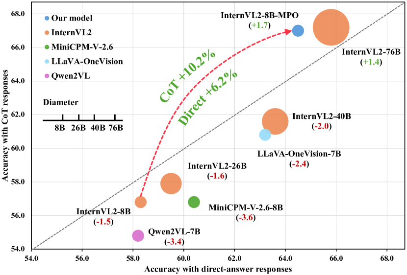
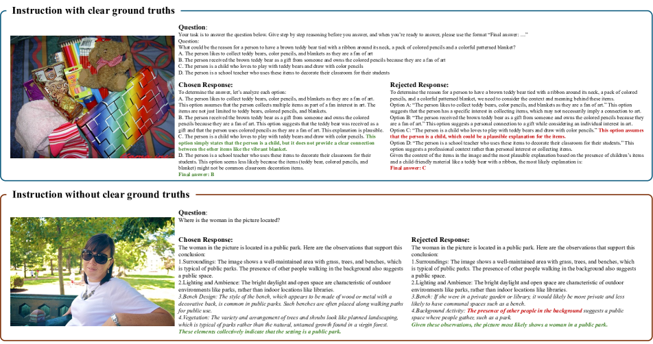
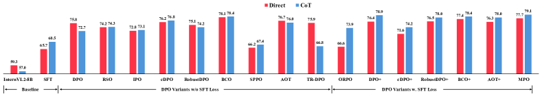

# Mixed Preference Optimization によるマルチモーダル大規模言語モデルの推論能力強化

> 原題: Enhancing the Reasoning Ability of Multimodal Large Language Models via Mixed Preference Optimization
> 著者: Weiyun Wang, Zhe Chen, Wenhai Wang, Yue Cao, Yangzhou Liu, Zhangwei Gao, Jinguo Zhu, Xizhou Zhu, Lewei Lu, Yu Qiao, Jifeng Dai
> 所属: OpenGVLab Shanghai AI Laboratory / Fudan University / Nanjing University / The Chinese University of Hong Kong / Tsinghua University / SenseTime Research
> 出典: arXiv:2411.10442（2024 年 11 月）
> プロジェクトページ: <https://internvl.github.io/blog/2024-11-14-InternVL-2.0-MPO/>

---

## Abstract（要旨）

既存のオープンソース・マルチモーダル大規模言語モデル（MLLMs）は通常、**事前学習と教師あり微調整（SFT）** を含む訓練プロセスに従う。しかし、これらモデルは **分布シフト** に悩まされ、特に **Chain-of-Thought (CoT) 性能** におけるマルチモーダル推論を制限する。これに対処するため、本研究では **Preference Optimization (PO) プロセス** を導入し、MLLMs のマルチモーダル推論能力を強化する。具体的には: (1) **データ面**で、自動選好データ構築パイプラインを設計し、**MMPR**（高品質・大規模マルチモーダル推論選好データセット）を作成する。(2) **モデル面** で、PO と MLLMs の統合を探求し、シンプルかつ効果的な手法 **Mixed Preference Optimization (MPO)** を開発、マルチモーダル CoT 性能を向上させる。本アプローチは複数ベンチマークで性能向上を示し、特にマルチモーダル推論タスクで顕著。注目すべきは、本モデル **InternVL2-8B-MPO が MathVista で 67.0% の精度を達成**、InternVL2-8B を **8.7 ポイント上回り**、**10× 大きな InternVL2-76B と同等性能** を実現したこと。本研究が MLLMs のさらなる発展を促進することを願う。コード、データ、モデルは公開予定。

---

## 1. Introduction（はじめに）

<figure>

<figcaption>図1: MathVista でのオープンソースモデル性能。X 軸と Y 軸はそれぞれ直接応答と CoT 応答での精度。バブルサイズはモデルパラメータ数に正比例。括弧内は CoT と直接応答の性能差。注目すべきは、ほとんどのオープンソースモデルが CoT で応答する際に性能が低下することである。</figcaption>
</figure>

LLM の自然言語処理分野での目覚ましい成功に伴い、**事前学習 + 教師あり微調整（SFT）** という訓練パラダイムがマルチモーダル分野にも広がり、MLLMs の研究開発の主要選択肢となった。大規模事前学習コーパスと高品質 SFT データの恩恵により、一連のオープンソース MLLMs が多様なドメインとタスクで強力な性能を発揮し、GPT-4o や Gemini のような商用モデルに匹敵する結果を出すものさえある。

しかし、**オープンソース MLLMs は依然として限定的な推論能力を示す**。図 1 が示すように、InternVL2-8B はマルチモーダル推論ベンチマーク MathVista で直接応答時に 58.3 を達成するが、**Chain-of-Thought (CoT) 推論を使うと 56.8 に低下**、CoT 推論が実際に性能を下げることを示す。この低下はオープンソース MLLMs で広く観察される現象である。我々はこの現象を主に **SFT 損失が導入する分布シフト** によるものと考える。SFT は **teacher forcing** に依存し、モデルは前の正解トークンに基づいて次のトークンを予測するよう訓練される。しかし推論時、モデルは自身の過去出力に基づいて各トークンを予測する必要があり、訓練と推論の間に **分布シフト** が生じる。直接応答アプローチは短い応答のみを必要とする一方、CoT 推論は長い rationale 生成を伴うため、**分布シフト問題は CoT で深刻化** する。これが CoT 推論が直接応答より悪い性能を示す原因となる。

MLLMs の CoT 推論の制限に対処するため、**Preference Optimization (PO) 技術でモデル出力を望ましい推論パターンに整列させる** 近年の NLP アプローチから着想を得る。**Direct Preference Optimization (DPO)** のような手法は、選好信号からモデルを学習させ、ユーザー要件により合致した応答を生成できる。**RLHF（Reinforcement Learning from Human Feedback）** の基盤を提供する。RLHF は MLLMs でハルシネーション削減のために主に探求されてきたが、**マルチモーダル推論強化への応用は未開拓**。これらの洞察に基づき、PO で MLLMs のマルチモーダル推論能力を強化する体系的研究を実施。

**PO による MLLMs のマルチモーダル推論能力強化にはいくつかの課題がある**: (1) **限定的なマルチモーダル推論選好データと高いアノテーションコスト**。既存マルチモーダル選好データセットは主にハルシネーション問題に対応、自然画像と知覚データに焦点、科学画像と推論データが不足。これらタイプのデータのアノテーションは人間アノテータが与えられた推論プロセスを慎重に比較する必要があり、時間とコストがかかる。(2) **PO によるマルチモーダル推論改善のオープンソース手法不足**。先行研究は様々なソースからのフィードバックを使った MLLMs ファインチューニングを探求したが、これらモデルは通常 **ハルシネーションベンチマーク** で性能向上を示すが、**一般推論能力の強化はほとんどない**。したがって、PO によるマルチモーダル推論能力強化は依然として未開拓である。

本研究はこれら課題にデータ面とモデル面の両方から対処する。(1) **データ面**: **MMPR**（高品質・大規模マルチモーダル推論選好データセット）を作成する自動選好データ構築パイプラインを設計。(2) **モデル面**: 様々な PO 手法を MLLMs と組み合わせて探求、**MPO（Mixed Preference Optimization）** というシンプルかつ効果的な手法を導入。報酬モデルなしでマルチモーダル CoT 性能を向上。

具体的には、明確な正解がないサンプル用に **継続ベースのパイプライン DropoutNTP (Dropout Next Token Prediction)** を、明確な正解があるサンプル用に **正誤判定ベースのパイプライン** を提案。

- **DropoutNTP**: InternVL2-8B が生成した応答を正例とする。chosen 応答を **半分で切り詰め**、InternVL2-8B に **画像入力なし** で残り部分を完成させる。この補完が rejected 応答となる。実験結果（§5.2）が示すように、本手法は RLAIF-V の divide-and-conquer 方式に匹敵するハルシネーション削減性能を達成。
- **正誤判定ベース**: InternVL2-8B から各問題に対する複数解答をサンプリング。正解一致を chosen、不一致を rejected とする。

さらに **MPO 手法** を提案。鍵となる洞察は、**効果的な PO プロセスはモデルに以下 3 つを学習させるべき** こと: **応答ペア間の相対選好、個別応答の絶対品質、選好応答の生成プロセス**。先行マルチモーダル PO 手法と比較し、本アプローチは以下で優れる: (1) **効率的な自動データ構築パイプライン**、(2) **多様ドメインでの有効性**（推論・QA・ハルシネーション全部に優位）、(3) **SoTA 設定での改善**（InternVL2-8B 上の結果が手法の潜在能力を示す）。

**主な貢献**:
1. **効率的選好データ構築パイプライン**: 約 **300 万サンプル** の MMPR を作成
2. **MPO アルゴリズム**: InternVL2-8B-MPO が推論能力強化とハルシネーション削減
3. **広範な実験**: PO が SFT 比で推論能力を顕著に強化。**InternVL2-8B-MPO が MathVista で 67.0% の精度、ベースラインを 8.7 ポイント超え、10× 大きな InternVL2-76B と同等性能**

---

## 2. Related Work（関連研究）

**Multimodal Large Language Models**。MLLMs の進展は LLM の進展に並走。事前学習 LLM と Vision Foundation Models（VFMs）の能力を活用するため、connector で潜在空間を整列させるアプローチ、視覚特徴用に追加 fusion 層を組み込むアプローチ、視覚エンコーダ不要アーキテクチャの探求がある。高品質訓練データの構築でマルチモーダル推論能力を改善する試みもある。しかし MLLMs は依然として **事前学習 + SFT** に依存、分布シフトに苦しみ、推論能力が限定的。

**Preference Optimization**。PO は LLMs/MLLMs の進化に重要な技術。**RLHF** は人間選好を報酬信号として使い、モデルを人間選好に整列。**InstructGPT** は報酬モデルを人間選好の代理として用い、**PPO** で最大化。**DPO** は Bradley-Terry モデルに基づく効率的 PO アルゴリズム、明示的報酬モデル不要。後続研究で様々な観点から改良。NLP では推論能力強化での PO 探求が進む。**マルチモーダルではほとんどがハルシネーション削減に焦点、推論能力強化での PO の潜在能力は未開拓**。本研究は PO がハルシネーション削減だけでなく **マルチモーダル推論能力強化** にも効くことを示し、MLLM 開発での広い適用性を強調。

---

## 3. Scalable Multimodal Preference Dataset Generation（拡張可能なマルチモーダル選好データセット生成）

マルチモーダル選好データの不足に対処するため、拡張可能なデータ構築パイプラインを導入。これに基づき **MMPR（MultiModal PReference dataset）** を構築。

### 3.1 Data Engine（データエンジン）

**定義**。MMPR の各サンプルは画像 $I \in \mathcal{I}$、指示 $x \in \mathcal{X}$、chosen 応答 $y_c \in \mathcal{Y}_p$、rejected 応答 $y_r \in \mathcal{Y}_n$ から構成。$y_c$ は $y_r$ より好ましい。画像セット $\mathcal{I}$ と指示セット $\mathcal{X}$ は既存データセットから収集。初期指示モデル $M_0$ から候補応答 $y$ をサンプリング:

$$y \sim M_0(y | x, I)$$

**正解付き指示の場合**: モデルに **「Final Answer: ***」** 形式で先に推論プロセス、次に最終答えを与えるよう促す。**正解と一致する応答が正例 $\mathcal{Y}_p$**、不一致が負例 $\mathcal{Y}_n$。明確な最終答えを示せないものも $\mathcal{Y}_n$ に統合。これら正負ラベル応答から、$\mathcal{Y}_p$ から chosen $y_c$、$\mathcal{Y}_n$ から rejected $y_r$ を選択して選好ペアを構築。

**正解なし指示の場合**: **DropoutNTP (Dropout Next-Token Prediction)** を提案。equation 1 から生成した全応答を正例 $\mathcal{Y}_p$ とする。$\mathcal{Y}_p$ から応答 $y$ をサンプリングし、**応答の後ろ半分を drop**。モデルに残り部分を補完させる:

$$\tilde{y}_{\geq j} \sim M_0(\tilde{y}_{\geq j} | x, y_{<j})$$

ここで $y_{<j}$ と $y_{\geq j}$ は応答の残った部分と切り捨てた部分、**$\tilde{y}_{\geq j}$ は画像入力なしの補完**。元応答 $y = [y_{<j}, y_{\geq j}]$ が chosen $y_c$、補完応答 $\tilde{y} = [y_{<j}, \tilde{y}_{\geq j}]$ が rejected $y_r$ となる。**$M_0$ が生成する応答は完全でない可能性があるが、画像入力なしで生成された補完は画像入力ありの場合より多くのハルシネーションを導入する**ため、$y$ と $\tilde{y}$ の半順序関係は成立。

**先行手法と比較**、本データエンジンは RLAIF-V の divide-and-conquer 方式と同等の効果を持ちつつ、**より効率的**。M3CoT のデータ生成例: 本パイプラインは選好ペアあたり 571.2 トークン、RLAIF-V は 992.7 トークン → **本パイプラインは RLAIF-V の 57.5% コスト**。

### 3.2 Multimodal Preference Dataset（マルチモーダル選好データセット）

<figure>

<figcaption>図2: MMPR のデータ例。正解付き指示には正誤判定ベースのパイプラインを提案、複数解答をサンプリングし正解を chosen、不正解を rejected とする。正解なし指示には DropoutNTP で rejected を生成。Chosen と rejected の差異は斜体で強調。赤は不正解応答を強調。</figcaption>
</figure>

**データセット統計**。このパイプラインで大規模マルチモーダル選好データセット **MMPR** を構築。**正解なしサンプル約 750K + 正解ありサンプル 2.5M = 約 3M サンプル**。

- 正解なしサンプル: 指示平均 25.0 トークン、chosen 平均 211.4 / rejected 平均 171.2 トークン
- 正解ありサンプル: 指示平均 79.5 トークン、chosen 平均 300.0 / rejected 平均 350.5 トークン

**データソース**（表 1）: 多様性確保のため複数ドメインから収集。**General VQA / Science / Chart / Mathematics / OCR / Document**。Open-ended サンプル構築時は全データソースから指示収集。正誤判定ベースパイプラインでは VQA と Document を除外（生成答えの正誤を heuristic 規則で検証困難なため）。

**表1: 選好データセット構築に使用したデータセット**

| Task | Dataset |
|---|---|
| **General VQA** | VQAv2, GQA, OKVQA, IconQA |
| **Science** | AI2D, ScienceQA, M3CoT |
| **Chart** | ChartQA, DVQA, MapQA |
| **Mathematics** | GeoQA+, CLEVR-Math, Geometry3K, GEOS, GeomVerse, Geo170K |
| **OCR** | OCRVQA, InfoVQA, TextVQA, STVQA, SROIE |
| **Document** | DocVQA |

---

## 4. Improved Multimodal Large Language Model with Preference Optimization（選好最適化による MLLM の改善）

MLLMs のマルチモーダル推論能力強化のため、**MPO（Mixed Preference Optimization）** を提案。**SFT 損失と様々な PO 損失をブレンド** して訓練効果を高める。マルチモーダル入力での異なる CoT アプローチも探求。

### 4.1 Mixed Preference Optimization

**観察**: MLLMs を大規模選好データセットで DPO 訓練すると、**合理的な rationale を生成できず gibberish を出力する** ことがある。これは Smaug の分析と一致。これに対処するため MPO を導入。**応答ペア間の相対選好、個別応答の絶対品質、選好応答の生成プロセス** の 3 つを学習。

**訓練目的**。MPO は **preference loss $\mathcal{L}_p$、quality loss $\mathcal{L}_q$、generation loss $\mathcal{L}_g$** の組み合わせ:

$$\mathcal{L} = w_p \mathcal{L}_p + w_q \mathcal{L}_q + w_g \mathcal{L}_g$$

実験結果に基づき、**preference loss に DPO、quality loss に BCO を採用**。

**Preference Loss（DPO）**。Bradley-Terry モデル仮定に基づき明示的報酬モデルを不要化、以下の損失を最適化:

$$\mathcal{L}_p = -\log \sigma\left(\beta \log \frac{\pi_\theta(y_c | x)}{\pi_0(y_c | x)} - \beta \log \frac{\pi_\theta(y_r | x)}{\pi_0(y_r | x)}\right)$$

$\beta$ は KL ペナルティ係数、$x$/$y_c$/$y_r$ はユーザクエリ/chosen 応答/rejected 応答。policy モデル $\pi_\theta$ は $\pi_0$ から初期化。

**Quality Loss（BCO）**。BCO 損失は **個別応答の絶対品質を理解** させる。バイナリ分類器を訓練、logit を報酬として **chosen を 1、rejected を 0 にマップ**:

$$\mathcal{L}_q = \mathcal{L}_q^+ + \mathcal{L}_q^-$$

$$\mathcal{L}_q^+ = -\log \sigma\left(\beta \log \frac{\pi_\theta(y_c | x)}{\pi_0(y_c | x)} - \delta\right)$$

$$\mathcal{L}_q^- = -\log \sigma\left(-\left(\beta \log \frac{\pi_\theta(y_r | x)}{\pi_0(y_r | x)} - \delta\right)\right)$$

$\delta$ は **reward shift**、過去報酬の moving average で訓練安定化。

**Generation Loss（SFT loss）**。**選好応答の生成プロセスを学習**:

$$\mathcal{L}_g = -\frac{\log \pi_\theta(y_c | x)}{|y_c|}$$

### 4.2 Chain-of-Thought with Multimodal Input（マルチモーダル入力での CoT）

データサンプリング過程でモデルに **段階的分析** を求めるプロンプトを使用（直接最終答えではない）。マルチモーダルモデルは非テキスト入力を扱うため、以下の CoT 手法を導入:

1. **Background Knowledge-based CoT**: モデルが問題や画像関連の背景知識を最初に紹介、その後推論ステップと最終答え。**Science ドメイン** に適用
2. **Visual Content-based CoT**: 画像の視覚的内容を分析してから推論。**Chart, OCR, Document ドメイン** に適用
3. **Grounded CoT**: テキスト応答生成と同時に参照オブジェクトを画像の対応領域にリンク。**General VQA ドメイン** に適用

これらアプローチはマルチモーダル情報を推論プロセスに統合するだけでなく **データ多様性を強化**。背景知識や視覚的内容を応答の冒頭に含めることで、**DropoutNTP が生成する negative 応答の品質も向上**、positive と negative の品質差が極端にならないよう調整。

---

## 5. Experiments（実験）

### 5.1 Main Results（主結果）

**表2: 8 マルチモーダルベンチマークの結果**

| Model | M3CoT | MathVista | MathVision | MMVet | LLaVA-Bench | POPE | CRPE | MMHalBench |
|---|---|---|---|---|---|---|---|---|
| **Closed-Source** | | | | | | | | |
| Gemini-1.5-Pro | – | 63.9 | 19.2 | – | – | – | – | – |
| GPT-4o | 64.3 | 63.8 | 30.4 | 69.1 | 97.6 | 86.9 | 76.6 | 4.0 |
| GPT-4o-Mini | 61.9 | 52.4 | 27.3 | 66.9 | 95.4 | 85.1 | 73.1 | 3.6 |
| **Open-Source** | | | | | | | | |
| LLaVA-1.5-13B | 39.5 | 27.6 | 11.1 | 36.3 | 70.7 | 85.9 | 55.6 | 2.4 |
| Qwen2-VL-7B | 57.8 | 58.2 | 21.1 | 60.6 | 67.7 | 88.1 | 74.4 | 3.4 |
| MiniCPM-V-2-6-8B | 56.0 | 60.6 | 23.4 | 57.4 | 83.4 | 87.3 | 75.2 | 3.6 |
| LLaVA-OneVision-7B | 52.3 | 63.2 | 18.4 | 51.4 | 79.9 | 88.4 | 73.7 | 3.1 |
| **InternVL Models** | | | | | | | | |
| InternVL2-26B | 58.2 | 59.4 | 23.4 | 62.1 | 92.3 | 88.0 | 75.6 | 3.7 |
| InternVL2-40B | 63.6 | 63.7 | 21.4 | 65.5 | 100.5 | 88.4 | 77.3 | 3.9 |
| InternVL2-76B | 65.4 | 67.2 | 23.7 | 65.7 | 99.3 | 89.0 | 77.8 | 3.8 |
| InternVL2-Pro | 65.6 | 66.3 | 18.8 | 69.4 | 99.5 | 88.2 | 77.6 | 3.7 |
| **InternVL2-8B** | **59.3** | **58.3** | **20.4** | **54.2** | **73.2** | **86.9** | **75.0** | **3.3** |
| **InternVL2-8B-MPO (ours)** | **79.2** | **67.0** | **25.7** | **56.2** | **76.7** | **88.1** | **75.4** | **3.5** |

**主要観察**:
- **MathVista で 67.0% を達成**、InternVL2-8B を +8.7 上回り、**10× 大きい InternVL2-76B（67.2）と同等**
- **MathVision で 25.7% を達成、オープン MLLM 新 SOTA**
- POPE +1.2 ポイント改善（MMPR の知覚データがハルシネーション削減に効果）
- MMVet / LLaVA-Bench / CRPE / MMHal-Bench でも改善

### 5.2 Ablation Study

#### 5.2.1 Comparison between MPO and SFT

**表3: SFT と MPO の比較**（chosen 応答のみを SFT データとして使用）

| Model | Setting | M3CoT | MathVista | MMVet | POPE |
|---|---|---|---|---|---|
| InternVL2-8B | Direct | 59.3 | 58.3 | 54.2 | 86.9 |
| InternVL2-8B | CoT | 57.0 | 56.8 | 54.7 | 82.9 |
| InternVL2-8B-SFT | Direct | 63.9 | 62.7 | 54.7 | 86.5 |
| InternVL2-8B-SFT | CoT | 67.8 | 64.2 | 53.8 | 84.0 |
| **InternVL2-8B-MPO** | **Direct** | **77.2** | **64.5** | **55.1** | **87.0** |
| **InternVL2-8B-MPO** | **CoT** | **79.2** | **67.0** | **56.2** | **88.1** |

**MPO は全ベンチマークで SFT を上回る**。M3CoT で +11.4 ポイント差。SFT 単独では MMVet/POPE で CoT が direct より悪いが、**MPO では CoT が direct より良い**。

#### 5.2.2 Comparison with RLAIF-V

**表4: DropoutNTP と RLAIF-V の divide-and-conquer の比較**

| Method | Object HalBench Resp.(↓) | Ment.(↓) | MMHalBench Score | Hall.(↓) |
|---|---|---|---|---|
| InternVL2-8B | 18.4 | 8.7 | 3.3 | 40.6 |
| RLAIF-V | 7.3 | 3.9 | 3.5 | 32.3 |
| **DropoutNTP (ours)** | **7.6** | 4.1 | **3.6** | **31.3** |

**RLAIF-V と同等の性能を 57.5% コスト** で実現。MMHal-Bench でわずかに上回る。

#### 5.2.3 Effects of optimization algorithms（最適化アルゴリズム比較）

<figure>

<figcaption>図3: M3CoT で異なる選好最適化アルゴリズムで訓練したモデルの結果。X+ は X アルゴリズムを SFT 損失で拡張したもの。例: DPO+ = DPO + SFT loss。</figcaption>
</figure>

**比較対象**: DPO / RSO / IPO / cDPO / RobustDPO / BCO / SPPO / AOT / TR-DPO / ORPO。学習率 5e-6 で統一。

**観察**:
- ほぼ全 PO 手法が SFT を Direct/CoT 両方で上回る
- しかし **DPO とその変種は CoT 推論能力強化に苦戦**（CoT が direct より改善しない/悪化）
- **SFT 損失と組み合わせると全アルゴリズムが CoT 推論能力を強化** → **SFT 損失が CoT 推論能力強化の鍵**
- TR-DPO（参照モデル更新あり）は CoT で大幅悪化、**参照モデル制約が重要**
- ORPO（参照モデル不要）は他の SFT 拡張版より悪い、**参照モデル凍結が重要**
- **DPO+ と BCO+ が最良 CoT 性能** → DPO + BCO を採用、MPO へ

**表7: SFT 損失拡張版の比較**

| Method | Direct | CoT | Δ |
|---|---|---|---|
| ORPO | 66.6 | 73.9 | +7.3 |
| DPO+ | 76.4 | 78.9 | +2.5 |
| cDPO+ | 71.6 | 74.2 | +2.7 |
| RobustDPO+ | 76.5 | 78.0 | +1.5 |
| BCO+ | 77.4 | 78.4 | +1.0 |
| AOT+ | 76.3 | 78.0 | +1.7 |
| **MPO** | **77.7** | **79.1** | **+1.4** |

### 5.3 Effects on text-only performance（テキスト専用性能への影響）

**表5: テキスト専用ベンチマーク結果**

| Setting | MMLU | Gaokao | TriviaQA | NQ | C3 | Race-h | BBH | GSM8K | MATH | TheoremQA | IFEval | HumanEval | MBPP | Avg |
|---|---|---|---|---|---|---|---|---|---|---|---|---|---|---|
| Baseline | 73.2 | 75.0 | 62.0 | 28.1 | 94.2 | 90.8 | 72.7 | 75.6 | 39.5 | 15.6 | 52.3 | 69.5 | 58.8 | **62.1** |
| SFT | 71.8 | 74.4 | 63.7 | 28.2 | 94.3 | 90.6 | 72.1 | 75.5 | 40.1 | 15.8 | 53.6 | 68.3 | 58.0 | **62.0** |
| **MPO** | 71.0 | 74.8 | 64.2 | 29.3 | 94.2 | 90.6 | 71.8 | 75.0 | 40.4 | **20.8** | **56.4** | 68.9 | 61.5 | **63.0** |

**MMPR にテキスト専用データが含まれていないにもかかわらず、MPO 訓練モデルがテキスト専用ベンチで baseline を平均で上回る**。特に **TheoremQA +5.2（複雑科学問題）、IFEval +4.1（指示追従）** が顕著。

---

## 6. Conclusion（結論）

本研究では、**MLLMs のマルチモーダル推論能力強化のための Preference Optimization (PO) プロセス** を導入。**データ面**で、正解あり/なし両方の指示に適用可能な自動選好データ構築パイプラインを設計、**MMPR**（高品質・大規模マルチモーダル推論選好データセット）を作成。**モデル面**で、**Mixed Preference Optimization (MPO)** というシンプルかつ効果的な手法を提案。**応答ペア間の相対選好、個別応答の絶対品質、選好応答の生成プロセス** の 3 つを学習。結果モデル **InternVL2-8B-MPO** はベースライン InternVL2-8B と比較して推論能力強化とハルシネーション削減を実現。本研究が MLLMs のさらなる発展に資することを願う。

---

## Implementation Details（実装詳細、§7 概要）

- **データ構築**: 正解付きサンプルで最大 32 推論プロセスをサンプリング、各クエリに最大 15 選好ペア。DropoutNTP で **応答を半分で切り詰め**（25% / 75% は性能低下）、temperature 1.0
- **MPO 訓練**: global batch size 256、AdamW（β₁=0.9, β₂=0.999, weight decay 0.05）、学習率 5e-6、cosine decay、warmup 5%、KL ペナルティ係数 β=0.1、**$w_p=0.8, w_q=0.2, w_g=1.0$**、InternVL2-8B から初期化、全パラメータ訓練可、1 epoch

## More Ablation Studies（追加アブレーション、§8 概要）

- **Dropout Ratio**: DR=0.5（半分）が最良、DR=0.25 / 0.75 は悪化
- **データスケール**: 10K → 100K で性能向上、特に **CoT 性能** が data scale との正相関
- **学習率**: 5e-7 で moderate、**5e-6 で最良**、5e-5 で大幅悪化（overfitting/instability）
- **PO 係数**: $w_p=0.8, w_q=0.2$ が最良
- **SFT 係数 $w_g$**: $w_g=0.01$ では CoT が direct より悪化、**SFT 損失が CoT 推論強化の鍵**
