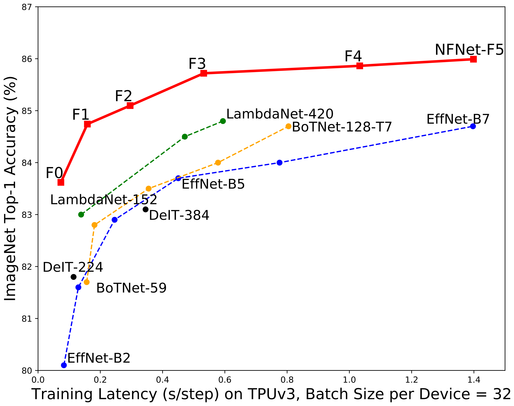
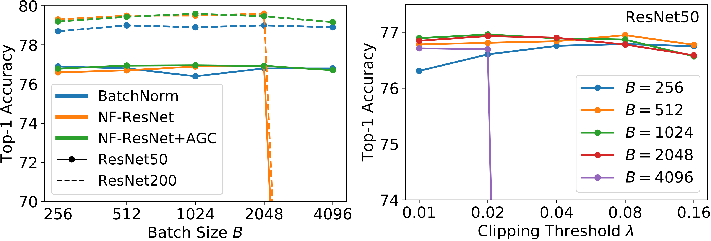
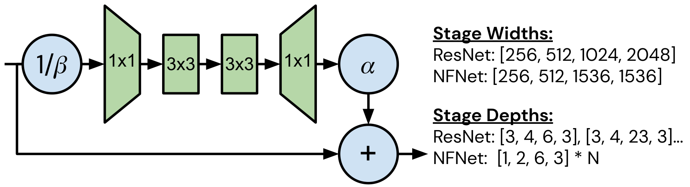
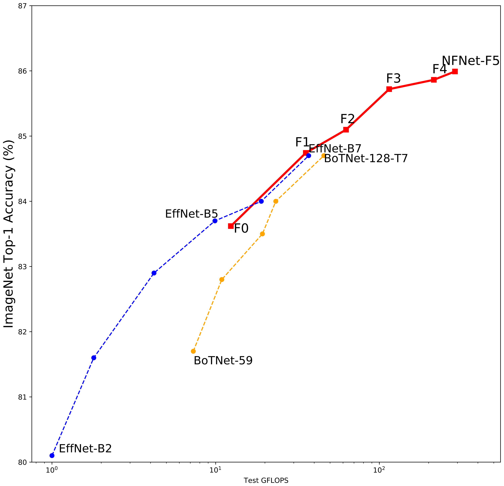
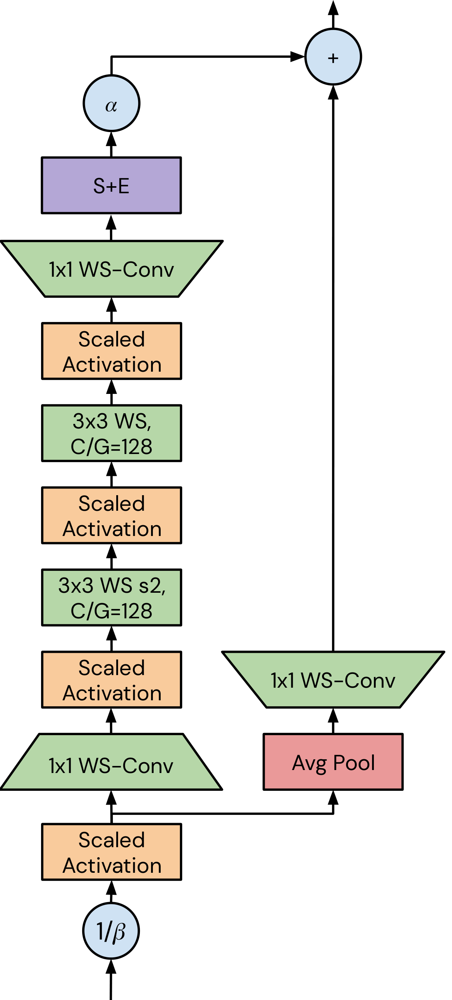
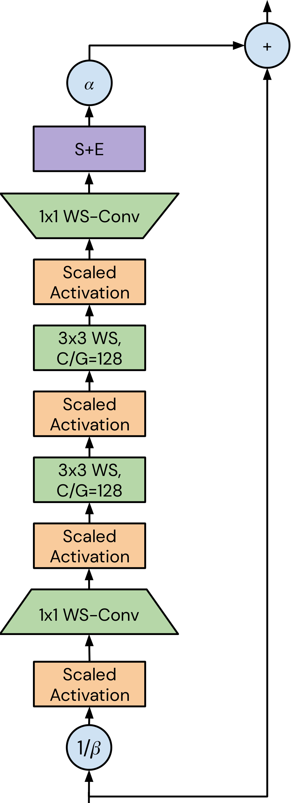
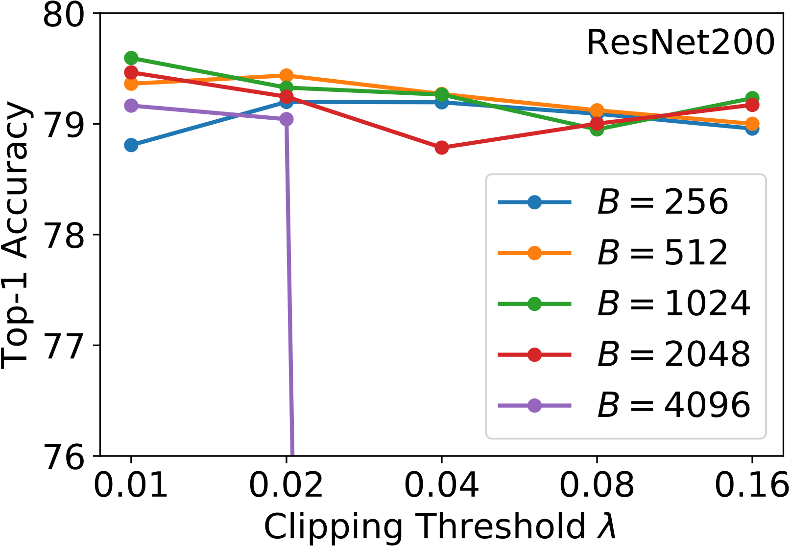
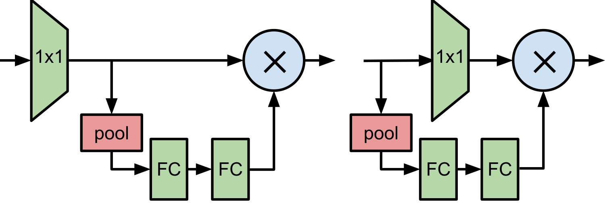

# 正規化なしの高性能・大規模画像認識

> 原題: High-Performance Large-Scale Image Recognition Without Normalization
> 著者: Andrew Brock, Soham De, Samuel L. Smith, Karen Simonyan
> 所属: DeepMind, London, United Kingdom
> 出典: arXiv:2102.06171 → ICML 2021
> コード: <https://github.com/deepmind/deepmind-research/tree/master/nfnets>

> 翻訳メモ: 本翻訳は CLAUDE.md §4 の標準ルールと異なり、**Appendix A〜E も翻訳対象に含めている**（ユーザーからの個別指示による）。References は除外。原典 markdown には画像が含まれていなかったため、図 1-8 は arXiv ソース（arXiv:2102.06171 の e-print）に同梱された PDF から生成した。

## Abstract（要旨）

バッチ正規化はほとんどの画像分類モデルの鍵となる構成要素であるが、バッチサイズへの依存と事例間の相互作用に起因する多くの望ましくない性質を持つ。最近の研究は正規化層なしで深い ResNet を訓練することに成功しているが、これらのモデルは最良のバッチ正規化されたネットワークのテスト精度に及ばず、大きな学習率や強いデータ拡張のもとでしばしば不安定である。本研究において我々は、これらの不安定性を克服する適応的勾配クリッピング（adaptive gradient clipping）の技法を開発し、大幅に改善された Normalizer-Free ResNet のクラスを設計する。我々のより小さなモデルは ImageNet において EfficientNet-B7 のテスト精度に匹敵しつつ、訓練が最大 $8.7\times$ 高速である。そして我々の最大のモデルは top-1 精度 $86.5\%$ という新しい最先端を達成する。加えて、Normalizer-Free モデルは、3 億枚のラベル付き画像のデータセットで大規模事前学習を行った後に ImageNet でファインチューニングする際、バッチ正規化された対応物よりも大幅に優れた性能を発揮し、最良のモデルは $89.2\%$ の精度を得る。

###### キーワード

機械学習, ICML, 正規化, NFNets, normalizer-free, ImageNet

## 1 Introduction（はじめに）

<figure>

<figcaption>図1: ImageNet 検証精度 vs 訓練レイテンシ。すべての数値は単一モデル・単一クロップ。我々の NFNet-F1 モデルは EffNet-B7 に匹敵する精度を、8.7× 高速な訓練で達成する。NFNet-F5 モデルは EffNet-B7 と同程度の訓練レイテンシで、ImageNet において最先端の 86.0% top-1 精度を達成する。さらに Sharpness Aware Minimization を用いてこれを改善し 86.5% top-1 精度に達する。</figcaption>
</figure>

近年のコンピュータビジョンにおけるモデルの大多数は、バッチ正規化とともに訓練される深い残差ネットワークの変種である。この 2 つのアーキテクチャ上の革新の組み合わせは、実務家が大幅に深いネットワークを訓練することを可能にし、訓練セットとテストセットの双方でより高い精度を達成できるようにした。バッチ正規化はまた損失のランドスケープを滑らかにし、これがより大きな学習率およびより大きなバッチサイズでの安定した訓練を可能にする。また正則化の効果を持つこともある。

しかし、バッチ正規化には 3 つの重大な実践上の欠点がある。**第一に、これは驚くほど高価な計算プリミティブ**であり、メモリのオーバーヘッドを生じさせ、一部のネットワークでは勾配の評価に要する時間を大幅に増加させる。**第二に、訓練時と推論時のモデルの振る舞いに乖離**を導入し、調整が必要な隠れたハイパーパラメータをもたらす。**第三に、そして最も重要なことに、バッチ正規化はミニバッチ内の訓練事例間の独立性を破壊する**。

この第三の性質は様々な負の帰結をもたらす。例えば実務家は、バッチ正規化されたネットワークが異なるハードウェア上で正確に再現することがしばしば困難であることを見出しており、バッチ正規化は特に分散訓練において微妙な実装エラーの原因となることが多い。さらに、バッチ内の訓練事例間の相互作用がネットワークに特定の損失関数を「ごまかす」ことを可能にするため、バッチ正規化は一部のタスクでは使用できない。例えばバッチ正規化は、一部の対比学習アルゴリズムにおいて情報漏洩を防ぐために特別な配慮を必要とする。これは系列モデル化のタスクにおいても大きな懸念であり、言語モデルが代替の正規化手法を採用する原動力となった。バッチ統計量が訓練中に大きな分散を持つ場合、バッチ正規化されたネットワークの性能は劣化しうる。最後に、バッチ正規化の性能はバッチサイズに敏感であり、バッチサイズが小さすぎるとバッチ正規化されたネットワークは性能が低下する。これは有限のハードウェアで訓練できる最大のモデルサイズを制限する。バッチ正規化に関連する課題については Appendix B で詳述する。

したがって、バッチ正規化は深層学習コミュニティが近年大きな進展を遂げることを可能にしてきたが、**長期的にはむしろ進歩を妨げる可能性が高い**と我々は予測する。コミュニティは、競争力のあるテスト精度を達成し、幅広いタスクで使用できる単純な代替手段を模索すべきだと我々は考える。多くの代替の正規化手法が提案されてきたが、これらの代替手法はしばしば劣ったテスト精度しか達成せず、推論時の追加の計算コストといった独自の欠点を導入する。幸いにも近年、2 つの有望な研究テーマが浮上している。第一は訓練中のバッチ正規化の恩恵の起源を研究するもの、第二は正規化層なしで深い ResNet を競争力のある精度まで訓練しようとするものである。

これらの研究の多くに共通する鍵となるテーマは、**残差分岐上の隠れ活性化のスケールを抑制することで、正規化なしに非常に深い ResNet を訓練できる**というものである。これを達成する最も単純な方法は、各残差分岐の末尾にゼロで初期化された学習可能なスカラーを導入することである。しかしこの工夫だけでは、困難なベンチマークで競争力のあるテスト精度を得るには不十分である。別の研究の流れは、ReLU 活性化が「平均シフト（mean shift）」を導入し、ネットワークの深さが増すにつれて異なる訓練事例の隠れ活性化がますます相関するようになることを示している。最近の研究で Brock ら（2021）は「Normalizer-Free」ResNet を導入した。これは初期化時に残差分岐を抑制し、平均シフトを除去するために Scaled Weight Standardization を適用する。追加の正則化を加えることで、これらの正規化なしのネットワークは ImageNet でバッチ正規化された ResNet の性能に匹敵するが、大きなバッチサイズでは安定せず、現在の最先端である EfficientNet の性能には及ばない。本論文はこの研究の流れの上に構築され、これらの中心的な限界に取り組むことを目指す。我々の主な貢献は以下の通りである。

- **Adaptive Gradient Clipping（AGC）** を提案する。これは勾配ノルムとパラメータノルムのユニット単位の比に基づいて勾配をクリップするもので、AGC が Normalizer-Free ネットワークをより大きなバッチサイズとより強いデータ拡張で訓練できるようにすることを実証する。
- **NFNets** と呼ぶ Normalizer-Free ResNet のファミリーを設計する。これは様々な訓練レイテンシにおいて ImageNet における新しい最先端の検証精度を打ち立てる（図1 参照）。NFNet-F1 モデルは EfficientNet-B7 と同様の精度を $8.7\times$ 高速な訓練で達成し、最大のモデルは**追加データなしで全体の新しい最先端である $86.5\%$ の top-1 精度**を打ち立てる。
- NFNets が、3 億枚のラベル付き画像からなる大規模な**非公開**データセットで事前学習した後に ImageNet でファインチューニングする際、バッチ正規化されたネットワークよりも大幅に高い検証精度を達成することを示す。最良のモデルはファインチューニング後に **$89.2\%$ の top-1** を達成する。

本論文の構成は以下の通りである。第2節でバッチ正規化の恩恵を、第3節で正規化なしに ResNet を訓練しようとする最近の研究を議論する。第4節で AGC を導入し、第5節で新しい最先端のアーキテクチャをどのように開発したかを述べる。最後に第6節で実験結果を提示する。

## 2 Understanding Batch Normalization（バッチ正規化を理解する）

正規化なしのネットワークを競争力のある精度まで訓練するためには、バッチ正規化が訓練中にもたらす恩恵を理解し、それらの恩恵を回復する代替戦略を特定しなければならない。ここでは先行研究によって特定された 4 つの主要な恩恵を列挙する。

**バッチ正規化は残差分岐をダウンスケールする**: スキップ接続とバッチ正規化の組み合わせは、数千層に及ぶ大幅に深いネットワークの訓練を可能にする。この恩恵は、バッチ正規化が（典型的にそうであるように）残差分岐上に置かれるとき、初期化時に残差分岐上の隠れ活性化のスケールを縮小することから生じる。これは信号をスキップ経路の方へ偏らせ、ネットワークが訓練の早期に良好な振る舞いの勾配を持つことを保証し、効率的な最適化を可能にする。

**バッチ正規化は平均シフトを除去する**: ReLU や GELU のような反対称でない活性化関数は、非ゼロの平均活性化を持つ。その結果、入力特徴の間の内積がゼロに近くても、非線形性の直後の独立した訓練事例の活性化の間の内積は典型的に大きく正になる。この問題はネットワークの深さが増すにつれて複合し、ネットワークの深さに比例して任意の単一チャネル上の異なる訓練事例の活性化に「平均シフト」を導入する。これは深いネットワークが初期化時にすべての訓練事例に対して同じラベルを予測する原因となりうる。バッチ正規化は各チャネル上の平均活性化が現在のバッチ全体でゼロになることを保証し、平均シフトを除去する。

**バッチ正規化は正則化の効果を持つ**: 訓練データの部分集合で計算されるバッチ統計量のノイズにより、バッチ正規化がテストセット精度を高める正則化器としても機能すると広く信じられている。この観点と整合して、バッチ正規化されたネットワークのテスト精度は、バッチサイズを調整したり分散訓練で ghost batch normalization を使用したりすることでしばしば改善できる。

**バッチ正規化は効率的な大バッチ訓練を可能にする**: バッチ正規化は損失のランドスケープを滑らかにし、これが最大の安定な学習率を増加させる。この性質はバッチサイズが小さいときには実践的な恩恵をもたらさないが、大きなバッチサイズで効率的に訓練したい場合、より大きな学習率で訓練できる能力は本質的である。大バッチ訓練は固定エポック予算内でより高いテスト精度を達成するわけではないが、与えられたテスト精度をより少ないパラメータ更新で達成するため、複数デバイスにまたがって並列化する際に訓練速度を大幅に改善する。

## 3 Towards Removing Batch Normalization（バッチ正規化の除去に向けて）

多くの著者が、上述したバッチ正規化の恩恵の 1 つ以上を回復することで、正規化なしに深い ResNet を競争力のある精度まで訓練しようと試みてきた。これらの研究のほとんどは、小さな定数または学習可能なスカラーを導入することで、初期化時に残差分岐上の活性化のスケールを抑制する。加えて、正規化されていない ResNet の性能は追加の正則化で改善できることが観察されている。しかし、バッチ正規化のこれら 2 つの恩恵を回復するだけでは、困難なベンチマークで競争力のあるテスト精度を達成するのに十分ではない。

本研究では「Normalizer-Free ResNets」（NF-ResNets）を採用し、その上に構築する。これは正規化層なしに競争力のある訓練精度とテスト精度まで訓練できる事前活性化 ResNet のクラスである。NF-ResNets は次の形の残差ブロックを用いる。

$$h_{i+1}=h_{i}+\alpha f_{i}(h_{i}/\beta_{i})$$

ここで $h_{i}$ は $i$ 番目の残差ブロックへの入力を、$f_{i}$ は $i$ 番目の残差分岐が計算する関数を表す。関数 $f_{i}$ は初期化時に分散保存的、すなわちすべての $i$ について $\text{Var}(f_{i}(z))=\text{Var}(z)$ となるようパラメータ化される。スカラー $\alpha$ は（初期化時に）各残差ブロックの後で活性化の分散が増加する率を指定し、典型的に $\alpha=0.2$ のような小さな値に設定される。スカラー $\beta_{i}$ は $i$ 番目の残差ブロックへの入力の標準偏差を予測することで決定され、$\beta_{i}=\sqrt{\text{Var}(h_{i})}$ である。ここで $\text{Var}(h_{i+1})=\text{Var}(h_{i})+\alpha^{2}$ となる。ただし遷移ブロック（空間的ダウンサンプリングが起こる箇所）は例外で、そこではスキップ経路がダウンスケールされた入力 $(h_{i}/\beta_{i})$ に作用し、期待される分散は遷移ブロックの後に $h_{i+1}=1+\alpha^{2}$ にリセットされる。squeeze-excite 層の出力は係数 2 で乗算される。経験的に、各残差分岐の末尾にゼロで初期化された学習可能なスカラー（「SkipInit」）を含めることも有益であることが見出されている。

加えて、隠れ活性化における平均シフトの発生を防ぐため、**Scaled Weight Standardization**（Weight Standardization の軽微な修正）が導入される。この技法は畳み込み層を次のように再パラメータ化する。

$$
\hat{W_{ij}}=\frac{W_{ij}-\mu_{i}}{\sqrt{N}\sigma_{i}},
$$

ここで $\mu_{i}=(1/N)\sum_{j}W_{ij}$、$\sigma_{i}^{2}=(1/N)\sum_{j}(W_{ij}-\mu_{i})^{2}$ であり、$N$ は fan-in を表す。活性化関数もまた非線形性に固有のスカラーゲイン $\gamma$ でスケールされ、これが $\gamma$ でスケールされた活性化関数と Scaled Weight Standardized 層の組み合わせが分散保存的であることを保証する。ReLU については $\gamma=\sqrt{2/(1-(1/\pi))}$ である。

追加の正則化（Dropout と Stochastic Depth）を加えることで、Normalizer-Free ResNet はバッチサイズ 1024 の ImageNet において、バッチ正規化された事前活性化 ResNet が達成するテスト精度に匹敵する。またバッチサイズが非常に小さいときにはバッチ正規化された対応物を大幅に上回るが、**大きなバッチサイズ（4096 以上）ではバッチ正規化されたネットワークより性能が劣る**。決定的に、EfficientNet のような最先端のネットワークの性能には及ばない。

## 4 Adaptive Gradient Clipping for Efficient Large-Batch Training（効率的な大バッチ訓練のための適応的勾配クリッピング）

NF-ResNets をより大きなバッチサイズへスケールするため、我々は様々な勾配クリッピング戦略を探求する。勾配クリッピングは言語モデル化において訓練を安定化するためにしばしば用いられ、最近の研究は勾配降下法と比較してより大きな学習率での訓練を可能にし収束を加速することを示している。これは条件の悪い損失ランドスケープや大きなバッチサイズでの訓練において特に重要である。というのも、これらの設定では最適な学習率が最大の安定な学習率によって制約されるからである。したがって我々は、**勾配クリッピングが NF-ResNets を大バッチ設定へ効率的にスケールするのに役立つはずだ**と仮説を立てる。

勾配クリッピングは典型的に勾配のノルムを制約することで行われる。具体的には、勾配ベクトル $G=\partial{L}/\partial{\theta}$（$L$ は損失、$\theta$ は全モデルパラメータのベクトル）に対して、標準的なクリッピングのアルゴリズムは $\theta$ を更新する前に勾配を次のようにクリップする。

$$
G\rightarrow\begin{cases}\lambda\frac{G}{\|G\|}&\text{if $\|G\|>\lambda$},\\
G&\text{otherwise.}\end{cases}
$$

クリッピング閾値 $\lambda$ は調整が必要なハイパーパラメータである。経験的に我々は、このクリッピングのアルゴリズムが以前より高いバッチサイズでの訓練を可能にする一方で、**訓練の安定性がクリッピング閾値の選択に極めて敏感**であり、モデルの深さ、バッチサイズ、学習率を変えるたびに細かい調整を要することを見出した。

この問題を克服するため、我々は「**Adaptive Gradient Clipping（AGC）**」を導入する。$W^{\ell}\in\mathbb{R}^{N\times M}$ を $\ell$ 番目の層の重み行列、$G^{\ell}\in\mathbb{R}^{N\times M}$ を $W^{\ell}$ に関する勾配、$\|\cdot\|_{F}$ を Frobenius ノルムとする。AGC のアルゴリズムは、**層 $\ell$ の勾配 $G^{\ell}$ のノルムと重み $W^{\ell}$ のノルムの比 $\frac{\|G^{\ell}\|_{F}}{\|W^{\ell}\|_{F}}$ が、1 回の勾配降下ステップが元の重み $W^{\ell}$ をどれだけ変化させるかの単純な尺度を提供する**という観察に動機づけられている。例えばモメンタムなしの勾配降下法で訓練する場合、$\frac{\|\Delta W^{\ell}\|}{\|W^{\ell}\|}=h\frac{\|G^{\ell}\|_{F}}{\|W^{\ell}\|_{F}}$ となる。ここで $\ell$ 番目の層のパラメータ更新は $\Delta W^{\ell}=-hG^{\ell}$ で与えられ、$h$ は学習率である。

直観的に、$(\|\Delta W^{\ell}\|/\|W^{\ell}\|)$ が大きいと訓練が不安定になると予想され、これが比 $\frac{\|G^{\ell}\|_{F}}{\|W^{\ell}\|_{F}}$ に基づくクリッピング戦略の動機となる。しかし実際には、我々は**勾配ノルムとパラメータノルムのユニット単位の比**に基づいて勾配をクリップする。これは層単位のノルム比を取るよりも経験的に良い性能を示すことを見出した。具体的には、我々の AGC アルゴリズムにおいて、$\ell$ 番目の層の勾配の各ユニット $i$（行列 $G^{\ell}$ の $i$ 番目の行として定義）は次のようにクリップされる。

$$
G^{\ell}_{i}\rightarrow\begin{cases}\lambda\frac{\|W^{\ell}_{i}\|^{\star}_{F}}{\|G^{\ell}_{i}\|_{F}}G^{\ell}_{i}&\text{if $\frac{\|G^{\ell}_{i}\|_{F}}{\|W^{\ell}_{i}\|^{\star}_{F}}>\lambda$},\\
G^{\ell}_{i}&\text{otherwise.}\end{cases}
$$

クリッピング閾値 $\lambda$ はスカラーのハイパーパラメータであり、$\|W_{i}\|^{\star}_{F}=\max(\|W_{i}\|_{F},\epsilon)$ と定義する（既定 $\epsilon=10^{-3}$）。これはゼロで初期化されたパラメータの勾配が常にゼロにクリップされることを防ぐ。畳み込みフィルタのパラメータについては、fan-in の範囲（チャネル次元と空間次元を含む）でユニット単位のノルムを評価する。AGC を用いることで、**より大きなバッチサイズ（最大 4096）で、また AGC なしでは NF-ResNets が訓練に失敗する RandAugment のような非常に強いデータ拡張とともに、安定して訓練できる**。最適なクリッピングパラメータ $\lambda$ はオプティマイザ、学習率、バッチサイズの選択に依存しうることに注意されたい。経験的に、**バッチが大きいほど $\lambda$ は小さくすべき**であることを見出した。

AGC は「正規化されたオプティマイザ」を研究する最近の研究の流れと密接に関連している。これらは勾配ノルムに反比例する適応的な学習率を選ぶことで勾配のスケールを無視する。特に LARS は、勾配の大きさを完全に無視してパラメータ更新のノルムをパラメータノルムの一定比率に設定するモメンタムの変種である。**AGC は正規化されたオプティマイザの緩和**と解釈でき、パラメータノルムに基づく最大の更新サイズを課すが、同時に更新サイズの下限を課すことも勾配の大きさを無視することもしない。LARS でも高いバッチサイズで安定して訓練できたが、そうすると性能が劣化することを見出した。

<figure>

<figcaption>図2: (a) AGC は NF-ResNets をより大きなバッチサイズへ効率的にスケールする。(b) 異なるクリッピング閾値 λ にわたる性能。</figcaption>
</figure>

### 4.1 Ablations for Adaptive Gradient Clipping (AGC)（AGC のアブレーション）

ここで AGC の有効性を検証するために設計された一連のアブレーションを提示する。ImageNet 上の事前活性化 NF-ResNet-50 と NF-ResNet-200 で、Nesterov のモメンタムを伴う SGD を用い、256 から 4096 までの範囲のバッチサイズで 90 エポック訓練する実験を行った。先行研究に従い、バッチサイズ 256 に対して基準学習率 0.1 を用い、これをバッチサイズに応じて線形にスケールする。$\lambda$ の値は [0.01, 0.02, 0.04, 0.08, 0.16] の範囲を考慮する。

図2 では、バッチ正規化された ResNet を、AGC ありとなしの NF-ResNets と比較する。各バッチサイズについて最良のクリッピング閾値 $\lambda$ でのテスト精度を示す。**AGC は NF-ResNets を大きなバッチサイズへスケールするのに役立ち、ResNet50 と ResNet200 の双方でバッチ正規化されたネットワークと同等かそれ以上の性能を維持する**ことを見出した。予想通り、**バッチサイズが小さいときは AGC を用いる恩恵は小さい**。図2 では ResNet50 上で様々なバッチサイズにわたる異なるクリッピング閾値 $\lambda$ の性能を示す。**より高いバッチサイズで安定性を得るには、より小さい（より強い）クリッピング閾値が必要**であることが分かる。追加のアブレーションの詳細は Appendix D に示す。

次に、AGC がすべての層に対して有益かどうかを研究する。バッチサイズ 4096、クリッピング閾値 $\lambda=0.01$ を用い、最初の畳み込み、最終の線形層、任意の残差ステージ内の各ブロックの異なる組み合わせから AGC を除去する。2 つの鍵となる傾向が浮かび上がる。**第一に、最終の線形層をクリップしない方が常に良い。第二に、初期の畳み込みをクリップせずに安定して訓練できることは多いが、既定の学習率 1.6 でバッチサイズ 4096 で訓練する際に安定性を達成するには 4 つのステージすべての重みをクリップしなければならない**。本論文の残りの部分（および図2 のアブレーション）では、最終の線形層を除くすべての層に AGC を適用する。

## 5 Normalizer-Free Architectures with Improved Accuracy and Training Speed（改善された精度と訓練速度を持つ Normalizer-Free アーキテクチャ）

前節では、大きなバッチサイズと強いデータ拡張で効率的に訓練できるようにする勾配クリッピングの手法 AGC を導入した。この技法を備えた上で、我々は今、最先端の精度と訓練速度を持つ Normalizer-Free アーキテクチャの設計を目指す。

画像分類における現在の最先端は一般に EfficientNet ファミリーが保持している。これらは inverted bottleneck ブロックの変種に基づき、バックボーンとモデルスケーリング戦略はニューラルアーキテクチャ探索から導かれている。これらのモデルはパラメータ数と FLOP 数を最小化しつつテスト精度を最大化するよう最適化されているが、**その低い理論的計算量は現代のアクセラレータ上での訓練速度の改善には結びつかない**。ResNet-50 の 10 分の 1 の FLOPS しか持たないにもかかわらず、EffNet-B0 は GPU や TPU で訓練したとき同程度の訓練レイテンシと最終性能を持つ。

<figure>

<figcaption>図3: NFNet の bottleneck ブロック設計とアーキテクチャ上の差異の要約。入力に 1/β を掛けてから 1×1 → 3×3 → 3×3 → 1×1 を通し、出力に α を掛けてスキップ経路と加算する。Stage Widths は ResNet の [256, 512, 1024, 2048] に対し NFNet は [256, 512, 1536, 1536]。Stage Depths は ResNet の [3, 4, 6, 3] や [3, 4, 23, 3] に対し NFNet は [1, 2, 6, 3] × N。より詳細は Appendix C の図5 を参照。</figcaption>
</figure>

**表1**: NFNet ファミリーの深さ、ドロップ率、入力解像度。

| Variant | Depth | Dropout | Train | Test |
| --- | --- | --- | --- | --- |
| F0 | [1, 2, 6, 3] | 0.2 | 192px | 256px |
| F1 | [2, 4, 12, 6] | 0.3 | 224px | 320px |
| F2 | [3, 6, 18, 9] | 0.4 | 256px | 352px |
| F3 | [4, 8, 24, 12] | 0.4 | 320px | 416px |
| F4 | [5, 10, 30, 15] | 0.5 | 384px | 512px |
| F5 | [6, 12, 36, 18] | 0.5 | 416px | 544px |
| F6 | [7, 14, 42, 21] | 0.5 | 448px | 576px |

どの指標——理論的 FLOPS、対象デバイス上の推論レイテンシ、アクセラレータ上の訓練レイテンシ——を最適化するかの選択は好みの問題であり、各指標の性質は異なる設計上の要件をもたらす。本研究では、**既存のアクセラレータ上の訓練レイテンシに最適化されたモデルを手動で設計する**ことに焦点を当てる。将来のアクセラレータは EfficientNets のようなモデルでは大部分が実現されない潜在的な訓練速度を完全に活用できるようになるかもしれないので、この方向は無視すべきでないと我々は考える。しかし、現在のハードウェア上で改善された訓練速度を持つモデルを開発することが研究の加速に有益であると予測する。GPU や TPU のようなアクセラレータは密な計算を好む傾向があり、これら 2 つのプラットフォームには差異があるものの、一方のデバイス向けに設計されたモデルは他方でも高速に訓練される可能性が高いという十分な共通点がある。

したがって我々は、ImageNet のホールドアウト top-1 と**デバイス上の実際の訓練レイテンシ**のパレートフロントを改善する設計傾向を手動で探索することでモデル設計の空間を探る。本節ではこの目的のためにうまく機能することを見出した変更を記述し（詳細は Appendix C）、うまく機能しないことを見出したアイデアは Appendix E に記述する。これらの修正の要約を図3 に、それらがホールドアウト精度に与える影響を表2 に示す。

我々は **GELU 活性化を伴う SE-ResNeXt-D モデル**から始める。これは Normalizer-Free ネットワークにとって驚くほど強力なベースラインであることを見出した。以下の変更を加える。**第一に、$3\times 3$ conv のグループ幅（各出力ユニットが接続されるチャネル数）をブロック幅によらず 128 に設定する**。より小さなグループ幅は理論的 FLOPS を減らすが、計算密度の低下は多くの現代のアクセラレータで実際の高速化が実現されないことを意味する。例えば TPUv3 では、グループ幅 8 の SE-ResNeXt-50 は、デバイスあたりのバッチサイズが 128 以上でない限り、グループ幅 128 の SE-ResNeXt-50 と同じ速度で訓練される。しかしこれはメモリ制約のためしばしば実現不可能である。

次に、モデルのバックボーンに 2 つの変更を加える。第一に、ResNet の既定の深さスケーリングのパターン（例えば ResNet50 から ResNet101 や ResNet200 を構成するために深さを増やす方法）は、第 1 と第 4 ステージで 3 ブロックを維持しつつ、第 2 と第 3 ステージの層数を非一様に増やすことを含む。**我々はこの戦略が最適ではないことを見出した**。初期のステージの層はより高い解像度で動作し、より多くのメモリと計算を必要とし、局所的でタスク汎用的な特徴を学習する傾向がある。一方で後のステージの層はより低い解像度で動作し、モデルのパラメータの大部分を含み、よりタスク固有の特徴を学習する。しかし、（積極的なダウンサンプリングなどによって）初期のステージに過度に切り詰めることは性能を害しうる。モデルは良い局所特徴を抽出するのに十分な容量を必要とするからである。またより深い変種を構成するための単純なスケーリング則を持つことも望ましい。これらの原則を念頭に、我々は最小のモデル変種 F0 のためにいくつかのバックボーンの選択肢を探求し、**単純なパターン $[1,2,6,3]$**（各ステージに割り当てる bottleneck ブロック数）に落ち着いた。より深い変種は各ステージの深さをスカラー $N$ で乗じることで構成する。例えば変種 F1 は深さパターン $[2,4,12,6]$、変種 F4 は $[5,10,30,15]$ となる。

**表2**: アーキテクチャ上の修正とデータ拡張が ImageNet Top-1 精度に与える影響（3 シードで平均）。

|  | F0 | F1 | F2 | F3 |
| --- | --- | --- | --- | --- |
| Baseline | 80.4 | 81.7 | 82.0 | 82.3 |
| + Modified Width | 80.9 | 81.8 | 82.0 | 82.3 |
| + Second Conv | 81.3 | 82.2 | 82.4 | 82.7 |
| + MixUp | 82.2 | 82.9 | 83.1 | 83.5 |
| + RandAugment | 83.2 | 84.6 | 84.8 | 85.0 |
| **+ CutMix** | **83.6** | **84.7** | **85.1** | **85.7** |
| Default Width + Augs | 83.1 | 84.5 | 85.0 | 85.5 |

加えて、ResNet の既定の幅パターン（第 1 ステージが 256 チャネルを持ち、後続の各ステージで倍増して $[256,512,1024,2048]$ となる）を再考する。上述の深さパターンを採用した上で、様々な代替パターンを検討したが、**この既定より良い選択肢は 1 つだけ、$[256,512,1536,1536]$ であった**。この幅パターンは、第 4 ステージの容量をわずかに減らしつつ第 3 ステージの容量を増やすよう設計されており、訓練速度をおおむね保持する。我々の選んだ深さパターンおよび ResNet の既定設計と整合して、**第 3 ステージが容量を追加する最良の場所である**ことを見出した。これは、このステージが大きな受容野とより深い特徴階層へのアクセスを持つのに十分深く、かつ最終ステージよりわずかに高い解像度を持つためだと我々は仮説を立てる。

我々はまた bottleneck 残差ブロック自体の構造も検討する。既存および新規の様々な修正を検討したが（Appendix E 参照）、**最良の改善は最初のグループ化 conv の後に追加の $3\times 3$ グループ化 conv を（対応する非線形性とともに）加えることから得られた**。この追加の畳み込みは FLOPS への影響が最小限で、対象アクセラレータ上の訓練時間にほとんど影響しない。

最後に、異なる計算予算でモデル変種を生成するスケーリング戦略を確立する。EfficientNet のスケーリング戦略はモデルの幅・深さ・入力解像度を同時にスケールするもので、非常に細い MobileNet 的なバックボーンを持つ基本モデルには極めてうまく機能する。しかし我々は、**ResNet バックボーンには幅のスケーリングが効果的でない**ことを見出した。したがって我々も深さと入力解像度のみをスケールする戦略を採用し、上述の固定された幅パターンを用い、深さを上述のようにスケールし、各変種が前の変種のおよそ半分の速度で訓練されるよう訓練解像度をスケールする。先行研究に従い、推論時には訓練時よりわずかに高い解像度で画像を評価する。各変種について訓練解像度のおよそ 33% 大きい値を選ぶ。**この高い解像度でのファインチューニングは行わない**。

またモデル容量が上がるにつれて正則化の強度を上げることが有益であることも見出した。しかし weight decay や stochastic depth 率の変更は効果的でなく、代わりに Dropout のドロップ率をスケールする。**このステップは特に重要**である。我々のモデルはバッチ正規化の暗黙的な正則化を欠いており、明示的な正則化なしでは劇的に過学習する傾向があるからである。結果として得られるモデルは高性能であり、訓練レイテンシに最適化されているにもかかわらず、FLOPs 対精度の点でより大きな EfficientNet 変種と競争力を保っている（ただしパラメータ対精度の点ではそうではない）。Appendix A の図4 を参照。

### 5.1 Summary（まとめ）

我々の訓練レシピは次のように要約できる。**第一に、Normalizer-Free の設定を SE-ResNeXt-D に適用し、幅と深さのパターンを修正し、第 2 の空間畳み込みを加える。第二に、分類器層の線形重みを除くすべてのパラメータに AGC を適用する。** バッチサイズ 1024 から 4096 に対しては $\lambda=0.01$ に設定し、強い正則化とデータ拡張を用いる。各モデル変種の追加情報は表1 を参照。

## 6 Experiments（実験）

**表3**: NFNets と代表的なモデル群（SENet、LambdaNet、BoTNet、DeiT を含む）の ImageNet 精度比較。SAM を用いた結果を除き、我々の結果は 3 つのランダムシードで平均されている。レイテンシは TPU または GPU（V100）上で単一の完全な訓練ステップを実行するのに要する時間（ミリ秒）。

| Model | #FLOPs | #Params | Top-1 | Top-5 | TPUv3 Train | GPU Train |
| --- | --- | --- | --- | --- | --- | --- |
| ResNet-50 | 4.10 B | 26.0 M | 78.6 | 94.3 | 41.6 ms | 35.3 ms |
| EffNet-B0 | 0.39 B | 5.3 M | 77.1 | 93.3 | 51.1 ms | 44.8 ms |
| SENet-50 | 4.09 B | 28.0 M | 79.4 | 94.6 | 64.3 ms | 59.4 ms |
| **NFNet-F0** | 12.38 B | 71.5 M | **83.6** | 96.8 | 73.3 ms | 56.7 ms |
| EffNet-B3 | 1.80 B | 12.0 M | 81.6 | 95.7 | 129.5 ms | 116.6 ms |
| LambdaNet-152 | – | 51.5 M | 83.0 | 96.3 | 138.3 ms | 135.2 ms |
| SENet-152 | 19.04 B | 66.6 M | 83.1 | 96.4 | 149.9 ms | 151.2 ms |
| BoTNet-110 | 10.90 B | 54.7 M | 82.8 | 96.3 | 181.3 ms | – |
| **NFNet-F1** | 35.54 B | 132.6 M | **84.7** | 97.1 | **158.5 ms** | 133.9 ms |
| EffNet-B4 | 4.20 B | 19.0 M | 82.9 | 96.4 | 245.9 ms | 221.6 ms |
| BoTNet-128-T5 | 19.30 B | 75.1 M | 83.5 | 96.5 | 355.2 ms | – |
| **NFNet-F2** | 62.59 B | 193.8 M | **85.1** | 97.3 | 295.8 ms | 226.3 ms |
| SENet-350 | 52.90 B | 115.2 M | 83.8 | 96.6 | 593.6 ms | – |
| EffNet-B5 | 9.90 B | 30.0 M | 83.7 | 96.7 | 450.5 ms | 458.9 ms |
| LambdaNet-350 | – | 105.8 M | 84.5 | 97.0 | 471.4 ms | – |
| BoTNet-77-T6 | 23.30 B | 53.9 M | 84.0 | 96.7 | 578.1 ms | – |
| **NFNet-F3** | 114.76 B | 254.9 M | **85.7** | 97.5 | 532.2 ms | 524.5 ms |
| LambdaNet-420 | – | 124.8 M | 84.8 | 97.0 | 593.9 ms | – |
| EffNet-B6 | 19.00 B | 43.0 M | 84.0 | 96.8 | 775.7 ms | 868.2 ms |
| BoTNet-128-T7 | 45.80 B | 75.1 M | 84.7 | 97.0 | 804.5 ms | – |
| **NFNet-F4** | 215.24 B | 316.1 M | **85.9** | 97.6 | 1033.3 ms | 1190.6 ms |
| EffNet-B7 | 37.00 B | 66.0 M | 84.7 | 97.0 | **1397.0 ms** | 1753.3 ms |
| DeiT 1000 epochs | – | 87.0 M | 85.2 | – | – | – |
| EffNet-B8 + MaxUp | 62.50 B | 87.4 M | 85.8 | – | – | – |
| **NFNet-F5** | 289.76 B | 377.2 M | **86.0** | 97.6 | 1398.5 ms | 2177.1 ms |
| **NFNet-F5 + SAM** | 289.76 B | 377.2 M | **86.3** | 97.9 | 1958.0 ms | – |
| **NFNet-F6 + SAM** | 377.28 B | 438.4 M | **86.5** | 97.9 | 2774.1 ms | – |

### 6.1 Evaluating NFNets on ImageNet（ImageNet における NFNets の評価）

ここで NFNet モデルを ImageNet で評価することに注意を向ける。まず、バッチサイズ 4096 で 360 エポック訓練したときのアーキテクチャ上の修正のアブレーションから始める。モメンタム係数 0.9 の Nesterov のモメンタム、第4節で述べたクリッピング閾値 0.01 の AGC、5 エポックにわたって 0 から 1.6 へ線形に増加した後にコサインアニーリングでゼロへ減衰する学習率を用いる。表2 の最初の 3 行から、我々がモデルに加えた 2 つの変更がそれぞれ、訓練レイテンシの軽微な変化のみで性能のわずかな改善をもたらすことが分かる。

次に、MixUp、RandAugment（RA）、CutMix を組み合わせて、より強いデータ拡張を漸進的に加える効果を評価する。RA は 4 層で適用し、先行研究に従って画像の解像度に応じて強度をスケールする。**このスケーリングが特に重要である**ことを見出した。というのも、画像サイズに対して強度が高すぎる（例えば解像度 224 の画像に強度 20 を用いる）と、拡張された画像のほとんどが完全に空白になってしまうからである。表2 に示すように、これらのデータ拡張は性能を大幅に改善する。最後に表2 の最終行では、既定の ResNet ステージ幅を用いるようアブレーションした完全モデルの性能を示し、第 3・第 4 ステージにおける我々のわずかに修正したパターンが直接比較で改善をもたらすことを実証している。

完全を期すため、Appendix の表6 では、NF 戦略の代わりにバッチ正規化を用いて訓練したときのモデルアーキテクチャの性能も報告する。**これらのモデルは NF の対応物よりわずかに低いテスト精度しか達成せず、訓練は 20% から 40% 遅い**。これは cross-replica 同期なしの高度に最適化されたバッチ正規化の実装を用いた場合でもそうである。さらに、**より大きなモデル変種 F4 と F5 は、AGC の有無にかかわらずバッチ正規化での訓練が安定しなかった**。これは、これらのより大きなモデルをメモリに収めるために bfloat16 訓練を用いる必要があり、それがバッチ正規化統計量の計算とうまく相互作用しない数値的不正確さを導入する可能性があるためだと考えている。

6 つのモデル変種 NFNet-F0 から F5 のサイズ、訓練レイテンシ（TPUv3 と tensorcore 付き V100 上）、ImageNet 検証精度の詳細な要約を、同程度の訓練レイテンシを持つ他のモデルとの比較とともに表3 に示す。**我々の NFNet-F5 モデルは top-1 検証精度 86.0% を達成し、従来の最先端である EfficientNet-B8 with MaxUp をわずかな差で改善する。また NFNet-F1 モデルは EfficientNet-B7 with RA の 84.7% に匹敵しつつ、訓練が 8.7 倍高速である**。

我々のモデルは最近提案された Sharpness-Aware Minimization（SAM）からも恩恵を受ける。SAM は既定では訓練時間を倍増させ、典型的に分散訓練でしか使用できないため、我々の標準的な訓練パイプラインの一部ではない。しかし我々は SAM の手続きに小さな修正を加えてこのコストを訓練時間 20-40% 増に削減し（Appendix A で説明）、これを最大の 2 つのモデル変種の訓練に用いた。その結果 **NFNet-F5 が 86.3% top-1、NFNet-F6 が 86.5% top-1 を達成し、追加データなしの ImageNet における既存の最先端を大幅に改善した**。

最後に、我々のデータ拡張戦略の性能を EfficientNets でも評価した。RA はベースライン拡張に対して EfficientNets の性能を強く改善するが、**層数を 2 より増やしたり MixUp や CutMix を加えたりしてもそれ以上性能は改善しない**ことを見出した。これは我々の性能改善が単により強いデータ拡張を用いることでは得難いことを示唆している。また RMSProp with step decay の代わりに SGD with cosine annealing を用いると EfficientNet の性能が著しく劣化することも見出しており、我々の性能改善が単に異なるオプティマイザの選択によるものでもないことを示している。

### 6.2 Evaluating NFNets under Transfer（転移における NFNets の評価）

**表4**: 事前学習後の ImageNet 転移 Top-1 精度。

|  | 224px | 320px | 384px |
| --- | --- | --- | --- |
| BN-ResNet-50 | 78.1 | 79.6 | 79.9 |
| **NF-ResNet-50** | **79.5** | **80.9** | **81.1** |
| BN-ResNet-101 | 80.8 | 82.2 | 82.5 |
| **NF-ResNet-101** | **81.4** | **82.7** | **83.2** |
| BN-ResNet-152 | 81.8 | 83.1 | 83.4 |
| **NF-ResNet-152** | **82.7** | **83.6** | **84.0** |
| BN-ResNet-200 | 81.8 | 83.1 | 83.5 |
| **NF-ResNet-200** | **82.9** | **84.1** | **84.3** |

正規化されていないネットワークはバッチ正規化の暗黙的な正則化の効果を共有しておらず、ImageNet のようなデータセットでは明示的に正則化しない限り過学習する傾向がある。しかし**極めて大規模なデータセットで事前学習する場合、そうした正則化は不要であるばかりか性能にとって有害でありうる**。モデルが訓練セットに完全な容量を割く能力を減らしてしまうからである。我々は、**これが Normalizer-Free ネットワークを大規模事前学習後の転移学習に本質的により適したものにする**かもしれないと仮説を立て、3 億枚のラベル付き画像の大規模データセットでの事前学習を通してこれを調査する。

我々は一連のバッチ正規化された ResNet と NF-ResNet をこの大規模データセットで 10 エポック事前学習し、その後 ImageNet で全層を同時にファインチューニングする。バッチサイズ 2048、小さな学習率 0.1 とコサインアニーリングで 15,000 ステップ、入力画像解像度 [224, 320, 384] の範囲で行う。表4 に示すように、**Normalizer-Free ネットワークはすべてのケースでバッチ正規化された対応物を上回り、典型的に top-1 で約 1% 絶対値のマージンを持つ**。これは転移学習の領域において、バッチ正規化を除去することが最終性能に直接的に恩恵をもたらしうることを示唆している。

我々は同じ実験を NFNet モデルでも行い、NFNet-F4 と、NFNet-F4+ と呼ぶわずかに幅広の変種を事前学習した（Appendix C 参照）。Appendix の表5 に示すように、**20 エポックの事前学習で NFNet-F4+ は ImageNet top-1 精度 89.2% を達成する。これは追加訓練データを用いて今日までに達成された 2 番目に高い検証精度であり、強力な最近の半教師あり学習のベースラインに次ぐものであり、転移学習を用いて達成された最高の精度である**。

## Conclusion（結論）

我々は、正規化層なしに訓練された画像認識モデルが、大規模データセットにおいて最良のバッチ正規化されたモデルの分類精度に匹敵するだけでなく大幅に上回りうること、しかも依然として訓練がより高速であることを初めて示した。これを達成するため、我々は大バッチ訓練を安定化し、強いデータ拡張のもとで正規化されていないネットワークを最適化できるようにする単純なクリッピングアルゴリズム、Adaptive Gradient Clipping を導入した。この技法と単純なアーキテクチャ設計原則を活用し、追加データなしで ImageNet における最先端の性能を達成しつつ、競合手法よりも大幅に訓練が高速なモデルのファミリーを開発した。また Normalizer-Free モデルが、非常に大規模なデータセットでの事前学習後のファインチューニングにおいて、バッチ正規化された対応物よりも適していることも示した。

## Appendix A Experiment Details（実験の詳細）

### A.1 ImageNet Experiment Settings（ImageNet 実験の設定）

<figure>

<figcaption>図4: ImageNet 検証精度 vs テスト GFLOPs。すべての数値は単一モデル・単一クロップ。我々の NFNet モデルは、訓練レイテンシに最適化されているにもかかわらず、与えられた FLOPs 予算に対して大きな EfficientNet 変種と競争力がある。</figcaption>
</figure>

**表5**: 大規模事前学習に追加データを用いるモデルの ImageNet 転移性能の比較。

| Model | #FLOPS | #Params | ImageNet Top-1 | TPUv3-core-days |
| --- | --- | --- | --- | --- |
| **NFNet-F4+ (ours)** | 367 B | 527 M | **89.2** | **1.86 k** |
| **NFNet-F4 (ours)** | 215 B | 316 M | **89.2** | 3.7 k |
| EffNet-L2 + Meta Pseudo Labels | – | 480 M | **90.2** | 22.5 k |
| EffNet-L2 + NoisyStudent + SAM | – | 480 M | 88.6 | 12.3 k |
| ViT-H/14 | – | 632 M | 88.55 ± 0.04 | 2.5 k |
| ViT-L/16 | – | 307 M | 87.76 ± 0.03 | 0.68 k |
| BiT-L ResNet152x4 | – | 928 M | 87.54 ± 0.02 | 9.9 k |
| ResNeXt-101 32x48d (IG-940M) | – | 829 M | 86.4 | – |

ImageNet の実験では、1000 クラス 1,281,167 枚の画像からなる標準的な ILSVRC2012 の訓練分割で訓練する。ベースラインの訓練前処理は歪んだバウンディングボックスのクロップとランダム水平反転に従い、他のすべての拡張はこれに加えて適用される。ラベルスムージング 0.1 を伴うカテゴリカル softmax 交差エントロピー損失で訓練し、モメンタム係数 0.9 の Nesterov のモメンタムを伴う確率的勾配降下法でネットワークを最適化する。訓練コードは <https://github.com/deepmind/deepmind-research/tree/master/nfnets> で利用可能であり、numpy、JAX、Haiku、DeepMind JAX Ecosystem を用いて書かれている。

weight decay は標準的なスタイル（decoupled ではない）で用い、NFNets には係数 $2\times 10^{-5}$ を用いる。**決定的に、weight decay は weight-standardized 畳み込み層のアフィンゲインやバイアス、および SkipInit ゲインには適用しない**。各 NFNet 変種に固有の Dropout 率を適用し、すべての変種に率 0.25 の Stochastic Depth を用いる。

学習率は最初の 5 エポックで 0 から最大値へウォームアップする。最大値は $0.1\times B/256$（$B$ はバッチサイズ）として選ばれる。ウォームアップ後、学習率はコサイン減衰で訓練の残りにわたってゼロへアニーリングされる。**線形分類器層の全結合の重みを除くすべてのパラメータに $\lambda=0.01$、$\epsilon=10^{-3}$ の AGC を用いる**。

既定では、バッチサイズ 4096 で 360 エポック訓練する。これはバッチサイズ 1024 で 90 エポック訓練するのと同じ総訓練ステップ数（およそ 112,000）を持つ一般的な訓練スケジュールである。より長く訓練すると結果が改善することもあったが、これはモデルや訓練設定によって常に一貫していたわけではない。本研究で報告するすべての結果は 360 エポックのスケジュールを用いている。EfficientNet とは異なり、我々は early stopping を行わない。

モデルパラメータの指数移動平均（Polyak 平均に類似）を減衰率 0.99999 で用いる。減衰は $min(0.99999,\frac{1+t}{10+t})$ というウォームアップのスケジュールに従う。

メモリを節約し速度を改善するため TPU 上で bfloat16 活性化を用いて訓練する。これはパラメータとオプティマイザの状態（モメンタムバッファ）を float32 で保持しつつ、順伝播と逆伝播の間の活性化と勾配を bfloat16 で計算することを意味する。数値的安定性を助けるため、損失を計算する前にロジットを float32 にキャストする。デバイス間で和を取る前に勾配を float32 に戻し、これが累積誤差の複合を防ぎパラメータ更新が float32 で計算されることを保証する。

評価では最も一般的なスタイルの単一クロップ前処理に従う。生画像を（bicubic 補間で）目標解像度より 32 画素大きくリサイズし、その後目標解像度にクロップする。テスト時拡張、マルチクロップ評価、モデルアンサンブルは適用しない。

### A.2 Measuring Training Latency（訓練レイテンシの測定）

訓練レイテンシは、与えられたデバイスあたりのバッチサイズで 1 訓練ステップを実行するのに要する実際に観測された実時間として測定する。これを達成するため、完全な訓練ループを 5000 ステップ実行し、その後 1 訓練ステップに要する時間の中央値を取る。平均は訓練開始時の初期の速度立ち上がりも取り込んでしまうため、中央値の方がこの種の測定中の変動に頑健で、完全な訓練実行中に観測される速度をより良く反映する。既にデバイス上にロードされたテンソルに訓練ループが作用するようにして、データロードを考慮から外している。

TPUv3 上での速度測定では、デバイスあたりバッチサイズ 32 で 32 デバイス上で実行し、レプリカ間で勾配を同期する。これは我々の訓練レイテンシが分散訓練で実際に得られる速度を代表することを意味する。GPU 上での速度測定では、カードの tensorcore を有効にする float16 訓練を用いて単一の V100 GPU 上で実行する。

SENets、BoTNets、DeiT を除くすべてのモデルについて我々自身の測定による結果を報告し、これらは別研究から借用する。小さな EfficientNet 変種についてはわずかに異なる訓練レイテンシを報告している。我々は実時間を報告するのに対し、彼らはデバイス間通信を無視する「計算時間」を報告するためである。

### A.3 Augmentations（データ拡張）

我々の完全な NFNet 訓練レシピは、「ベースライン」前処理（歪んだバウンディングボックスのサンプリングとランダム水平反転の適用）、バッチ内のすべての画像に適用する RandAugment（RA）、バッチの半分の画像に $\alpha=0.2$ で適用する MixUp、そしてバッチの残り半分の画像に適用する CutMix を適用する。

先行研究に従い、MixUp または CutMix を適用した後に RA を適用する。**RA は 4 層で適用する**（4 つの拡張が選ばれることを意味する）。これは一般的な既定の 2 層より大幅に強い。また先行研究に従い、画像の訓練解像度に基づいて RA の拡張強度を選ぶ。拡張強度が画像解像度に対して高すぎると、（せん断のような）特定の演算により多くの画像が完全に空白になり、訓練を妨げる。**NFNet 変種 F0 から F6 に対して選ばれた RA 強度はそれぞれ $[5,10,10,15,15,15,15]$** である。

MixUp、CutMix、RA の組み合わせは強烈なレベルの拡張をもたらし、これは NFNets に漸進的に恩恵をもたらすが、EfficientNets のような他のモデルには、よく調整された RA のみを使うベースラインを超える恩恵をもたらさないように見える。**我々のモデルがバッチ正規化の暗黙的な正則化を欠いているため、大規模事前学習に適しているのと同様に、より強いデータ拡張にも適しているのだ**と我々は仮説を立てる。

### A.4 Accelerating Sharpness-Aware Minimization（SAM の高速化）

Sharpness-Aware Minimization（SAM）は、より良く汎化すると仮説される平坦な最小値を探すことで様々な分類モデルの性能を改善することが示されている。しかし既定では、勾配の 2 回の評価——「ノイズを加えた」パラメータを得るための勾配上昇のステップ 1 回と、実際のパラメータを更新するために用いられるノイズを加えたパラメータに関する勾配を得るための 1 回——を要するため適用が高価である。我々は**上昇ステップの勾配計算にバッチの 20% のみを用いる**ことでこのコストを緩和する実験を行い、その結果、訓練レイテンシの増加を 100% ではなく 20%-40% に抑えつつ同等の性能が得られることを見出した。また上昇ステップの計算に用いるデータのバッチを降下ステップの計算に用いるバッチと別のものにする SAM も試したが、これは SAM の恩恵をすべて破壊することを見出した。これは**上昇ステップが降下ステップの計算に用いるのと同じバッチ（あるいはその部分集合）を用いて計算される必要がある**ことを示している。

### A.5 Large Scale Pre-Training Details（大規模事前学習の詳細）

我々の大規模事前学習は **JFT-300M**（3 億枚のラベル付き画像、約 18,000 クラスにまたがる）で行われる。すべてのモデルを解像度 224 で（与えられた NFNet 変種のネイティブ解像度によらず）、ImageNet 実験と同じオプティマイザ設定で事前学習する。ただし weight decay はより小さくする（BN と NF-ResNets には $10^{-5}$、すべての NFNet モデルには $10^{-6}$）。より大きな画像解像度での事前学習も簡単に試したが、追加の事前学習コストに見合わないことを見出した。ベースラインのランダムクロップと反転を除いていかなる拡張も用いず、事前学習中に指数移動平均も用いない。

ResNet モデルについては、バッチサイズ 1024 で 10 エポック、学習率 0.4 で事前学習する。ImageNet でのファインチューニングは、バッチサイズ 2048 で 15,000 ステップ、学習率 0.1、weight decay なし、DropOut なし、Stochastic Depth なしで行う。

我々は先行研究とは対照的に、**事前学習中の大きな weight decay は有害であり、代わりに非常に小さい weight decay が重要である**ことを見出した。モデルが大規模データセットの情報を捕捉しようとする際に制約されないようにするためである。また先行研究とは対照的に、この設定では **Adam が SGD ほど高性能でない**ことも見出した。参考までに、先行研究は 384px 解像度でファインチューニングしたときの ResNet-50 転移精度 77.54% を報告しているが、我々は同じ設定で BN-ResNet-50 に対して 79.9%、NF-ResNet-50 に対して 81.1% を得ている。**今後の大規模事前学習の研究は、大きな weight decay の値から始めて減らす実験をするのではなく、weight decay ゼロから始めて軽く増やすことを検討することを推奨する**。

NFNet モデルについては、バッチサイズ 4096 で事前学習する。NFNet-F4 は 40 エポック、NFNet-F4+ は 20 エポック事前学習する。**F4+ モデルは幅広の変種**で、F4 モデルからチャネルパターンを $[256,512,1536,1536]$ の代わりに $[384,768,2048,2048]$ にし、他のすべてのハイパーパラメータを同じに保つことで構成される。両モデルはほぼ同じ訓練レイテンシ（デバイスあたりバッチサイズ 32 での訓練で 1 ステップあたり約 830ms）を得るが、F4 モデルは F4+ モデルと同じ最終性能に達するのに追加の事前学習時間を必要とすることを見出した。**これは（十分な事前学習データがあれば）小さいモデルを長く訓練するより、より大きなモデルを短いエポック予算で訓練する方が効率的である**ことを示している。

NFNet モデルは、バッチサイズ 2048 で 15,000 ステップ、学習率 0.1 でファインチューニングする。$\rho=0.05$ の SAM、weight decay $10^{-5}$、DropOut 率 0.25、stochastic depth 率 0.1 を用いる。

## Appendix B Downsides of Batch Normalization（バッチ正規化の欠点）

バッチ正規化は本文第2節で議論した様々な恩恵を提供するが、本研究の動機となった多くの欠点も持つ。ここでは一般的なフレームワークや発表された研究におけるバッチ正規化の実装上の文書化された誤りと課題を列挙する。これらの誤りのいくつかは、Keras に 2 つ、CNTK ツールキットに 1 つの実装エラーを発見した自動テストに関する学術論文で特定されている。

一例は特定のバージョンの Keras における長年のバグである。その帰結として、ユーザーがバッチ正規化層をテストモードに設定しても（下流タスクのファインチューニングのために層を凍結する際に一般的なように）、ユーザーの期待に反してバッチ正規化統計量が更新され続ける。

バッチ正規化の訓練時とテスト時の振る舞いの乖離は、先行研究に何度か直接的な影響を与えている。例えば DCGAN と SAGAN はいずれも、テスト時にバッチ正規化が訓練モードで実行されている結果とコードを公開しており、その結果、報告された結果がサンプル生成に用いたバッチサイズに依存する。

バッチ正規化の実装における微妙な差異は再現性も妨げうる。例えば EfficientNet の訓練コードは、統計量の計算に用いるデバイス数が総デバイス数に応じて非線形に変化する形の cross-replica BatchNorm を用いており、その結果、同じコードが与えられても同じハードウェアへのアクセスなしには厳密な再現が困難でありうる。加えて EfficientNet のコードは実行中のバッチ正規化統計量の移動平均を取っており、これは実際には**移動平均の移動平均**を取ることを意味し、予期しない形で平均化の範囲を複合させる。

本文で議論したように、訓練事例間の独立性を破壊することは SimCLR や MoCo のような対比学習の設定で問題を引き起こす。両モデルとも、バッチ内の情報漏洩が対比目的関数に悪影響を与える可能性に対処しなければならない。MoCo はバッチ統計量を計算する際にデバイス間で事例をシャッフルすることでこれを解決しようとするが、これは実装の複雑さを導入し、異なるハードウェアで結果を厳密に再現することを困難にする。SimCLR は cross-replica batch normalization の使用によりこれを解決しようとする。

## Appendix C Model Details（モデルの詳細）

我々の NFNet モデルは**修正された SE-ResNeXt-D** である。モデルへの入力は、ImageNet 訓練セット全体からのチャネルごとの平均／標準偏差で正規化された $H\times W$ の RGB 画像である。モデルは、**16 チャネルの $3\times 3$ stride 2 畳み込み、それぞれ 32 チャネルと 64 チャネルの 2 つの $3\times 3$ stride 1 畳み込み、そして 128 チャネルの最終的な $3\times 3$ stride 2 畳み込み**からなる初期の「ステム」を持つ。ステム内の各畳み込みの間に非線形性が置かれるが、重要なことにステムの最終畳み込みの後には置かれない。既定では GELU を用いるが、ReLU や SiLU のような最も一般的な非線形性も同様の性能を示すようである。すべての非線形性は固定のスカラーゲインを用いておよそ分散保存的になるよう再スケールされる。

**表6**: 詳細なモデルアブレーション表。各項目は左に ImageNet Top-1、右に TPUv3 訓練レイテンシを報告する。

| | F0 | F1 | F2 | F3 |
| --- | --- | --- | --- | --- |
| Baseline | 80.4% / 58.0 ms | 81.7% / 116.0 ms | 82.0% / 211.7 ms | 82.3% / 369.5 ms |
| + Modified Width | 80.9% / 64.1 ms | 81.8% / 133.9 ms | 82.0% / 252.2 ms | 82.3% / 441.5 ms |
| + Second Conv | 81.3% / 73.3 ms | 82.2% / 158.5 ms | 82.4% / 295.8 ms | 82.7% / 532.2 ms |
| + MixUp | 82.2% / 73.3 ms | 82.9% / 158.5 ms | 83.1% / 295.8 ms | 83.5% / 532.2 ms |
| + RandAugment | 83.2% / 73.3 ms | 84.6% / 158.5 ms | 84.8% / 295.8 ms | 85.0% / 532.2 ms |
| **+ CutMix** | **83.6% / 73.3 ms** | **84.7% / 158.5 ms** | **85.1% / 295.8 ms** | **85.7% / 532.2 ms** |
| Default Width + Augs | 83.1% / 65.9 ms | 84.5% / 137.4 ms | 85.0% / 248.8 ms | 85.5% / 452.2 ms |
| **-NF, + BN** | 83.4% / **111.7 ms** | 84.4% / **258.0 ms** | 85.1% / **396.3 ms** | 85.5% / **617.7 ms** |

ステムの後に 4 つの残差「ステージ」が続く。ステージあたりのブロック数はベースライン F0 変種では $[1,2,6,3]$ であり、後続の各変種ではこの数に $N$ が乗じられる。残差ステージは「遷移」ブロック（図5）で始まり、その後に標準的な残差ブロック（図6）が続く。第 1 ステージを除くすべてのステージで、遷移ブロックはダウンサンプリング（スキップ経路上の $2\times 2$ 平均プーリングと主経路上の最初の $3\times 3$ 畳み込みのストライドによる）を行い、出力チャネル数を変更する（スキップ経路上の $1\times 1$ ショートカット畳み込みによる）。**$2\times 2$ 平均プーリングの使用が、スキップ経路上でストライド付き $1\times 1$ 畳み込みを用いるより性能を改善する**ことが特定されている。

すべてのブロックは、bottleneck 内部に追加された $3\times 3$ グループ化畳み込みを伴う事前活性化 ResNe(X)t bottleneck パターンを用いる。これは主経路が、出力チャネルがブロックの出力チャネル数の $0.5\times$ に等しい $1\times 1$ 畳み込み、**グループ幅 128 の 2 つの $3\times 3$ グループ化畳み込み**（遷移ブロックでは最初がストライド付き）、そして出力チャネル数がブロック出力チャネル数に等しい最終的な $1\times 1$ 畳み込みからなることを意味する。

最後の $1\times 1$ 畳み込みの後に Squeeze & Excite 層が続く。これは活性化を大域平均プールし、プールされた活性化に間にスケールされた非線形性を挟んだ 2 つの線形層を適用し、sigmoid を適用し、その後この sigmoid の値の 2 倍でテンソルをチャネル単位で再スケールする。具体的には、この層の出力は $2\sigma(FC(GELU(FC(pool(h)))))\times h$ である。**非標準のスカラー乗数 2 は信号の分散を維持するために用いられる**。

すべての残差ステージの後、EfficientNets の最終拡大畳み込みと同様にチャネル数を倍増する $1\times 1$ 拡大畳み込みを適用し、その後大域平均プーリングを行う。この層は主に非常に細いネットワークを用いる際に有用である。最終層は学習可能なバイアスを持つ全結合分類器層で、1000 クラスのベクトルを出力する。

**残差ブロック内のどこにも活性化正規化層は用いられない**。代わりに Normalizer-Free の分散ダウンスケーリング戦略を用いる。これは残差ブロックの主経路への入力が $1/\beta$ で乗算されることを意味する。ここで $\beta$ は初期化時のそのブロックにおける分散の解析的に予測された値であり、ブロックの出力はスカラーのハイパーパラメータ $\alpha$（典型的に $\alpha=0.2$ のような小さな値）で乗算される。残差ブロック $\ell$ における期待される経験的分散を $\mathrm{Var}(x_{\ell})=\mathrm{Var}(x_{\ell-1})+\alpha^{2}$（$\mathrm{Var}(x_{0})=1$）で解析的に計算し、$\beta_{\ell}=\sqrt{\mathrm{Var}(x_{\ell})}$ とする。**バッチ正規化されたネットワークの遷移ブロックで起こる分散リセットも模倣**し、遷移層のショートカット畳み込みが $x_{\ell}$ ではなく $(x_{\ell}/\beta_{\ell})$ に作用するようにする（図5 参照）。これが各ステージの開始時の単位信号分散（$\mathrm{Var}(x_{\ell+1})=1+\alpha^{2}$）を保証する。

加えて **SkipInit**（$\alpha$ に加えてゼロで初期化された学習可能なスカラーゲイン）も用いる。これは（遷移層を除いて）残差ブロックが恒等写像に初期化される結果をもたらし、非常に深いネットワークの安定性を改善することを見出した。

すべての畳み込みは **Scaled Weight Standardization** を用いる。標準化された重みに学習可能なアフィンゲインが適用され、畳み込み演算の出力に学習可能なアフィンバイアスが適用される。**決定的に、weight decay はアフィンゲイン、バイアス、SkipInit ゲインには適用されない**。S&E 層はその全結合層に weight standardization を用いず、全結合分類器層の重みも同様である。

<figure>

<figcaption>図5: NFNet の遷移ブロックの詳細。bottleneck 比は 0.5 で、3×3 畳み込みにおけるグループ幅（グループあたりのチャネル数 C/G）はチャネル数によらず 128 に固定されている。このブロックでは、スキップ経路は β による分散ダウンスケーリングとスケールされた非線形性の後の信号を受け取ることに注意されたい。</figcaption>
</figure>

<figure>

<figcaption>図6: NFNet の非遷移ブロックの詳細。bottleneck 比は 0.5 で、3×3 畳み込みにおけるグループ幅はチャネル数によらず 128 に固定されている。このブロックでは、スキップ経路は β による分散ダウンスケーリングの前の信号を受け取ることに注意されたい。</figcaption>
</figure>

## Appendix D Additional AGC Ablations（AGC の追加アブレーション）

<figure>

<figcaption>図7: ResNet200 における異なるバッチサイズに対する AGC の異なるクリッピング閾値 λ にわたる性能。</figcaption>
</figure>

図7 では、第4.1節で述べたのと同じ訓練設定を用いて、ResNet200 上で様々なバッチサイズにわたる異なるクリッピング閾値 $\lambda$ の性能を示す。図7 と図2 の双方において、AGC を用いた NF-ResNets を 5 回独立に実行し、これら 5 回のうち最良の 4 回の平均を報告する。これにより結果が外れ値や失敗した訓練実行に対して頑健であることを保証する。

図2 と同様に、**ResNet200 でもより高いバッチサイズで安定性を得るにはより小さいクリッピング閾値が必要**であることが分かる。第6節でバッチサイズ 4096 を用いるすべての実験では、クリッピング閾値 $\lambda=0.01$ を用いる。

## Appendix E Negative Results（否定的な結果）

<figure>

<figcaption>図8: 標準的な（左）Squeeze & Excite ブロックと「straddling」（右）ブロックの比較。どちらの形の S&E ブロックも完全なチャネル間の結合を可能にするが、チャネルごとのスカラー乗数という形でのみである。</figcaption>
</figure>

NFNet アーキテクチャの開発の過程で、バックボーンの幅と深さを選ぶ規則、bottleneck の圧縮／拡大比、グループ幅の選択、Squeeze & Excite（S&E）層の配置など、様々なモデル設計の側面に影響する戦略を実験した。本節では、**うまく機能しないことを見出したものからの選りすぐりの洞察**を提示する。

まず、与えられたバックボーンに対して $3\times 3$ 畳み込みのグループ幅やグループ数を異なるステージで変えたり、同様に bottleneck 比を異なるステージで変えたりするパターンを検討した。この分散の一部が有益でありうることを時折見出したが（例えば第 1 ステージで inverted bottleneck ブロックを用いると時折だが一貫しない改善が得られた）、**広くはそうした異質性は不要であり、解釈可能な設計パターンを推論しようとする試みを混乱させる**ことを見出した。我々の最終的な NFNet の設計は、これらのパラメータに関して大部分が均質である。

**積極的なダウンサンプリング戦略**も探求した。標準的な ResNet ステムを使う代わりに $8\times 8$ の DCT 係数上で動作するといったものである。これはモデル速度を改善する効果的な方法だが、**モデル速度の改善はモデル精度の犠牲を伴う**ことを見出した。これは、このダウンサンプリングが可逆的な演算（例えば DCT のような直交ストライド変換）で行われ情報が失われない場合でも当てはまるようである。

次に $1\times 1$ 密畳み込みをグループ化畳み込みにすることで速度改善を試みた。これは通常、性能の急激な劣化を引き起こす。これらの層は（他の畳み込みがグループ化されているため）**全チャネルにまたがる情報の流れを担っており**、その完全な結合性を除去するとモデルの表現力が大幅に低下するからである。これを緩和するため、S&E への入力が畳み込みへの入力であり、S&E の出力が畳み込みの出力を乗算する **straddled Squeeze & Excite** 層の適用を検討した。

少数のグループ（2 または 4）のグループ化 $1\times 1$ conv を S&E 層と組み合わせると精度がわずかに低下し、理論的 FLOPS が改善されパラメータ数が減少する。straddled S&E ブロックは標準的な S&E ブロックに対してわずかに改善された精度をもたらす。しかし、**同等の精度を維持しつつ訓練レイテンシを削減する $1\times 1$ のグループ幅やグループ数の選択は存在しなかった**。

最後に、我々は attention の変種を一切実験しておらず、**これらの戦略をモデルに採用すれば結果がさらに改善される可能性が高い**と予想している。
