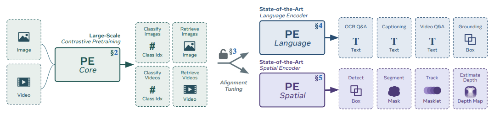
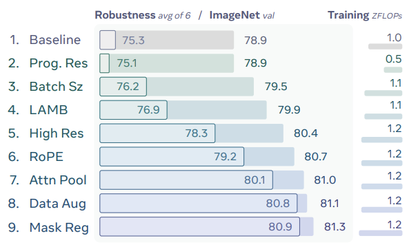
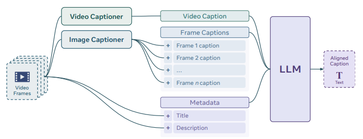
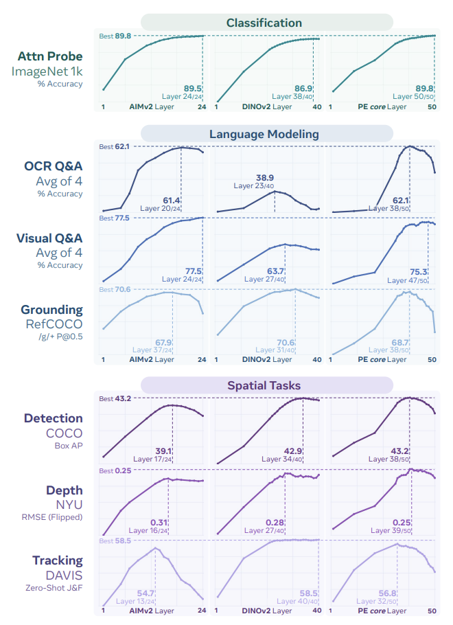
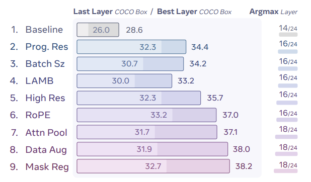
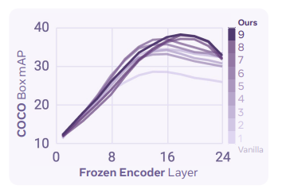
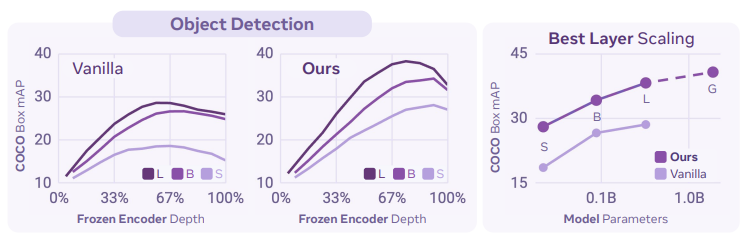
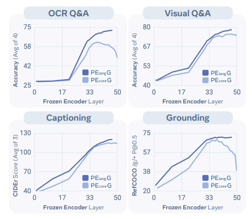
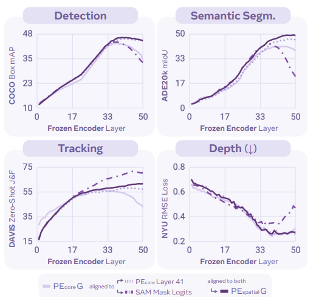
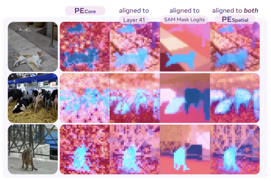

# Perception Encoder: 最良の視覚埋め込みはネットワークの出力にはない

> 原題: Perception Encoder: The best visual embeddings are not at the output of the network
> arXiv: 2504.13181
> 著者: Daniel Bolya, Po-Yao Huang, Peize Sun, Jang Hyun Cho, Andrea Madotto, Chen Wei, Tengyu Ma, Jiale Zhi, Jathushan Rajasegaran, Hanoona Rasheed, Junke Wang, Marco Monteiro, Hu Xu, Shiyu Dong, Nikhila Ravi, Daniel Li, Piotr Dollár, Christoph Feichtenhofer（Meta / UT Austin / MBZUAI / Fudan University）
> 出典: 39th Conference on Neural Information Processing Systems (NeurIPS 2025)
> コード・モデル: <https://github.com/facebookresearch/perception_models>

## Abstract（要旨）

我々は Perception Encoder（PE）を導入する。これは、画像および動画理解のための state-of-the-art な視覚エンコーダのファミリーである。

伝統的に、視覚エンコーダはさまざまな事前学習目的（pretraining objective）に依拠しており、それぞれが異なる下流タスクで秀でていた。

驚くべきことに、我々は注意深く調整した画像の事前学習レシピをスケールし、頑健（robust）な動画データエンジンで精錬した後、対比的（contrastive）な視覚-言語訓練 *単独* で、これらすべての下流タスクに対して強力で汎用的な埋め込みを生成できることを発見した。

ただし一つだけ注意点がある: *これらの埋め込みはネットワークの中間層（intermediate layers）の中に隠れている*。

それらを引き出すために、我々は 2 つのアラインメント手法を導入する: マルチモーダル言語モデル化のための言語アラインメント（language alignment）と、dense 予測のための空間アラインメント（spatial alignment）である。

これらと組み合わさることで、我々の PE ファミリーは幅広いタスクで state-of-the-art の結果を達成する。それには、ゼロショット画像・動画分類および検索、文書・画像・動画 Q&A、検出・追跡・深度推定のような空間タスクが含まれる。

我々はモデル、コード、および合成・人手注釈された動画の新規データセットを公開する: <https://github.com/facebookresearch/perception_models>

## 1. Introduction（はじめに）

過去 10 年間、コンピュータビジョン分野において、事前学習された視覚エンコーダは *perception*（知覚）を必要とするほとんどの応用の中核となる構成要素であった。100 万規模の ImageNet [25] 事前学習された畳み込みネットワーク [41, 60, 79, 121, 128] から、十億規模のウェブ事前学習された transformer [19, 24, 28, 53, 127, 156] に至るまで、ビジョン分野の支配的戦略は、大規模に事前学習されたエンコーダを下流タスクに適応させることであった。

今日では、これらの事前学習目的はいくつかの種類で提供される: ゼロショット分類および検索に適し、open-world [68, 92] や生成タスク [105, 111] のための視覚-言語アラインメントを提供する **視覚-言語対比損失（vision-language contrastive losses）**[103, 158]、言語 decoder を用いて画像記述を予測することを学び、下流の マルチモーダル言語モデル（MLLM）タスクに良く転移する **キャプション化損失（captioning losses）**[36, 134]、言語の supervision なしに dense な空間対応関係（spatial correspondences）を学び、物体検出のような精密な位置特定を必要とするタスクに有用な特徴量を作る **空間的自己教師あり損失（spatially self-supervised losses）**[43, 96] である。多くの研究が、これら 2 つ以上の技法を異なる方法で組み合わせようと試みている [19, 33, 34, 36, 44, 88, 107, 156]。多くは成功しているが、これらの戦略の複雑さは使用ケースの数に応じて指数関数的に増大し、それがスケーリングを困難にする可能性がある。すべての下流タスクで state-of-the-art の特徴を学べる *単一・シンプル・容易にスケール可能* な事前学習技法は、まだ示されていない。

本研究で我々は、**グローバルな視覚-言語対比学習だけ** がそのようなアプローチになりうることを発見する。我々はまず **PE_core**（図 1 左）を構築する。これは、画像と動画 *両方* で state-of-the-art のゼロショット性能を持つ、大規模対比的に事前学習されたモデルである（§2）。これを達成するために、我々はまず十億規模の画像-テキストデータから一般的知識を抽出する強力な **画像のみの** 対比事前学習レシピの開発に集中する（§2.1）。次に、結果として得られたモデルをフレームベースのエンコーダとして使い、動画クリップ向けに良好にアラインされた動画キャプションを生成する **動画データエンジン**（§2.2）を開発する。この合成動画-テキストデータでファインチューニングすると、画像と動画両方の分類・検索タスクで性能が大幅に改善する。最後に、我々は頑健な画像事前学習と良好にアラインされた動画ファインチューニング戦略を 2B パラメータにスケールして **PE_core G**（§2.3）を生成する。これは単一の統一エンコーダで、ほとんどのゼロショット画像タスクで SigLIP2 [135] を、ほとんどのゼロショット動画タスクで InternVideo2 [143] を上回る。

PE_core G の性能を分析した後、我々は驚くべき結果を見つけた: *モデルの内部に、OCR、VQA、grounding、検出、深度推定、追跡にアラインされた特定の特徴量があった*（§3）。state-of-the-art のキャプション化 [36] や空間的自己教師あり [96] 事前学習と比較すると、我々の対比エンコーダは特定の層を持ち、それらは凍結（frozen）特徴として使われたときに、*他の 2 つの事前学習技法の性能と一致するかそれを超える、本来それらが最良であるべきタスクで*。唯一の問題は—これらの特徴量はタスクごとに *異なる層* に存在することである。

この現象を **アラインメントチューニング（alignment tuning）**（図 1 右）で活用することによって、我々はこれらの特徴をネットワークの末端にアラインし、下流の MLLM（§4）と空間（§5）タスクのための state-of-the-art エンコーダを作れることを示す—これらすべてが同じ容易にスケール可能な対比的事前学習に従う。したがって、Perception Encoder は **単一のシンプルな事前学習をスケールして多数の下流ビジョンタスクを解決する** 潜在能力を解き放つ。我々は、モデル、コード、および 100 万本の高品質ストック映像と 12 万本の人手精錬されたキャプションからなる新規 PE Video Dataset を公開する。

<figure>

<figcaption>図1: Perception Encoder (PE) は、多様な視覚タスクで state-of-the-art の性能を持つ大規模視覚エンコーダモデルのファミリーである。頑健な対比的事前学習レシピと、合成的にアラインされた動画でのファインチューニングを用いることで、PE は分類と検索（§2）で既存モデルを上回るだけでなく、下流タスク向けにスケールする強力で汎用的な特徴量を内部的にも生成する（§3）。PE は、これらの汎用特徴量を活用するアラインメントチューニングを通じて、大規模対比的事前学習を下流タスクに転移させる能力を解き放つ（§4, §5）。</figcaption>
</figure>

## 2. Perception Encoder: *Core*

Perception Encoder (PE) を構築するために、我々はまず画像 *と* 動画のための、大規模で頑健、高性能な視覚-言語対比モデルを訓練することから始める。我々には 2 つの目的がある: 対比的訓練のスケーラビリティとデータ効率を高めること、そして画像と動画のための統一モデルを作ることである。

我々は画像と動画の訓練を 2 段階に分離する。まず、いくつかの正則化技法を備えた強力な **画像** 事前学習レシピ（§2.1）を開発し、頑健な出発点を作る。次に、結果として得られた画像モデルをフレームエンコーダとして使い、§2.2 の **動画データエンジン** を開発する。これは、動画クリップ向けにアラインされたキャプションを生成するための、新規の人手精錬動画-テキストデータセットによってサポートされている。最後に、得られたアラインされた動画データ（§2.3）で画像エンコーダを訓練する。我々のデータエンジン設計を使えば、この短い訓練ステップは画像と動画 *両方* の性能を大幅に改善する。

### 2.1 Robust Image Pretraining（頑健な画像事前学習）

事前学習の第 1 段階では、我々は大規模な画像-テキストデータセットからできるだけ多くの視覚情報を学びたい。高い正則化、安定性、訓練効率を念頭に置いて。

**Setup（設定）**。我々は変更を OpenCLIP [50] ViT-L/14 の 224 解像度をベースライン（図 2.1）として追跡する。我々は約 1T GFLOPs（つまり 1 ZFLOP）の訓練予算を固定し、MetaCLIP [150] のテキストのみキュレーションパイプラインを用いてキュレートされた固定された 2.3B のノイジーな画像-テキストデータセットで ablation を行う。12B サンプル見るまで訓練する。*汎用性* を評価するため、ImageNet val [25] のゼロショット分類結果と、6 つの一般的な頑健性指標の平均を報告する: ImageNet val [25]、ImageNet v2 [109]、ObjectNet [4]、ImageNet Adversarial [46]、ImageNet Rendition [45]、ImageNet Sketch [140]。

**Training（訓練）**。[69, 70, 77, 128, 133] に動機づけられ、我々はまず **progressive resolution**（漸進的解像度, 図 2.2）で訓練効率を改善することから始める。ベースラインの 12B サンプル run を 98 解像度、154 解像度、224 解像度の各段階に均等に分割する（4B per stage）ことで、性能を維持しながら訓練 FLOPs を半分にする。次に、追加予算を使ってグローバル **batch size**（バッチサイズ, 図 2.3）を 32K から 64K に倍増し、総サンプル数を 12B から 24B に増やす。これにより hard negative がより頻繁に発生し、CLIP の「タスクの難しさ」が増す。最後に、AdamW から **LAMB** [154]（図 2.4）に切り替える。これは学習率を 5×10⁻⁴ から 2×10⁻³ へと安定して増やすことを可能にし、CLIP の目的によりよく適合する。全体として、これらの変更は ImageNet val で +1.0%、頑健性で同程度の +1.6% の改善をもたらす。

**Modeling（モデル化）**。スケーラビリティを助けるため [35, 128]、我々は 336 ピクセルの **高解像度（high resolution）** 段階（図 2.5）を加える。FLOPs を同じに保つため、スケジュールを 98 解像度で 10B サンプル、154 解像度で 8B、224 解像度で 4B、336 解像度で 2B に調整する。外挿（extrapolation）を改善するため、各 attention 層に **2D RoPE** [124]（図 2.6）も加え、元の位置埋め込みを保つ。最後に、[158] に従い、**attention pooling** transformer ブロック（図 2.7）を使って CLIP 埋め込みを構築する。驚くべきことに、このブロックへの入力として class token を保つことが小型モデル性能には重要であることが分かった。これらの変更は ImageNet val を +1.1% 改善し、頑健性は +3.2% と 3 倍改善する。

**Regularization（正則化）**。十億規模のサンプルで訓練しているにもかかわらず、**data augmentation**（データ拡張, 図 2.8）が依然として重要であることがわかる。重いランダムクロッピング、明度／彩度のジッター、水平反転を加えると、悪影響（例: OCR への悪影響）なしに頑健性が一般的に改善する。最後に、入力バッチの 1/16 を複製してマスクすることで **mask regularization**（マスク正則化, 図 2.9）を加える。出力では、マスクされたトークンをマスクされていない対応物にコサイン類似度を最大化することでアラインする。これらの正則化変更を合わせると、ImageNet val を +0.3%、頑健性を +0.8% 改善する。

全体として、我々のレシピは ImageNet val を +2.4%、頑健性を significant な +5.6% 改善する。FLOPs を同程度に保ち、スケーリング挙動を維持または改善しつつ（Appendix C.1 参照）。

<figure>

<figcaption>図2: Robust Image Pretraining。我々は事前学習レシピ（§2.1）を OpenCLIP [50] ViT-L/14 モデルから始めて、固定データセット上で性能を最大化するように調整する。我々は各変更について累積的なゼロショット分類結果を報告する。内側のバーは 6 つの頑健性ベンチマーク [4, 25, 45, 46, 109, 140] の平均として計算される頑健性評価を、外側のバーは ImageNet val [25] 単独を示す。いくつかの変更は頑健性を顕著に改善し、ImageNet val はデータでよりスケールするが、頑健性は精錬された訓練技法でスケールすることを示している。</figcaption>
</figure>

### 2.2 Bootstrapping a Video Data Engine with Perception Encoder（Perception Encoder で動画データエンジンをブートストラップする）

我々の次のステップは画像のみのエンコーダを動画へと拡張することである。多くの場合に人間が生成した記述的な alt-text 情報を伴うウェブ規模の画像-テキストデータとは異なり、アラインされた言語注釈を伴う動画は本質的に希少で、しばしば低品質である。画像データエンジンの最近の成功 [57, 63, 94, 108, 149] に触発されて、我々は高品質なアラインされた動画キャプションの不足に対処するため、頑健な動画データエンジンを開発し、それらを生成する。我々のアプローチ（図 3）は、この種の最初の大規模探索を表す。

**Video Data Engine（動画データエンジン）**。我々はデータエンジンを 3 部に構築する: (1) 早期画像のみバージョンの PE をフレームレベルエンコーダとして、Llama [80] を言語 decoder として用いて動画キャプション化モデルを構築する。PLM [21] MLLM 訓練レシピとデータミックスで訓練する。合計でミックスは 6470 万の画像と動画から成り、自然画像、チャート、文書、外心性（exocentric）と自己中心性（egocentric）動画を含む。(2) キャプション化性能をさらに高めるため、26.5 万の動画セット（一部は PE Video Dataset として公開、Appendix A.1 参照）を集める。我々のベース動画キャプション化器でキャプション化し、人間レーターにキャプションを精錬してもらう。次に、この人手精錬データで動画キャプション化器をファインチューンする。これによりキャプション化品質が大幅に改善する（Appendix C.2 参照）。(3) 最後に、動画キャプション化器、Llama 3.2 [80] を 1 フレームあたり画像キャプション化器として、および既存のタイトル・説明メタデータ（図 3）から得たキャプションを取り込み、Llama 3.3 70B テキストモデルでまとめることでアラインされた動画キャプションを合成する（プロンプトについては Appendix A.2.4 参照）。

<figure>

<figcaption>図3: Video Data Engine。我々は PE ベースの動画キャプション化器を動画レベルのキャプションに、既存の画像キャプション化器 [80] をサンプリングされたフレームに使う。これらのコンポーネントを動画メタデータと組み合わせ、テキストのみの LLM [80] で短いキャプションを合成する。</figcaption>
</figure>

**Video Training（動画訓練）**。得られたデータエンジンを用いて、2200 万本の多様な動画セットに対して情報密度の高いキャプションを生成し、これで画像のみの PE モデルをファインチューンする。そうするため、PE を *フレームレベルエンコーダ* として使う: 各動画に対して 8 フレームを一様にサンプリングし、各フレームについて CLIP 埋め込みを抽出し、平均プーリングしてテキスト埋め込みアラインメント向けの単一の動画埋め込みを得る。このシンプルさにも関わらず、この技法は強力な統合画像-動画エンコーダを生成することが分かる。

**Ablations（アブレーション）**。表 1 で、我々は動画データエンジンの各コンポーネントの影響を、開発中の画像のみバージョンの PE_core チェックポイントを再キャプション化された動画上でファインチューンすることで ablate する。画像のみのベースラインエンコーダ（第 1 行）と比較すると、我々の動画データエンジンは画像（72.6→78.2）と動画（50.9→61.6）両方のゼロショット分類・検索性能を大幅に高める。注目すべきは、動画タイトルや説明のようなメタデータだけに頼る（第 2 行）よりも、動画レベルとフレームレベルのキャプションを使う方が大幅な改善を提供することで、これはウェブ動画のノイズを補うための頑健な動画データエンジン構築の重要性を強調する。

**表1: Video Data Engine Ablation。** 我々は図 3 の動画データエンジンを、開発中の画像のみ版 PE をフレーム埋め込みを平均して単一の動画 CLIP 埋め込みを作るようにファインチューンすることで ablate する。動画キャプションは、人手精錬データありかなし（✓\*）で訓練されたキャプション化器で生成される。フレームキャプションは Llama 3.2 視覚モデル [80] で生成される。総合的な結果として、画像と動画両方のゼロショット性能に対する大きな後押しがある。さらなる ablation とスケーリング挙動については Appendix C.2 を参照。

| Title | Description | Video Caption | Frame Caption | Avg Image | ImageNet val | ImageNet v2 | ObjectNet | MS-COCO i→t | MS-COCO t→i | Avg Video | Kinetics-400 | MSR-VTT t→v | MSR-VTT v→t |
|---|---|---|---|---|---|---|---|---|---|---|---|---|---|
| | | | | 72.6 | 83.3 | 77.8 | 85.8 | 49.4 | 66.8 | 50.9 | 69.7 | 68.4 | 38.0 |
| ✓ | ✓ | | | 75.4 | 83.2 | 78.2 | 87.1 | 47.3 | 66.0 | 56.0 | 74.1 | 73.5 | 39.0 |
| ✓ | ✓ | ✓ | | 78.2 | 83.5 | 78.4 | 86.8 | 56.0 | 74.3 | 60.9 | 73.8 | 73.4 | 47.6 |
| ✓ | ✓ | ✓\* | | 78.1 | 83.7 | 79.0 | 87.7 | 54.1 | 73.0 | 60.9 | 75.4 | 75.1 | 46.7 |
| ✓ | ✓ | ✓\* | ✓ | **78.2** | 83.7 | 79.7 | 85.4 | 54.6 | 73.2 | **61.6** | 75.8 | 75.5 | 48.1 |

### 2.3 A Unified Encoder for Image and Video（画像と動画の統一エンコーダ）

頑健でスケーラブルな画像事前学習レシピと、提案された動画データエンジンによって再キャプション化された動画事前学習データを使い、本節では **PE_core** という統一画像-動画エンコーダを提示する。

**Model Architecture（モデルアーキテクチャ）**。§2.1 で観察された有望なスケーリング挙動を活用するため、我々は最大の PE_core モデルを 2B パラメータ（G スケール）にスケールする。表 2 は、視覚 / テキスト transformer の詳細なモデル設定と出力クリップ埋め込み空間の次元を示す。

**表2: PE Model Configurations。**

| Scale | Tower | Params | Width | Depth | MLP | Heads | CLIP Dim |
|---|---|---|---|---|---|---|---|
| B | Vision | 0.09B | 768 | 12 | 3072 | 12 | 1024 |
| | Text | 0.31B | 1024 | 24 | 4096 | 16 | |
| L | Vision | 0.32B | 1024 | 24 | 4096 | 16 | 1024 |
| | Text | 0.31B | 1024 | 24 | 4096 | 16 | |
| G | Vision | 1.88B | 1536 | 50 | 8960 | 16 | 1280 |
| | Text | 0.47B | 1280 | 24 | 5120 | 20 | |

**Model Training（モデル訓練）**。我々は PE_core を 3 段階で訓練する:

1. **Image pretraining（画像事前学習）**。MetaCLIP [150] でキュレートされた 5.4B の公開画像 alt-text 対と、収束を保証するために合計 86B サンプル（B と L には 58B）に画像事前学習データをスケールアップする。グローバルバッチサイズ 131K、漸進的解像度はモデルに応じて 98 から最大 448 まで使う。
2. **Image and video finetuning（画像・動画ファインチューニング）**。初期事前学習に従って、その後モデルを最大解像度・短いスケジュールで、画像事前学習データ上で 50M サンプル（クールダウンとして）、続いて再キャプション化された動画上で 22M サンプル、より小さい学習率とバッチサイズでファインチューンする。動画キャプションは提案された動画データエンジン（§2.2）を使って生成される。各動画クリップについて 8 フレームを一様にサンプリングし、エンコードして平均を取り、単一の動画埋め込みを生成し、画像訓練と同じ対比目的を使って対応する動画キャプションとアラインする。
3. **Smaller model distillation（小型モデル蒸留）**。2B モデル（G スケール）を B と L スケールの小型対比的事前学習モデルに、それらの最終解像度の下で短い *ファインチューニング* スケジュールで蒸留する。これは事前学習スケジュールの約 8% をカバーする約 4B サンプルを見る、より低い学習率で。我々は小型モデルでも stage 1 と 2 を依然として行う（Appendix C.3 参照）。

詳細な訓練設定とセットアップは Appendix B.1.1 にある。

**表3: Zero-Shot Image Results。** PE_core の画像ゼロショット性能を state-of-the-art と比較する。すべてのモデルサイズで、PE_core は一般的な分類、検索、細粒度分類で SOTA の結果を得る。†再評価: DFN は [127] による; SigLIP と SigLIP2 は我々が同じベンチマーク設定で評価（[135] にない場合、Appendix B.1.2 参照）。

| Model | Encoder Params | Resolution | Data | Zero-Shot Classification Avg Class. | ImageNet v1 | ImageNet v2 | ObjectNet | ImageNet Adv. | ImageNet R | Zero-Shot Fine-Grained Classification Avg Fine. | Flowers | iNaturalist 21 | Cars | Countries | Scenes | Aircraft | Zero-Shot Retrieval Avg Retrieval | MS COCO i→t | MS COCO t→i | Flickr30k i→t | Flickr30k t→i |
|---|---|---|---|---|---|---|---|---|---|---|---|---|---|---|---|---|---|---|---|---|---|
| SigLIP-B/16† [158] | 0.1B | 224 | 10B | 69.9 | 76.2 | 69.5 | 70.7 | 45.1 | 90.2 | 67.9 | 61.8 | 83.3 | 88.4 | 4.4.0 | 15.9 | 70.0 | 64.6 | 69.8 | 47.2 | 65.5 | 77.9 | 89.6 |
| SigLIP2-B/16† [135] | 0.1B | 224 | 10B | 71.1 | 78.2 | 71.4 | 75.9 | 51.0 | 91.7 | 68.5 | 67.6 | 85.7 | 93.4 | 54.8 | 19.2 | 73.7 | 62.1 | 69.0 | 51.3 | 70.6 | 79.0 | 93.0 |
| **PE_core B** | 0.1B | 224 | 5.4B | **73.2** | 78.4 | 71.7 | 71.9 | 62.4 | 88.7 | 66.1 | **68.8** | 86.5 | 92.1 | 57.0 | 30.5 | 74.0 | **72.7** | 74.3 | 50.9 | 71.0 | 80.8 | 94.4 |
| SigLIP-L/16† [158] | 0.3B | 384 | 10B | 80.7 | 82.1 | 75.9 | 80.9 | 76.5 | 95.0 | 73.6 | 67.1 | 89.4 | 94.8 | 53.2 | 24.7 | 72.5 | 67.9 | 74.7 | 52.8 | 70.5 | 82.6 | 92.9 |
| SigLIP2-L/16† [135] | 0.3B | 384 | 10B | 83.3 | 83.1 | 77.4 | 84.4 | 64.3 | 95.7 | 75.5 | 72.5 | 90.0 | 95.8 | 67.0 | 31.6 | 74.8 | 75.7 | 75.6 | 55.3 | 71.4 | 85.0 | 95.2 |
| **PE_core L** | 0.3B | 336 | 5.4B | **83.9** | 83.5 | 77.9 | 84.7 | 89.0 | 95.7 | **74.6** | 87.2 | 93.7 | 67.8 | 45.6 | 77.4 | **75.7** | 78.8 | 57.1 | 75.9 | 85.5 | 96.6 |
| DFN-H+† [32] | 0.6B | 378 | 5B | 81.6 | 84.3 | 78.3 | 79.6 | 79.6 | 73.3 | 75.2 | 91.6 | 96.0 | 72.5 | 37.4 | 77.4 | 75.9 | 75.8 | 55.6 | 71.8 | 82.1 | 93.6 |
| InternVL-C [19] | 5.5B | 224 | 5B | 82.8 | 83.2 | 77.3 | 80.6 | 63.8 | 95.7 | 74.3 | 69.9 | 95.7 | 94.4 | 45.1 | 19.2 | 76.7 | 77.6 | 75.9 | 56.6 | 71.9 | 85.0 | 95.7 |
| EVA 18B [127] | 17.5B | 224 | 2B | 83.8 | 83.8 | 77.9 | 82.2 | 87.3 | 95.7 | 73.1 | 86.0 | 94.9 | 59.7 | 43.1 | 77.7 | 75.6 | 78.5 | 56.2 | 73.6 | 83.3 | 96.7 |
| SigLIP2-g-opt† [135] | 1.1B | 384 | 10B | 86.2 | 85.0 | 79.8 | 88.0 | 90.5 | **96.6** | 77.4 | 75.6 | 91.5 | 95.9 | 73.6 | 40.1 | 76.3 | 75.9 | 78.0 | 56.1 | 72.8 | **86.0** | 95.3 |
| **PE_core G** (image only)† | 1.9B | 448 | 5.4B | 86.0 | 85.4 | 80.2 | 87.1 | 91.2 | 96.1 | 76.1 | 87.2 | 95.7 | 67.8 | 45.7 | 77.5 | 73.1 | 78.6 | 57.6 | 73.9 | 85.0 | 93.9 |
| **PE_core G** | 1.9B | 448 | 5.4B | **86.6** | 85.4 | 80.2 | 88.2 | 92.6 | 96.5 | 76.5 | **79.4** | 91.4 | 94.7 | 78.2 | 57.6 | 78.5 | **78.9** | 58.1 | 75.4 | 85.7 | 96.2 |

**表4: Zero-Shot Video Results。** 我々は PE_core の動画と画像エンコーダを最近のものと比較する。PE_core は動画分類で state-of-the-art を獲得し、わずか 22M 本の動画を使うだけで検索ベンチマークでも比較可能な性能を達成する。†SigLIP2 は我々によって評価（Appendix B.1.2 参照）。

| Model | Encoder Params | Resolution | # Frames | Video Data | Zero-Shot Classification Avg Class. | Kinetics 400 | Kinetics 600 | Kinetics 700 | UCF101 | HMDB51 | Zero-Shot Retrieval Avg Retrieval | MSR-VTT t→v | MSR-VTT v→t | MSVD t→v | MSVD v→t | ActivityNet t→v | ActivityNet v→t |
|---|---|---|---|---|---|---|---|---|---|---|---|---|---|---|---|---|---|
| CLIP4CLIP [82] | 0.1B | 224 | 12 | n/a | - | - | - | - | - | - | 32.0 | - | 38.5 | - | - | - | - |
| SigLIP2-B/16† [135] | 0.1B | 224 | n/a | n/a | 57.3 | 58.7 | 55.0 | 48.4 | 82.0 | 42.3 | 39.9 | 38.5 | 30.1 | 49.0 | 67.2 | 28.6 | 25.8 |
| **PE_core B** | 0.1B | 224 | 8 | 22M | **65.6** | 65.6 | 65.1 | 55.8 | 84.6 | 46.7 | **47.0** | 47.3 | 36.4 | 76.7 | 39.0 | 38.4 |
| UMT-L [66] | 0.3B | 224 | n/a | 25M | - | - | - | - | - | - | 47.1 | 40.7 | 37.1 | 49.0 | 74.5 | 41.9 | 39.4 |
| SigLIP2-L/16† [135] | 0.3B | 384 | n/a | n/a | 64.1 | 65.3 | 62.5 | 56.8 | 86.7 | 49.3 | 44.7 | 41.5 | 31.4 | 53.7 | 74.2 | 35.9 | 31.5 |
| **PE_core L** | 0.3B | 336 | 8 | 22M | **71.4** | 73.4 | 72.7 | 65.3 | 87.1 | 58.5 | **54.8** | 50.3 | 50.1 | 57.2 | 82.4 | 46.4 | 42.1 |
| InternVL-C [19] | 5.5B | 224 | 8 | n/a | - | 69.1 | 68.9 | 60.6 | - | - | 44.7 | 40.2 | - | - | - | - | - |
| InternVideo2 [143] | 1.0B | 224 | 8 | 102M | 70.7 | 73.1 | 72.8 | 64.9 | 88.8 | 53.9 | **59.9** | 51.9 | **50.9** | 58.1 | 83.3 | **60.4** | 54.8 |
| SigLIP2-g-opt† [135] | 1.1B | 384 | n/a | n/a | 68.2 | 69.8 | 67.0 | 61.8 | 90.7 | 51.8 | 46.6 | 43.1 | 34.2 | 55.8 | 74.6 | 38.3 | 33.4 |
| **PE_core G** (image only) | 1.9B | 448 | 8 | n/a | 70.9 | 73.1 | 72.2 | 64.3 | 89.5 | 55.5 | 47.6 | 44.3 | 35.2 | 54.3 | 73.9 | 41.5 | 36.4 |
| **PE_core G** | 1.9B | 448 | 8 | 22M | **74.8** | 76.9 | 76.1 | 69.1 | 90.7 | 61.1 | 58.7 | 51.2 | 49.9 | 59.7 | 85.4 | 54.7 | 51.2 |

**Zero-Shot Image Results（ゼロショット画像結果）**。表 3 で、我々は PE_core のゼロショット画像ベンチマーク（分類および検索）での性能を最強のオープンモデル、特に SigLIP2 [135] と比較して示す。PE_core はすべての対比モデルを *すべての* ゼロショットタスクで上回る。これは、激しく競争的な、ゼロショット ImageNet 頑健性指標 [4, 25, 45, 46, 109, 140] の平均を含む。これは大きな成果であり、これを Google 内部の JFT-3B [28] や WebLI [17] データセットへのアクセスなしに 3 年以上ぶりに達成した最初である。そして *同時に*、PE_core は既存の state-of-the-art を画像-テキスト検索でも超え、細粒度分類でも大幅に改善する—すべての一般的なゼロショットカテゴリで同時に state-of-the-art を保持する初の事例である。

特筆すべきは、この支配的な *画像* 性能は我々の動画ファインチューニングによって可能となったということだ。画像のみと比較して、動画ファインチューンされた PE_core G は一般的分類で +0.6%、細粒度分類で +1.2%、検索で大幅な +4.0% の後押しを得る。したがって、良好にアラインされた動画-テキストデータは動画性能を改善するだけでなく—それは動画 *と* 画像 *両方* のためのより良いモデルを厳密に作る。

**Zero-Shot Video Results（ゼロショット動画結果）**。我々は表 4 に動画結果を提示する。我々のベース画像エンコーダはすでに、SigLIP2-g-opt を含むすべての他の画像のみエンコーダを、ゼロショット分類と検索 *両方* で上回る。動画ファインチューニングを伴うと、PE_core G は動画分類でフルタイム attention を使う native 動画モデルさえも大幅に上回り、動画検索で state-of-the-art にほぼ一致する。シンプルなフレームレベルエンコーダであるにもかかわらず。この結果は我々の動画データエンジンの重要性を強調し、平均ゼロショット動画分類で +3.9% および動画検索で massive な +11.1% の改善をもたらす。さらに、PE_core はこれを InternVideo2 [143] のような他の動画ベースアプローチよりも少ない動画で行い、統合画像-動画エンコーダの利点を強調する。

追加のゼロショット結果と probing 結果については Appendix C.4 を参照。

## 3. General Features in a Contrastive Disguise（対比的偽装のもとでの一般特徴量）

PE_core は強力なゼロショット分類と検索結果を持つが、これらは対比的エンコーダが得意とするタスクである。より重要なのは、この強力な性能が下流タスクへ *汎化* するかどうかである。これを確認するため、我々は PE_core G を、他の事前学習技法のための state-of-the-art モデル—キャプション化（AIMv2-3B [29]）と自己教師あり学習（DINOv2-g [96]）—と比較する。

**Layerwise Feature Analysis（層ごとの特徴量解析）**。我々は、3 つのカテゴリ（分類、言語モデル化、空間タスク）におけるいくつかの下流ベンチマークで、各エンコーダの凍結特徴解析を図 4 で行う。分類については、ランダム初期化された cross attention transformer ブロックを用いて各モデルをプローブする。言語アラインメントについては、projector を学習し decoder-only LLM をファインチューンする（§4 参照）。空間タスクでは、検出に ViTDet [71] Mask-RCNN [42] with Absolute Win [7]、深度に DPT [106]、追跡にゼロショット特徴対応を、いくつかの異なる decoder で訓練する。各実験で、最良の特徴は必ずしも最後のものではないので、モデルの層を sweep する。それぞれの場合、検出のために 32×32 トークンの等価な画像サイズ（ウィンドウサイズ）を使う。各プロットで、そのタスク上のモデル間の最大値と最小値で性能を正規化する。

<figure>

<figcaption>図4: Frozen Feature Layer Analysis（異なる事前学習手法の凍結特徴層解析）: キャプション化（AIMv2-3B [36]、左）、空間的自己教師あり（DINOv2-g [96]、中）、および我々の対比的レシピ（PE_core G、右）。垂直線は最良の層を示し、水平線はモデル間の最良性能を示す。AIMv2 は言語に秀でているが空間ではなく、DINOv2 は空間に秀でているが言語ではない。しかし、PE_core G の *中間層は言語と空間タスクの両方で良好に動作する*。</figcaption>
</figure>

**General Features in Disguise（偽装下の一般特徴量）**。この解析はいくつかの洞察を明らかにする。まず、予想通り、AIMv2 は分類と視覚 Q&A 言語タスクで最良の性能を出す。同様に、DINOv2 は検出、深度、さらには LLM を介した grounding のような空間タスクで良好な性能を出す。次に、これは他の研究によってすでに確立されているが [131]: DINOv2 は OCR タスクで貧弱な性能を出す。しかし興味深いことに、その性能は *ネットワークの中間でピーク* に達し、その後末端で低下する。そして他のものも複数のタスクでそうである（AIMv2: 追跡、grounding、検出; DINOv2: VQA、grounding）。PE_core は同様の挙動を示すが予想外の結果がある: *それは多くのタスクで良好な性能を出すことができ、しばしば主要なモデルに匹敵するかそれを超える*。注目すべきことに、PE は AIMv2 の言語タスクと DINOv2 の空間タスクに近いまたはそれを上回る中間層を持つ。グローバル対比的損失で訓練されているにもかかわらず。深度推定は特に注目すべきで、対比的エンコーダは通常その領域で state-of-the-art と見なされないからだ。実際、CLIP モデルは貧弱な空間性能で悪名高い [107]。

**An Alignment Problem（アラインメント問題）**。しかし、PE_core の強力な汎用性能は、LLM ベースの grounding のように、ネットワークの末端に向かって急速に減少する。この挙動は下流タスクが事前学習技法に近いほど顕著ではなくなり、**アラインメント問題** を示唆する。したがって、よく調整された大規模対比モデルは、その目的を fit する過程で一般埋め込みを学ぶことができるが、*それらを出力することに失敗する*。我々はこの問題を §4 と §5 のアラインメントチューニングで対処し、なぜ我々の CLIP モデルがこれらの一般特徴量とそのスケーリング挙動を持つかを Appendix C.5 で解析する。

**Analysis（解析）**。純粋な CLIP モデルが、それらの専門領域における state-of-the-art の事前学習手法の性能に一致する特徴量を持つという発見は新しい。実際、最近の研究 [30] は反対のことを示している—CLIP モデルが下流タスクでスケールに失敗することを。我々は次に、我々のアプローチがこれらの結果をどのようにもたらすかを調査する。

始めに、我々は COCO 検出での層ごとの凍結特徴解析を行う。PE_core はこのタスクで特に「peaky」（とんがった）であり（図 4）、最良の層は DINOv2 と同等だが最後の層は大幅に劣る。我々はすでに vanilla CLIP からの ViT-L/14 モデルでの図 2 における各変更を ablate している。それで効率のため、より低い解像度を使い、各累積 ablation のチェックポイントを Mask R-CNN [42] を用いて COCO [74] 上で凍結特徴量として評価する。図 5 では、各累積 ablation について最後の層と最良の層の COCO box mAP を、最良の層のインデックスと一緒に報告する。さらに、図 6 で各変更の層ごとの mAP をプロットする。

驚くべきことに、我々が §2.1 の CLIP 事前学習に加えたシンプルな変更は、最良の層の性能を約 10 mAP も改善する! 高解像度（5）と RoPE（6）のような改善は期待されるが、データ拡張（8）と特に progressive resolution（2）は予想外に大いに役立つ。対比的事前学習が「グローバルトークン」[23] を介して特定の解像度に過適合する可能性があり、訓練中に解像度を変えることがモデルにより頑健にすることを強制する。

<figure>

<figcaption>図5: The Downstream Effects of Robust Pretraining。図 2 の ViT-L/14 チェックポイントを Mask R-CNN [42] を使って COCO [74] 上で凍結特徴として評価する。最後の層の性能、最良の層の性能、最良の層のインデックスを報告する。</figcaption>
</figure>

<figure>

<figcaption>図6: Layer Analysis（図 5 のもの）。</figcaption>
</figure>

次に、progressive resolution (2) と attention pooling (7) 両方が argmax 層をネットワークのより深い位置へ移動させる（図 5 の最右列）。特に attention pooling は層ごとの性能曲線全体の形を変える（図 6）。最後に、いくつかの変更は性能を *減少* させる: バッチサイズを増やすこと（3）と LAMB を高い学習率で使うこと（4）。両方が CLIP 損失をより良く fit するのに役立つが、ある点を超えると一般特徴量を改善しない可能性がある。さらに、最良の層の性能は (2) 以降大幅に改善した一方、最後の層の性能は停滞した。これは、CLIP トークンを構築することが専門的な decoder を必要とすることを示唆する。しかし、これがモデルが一般特徴量を学ぶことを妨げない—ただそれらを出力しないだけだ。

**Scaling Behavior（スケーリング挙動）**。明らかに、我々の頑健なレシピは対比的事前学習が一般特徴量を生み出すことを可能にする。しかし、それはスケールするか？ 図 7 で、S/14、B/14、L/14 モデル全体で同じスケジュールで vanilla CLIP レシピか我々のレシピ（図 14 参照）のいずれかで訓練した凍結特徴層解析を行うことで、これに答える。即座に、スケーリング挙動の鮮明な対比が見られる: vanilla レシピは L スケール（300M）で急速にプラトーに達する一方、我々の頑健な事前学習レシピの最良の層は G スケール（2B）にスケールすることを示している—大幅に非空間的にアラインされたグローバル対比的損失で訓練されているにもかかわらず。ただし、これは *最良* の層であることに注意。*最後の* 層は両方とも依然停滞している。したがって、CLIP 損失は我々のレシピでさえも一般特徴量を不明瞭にし、それらをいくつかの層深く配置する。

<figure>

<figcaption>図7: The Downstream Scalability of Robust Pretraining。左: 図 14 の S/14、B/14、L/14 モデルの図 5 と同じセットアップでの凍結特徴層解析。右: 各モデルの *最良の層* のスケーリング挙動。注: G は異なるスケジュールを持つ。詳細は Appendix C.5 を参照。</figcaption>
</figure>

## 4. Perception Encoder: *Language Alignment*

§3 で見たように、PE_core はマルチモーダル大規模言語モデル（Multimodal Large Language Models, MLLMs）のためにすでに有用な特徴量を持っているが、これらの特徴量はネットワークの末端にアラインされていない。本節で我々は、アラインメントチューニングを通じてこれらの特徴を *持ち上げ*、新しい MLLM 専門エンコーダ PE_lang を構築する。

**Alignment Method（アラインメント手法）**。視覚エンコーダを LLM にアラインすることは比較的容易である。我々は [18, 21, 36] のアプローチに従い、ここで視覚エンコーダは *凍結解除（unfrozen）* され、MLLM の一部としてファインチューンされる。我々の場合は、PE_core を事前学習された Llama3.2 3B テキストのみ decoder にアラインし、encoder と decoder の両方を unfrozen で、2 層 MLP で接続する。[18] に示唆されているように PE_core の最後の 3 層を破棄し、エンコーダを LayerScale [132] と DropPath [49] で正則化する。我々は OCR Q&A、キャプション化、視覚 Q&A、動画 Q&A 全体で 70M の総サンプルで次トークン予測（[21] に従う）で訓練し、最後に PE_lang として視覚エンコーダのみを抽出する。さらなる訓練詳細は Appendix B.2 にあり、このレシピの ablation は Appendix D.1 で行う。

**Effects（効果）**。図 8 で、§3 と同じ層ごとの解析を、結果として得られた PE_lang G と PE_core G に行う。すべてのカテゴリにおいて、アラインされたモデルの最良の層は最後の層であり、元のチェックポイントの性能は問わない。注目すべきことに、我々の PE_lang 訓練ミックスは grounding データを *含まなかった* が、これは grounding 性能を大幅に持ち上げた。これは PE_core G の強力な中間 grounding 特徴量が今やネットワークの末端にアラインされたことによる。さらに、OCR Q&A のような、訓練ミックスに *表現された* 特定のドメインは、すでに強かった PE_core G の最良の層さえも凌駕する大幅な性能後押しを得る。したがって、事前学習と比較して桁違いに少ないサンプル数で、我々は PE_core G を *言語アラインして* すべての MLLM タスクのための単一の強力なエンコーダを作ることができた。

<figure>

<figcaption>図8: Language Alignment は PE_core（§3）の強力な性能を末端へ持ち上げる。</figcaption>
</figure>

**Results（結果）**。表 5 で我々は PE_lang を良好な言語アラインメントを持つ既存のエンコーダと比較する。ベンチマークするため、我々は各モデルを新鮮な 2 層 MLP と Llama 3.1 8B decoder に差し込む。エンコーダは凍結され、残りは 2.6M の視覚 Q&A 対上でファインチューンされる（Appendix B.2 参照）。我々は各モデルを native 解像度で評価する。アラインメント中に異なる LLM を使ったにもかかわらず、PE_lang はすべてのスケール、解像度、タスクで他のすべてのモデルを大幅に上回る。タイリングと異なる LLM decoder を使った結果は Appendix D.4 にある。すべての場合で、PE_lang は *汎用性* を示す。すなわち、解像度、decoder、タスクを問わず他のモデルを上回る。

**表5: MLLM Results。** PE_lang を Llama 3.1-instruct 8B [80] を LLM として用いる他の凍結視覚エンコーダと比較ベンチマークする。PE_lang はすべてのベンチマーク全体で強力な性能を示し、はるかに大きなモデルを上回る。†追加訓練なしで内挿。さらなる結果は Appendix D.4 を参照。

| Model | OCR / Chart / Doc. Q&A Avg. OCR | ChartQA | DocVQA | InfoVQA | AI2D | Visual Q&A Avg. VQA | TextVQA | OK-VQA | POPE | VQAv2 | Captioning Avg. Cap. | Flickr | COCO | NoCaps | Avg. Ground. | RefCOCO+g | Video Avg. Video | VideoMME | STAR | TGIF-QA | MVBench | Perception Test |
|---|---|---|---|---|---|---|---|---|---|---|---|---|---|---|---|---|---|---|---|---|---|---|
| **576 Tokens per Image** ||||||||||||||||||||||
| CLIP-L [103] | 53.5 | 61.7 | 49.5 | 32.8 | 70.1 | 72.7 | 60.7 | 63.9 | 87.3 | 78.9 | 113.3 | 92.0 | 132.9 | 115.0 | 65.0 | 73.2 | 54.2 | 46.3 | 52.1 | 68.6 | 57.4 | 52.3 |
| AIMv2-L-Distill† [36] | 53.7 | 61.4 | 49.4 | 31.5 | 72.7 | 74.1 | 62.6 | 64.8 | 88.3 | 80.3 | 117.8 | 94.7 | 137.5 | 121.3 | 67.4 | 75.0 | 53.4 | 45.3 | 52.4 | 65.0 | 57.4 | 50.0 |
| SigLIP2-so400M [135] | 60.9 | 69.5 | 58.3 | 35.2 | 71.1 | 76.8 | 69.8 | 67.2 | 88.7 | 81.6 | 116.5 | 92.1 | 137.7 | 119.8 | 67.4 | 54.5 | 45.5 | 53.1 | 67.2 | 49.3 | 54.5 ||
| SigLIP2-g-opt [135] | 56.2 | 63.1 | 55.3 | 34.0 | 72.4 | 77.0 | 70.3 | 66.7 | 89.1 | 81.6 | 117.7 | 96.1 | 138.3 | 118.7 | 67.6 | 54.7 | 65.3 | 65.9 | 65.3 | 65.3 | 65.3 | 54.7 |
| **PE_lang B** | **66.9** | 76.8 | 73.6 | 41.1 | 76.4 | **76.2** | 68.5 | 66.0 | 89.1 | 81.3 | 119.7 | 96.1 | 139.6 | 123.4 | **68.9** | 58.1 | 48.7 | 58.9 | 70.5 | 61.8 | 52.7 | 55.9 |
| **1024 Tokens per Image** ||||||||||||||||||||||
| InternViT2 5-L [18] | 60.6 | 74.1 | 59.2 | 35.9 | 73.1 | 74.2 | 65.4 | 64.4 | 87.5 | 78.6 | 113.8 | 88.4 | 134.7 | 114.9 | 66.9 | 75.6 | 45.2 | 44.8 | 62.7 | 54.2 | 46.0 | 50.5 |
| SigLIP2-so400M [135] | 63.3 | 72.1 | 69.3 | 39.0 | 72.7 | 77.9 | 74.8 | 66.0 | 89.0 | **81.8** | 117.4 | 93.5 | 138.3 | 120.2 | 69.6 | 55.8 | 46.2 | 53.4 | 67.0 | **62.0** | 50.0 | 54.5 |
| **PE_core L** | 59.4 | 68.7 | 62.5 | 36.6 | 69.7 | 74.7 | 67.7 | 64.3 | 89.3 | 78.7 | 112.7 | 99.6 | 133.4 | 119.4 | 59.7 | 50.9 | 47.4 | 51.0 | 61.6 | 52.4 | 47.5 ||
| **PE_lang L** | **71.1** | 81.0 | 81.9 | 46.4 | 75.0 | 77.1 | 73.0 | 65.5 | 89.3 | 78.7 | 117.3 | 92.7 | 133.1 | 120.1 | 70.5 | 56.5 | 47.0 | 57.2 | 68.0 | 61.6 | 52.3 | 54.7 |
| DINOv2-g [96] | 19.6 | 14.7 | 24.2 | 21.9 | 60.4 | 88.6 | 75.8 | 109.4 | 96.5 | 131.6 | 110.1 | 64.9 | 49.9 | 39.7 | 52.1 | 60.1 | 45.8 | 48.9 | 50.8 ||
| AIMv2-3B [36] | 40.3 | 45.9 | 33.9 | 30.7 | 23.4 | 70.0 | 64.1 | 64.0 | 88.6 | 75.8 | 109.4 | 86.5 | 131.6 | 110.1 | 64.0 | 54.0 | 44.5 | 54.5 | 64.4 | 56.7 | 51.7 | 54.3 |
| InternVi72-5-6B [18] | 59.9 | 72.3 | 59.4 | 35.2 | 72.5 | 75.5 | 68.9 | 64.7 | 89.2 | 80.2 | 115.0 | 92.5 | 136.3 | 116.3 | 68.0 | 49.6 | 44.5 | 47.0 | 62.6 | 45.8 | 48.9 | 48.5 |
| **PE_core G** | 60.9 | 69.4 | 65.4 | 36.7 | 71.1 | 73.5 | 65.9 | 60.7 | 88.4 | 79.2 | 115.0 | 91.8 | 133.6 | 119.6 | 65.5 | 51.8 | 47.6 | 53.5 | 65.4 | 52.0 | 42.3 | 51.7 |
| **PE_lang G** | **72.4** | 80.5 | 84.4 | 48.3 | 76.4 | **78.1** | 75.2 | 65.4 | **90.1** | 81.8 | 120.1 | 96.6 | 140.0 | 123.6 | 71.3 | 58.0 | 48.0 | 60.1 | 69.4 | 62.0 | 52.4 | 56.0 |

## 5. Perception Encoder: *Spatial Alignment*

MLLM での言語アラインメントとは異なり、モデルを空間的にアラインする最良の方法は明らかではない。しかし、§3 で PE_core の見かけ上の二分法を研究すると道が明らかになる: 検出や深度推定のような高レベル空間タスクは層 40 付近で最適に動作する一方、追跡のような低レベルタスクは層 30 付近で最良に動作する。Appendix E.1 で示されるように、我々は **locality**（局所性）が、[23] で説明されたグローバルトークンのために、層 33 から劣化し始めることを発見する。

**Alignment Method（アラインメント手法）**。これらの洞察に従って、我々は 2 つの目標を念頭に空間アラインメント手法を設計する: (1) 層 40 付近の高レベル特徴量を維持し、(2) 低レベルタスクのために特徴量の局所性を改善する。(1) に対処するため、我々は単純に PE_core を *自分自身の凍結された層 41 特徴量* を教師とし、重い正則化（DropPath [49]、LayerScale [132]、75% マスキング [144]）でファインチューンする。次に、(2) に対するために SAM 2.1 [108] **マスクロジット**（mask logits）を使って空間対応を強制する。すなわち、[44, 107, 116] と異なり、我々は SAM の特徴量を直接使うのではなく、グリッド内の 32×32 個の位置をサンプリングし、各位置について SAM 2.1 マスクロジットを単一の特徴マップに連結する。Appendix Fig. 19 に示されるように、これは強力な局所性を持つ特徴量を提供する。訓練詳細は Appendix B.3.1 にある。

**Effects（効果）**。図 9 で、我々は元の PE_core G チェックポイントを、上記の教師にアラインされたものと層ごとに比較する。我々は両方の教師にアラインされたものを **PE_spatial G** と表記する。PE_core G 層 41 単独にアラインすることはすべてのタスクで一般に良好に動作するが、追跡では明確な境界を定義するために精密な局所性が必要なため、性能が振るわない。対照的に、SAM 2.1 マスクロジットにアラインすることは、追跡 *以外の* すべてのタスクで最後の層の性能を低下させる。したがって、最適なアプローチは両方の教師を組み合わせることである。結果として、PE_spatial G は単に特徴量をネットワークの末端まで *すべての* タスクのために持ち上げるだけでなく、自己アラインメント、特に追跡と意味セグメンテーションで改善する。注目すべきは、PE_spatial G の追跡性能は SAM にアラインされたモデルより低いが、それでも他の手法より先にあり、一般的に良好である。結果を参照。

<figure>

<figcaption>図9: PE_core G の Spatial Alignment。</figcaption>
</figure>

**Last Layer Visualization（最終層可視化）**。図 10 で、PE_core G と 3 つのアラインされたモデルの最終層特徴量を、類似する特徴を表す類似する色で可視化する。第 1 列で、PE_core の最終層性能がなぜそれほど貧弱かが分かる: 顕著なオブジェクトに関する情報を含む一方、空間的コヒーレンスを失ったように見える。モデル自身の層 41 特徴量にアラインすることはこれを修正するが、その空間品質は依然不足している。対照的に、SAM 2.1 マスクロジットにアラインされたモデルは大きな局所性を持つが、意味論はない（例えば、行 1 の猫と行 2 の牛の間の低い類似度）。PE_spatial は高品質の空間特徴を生成しながら PE_core の意味論を保持する。

<figure>

<figcaption>図10: Last Layer Visualization。PCA を用いる（Appendix B.3.2 参照）。さらに Appendix E.4 で。</figcaption>
</figure>

**Results（結果）**。表 6 で、我々は固定 448 解像度、凍結エンコーダを用いた dense タスクでの性能を比較する。最良の層性能と最後の層性能の両方を報告する。全体として、PE_spatial G は他の state-of-the-art モデルを上回り、その特徴量は最後の層によくアラインされている。表 7 で、Mask-RCNN [42] と ViTDet [71] を固定 1024 解像度で用いて LVIS [40] と COCO [74] 両方で end-to-end ファインチューンするときも同じことが言える。最後に、表 8 で COCO val2017 上のシステムレベル比較を絶対 state-of-the-art に対して提供する。Objects365 [117] を追加検出データとして使うと、PE_spatial G はシンプルな DETR スタイル decoder [11, 97] のみを使いながら、検出向けに調整されたより複雑なモデルの性能に一致する。PE_spatial G は、これを達成した初の汎用、対比的に事前学習されたモデルとなる。

**表6: Frozen Dense Prediction**。各モデルの最良および最後の層について。詳細は Appendix B.3.3。

| Encoder | Tracking DAVIS (↑) Best | Last | Idx | Segmentation ADE20k (↑) Best | Last | Idx | Depth NYU (↓) Best | Last | Idx |
|---|---|---|---|---|---|---|---|---|---|
| SigLIP-so400M [158] | 48.7 | 36.3 | 16/27 | 40.1 | 38.3 | 22/27 | .339 | .369 | 21/27 |
| SigLIP2-so400M [135] | 51.4 | 45.3 | 15/27 | 44.0 | 42.9 | 24/27 | .306 | .329 | 25/27 |
| DINOv2-L [96] | 58.7 | 58.2 | 23/24 | 47.3 | 47.3 | 24/24 | .297 | .308 | 23/24 |
| DINOv2-g [96] | 58.5 | 58.5 | 40/40 | 48.7 | 48.4 | 37/40 | .279 | .290 | 27/40 |
| **PE_core G** | 56.8 | 42.8 | 32/50 | 41.5 | 38.6 | 44/50 | .247 | .309 | 39/50 |
| **PE_spatial G** | **61.5** | 61.5 | 50/50 | **49.3** | 48.9 | 49/50 | **.262** | .275 | 46/50 |

**表7: End-to-End Detection** using Mask R-CNN [42]。詳細は Appendix B.3.4。

| Encoder | LVIS [40] AP_box | AP_mask | COCO [74] AP_box | AP_mask |
|---|---|---|---|---|
| MetaCLIP-G [150] | 45.1 | 41.9 | 53.2 | 46.7 |
| SigLIP2-so400M [135] | 49.3 | 45.6 | 56.0 | 49.4 |
| SigLIP2-g-opt [135] | 52.9 | 48.5 | 57.1 | 50.2 |
| DINOv2-L [96] | 46.7 | 43.5 | 55.7 | 49.0 |
| DINOv2-g [96] | 51.5 | 47.3 | 57.2 | 50.0 |
| **PE_core G** | 51.9 | 47.9 | 57.0 | 49.8 |
| **PE_spatial G** | **54.2** | 49.3 | **57.8** | 50.3 |

**表8: SOTA Setting Detection** on COCO val。レシピは Appendix B.3.5。

| Encoder | Params | Detector | COCO AP_box |
|---|---|---|---|
| SwinV2-G [78] | 3.0B | HTC++ [14] | 62.5 |
| Swin-L [77] | 3.0B | DINO [159] | 63.2 |
| InternImage-G [142] | 3.0B | DINO [159] | 65.3 |
| EVA02-L [34] | 0.3B | CoDETR [165] | 65.9 |
| **PE_spatial G** | 1.9B | DETA [97] | **66.0** |

## 6. Related Work（関連研究）

視覚-言語事前学習モデルは、ゼロショット画像分類および画像-テキスト検索 [50, 103, 114]、open-vocabulary 検出 [62, 92, 93] とセグメンテーション [22, 27]、マルチモーダル大規模言語モデル（MLLM）[3, 5, 76, 91, 98, 131] のための基盤として機能してきた。PE はこのパラダイムで反復する。

**Contrastive Language-Image Pretraining（対比的言語-画像事前学習）**。Virtex [26]、ICMLM [112]、ConVIRT [161] の初期研究は、ビジョンと言語モダリティ間の対比的目的を介して学ぶ技法を発展させた。続いて、CLIP [50, 103] と ALIGN [53] のような視覚エンコーダがこれらの技法をはるかに大きなデータセットとモデルサイズへとスケールし、視覚-言語対比的学習を一般化した。CLIP [32, 70, 114, 126, 150, 158] の性能と頑健性を高めるためのオープンウェイトの対比的モデル群が一連で開発されてきた。PE はこの取り組みの中にある。

**Existing Techniques（既存技法）**。本研究で使われるさまざまな技法は以前にも探求されている。BASIC [99] と LAION [114] は、バッチサイズを最大 160K までスケールすることを探求し、訓練中の大バッチサイズの利点を示している。EVA-CLIP [127] は clip モデルの大バッチ訓練のために LAMB optimizer [154] を使う。Rotary positional embedding（RoPE）[124] は大規模言語モデルで成功裏に採用されている。Vision transformers では、[2, 47] が 2D 回転位置埋め込みを採用した。データエンジンについては、一連の研究が効率的なデータキュレーション [32, 38, 114, 150] を通じた大規模ソーシングとフィルタリングに焦点を当て、MLLM や VLM を用いた訓練画像の再キャプション化を探求している [31, 63, 94, 149]。我々はこれらの概念を拡張し、頑健な訓練レシピを作り、動画へとデータエンジンを拡張する。

**Intermediate Layers Are Better（中間層の方が良い）**。ほとんどの視覚エンコーダは特徴量を抽出するために最後の層に依拠している。しかし、proxy または自己教師ありタスクで訓練されると、最後の層はしばしば他のタスクには理想的でない候補である [8, 15, 16, 29, 83, 104, 118, 125, 139, 157, 163]。これは画像着色 [160, 163]、次トークン予測 [15, 29, 104]、画像生成 [83, 157]、および限定的に CLIP モデル [125] で示されている。これらの研究と対照的に、我々はまず複数のモデルクラスで同時にこれらの挙動を示す。それから、PE で具体的にこの挙動を深く研究し、CLIP 訓練が中間層に *それぞれに対する最良の既存モデルと同等の* 豊かな空間および言語特徴量を生成可能であることを示す。最後に、これらの特徴量を短いファインチューニングステップでアラインする方法を示し、幅広いタスクで state-of-the-art の結果を得る。他のアラインメント [3, 18, 19, 65, 80, 129, 141] と特徴量結合 [44, 107, 116, 157] 手法と異なり、我々の主目的はモデルに新しい知識を大量に蒸留することではなく、元の PE モデルにすでに存在する潜在的に強い一般特徴量を引き出して精錬することである。

## 7. Conclusion（結論）

本研究で我々は Perception Encoder（PE）を提示した。これは PE_core、PE_lang、PE_spatial からなる、最高クラスの基盤モデルファミリーである。我々は PE_core がゼロショット画像認識でリーディングモデルを上回ることができ、ゼロショット動画認識でも優れていることを示した。我々は PE_lang がマルチモーダル大規模言語モデルで使うための最高の視覚エンコーダを上回ることを実証した。多くの場合大きな差で。我々は PE_spatial が物体検出における長年の state-of-the-art をよりシンプルな decoder で上回ることを確立した。これらすべてを通じて、一つの結論が明白である: Perception Encoder は、シンプルな対比的視覚-言語事前学習をスケールして幅広い下流ビジョンタスクに対処する潜在能力を解き放つ。

## Additional Contributors and Acknowledgments（追加貢献者および謝辞）

我々は次の方々にプロジェクトへの貢献とサポートに感謝したい: Abhimanyu Dubey, Adel Ahmadyan, Andrew Westbury, Arkabandhu Chowdhury, Azita Shokrpour, Babak Damavandi, Chay Ryali, Ching-Feng Yeh, Cyprien de Lichy, Didac Suris Coll-Vinent, Dong Wang, Filip Radenovic, George Orlin, Han Zou, Harry Tran, Jitendra Malik, Joelle Pineau, Joseph Greer, Kavya Srinet, Kirmani Ahmed, Laura Gustafson, Lu Zhang, Mahmoud Maaz, Muhammad Maaz, Natalia Neverova, Nicolas Carion, Oleksandr Maksymets, Ramya Raghavendra, Romy Luo, Ronghang Hu, Sam Doud, Sasha Mitts, Sean Bell, Shane Moon, Shuming Hu, Soerian Lieve, Stephane Kasriel, Valentin Gabeur, Vanessa Stark, Vignesh Ramanathan, Vivian Lee, Xuan Hu, Yang Li, Ziyang Wang。そして、ここまで読んでくれた読者であるあなたにも感謝する。
