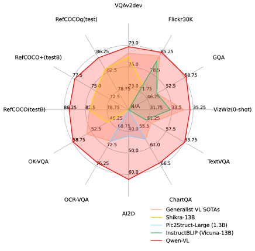
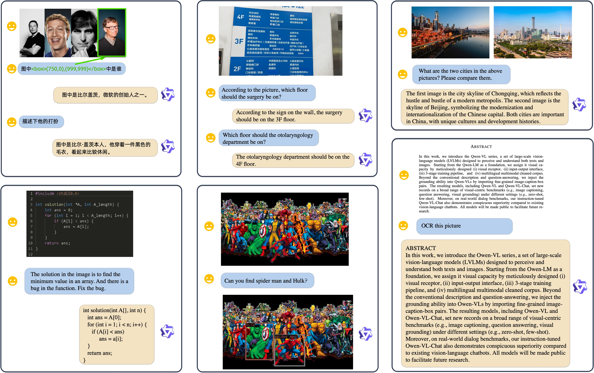
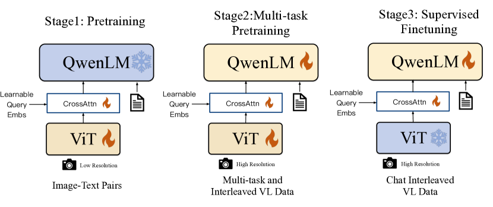
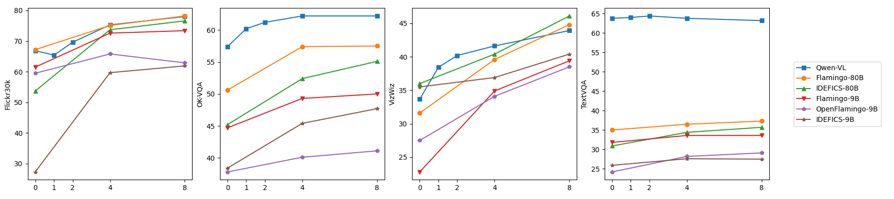

# Qwen-VL: 理解・位置特定・テキスト読解・さらにその先のための汎用視覚言語モデル

> 原題: Qwen-VL: A Versatile Vision-Language Model for Understanding, Localization, Text Reading, and Beyond
> 著者: Jinze Bai*, Shuai Bai*, Shusheng Yang*, Shijie Wang, Sinan Tan, Peng Wang, Junyang Lin, Chang Zhou†, Jingren Zhou
> 所属: Alibaba Group
> Code & Demo & Models: https://github.com/QwenLM/Qwen-VL

## Abstract（要旨）

本研究では、テキストと画像の双方を知覚し理解するように設計された大規模視覚言語モデル群（large-scale vision-language models, LVLMs）である Qwen-VL シリーズを紹介する。Qwen-LM を土台として、(i) 視覚受容器（visual receptor）、(ii) 入出力インターフェース、(iii) 3 段階の学習パイプライン、(iv) 多言語マルチモーダル・クリーン化コーパス、を入念に設計することで、それに視覚能力を付与する。従来の画像説明や質問応答に加え、画像-キャプション-ボックスの三つ組（image-caption-box tuples）の整合を通じて Qwen-VLs にグラウンディング（grounding, 物体の位置特定）能力とテキスト読解能力を実装する。結果として得られた Qwen-VL および Qwen-VL-Chat は、画像キャプション・質問応答・視覚グラウンディングなどの幅広い視覚中心ベンチマークと、ゼロショット・フューショットといった異なる設定の双方において、同等規模の汎用モデルの新記録を樹立する。さらに、現実世界の対話ベンチマークにおいても、命令調整済み（instruction-tuned）の Qwen-VL-Chat は既存の視覚言語チャットボットに比して優位性を示す。将来の研究を促進するため、すべてのモデルは公開される。

<figure>

<figcaption>図1: Qwen-VL は他の汎用モデルと比較して、幅広いタスクにおいて最先端の性能を達成する。</figcaption>
</figure>

<figure>

<figcaption>図2: Qwen-VL-Chat による定性的な出力例。Qwen-VL-Chat は複数画像入力、複数ターン対話、多言語会話、テキスト読解、位置特定、細粒度認識・理解能力をサポートする。</figcaption>
</figure>

## 1. Introduction（はじめに）

近年、大規模言語モデル（Large Language Models, LLMs）は、テキスト生成と理解における強力な能力により広く注目を集めている。これらのモデルは命令調整（instruction fine-tuning）を通じてユーザ意図にさらに整合させることが可能であり、強力な対話能力と、知的アシスタントとして生産性を高める潜在能力を示している。しかし、生来の大規模言語モデルは純粋にテキストの世界にのみ存在し、画像・音声・動画といった他の一般的なモダリティを扱う能力を欠いており、その応用範囲には大きな制約がある。これに動機づけられて、大規模言語モデルに視覚信号を知覚し理解する能力を付加するため、一連の大規模視覚言語モデル（Large Vision Language Models, LVLMs）が開発されてきた。これら大規模視覚言語モデルは、現実世界の視覚中心の問題を解決する上で有望な可能性を示している。

しかしながら、LVLM の限界と能力を探究する多くの研究が行われてきたにもかかわらず、現在のオープンソース LVLM は常に不十分な学習・最適化に悩まされており、その結果プロプライエタリ・モデルに大きく後れを取っており、これがオープンソース・コミュニティにおける LVLM のさらなる探究と応用を妨げている。さらに、現実世界の視覚シーンは非常に複雑であるため、細粒度視覚理解（fine-grained visual understanding）は LVLM が人々を効果的かつ精緻に支援するうえで決定的な役割を担う。しかし、この方向への試みはわずかしか行われておらず、オープンソース LVLM の大半は依然として粗粒度な手法で画像を知覚し、物体グラウンディングやテキスト読解のような細粒度知覚を実行する能力を欠いている。

本論文では、突破口を探究し、オープンソース化された Qwen ファミリーの最新メンバーである Qwen-VL シリーズを提示する。Qwen-VLs は、Qwen-7B 言語モデルに基づく、高い性能と汎用性を備えた一連の視覚言語基盤モデル（vision-language foundation models）である。我々は、言語整合型視覚エンコーダ（language-aligned visual encoder）と位置認識アダプタ（position-aware adapter）からなる新しい視覚受容器を導入することで、LLM の土台に視覚能力を付与する。全体的なモデル構造および入出力インターフェースは非常に簡潔であり、画像-テキスト・コーパスの膨大な集合に対してモデル全体を最適化するための 3 段階学習パイプラインを入念に設計する。

事前学習済みチェックポイントは Qwen-VL と呼ばれ、視覚入力を知覚・理解し、与えられたプロンプトに応じて望ましい応答を生成し、画像キャプション、質問応答、テキスト指向質問応答、視覚グラウンディングといった多様な視覚言語タスクを遂行することができる。Qwen-VL-Chat は Qwen-VL を基にした命令調整済みの視覚言語チャットボットである。図2 に示すように、Qwen-VL-Chat はユーザと対話し、ユーザの意図に従って入力画像を知覚することができる。

具体的には、Qwen-VL シリーズの特徴は以下の通りである：

- **先導的性能（Leading performance）**: Qwen-VLs は同規模の競合モデルと比較して、多数の視覚中心理解ベンチマークでトップクラスの精度を達成する。さらに、Qwen-VL の卓越した性能は従来のベンチマーク（例: キャプショニング、質問応答、グラウンディング）だけでなく、最近導入された対話ベンチマークもカバーする。
- **多言語（Multi-lingual）**: Qwen-LM と同様に、Qwen-VLs は英語と中国語に相当量のコーパスを含む多言語の画像-テキスト・データで学習される。これにより Qwen-VLs は自然に英語・中国語・多言語の命令をサポートする。
- **複数画像（Multi-image）**: 学習段階において、Qwen-VL の入力として任意の交互配置（interleaved）画像-テキスト・データを許容する。この機能により、Qwen-Chat-VL は複数画像が与えられた際に文脈を比較・理解・分析することが可能となる。
- **細粒度視覚理解（Fine-grained visual understanding）**: より高い入力解像度と細粒度コーパスを学習に用いたことにより、Qwen-VLs は高い競争力を持つ細粒度視覚理解能力を示す。既存の視覚言語汎用モデルと比較して、Qwen-VLs ははるかに優れたグラウンディング、テキスト読解、テキスト指向質問応答、細粒度対話の性能を有する。

## 2. Methodology（方法）

### 2.1 Model Architecture（モデル構造）

Qwen-VL の全体的なネットワーク構造は 3 つの構成要素からなり、モデル・パラメータの詳細は表1 に示す通りである：

**Large Language Model（大規模言語モデル）**: Qwen-VL は大規模言語モデルを基盤コンポーネントとして採用する。このモデルは Qwen-7B の事前学習済み重みで初期化される。

**Visual Encoder（視覚エンコーダ）**: Qwen-VL の視覚エンコーダは Vision Transformer（ViT）構造を用い、OpenCLIP の ViT-bigG の事前学習済み重みで初期化される。学習・推論を通じて、入力画像は特定の解像度にリサイズされる。視覚エンコーダは画像をストライド 14 でパッチに分割し、画像特徴の集合を生成する。

**Position-aware Vision-Language Adapter（位置認識視覚言語アダプタ）**: 長い画像特徴系列に起因する効率上の問題を緩和するため、Qwen-VL は画像特徴を圧縮する視覚言語アダプタを導入する。このアダプタはランダムに初期化された単層クロスアテンション（cross-attention）・モジュールから構成される。本モジュールは、学習可能なベクトル群（Embeddings）をクエリ・ベクトルとして、視覚エンコーダからの画像特徴をキーとしてクロスアテンション演算を行う。この機構により、視覚特徴系列は固定長 256 に圧縮される。クエリ数に関するアブレーションは Appendix E.2 に示す。加えて、細粒度画像理解にとって位置情報の重要性を踏まえ、圧縮時に位置の細部が失われる可能性を緩和するため、クロスアテンション機構のクエリ-キー対に 2D 絶対位置エンコーディング（2D absolute positional encodings）を組み込む。圧縮された長さ 256 の画像特徴系列はその後、大規模言語モデルに入力される。

**表1**: Qwen-VL モデル・パラメータの詳細。

| Vision Encoder | VL Adapter | LLM | Total |
| --- | --- | --- | --- |
| 1.9B | 0.08B | 7.7B | 9.6B |

<figure>

<figcaption>図3: Qwen-VL シリーズの学習パイプライン。Stage1（事前学習）では LLM を凍結し低解像度の画像-テキスト対で ViT とアダプタを学習する。Stage2（マルチタスク事前学習）では LLM の凍結を解除し、高解像度のマルチタスク・交互配置 VL データでモデル全体を学習する。Stage3（教師あり微調整, Supervised Finetuning）では ViT を凍結し、Chat 形式の交互配置 VL データで LLM とアダプタを学習する。</figcaption>
</figure>

### 2.2 Inputs and Outputs（入出力）

**Image Input（画像入力）**: 画像は視覚エンコーダとアダプタを通じて処理され、固定長の画像特徴系列を生成する。画像特徴入力とテキスト特徴入力を区別するため、画像特徴系列の冒頭と末尾にそれぞれ 2 つの特殊トークン（`` と `</img>`）を付加し、画像内容の開始と終了を示す。

**Bounding Box Input and Output（バウンディングボックスの入出力）**: モデルの細粒度視覚理解とグラウンディングのための能力を強化するため、Qwen-VL の学習には領域記述・質問・検出の形式のデータが含まれる。画像-テキスト記述や質問を扱う従来のタスクとは異なり、このタスクは指定された形式での領域記述をモデルが正確に理解・生成することを要求する。任意のバウンディングボックスに対して、[0, 1000) の範囲への正規化処理を施し、指定された文字列形式「$(X_{topleft}, Y_{topleft}), (X_{bottomright}, Y_{bottomright})$」に変換する。この文字列はテキストとしてトークン化され、追加の位置語彙を必要としない。検出文字列と通常のテキスト文字列を区別するため、バウンディングボックス文字列の冒頭と末尾に 2 つの特殊トークン（`<box>` と `</box>`）を付加する。さらに、バウンディングボックスを対応する記述語や文と適切に関連付けるため、別の特殊トークン群（`<ref>` と `</ref>`）を導入し、バウンディングボックスが参照する内容を標識する。

## 3. Training（学習）

図3 に示すように、Qwen-VL モデルの学習過程は、2 段階の事前学習と最終段階の命令微調整からなる 3 段階で構成される。

### 3.1 Pre-training（事前学習）

事前学習の第 1 段階では、大規模で弱ラベル付き・Web クロール由来の画像-テキスト対集合を主に利用する。事前学習データセットは、複数の公開ソースおよび一部の社内データから構成される。我々は特定のパターンを除去するためデータセットの浄化に努めた。表2 にまとめるように、元のデータセットは合計 50 億の画像-テキスト対を含み、浄化後は 14 億のデータが残り、その内訳は英語（テキスト）データ 77.3%、中国語（テキスト）データ 22.7% である。

**表2**: Qwen-VL 事前学習データの詳細。LAION-en と LAION-zh は LAION-5B の英語サブセットと中国語サブセット。LAION-COCO は LAION-en から生成された合成データセット。DataComp と Coyo は画像-テキスト対のコレクション。CC12M、CC3M、SBU、COCO Caption は学術キャプション・データセット。

| Language | Dataset | Original | Cleaned | Remaining% |
| --- | --- | --- | --- | --- |
| English | LAION-en | 2B | 280M | 14% |
|  | LAION-COCO | 600M | 300M | 50% |
|  | DataComp | 1.4B | 300M | 21% |
|  | Coyo | 700M | 200M | 28% |
|  | CC12M | 12M | 8M | 66% |
|  | CC3M | 3M | 3M | 100% |
|  | SBU | 1M | 0.8M | 80% |
|  | COCO Caption | 0.6M | 0.6M | 100% |
| Chinese | LAION-zh | 108M | 105M | 97% |
|  | In-house Data | 220M | 220M | 100% |
|  | Total | 5B | 1.4B | 28% |

この段階では大規模言語モデルを凍結し、視覚エンコーダと VL アダプタのみを最適化する。入力画像は 224×224 にリサイズされる。学習目的はテキスト・トークンの交差エントロピーを最小化することである。最大学習率は $2e^{-4}$ であり、画像-テキスト対のバッチサイズは 30720 を用い、事前学習の第 1 段階全体は 50,000 ステップ続き、おおよそ 15 億の画像-テキスト・サンプルを消費する。詳細なハイパーパラメータは Appendix C にあり、本段階の収束曲線は図6 に示す。

### 3.2 Multi-task Pre-training（マルチタスク事前学習）

マルチタスク事前学習の第 2 段階では、より大きな入力解像度と交互配置の画像-テキスト・データとともに、高品質で細粒度の VL アノテーション・データを導入する。表3 にまとめるように、Qwen-VL を 7 つのタスクで同時に学習させた。テキスト生成については、LLM の能力を維持するために社内収集のコーパスを用いる。キャプショニング・データは表2 と同じだが、サンプル数ははるかに少なく LAION-COCO を除外する。VQA タスクには GQA、VGQA、VQAv2、DVQA、OCR-VQA、DocVQA を含む公開データの混合を用いる。グラウンディング・タスクには Kosmos-2 に倣い、わずかな修正を加えた GRIT データセットを用いる。参照グラウンディング（reference grounding）と接地キャプショニング（grounded captioning）の双対タスクについては、GRIT、Visual Genome、RefCOCO、RefCOCO+、RefCOCOg から学習サンプルを構築する。テキスト指向タスクを改善するため、Common Crawl から pdf と HTML 形式のデータを収集し、先行研究に倣って自然風景の背景を持つ英語・中国語の合成 OCR データを生成する。最後に、同じタスクのデータを長さ 2048 の系列にパックすることで、交互配置の画像-テキスト・データを単純に構築する。

**表3**: Qwen-VL マルチタスク事前学習データの詳細。

| Task | # Samples | Dataset |
| --- | --- | --- |
| Captioning | 19.7M | LAION-en & zh, DataComp, Coyo, CC12M & 3M, SBU, COCO, In-house Data |
| VQA | 3.6M | GQA, VGQA, VQAv2, DVQA, OCR-VQA, DocVQA, TextVQA, ChartQA, AI2D |
| Grounding | 3.5M | GRIT |
| Ref Grounding | 8.7M | GRIT, Visual Genome, RefCOCO, RefCOCO+, RefCOCOg |
| Grounded Cap. | 8.7M | GRIT, Visual Genome, RefCOCO, RefCOCO+, RefCOCOg |
| OCR | 24.8M | SynthDoG-en & zh, Common Crawl pdf & HTML |
| Pure-text Autoregression | 7.8M | In-house Data |

視覚エンコーダの入力解像度を 224×224 から 448×448 へと引き上げ、画像のダウンサンプリングによる情報損失を削減する。さらに、視覚 Transformer の高解像度におけるウィンドウ・アテンションとグローバル・アテンションのアブレーションを Appendix E.3 で行う。我々は大規模言語モデルの凍結を解除し、モデル全体を学習する。学習目的は事前学習段階と同じである。

### 3.3 Supervised Fine-tuning（教師あり微調整）

この段階では、Qwen-VL 事前学習済みモデルを命令微調整によって微調整し、その命令追従能力と対話能力を強化することで、対話型の Qwen-VL-Chat モデルを得る。マルチモーダル命令調整データの大半は、キャプション・データまたは LLM の自己命令（self-instruction）によって生成された対話データから来ており、これらはしばしば単一画像の対話と推論のみを扱い、画像内容の理解に限定される。我々は、Qwen-VL モデルに位置特定能力と複数画像理解能力を組み込むため、手動アノテーション、モデル生成、戦略的連結を通じて追加の対話データ集合を構築する。我々はこのモデルがこれらの能力をより広範な言語と質問種別へと効果的に転移することを確認する。さらに、対話能力の汎用性を確保するため、学習時にマルチモーダルと純テキスト対話データを混合する。命令調整データは合計 350k である。本段階では、視覚エンコーダを凍結し、言語モデルとアダプタ・モジュールを最適化する。本段階のデータ形式は Appendix B.2 に示す。

## 4. Evaluation（評価）

本節では、モデルの視覚理解能力を包括的に評価するため、多様なマルチモーダル・タスクで総合評価を行う。以下、Qwen-VL はマルチタスク学習後のモデルを、Qwen-VL-Chat は教師あり微調整（SFT）段階後のモデルを指す。

表9 は、使用された評価ベンチマークとそれに対応する評価指標の詳細な要約を提供する。

### 4.1 Image Caption and General Visual Question Answering（画像キャプションと一般 VQA）

画像キャプションと一般視覚質問応答（VQA）は、視覚言語モデルの 2 つの従来型タスクである。具体的には、画像キャプションは与えられた画像に対する記述を生成することを、一般 VQA は与えられた画像-質問対に対する回答を生成することを要求する。

**表4**: 画像キャプショニングと一般 VQA の結果。

| Model Type | Model | Nocaps (0-shot) | Flickr30K (0-shot) | VQAv2 | OKVQA | GQA | SciQA-Img (0-shot) | VizWiz (0-shot) |
| --- | --- | --- | --- | --- | --- | --- | --- | --- |
| Generalist | Flamingo-9B | - | 61.5 | 51.8 | 44.7 | - | - | 28.8 |
|  | Flamingo-80B | - | 67.2 | 56.3 | 50.6 | - | - | 31.6 |
|  | Unified-IO-XL | 100.0 | - | 77.9 | 54.0 | - | - | - |
|  | Kosmos-1 | - | 67.1 | 51.0 | - | - | - | 29.2 |
|  | Kosmos-2 | - | 80.5 | 51.1 | - | - | - | - |
|  | BLIP-2 (Vicuna-13B) | 103.9 | 71.6 | 65.0 | 45.9 | 32.3 | 61.0 | 19.6 |
|  | InstructBLIP (Vicuna-13B) | 121.9 | 82.8 | - | - | 49.5 | 63.1 | 33.4 |
|  | Shikra (Vicuna-13B) | - | 73.9 | 77.36 | 47.16 | - | - | - |
|  | **Qwen-VL (Qwen-7B)** | **121.4** | **85.8** | **79.5** | **58.6** | **59.3** | **67.1** | **35.2** |
|  | **Qwen-VL-Chat** | 120.2 | 81.0 | 78.2 | 56.6 | 57.5 | 68.2 | 38.9 |
| Specialist SOTAs |  | 127.0 (PALI-17B) | 84.5 (InstructBLIP) | 86.1 (PALI-X) | 66.1 (PALI-X) | 72.1 (CFR) | 92.53 (LLaVa+GPT-4) | 70.9 (PALI-X) |

画像キャプション・タスクには Nocaps と Flickr30K をベンチマークとして選択し、評価指標として CIDEr スコアを報告する。キャプション生成には「Describe the image in English:」というプロンプトを伴う貪欲探索（greedy search）を用いる。

一般 VQA については、VQAv2、OKVQA、GQA、ScienceQA（画像セット）、VizWiz VQA を含む 5 つのベンチマークを利用する。VQAv2、OKVQA、GQA、VizWiz VQA については、モデル出力空間への制約を設けず、「{question} Answer:」のプロンプトを伴うオープンエンドの回答生成と貪欲復号戦略を用いる。一方、ScienceQA については、モデル出力を可能な選択肢に制約し（オープンエンドではなく）、最高信頼度を持つ選択肢をモデルの予測として選び、Top-1 精度を報告する。

画像キャプションと一般 VQA タスクにおける総合性能は表4 に報告される。結果が示すように、Qwen-VL と Qwen-VL-Chat はともに両タスクにおいて従来の汎用モデルと比較して明らかに優れた結果を達成する。具体的には、ゼロショット画像キャプション・タスクにおいて、Qwen-VL は Flickr30K karpathy-test 分割で最先端の性能（すなわち 85.8 CIDEr スコア）を達成し、はるかに多くのパラメータを持つ従来の汎用モデル（例: 800 億パラメータの Flamingo-80B）すら凌駕する。

一般 VQA ベンチマークにおいても、我々のモデルは他に対する明確な優位性を示す。VQAv2、OKVQA、GQA ベンチマークにおいて、Qwen-VL はそれぞれ 79.5、58.6、59.3 の精度を達成し、最近提案された LVLM を大きな差で凌駕する。Qwen-VL は ScienceQA および VizWiz データセットにおいても強いゼロショット性能を示す点は特筆に値する。

### 4.2 Text-oriented Visual Question Answering（テキスト指向 VQA）

テキスト指向視覚理解は、現実世界のシナリオで広い応用展望を持つ。我々はモデルのテキスト指向視覚質問応答能力を、TextVQA、DocVQA、ChartQA、AI2Diagram、OCR-VQA を含む複数のベンチマークで評価する。同様に結果は表5 に示される。従来の汎用モデルおよび最近の LVLM と比較して、我々のモデルは大多数のベンチマークでより優れた性能を、しばしば大きな差で示す。

**表5**: テキスト指向 VQA の結果。

| Model type | Model | TextVQA | DocVQA | ChartQA | AI2D | OCR-VQA |
| --- | --- | --- | --- | --- | --- | --- |
| Generalist | BLIP-2 (Vicuna-13B) | 42.4 | - | - | - | - |
|  | InstructBLIP (Vicuna-13B) | 50.7 | - | - | - | - |
|  | mPLUG-DocOwl (LLaMA-7B) | 52.6 | 62.2 | 57.4 | - | - |
|  | Pix2Struct-Large (1.3B) | - | 76.6 | 58.6 | 42.1 | 71.3 |
|  | **Qwen-VL (Qwen-7B)** | **63.8** | 65.1 | 65.7 | **62.3** | **75.7** |
|  | Qwen-VL-Chat | 61.5 | 62.6 | **66.3** | 57.7 | 70.5 |
| Specialist SOTAs | PALI-X-55B (Single-task FT) | 71.44 | 80.0 | 70.0 | 81.2 | 75.0 |

### 4.3 Refer Expression Comprehension（参照表現理解）

我々は、RefCOCO、RefCOCOg、RefCOCO+、GRIT といった一連の参照表現理解ベンチマークで評価することによって、モデルの細粒度画像理解と位置特定能力を示す。具体的には、参照表現理解タスクは、記述の指示の下で対象物体を位置特定することをモデルに要求する。結果は表6 に示される。従来の汎用モデルや最近の LVLM と比較して、我々のモデルはすべてのベンチマークでトップクラスの結果を獲得する。

**表6**: 参照表現理解タスクの結果。

| Model type | Model | RefCOCO val | RefCOCO test-A | RefCOCO test-B | RefCOCO+ val | RefCOCO+ test-A | RefCOCO+ test-B | RefCOCOg val | RefCOCOg test | GRIT refexp |
| --- | --- | --- | --- | --- | --- | --- | --- | --- | --- | --- |
| Generalist | GPV-2 | - | - | - | - | - | - | - | - | 51.50 |
|  | OFA-L* | 79.96 | 83.67 | 76.39 | 68.29 | 76.00 | 61.75 | 67.57 | 67.58 | 61.70 |
|  | Unified-IO | - | - | - | - | - | - | - | - | 78.61 |
|  | VisionLLM-H |  | 86.70 | - | - | - | - | - | - | - |
|  | Shikra-7B | 87.01 | 90.61 | 80.24 | 81.60 | 87.36 | 72.12 | 82.27 | 82.19 | 69.34 |
|  | Shikra-13B | 87.83 | 91.11 | 81.81 | 82.89 | 87.79 | 74.41 | 82.64 | 83.16 | 69.03 |
|  | **Qwen-VL-7B** | **89.36** | **92.26** | **85.34** | **83.12** | **88.25** | **77.21** | **85.58** | **85.48** | **78.22** |
|  | Qwen-VL-7B-Chat | 88.55 | 92.27 | 84.51 | 82.82 | 88.59 | 76.79 | 85.96 | 86.32 | - |
| Specialist | G-DINO-L | 90.56 | 93.19 | 88.24 | 82.75 | 88.95 | 75.92 | 86.13 | 87.02 | - |
|  | UNINEXT-H | 92.64 | 94.33 | 91.46 | 85.24 | 89.63 | 79.79 | 88.73 | 89.37 | - |
|  | ONE-PEACE | 92.58 | 94.18 | 89.26 | 88.77 | 92.21 | 83.23 | 89.22 | 89.27 | - |

### 4.4 Few-shot Learning on Vision-Language Tasks（視覚言語タスクのフューショット学習）

本モデルは満足な文脈内学習（in-context learning、すなわちフューショット学習）能力も示す。図4 に示すように、Qwen-VL は同等パラメータ数のモデル（Flamingo-9B、OpenFlamingo-9B、IDEFICS-9B）と比較した場合、OKVQA、VizWiz、TextVQA、Flickr30k で文脈内フューショット学習を通じてより優れた性能を達成する。Qwen-VL の性能は、はるかに大規模なモデル（Flamingo-80B および IDEFICS-80B）にも匹敵する。我々はフューショット例構築に単純なランダム・サンプリングを採用しており、RICES のような洗練されたフューショット例構築手法は使用していない（使用すれば、より良い結果が得られるだろう）。

<figure>

<figcaption>図4: 他モデルと比較した Qwen-VL のフューショット学習結果。</figcaption>
</figure>

### 4.5 Instruction Following in Real-world User Behavior（実世界ユーザ行動での命令追従）

従来型の視覚言語評価に加えて、Qwen-VL-Chat モデルの実世界ユーザ行動下での能力を評価するため、TouchStone、SEED-Bench、MME での評価をさらに実施する。TouchStone は、オープンエンドの視覚言語命令追従ベンチマークである。我々は、TouchStone ベンチマーク上で英語・中国語の双方において、Qwen-VL-Chat の命令追従能力を他の命令調整済み LVLM と比較する。SEED-Bench は、空間的・時間的理解の双方を含む 12 の評価次元をカバーする、マルチモーダル LLM 評価のための人手アノテーション付き 19K の多肢選択質問からなる。MME は、合計 14 のサブタスクで知覚と認知の双方の能力を測定する。

3 つのベンチマーク上の結果は表7 に示される。Qwen-VL-Chat は 3 つのデータセットすべてにおいて他の LVLM に対し明白な優位性を達成しており、我々のモデルが多様なユーザ命令の理解と回答においてより優れていることを示している。SEED-Bench では、4 フレームをサンプリングするだけで、我々のモデルの視覚能力が動画タスクへ効果的に転移できることを発見した。TouchStone で示される総合スコアの観点では、我々のモデルは他の LVLM に対して明確な優位性を示し、特に中国語能力で顕著である。広範な能力カテゴリの観点では、本モデルは理解と認識、とりわけテキスト認識やチャート分析の領域でより顕著な優位性を示す。より詳細な情報については TouchStone データセットを参照されたい。

**表7**: 命令追従ベンチマークの結果。

| Model | TouchStone En | TouchStone Cn | SEED-Bench All | SEED-Bench Img | SEED-Bench Video | MME Perception | MME Cognition |
| --- | --- | --- | --- | --- | --- | --- | --- |
| VisualGLM | - | 247.1 | - | - | - | 705.31 | 181.79 |
| PandaGPT | 488.5 | - | - | - | - | 642.59 | 228.57 |
| MiniGPT4 | 531.7 | - | 42.8 | 47.4 | 29.9 | 581.67 | 144.29 |
| InstructBLIP | 552.4 | - | 53.4 | 58.8 | 38.1 | 1212.82 | 291.79 |
| LLaMA-AdapterV2 | 590.1 | - | 32.7 | 35.2 | 25.8 | 972.67 | 248.93 |
| LLaVA | 602.7 | - | 33.5 | 37.0 | 23.8 | 502.82 | 214.64 |
| mPLUG-Owl | 605.4 | - | 34.0 | 37.9 | 23.0 | 967.34 | 276.07 |
| Qwen-VL | - | - | 56.3 | 62.3 | 39.1 | - | - |
| **Qwen-VL-Chat** | **645.2** | **401.2** | **58.2** | **65.4** | 37.8 | **1487.58** | **360.71** |

## 5. Related Work（関連研究）

近年、研究者たちは視覚言語学習に多大な関心を示してきており、特にマルチタスク汎用モデルの開発に注目している。CoCa はエンコーダ-デコーダ構造を提案し、画像-テキスト検索と視覚言語生成タスクを同時に扱う。OFA はカスタマイズされたタスク命令を用いて、特定の視覚言語タスクを系列対系列タスクに変換する。Unified I/O はセグメンテーションや深度推定のようなより多くのタスクを統一フレームワークに導入する。別カテゴリの研究は、視覚言語表現モデルの構築に注目している。CLIP は対照学習（contrastive learning）と大量のデータを活用して画像と言語を意味空間で整合させ、結果として広範囲の下流タスクで強力な汎化能力を得る。BEIT-3 は混合エキスパート（mixture-of-experts, MoE）構造と統一マスク・トークン予測目的を用い、各種視覚言語タスクで最先端の結果を達成する。視覚言語学習に加えて、ImageBind と ONE-PEACE は音声などより多くのモダリティを統一意味空間に整合させ、より汎用的な表現モデルを構築する。

著しい進歩を遂げたものの、従来の視覚言語モデルには、命令追従の頑健性の低さ、未見タスクでの汎化能力の限界、文脈内能力の欠如など、いくつかの限界が依然として残っていた。大規模言語モデル（LLM）の急速な発展に伴い、研究者たちは LLM に基づくより強力な大規模視覚言語モデル（LVLM）の構築に着手し始めた。BLIP-2 は凍結された視覚基盤モデルと LLM を整合させる Q-Former を提案する。一方、LLAVA と Mini-GPT4 は LVLM の命令追従能力を強化するための視覚命令調整（visual instruction tuning）を導入する。さらに、mPLUG-DocOwl はデジタル文書データを導入することで LVLM に文書理解能力を組み込む。Kosmos2、Shikra、BuboGPT はさらに視覚グラウンディング能力で LVLM を強化し、領域記述と位置特定を可能にする。本研究では、画像キャプショニング、視覚質問応答、OCR、文書理解、視覚グラウンディングの能力を Qwen-VL に統合する。結果として得られるモデルは、これらの多様な様式のタスクで卓越した性能を達成する。

## 6. Conclusion and Future Work（結論と今後の研究）

我々は、マルチモーダル研究の促進を目指す大規模多言語視覚言語モデル群、Qwen-VL シリーズを公開する。Qwen-VL は多様なベンチマークで同種のモデルを凌駕し、多言語対話、複数画像交互配置対話、中国語でのグラウンディング、細粒度認識をサポートする。今後、我々は Qwen-VL の能力を以下のいくつかの主要次元でさらに強化することに専念する：

- Qwen-VL を音声や動画などより多くのモダリティと統合すること。
- モデル規模、学習データ、より高い解像度をスケールアップして Qwen-VL を増強し、マルチモーダル・データ内のより複雑で込み入った関係を扱えるようにすること。
- 高忠実度な画像と流暢な音声の生成といったマルチモーダル生成における Qwen-VL の能力を拡大すること。
