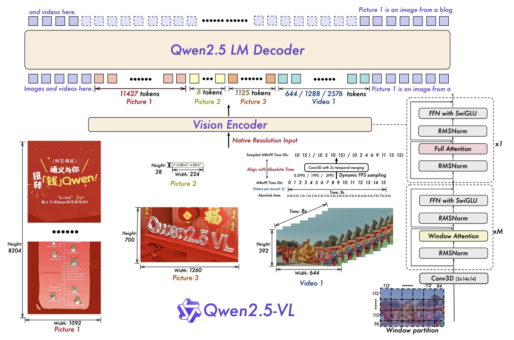

# Qwen2.5-VL テクニカル・レポート

> 原題: Qwen2.5-VL Technical Report
> 著者: Qwen Team, Alibaba Group（Core Contributors: Shuai Bai, Keqin Chen, Xuejing Liu, Jialin Wang, Wenbin Ge, Sibo Song, Kai Dang, Peng Wang, Shijie Wang, Jun Tang, Humen Zhong, Yuanzhi Zhu, Mingkun Yang, Zhaohai Li, Jianqiang Wan, Pengfei Wang, Wei Ding, Zheren Fu, Yiheng Xu, Jiabo Ye, Xi Zhang, Tianbao Xie, Zesen Cheng, Hang Zhang, Zhibo Yang, Haiyang Xu, Junyang Lin ら）
> 所属: Qwen Team, Alibaba Group
> 出典: arXiv:2502.13923（2025 年 2 月 19 日 v1、2025 年 3 月 5 日報告）
> リンク: https://chat.qwenlm.ai / https://huggingface.co/Qwen / https://modelscope.cn/organization/qwen / https://github.com/QwenLM/Qwen2.5-VL

## Abstract（要旨）

我々は Qwen2.5-VL を紹介する。これは Qwen 視覚言語シリーズの最新のフラッグシップ・モデルであり、基礎的能力と革新的機能の双方で顕著な進歩を示す。Qwen2.5-VL は、強化された視覚認識、精緻な物体位置特定、堅牢な文書解析、長時間動画理解を通じて、世界の理解と相互作用において大きな飛躍を達成する。Qwen2.5-VL の際立った特徴は、**バウンディング・ボックスや点を用いて物体を正確に位置特定する能力**である。請求書、フォーム、表からの堅牢な構造化データ抽出に加え、チャート、図、レイアウトの詳細な解析を提供する。複雑な入力を扱うため、Qwen2.5-VL は **動的解像度処理**と **絶対時間エンコーディング**を導入し、様々なサイズの画像と長時間（数時間まで）の動画を秒レベルのイベント位置特定とともに処理することを可能にする。これによりモデルは伝統的な正規化技法に依存せず、空間スケールと時間動態をネイティブに知覚できる。**ネイティブな動的解像度の Vision Transformer（ViT）をゼロから学習させ、Window Attention を組み込むことで**、ネイティブ解像度を維持しつつ計算オーバーヘッドを大幅に削減した。結果として、Qwen2.5-VL は静的な画像・文書理解だけでなく、コンピュータやモバイル機器の操作のような現実世界シナリオでの推論・ツール使用・タスク実行が可能な対話型視覚エージェントとしても優れている。本モデルはタスク固有の微調整なしにドメインをまたいだ強力な汎化を達成する。Qwen2.5-VL は **3 サイズ**で利用可能で、エッジ AI から高性能コンピューティングに至る多様な利用ケースに対応する。フラッグシップ Qwen2.5-VL-72B モデルは、特に文書・図解理解で GPT-4o や Claude 3.5 Sonnet のような最先端モデルに匹敵する。小型の Qwen2.5-VL-7B と Qwen2.5-VL-3B モデルも、リソース制約のある環境でも強力な能力を提供し、同等の競合を凌駕する。さらに Qwen2.5-VL は Qwen2.5 LLM の中核的言語能力を維持し、堅牢な言語性能を保持する。

<figure>



<figcaption>図1: Qwen2.5-VL のフレームワーク。視覚エンコーダと言語モデル・デコーダを統合してマルチモーダル入力（画像と動画）を処理する。視覚エンコーダはネイティブ解像度で入力を扱い、動的 FPS サンプリングをサポートするように設計されている。様々なサイズの画像と異なる FPS の動画フレームは、可変長のトークン列へ動的にマッピングされる。特に、MRoPE は時間次元に沿った時間 ID を絶対時間と整合させ、イベントの速度や正確な瞬間の位置特定など、モデルの時間動態理解を改善する。処理された視覚データは続いて Qwen2.5 LM Decoder に入力される。我々は ViT 構造を再設計し、SwiGLU 活性化関数による FFN、正規化のための RMSNorm、性能と効率を強化するための **Window Attention** などの先進的構成要素を組み込んだ。</figcaption>
</figure>

## 1. Introduction（はじめに）

大規模視覚言語モデル（Large Vision-Language Models, LVLMs）は、人工知能における重要なブレークスルーを表し、マルチモーダル理解と相互作用への変革的アプローチを示している。視覚知覚を自然言語処理にシームレスに統合することで、これら先進モデルは機械が多様な領域にわたる複雑な情報を解釈・分析する方法を根本的に再形成している。マルチモーダル大規模言語モデルにおける著しい進歩にもかかわらず、これらモデルの現在の能力は、サンドイッチ・クッキーの中間層に例えることができる—様々なタスクで有能ではあるが、卓越した性能には及ばない。**細粒度視覚タスクはこの類比の基礎的層を形成する**。本作の Qwen2.5-VL では、我々は細粒度知覚能力の探究に専念し、LVLM の堅牢な基盤を確立すると同時に、現実世界応用のためのエージェント的増幅器を作ることを目指す。このフレームワークの最上層はマルチモーダル推論であり、これは最新の Qwen2.5 LLM の活用とマルチモーダル QA データ構築の採用によって強化される。

一連の研究が、構造設計、視覚入力処理、データ整備によって特徴付けられるマルチモーダル大規模モデルの発展を推進してきた。LVLM の進歩の主要な推進力の 1 つは、構造における継続的革新である。これまでの研究は、視覚エンコーダ、クロスモーダル投影器、LLM から構成される典型的な現在のパラダイムを徐々に形成してきた。細粒度知覚モデルは別の重要な領域として浮上した。詳細視覚理解で可能な境界を押し広げるモデルが登場している。Omni（マルチモーダル統合）と MoE（混合エキスパート）の構造もまた LVLM の将来進化を触発している。視覚エンコーダの強化と解像度スケーリングは、実用的視覚理解の質を改善する上で決定的な役割を果たしてきた。より多様なシナリオとより高い品質でデータを整備することは、先進的 LVLM の学習における不可欠なステップである。

しかし、その顕著な進歩にもかかわらず、視覚言語モデルは現在、計算複雑性、限定的な文脈理解、貧弱な細粒度視覚知覚、可変系列長にわたる一貫しない性能を含む発展上のボトルネックに直面している。

本報告では、Qwen シリーズの最新作 Qwen2.5-VL を紹介する。これは Qwen シリーズのオープンソース哲学を継続し、様々なベンチマークでトップクラスの閉源モデルを達成し凌駕すらする。技術的には、我々の貢献は 4 つに分かれる：(1) **視覚エンコーダにウィンドウ・アテンション（window attention）を実装**して推論効率を最適化する、(2) **動的 FPS サンプリング**を導入し、動的解像度を時間次元へ拡張して様々なサンプリング・レートにわたる包括的動画理解を可能にする、(3) **MRoPE を時間領域で絶対時間と整合**するようアップグレードし、より洗練された時間系列学習を促進する、(4) 事前学習と教師あり微調整の双方で **高品質データの整備に大きな努力**を払い、事前学習コーパスを 1.2 兆トークンから **4.1 兆トークン**へとさらにスケールする。

Qwen2.5-VL の特筆すべき特徴は以下の通りである：

- **強力な文書解析能力**: Qwen2.5-VL はテキスト認識を **omni-document parsing** にアップグレードし、マルチシーン・多言語・各種組み込み（手書き、表、チャート、化学式、楽譜）文書の処理に優れる。
- **形式をまたぐ精緻な物体グラウンディング**: Qwen2.5-VL は物体の検出、ポインティング、カウントの精度向上を解放し、高度な空間推論のために絶対座標と JSON 形式の双方に対応する。
- **超長動画理解と細粒度動画グラウンディング**: 我々のモデルはネイティブ動的解像度を時間次元に拡張し、数時間にわたる動画を理解する能力を高めつつ、秒単位でイベント区間を抽出する。
- **コンピュータ・モバイル機器のための強化されたエージェント機能**: 先進的グラウンディング、推論、意思決定能力を活用し、スマートフォンとコンピュータでの優れたエージェント機能をモデルに与える。

## 2. Approach（手法）

本節では、まず Qwen2.5-VL シリーズ・モデルの構造的更新を概観し、データと学習詳細を述べる。

### 2.1 Model Architecture（モデル構造）

Qwen2.5-VL の全体的モデル構造は 3 つの構成要素から成る：

**Large Language Model**: Qwen2.5-VL シリーズは大規模言語モデルを基盤構成要素として採用する。モデルは **Qwen2.5 LLM** の事前学習済み重みで初期化される。マルチモーダル理解の要求により応えるため、1D RoPE（Rotary Position Embedding, 回転位置埋め込み）を我々の **Multimodal Rotary Position Embedding Aligned to Absolute Time**（絶対時間に整合したマルチモーダル回転位置埋め込み）に修正した。

**Vision Encoder**: Qwen2.5-VL の視覚エンコーダは、再設計された Vision Transformer（ViT）構造を採用する。構造的に、ネイティブ入力解像度をサポートしつつ視覚エンコーダ全体の計算を加速するため、**2D-RoPE** と **window attention** を組み込む。学習と推論の両過程で、入力画像の高さと幅は ViT に入力される前に **28 の倍数**にリサイズされる。視覚エンコーダはストライド 14 のパッチに画像を分割することで処理し、画像特徴の集合を生成する。視覚エンコーダのより詳細な説明は §2.1.1 で提供する。

**MLP-based Vision-Language Merger**: 画像特徴の長い系列によって生じる効率問題に対処するため、特徴系列を LLM に入力する前に圧縮する単純で効果的なアプローチを採用する。具体的には、Vision Transformer（ViT）が抽出した生のパッチ特徴を直接使用する代わりに、まず **空間的に隣接する 4 つのパッチ特徴の集合をグループ化**する。これらグループ化された特徴は連結され、2 層 MLP を通じて LLM で用いるテキスト埋め込みと整合する次元へと投影される。この方法は計算コストを削減するだけでなく、可変長の画像特徴系列を動的に圧縮する柔軟な方法を提供する。

表 1 に Qwen2.5-VL の構造と構成の詳細を示す。

**表1**: Qwen2.5-VL の構成。

| Configuration | Qwen2.5-VL-3B | Qwen2.5-VL-7B | Qwen2.5-VL-72B |
| --- | --- | --- | --- |
| **Vision Transformer (ViT)** | | | |
| Hidden Size | 1280 | 1280 | 1280 |
| # Layers | 32 | 32 | 32 |
| # Num Heads | 16 | 16 | 16 |
| Intermediate Size | 3456 | 3456 | 3456 |
| Patch Size | 14 | 14 | 14 |
| Window Size | 112 | 112 | 112 |
| Full Attention Block Indexes | {7, 15, 23, 31} | {7, 15, 23, 31} | {7, 15, 23, 31} |
| **Vision-Language Merger** | | | |
| In Channel | 1280 | 1280 | 1280 |
| Out Channel | 2048 | 3584 | 8192 |
| **Large Language Model (LLM)** | | | |
| Hidden Size | 2048 | 3584 | 8192 |
| # Layers | 36 | 28 | 80 |
| # KV Heads | 2 | 4 | 8 |
| Head Size | 128 | 128 | 128 |
| Intermediate Size | 4864 | 18944 | 29568 |
| Embedding Tying | ✓ | ✗ | ✗ |
| Vocabulary Size | 151646 | 151646 | 151646 |
| # Trained Tokens | 4.1T | 4.1T | 4.1T |

#### 2.1.1 Fast and Efficient Vision Encoder（高速で効率的な視覚エンコーダ）

視覚エンコーダはマルチモーダル大規模言語モデル（MLLM）において極めて重要な役割を果たす。ネイティブ解像度入力に起因する学習・推論時の計算負荷の不均衡によってもたらされる課題に対処するため、Vision Transformer（ViT）構造を再設計した。**主要な問題は、様々なサイズの画像処理に伴う 2 次の計算複雑性**から生じる。これを軽減するため、ほとんどの層に **ウィンドウ・アテンション**（windowed attention）を導入し、計算コストがパッチ数に対して 2 次ではなく **線形にスケール**することを保証する。我々の構造では、**わずか 4 層が完全自己注意を採用**し、残りの層は最大ウィンドウサイズ 112×112（**8×8 パッチに対応**）のウィンドウ・アテンションを利用する。112×112 より小さい領域はパディングなしに処理され、元の解像度を保持する。この設計により、モデルは入力解像度でネイティブに動作でき、不要なスケーリングや歪みを回避できる。

位置エンコーディングのため、**2D Rotary Positional Embedding (RoPE)** を採用し、2D 空間における空間関係を効果的に捕捉する。さらに、動画入力をより良く扱うため、アプローチを **3D パッチ分割**へ拡張する。具体的には、静的画像のための伝統的 ViT と一貫して、基本的画像パッチとして 14×14 画像パッチを用いる。動画データについては、**連続する 2 フレームをグループ化**し、言語モデルに供給されるトークン数を著しく削減する。この設計は既存構造との互換性を保つだけでなく、逐次動画データを処理する際の効率も高める。

全体的ネットワーク構造を合理化するため、ViT 構造を大規模言語モデル（LLM）の設計原則とより密接に整合させる。具体的には、正規化のため **RMSNorm**、活性化関数として **SwiGLU** を採用する。これらの選択は、モデルの視覚成分と言語成分の双方の計算効率と互換性を高める。

学習に関しては、**再設計された ViT をゼロから学習**させる。学習過程は、CLIP 事前学習、視覚言語整合、エンドツーエンド微調整を含むいくつかの段階から成る。様々な入力解像度にわたる頑健性を確保するため、学習中にネイティブ解像度での動的サンプリングを採用する。画像は元のアスペクト比に従ってランダムにサンプリングされ、多様な解像度の入力にモデルが効果的に汎化することを可能にする。このアプローチはモデルの適応性を改善するだけでなく、異なるサイズの視覚データにわたる安定で効率的な学習も保証する。

#### 2.1.2 Native Dynamic Resolution and Frame Rate（ネイティブ動的解像度とフレームレート）

Qwen2.5-VL は、多様なマルチモーダル入力を効果的に扱うため、空間と時間の双方の次元における進展を導入する。

空間領域では、Qwen2.5-VL は様々なサイズの画像を対応する長さのトークン列へ動的に変換する。座標を正規化する伝統的アプローチとは異なり、本モデルは **入力画像の実際の次元を直接使用**してバウンディング・ボックス、点、その他の空間特徴を表現する。これによりモデルはスケール情報を本質的に学習でき、異なる解像度にわたる画像処理能力を改善する。

動画入力については、Qwen2.5-VL は **動的フレームレート（FPS）学習**と **絶対時間エンコーディング**を組み込む。可変フレームレートに適応することで、モデルは動画コンテンツの時間動態をより良く捕捉できる。テキストのタイムスタンプを組み込んだり、時間グラウンディングのために追加ヘッドを活用する他のアプローチとは異なり、我々は **MRoPE ID をタイムスタンプと直接整合させる**新規で効率的な戦略を導入する。このアプローチにより、モデルは追加計算オーバーヘッドを必要とせずに **時間次元 ID 間の間隔を通じて時間のテンポを理解**できる。

#### 2.1.3 Multimodal Rotary Position Embedding Aligned to Absolute Time（絶対時間に整合したマルチモーダル回転位置埋め込み）

位置埋め込みは視覚と言語両モダリティにおける逐次データのモデル化に極めて重要である。Qwen2-VL で導入された Multimodal Rotary Position Embedding（MRoPE）を基盤として、動画における時間情報をより良く扱う能力を拡張する。

Qwen2-VL における MRoPE は、位置埋め込みを 3 つの区別された成分—**時間（temporal）、高さ、幅**—に分解する。テキスト入力に対しては、3 成分すべてが同一の位置 ID を用い、MRoPE は機能的に伝統的な 1D RoPE と等価になる。画像に対しては、時間 ID は視覚トークンをまたいで一定に保たれる一方、画像内の各トークンの空間位置に基づいて高さと幅成分に固有 ID が割り当てられる。動画はフレーム列として扱われ、時間 ID は各フレームごとに増分する一方、高さと幅成分は静的画像と同じ割り当てパターンに従う。

しかし Qwen2-VL では、MRoPE における時間位置 ID は **入力フレーム数に紐付け**られていたため、動画内のコンテンツ変化の速度やイベントの絶対的タイミングを考慮していなかった。この制限に対処するため、Qwen2.5-VL は **MRoPE の時間成分を絶対時間と整合させる**重要な改善を導入する。図 1 に示すように、**時間 ID 間の間隔を活用することで**、モデルは異なる FPS サンプリング・レートを持つ動画にわたって一貫した時間整合を学習できる。

### 2.2 Pre-Training（事前学習）

本節では、まず事前学習データセットの構築を述べ、続いて全体的な学習パイプラインと構成の概観を提供する。

#### 2.2.1 Pre-Training Data（事前学習データ）

Qwen2-VL と比較して、我々は事前学習データの量を **1.2 兆トークンから約 4 兆トークンへ大幅に拡大**した。事前学習データセットは、Web 生データの浄化、データ合成などを含む手法の組み合わせを通じて構築された。データセットは、画像キャプション、交互配置画像-テキスト・データ、光学文字認識（OCR）データ、視覚知識（例: 著名人、ランドマーク、植物相、動物相識別）、マルチモーダル学術問題、位置特定データ、文書解析データ、動画記述、動画位置特定、エージェントベース対話データなど、多様なマルチモーダル・データを包含する。学習過程全体を通じて、これらデータ型の構成と割合を異なる段階で慎重に調整し、学習成果を最適化した。

**Interleaved Image-Text Data（交互配置画像-テキスト・データ）**: 交互配置画像-テキスト・データはマルチモーダル学習に不可欠で、3 つの主要な利点を提供する：(1) 同時的視覚・テキスト合図を伴う文脈内学習を可能にすること、(2) 画像が欠落している場合に強力なテキスト専用能力を維持すること、(3) 広範な一般情報を含むこと。しかし、利用可能な交互配置データの多くは、意味のあるテキスト-画像関連を欠き、しばしばノイズが多く、複雑な推論と創造的生成にとって有用性が限られている。

これらの課題に対処するため、データ採点・浄化のためのパイプラインを開発し、高品質で関連性の高い交互配置データのみが使用されることを保証した。我々のプロセスは 2 段階を含む：標準データ浄化と、内部評価モデルを用いた 4 段階採点システム。採点基準は以下を含む：(1) テキスト専用品質、(2) 画像-テキスト関連性、(3) 画像-テキスト相補性、(4) 情報密度バランス。この緻密なアプローチは、複雑な推論を行い首尾一貫したマルチモーダル・コンテンツを生成する能力を改善する。

画像-テキスト採点基準の説明は以下の通り：

- **Image-text Relevance（画像-テキスト関連性）**: 高スコアは画像とテキストの間のより強い関連を示し、画像がテキストに対して単なる装飾以上に意味的に補足、説明、または拡張する。
- **Information Complementarity（情報相補性）**: 高スコアは画像とテキストの間のより大きな相補的情報を反映する。それぞれが独自の詳細を提供し、完全な物語を共に作るべきである。
- **Balance of Information Density（情報密度のバランス）**: 高スコアは画像とテキスト間のより均衡した情報分布を意味し、過剰なテキストや画像情報を避け、両者間の適切なバランスを保証する。

**Grounding Data with Absolute Position Coordinates（絶対位置座標を伴うグラウンディング・データ）**: より正確な世界知覚の達成を目指してネイティブ解像度学習を採用する。対照的に、相対座標は画像内の物体の元のサイズと位置を効果的に表現することに失敗する。この制限に対処するため、Qwen2.5-VL は **学習中に入力画像の実際の次元に基づく座標値**を用いてバウンディング・ボックスと点を表現する。このアプローチは、モデルが物体の現実世界のスケールと空間関係をより良く捕捉できることを保証し、物体検出や位置特定などのタスクで改善された性能をもたらす。

グラウンディング能力の汎化性を改善するため、参照表現を伴うバウンディング・ボックスと点を含む包括的データセットを開発し、公開とプロプライエタリのデータ双方を活用した。我々の方法論は、グラウンディング・データを XML、JSON、カスタム形式を含む様々な形式へ合成すること、コピー-ペースト増強のような技法、Grounding DINO や SAM のような既製モデルでの合成を含む。このアプローチは、グラウンディング能力のより堅牢な評価と進展を促進する。

オープンボキャブラリ検出におけるモデル性能を高めるため、学習データセットを **10,000 以上の物体カテゴリ**を含むように拡大した。さらに、極端な物体検出シナリオでのモデルの効果を改善するため、クエリ内に **存在しない物体カテゴリ**を合成し、各物体について複数のインスタンスを含む画像データを構築した。

優れた **点ベース物体グラウンディング能力**を保証するため、公開可能データと合成データの双方から成る包括的なポインティング・データセットを構築した。具体的には、データソースは **PixMo** の公開ポインティング・カウント・データ、公開可能な物体グラウンディング・データ（物体検出とインスタンス・セグメンテーション両タスクから）、特定の画像詳細に向けた精緻なポインティング・データを生成するための自動化パイプラインで合成されたデータを含む。

**Document Omni-Parsing Data（文書全方位解析データ）**: Qwen2.5-VL を学習するため、大量の文書データ・コーパスを合成した。伝統的方法は通常、文書コンテンツ解析にレイアウト分析、テキスト抽出、チャート解釈、図解処理を扱う別個のモデルに依存する。対照的に Qwen2.5-VL は、汎用モデルに文書形式の解析・理解・変換のための包括的能力を与えるよう設計されている。具体的には、表、チャート、数式、自然または合成画像、楽譜、化学式などの多様な要素を文書に組み込んだ。これら要素は HTML で統一的にフォーマットされ、レイアウト・ボックス情報と図解の記述を **HTML タグ構造**に統合する。また、文書レイアウトを典型的な読み順序に従って強化し、各モジュール（段落、チャートなど）に対応する座標を HTML ベースの ground truth に含めた。この革新的アプローチは、レイアウト、テキスト、チャート、図解を含むあらゆる文書の完全な情報を、標準化され統一された方法で表現することを可能にする。結果として、Qwen2.5-VL はマルチモーダル文書要素のシームレスな統合を達成し、より効率的かつ正確な文書理解と変換を促進する。

以下は QwenVL HTML フォーマット：

```html
<html><body>
# paragraph
<p data-bbox="x1 y1 x2 y2"> content </p>
# table
<style>table{id} style</style><table data-bbox="x1 y1 x2 y2" class="table{id}"> table content </table>
# chart
<div class="chart" data-bbox="x1 y1 x2 y2"><table> chart content </table></div>
# formula
<div class="formula" data-bbox="x1 y1 x2 y2">  <div> formula content </div></div>
# image caption
<div class="image caption" data-bbox="x1 y1 x2 y2"> <p> image caption </p></div>
# image ocr
<div class="image ocr" data-bbox="x1 y1 x2 y2"> <p> image ocr </p></div>
# music sheet
<div class="music sheet" format="abc notation" data-bbox="x1 y1 x2 y2">  <div> music sheet content </div></div>
# chemical formula
<div class="chemical formula" format="smile" data-bbox="x1 y1 x2 y2">  <div> chemical formula content </div></div>
</body></html>
```

このフォーマットは、すべての文書要素が構造化され、アクセス可能な方法で表現されることを保証し、Qwen2.5-VL による効率的な処理と理解を可能にする。

**OCR Data**: OCR 性能を高めるため、合成データ、オープンソース・データ、社内収集データを含む様々なソースからデータを集めて整備する。合成データは、自然画像内の高品質テキスト画像を生成する視覚テキスト生成エンジンを通じて生成される。多言語能力を強化するため、フランス語、ドイツ語、イタリア語、スペイン語、ポルトガル語、アラビア語、ロシア語、日本語、韓国語、ベトナム語などの多様な言語サポートを含む **大規模多言語 OCR データセット**を取り入れた。データセットは、高品質な合成画像と現実世界の自然シーン画像の双方を活用し、多様性と品質を確保するため慎重に整備されている。この組み合わせは、様々な言語的文脈にわたる頑健な性能を保証し、異なるテキスト外観と環境条件へのモデルの適応性を改善する。チャート型データについては、matplotlib、seaborn、plotly などの視覚化ライブラリを用いて 100 万サンプルを合成し、棒チャート、関係図、ヒートマップなどのチャート・カテゴリを包含した。表データに関しては、エンドツーエンド表認識モデルを通じて 600 万件の現実世界サンプルを処理し、その後低信頼度の表、重複表、セル密度不十分の表をフィルタアウトした。

**Video Data**: 様々な FPS の動画データ理解の堅牢性向上を保証するため、学習中に **動的に FPS をサンプリング**し、学習データセット内の FPS の均等分布を達成した。さらに、半時間を超える動画については、ターゲット合成パイプラインを通じて **複数フレーム・キャプションを合成**することで、長動画キャプションの集合を特別に構築した。動画グラウンディング・データについては、タイムスタンプを秒ベース形式と時-分-秒-フレーム（hmsf）形式の双方で定式化し、モデルが時間を様々な形式で正確に理解・出力できることを保証した。

**Agent Data**: 知覚と意思決定能力を強化し、Qwen2.5-VL のエージェント能力を構築する。知覚については、**モバイル、Web、デスクトップ・プラットフォーム**からスクリーンショットを収集する。合成データ・エンジンを使用してスクリーンショット・キャプションと UI 要素グラウンディング注釈を生成する。キャプション・タスクは Qwen2.5-VL がグラフィック・インターフェースを理解するのを助け、グラウンディング・タスクは要素の外観と機能の整合を助ける。意思決定については、まずモバイル、Web、デスクトップ・プラットフォーム間の操作を **共有行動空間を持つ関数呼び出し形式**に統一する。仮想環境のオープンソース・データから収集され、エージェント・フレームワークで合成された注釈付き多段階軌跡の集合を関数形式に再フォーマットする。さらに、人間とモデル注釈者を通じて各ステップの推論過程を生成する。具体的には、ground truth 操作が与えられたら、スクリーンショット上でそれを強調表示する。次に、グローバル・クエリと、この操作の前後のスクリーンショットを注釈者に提供し、操作の背後にある意図を説明する推論コンテンツを書くよう要求する。モデルベース・フィルタが低品質推論コンテンツを除外するために使用される。そのような推論コンテンツは、Qwen2.5-VL が ground truth 操作に過剰適合するのを防ぎ、現実世界シナリオでより頑健にする。

**表2**: 異なる段階にわたる学習データ量と構成。

| Stages | Visual Pre-Training | Multimodal Pre-Training | Long-Context Pre-Training |
| --- | --- | --- | --- |
| Data | Image Caption / Knowledge / OCR | + Pure text / Interleaved Data / VQA / Video / Grounding / Agent | + Long Video / Long Agent / Long Document |
| Tokens | 1.5T | 2T | 0.6T |
| Sequence length | 8192 | 8192 | 32768 |
| Training | ViT | ViT & LLM | ViT & LLM |

#### 2.2.2 Training Recipe（学習レシピ）

視覚エンコーダの初期化として **DataComp といくつかの社内データセット**を用いて Vision Transformer（ViT）を **ゼロから学習**させた一方で、LLM 構成要素の初期化として事前学習済み **Qwen2.5 LLM** を活用した。表 2 に示すように、事前学習過程は **3 つの区別された段階**に分けられ、各段階は異なるデータ構成と学習戦略を用いてモデルの能力を段階的に強化する。

**第 1 段階**では、Vision Transformer（ViT）のみが言語モデルとの整合性改善のために学習され、マルチモーダル理解のための堅実な基盤を築く。本段階の主要データソースは画像キャプション、視覚知識、OCR データを含む。これらデータセットは、テキスト情報と効果的に統合可能な意味のある視覚表現を抽出する ViT の能力を育てるよう慎重に選択される。

**第 2 段階**では、すべてのモデル・パラメータが凍結解除され、モデルは複雑な視覚情報を処理する能力を高めるため多様な集合のマルチモーダル画像データで学習される。本段階は、交互配置データ、マルチタスク学習データセット、視覚質問応答（VQA）、マルチモーダル数学、エージェントベース・タスク、動画理解、純粋テキスト・データセットなど、より複雑で推論を要するデータセットを導入する。これらデータセットは、視覚モダリティと言語モダリティ間のより深い関連を確立するモデルの能力を強化し、ますます洗練されたタスクを扱えるようにする。

**第 3 段階**では、より長い系列、動画、エージェントベース・データを取り入れ、系列長を増加させることで、モデルの推論能力をさらに強化する。これによりモデルはより高度で込み入ったマルチモーダル・タスクをより精度高く扱える。系列長を拡張することで、モデルは拡張された文脈を処理する能力を獲得し、これは長距離依存性と複雑な推論を要するタスクに特に有益である。

様々な画像サイズとテキスト長によって課される、学習中の不均衡な計算負荷の課題に対処するため、学習効率を最適化する戦略を採用した。主要な計算コストは LLM と視覚エンコーダから生じる。視覚エンコーダは比較的少数のパラメータを持ち、計算需要をさらに削減するため window attention を導入したことを踏まえ、**異なる GPU にわたる LLM の計算負荷のバランス**に焦点を当てた。具体的には、対応する LLM への入力系列長に基づいてデータ・サンプルを動的にパックし、一貫した計算負荷を保証する。第 1・第 2 段階では、データは系列長 8,192 に均一にパックされ、第 3 段階では系列長は **より長い系列を扱うモデルの能力強化に対応するため 32,768 に増加**した。

### 2.3 Post-training（事後学習）

Qwen2.5-VL の事後学習整合フレームワークは、**教師あり微調整（SFT）と直接選好最適化（Direct Preference Optimization, DPO）から成る 2 段階最適化パラダイム**を採用する。この階層的整合戦略は、パラメータ効率的ドメイン適応と人間選好蒸留を相乗させ、表現的グラウンディングと行動的洗練の双方に区別された最適化目的を通じて取り組む。

**教師あり微調整（SFT）**は、ターゲットを絞った命令最適化を通じて、事前学習表現と下流タスク要件の間のギャップを埋めることを目指す。本段階では、命令追従データを構造化するため ChatML 形式を採用し、Qwen2-VL との構造一貫性を維持しつつ事前学習データ・スキーマから意図的に分岐する。この形式遷移は 3 つの決定的適応を可能にする：(1) マルチモーダル対話ターン取りのための明示的対話役割タグ付け、(2) テキスト命令と並行した視覚埋め込みの構造化注入、(3) モダリティを意識したパッキングを通じたクロスモーダル位置関係の保持。この強化されたスキーマ下で整備されたマルチモーダル命令-応答対にモデルを曝すことで、SFT は事前学習済み特徴の整合性を維持しつつ効率的な知識伝達を可能にする。

#### 2.3.1 Instruction Data（命令データ）

教師あり微調整（SFT）フェーズは、多様なモダリティにわたるモデルの命令追従能力を強化するよう設計された緻密に整備されたデータセットを採用する。このデータセットは **約 200 万エントリ**から成り、**純粋テキスト・データ（50%）とマルチモーダル・データ（50%）の間に均等分布**し、後者は画像-テキストと動画-テキストの組み合わせを含む。マルチモーダル・データを含めることは、モデルが複雑な入力を効果的に処理することを可能にする。特筆すべきは、純粋テキストとマルチモーダル・エントリは等しく代表されるが、マルチモーダル・エントリは埋め込まれた視覚と時間情報のため、学習中に著しく多くのトークンと計算資源を消費する。データセットは主に中国語と英語データから構成され、より広い言語的多様性をサポートする補足的多言語エントリを伴う。

データセットは、単一ターンと複数ターン対話の双方を含む、対話複雑性の異なるレベルを反映するよう構造化されている。これらの対話はさらに、単一画像入力から複数画像系列までのシナリオによって文脈化され、現実的な会話動態をシミュレートする。クエリは主にオープンソース・リポジトリから引かれ、整備された購入データセットとオンライン・クエリ・データからの追加貢献を伴う。この組み合わせは広範なカバレッジを保証し、データセットの代表性を高める。

幅広い応用シナリオに対処するため、データセットは一般視覚質問応答（VQA）、画像キャプション、数学的問題解決、コーディング・タスク、セキュリティ関連クエリのための専門サブセットを含む。さらに、文書・光学文字認識（Doc と OCR）、グラウンディング、動画解析、エージェント対話のための専用データセットが、ドメイン固有の習熟を高めるため構築されている。データに関する詳細情報は論文の関連節に見出すことができる。この構造化された多様な構成は、SFT フェーズが事前学習表現を下流マルチモーダル・タスクの微妙な要求と効果的に整合させることを保証し、堅牢で文脈を意識したモデル性能を育てる。

#### 2.3.2 Data Filtering Pipeline（データ・フィルタリング・パイプライン）

学習データの品質は、視覚言語モデルの性能に影響を与える決定的要因である。オープンソースおよび合成データセットは通常、著しい変動性を示し、しばしばノイズ、冗長、または低品質サンプルを含む。したがって、これらの問題に対処するため、厳密なデータ浄化・フィルタリング・プロセスは不可欠である。低品質データは事前学習表現と下流タスク要件の間の最適でない整合を招き、それにより複雑なマルチモーダル・タスクを効果的に扱うモデルの能力を弱める。結果として、高品質データの保証は、堅牢で信頼性のあるモデル性能を達成する上で最重要である。

これらの課題に対処するため、教師あり微調整（SFT）データセットの品質を体系的に向上させるよう設計された **2 段階データ・フィルタリング・パイプライン**を実装する。このパイプラインは以下の段階から成る：

**Stage 1: Domain-Specific Categorization（ドメイン固有分類）**: 初期段階では、Qwen2-VL-72B から派生した専門分類モデル *Qwen2-VL-Instag* を採用し、質問-応答（QA）対の階層的分類を行う。このモデルは QA 対を **8 つの主要ドメイン（コーディング、計画など）に組織化し、さらに 30 の細粒度サブカテゴリ**に分割する。例えば、主要ドメイン *Coding* は *Code_Debugging*、*Code_Generation*、*Code_Translation*、*Code_Understanding* を含むサブカテゴリに細分化される。この階層構造はドメインを意識し、サブドメインを意識したフィルタリング戦略を促進し、各カテゴリの特定特性に合わせたデータ浄化プロセスを最適化することを可能にする。結果として、教師あり微調整（SFT）データセットの品質と関連性を高める。

**Stage 2: Domain-Tailored Filtering（ドメイン特化フィルタリング）**: 第 2 段階は、データ品質を包括的に強化するためルールベースとモデルベースの両アプローチを統合するドメイン特化フィルタリングを伴う。文書処理、光学文字認識（OCR）、視覚グラウンディングのような多様な性質のドメインを踏まえ、それぞれが固有のフィルタリング戦略を必要とする可能性がある。以下、これらのドメインにわたって適用される一般的フィルタリング戦略の概要を提供する。

**Rule-Based Filtering** は、低品質または問題のあるエントリを除去するため事前定義されたヒューリスティックを採用する。具体的には、文書処理、OCR、視覚グラウンディング・タスクに関連するデータセットについて、反復パターンを識別・除去してモデルの学習過程の歪みを防ぎ、最適な性能を保証する。さらに、不完全、切り捨て、または不適切にフォーマットされた応答—合成データセットやマルチモーダル文脈で一般的—を含むエントリは除外される。関連性を維持し倫理基準を堅持するため、無関係または有害な出力につながる可能性のあるクエリと回答も破棄される。この構造化アプローチは、データセットが倫理ガイドラインに従い、タスク固有の要件を満たすことを保証する。

**Model-Based Filtering** は、Qwen2.5-VL シリーズで学習された報酬モデルを活用してデータセットをさらに洗練する。これらモデルは複数次元にわたってマルチモーダル QA 対を評価する。クエリは複雑性と関連性について評価され、適切に挑戦的で文脈的に関連する例のみが保持される。回答は、正確性、完全性、明瞭性、クエリへの関連性、有益性に基づいて評価される。視覚グラウンディング・タスクでは、視覚情報の正確な解釈と利用を検証することに特別な注意が払われる。この多次元採点は、高品質データのみが SFT フェーズへ進むことを保証する。

#### 2.3.3 Rejection Sampling for Enhanced Reasoning（推論強化のための棄却サンプリング）

構造化データ・フィルタリング・パイプラインを補完するため、視覚言語モデル（VLM）の推論能力を洗練・強化する戦略として **棄却サンプリング**を採用する。このアプローチは、数学的問題解決、コード生成、ドメイン固有視覚質問応答（VQA）など、複雑な推論を要するタスクに特に決定的である。先行研究は **Chain-of-Thought (CoT)** 推論を組み込むことがモデルの推論性能を著しく改善することを示している。我々の事後学習実験はこれを確認し、高品質結果を達成するための構造化推論プロセスの重要性を強調する。

棄却サンプリング・プロセスは、ground truth 注釈で強化されたデータセットから始まる。これらのデータセットは、数学的問題解決、コード生成、ドメイン固有 VQA のような、多段階推論を要するタスクを含むよう慎重に整備されている。Qwen2.5-VL モデルの中間版を使用し、生成された応答を ground truth に対して評価する。モデルの出力が期待される答えと一致するサンプルのみが保持され、データセットが高品質で正確な例のみから成ることを保証する。

データ品質をさらに改善するため、望ましくない出力をフィルタアウトする追加制約を適用する。具体的には、コード切り替え、過度の長さ、反復パターンを示す応答を除外する。これらの基準は、下流応用に決定的な CoT 推論プロセスの明瞭さと一貫性を保証する。

CoT 推論を視覚言語モデルに適用する上での主要な課題は、それらがテキストと視覚モダリティ両方に依存することである。中間推論ステップは、関連する視覚合図を無視するか誤解釈するかして、視覚情報を適切に統合できない場合がある。これに対処するため、中間推論ステップの精度を検証するルールベースおよびモデル駆動フィルタリング戦略を開発した。これらの機構は、CoT プロセスの各ステップが視覚モダリティとテキスト・モダリティを効果的に統合することを保証する。これらの努力にもかかわらず、最適なモダリティ整合を達成することは、さらなる進展を要する継続的課題のままである。

棄却サンプリングを通じて生成されたデータは、モデルの推論習熟を著しく強化する。データセットを反復的に洗練し、低品質または誤ったサンプルを除去することで、正確で首尾一貫した推論を強調する高忠実度の例から学習することをモデルに可能にする。この方法論は、複雑なタスクを扱うモデルの能力を強化するだけでなく、視覚言語モデリングの将来の改善のための基礎を築く。

#### 2.3.4 Training Recipe（学習レシピ）

Qwen2.5-VL の事後学習過程は、**教師あり微調整（SFT）と直接選好最適化（DPO）の 2 フェーズ**から成り、両フェーズで **Vision Transformer（ViT）パラメータは凍結**される。SFT フェーズでは、文書・OCR、グラウンディング、動画、エージェント関連タスクなどの専門データセットに加え、一般 VQA、棄却サンプリングから引かれた、画像-テキスト対、動画、純粋テキストを含む多様なマルチモーダル・データでモデルが微調整される。DPO フェーズは、選好データを利用してモデルを人間選好と整合させるよう、**画像-テキストと純粋テキスト・データのみに焦点**を当て、各サンプルは効率的最適化を保証するため一度だけ処理される。この合理化されたプロセスは、ユーザ意図との整合を維持しつつクロスモーダル推論とタスク固有性能を強化する。

## 3. Experiments（実験）

本節では、まず全体的モデルを紹介し、現在の最先端（SoTA）モデルと比較する。次に、モデルの性能を様々な下位能力にわたって評価する。

### 3.1 Comparison with the SOTA Models（最先端との比較）

**表3**: Qwen2.5-VL と最先端の性能。

| Datasets | Previous Open-source SoTA | Claude-3.5 Sonnet-0620 | GPT-4o 0513 | InternVL2.5 78B | Qwen2-VL 72B | Qwen2.5-VL 72B | Qwen2.5-VL 7B | Qwen2.5-VL 3B |
| --- | --- | --- | --- | --- | --- | --- | --- | --- |
| *College-level Problems* | | | | | | | | |
| MMMU val | 70.1 | 68.3 | 69.1 | 70.1 | 64.5 | **70.2** | 58.6 | 53.1 |
| MMMU-Pro overall | 48.6 | 51.5 | **51.9** | 48.6 | 46.2 | 51.1 | 38.3 | 31.56 |
| *Math* | | | | | | | | |
| MathVista mini | 72.3 | 67.7 | 63.8 | 72.3 | 70.5 | **74.8** | 68.2 | 62.3 |
| MATH-Vision full | 32.2 | - | 30.4 | 32.2 | 25.9 | **38.1** | 25.1 | 21.2 |
| MathVerse mini | 51.7 | - | 50.2 | 51.7 | - | **57.6** | 49.2 | 47.6 |
| *General Visual Question Answering* | | | | | | | | |
| MegaBench | 47.4 | 52.1 | **54.2** | 45.6 | 46.8 | 51.3 | 36.8 | 28.9 |
| MMBench-EN test | 88.3 | 82.6 | 83.4 | 88.3 | 86.9 | **88.6** | 83.5 | 79.1 |
| MMBench-CN test | 88.5 | 83.5 | 82.1 | 88.5 | 86.7 | **87.9** | 83.4 | 78.1 |
| MMBench-V1.1-EN test | 87.4 | 80.9 | 83.1 | 87.4 | 86.1 | **88.4** | 82.6 | 77.4 |
| MMStar | 69.5 | 65.1 | 64.7 | 69.5 | 68.3 | **70.8** | 63.9 | 55.9 |
| MME sum | 2494 | 1920 | 2328 | **2494** | 2483 | 2448 | 2347 | 2157 |
| MuirBench | - | - | 68.0 | 63.5 | - | **70.7** | 59.6 | 47.7 |
| BLINK | 63.8 | - | **68.0** | 63.8 | - | 64.4 | 56.4 | 47.6 |
| CRPE relation | 78.8 | - | 76.6 | 78.8 | - | **79.2** | 76.4 | 73.6 |
| HallBench avg | 58.1 | 55.5 | 55.0 | 57.4 | **58.1** | 55.2 | 52.9 | 46.3 |
| MTVQA | 31.9 | 25.7 | 27.8 | 31.9 | 30.9 | 31.7 | 29.2 | 24.8 |
| RealWorldQA avg | 78.7 | 60.1 | 75.4 | 78.7 | **77.8** | 75.7 | 68.5 | 65.4 |
| MME-RealWorld en | 62.9 | 51.6 | 45.2 | 62.9 | - | **63.2** | 57.4 | 53.1 |
| MMVet turbo | 74.0 | 70.1 | 69.1 | 72.3 | 74.0 | **76.2** | 67.1 | 61.8 |
| MM-MT-Bench | 7.4 | 7.5 | **7.72** | 7.4 | - | 7.6 | 6.3 | 5.7 |

実験節は Qwen2.5-VL の性能を多様なデータセットにわたって評価し、Claude-3.5-Sonnet-0620、GPT-4o-0513、InternVL2.5、Qwen2-VL のような最先端モデル、および Qwen2.5-VL の異なるサイズ（72B、7B、3B）と比較する。**大学レベル問題**では、Qwen2.5-VL-72B は MMMU で **70.2** のスコアを達成する。MMMU-Pro では、Qwen2.5-VL-72B は **51.1** を獲得し、これまでのオープンソース最先端モデルを凌駕し、GPT-4o に匹敵する性能を達成する。

**数学関連タスク**では、Qwen2.5-VL-72B は強力な能力を実証する。MathVista では **74.8** を達成し、これまでのオープンソース最先端の 72.3 を上回る。MATH-Vision では Qwen2.5-VL-72B は **38.1** を獲得し、MathVerse は **57.6** を達成し、双方とも他の主導的モデルと比較して競争的結果を示す。

**一般視覚質問応答**では、Qwen2.5-VL-72B は複数ベンチマークで卓越する。MMBench-EN では **88.6** のスコアを達成し、これまでのベスト・スコア 88.3 をわずかに凌駕する。モデルは MuirBench でも **70.7** で、BLINK で **64.4** で良好に機能する。MTVQA の多言語能力評価では、Qwen2.5-VL-72B は **31.7** のスコアを達成し、強力な多言語テキスト認識能力を示す。MMVet と MM-MT-Bench のような主観的評価では、Qwen2.5-VL は **76.2** と **7.6** のスコアを獲得し、優れた自然会話体験とユーザ満足度を示す。

### 3.2 Performance on Pure Text Tasks（純粋テキスト・タスクの性能）

命令調整済みモデルの純粋テキスト・タスクでの性能を批判的に評価するため、表 4 に示すように、一般タスク、数学・科学タスク、コーディング・タスク、整合タスクを含む様々な領域にわたるモデルの能力を評価するためのいくつかの代表的ベンチマークを選択した。Qwen2.5-VL を同サイズのいくつかの大規模言語モデル（LLM）と比較した。結果は、Qwen2.5-VL がマルチモーダル・タスクで最先端（SoTA）性能を達成するだけでなく、純粋テキスト・タスクでも主導的性能を示すことを実証し、多様な評価基準にわたる汎用性と頑健性を示す。

**表4**: 70B+ Instruct モデルと Qwen2.5-VL の純粋テキスト・タスクでの性能。

| Datasets | Llama-3.1-70B | Llama-3.1-405B | Qwen2-72B | Qwen2.5-72B | Qwen2.5-VL-72B |
| --- | --- | --- | --- | --- | --- |
| *General Tasks* | | | | | |
| MMLU-Pro | 66.4 | **73.3** | 64.4 | 71.1 | 71.2 |
| MMLU-redux | 83.0 | 86.2 | 81.6 | **86.8** | 85.9 |
| LiveBench-0831 | 46.6 | 53.2 | 41.5 | 52.3 | **57.0** |
| *Mathematics & Science Tasks* | | | | | |
| GPQA | 46.7 | **51.1** | 42.4 | 49.0 | 49.0 |
| MATH | 68.0 | 73.8 | 69.0 | **83.1** | 83.0 |
| GSM8K | 95.1 | **96.8** | 93.2 | 95.8 | 95.3 |
| *Coding Tasks* | | | | | |
| HumanEval | 80.5 | **89.0** | 86.0 | 86.6 | 87.8 |
| MultiPL-E | 68.2 | 73.5 | 69.2 | 75.1 | **79.5** |
| *Alignment Tasks* | | | | | |
| IFEval | 83.6 | 86.0 | 77.6 | 84.1 | **86.3** |

### 3.3 Quantitative Results（定量結果）

#### 3.3.1 General Visual Question Answering（一般視覚質問応答）

一般視覚質問応答（VQA）と対話におけるモデルの能力を包括的に評価するため、多様なデータセットにわたって広範な実験を行った。表 3 に示すように、Qwen2.5-VL は様々な VQA タスク、主観的評価、多言語シナリオ、複数画像質問にわたって最先端性能を実証する。具体的には、MMBench シリーズ、MMStar、MME、MuirBench、BLINK、CRPE、HallBench、MTVQA、MME-RealWorld、MMVet、MM-MT-Bench を含むベンチマーク・データセットで卓越する。

視覚詳細理解と推論の領域では、Qwen2.5-VL-72B は MMBench-EN-V1.1 データセットで **88.4%** の精度を達成し、InternVL2.5（78B）や Claude-3.5 Sonnet-0620 のようなこれまでの最先端モデルを凌駕する。同様に、MMStar データセットでは Qwen2.5-VL は **70.8%** のスコアを獲得し、このベンチマークでの他の主導的モデルを凌駕する。これらの結果はモデルの頑健性と多様な言語的文脈への適応性を強調する。

さらに、高解像度の現実世界シナリオ、具体的には MME-RealWorld ベンチマークでは、Qwen2.5-VL は **63.2** のスコアで最先端性能を実証し、現実環境への広い適応性を示す。さらに、MuirBench データセットで評価される複数画像理解タスクでは、Qwen2.5-VL は **70.7** の主導的スコアを達成し、優れた汎化能力をさらに強調する。総じて、これらの結果は、様々なシナリオにわたる汎用視覚質問応答（VQA）タスクへの取り組みにおける Qwen2.5-VL の強力な汎用性と有効性を示している。

特筆すべきは、Qwen2.5-VL のより小規模なバージョン、具体的には Qwen2.5-VL-7B と Qwen2.5-VL-3B も高い競争力のある性能を示すことである。例えば、MMStar データセットで Qwen2.5-VL-7B は **63.9%** を、Qwen2.5-VL-3B は **55.9%** を達成する。これは Qwen2.5-VL の構造が強力なだけでなくスケーラブルでもあることを実証し、より少ないパラメータでも強力な性能を維持する。

#### 3.3.2 Document Understanding and OCR（文書理解と OCR）

OCR、チャート、文書理解ベンチマークの多様な範囲にわたってモデルを評価した。表 5 は次の OCR 関連ベンチマークで Qwen2.5-VL モデルとトップクラス・モデルの性能比較を実証する：AI2D、TextVQA、DocVQA、InfoVQA、ChartQA、CharXiv、SEED-Bench-2-Plus、OCRBench、OCRBench_v2、CC-OCR、OmniDocBench、VCR。

マルチシーン、多言語、各種組み込み（手書き、表、チャート、化学式、数式）文書での要素解析の OCR 関連ベンチマークである **CC-OCR と OmniDocBench** について、Qwen2.5-VL-72B モデルは、整備された学習データと LLM モデルの優れた能力により新たな最先端を設定する。

シーン・テキスト、チャート、図解、文書の OCR 関連理解ベンチマークについて、Qwen2.5-VL モデルは良好な理解能力で印象的な性能を達成する。特筆すべきは、インフォグラフィックに焦点を当てる OCRBench、InfoVQA、SEED-Bench-2-Plus、チャート・地図・Web を含むテキスト豊富シナリオをカバーする複合 OCR 関連理解ベンチマークで、Qwen2.5-VL-72B は **InternVL2.5-78B のような強力な競合を著しく凌駕**する顕著な結果を達成する。

さらに、OCR 関連解析と理解タスクの幅広い範囲を含む OCR 関連包括的ベンチマーク **OCRBench_v2** では、Qwen2.5-VL モデルでもトップ性能が達成され、英語トラックで **9.6 ポイント**、中国語トラックで **20.6 ポイント** ベスト・モデル Gemini 1.5-Pro を大きく超える。

**表5**: Qwen2.5-VL と他モデルの OCR、チャート、文書理解ベンチマークの性能。

| Datasets | Claude-3.5 Sonnet | Gemini 1.5 Pro | GPT 4o | InternVL2.5 78B | Qwen2.5-VL 72B | Qwen2.5-VL 7B | Qwen2.5-VL 3B |
| --- | --- | --- | --- | --- | --- | --- | --- |
| *OCR-related Parsing Tasks* | | | | | | | |
| CC-OCR | 62.5 | 73.0 | 66.9 | 64.7 | **79.8** | 77.8 | 74.5 |
| OmniDocBench edit en/zh ↓ | 0.330/0.381 | 0.230/**0.281** | 0.265/0.435 | 0.275/0.324 | **0.226**/0.324 | 0.308/0.398 | 0.409/0.543 |
| *OCR-related Understanding Tasks* | | | | | | | |
| AI2D w. M. | 81.2 | 88.4 | 84.6 | **89.1** | 88.7 | 83.9 | 81.6 |
| TextVQA val | 76.5 | 78.8 | 77.4 | 83.4 | 83.5 | **84.9** | 79.3 |
| DocVQA test | 95.2 | 93.1 | 91.1 | 95.1 | **96.4** | 95.7 | 93.9 |
| InfoVQA test | 74.3 | 81.0 | 80.7 | 84.1 | **87.3** | 82.6 | 77.1 |
| ChartQA test Avg. | 90.8 | 87.2 | 86.7 | 88.3 | 89.5 | 87.3 | 84.0 |
| CharXiv RQ/DQ | 60.2/84.3 | 43.3/72.0 | 47.1/84.5 | 42.4/82.3 | 49.7/**87.4** | 42.5/73.9 | 31.3/58.6 |
| SEED-Bench-2-Plus | 71.7 | 70.8 | 72.0 | 71.3 | **73.0** | 70.4 | 67.6 |
| OCRBench | 788 | 754 | 736 | 854 | **885** | 864 | 797 |
| VCR En-Hard-EM | 41.7 | 28.1 | 73.2 | - | 79.8 | **80.5** | 37.5 |
| *OCR-related Comprehensive Tasks* | | | | | | | |
| OCRBench_v2 en/zh | 45.2/39.6 | 51.9/43.1 | 46.5/32.2 | 49.8/52.1 | **61.5/63.7** | 56.3/57.2 | 54.3/52.1 |

#### 3.3.3 Spatial Understanding（空間理解）

空間関係の理解は、人間のように世界を解釈し相互作用できる AI モデルの発展に決定的である。大規模視覚言語モデルでは、視覚グラウンディングは、自然言語クエリや記述に基づく特定物体、領域、または画像内要素の精密な位置特定と識別を可能にする。この能力は伝統的物体検出を超越し、視覚コンテンツと言語的文脈の間の意味的関係を確立し、より微妙で文脈を意識した視覚推論を促進する。Qwen2.5-VL のグラウンディング能力を、参照表現理解ベンチマーク、in-the-wild 物体検出、自家整備の点グラウンディング・ベンチマーク、**CountBench** で評価した。

Qwen2.5-VL の視覚グラウンディング能力を、Gemini、Grounding-DINO、Molmo、InternVL2.5 を含む他の主導的 LVLM と比較する。

Qwen2.5-VL は、ボックス・グラウンディング、点グラウンディングからカウントに至る異なるベンチマークにわたって主導的性能を達成する。Qwen2.5-VL にボックス・グラウンディングと点グラウンディング能力の両方を装備することで、画像の特定部分の非常に細部を理解、位置特定、推論することができる。**オープンボキャブラリ物体検出**については、Qwen2.5-VL は ODinW-13 で **43.1 mAP** の良好な性能を達成し、ほとんどの LVLM を凌駕し、汎用 LVLM と専門モデル間のギャップを急速に縮める。さらに、Qwen2.5-VL は **点ベース・グラウンディング能力**を解放し、過去にはバウンディング・ボックスで表すことが困難だった特定物体の非常に細部を精密に位置特定できる。Qwen2.5-VL のカウント能力も大きく前進し、Qwen2.5-VL-72B が「検出してからカウント」スタイルのプロンプトで **CountBench で 93.6 の主導的精度**を達成する。

**表6**: Qwen2.5-VL と他モデルのグラウンディングでの性能。

| Datasets | Gemini 1.5 Pro | Grounding DINO | Molmo 72B | InternVL2.5 78B | Qwen2.5-VL 72B | Qwen2.5-VL 7B | Qwen2.5-VL 3B |
| --- | --- | --- | --- | --- | --- | --- | --- |
| Refcoco val | 73.2 | 90.6 | - | 93.7 | 92.7 | 90.0 | 89.1 |
| Refcoco testA | 72.9 | 93.2 | - | **95.6** | 94.6 | 92.5 | 91.7 |
| Refcoco testB | 74.6 | 88.2 | - | **92.5** | 89.7 | 85.4 | 84.0 |
| Refcoco+ val | 62.5 | 88.2 | - | **90.4** | 88.9 | 84.2 | 82.4 |
| Refcoco+ testA | 63.9 | 89.0 | - | **94.7** | 92.2 | 89.1 | 88.0 |
| Refcoco+ testB | 65.0 | 75.9 | - | **86.9** | 83.7 | 76.9 | 74.1 |
| Refcocog val | 75.2 | 86.1 | - | **92.7** | 89.9 | 87.2 | 85.2 |
| Refcocog test | 76.2 | 87.0 | - | **92.2** | 90.3 | 87.2 | 85.7 |
| ODinW | 36.7 | 55.0 | - | 31.7 | **43.1** | 37.3 | 37.5 |
| PointGrounding | - | - | **69.2** | - | 67.5 | 67.3 | 58.3 |

**表7**: Qwen2.5-VL と他モデルのカウントでの性能。

| Datasets | Gemini 1.5-Pro | GPT-4o | Claude-3.5 Sonnet | Molmo-72b | InternVL2.5-78B | Qwen2.5-VL-72B |
| --- | --- | --- | --- | --- | --- | --- |
| CountBench | 85.5 | 87.9 | 89.7 | 91.2 | 72.1 | **93.6** |

#### 3.3.4 Video Understanding and Grounding（動画理解とグラウンディング）

数秒から数時間に及ぶ動画を含むベンチマークを利用して、動画理解・グラウンディング・タスクの多様な範囲にわたってモデルを評価した。表 8 は次の動画ベンチマークで Qwen2.5-VL モデルとトップクラスのプロプライエタリ・モデルの性能比較を実証する：Video-MME、Video-MMMU、MMVU、MVBench、MMBench-Video、LongVideoBench、EgoSchema、PerceptionTest、MLVU、LVBench、TempCompass、Charades-STA。特筆すべきは、質問応答タスクを通じて長文形式動画理解能力を評価する **LVBench と MLVU** で、Qwen2.5-VL-72B は **GPT-4o のような強力な競合を著しく凌駕する**顕著な結果を達成する。

提案された **同期 MRoPE** を利用することで、Qwen2.5-VL は時間に敏感な動画理解能力を強化し、改善されたタイムスタンプ参照、時間グラウンディング、密キャプション、追加機能を備える。**Charades-STA データセット**は、正確なタイムスタンプでイベントや活動を正確に位置特定する能力を評価するもので、Qwen2.5-VL-72B は **mIoU 50.9** という印象的なスコアを達成し、GPT-4o の性能を大幅に上回る。評価されたすべてのベンチマークについて、動画あたり分析される最大フレーム数を 768 に制限し、動画トークンの総数は 24,576 を超えない。

**表8**: Qwen2.5-VL と他モデルの動画ベンチマークでの性能。

| Datasets | Gemini 1.5-Pro | GPT-4o | Qwen2.5-VL-72B | Qwen2.5-VL-7B | Qwen2.5-VL-3B |
| --- | --- | --- | --- | --- | --- |
| *Video Understanding Tasks* | | | | | |
| Video-MME w/o sub. | **75.0** | 71.9 | 73.3 | 65.1 | 61.5 |
| Video-MME w sub. | **81.3** | 77.2 | 79.1 | 71.6 | 67.6 |
| Video-MMMU | 53.9 | **61.2** | 60.2 | 47.4 | - |
| MMVU val | 65.4 | **67.4** | 62.9 | 50.1 | - |
| MVBench | 60.5 | 64.6 | **70.4** | 69.6 | 67.0 |
| MMBench-Video | 1.30 | 1.63 | **2.02** | 1.79 | 1.63 |
| LongVideoBench val | 64.0 | **66.7** | 60.7 | 56.0 | 54.2 |
| LVBench | 33.1 | 30.8 | **47.3** | 45.3 | 43.3 |
| EgoSchema test | 71.2 | 72.2 | **76.2** | 65.0 | 64.8 |
| PerceptionTest test | - | - | **73.2** | 70.5 | 66.9 |
| MLVU M-Avg | - | 64.6 | **74.6** | 70.2 | 68.2 |
| TempCompass Avg | 67.1 | 73.8 | **74.8** | 71.7 | 64.4 |
| *Video Grounding Tasks* | | | | | |
| Charades-STA mIoU | - | 35.7 | **50.9** | 43.6 | 38.8 |

#### 3.3.5 Agent（エージェント）

マルチモーダル・モデル内のエージェント能力は、これらモデルが現実世界のデバイスと効果的に相互作用することを可能にする上で決定的である。Qwen2.5-VL のエージェント能力を様々な側面を通じて評価する。UI 要素グラウンディングは **ScreenSpot と ScreenSpot Pro** によって評価される。オフライン評価は **Android Control** で実施され、オンライン評価は **AndroidWorld、MobileMiniWob++、OSWorld** を含むプラットフォームで実行される。GPT-4o、Gemini 2.0、Claude、Aguvis-72B、Qwen2-VL-72B のような他の著名なモデルに対して Qwen2.5-VL-72B の性能を比較する。結果は表 9 に示される。

**表9**: Qwen2.5-VL と他モデルの GUI エージェント・ベンチマークでの性能。

| Benchmarks | GPT-4o | Gemini 2.0 | Claude | Aguvis-72B | Qwen2-VL-72B | Qwen2.5-VL-72B |
| --- | --- | --- | --- | --- | --- | --- |
| ScreenSpot | 18.1 | 84.0 | 83.0 | **89.2** | - | 87.1 |
| ScreenSpot Pro | - | - | 17.1 | 23.6 | 1.6 | **43.6** |
| Android Control High EM | 20.8 | 28.5 | 12.5 | 66.4 | 59.1 | **67.36** |
| Android Control Low EM | 19.4 | 60.2 | 19.4 | 84.4 | 59.2 | **93.7** |
| AndroidWorld SR | 34.5% (SoM) | 26% (SoM) | 27.9% | 26.1% | 6% (SoM) | **35%** |
| MobileMiniWob++ SR | 61% | 42% (SoM) | 61% (SoM) | 66% | 50% (SoM) | **68%** |
| OSWorld | 5.03 | 4.70 | **14.90** | 10.26 | 2.42 | 8.83 |

Qwen2.5-VL-72B の性能は GUI グラウンディング・ベンチマークにわたって例外的進展を実証する。ScreenSpot で **87.1%** の精度を達成し、Gemini 2.0（84.0%）と Claude（83.0%）と強く競合し、特筆すべきは ScreenSpot Pro で **43.6%** の精度という新たな基準を設定し、Aguvis-72B（23.6%）とその基盤 Qwen2-VL-72B（1.6%）の双方を大きく凌駕する。これら優れたグラウンディング能力を活用することで、Qwen2.5-VL-72B はすべてのオフライン評価ベンチマークで大きな差でベースラインを著しく凌駕する。オンライン評価では、限定的グラウンディング能力のため、一部のベースラインはタスク完了に困難がある。したがって、これらモデルの入力に **Set-of-Mark (SoM)** を適用する。結果は、Qwen2.5-VL-72B が AndroidWorld と MobileMiniWob++ でベースラインを凌駕でき、補助マークなしのオンライン評価で OSWorld で同等性能を達成できることを示す。この観察は、Qwen2.5-VL-72B が現実的で動的環境でエージェントとして機能できることを示唆する。

## 4. Conclusion（結論）

我々は Qwen2.5-VL を提示する。これは、マルチモーダル理解と相互作用において顕著な進歩を達成する最先端の視覚言語モデル・シリーズである。視覚認識、物体位置特定、文書解析、長動画理解の能力を強化することで、Qwen2.5-VL は静的・動的タスクの双方で優れる。**ネイティブ動的解像度処理と絶対時間エンコーディング**は多様な入力の堅牢な扱いを可能にし、**Window Attention** は解像度忠実度を犠牲にすることなく計算オーバーヘッドを削減する。Qwen2.5-VL は **3 サイズ**で、エッジ AI から高性能コンピューティングに至る広範な応用に対応する。フラッグシップ Qwen2.5-VL-72B は GPT-4o や Claude 3.5 Sonnet のような主導的モデルに匹敵または凌駕し、特に文書・図解理解で、純粋テキスト・タスクでも強力な性能を維持する。小型の Qwen2.5-VL-7B と Qwen2.5-VL-3B 版は、効率性と汎用性を提供し、同サイズの競合を凌駕する。Qwen2.5-VL は視覚言語モデルの新たなベンチマークを設定し、ドメインをまたぐ例外的汎化とタスク実行を実証する。その革新は、知覚と現実世界応用を橋渡しする、より知的で対話的なシステムへの道を開く。

## 5. Authors

**Core Contributors**: Shuai Bai, Keqin Chen, Xuejing Liu, Jialin Wang, Wenbin Ge, Sibo Song, Kai Dang, Peng Wang, Shijie Wang, Jun Tang, Humen Zhong, Yuanzhi Zhu, Mingkun Yang, Zhaohai Li, Jianqiang Wan, Pengfei Wang, Wei Ding, Zheren Fu, Yiheng Xu, Jiabo Ye, Xi Zhang, Tianbao Xie, Zesen Cheng, Hang Zhang, Zhibo Yang, Haiyang Xu, Junyang Lin

**Contributors**（アルファベット順）: An Yang, Binyuan Hui, Bowen Yu, Chen Cheng, Dayiheng Liu, Fan Hong, Fei Huang, Jiawei Liu, Jin Xu, Jianhong Tu, Jianyuan Zeng, Jie Zhang, Jinkai Wang, Jianwei Zhang, Jingren Zhou, Kexin Yang, Mei Li, Ming Yan, Na Ni, Rui Men, Songtao Jiang, Xiaodong Deng, Xiaoming Huang, Ximing Zhou, Xingzhang Ren, Yang Fan, Yichang Zhang, Yikai Zhu, Yuqiong Liu, Zhifang Guo
