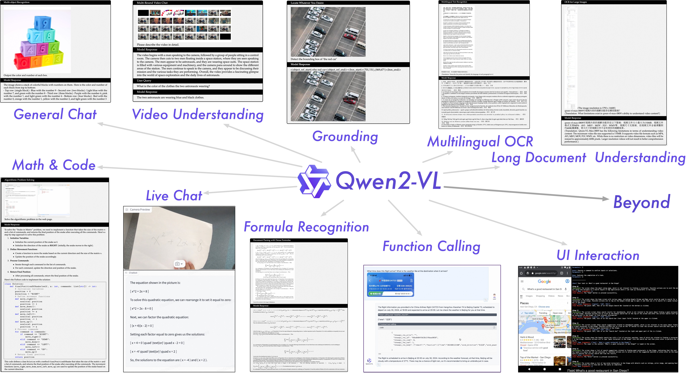
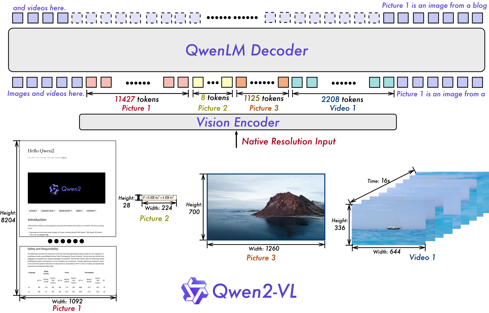
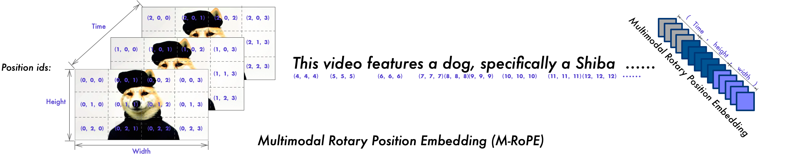
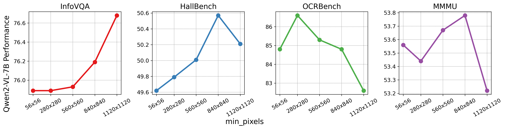
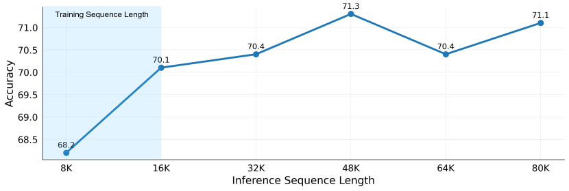
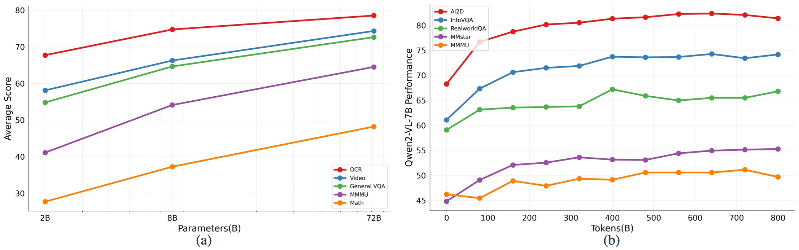

# Qwen2-VL: 任意解像度における視覚言語モデルの世界知覚の強化

> 原題: Qwen2-VL: Enhancing Vision-Language Model's Perception of the World at Any Resolution
> 著者: Peng Wang*, Shuai Bai*, Sinan Tan*, Shijie Wang*, Zhihao Fan*, Jinze Bai*†, Keqin Chen, Xuejing Liu, Jialin Wang, Wenbin Ge, Yang Fan, Kai Dang, Mengfei Du, Xuancheng Ren, Rui Men, Dayiheng Liu, Chang Zhou, Jingren Zhou, Junyang Lin†
> 所属: Qwen Team, Alibaba Group
> 出典: arXiv:2409.12191（2024 年 9 月）
> Code: https://github.com/QwenLM/Qwen2-VL

## Abstract（要旨）

本研究では、視覚処理における従来の事前決定解像度（predetermined-resolution）アプローチを再定義する、前世代 Qwen-VL モデルの高度なアップグレード版である Qwen2-VL シリーズを提示する。Qwen2-VL は Naive Dynamic Resolution（素朴な動的解像度）機構を導入し、多様な解像度の画像を動的に異なる数の視覚トークンへと処理することを可能にする。このアプローチにより、モデルはより効率的で正確な視覚表現を生成でき、人間の知覚過程に密接に整合する。本モデルはまた Multimodal Rotary Position Embedding（M-RoPE, マルチモーダル回転位置埋め込み）を統合し、テキスト・画像・動画にまたがる位置情報の効果的な融合を促進する。我々は画像と動画の双方を処理する統一パラダイムを採用し、モデルの視覚知覚能力を強化する。大規模マルチモーダルモデルの可能性を探究するため、Qwen2-VL は大規模視覚言語モデル（LVLM）のスケーリング則を調査する。**モデル規模を 2B、8B、72B パラメータの版で**スケールし、学習データ量も同時にスケールすることで、Qwen2-VL シリーズは高い競争力のある性能を達成する。特筆すべきは、Qwen2-VL-72B モデルが GPT-4o や Claude 3.5-Sonnet などの先導的モデルに匹敵する結果を多様なマルチモーダル・ベンチマークで達成し、他の汎用モデルを凌駕する点である。コードは https://github.com/QwenLM/Qwen2-VL で公開されている。

<figure>



<figcaption>図1: Qwen2-VL の能力。多言語画像-テキスト理解、コード・数学推論、動画解析、ライブチャット、エージェント潜在能力など。詳細は Appendix を参照。</figcaption>
</figure>

## 1. Introduction（はじめに）

人工知能の領域において、大規模視覚言語モデル（Large Vision-Language Models, LVLMs）は、伝統的な大規模言語モデルの強力なテキスト処理能力を基盤として、重要な飛躍を表している。これらの先進モデルは現在、画像・音声・動画を含むより広い範囲のデータを解釈・分析する能力を備えている。この能力の拡大により、LVLM は多様な現実世界の課題に取り組む不可欠なツールへと変貌した。広範で複雑な知識を機能的表現へと凝縮するその独自の能力で認められた LVLM は、より包括的な認知システムへの道を切り開いている。多様なデータ形式を統合することで、LVLM は人間が環境を知覚し相互作用する微妙な様式により密接に近づくことを目指している。これにより、これらのモデルは人間が環境にいかに関与し知覚するかをより正確に表現することができる。

大規模視覚言語モデル（LVLM）における近年の進展は、短期間に著しい改善をもたらしてきた。これらのモデルは一般に、**視覚エンコーダ → クロスモーダル・コネクタ → LLM** という共通アプローチに従う。この構成は、主たる学習手法としての次トークン予測と、高品質データセットの利用可能性と相まって、進展の多くを牽引してきた。より大規模なモデル構造、より高解像度の画像、混合エキスパート（mixture-of-experts, MoE）モデル、モデルアンサンブル、視覚モダリティとテキストモダリティの間のより洗練されたコネクタなどの追加要素もまた、LVLM が複雑な視覚的・テキスト的情報をより効果的に処理する能力の強化において、鍵となる役割を果たしてきた。

しかしながら、現在の大規模視覚言語モデル（LVLM）は通常、固定された画像入力サイズによって制約されている。標準的な LVLM は、入力画像を固定解像度（例: 224×224）へと、ダウンサンプリングやアップサンプリング、あるいはスケール後パディング（scale-then-padding）方式によって符号化する。この一律のアプローチは画像を一貫した解像度で処理することを可能にする一方で、モデルが異なる尺度で情報を捉える能力をも制限し、特に高解像度画像における詳細情報の重大な損失を招く。結果として、そのようなモデルは、人間の視覚と同等の尺度・詳細への感度をもって視覚情報を知覚することに及ばない。

加えて、ほとんどの LVLM は静的で凍結された CLIP スタイルの視覚エンコーダに依存しており、そのような事前学習済みモデルが生成する視覚表現が、とりわけ複雑な推論タスクや画像内の細部の処理に対して十分かどうかという懸念を生んでいる。最近の研究はこれらの限界に対処するため、LVLM 学習過程で視覚 Transformer（ViT）を微調整しようと試みており、それが改善された結果をもたらすことが示されている。モデルの可変解像度への適応性をさらに高めるため、我々は LVLM 学習過程に動的解像度学習を導入する。具体的には、ViT に 2D 回転位置埋め込み（2D Rotary Position Embedding, 2D-RoPE）を採用し、これによりモデルが異なる空間尺度にわたる情報をより良く捉えることを可能にする。

動画コンテンツに関して言えば、それは本質的にフレームの系列であるが、多くの既存モデルはそれを独立のモダリティとして扱い続けている。しかし、動画に現れる現実の動的本質を理解することは、現実世界の複雑性を把握しようとするモデルにとって決定的に重要である。テキストが本質的に一次元であるのとは異なり、現実世界の環境は三次元に存在する。現在のモデルにおける一次元位置埋め込みの使用は、三次元空間と時間的動態を効果的にモデル化する能力を著しく制限する。このギャップを埋めるため、我々は時間的・空間的情報を表現するための分離された成分を採用する **Multimodal Rotary Position Embedding（M-RoPE）**を開発した。これにより、モデルが動画や流体（streaming）データなどの動的コンテンツを自然に理解でき、世界を理解し対話する能力が向上する。

さらに、大規模言語モデル（LLM）のスケーリングと比較して、現在の LVLM は学習データ量とモデルパラメータ数の観点におけるスケーリングの影響の探究において、まだ初期段階にある。LVLM のスケーリング則—モデル規模とデータ規模の増加が性能にどう影響するか—の探究は、依然として開かれた、有望な研究領域である。

本研究では、Qwen ファミリーの大規模視覚言語モデルへの最新の追加として、**Qwen2-VL シリーズ**を導入する。これは 20 億、80 億、720 億の総パラメータ数を持つ 3 つのオープンウェイト・モデルから構成される。図 1 に示すように、Qwen2-VL の主要な進展は以下を含む：

- **様々な解像度とアスペクト比における最先端の理解**: Qwen2-VL は DocVQA、InfoVQA、RealWorldQA、MTVQA、MathVista などの視覚ベンチマークにおいて先導的な性能を達成する。
- **長時間動画（20 分以上）の理解**: Qwen2-VL は 20 分以上の長さの動画を理解でき、高品質な動画ベース質問応答、対話、コンテンツ生成などを実行する能力を高める。
- **デバイス操作のための堅牢なエージェント能力**: 高度な推論・意思決定能力により、Qwen2-VL はスマートフォンやロボットなどのデバイスと統合でき、視覚入力とテキスト命令に基づく自律操作を可能にする。
- **多言語サポート**: グローバルな利用者に対応するため、英語と中国語に加え、Qwen2-VL は画像内の多言語文脈理解を、ほとんどの欧州言語、日本語、韓国語、アラビア語、ベトナム語などを含めてサポートするようになった。

**表1**: Qwen2-VL のモデル記述。

| モデル名 | Vision Encoder | LLM | モデル記述 |
| --- | --- | --- | --- |
| Qwen2-VL-2B | 675M | 1.5B | 最も効率的なモデル、オンデバイス動作向けに設計。限られたリソースの多くのシナリオで十分な性能を提供 |
| Qwen2-VL-7B | 675M | 7.6B | コストに対して性能最適化されたモデル。テキスト認識・動画理解能力が大幅にアップグレード。広範な視覚タスクで顕著な性能を提供 |
| Qwen2-VL-72B | 675M | 72B | 最も高性能なモデル。視覚推論・命令追従・意思決定・エージェント能力のさらなる改善。最も複雑なタスクで最適な性能を提供 |

<figure>



<figcaption>図2: Qwen2-VL は、画像の鮮明度・解像度・極端なアスペクト比に関係なく、画像内のコンテンツを正確に識別・理解することができる。</figcaption>
</figure>

## 2. Approach（手法）

Qwen2-VL シリーズは 3 サイズのモデル、すなわち Qwen2-VL-2B、Qwen2-VL-7B、Qwen2-VL-72B から構成される。表 1 にハイパーパラメータと重要情報を列挙する。注目すべきは、Qwen2-VL は様々なサイズの LLM にわたって **675M パラメータの ViT を採用**し、LLM の規模に関係なく ViT の計算負荷が一定であることを保証している点である。

### 2.1 Model Architecture（モデル構造）

図 2 に Qwen2-VL の包括的な構造を示す。我々は Qwen-VL のフレームワーク（視覚エンコーダと言語モデルを統合）を保持した。様々な規模への適応のため、画像入力と動画入力の双方を扱える約 6.75 億パラメータの Vision Transformer（ViT）を実装した。言語処理については、より強力な Qwen2 系列の言語モデルを選択した。動画における視覚情報を効果的に知覚・理解するモデルの能力をさらに高めるため、いくつかの主要なアップグレードを導入した：

#### Naive Dynamic Resolution（素朴な動的解像度）

<figure>



<figcaption>図3: M-RoPE の実演。回転埋め込みを時間（temporal）・高さ（height）・幅（width）の成分に分解することで、M-RoPE は LLM 内でテキスト・画像・動画の位置情報を明示的にモデル化することができる。</figcaption>
</figure>

Qwen2-VL における主要な構造上の改善は、**素朴な動的解像度サポート**の導入である。Qwen-VL とは異なり、Qwen2-VL は任意の解像度の画像を処理でき、それらを可変数の視覚トークンへと動的に変換できる。この機能を支えるため、我々は ViT を修正し、元の絶対位置埋め込みを除去して **2D-RoPE** を導入することで、画像の二次元位置情報を捉える。推論段階では、様々な解像度の画像が単一の系列にパックされ、パックされた長さは GPU メモリ使用量を制限するよう制御される。さらに、各画像の視覚トークン数を減らすため、ViT の後に単純な MLP 層を採用し、**隣接する 2×2 トークンを単一のトークンに圧縮する**。特殊トークン `<|vision_start|>` と `<|vision_end|>` が圧縮された視覚トークンの先頭と末尾に配置される。結果として、解像度 224×224 の画像は、`patch_size=14` の ViT で符号化された場合、LLM に入る前に **66 トークンに圧縮**される。

#### Multimodal Rotary Position Embedding (M-RoPE)

もう一つの主要な構造強化は、**Multimodal Rotary Position Embedding（M-RoPE, マルチモーダル回転位置埋め込み）**の革新である。LLM における伝統的な 1D-RoPE が一次元位置情報の符号化に限定されているのとは異なり、M-RoPE はマルチモーダル入力の位置情報を効果的にモデル化する。これは元の回転埋め込みを **時間（temporal）・高さ（height）・幅（width）の 3 成分**に分解することによって達成される。テキスト入力に対して、これらの成分は同一の位置 ID を利用し、M-RoPE は機能的に 1D-RoPE と等価になる。画像処理時、各視覚トークンの時間 ID は一定に保たれる一方、高さ・幅成分には画像内のトークン位置に基づいて区別された ID が割り当てられる。動画はフレーム列として扱われ、時間 ID は各フレームごとに増分する一方、高さ・幅成分は画像と同じ ID 割り当てパターンに従う。モデル入力が複数のモダリティを含む場面では、各モダリティの位置番号付けは、先行モダリティの最大位置 ID を 1 つ増分した値で初期化される。M-RoPE の図解は図 3 に示される。M-RoPE は位置情報のモデル化を高めるだけでなく、画像と動画の位置 ID の値を減少させることにも繋がり、モデルが推論時により長い系列へ外挿することを可能にする。

#### Unified Image and Video Understanding（統一画像・動画理解）

Qwen2-VL は画像と動画データの双方を組み込んだ混合学習方式を採用し、画像理解と動画理解の双方における習熟を保証する。動画情報を可能な限り完全に保持するため、各動画を **毎秒 2 フレーム**でサンプリングした。さらに、深さ 2 の **3D 畳み込み**を動画入力の処理に統合し、モデルが 2D パッチではなく **3D チューブ**を扱えるようにすることで、系列長を増加させずにより多くの動画フレームを処理できる。一貫性のため、各画像は 2 つの同一フレームとして扱われる。長い動画処理の計算需要と全体の学習効率のバランスをとるため、各動画フレームの解像度を動的に調整し、動画あたりの総トークン数を **16384** に制限する。この学習アプローチは、モデルの長動画理解能力と学習効率の間のバランスをとる。

### 2.2 Training（学習）

Qwen-VL に従い、我々は **3 段階学習方法**を採用する。第 1 段階では、ViT 構成要素のみの学習に焦点を当て、膨大な画像-テキスト対コーパスを利用して LLM 内の意味理解を高める。第 2 段階では、全パラメータの凍結を解除し、より広範なデータで包括的な学習を行う。最終段階では、ViT パラメータを固定し、命令データセットを用いて LLM のみを微調整する。

モデルは、画像-テキスト対、光学文字認識（OCR）データ、交互配置の画像-テキスト記事、視覚質問応答データセット、動画対話、画像知識データセットを含む多様なデータセットで事前学習される。データソースは主に浄化された Web ページ、オープンソース・データセット、合成データから構成される。データの知識カットオフ日は 2023 年 6 月である。この多様なデータ構成は、堅牢なマルチモーダル理解能力の発達に不可欠である。

初期事前学習段階で、Qwen2-VL は約 **6000 億トークン**のコーパスにさらされる。Qwen2-VL の LLM 構成要素は Qwen2 のパラメータで初期化される一方、視覚エンコーダは **DFN 由来の ViT** で初期化される。ただし、元の DFN の ViT における固定位置埋め込みは **RoPE-2D** に置き換えられる。この事前学習段階は主に、画像-テキストの関係、OCR を通じた画像内テキスト内容の認識、画像分類タスクの学習に焦点を当てる。そのような基礎的学習は、モデルが視覚-テキストの中核的相関と整合に対する堅牢な理解を発達させるのに役立つ。

第 2 事前学習段階は重要な進展を表し、追加で **8000 億トークン**の画像関連データを伴う。この段階は、より多くの混合画像-テキストコンテンツを導入し、視覚情報とテキスト情報の相互作用についてより細やかな理解を促進する。視覚質問応答データセットの組み込みは、画像関連クエリへの応答能力を洗練する。さらに、多タスク・データセットの包含は、複雑な現実世界データセットを扱う際に最重要となる、多様なタスクを同時に行う能力の発達に決定的である。並行して、純粋テキスト・データは引き続きモデルの言語的習熟を維持・進展させるうえで重要な役割を果たす。

事前学習の全段階を通じて、Qwen2-VL は累積で **1 兆 4000 億トークン**を処理する。具体的にはこれらのトークンには、テキスト・トークンだけでなく画像トークンも含まれる。ただし学習過程では、**テキスト・トークンにのみ監督を与える**。広範で多様な言語的・視覚的シナリオへのこの曝露は、モデルが視覚情報とテキスト情報の間の入り組んだ関係に対する深い理解を発達させることを保証し、様々なマルチモーダル・タスクの堅牢な基盤を築く。

命令微調整段階では、ChatML 形式を採用して命令追従データを構築する。このデータセットは、純粋テキスト対話データだけでなく、マルチモーダル対話データも包含する。マルチモーダル成分には、画像質問応答、文書解析、複数画像比較、動画理解、動画ストリーム対話、エージェントベース対話が含まれる。データ構築への我々の包括的アプローチは、多様なモダリティにわたる広範な命令を理解・実行するモデルの能力を高めることを目指している。多様なデータ型を取り込むことで、伝統的なテキストベース対話に加え、複雑なマルチモーダル・タスクを処理できるより汎用的で堅牢な言語モデルの開発を目指す。

#### 2.2.1 Data Format（データ形式）

Qwen-VL と同様に、Qwen2-VL も視覚入力とテキスト入力を区別するために特殊トークンを採用する。トークン `<|vision_start|>` と `<|vision_end|>` が画像特徴系列の冒頭と末尾に挿入され、画像内容を画する。

**Dialogue Data（対話データ）**: 対話形式に関しては、命令調整データセットを ChatML 形式で構築し、各対話の文（statement）が 2 つの特殊トークン（`<|im_start|>` と `<|im_end|>`）で標識され、対話の終端を促進する。教師信号が与えられる部分は青色で示される。

```
<|im_start|>user
<|vision_start|>Picture1.jpg<|vision_end|><|vision_start|>Picture2.jpg<|vision_end|>What do the two pictures have in common?<|im_end|>
<|im_start|>assistant
Both pictures are of SpongeBob SquarePants.<|im_end|>
<|im_start|>user
What is happening in the video?<|vision_start|>video.mp4<|vision_end|><|im_end|>
<|im_start|>assistant
The protagonist in the video is frying an egg.<|im_end|>
```

**Visual Grounding（視覚グラウンディング）**: モデルに視覚グラウンディング能力を授けるため、バウンディング・ボックス座標を **[0, 1000) の範囲に正規化**し、「$(X_{\text{top left}}, Y_{\text{top left}}), (X_{\text{bottom right}}, Y_{\text{bottom right}})$」として表現する。トークン `<|box_start|>` と `<|box_end|>` がバウンディング・ボックス・テキストを画するために利用される。バウンディング・ボックスをそのテキスト記述に正確に結びつけるため、`<|object_ref_start|>` と `<|object_ref_end|>` を導入し、バウンディング・ボックスが参照する内容を示すことで、モデルが特定領域の精緻な記述を効果的に解釈・生成できるようにする。

```
<|vision_start|>Picture1.jpg<|vision_end|>
<|object_ref_start|>the eyes on a giraffe<|object_ref_end|><|box_start|>(176,106),(232,160)<|box_end|>
```

**Visual Agent（視覚エージェント）**: Qwen2-VL を汎用的な VL エージェントとして発達させるため、UI 操作、ロボット制御、ゲーム、ナビゲーションといった様々なエージェント・タスクを**逐次意思決定問題**として扱い、Qwen2-VL が多段階の行動実行を通じてタスクを達成できるようにする。各タスクに対して、まず許容される行動の集合と関数呼び出しのためのキーワード・パターンを定義する。Qwen2-VL は次に観察を分析し、推論と計画を行い、選択された行動を実行し、環境と相互作用して新しい観察を得る。このサイクルは、タスクが成功裏に完了するまで反復する。様々なツールを統合し、大規模視覚言語モデル（LVLM）の視覚知覚能力を活用することで、Qwen2-VL は現実世界の視覚的相互作用を伴う、ますます複雑なタスクを反復的に実行することができる。

### 2.3 Multimodal Model Infrastructure（マルチモーダル・モデル基盤）

Qwen2-VL モデルは、Alibaba Cloud の PAI-Lingjun Intelligent Computing Service 上で、そのスケーラブルな計算、自動再開、ストラグラー検出を利用して学習された。

**Storage（ストレージ）**: Qwen2-VL の事前学習・後学習のため、Alibaba Cloud の超高速 CPFS（Cloud Parallel File Storage）を使用してストレージ・システムを構築する。テキスト・データと視覚データのストレージを分離した。テキスト・データを CPFS に単純に保存し、効率的アクセスのため mmap を使用する。視覚データには、永続ストレージとして Alibaba Cloud の OSS（Object Storage Service）を使用する。学習時には OSS の python-client を通じて並行して視覚データにアクセスし、QPS（queries per second）制限への到達を避けるため並行度とリトライ・パラメータを調整した。動画データのデコードが主要なボトルネックであることも判明し、特に長動画では顕著であった。複数のオープンソースおよび社内ソフトウェアでの試行が失敗した後、我々はキャッシュ・デコード技法を選択した。チェックポインティングは各 GPU のオプティマイザとモデル状態を CPFS に保存する。

**Parallelism（並列化）**: Qwen2-VL モデル学習をスケールするため、データ並列（DP）・テンソル並列（TP）・パイプライン並列（PP）を組み合わせた **3D 並列化**を使用する。また、メモリ節約のため状態をシャーディングする deepspeed の **zero-1 redundancy optimizer** を活用する。メモリ使用量削減のため、選択的チェックポインティング活性化（selective checkpointing activation）を伴う **系列並列（SP）** も活用した。TP 学習を有効化する際は、視覚エンコーダと大規模言語モデルを常に一緒にシャーディングするが、ビジョン・マージャは比較的少数のパラメータを持つためシャーディングしない。TP 学習が畳み込み演算子の非決定的挙動により異なるモデル共有重みをもたらすことを発見した。この問題は共有重みのオフライン削減を実行することで解決し、追加の all-reduce 通信ステップを回避した。このアプローチは性能への影響を最小限にとどめた。Qwen2-VL 72B 学習には **1F1B PP** を活用する。視覚エンコーダ、ビジョン・アダプタ、いくつかの LLM のデコーダ層を 1 つのステージに統合し、残りのデコーダ層を均等に分割する。視覚とテキストの系列長は各データ点で動的であることに注意せよ。1F1B プロセス開始前に動的な系列長をブロードキャストし、バッチ・インデックスを使って形状情報にアクセスする。インターリーブ 1F1B PP も実装したが、標準 1F1B 設定より遅いことを発見した。

**Software（ソフトウェア）**: 学習には PyTorch バージョン 2.1.2 と CUDA 11.8 を使用する。さらに、視覚エンコーダと LLM の双方の効率的学習のため **flash-attention** を活用する。また、LayerNorm、RMSNorm、Adam などの融合演算子も利用する。これに加え、学習過程で行列乗算における通信と計算の重複を活用する。

## 3. Experiments（実験）

本節ではまず、多様な視覚ベンチマークにわたる比較分析を通じてモデルの性能を評価し、本アプローチの利点を実証する。続いて、一般視覚知覚、文書理解、画像内多言語認識、動画理解、エージェント能力を含む特定能力の詳細な検討を行う。最後に、我々のアプローチのいくつかの主要構成要素を調査するためのアブレーション研究を提示する。

**表2**: Qwen2-VL モデルと最先端の性能比較。

| Benchmark | 従来 SoTA | Claude-3.5 Sonnet | GPT-4o | Qwen2-VL-72B | Qwen2-VL-7B | Qwen2-VL-2B |
| --- | --- | --- | --- | --- | --- | --- |
| MMMU val | 66.1 | 68.3 | 69.1 | 64.5 | 54.1 | 41.1 |
| DocVQA test | 94.1 | 95.2 | 92.8 | **96.5** | 94.5 | 90.1 |
| InfoVQA test | 82.0 | - | - | **84.5** | 76.5 | 65.5 |
| AI2D | 87.6 | 80.2(94.7) | 84.6(94.2) | **88.1** | 83.0 | 74.7 |
| ChartQA test | 88.4 | 90.8 | 85.7 | 88.3 | 83.0 | 73.5 |
| TextVQA val | 84.4 | - | - | **85.5** | 84.3 | 79.7 |
| OCRBench | 852 | 788 | 736 | **877** | 866 | 809 |
| MTVQA | 23.2 | 25.7 | 27.8 | **30.9** | 25.6 | 18.1 |
| VCR en easy | 84.7 | 63.9 | 91.6 | **91.9** | 89.7 | 81.5 |
| VCR zh easy | 22.1 | 1.0 | 14.9 | **65.4** | 59.9 | 46.2 |
| RealWorldQA | 72.2 | 60.1 | 75.4 | **77.8** | 70.1 | 62.9 |
| MME sum | 2414.7 | 1920.0 | 2328.7 | **2482.7** | 2326.8 | 1872.0 |
| MMBench-EN test | 86.5 | 79.7 | 83.4 | **86.5** | 83.0 | 74.9 |
| MMBench-CN test | 86.3 | 80.7 | 82.1 | **86.6** | 80.5 | 73.5 |
| MMBench-V1.1 test | 85.5 | 78.5 | 82.2 | **85.9** | 80.7 | 72.2 |
| MMT-Bench test | 63.4 | - | 65.5 | **71.7** | 63.7 | 54.5 |
| MMStar | 67.1 | 62.2 | 63.9 | **68.3** | 60.7 | 48.0 |
| MMVet GPT-4-Turbo | 67.5 | 66.0 | 69.1 | **74.0** | 62.0 | 49.5 |
| HallBench avg | 55.2 | 49.9 | 55.0 | **58.1** | 50.6 | 41.7 |
| MathVista testmini | 69.0 | 67.7 | 63.8 | **70.5** | 58.2 | 43.0 |
| MathVision | 30.3 | - | 30.4 | 25.9 | 16.3 | 12.4 |
| MMMU-Pro | 46.9 | 51.5 | 51.9 | 46.2 | 43.5 | 37.6 |

**表3**: 社内多言語 OCR ベンチマークにおける Qwen2-VL と GPT-4o の性能。

| 言語 | Korean | Japanese | French | German | Italian | Russian | Vietnamese | Arabic |
| --- | --- | --- | --- | --- | --- | --- | --- | --- |
| GPT-4o | 87.8 | 88.3 | 89.7 | 88.3 | 74.1 | 96.8 | 72.0 | **75.9** |
| Qwen2-VL-72B | **94.5** | **93.4** | **94.1** | **91.5** | **89.8** | **97.2** | **73.0** | 70.7 |

**表4**: Qwen2-VL と他モデルの動画ベンチマークの性能。

| Benchmark | 従来 SoTA | Gemini 1.5-Pro | GPT-4o | Qwen2-VL-72B | Qwen2-VL-7B | Qwen2-VL-2B |
| --- | --- | --- | --- | --- | --- | --- |
| MVBench | 69.6 | - | - | **73.6** | 67.0 | 63.2 |
| PerceptionTest test | 66.9 | - | - | **68.0** | 62.3 | 53.9 |
| EgoSchema test | 62.0 | 63.2 | 72.2 | **77.9** | 66.7 | 54.9 |
| Video-MME (wo/w subs) | 66.3/69.6 | 75.0/81.3 | 71.9/77.2 | 71.2/77.8 | 63.3/69.0 | 55.6/60.4 |

### 3.1 Compare to SOTAs（最先端との比較）

我々は多様な視覚ベンチマーク、動画タスク、エージェントベース評価を通じてモデルの視覚能力を評価する。Qwen2-VL は同規模で高い競争力のある性能を示し、新たな最先端（SoTA）結果を達成する。全体として、我々の 72B モデルはほとんどの評価指標で常にトップクラスの性能を提供し、しばしば GPT-4o や Claude 3.5-Sonnet のような閉源モデルすら凌駕する。特に、文書理解タスクで顕著な優位性を示す。しかし MMMU ベンチマークでは、Qwen2-VL-72B はまだ GPT-4o にある程度後れを取っており、より複雑で困難な問題集合の処理にはまだ改善の余地があることを示している。

### 3.2 Quantitative Results（定量結果）

本節では、Qwen2-VL シリーズを多様なデータセットにわたって広範に評価し、モデルの様々な側面における能力の包括的理解を提供する。

#### 3.2.1 General Visual Question Answering（一般視覚質問応答）

一般視覚質問応答タスクにおけるモデルの能力を厳密に評価するため、RealWorldQA、MMStar、MMVet、MMT-Bench、MMBench、MMBench-1.1、MME、HallusionBench という多様な最先端ベンチマークにわたって広範な評価を行う。Qwen2-VL シリーズはこれらのベンチマークで例外的な性能を示し、72B モデルは最先端結果を一貫して達成または凌駕する一方で、7B と 2B 版もまた堅牢な能力を実証する。実世界空間理解を評価する RealWorldQA では、Qwen2-VL-72B が 77.8 のスコアを達成し、従来の最先端（72.2）と GPT-4o（75.4）のような強力なベースラインの双方を凌駕し、物理環境の優れた理解を実証する。視覚的に不可欠なサンプルを通じて真のマルチモーダル能力を評価するために設計されたベンチマーク MMStar では、Qwen2-VL-72B が 68.3 を達成し、従来最良の 67.1 を上回り、視覚情報とテキスト情報の統合における習熟を強調する。16 の複雑なマルチモーダル・タスクにわたる中核的な視覚言語能力の統合を評価する MMVet では、Qwen2-VL-72B が驚異的な 74.0 を達成し、GPT-4V（67.5）を含む強力な競合相手を著しく凌駕し、多様なマルチモーダル課題に取り組む汎用性を示す。32 の中核メタタスクと 162 のサブタスクにわたるマルチモーダル理解における高度な推論と命令追従を評価する MMT-Bench 評価では、Qwen2-VL-72B が 71.7 を達成し、従来最良（63.4）を著しく上回り、専門知識を適用し、慎重な視覚認識・位置特定・推論・計画を実行する能力を実証する。20 の次元にわたる細粒度能力を評価する MMBench では、Qwen2-VL-72B が強力な性能を示し、英語テスト集合で 86.5 を達成して最先端と並び、中国語テスト集合で 86.6 を達成し新たなベンチマークを確立する。14 サブタスクにわたる広範な知覚・認知能力を測定する MME では、Qwen2-VL-72B が累積スコア 2482.7 を達成し、従来最良（2414.7）を著しく凌駕し、視覚知覚と高次認知タスクの双方における高度な能力を強調する。

これらの包括的結果は、Qwen2-VL シリーズの一般視覚質問応答タスクにおける例外的習熟を強調する。本モデル群は、実世界空間理解、真のマルチモーダル統合、複雑な推論、命令追従、広範な知覚・認知タスクにおいて高度な能力を実証する。多様なベンチマークにわたる一貫した優れた性能、特に 72B モデルの傑出した結果は、Qwen2-VL シリーズを視覚質問応答分野における主導的解決策として位置付ける。本モデル群は、視覚的に不可欠なタスクの処理、中核的視覚言語能力の統合、基礎的知覚タスクから複雑な推論・計画に至る多様なマルチモーダル・シナリオにわたる専門性の実証で卓越している。この包括的な評価は、Qwen2-VL シリーズが最先端マルチモーダル・ベンチマークによって課される多面的な課題への取り組みにおける汎用性と有効性を強調し、それにより大規模視覚言語モデルの新たな基準を確立する。

#### 3.2.2 Document and Diagrams Reading（文書・図解読解）

我々は DocVQA、ChartQA、InfoVQA、TextVQA、AI2D データセットでモデルの OCR と文書・図解理解をテストした。DocVQA/InfoVQA/ChartQA データセットは、文書/高解像度インフォグラフィック/チャート内のテキストを理解する能力に焦点を当てる一方、TextVQA データセットは自然画像内のテキストを理解する能力を検証する。OCRBench データセットは複合タスクのデータセットで、テキストベース VQA に加えて数式解析と情報抽出に焦点を当てる。AI2D データセットはテキストを含む科学図解に関する多肢選択問題に焦点を当てる。加えて、OCRBench での OCR と数式認識能力、および MTVQA データセットでの多言語 OCR 能力もテストした。

実験結果は、本モデルが DocVQA、InfoVQA、TextVQA、OCRBench を含むいくつかの指標で SoTA レベルを達成することを示しており、複数領域の画像内テキスト内容について良好な理解を持つことを実証する。

#### 3.2.3 Multilingual Text Recognition and Understanding（多言語テキスト認識と理解）

特に、本モデルは多言語 OCR においてすべての既存汎用 LVLM を凌駕する。本モデルは公開された MTVQA データセットで既存 LVLM（GPT-4o、Claude 3.5 Sonnet などのプロプライエタリ・モデルを含む）を上回るだけでなく、アラビア語を除くすべての外国言語にわたる社内の内部ベンチマークでも GPT-4o を上回る（表 3）。

#### 3.2.4 Mathematical Reasoning（数学的推論）

数学的推論能力を評価するため、MathVista と MathVision データセットで実験を行った。MathVista は数学と視覚のタスクの 6,141 の多様な例を含む包括的ベンチマークである。MathVision データセットは、16 の数学領域をカバーし 5 段階の難易度に分かれた、実際の数学コンテストからの視覚的文脈に埋め込まれた 3,040 の数学問題から構成される。これらの課題は、強力な視覚理解、数学の深い理解、健全な論理推論技能を示すための LVLM の必要性を強調する。Qwen2-VL シリーズは MathVista で優れた性能を実証し、70.5 を達成して他の LVLM を凌駕した。さらに、MathVision で 25.9 という新たなオープンソース・ベンチマークを確立した。

#### 3.2.5 Referring Expression Comprehension（参照表現理解）

視覚位置特定タスクに関しては、RefCOCO、RefCOCO+、RefCOCOg データセットで Qwen2-VL を評価する。結果は表 6 に示すように、Qwen2-VL が汎用モデルの中でトップクラスの結果を達成することを実証する。より合理的な構造設計の恩恵を受け、Qwen2-VL は高解像度画像の細部を知覚することができ、Qwen-VL を大きく上回る改善をもたらす。汎用・専門モデルの双方と比較したこれらのモデルの優位性は、視覚位置特定分野を前進させる潜在能力と、精緻な視覚理解を要する現実世界実装能力を強調する。

**表6**: 参照表現理解タスクの性能比較。

| Type | Model | RefCOCO val | RefCOCO test-A | RefCOCO test-B | RefCOCO+ val | RefCOCO+ test-A | RefCOCO+ test-B | RefCOCOg val | RefCOCOg test |
| --- | --- | --- | --- | --- | --- | --- | --- | --- | --- |
| Generalist | OFA-L | 80.0 | 83.7 | 76.4 | 68.3 | 76.0 | 61.8 | 67.6 | 67.6 |
|  | Shikra | 87.0 | 90.6 | 80.2 | 81.6 | 87.4 | 72.1 | 82.3 | 82.2 |
|  | Qwen-VL | 89.4 | 92.3 | 85.3 | 83.1 | 88.3 | 77.2 | 85.6 | 85.5 |
|  | Ferret v2 | 92.6 | 95.0 | 88.9 | 87.4 | 92.1 | 81.4 | 89.4 | 90.0 |
|  | CogVLM | 92.8 | 94.8 | 89.0 | 88.7 | 92.9 | 83.4 | 89.8 | 90.8 |
|  | InternVL2-2B | 82.3 | 88.2 | 75.9 | 73.5 | 82.8 | 63.3 | 77.6 | 78.3 |
|  | InternVL2-8B | 87.1 | 91.1 | 80.7 | 79.8 | 87.9 | 71.4 | 82.7 | 82.7 |
|  | InternVL2-76B | 92.2 | 94.8 | 88.4 | 88.8 | 93.1 | 82.8 | 89.5 | 90.3 |
|  | Qwen2-VL-2B | 87.6 | 90.6 | 82.3 | 79.0 | 84.9 | 71.0 | 81.2 | 80.3 |
|  | Qwen2-VL-7B | 91.7 | 93.6 | 87.3 | 85.8 | 90.5 | 79.5 | 87.3 | 87.8 |
|  | **Qwen2-VL-72B** | **93.2** | **95.3** | **90.7** | **90.1** | **93.8** | **85.6** | **89.9** | **90.4** |
| Specialist | G-DINO-L | 90.6 | 93.2 | 88.2 | 82.8 | 89.0 | 75.9 | 86.1 | 87.0 |
|  | UNINEXT-H | 92.6 | 94.3 | 91.5 | 85.2 | 89.6 | 79.8 | 88.7 | 89.4 |
|  | ONE-PEACE | 92.6 | 94.2 | 89.3 | 88.8 | 92.2 | 83.2 | 89.2 | 89.3 |

#### 3.2.6 Video Understanding（動画理解）

数秒の短動画から最大 1 時間の長動画にわたるベンチマークで、様々な動画理解タスク上でモデルを評価する。表 4 は Qwen2-VL とベースライン・モデルの性能を示す。全体として Qwen2-VL は 2B、7B、72B の規模にわたり強力な結果を示し、Qwen2-VL-72B は MVBench、PerceptionTest、EgoSchema で最良性能を達成する。これは Qwen2-VL の動画理解タスクにおける優れた能力を示し、Qwen2-VL のスケールアップが顕著な改善をもたらすことを示す。最大 1 時間の動画を含む困難な Video-MME ベンチマークについては、評価中の動画あたりの最大フレーム抽出数を 768 に制限したため、長動画の性能に影響を与えた可能性があることに注意せよ。今後の研究は Qwen2-VL がより長い系列をサポートできるよう拡張し、より長い動画に対応することに焦点を当てる。

#### 3.2.7 Visual Agent（視覚エージェント）

Qwen2-VL は、まず関数呼び出しを通じて環境と相互作用する能力について評価され、次に複数ラウンドの対話を通じて複雑な逐次意思決定タスクを完了する能力について評価される。実装は Qwen-Agent フレームワークに基づく。

**Function Calling（関数呼び出し）**: LLM における関数呼び出しとは異なり、LVLM における関数呼び出しは多くの場合、視覚的合図から情報を抽出することを伴う。LVLM の関数呼び出し能力を評価する公開ベンチマークが存在しないため、社内評価データセットを構築した。

評価データセットの構築には、シーン分類、画像収集、画像内容抽出、質問/関数/引数生成という以下の手順を行った。最初に、異なる視覚アプリケーションに基づいてシーンをカテゴリ別に分類した。続いて、各カテゴリについて高品質な代表的画像をインターネットからダウンロードし精選した。次に、先進的 LVLM を活用して各画像を分析し、主要な視覚要素とテキスト情報を抽出した。最後に、画像の内容情報に基づき、先進的 LLM を使用して、特定の関数を要する一連の質問を生成し、これらの関数呼び出しに必要な入力パラメータを指定した。

LLM における関数呼び出し評価方法と同様に、関数選択の精度と入力引数の正しさを評価する 2 つの指標を設計した。具体的には、**Type Match (TM)** は、モデルが正しい関数を呼び出すことに成功した回数を全呼び出し試行回数に対する比率として計算する。**Exact Match (EM)** は、各関数呼び出しに対して、関数に渡された引数が画像の内容情報に記録されたものと完全に一致するかどうかを確認し、この正しさの比率を計算する。

表 5 に示すように、Qwen2-VL の Type Match（93.1 vs 90.2）と Exact Match（53.2 vs 50.0）の双方の性能が GPT-4o を上回り、Qwen2-VL の関数呼び出し能力の有効性を実証し、外部ツール統合による応用拡張への顕著な可能性を強調する。

評価結果は、GPT-4o が劣る性能を示したことを実証した。主に 2 つの要因による：不確実性が生じるシナリオでは GPT-4o は外部ツールの使用を避ける保守的アプローチを示すこと、また OCR 能力が Qwen2-VL に劣る、特に中国語文字の文脈で。

**UI Operations/Games/Robotics/Navigation**: Qwen2-VL が一般的に複雑なタスクを扱う能力を評価するため、モバイル操作、ロボット制御、カード・ゲーム、視覚言語ナビゲーションを含む複数の VL エージェント・タスクで評価を行う。これらのタスクが完了に複数の行動を要するため、Qwen2-VL がサポートする 32K 文脈長を通じて履歴（観察、行動）を保持し、各行動後に新しい観察画像を追加することで、後続ステップに関する継続的推論を可能にする。

**UI Operations**: モバイル操作の一般的パターンに基づき、AITZ タスクで Qwen2-VL を評価する。タップ、入力、スワイプといった行動を定義し、Qwen2-VL が画面上のアイコンと相互作用してタスクを完了できるようにする。例えば、Qwen2-VL が Google Maps で近所のピザ店を見つけることを課された場合、検索語に「pizza」を入力し、適切なレストランを選択するためにスワイプし、対応するリンクをタップすべきである。AITZ 設定に従い、Type Match（タップ・入力・スワイプの正しさ）と Exact Match（タップ位置・入力テキスト・スワイプ方向の正しさ）の双方を報告する。UI 上のグラウンディング能力のサポートにより、Qwen2-VL は GPT-4 と従来 SoTA を凌駕する。

**Robotic Control**: AI2THOR の ALFRED タスクで Qwen2-VL を評価する。タスクは、トーストを焼き、リンゴを切って食事を準備するような複雑な家事をエージェントに実行させる。仮想環境で動作するため、高レベル行動（GotoLocation, Pickup, PutDown, Open, Close, Clean, Heat, Cool, Slice）を行動集合として定義する。さらに、エージェントは操作のために対象物を位置特定する必要がある（例: リンゴが認識される場合のみリンゴを拾うことができる）。操作の精度を高めるため、SAM を統合する。ALFRED タスクはタスク成功率（SR、例: 夕食準備）とサブゴール完了指標（GC、例: パンが焼けたかリンゴが切れたか）を報告する。Qwen2-VL は valid-unseen 集合で従来の専門モデル ThinkBot をわずかに上回る。

**Card Games**: RL4VLM のカード・ゲーム環境を活用し、一連のカードベース・ゲームでの Qwen2-VL の性能を評価する：Number Line、BlackJack、EZPoint、Point24。各ゲームは異なる課題を提示する：(1) +1 / -1 演算で目標数字に到達、(2) ディーラーに対抗してカードを引くか保持、(3) 基本的算術演算で合計 12 に到達、(4) 算術演算で合計 24 を達成。タスクの成功率を報告する。これらはエージェント能力を評価するだけでなく、これらのカードを認識しゲームの進行を理解するため強力な OCR スキルも要する。Qwen2-VL は全タスクで優れた性能を実証する。

**Vision-Language Navigation**: R2R と REVERIE を用いた視覚言語ナビゲーション（VLN）タスクで Qwen2-VL を評価する。VLN では、モデルは命令と現在の観察に基づいて次の場所を自律的に決定しなければならない。このタスクで予め定められた目的地に到達する VLM の成功率（SR）を報告する。Qwen2-VL の性能は GPT-4o に匹敵するが、両モデルとも現在の専門 VLN モデルに著しく後れを取る。我々はこのギャップを、複数画像から生成された不完全で非構造化な地図情報に帰する。3D 環境における地図と位置の正確なモデル化は、マルチモーダル・モデルにとって依然として大きな課題である。

### 3.3 Ablation Study（アブレーション研究）

本節では、画像動的解像度、M-RoPE、モデル規模に関するアブレーション研究を提示する。これらの実験は、本モデルの性能に対するこれらの主要構成要素の影響について洞察を提供することを目的とする。

#### 3.3.1 Dynamic Resolution（動的解像度）

**表7**: 固定/動的画像トークンでの Qwen2-VL-7B。画像サイズの調整は性能に小さな摂動しか引き起こさず、可変画像サイズへの頑健性を実証する。さらに、動的解像度戦略は平均的にトークン消費が少ない一方でトップクラスの性能を達成し、モデルの効率性を実証する。

| Strategy | Average Image Tokens | InfoVQA val | RealWorldQA | OCRBench | MMMU |
| --- | --- | --- | --- | --- | --- |
| Fixed Image Tokens | 64 | 28.85 | 56.47 | 572 | 53.33 |
|  | 576 | 65.72 | 65.88 | 828 | 52.78 |
|  | 1600 | 74.99 | 69.54 | 824 | 52.89 |
|  | 3136 | 77.27 | 70.59 | 786 | 53.44 |
| Dynamic Image Tokens | 1924 | 75.89 | 70.07 | **866** | **53.44** |

<figure>



<figcaption>図4: 異なる min_pixels での Qwen2-VL-7B。小画像はモデルに入力される前に指定された min_pixels 閾値を超えるようアップスケールされる。妥当な範囲で画像サイズを増加させると InfoVQA、HallusionBench、OCRBench などの知覚タスクで性能向上が見られる。</figcaption>
</figure>

表 7 に示すように、動的解像度と固定解像度の間の性能を比較する。固定解像度では、特定の高さと幅にリサイズしてアスペクト比を歪めるのではなく、モデルに入力される画像トークン数を一定に保つよう画像をリサイズする。動的解像度では、`min_pixels = 100 × 28 × 28` と `max_pixels = 16384 × 28 × 28` のみを設定し、画像トークン数を画像の本来の解像度に主に依存させる。画像サイズの調整は性能に小さな摂動しか引き起こさないことが観察され、モデルの可変画像サイズへの頑健性が実証される。さらに、動的解像度アプローチはより効率的である。単一の固定解像度がすべてのベンチマークで最適性能を達成することはない。対照的に、動的解像度アプローチは平均的にトークン消費が少ない一方で、一貫してトップクラスの性能を達成する。

さらに、単に画像サイズを増加させることが常に性能向上に繋がるわけではないことが観察された。異なる画像に対して適切な解像度を選択することがより重要である。図 4 で詳述するように、小画像を指定された min_pixels 閾値を超えるようアップスケールする。アップスケールされた画像での評価は、InfoVQA、HallusionBench、OCRBench などの知覚タスクで性能向上を示す。これらの向上は計算負荷の増加に帰する。しかし、OCRBench では過度に高い min_pixels 値は深刻な性能低下を招く。これは、OCRBench に非常に小さな画像が多く含まれており、過度な拡大がこれらの画像を学習データ分布から逸脱させ、out-of-distribution サンプルに変えてしまうためと考えられる。対照的に、min_pixels の増加が MMMU ベンチマークに与える影響は無視できる。MMMU の性能ボトルネックは画像解像度よりもモデルの推論能力に関連しているのではないかと我々は仮説する。

#### 3.3.2 M-RoPE

**表8**: M-RoPE のアブレーション研究。1D-RoPE と比較して、M-RoPE は下流タスク、特に動画ベンチマークでより良い性能を達成する。RWQ は RealWorldQA を意味する。

| | MathVista | MMB | MMStar | RWQ | DocVQA | ChartQA | InfoVQA | TextVQA | PerceptionTest | NextQA | STAR |
| --- | --- | --- | --- | --- | --- | --- | --- | --- | --- | --- | --- |
| 1D-RoPE | 39.2 | 58.6 | 36.7 | 54.5 | 82.5 | 68.0 | 50.8 | 71.3 | 46.6 | 43.9 | 55.5 |
| M-RoPE | **43.4** | **60.6** | 36.7 | 53.7 | **82.8** | **68.4** | 50.3 | **71.8** | **47.4** | **46.0** | **57.9** |

<figure>



<figcaption>図5: Video-MME Medium Video における Qwen2-VL-72B の長さ外挿能力の評価。M-RoPE の助けを借りて、推論長が最大学習長 16384 トークンを超えた場合でもモデルは頑健な性能を実証した。</figcaption>
</figure>

本小節では、M-RoPE の有効性を実証する。まず、様々な下流タスクでその能力を検証する。Qwen2-1.5B と ViT-L をバックボーンとして採用し、事前学習済みモデルの結果を報告する。表 8 に示すように、1D-RoPE と比較して、M-RoPE の使用は下流タスク、特に動画ベンチマークでより良い性能を達成する。さらに、Video-MME 中程度長動画での M-RoPE の長さ外挿能力を評価する。図 5 は Qwen2-VL-72B の異なる推論長における性能を図示する。M-RoPE を活用して、モデルは様々な推論長で頑健な結果を実証する。注目すべきは、学習時の動画あたり最大トークン数を 16K に制限したにもかかわらず、モデルは最大推論長 **80K トークン**で例外的な性能を依然として示す点である。

#### 3.3.3 Model Scaling（モデル・スケーリング）

<figure>



<figcaption>図6: 能力と学習進捗にわたるモデル性能スケーリング。モデル規模と学習データ量の増加に伴い、一連の能力とベンチマークにわたって性能が一貫して向上する。</figcaption>
</figure>

複数の能力次元にわたって異なる規模のモデルの性能を評価する。具体的には、これらの次元を複雑な大学レベルの問題解決、数学能力、文書・表理解、一般シーン質問応答、動画理解にカテゴリ別に分類する。モデルの全体能力は、各次元に関連する異なるベンチマークでのスコア平均によって評価される。

特に、大学レベル問題解決能力を表すために MMMU ベンチマーク、数学能力の指標として MathVista と MathVision の平均スコア、一般シーン質問応答には RealWorldQA、MMBench-V1.1、MMT-Bench、HallBench、MMVet、MMStar の平均スコアを使用する。文書・表理解能力は DocVQA、InfoVQA、ChartQA、TextVQA、OCRBench、MTVQA などのベンチマークの平均スコアを通じて反映される。最後に、動画理解能力は MVBench、PerceptionTest、EgoSchema、Video-MME のスコア平均で測定される。

図 6(a) に示すように、モデル規模の増加に伴い性能が一貫して向上する。特に数学能力は、モデル・パラメータ数と正の相関を示す。一方、光学文字認識（OCR）関連タスクでは、より小規模のモデルでも比較的強力な性能を示す。

図 6(b) に示すように、Qwen2-VL-7B の事前学習第 2 段階におけるモデル性能と学習トークン数の関係を可視化する。学習トークン数の増加に伴い、モデル性能は向上するが、視覚質問応答（VQA）タスクの性能には変動が見られる。対照的に、AI2D や InfoVQA のような、画像内のテキスト・図情報の理解を伴うタスクについては、学習データの増加に伴いモデル性能が着実に向上する。

## 4. Conclusion（結論）

我々は Qwen2-VL シリーズを、2、8、72 億の総パラメータ数を持つ 3 つのオープンウェイト・モデルを含む汎用大規模視覚言語モデルとして提示した。Qwen2-VL は GPT-4o や Claude 3.5-Sonnet のようなトップクラスのモデルの性能と、多様なマルチモーダル・シナリオで肩を並べ、他のすべてのオープンウェイト LVLM モデルを凌駕する。Qwen2-VL シリーズは、モダリティ間の情報を効果的に融合する**素朴な動的解像度**と**マルチモーダル回転位置埋め込み（M-RoPE）**を導入し、20 分以上の動画を理解できる。高度な推論・意思決定能力により、Qwen2-VL はスマートフォンやロボットなどのデバイスと統合できる。さらに、Qwen2-VL は画像内の多言語テキスト理解を、ほとんどの欧州言語、日本語、韓国語、アラビア語、ベトナム語などを含めてサポートするようになった。

我々は Qwen2-VL モデルの重みをオープンにアクセス可能にしており、研究者と開発者が様々な応用と研究プロジェクトでその全潜在能力を活用できるようにする。我々は、これらの取り組みに専念することで、AI 技術を進展させ、社会への有益な影響を高めることを目指す。

## Acknowledgements（謝辞）

Qwen2-VL の学習基盤を支援した Alibaba Cloud の PAI チームの Juan Zhu、Fan Hong、Jie Zhang、Yong Li に感謝の意を表する。本研究は Qwen LLM チームによっても支援され、特にデータ貢献と洞察に富んだ議論を提供してくれた Na Ni、Yichang Zhang、Jianxin Ma、Bowen Yu、Zheren Fu に感謝する。
