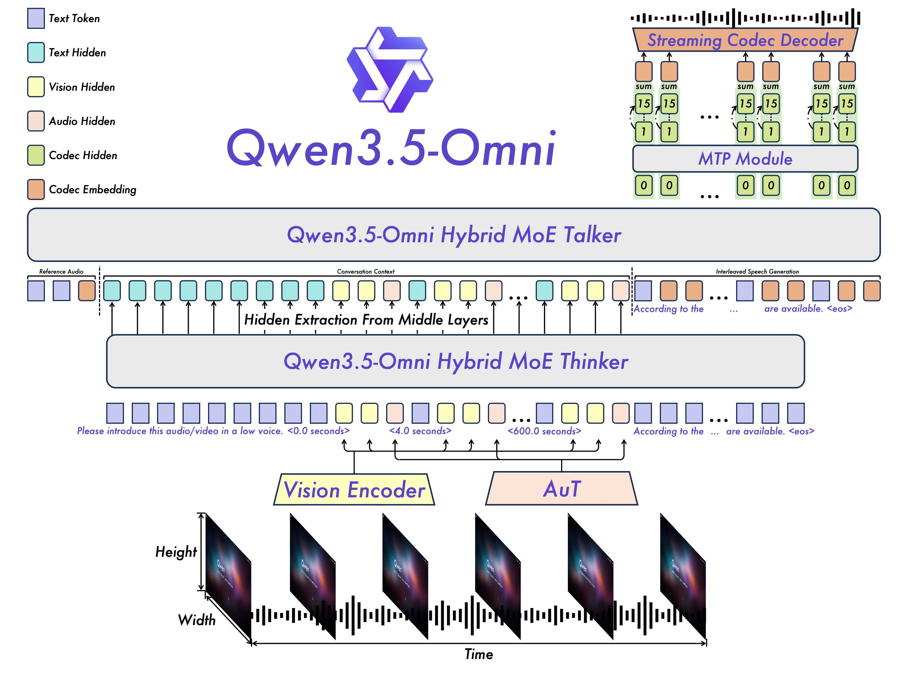
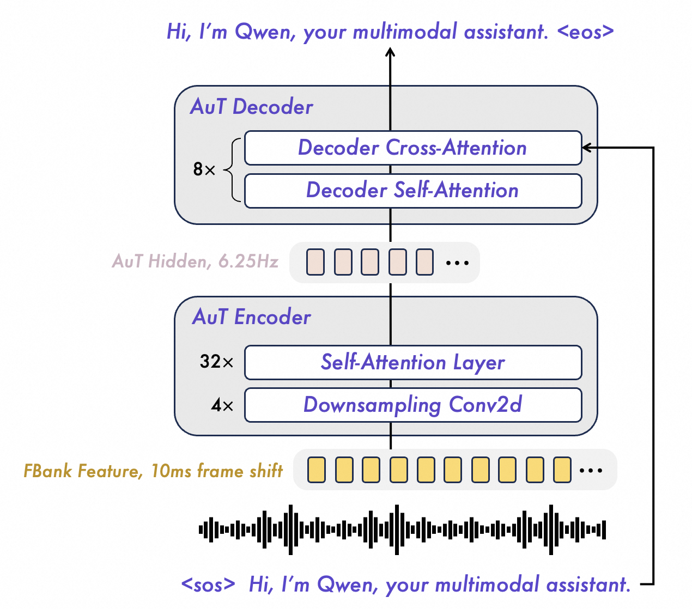

# Qwen3.5-Omni テクニカル・レポート

> 原題: Qwen3.5-Omni Technical Report
> 著者: Qwen Team（Alibaba Group）
> 出典: ar5iv 2604.15804（テクニカル・レポート、2026 年）
> リンク: API 経由で公開アクセス可能

## Abstract（要旨）

本作で我々は Qwen3.5-Omni を提示する。これは Qwen-Omni モデル・ファミリーにおける最新の進歩である。前任者からの大幅な進化を表し、Qwen3.5-Omni は **数千億パラメータ**へスケールし、**256K の文脈長**をサポートする。異種テキスト-視覚対と **1 億時間を超える音声-視覚コンテンツ**から成る大規模データセットを活用することで、本モデルは堅牢な omni-modality 能力を実証する。**Qwen3.5-Omni-Plus は 215 の音声・音声-視覚理解、推論、相互作用のサブタスクとベンチマークで SOTA 結果を達成**し、主要な音声タスクで **Gemini-3.1 Pro を凌駕**し、包括的な音声-視覚理解でそれに匹敵する。構造的には、Qwen3.5-Omni は Thinker と Talker の双方に **Hybrid Attention Mixture-of-Experts (MoE) フレームワーク**を採用し、効率的な長系列推論を可能にする。本モデルは洗練された相互作用を促進し、**10 時間超の音声理解と 400 秒の 720P 動画（1 FPS）**をサポートする。ストリーミング音声合成における固有の不安定性と不自然さ—しばしばテキスト・トークナイザと音声トークナイザの符号化効率の不一致によって引き起こされる—に対処するため、**ARIA (Adaptive Rate Interleave Alignment)** を導入する。ARIA はテキストと音声単位を動的に整合させ、最小の遅延影響で会話音声の安定性と韻律を著しく強化する。さらに、Qwen3.5-Omni は言語的境界を拡大し、**10 言語**にわたる多言語理解と人間のような感情的ニュアンスを伴う音声生成をサポートする。プリセット音声を超えて、本モデルはユーザ提供サンプルを介した **ゼロショット音声カスタマイズ**を可能にする。最後に、Qwen3.5-Omni は優れた **音声-視覚グラウンディング**能力を示し、精密な時間同期と自動シーン分割を伴うスクリプト・レベルの構造化キャプションを生成する。注目すべきことに、omnimodal モデルにおける新規能力の出現を観察した：音声-視覚命令に基づいて直接コーディングを行うことであり、これを **Audio-Visual Vibe Coding** と呼ぶ。Qwen3.5-Omni は API 経由で公開アクセス可能である。

<figure>

<figcaption>図1: Qwen3.5-Omni はテキスト・音声・画像・動画などの複数モダリティを処理し、リアルタイム・テキストまたは音声応答を生成できる、統一されたエンドツーエンド・モデルである。これらの機能に基づき、Qwen3.5-Omni は音声対話、動画対話、音声-視覚ツール使用を含むがそれに限られない広範なタスクをサポートする。</figcaption>
</figure>

## 1. Introduction（はじめに）

人間の世界との相互作用は本質的に omnimodal でエージェント的であり、視覚・聴覚・言語情報の統合と、テキスト・音声・目標指向のツール媒介行動を通じた応答生成を含み、他の生物との情報交換を促進し知能を実証する。テキスト、視覚、音声にわたる大規模モデルの理解・推論能力の急速な進歩を基盤として、すべてのモダリティにわたって共同で処理・生成するネイティブ omnimodal システムが大きな注目を集めている。しかし、既存モデルは主に受動的知覚-応答パラダイム内で動作し、現実的展開に不可欠な前提条件である、スケーラブルなエージェント的行動、リアルタイム相互作用、自律的ツール利用、クロスモーダル推論への能力が限定的である。

本報告では、Qwen3.5-Omni を提示する。これは Qwen の最新世代の完全 omnimodal LLM で、テキスト・画像・音声・音声-視覚コンテンツの理解をサポートする。膨大なテキスト、視覚データ、**1 億時間超の音声-視覚データ**で omnimodal な方法でネイティブに事前学習され、Qwen3.5-Omni はネイティブ omni エージェント・モデルとして設計されている：すべてのモダリティにわたって知覚・推論するだけでなく、**自律的に WebSearch を呼び出し、複雑な FunctionCall を実行し、音声出力を生成し、リアルタイム・ストリーミング相互作用に従事**する。モデル・シリーズには **Plus と Flash バリアント**が含まれ、すべて **256k トークン長文脈入力**の instruct モデルである。

Qwen3.5-Omni は Qwen2.5-Omni で導入された **Thinker–Talker 構造**を基盤として、Qwen3-Omni に対する **5 つの主要技術的アップグレード**を導入する：
1. **Thinker と Talker の双方が Hybrid-Attention Mixture-of-Experts (MoE) 設計を採用**し、高効率推論を可能にする
2. **最大 256k トークンの長文脈モデリング**をサポートし、10 時間超の音声と 400 秒超の 720P 音声-視覚コンテンツ（1 FPS）をサポート
3. 音声生成側では、**マルチコードブック・コーデック表現**が単一フレーム即時合成を可能にする
4. Talker は **ARIA** を導入し、ストリーミング・デコード中にテキストと音声単位を動的に整合させ、自然さと頑健性を著しく改善する
5. **多言語学習が大幅に拡大**し、音声認識で 113 言語と方言、音声合成で 36 言語をカバー

これら技術進歩により、Qwen3.5-Omni は Qwen3-Omni に対して **3 つの主要な新能力**を提供する：
1. **制御可能な音声-視覚キャプショニング**：制御可能、詳細、構造化されたキャプションと、自動分割、タイムスタンプ注釈、キャラクターと音声との関係の詳細記述を含む脚本レベルの細粒度記述を生成可能
2. **包括的リアルタイム相互作用**：ネイティブな turn-taking 意図認識による意味的中断、音量・速度・感情のエンドツーエンド音声制御、ユーザ提供サンプルからの音声クローニングを包含
3. **ネイティブ omnimodal エージェント的行動**：自律的 WebSearch、複雑な FunctionCall 呼び出し、**Audio-Visual Vibe Coding**（音声-視覚命令から直接実行可能コードを生成する出現能力）を含み、外部オーケストレーションなしにリアルタイム・クエリへ応答可能

決定的に、Qwen3.5-Omni は同サイズの単一モデル Qwen 版に対する劣化なしに **テキストと視覚モダリティで最先端性能を維持**する。音声-視覚ベンチマーク、音声ベンチマーク、ASR ベンチマーク、言語固有の音声-テキスト翻訳タスク、言語固有 ASR タスクをカバーする **215 の音声・音声-視覚理解、推論、相互作用サブタスクとベンチマーク**にわたって、Qwen3.5-Omni-Plus は SOTA 結果を達成し、一般音声理解、推論、認識、翻訳、対話で Gemini-3.1 Pro を凌駕する一方、全体的な音声-視覚理解は Gemini-3.1 Pro のレベルに達する。

## 2. Architecture（構造）

<figure>

<figcaption>図2: Qwen3.5-Omni の概観。Qwen3.5-Omni は Thinker-Talker 構造を採用する。Thinker はテキスト生成を担い、Talker は Thinker から高レベル表現を直接受け取ることでストリーミング音声トークンの生成に集中する。超低遅延ストリーミングを実現するため、Talker はマルチコードブック系列を自己回帰的に予測する。各デコード・ステップで、MTP モジュールが現フレームの残差コードブックを出力し、その後 Code2Wav レンダラが対応する波形を段階的に合成し、フレーム単位のストリーミング生成を可能にする。</figcaption>
</figure>

### 2.1 Overview（概観）

図 2 に示すように、Qwen3.5-Omni は **Thinker-Talker 構造**を継続して採用する。Qwen3-Omni と比較して、Qwen3.5-Omni はスケーラビリティ、整合性、リアルタイム相互作用においていくつかの主要改善を導入する：

- **全体的バックボーンは Hybrid Mixture-of-Experts (MoE) 設計**を採用し、マルチモーダル理解・生成にわたる容量と効率のバランスをより良くしつつスケーラビリティを改善
- **Thinker は Vision Encoder と AuT を介してそれぞれ視覚信号と音声信号を受け取る**。音声と動画入力は統一マルチモーダル・モデリングのため交互配置され、特に長動画または音声-動画文脈での時間知覚を改善するため明示的タイムスタンプが挿入される。この設計により Thinker は拡張入力（最大 256k トークン、10 時間の音声、または 1 FPS で 400 秒の 720P 動画）を扱える
- **Talker はマルチモーダル入力と Thinker からのテキスト出力に条件付けることで文脈音声生成を担う**。Qwen3.5-Omni は Qwen3-Omni で導入された **RVQ ベースの音声表現**を採用し、推論効率を大幅に改善
- リアルタイム相互作用をサポートするため、Qwen3.5-Omni は Thinker の **チャンク単位ストリーミング入力処理**と **ストリーミング Talker 設計**の双方を採用し、低遅延エンドツーエンド・マルチモーダル会話を可能にする
- Qwen3-Omni の dual-track Talker 入力設計とは異なり、Qwen3.5-Omni の Talker は **ARIA を採用してテキストと音声単位を動的に整合**させてから交互配置する。この設計はテキストと音声間のトークン化レート不一致による不安定性を緩和し、それにより単語スキップ、誤発音、数字の曖昧なレンダリングのような問題を軽減

以下、まず AuT エンコーダとその学習方法論を紹介する。次に Thinker がさまざまな入力をどう処理するかを記述する。次に Talker のマルチコードブック・ストリーミング音声生成を詳述する。最後に、超低遅延エンドツーエンド・ストリーミング音声推論を達成することを目的とした、理解・生成モジュール双方に対する一連の改善を強調する。

### 2.2 Audio Transformer (AuT)

<figure>

<figcaption>図3: AuT の概観。4000 万時間の教師データ（特により多くの多言語データ）を消費して、Qwen3.5-Omni の AuT エンコーダは 6.25Hz で、より強力な汎用音声表現を獲得する。</figcaption>
</figure>

我々は attention-encoder-decoder モデル AuT で **ゼロから学習した transformer ベース音声エンコーダ**を使用する。Qwen3.5-Omni エンコーダの学習は **Qwen3-ASR によって生成された 4000 万時間の音声-テキスト対データ**を消費した。音声のフィルタバンク特徴量は **4 つの Conv2D ブロックを用いて 16 倍ダウンサンプリング**され、その後自己注意層に入力されて **6.25Hz トークンレート**の音声トークンを取得する。Qwen3-Omni エンコーダの学習プロセスと比較して、Qwen3.5-Omni のエンコーダは **20 以上の言語の多言語データ**を適応し、中国語・英語・多言語データの比率は **3.5:3.5:3** となる。**動的注意ウィンドウサイズ学習機構**が採用され、リアルタイム prefill キャッシングおよびオフライン音声理解タスク下の推論性能のバランスを保証する。

### 2.3 Perceivation（知覚）

#### Text, Audio, Image and Video (w/o Audio)（テキスト、音声、画像、動画（音声なし））

Thinker はテキスト、音声、画像、無音動画入力を統一表現系列へ変換する。テキストには **Qwen3.5 トークナイザ**を用い、**語彙サイズ 250k（150k から拡大）**のバイトレベル byte-pair 符号化を採用し、ほとんどの言語で符号化・復号効率を **10-60% 改善**する。動画から抽出された音声を含む音声入力については、波形を **16 kHz にリサンプリング**し、25 ms ウィンドウと 10 ms ホップサイズで **128 チャンネル・メル・スペクトログラム**に変換する。音声エンコーダとして **AuT を使用**し、4000 万時間の音声データでゼロから学習され、各出力フレームは元信号の約 160 ms に対応する。視覚入力については、画像と動画の双方を処理するため **Qwen3.5 の vision encoder を採用**する。画像と動画データの混合で学習された本エンコーダは、画像理解と動画理解の双方で強力な能力を提供する。音声ストリームとの整合を維持しつつ動画情報を可能な限り保持するため、**動的フレームレートで動画フレームをサンプリング**する。

#### Audio-visual Timestamp（音声-視覚タイムスタンプ）

Qwen3-Omni に従い、音声-動画同期のための時間認識をモデルに授けるため **TM-RoPE** を適用する。しかし、時間位置 ID を介して絶対時間を直接符号化すると、音声入力を含む長動画からの視覚パッチに対して **過度に疎なインデックス**を生み、長距離時間モデリングを弱める。さらに、そのような設計は通常、異なるフレームレートにわたる **大規模で均一に分布した学習サンプル**を要求し、データ構築コストを増加させる。これらの問題に対処するため、各動画または音声-動画時間パッチの前に **秒単位のフォーマットされたテキスト文字列として表現された明示的タイムスタンプ**を付加し、モデルがタイムコード表現をより自然に学習できるようにする。音声系列については、モダリティ間の時間整合を改善するためタイムスタンプを **ランダム間隔で挿入**する。この戦略は文脈長を若干増加させるが、特に長文脈マルチモーダル入力を外挿する際に、より精密で頑健な時間知覚を可能にする。

マルチモーダル音声-視覚ストリームの文脈では、音声成分は **160 ms ごとの時間 ID** で符号化される。動画はフレーム系列として扱われ、実際のタイムスタンプに基づいて動的に調整される単調増加する時間 ID を持ち、**ID あたり 160 ms の一貫した時間解像度**を保証する。動画フレームの高さと幅 ID は静止画像と同様に割り当てられる。複数モダリティを処理する際の位置衝突を防ぐため、位置番号付けは連続的に行われ、各後続モダリティは前モダリティの最大位置 ID に 1 を加えた値から始まる。この洗練された位置符号化のアプローチは、モデルが多様なモダリティからの情報を効果的に統合・共同モデル化することを可能にする。Qwen3.5-Omni はこれら表現を、絶対時間に明示的に固定された時間 ID を用いて整合する。この設計選択により、モデルは任意持続時間のストリーミング入力をサポートする柔軟性を持つ。

### 2.4 Speech Generation（音声生成）

Talker は **Qwen3.5-Omni-Audio-Tokenizer が生成する RVQ トークン**で直接動作する。残差コードブックをモデル化するため、**multi-token prediction (MTP) モジュール**を採用し、音響詳細の細粒度モデリングと制御を可能にする。**因果的 ConvNet による波形再構成**と組み合わせて、Talker は低推論遅延と適度な計算オーバーヘッドで高忠実度音声合成を提供する。

複数ターン音声対話において、Talker は Thinker 構成要素が提供する豊かな文脈情報—履歴テキスト・トークン、マルチモーダル表現、現在ターンのストリーミング・テキストを含む—に条件付けられる。そのような条件付けにより、Talker は進化する会話文脈に応じて **音響属性—韻律、音量、感情など—を動的に調節**できる。

構造的に、我々のアプローチは Qwen3-Omni と 2 つの主要点で異なる。第 1 に、**Talker 用の専用システム・プロンプト**を導入し、ターゲット音声特性を指定する、それによりゼロショット音声クローニングと制御可能音声生成の双方を可能にする。従来の話者埋め込みと比較して、このプロンプトはテキスト記述とコーデック系列を含むより豊かなマルチモーダル合図を符号化でき、音響実現に対するはるかに細粒度の制御を提供する。第 2 に、**ARIA (Adaptive Rate Interleave Alignment)** を提案し、従来の dual-channel 生成パラダイムを単一チャネル定式化へと統一する。MFA 由来の整合や固定交互配置レートに依存するのではなく、ARIA は **適応的レート制約**を強制する：生成系列の任意の prefix について、累積音声-テキスト・トークン比率は対応する項目レベル・グローバル比率を超えてはならない。シンプルさにもかかわらず、この設計は比較的低い符号化効率を持つ言語を含む言語にわたる柔軟なテキスト-音声整合を提供し、任意のテキスト・トークン prefix に続く首尾一貫した音声トークン継続を自然にサポートする。

### 2.5 Designs for Streaming and Concurrency（ストリーミングと並行性のための設計）

ストリーミング音声-視覚相互作用シナリオでは、**first-packet 遅延**がユーザ体験に影響する決定的要因であり、モデルの並行性能力はサービス・コスト削減と応答速度向上の鍵である。本節では、Qwen3.5-Omni がアルゴリズムおよび構造的最適化を通じて並行性を強化し first-packet 遅延を削減する方法を議論する。表 1 は Qwen3.5-Omni の関連構造とそれに関連する遅延の概観を提供する。

**表1**: Qwen3.5-Omni の構造と音声/動画設定下のエンドツーエンド first-packet 遅延（ms）。

| Module | Architecture | Streaming |
| --- | --- | --- |
| Audio Encoder | AuT | ✓ |
| Vision Encoder | SigLIP2 | – |
| Thinker | Hybrid MoE Transformer | ✓ |
| Talker | Hybrid MoE Transformer | ✓ |
| MTP | Dense Transformer | ✓ |
| Code2wav | ConvNet | ✓ |
| **First-Packet Latency (Audio Input)** | | **Plus: 435ms / Flash: 235ms** |
| **First-Packet Latency (Video Input)** | | **Plus: 651ms / Flash: 426ms** |

#### Chunked Prefilling and Hybrid MoE Architecture

Qwen3.5-Omni では、Qwen3-Omni および Qwen2.5-Omni で実装されたチャンク化 prefilling 機構を保持する、これらの音声・視覚エンコーダは時間次元に沿ってチャンクを出力できる。このアプローチは Thinker と Talker 双方の **Time-To-First-Token (TTFT)** を著しく削減する。構造的に、Qwen3.5-Omni の Thinker と Talker の双方は **Qwen3.5 で導入された Hybrid MoE 構造**に基づいて構築される。Hybrid MoE の一般的効率優位性に加え、本構造は **Gated Delta Net (GDN) モジュール**を含み、これは長音声-動画系列のモデリング加速に特に効果的である。結果として、長文脈推論で KV-キャッシュ I/O オーバーヘッドを著しく削減し、生成スループットを改善し、より高いサービング並行性を可能にする。

#### Streaming Generation with ARIA

ストリーミング音声生成と高並行性サービングのため、Qwen3.5-Omni は Qwen3-Omni の効率的設計を主に継承する：Talker は軽量 MTP モジュールで RVQ コーデック・トークンを予測し、生成されたマルチコードブック・トークンは因果的でストリーミング ConvNet コーデック・デコーダによって波形に変換される。これら構成要素は計算的に軽量、バッチに優しく、低遅延展開に適している。この共有基盤の上に、以前に導入された **ARIA は Qwen3-Omni の dual-channel 生成パターンを、テキストと音声トークンの統一交互配置単一ストリーム定式化**にさらに再構成する。テキストと音声生成を **単調交互配置制約**の下で組織化することで、ARIA は別個生成トラック間の同期オーバーヘッドを削減し、デコード中のより効率的なトークン・スケジューリングを可能にし、ストリーミング相互作用の自然に段階的な制度により良く一致する。

表 2 で、Qwen3.5-Omni の音声・動画入力の異なる並行性レベルでの理論的 first-packet 遅延を報告する、内部 vLLM 上で MTP モジュールとコーデック・デコーダ用に torch.compile と CUDA Graph 加速を有効にして評価された。ここで、Thinker TTFT (Time-To-First-Token) は入力ストリームを受け取ってから Thinker が最初のテキスト・トークンを生成するまでの時間を示し、Talker TTFC (Time-To-First-Chunk) は Talker が最初の音声チャンクを生成するまでの時間を測定する。TPOP (Time-Per-Output-Token) は定常状態デコード中のトークンあたり遅延を表し、Talker TPOP は Talker バックボーンと MTP モジュールの合計遅延を含む。TPS (Tokens Per Second) は生成スループットを示す。ARIA はテキストと音声生成を統一交互配置ストリームで組織化するため、**Overall Latency** は単に複数行の値を合計して得られるのではなく、最初の再生可能音声パケットへのエンドツーエンド・クリティカル・パスを反映する。Qwen3.5-Omni-Flash と Qwen3.5-Omni-Plus の規模差が大きいため、2 バリアントは異なる展開時リソース割り当てと並列化戦略を採用するため、その遅延とスループット数値は厳密な横並び比較を意図していない。表に示すように、Qwen3.5-Omni は並行性増加に伴い安定した遅延とデコード効率を維持する一方、低い Generation RTF はスムーズなストリーミング音声生成のため十分な余裕を提供する。

**表2**: 異なる並行性レベル下の Qwen3.5-Omni の理論的 first-packet 遅延。A/V は音声/動画入力を示す。

| | Qwen3.5-Omni-Flash | | | Qwen3.5-Omni-Plus | | |
| --- | --- | --- | --- | --- | --- | --- |
| | 1 Conc. | 4 Conc. | 8 Conc. | 1 Conc. | 4 Conc. | 8 Conc. |
| Thinker TTFT | 80/255ms | 86/446ms | 103/765ms | 162/377ms | 183/907ms | 260/1243ms |
| Talker TTFC | 56/61ms | 68/108ms | 81/116ms | 54/56ms | 72/88ms | 95/116ms |
| Thinker TPOP | 5.6/5.9ms | 8.2/9.2ms | 9.6/15.8ms | 17.4/18.5ms | 25.6/26.9ms | 33.3/40.2ms |
| Talker TPOP | 14.2/14.2ms | 16.9/17.0ms | 20.5/20.6ms | 14.9/14.9ms | 21.0/21.3ms | 25.8/27.1ms |
| Codec Decode | 3~5ms | | | | | |
| **Overall Latency** | **235/426ms** | 298/891ms | 352/1625ms | **435/651ms** | 619/1515ms | 955/1980ms |
| Thinker TPS | 177/171 | 556/457 | 942/598 | 57/54 | 156/149 | 266/240 |
| Talker TPS | 70/70 | 237/235 | 389/388 | 67/67 | 191/189 | 320/296 |
| Generation RTF | 0.178 | 0.211 | 0.257 | 0.187 | 0.267 | 0.334 |

## 3. Pretraining（事前学習）

**表3**: Qwen3.5-Omni-Plus でサポートされる言語と方言。

| Modality | # Varieties | Supported languages and dialects |
| --- | --- | --- |
| Text | **201** | Qwen3.5 のサポート言語完全リストを参照 |
| Speech Input | **113** | **74 言語**: アフリカーンス語、アラビア語、アストゥリアス語、アゼルバイジャン語、バスク語、ベラルーシ語、ベンガル語、ボスニア語、ブルガリア語、広東語、カタロニア語、セブアノ語、中国語、クロアチア語、チェコ語、デンマーク語、オランダ語、英語、エスペラント、エストニア語、フィリピン語、フィンランド語、フランス語、ガリシア語、グルジア語、ドイツ語、ギリシャ語、ヘブライ語、ヒンディー語、ハンガリー語、アイスランド語、インドネシア語、インテルリングア、イタリア語、日本語、ジャワ語、カンナダ語、カザフ語、韓国語、キルギス語、リンガラ語、ラトビア語、リトアニア語、マケドニア語、マレー語、マラヤーラム語、マルタ語、マオリ語、マラーティー語、モンゴル語、ノルウェー・ブークモール、ノルウェー・ニーノシュク、オリヤー語、ペルシア語、ポーランド語、ポルトガル語、パンジャブ語、ルーマニア語、ロシア語、セルビア語、スロバキア語、スロベニア語、スペイン語、スワヒリ語、スウェーデン語、タジク語、タミル語、テルグ語、タイ語、トルコ語、ウクライナ語、ウルドゥー語、ウイグル語、ベトナム語。**39 中国方言**: 東北マンダリン、貴州方言、広東広東語、河南方言、香港広東語、上海語、陝西方言、天津方言、台湾マンダリン、雲南方言、安徽方言、福建方言、甘粛方言、広東マンダリン、湖北方言、湖南方言、江西方言、山東方言、山西方言、四川語、広西方言、海南方言、重慶方言、長沙方言、杭州方言、合肥方言、銀川方言、鄭州方言、瀋陽方言、温州方言、武漢方言、昆明方言、太原方言、南昌方言、済南方言、蘭州方言、南京方言、客家語、閩南語 |
| Speech Output | **36** | **29 言語**: 中国語、英語、ドイツ語、イタリア語、ポルトガル語、スペイン語、日本語、韓国語、フランス語、ロシア語、タイ語、インドネシア語、アラビア語、ベトナム語、トルコ語、フィンランド語、ポーランド語、ヒンディー語、オランダ語、チェコ語、ウルドゥー語、タガログ語、スウェーデン語、デンマーク語、ヘブライ語、アイスランド語、マレー語、ノルウェー語、ペルシア語。**7 中国方言**: 四川語、北京方言、天津方言、南京方言、陝西方言、広東語、閩南語 |

Qwen3.5-Omni は、表 3 に示す複数の言語と方言を包含する多様なデータセット、およびモダリティ（画像-テキスト、動画-テキスト、音声-テキスト、動画-音声、動画-音声-テキスト、純テキスト・コーパス）で事前学習される。Qwen3-Omni に従い、汎化能力と命令追従能力の双方を強化するため、より広範な自然言語プロンプトを採用する。全モダリティにわたる堅牢な性能を達成するため、学習戦略は事前学習の初期段階から **unimodal とクロスモーダル・データの双方**を組み込む。

Qwen3-Omni では、モデルに時間認識を授けるため TMRoPE を採用した。しかし、このアプローチの 2 つの主要限界を特定した：(1) 時間位置 ID を絶対時間に直接結びつけることで、長音声-動画または動画入力で過度に大きく疎な時間位置 ID を生成し、モデルの長距離時間文脈捕捉能力を損なう。(2) この方式での効果的学習は通常、異なるフレームレート (fps) にわたる大規模で均一分布したサンプリングを要し、学習データ構築コストを著しく増加させる。これらの問題に対処するため、**各動画または音声-動画時間パッチの前に、秒単位のフォーマットされたテキスト文字列として表現されたタイムスタンプを付加**し、モデルがタイムコード表現をより良く学習・解釈できるようにする。さらに、音声系列については、異なるモダリティにわたる学習を整合させるため **タイムスタンプをランダム間隔で挿入**する。このアプローチは文脈長の控えめな増加をもたらすが、モデルが時間情報をより効果的かつ精密に知覚できるようにする。

Qwen3.5-Omni の事前学習は **3 つの区別された段階**に構造化される。第 1 段階では、LLM パラメータをロックし、視覚と音声エンコーダの学習に焦点を当て、LLM 内の意味理解を強化するために音声-テキストと画像-テキスト対の膨大なコーパスを利用する。第 2 段階では、全パラメータの凍結を解除し、より包括的な学習のため **系列長 32,768** でより広範なマルチモーダル・データで学習する。最終段階では、複雑な長系列データを理解するモデルの能力を強化するため、**系列長 262,144** のデータを使用する：

1. **Encoder Alignment Stage (S1)**: 初期事前学習フェーズで、Qwen3.5-Omni の LLM 構成要素は **Qwen3.5** のパラメータで初期化され、視覚エンコーダは Qwen3.5 から採用され、音声エンコーダは **AuT** で初期化される。2 つのエンコーダは固定 LLM 上で別々に学習され、両方ともまずそれぞれのアダプタを学習してからエンコーダを学習する
2. **General Stage (S2)**: 事前学習の第 2 フェーズは **約 4 兆トークン**を含む大規模データセットを利用し、モダリティ間の分布は以下の通り: **テキスト 0.92T、音声 1.99T、画像 0.95T、動画 0.14T、動画-音声 0.29T**。本段階で、より多様なマルチモーダル・データとタスクの導入が、聴覚、視覚、テキスト、音声-視覚情報におけるモデルの理解・相互作用能力を強化する
3. **Long Context Stage (S3)**: 最終事前学習フェーズで、**最大トークン長を 32,768 から 262,144 へ増加**させ、長音声と長動画の学習データ比率も上げる。実験結果は、これら調整が長系列データ理解能力に著しい改善をもたらすことを示す

## 4. Post-training（事後学習）

### 4.1 Thinker

事後学習フェーズは Thinker 用に **3 段階戦略**を採用し、全モダリティにわたるモデル能力を劣化させずに保持し、音声クエリ下での高応答品質を確保し、全体的相互作用体験を最適化することを目的とする。学習コーパスは **ChatML 形式**で構造化され、純テキスト、視覚、音声、混合モダリティ会話データを包含する。具体的にはプロセスは以下の段階から成る：

- **Stage 1: Specialist Distillation**: 強力な omnimodal 能力の基盤を確立するため、まず独立した教師あり微調整 (SFT) と強化学習 (RL) を介してドメイン特化教師モデル群を学習する。すべての教師モデルは事前学習済み Qwen-3.5 base チェックポイントから微調整される。エージェント的、コーディング、基礎推論タスクを含むテキスト関連タスクを超えて、視覚と音声用の専門教師モデルも学習する。これら教師モデルはドメイン固有データの生成に用いられ、各ドメインで学習された専門能力を単一統一モデルに蒸留することを可能にする
- **Stage 2: On-Policy Distillation**: 上記の specialist 蒸留により、モデルはマルチモーダル理解と推論、テキスト・ベース対話、推論、コーディング、エージェント的タスクなどのドメインで既に強力な性能を達成する。それにもかかわらず、特に音声対話で、音声クエリに条件付けられた応答品質とテキスト・クエリに条件付けられた応答品質の間に実質的なギャップが残る。このギャップを削減するため、**on-policy distillation (OPD)** に基づく第 2 段階学習手順を導入し、テキスト入力下のモデルのより強力な応答能力を音声入力設定に蒸留することを目標とする。具体的には、各音声-テキスト・ペア・クエリについて、まずテキスト条件下で生成された応答を取得する、これは通常流暢性、推論、タスク完了で高品質を示す。次に、この応答を対応する音声条件付きクエリの蒸留ターゲットとして使用する。そのような on-policy ターゲットで学習することで、モデルは徐々に音声条件付き出力をテキスト条件付き行動と整合させ、それにより音声入力下の応答品質を改善しモダリティ一貫した生成を促進する
- **Stage 3: Interaction-Aligned Reinforcement Learning**: 前 2 段階はモデルのドメイン能力とクロスモーダル応答品質を実質的に改善するが、現実世界の対話的使用のためモデルを完全に最適化するには不十分である。複数ターン会話で、意図しない言語コード切り替え、ペルソナ不整合、拡張文脈にわたる劣化した命令追従を含むいくつかの相互作用固有の問題を観察する。これらの問題を緩和するため、**Interaction-Aligned RL** を導入する、これは相互作用品質のためモデルを最適化することを目的とした第 3 段階強化学習手順である。複数ターン相互作用軌跡を構築し、これらユーザ体験目標の周りに報酬信号を設計し、長期相互作用でより安定、一貫、整合した行動を学ぶことをモデルに可能にする。相互作用品質を明示的に最適化することで、本段階は実用的会話シナリオでのモデルの全体的有用性を改善する

### 4.2 Talker

Talker 用に **4 段階学習パイプライン**を採用し、Qwen3.5-Omni がテキストと共に自然で文脈的に適切な音声応答を生成することを可能にする。全学習データは Thinker との一貫性を維持し音声クローニングを促進するため ChatML 形式で構造化される。

1. **General Stage**: 初期事前学習段階で、マルチモーダル文脈とペアになった **2000 万時間超の多言語音声データ**で Qwen3.5-Omni を学習する。特に、命令追従音声生成のようなより多様なタスクの導入が、マルチモーダル表現から音声への単純な単調マッピングを超えて、文脈推論とパラ言語的整合を実質的に強化する
2. **Long-Context Stage**: 専用整備パイプラインを通じてデータ品質階層化を行い、高品質サブセットで continual pre-training (CPT) を実施する。Qwen3-Omni-Captioner で増強された本段階は、初期事前学習フェーズのノイズの多いデータによって導入された幻覚を緩和し、生成音声の自然さと品質を実質的に改善する。同時に、**最大文脈長を 64k トークンに拡張**し、モデルが長く複雑なユーザ入力をより良く扱えるようにし、より文脈にグラウンディングされた音声応答を生成
3. **Reinforcement Learning Stage**: **Direct Preference Optimization (DPO)** を通じて人間選好にモデル行動をさらに整合させる。具体的には、人間注釈に基づく多言語選好対を構築し、DPO でモデルを最適化する。さらに、ルールベース報酬を組み込み **GSPO** を採用して、多様なタスクにわたる全体的能力と学習安定性をさらに改善
4. **Speaker Fine-tuning Stage**: 最後に、base モデルの上で軽量話者微調整を行い、Qwen3.5-Omni がターゲット話者特性を忠実に捕捉できるようにし、その音声出力の自然さ、表現力、制御可能性をさらに改善

## 5. Evaluation（評価）

**Qwen3.5-Omni-Flash と Qwen3.5-Omni-Plus** の 2 バリアントで包括的評価を実施した。評価結果は 2 つの主要カテゴリに分けられる：**理解 (X→Text)** と **音声生成 (X→Speech)**。

### 5.1 Evaluation of X→Text

本節では Qwen3.5-Omni のさまざまなマルチモーダル入力（テキスト、音声、視覚、音声-視覚動画）を理解しテキスト応答を生成する能力を評価する。

#### 5.1.1 Performance of Text→Text

**表4**: Qwen3.5-Omni と Qwen3.5-Plus-Instruct の Text→Text 性能。

| Datasets | Qwen3.5-Plus-Instruct | Qwen3.5-Omni-Flash | Qwen3.5-Omni-Plus |
| --- | --- | --- | --- |
| *Knowledge* | | | |
| MMLU-Pro | **86.8** | 79.9 | 85.9 |
| MMLU-Redux | **94.3** | 90.0 | 94.2 |
| SuperGPQA | **67.4** | 54.9 | 66.4 |
| C-Eval | **92.3** | 86.0 | 92.0 |
| *Instruction Following* | | | |
| IFEval | **89.7** | 85.2 | **89.7** |
| IFBench | 51.1 | 38.4 | **52.6** |
| *Long Context* | | | |
| AA-LCR | **62.0** | 46.0 | 57.0 |
| LongBench v2 | **60.2** | 46.4 | 59.6 |
| *STEM* | | | |
| GPQA | **85.9** | 76.4 | 83.9 |
| *Reasoning* | | | |
| LiveCodeBench v6 | **67.1** | 56.6 | 65.6 |
| HMMT Nov 25 | **86.2** | 59.0 | 84.4 |
| IMOAnswerBench | **68.3** | 51.5 | 65.5 |
| *General Agent* | | | |
| BFCL-V4 | **66.1** | 55.3 | 63.3 |
| TAU2Bench | **82.7** | 78.0 | 81.0 |

Qwen3.5-Omni-Plus は知識、命令追従、長文脈理解、STEM、推論、一般エージェント・タスクを含む複数次元にわたって、テキスト専用版に匹敵するテキスト能力を実証し、強力な言語能力を強調する。特に、Qwen3.5-Omni の命令追従性能はベースラインよりわずかに良い。**OPD と interaction-aligned RL が omni モデル LLM の命令追従能力改善に正の効果**を持つと信じる。

#### 5.1.2 Performance of Audio→Text

**表5**: Gemini-3.1 Pro、Qwen3.5-Omni-Flash、Qwen3.5-Omni-Plus にわたる音声ベンチマーク比較。

| Datasets | Gemini-3.1 Pro | Qwen3.5-Omni-Flash | Qwen3.5-Omni-Plus |
| --- | --- | --- | --- |
| *Audio Understanding (↑)* | | | |
| **MMAU** | 81.1 | 80.4 | **82.2** |
| MMAR | **83.7** | 74.0 | 80.0 |
| **MMSU** | 81.3 | 72.2 | **82.8** |
| **RUL-MuchoMusic** | 59.6 | 60.5 | **72.4** |
| SongFormBench-HarmonixSet | 75.6/46.8/77.9 | 80.6/67.8/83.4 | **81.1/72.9/85.3** |
| SongFormBench-CN | 78.1/43.2/71.9 | **86.7/66.4/84.6** | **87.1**/65.7/84.2 |
| *Dialogue (↑)* | | | |
| **VoiceBench** | 88.9 | 87.8 | **93.1** |
| URO-Bench-pro (U/R/O) | 69.1/84.0/99.2 | 64.1/83.8/98.7 | **66.3/86.3/99.8** |
| SpeechRole | **124.2** | 119.8 | 123.5 |
| WildSpeech-Bench | **76.3** | 72.2 | 75.4 |
| *S2TT (↑)* | | | |
| **Fleurs xx↔zh (top59)** | 29.5 | 26.9 | **30.2** |
| **Fleurs xx↔en (top59)** | 34.6 | 32.0 | **35.4** |
| **Fleurs xx↔zh/en (top59)** | 32.1 | 29.4 | **32.8** |
| *ASR (WER ↓)* | | | |
| **Fleurs (top60)** | 7.32 | 10.75 | **6.55** |
| **CV15 (zh/yue/zh-tw)** | 8.59/13.40/6.78 | 4.25/3.45/2.68 | **3.46/1.95/2.27** |
| **CV15 (en)** | 8.73 | 5.90 | **4.83** |
| **Librispeech (clean/other)** | 3.36/4.41 | 1.30/2.43 | **1.11/2.23** |
| **Wenetspeech (net/meeting)** | 11.53/14.21 | **4.41**/5.51 | 4.30/**5.84** |
| **Kespeech** | 23.67 | 4.47 | **3.46** |
| **MIR-1K (vocal-only)** | 8.76 | 4.94 | **4.56** |
| **Opencpop** | 6.83 | **1.11** | 1.49 |

Gemini-3.1 Pro と比較して、Qwen3.5-Omni は MMAU、MMSU、RUL-MuchoMusic、SongFormBench で優れた性能を示し、MMAR で同等の結果を達成する、複数の音声ドメインにわたる強力な理解能力を実証する。エンドツーエンド音声対話に関しては、Qwen3.5-Omni は VoiceBench で Gemini-3.1 Pro を著しく凌駕し、他のベンチマークでその性能に匹敵する、Qwen3.5-Omni のエンドツーエンド音声相互作用における堅牢な能力をさらに検証する。S2TT と ASR について、Qwen3.5-Omni は一貫して Gemini-3.1 Pro を凌駕し、多様な言語、方言、ドメインにわたる優れた翻訳・音声認識性能を強調する。

#### 5.1.3 Performance of Vision→Text

**表6**: Qwen3.5-Omni と Qwen3.5-Plus-Instruct の Vision→Text 性能。

| Datasets | Qwen3.5-Plus-Instruct | Qwen3.5-Omni-Flash | Qwen3.5-Omni-Plus |
| --- | --- | --- | --- |
| *STEM and Puzzle* | | | |
| MMMU | **81.0** | 76.9 | 80.1 |
| MMMU-Pro | 73.8 | 68.2 | **73.9** |
| MathVision | **73.6** | 65.4 | 73.0 |
| Mathvista (mini) | **86.9** | 82.9 | 86.1 |
| DynaMath | **84.2** | 79.3 | 83.8 |
| ZEROBench | **6** | 1 | 5 |
| ZEROBench_sub | 31.1 | 26.0 | **34.4** |
| *General VQA* | | | |
| **RealWorldQA** | 79.1 | 77.5 | **84.1** |
| MMStar | **80.3** | 75.7 | 79.4 |
| MMBench EN-DEV-v1.1 | **93.8** | 88.8 | 92.8 |
| SimpleVQA | **66.1** | 54.4 | 65.3 |
| *Text Recognition and Document Understanding* | | | |
| CharXiv (RQ) | **74.2** | 64.4 | 72.5 |
| **CC-OCR** | 83.0 | 80.8 | **83.4** |
| AI2D_TEST | **92.1** | 89.0 | 91.2 |
| MMLongBench-Doc | **59.7** | 53.6 | 57.5 |
| OCRBench | **91.4** | 89.1 | 91.3 |
| *Spatial Intelligence* | | | |
| ERQA | 53.8 | 50.0 | **54.8** |
| CountBench | **95.1** | 88.2 | **95.1** |
| RefCOCO(avg) | **95.2** | 92.6 | 95.0 |
| ODInW13 | **50.3** | 46.8 | 49.5 |
| **EmbSpatialBench** | 83.4 | 82.7 | **85.4** |
| *Video Understanding* | | | |
| **VideoMME (w/o sub.)** | 81.0 | 77.0 | **81.9** |
| **MLVU (M-Avg)** | 85.1 | 81.9 | **86.8** |
| **MVBench** | 76.7 | 70.8 | **79.0** |
| **LVBench** | 68.6 | 65.7 | **71.2** |
| **MMVU** | 67.1 | 62.7 | **67.5** |
| **MME-VideoOCR** | 74.2 | 70.5 | **77.0** |
| *Medical VQA* | | | |
| **SLAKE** | 82.8 | 73.1 | **84.7** |
| **PMC-VQA** | 62.4 | 58.7 | **62.7** |
| MedXpertQA-MM | **55.3** | 44.8 | 54.7 |

Qwen3.5-Omni-Plus は Qwen3.5-Plus-Instruct と同等の性能を達成し、**短動画と長動画双方を含む動画理解タスクでより強力な結果**を実証する。これらの知見は、現実世界シナリオにおける本モデルの強力な動的視覚知覚能力を強調し、**共同 video-audio 学習パラダイムの効果**を示唆する。さらに、音声-視覚ストリームは現実世界現象の最も自然主義的表現を構成すると仮定する、視覚と聴覚モダリティは独立に処理されるのではなく本質的に結合されている。

#### 5.1.4 Performance of Audio-Visual Video→Text

**表7**: Qwen3.5-Omni と Gemini-3.1-Pro の Audio-Visual→Text 性能。

| Datasets | Gemini-3.1 Pro | Qwen3.5-Omni-Flash | Qwen3.5-Omni-Plus |
| --- | --- | --- | --- |
| *Text Query QA* | | | |
| **DailyOmni** | 82.7 | 81.8 | **84.6** |
| WorldSense | **65.5** | 57.9 | 62.8 |
| AVUT | **85.6** | 81.4 | 85.0 |
| AV-SpeakerBench | **75.1** | 65.2 | 71.3 |
| VideoMME w/ audio | **89.0** | 79.3 | 83.7 |
| *Audio Query QA* | | | |
| **Qualcomm IVD** | 66.2 | 66.3 | **68.5** |
| *Caption* | | | |
| **Omni-Cloze** | 57.2 | 63.0 | **64.8** |
| *Agent (Tool Use)* | | | |
| OmniGAIA | **68.9** | 33.9 | 57.2 |

一般理解について、Qwen3.5-Omni は DailyOmni で最先端性能を達成し、AVUT で同等の結果を取得する。Qwen3.5-Omni-Plus は **Qualcomm IVD で Gemini-3.1-Pro を実質的なマージンで凌駕**し、現実世界音声-視覚対話シナリオでの効果を実証する。さらに、キャプショニング・タスクで強力な性能を示す。詳細な音声、視覚、音声-視覚キャプションを提供できる。本バージョンでは、モデルのツール使用能力も強化し、**OmniGAIA で 57.2% を達成**。

### 5.2 Evaluation of X→Speech

本節では Qwen3.5-Omni の音声生成能力を評価する。評価はゼロショット text-to-speech (TTS) 設定に従い、テキストとプロンプト音声に条件付けられた音声生成を主に対象とする。モデルを 4 つの観点から研究する：

- **Zero-Shot Speech Generation**: SEED で WER で測定されるコンテンツ一貫性を評価
- **Multilingual Speech Generation**: TTS 多言語テスト集合と FLEURS 上で構築された内部多言語テスト集合でゼロショット多言語音声生成のコンテンツ一貫性と話者類似度の双方を評価
- **Cross-Lingual Speech Generation**: CV3-Eval でゼロショットクロス言語音声生成のコンテンツ一貫性を評価
- **Custom-Voice Speech Generation**: TTS 多言語テスト集合と内部多言語テスト集合で話者微調整モデルの安定性を評価

#### 5.2.1 Evaluation of Zero-Shot Speech Generation

**表8**: SEED-TTS テスト集合でのゼロショット音声生成。性能は Word Error Rate (WER, ↓) で測定。

| Model | test-zh | test-en |
| --- | --- | --- |
| Seed-TTS ICL | 1.11 | 2.24 |
| Seed-TTS RL | 1.00 | 1.94 |
| MaskGCT | 2.27 | 2.62 |
| E2 TTS | 1.97 | 2.19 |
| F5-TTS | 1.56 | 1.83 |
| Spark TTS | 1.20 | 1.98 |
| CosyVoice 2 | 1.45 | 2.57 |
| CosyVoice 3 | **0.71** | 1.45 |
| MiniMax-Speech | 0.83 | 1.65 |
| MiMo-Audio-7B-Instruct | 1.96 | 5.37 |
| Qwen2.5-Omni-7B | 1.42 | 2.33 |
| Qwen3-Omni-30B-A3B | 1.07 | 1.39 |
| **Qwen3.5-Omni-Plus** | 0.99 | **1.26** |

Qwen3.5-Omni は SEED-TTS ベンチマークで高い競争力のある性能を達成し、ゼロショット音声生成での強力なコンテンツ忠実性を実証する。**RLHF 最適化後、Qwen3.5-Omni は生成安定性と自然さをさらに改善し、test-en split で WER 1.26 の最良性能を達成**。

#### 5.2.2 Evaluation of Multilingual Speech Generation

Qwen3.5-Omni は **29 言語**で音声生成をサポートする。多言語音声生成性能を 2 つの強力な商用システム MiniMax-Speech と ElevenLabs と比較する。表 9 と表 10 に示すように、**Qwen3.5-Omni は評価された 29 言語のうち 22 言語で多言語テスト集合上で最低 WER を達成**し、ほとんどの場合比較システムを明確なマージンで凌駕する。残りの言語でも、Qwen3.5-Omni は最先端システムと競争力のある状態を維持する。コンテンツ一貫性に加え、Qwen3.5-Omni は **強力な音声クローニング忠実性**も示す。評価された言語の大半で最高話者類似度スコアを取得し、全体として MiniMax-Speech と ElevenLabs の双方を一貫して凌駕する。

#### 5.2.3 Evaluation of Cross-Lingual Speech Generation

**表11**: Cross-Lingual ベンチマークでのクロス言語音声生成。性能は mixed error rate（英語は WER、他は CER, ↓）で測定。

| Language | Qwen3.5-Omni-Plus | Qwen3-Omni-30B-A3B | CosyVoice3 | CosyVoice2 |
| --- | --- | --- | --- | --- |
| English-to-Chinese | **4.86** | 5.37 | 5.09 | 13.5 |
| Japanese-to-Chinese | 3.55 | 3.32 | **3.05** | 48.1 |
| Korean-to-Chinese | **0.84** | 0.99 | 1.06 | 7.70 |
| Chinese-to-English | **2.18** | 2.76 | 2.98 | 6.47 |
| Japanese-to-English | **2.18** | 3.31 | 4.20 | 17.1 |
| Korean-to-English | **2.51** | 3.34 | 4.19 | 11.2 |
| Chinese-to-Japanese | **5.92** | 8.29 | 7.08 | 13.1 |
| English-to-Japanese | **5.12** | 7.53 | 6.80 | 14.9 |
| Korean-to-Japanese | **2.16** | 4.24 | 3.93 | 5.86 |
| Chinese-to-Korean | **4.03** | 5.13 | 14.4 | 24.8 |
| English-to-Korean | **3.72** | 4.96 | 5.87 | 21.9 |
| Japanese-to-Korean | **5.12** | 6.23 | 7.92 | 21.5 |

Qwen3.5-Omni は **12 評価方向のうち 10 で最良性能を達成**し、英語、日本語、韓国語をターゲットとするほとんどの対で新たな最先端を確立する。特に zh-to-ko では、Qwen3.5-Omni は CosyVoice3 と比較してエラーレートを 14.4 から 4.03 に削減（**約 72% の相対削減**）。

#### 5.2.4 Evaluation of Custom-Voice Speech Generation

表 12 に示すように、Qwen3.5-Omni は単一言語データでのみ微調整されたにもかかわらず、カスタム音声生成で強力なクロス言語汎化を実証する。**評価された 29 言語すべてにターゲット話者特性を転送**し、安定した生成品質を維持する。全体として、**Qwen3.5-Omni は 10 言語で最良 WER を達成**し、多くの他言語でも競争力を維持する。特に日本語 (3.306) と韓国語 (1.309) を含むいくつかの挑戦的言語で明確な優位性を示す。

## 6. Conclusion（結論）

本作で、テキスト、画像、音声、音声-視覚入力にわたる理解、推論、生成、行動を統一する完全 omnimodal 大規模言語モデル Qwen3.5-Omni を提示する。Thinker–Talker フレームワーク上に構築された Qwen3.5-Omni は、**効率的 Hybrid-Attention MoE 構造、256k 長文脈モデリング、マルチコードブック・コーデック予測と ARIA による改善されたストリーミング音声生成、大幅に拡張された多言語音声サポート**を導入する。これら進歩は 3 つの主要能力を可能にする：制御可能音声-視覚キャプショニング、包括的リアルタイム相互作用、自律ツール使用と音声-視覚コード生成によるネイティブ omnimodal エージェント的行動。経験的に、Qwen3.5-Omni は同規模 Qwen モデルの強力なテキスト・視覚能力を維持しつつ、広範な音声・音声-視覚ベンチマークで最先端または高い競争力のある性能を達成する。これら結果は、**ネイティブ omnimodal 学習のスケーリングが、モダリティ間で知覚・推論するだけでなく、リアルタイムで相互作用・行動する統一システムを生み出せる**ことを示唆する。Qwen3.5-Omni が汎用 omnimodal エージェントの将来研究の強力な基盤を提供することを願う。

## 7. Authors

**Core Contributors**: Bing Han, Baosong Yang, Bin Zhang, Bo Zheng, Dayiheng Liu, Fan Zhou, Hongkun Hao, Hangrui Hu, Jin Xu*, Jianxin Yang, Jingren Zhou, Keqin Chen, Le Yu, Mingkun Yang, Peng Wang, Pei Zhang, Qize Yang, Rui Men, Ruiyang Xu, Shuai Bai, Sibo Song, Ting He, Xize Cheng, Xuejing Liu, Xingzhang Ren, Xian Shi, Xiong Wang, Xinyu Zhang, Xinfa Zhu, Yunfei Chu, Yuanjun Lv, Yuchong Sun, Yongqi Wang, Yuxuan Wang, Yang Zhang, Zhifang Guo, Zishan Guo, Ziyang Ma

**Contributors**: An Yang, Bei Chen, Andong Chen, ... （省略、原典参照）

## 8. Appendix

### 8.1 Detailed Multilingual Evaluation Results

#### Multilingual ASR

表 13 に示すように、Qwen3.5-Omni は FLEURS テスト集合で最先端競合相手と比較して優れた音声認識能力を実証する。**Qwen3.5-Omni-Plus は平均 WER 6.6% を達成**、Gemini-3.1-Pro (7.3%) と GPT-4o-Transcribe (10.4%) の双方を凌駕。大半の言語で最良性能を確保し、特に複雑な声調言語と低リソース言語（例: 広東語 2.2% vs Gemini-3.1-Pro の 6.3%）、タイ語、ベトナム語で著しいマージン。一方、Qwen3.5-Omni-Flash は高効率な代替を提供し、Gemini-3-Flash (10.5%) に対して競争力のある平均 WER 10.8% を達成。

#### Multilingual Translation

表 14 と 15 に示すように、Qwen3.5-Omni シリーズは FLEURS テスト集合で最先端競合相手に対し明確な優位性を実証する、特にアジア言語と特定の高リソース対で。**Qwen3.5-Omni-Plus は many-to-many 方向 (en2xx/zh2xx) で Gemini-3.1-Pro を包括的に凌駕**し、English-to-XX (33.8 vs 31.8) と Chinese-to-XX (21.4 vs 19.6) の双方で平均 BLEU スコアで先行。重要なアジア言語（広東語 +15.6 BLEU、韓国語、日本語を含む）で Gemini-3.1-Pro を著しく凌駕。

**表13 抜粋**: FLEURS テスト集合での多言語 ASR（WER/CER ↓、低いほど良い）

| Language | Qwen3.5-Omni-Plus | Qwen3.5-Omni-Flash | Gemini-3.1-Pro | GPT-4o-Transcribe |
| --- | --- | --- | --- | --- |
| Chinese | 2.9 | 2.9 | 3.6 | 2.6 |
| English | 3.2 | 3.7 | **2.7** | 3.2 |
| **Cantonese** | **2.2** | 3.1 | 6.3 | 5.2 |
| German | **2.0** | 2.5 | 2.7 | 2.3 |
| French | **2.6** | 3.3 | 3.7 | 3.7 |
| Spanish | **2.2** | 2.4 | 2.5 | 2.3 |
| Korean | **1.7** | 2.1 | 2.0 | 2.1 |
| Thai | **2.8** | 3.2 | 4.3 | 4.9 |
| Vietnamese | **1.9** | 2.5 | 2.5 | 3.5 |
| Japanese | **1.9** | 2.5 | 2.3 | 3.0 |
| Average | **6.6** | 10.8 | 7.3 | 10.4 |

（完全なテーブルは原典参照、60 言語をカバー）

**表14/15 抜粋**: FLEURS 多言語翻訳（BLEU ↑）

| 方向 | Qwen3.5-Omni-Plus | Gemini-3.1-Pro |
| --- | --- | --- |
| en2xx average | **33.8** | 31.8 |
| zh2xx average | **21.4** | 19.6 |
| xx2en average | 37.0 | **37.4** |
| xx2zh average | 38.9 | **39.4** |

Qwen3.5-Omni は en2xx/zh2xx で Gemini-3.1-Pro を上回り、xx2en/xx2zh では僅差で接近。特に広東語、韓国語、日本語などのアジア言語と非英語高リソース対で顕著な優位性。
