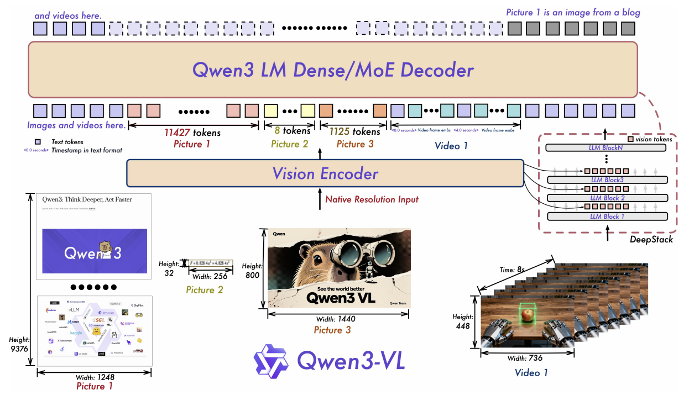
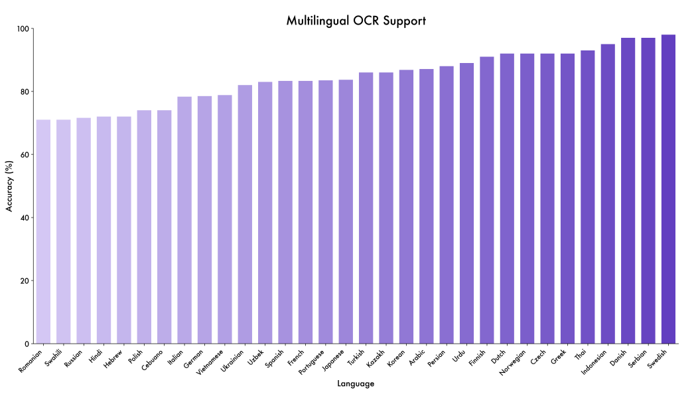
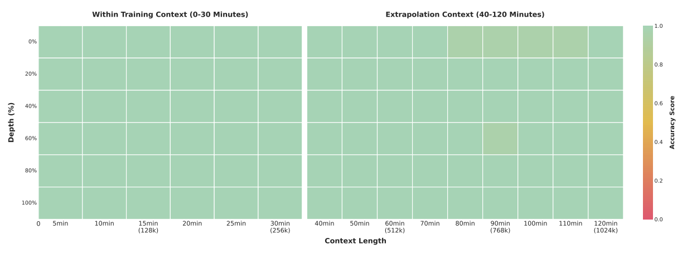

# Qwen3-VL テクニカル・レポート

> 原題: Qwen3-VL Technical Report
> 著者: Qwen Team（Alibaba Group）
> 出典: arXiv:2511.21631v2（2025 年 11 月 27 日 v2、2025 年 12 月 1 日報告）
> リンク: https://chat.qwen.ai / https://huggingface.co/Qwen / https://modelscope.cn/organization/qwen / https://github.com/QwenLM/Qwen3-VL

## Abstract（要旨）

我々は Qwen3-VL を紹介する。これは Qwen シリーズにおける現時点で最も高性能な視覚言語モデルであり、幅広いマルチモーダル・ベンチマークで優れた性能を達成する。**最大 256K トークン**の交互配置文脈をネイティブにサポートし、テキスト、画像、動画をシームレスに統合する。モデル・ファミリーは **dense（2B/4B/8B/32B）**と **mixture-of-experts（30B-A3B/235B-A22B）**両方のバリアントを含み、多様な遅延-品質のトレードオフに対応する。Qwen3-VL は 3 つの中核的支柱を提供する：(i) **顕著に強力な純粋テキスト理解**、いくつかのケースでは比較可能なテキスト専用バックボーンを凌駕する。(ii) **256K トークン窓のネイティブ・サポートによる堅牢な長文脈理解**で、テキストと交互配置マルチモーダル入力の双方に対応し、長文書と動画にわたる忠実な保持・検索・相互参照を可能にする。(iii) **単一画像、複数画像、動画タスクにわたる先進的マルチモーダル推論**で、MMMU や視覚数学ベンチマーク（例: MathVista、MathVision）のような包括的評価で主導的性能を示す。構造的には、3 つの主要なアップグレードを導入する：(i) **画像と動画にわたるより強力な時空間モデリングのための強化された interleaved-MRoPE**、(ii) **DeepStack 統合**、多層 ViT 特徴を効果的に活用して視覚言語整合を密にする、(iii) **動画のためのテキスト・ベースの時間整合**、T-RoPE から明示的テキスト・タイムスタンプ整合へと進化し、より精密な時間グラウンディングを実現する。テキスト専用とマルチモーダル学習目的のバランスをとるため、**平方根再重み付け**を適用し、テキスト能力を損なうことなくマルチモーダル性能を高める。事前学習を **256K トークン**の文脈長まで拡張し、事後学習を **non-thinking と thinking の 2 バリアント**に分岐して別個の応用要件に対応する。さらに、事後学習フェーズに追加計算資源を割り当ててモデル性能をさらに強化する。比較可能なトークン予算と遅延制約下で、Qwen3-VL は dense および Mixture-of-Experts（MoE）構造の双方で優れた性能を達成する。我々は Qwen3-VL を、画像をベースとした推論、エージェント的意思決定、現実世界ワークフローにおけるマルチモーダル・コード知能のための基盤エンジンとして想定する。

## 1. Introduction（はじめに）

視覚言語モデル（VLMs）は近年実質的な進歩を遂げ、基礎的視覚知覚から画像と動画にわたる先進的マルチモーダル推論へと進化してきた。VLM の急速な進歩は、長文脈理解、STEM 推論、GUI 理解と相互作用、エージェント的ワークフローなど、急速に拡大する下流応用の景観を生み出してきた。決定的なことに、これらの進歩は基盤となる大規模言語モデル（LLM）の言語的習熟を損なってはならない；マルチモーダル・モデルはテキスト専用版に言語ベンチマークで匹敵または凌駕することが期待される。

本報告では、Qwen3-VL と、一般目的と高度応用の双方におけるその進歩を提示する。Qwen3 シリーズに基づき、**4 つの dense モデル（2B/4B/8B/32B）と 2 つの mixture-of-experts（MoE）モデル（30B-A3B / 235B-A22B）**を実装し、それぞれが **最大 256K トークンの文脈窓**で学習され、長文脈理解を可能にする。学習コーパスと学習戦略の最適化により、視覚言語（VL）学習中も基盤となる LLM の言語的習熟を保持し、それにより全体的能力を実質的に改善する。我々は **non-thinking と thinking 両バリアント**をリリースする；後者は複雑な推論タスクで優れた性能を達成する、著しく強力なマルチモーダル推論能力を実証する。

我々はまず **3 つの構成要素にまたがる構造的改善**を導入する：

1. **強化された位置エンコーディング**: Qwen2.5-VL では、テキストと視覚の統一位置エンコーディング方式として MRoPE を用いた。埋め込み次元を時間（t）、水平（h）、垂直（w）の群に塊状に分割すると、不均衡な周波数スペクトルを誘発し、長動画理解を妨げることを観察した。したがって、t、h、w を埋め込み次元にわたって均一に分配する **interleaved MRoPE** を採用し、より忠実な位置表現を生成する。
2. **クロス層融合のための DeepStack**: 視覚言語整合を強化するため、先駆的な DeepStack 機構を組み込む。視覚エンコーダの異なる層からの視覚トークンが、軽量な残差接続を介して対応する LLM 層へ経路付けされ、追加文脈長を導入することなく多層融合を強化する。
3. **明示的動画タイムスタンプ**: Qwen2.5-VL で用いられた位置エンコーディングを介した絶対時間整合を、フレーム群を標識する明示的タイムスタンプ・トークンに置き換え、より単純でより直接的な時間表現を提供する。

加えて、最適化側では、サンプル単位損失からトークン単位の平方根正規化損失へと移行し、学習中のテキストとマルチモーダル・データの貢献をより良くバランスする。

より高性能で頑健な視覚言語基盤モデルを構築するため、品質、多様性、構造の点で学習データを刷新した。主要なアップグレードは、強化されたキャプション監督、3D / 空間推論を備えた拡張された omni-recognition と OCR カバレッジ、正規化されたグラウンディング、コード・長文書・時間的にグラウンディングされた動画のための新規コーパスを含む。さらに、知覚・推論・行動を橋渡しするため、思考の連鎖推論と高品質で多様な GUI エージェント対話データを注入した。これらの革新は、より強力なマルチモーダル理解、精密なグラウンディング、ツール拡張型知能を可能にする。

学習パイプラインは **2 段階：事前学習と事後学習**から成る。事前学習は **4 フェーズ**で進む：マージャ（視覚言語投影）層のみを更新し他のモデル部分を凍結する **warm-up 整合フェーズ**、続いて 8K、32K、256K の系列長で漸進的に大きな文脈窓を持つ全パラメータ学習。事後学習は **3 フェーズ**から成る：(i) 長 chain-of-thought データでの教師あり微調整、(ii) より強力な教師モデルからの知識蒸留、(iii) 強化学習。

上記の革新は、Qwen3-VL を堅牢な視覚言語基盤モデルとしてだけでなく、現実世界マルチモーダル知能のための柔軟なプラットフォームとしても装備する—多様な応用領域にわたる知覚、推論、行動をシームレスに統合する。続く節では、モデル構造、学習フレームワーク、テキスト・視覚・マルチモーダル推論ベンチマークでの一貫した競争力のある性能を実証する広範な評価を提示する。

## 2. Model Architecture（モデル構造）

Qwen2.5-VL に従い、Qwen3-VL は **3 モジュール構造**を採用する：視覚エンコーダ、MLP ベースの視覚言語マージャ、大規模言語モデル（LLM）。図 1 に詳細なモデル構造を示す。

**Large Language Model**: Qwen3-VL は **3 つの dense バリアント（Qwen3-VL-2B/4B/8B/32B）と 2 つの MoE バリアント（Qwen3-VL-30B-A3B、Qwen3-VL-235B-A22B）** でインスタンス化される、すべて **Qwen3 バックボーン**に基づく。フラッグシップ・モデル Qwen3-VL-235B-A22B は **総 235B パラメータ、トークンごとに 22B 活性化**を持つ。広範なマルチモーダル・タスクの集合で大半の VLM を凌駕し、言語ベンチマークの過半数でテキスト専用版を上回る。

**Vision Encoder**: 視覚エンコーダとして **SigLIP-2 構造**を利用し、公式の事前学習済みチェックポイントから初期化し、動的入力解像度で継続学習する。動的解像度を効果的に対応するため、**2D-RoPE** を採用し、CoMP の方法論に従って入力サイズに基づく絶対位置埋め込みを補間する。具体的には、**SigLIP2-SO-400M バリアント**をデフォルトとし、小規模 LLM（2B と 4B）には **SigLIP2-Large（300M）**を使用する。

**MLP-based Vision-Language Merger**: Qwen2.5-VL と同様に、視覚エンコーダからの 2×2 視覚特徴を単一の視覚トークンに圧縮する 2 層 MLP を用い、LLM の隠れ次元と整合させる。さらに、**DeepStack 機構をサポートするための専用マージャ**を展開する、詳細は §2.2 で完全に記述する。

<figure>

<figcaption>図1: Qwen3-VL のフレームワークは視覚エンコーダと言語モデル・デコーダを統合し、テキスト・画像・動画を含むマルチモーダル入力を処理する。視覚エンコーダは動的でネイティブ解像度の視覚入力を扱うよう特別に設計され、それらを可変長の視覚トークンへとマッピングする。知覚能力を高め、豊かな視覚情報を保持するため、先駆的な DeepStack 機構を組み込み、視覚エンコーダの複数層からの視覚トークンを LLM の対応する層へ注入する。さらに、均衡した周波数スペクトルでマルチモーダル入力の位置情報を符号化するため Interleaved MRoPE を採用し、動画系列の時間構造をより効果的に捕捉するためテキスト・ベースのタイムスタンプ・トークンを導入する。</figcaption>
</figure>

### 2.1 Interleaved MRoPE

Qwen2-VL は MRoPE を導入し、マルチモーダル入力の位置情報をモデル化した。元の定式化では、埋め込み次元は時間（t）、水平（h）、垂直（w）の部分空間に分割され、それぞれに区別された回転周波数が割り当てられた。これは **不均衡な周波数スペクトル**をもたらし、後続研究はそれが長動画理解ベンチマークで性能を劣化させることを示した。これに対処するため、**埋め込み次元にわたって t、h、w 成分を交互配置**することで周波数割り当てを再設計した。これは、各時空間軸が低周波帯と高周波帯の双方にわたって均一に表現されることを保証する。結果として得られる均衡スペクトルは、元のスペクトル偏向を軽減し、動画の長距離位置モデリングを著しく改善する。

### 2.2 DeepStack

我々は DeepStack に着想を得て、視覚トークンを LLM の複数層に注入する。元の DeepStack アプローチがマルチスケール視覚入力からトークンを積み重ねるのとは異なり、我々は DeepStack を **Vision Transformer（ViT）の中間層から視覚トークンを抽出**するよう拡張する。この設計は、低レベルから高レベル表現に至る豊かな視覚情報を保持する。

具体的には、図 1 に示すように、視覚エンコーダの **3 つの異なる段階から特徴を選択**する。続いて、専用の視覚言語マージャ・モジュールがこれら多層特徴を視覚トークンに投影し、それらは **最初の 3 つの LLM 層の対応する隠れ状態に直接追加**される。

### 2.3 Video Timestamp（動画タイムスタンプ）

Qwen2.5-VL では、モデルに時間認識を授けるため MRoPE の時間同期バリアントを採用した。しかし、このアプローチに 2 つの主要な限界を特定した：(1) 時間位置 ID を絶対時間に直接結びつけることで、長動画に対して **過度に大きく疎な時間位置 ID** を生成し、長時間文脈理解能力を劣化させる。(2) この方式での効果的学習は、様々なフレームレート（fps）にわたる **広範で均一に分布したサンプリング**を要求し、学習データ構築のコストを著しく増加させる。

これらの問題に対処するため、**テキスト・トークン・ベースの時間エンコーディング戦略**を採用する。これは、各動画時間パッチの前に、フォーマットされたテキスト文字列（例: `<3.0 seconds>`）として表現されたタイムスタンプを付加する。さらに学習中、モデルが多様なタイムコード表現を解釈することを学ぶよう、**秒形式と HMS（時:分:秒）形式の双方**でタイムスタンプを生成する。このアプローチは文脈長のわずかな増加を招くが、モデルが時間情報をより効果的かつ精密に知覚することを可能にし、それにより動画グラウンディングや密キャプション付けのような時間認識動画タスクを促進する。

## 3. Pre-Training（事前学習）

### 3.1 Training Recipe（学習レシピ）

我々はまず、事前学習済み **SigLIP-2 モデル**に基づく動的解像度での継続学習を行うことで、視覚エンコーダを強化する。全体的な Qwen3-VL モデルは 3 モジュール構造を採用する：この視覚エンコーダ、MLP ベースの視覚言語マージャ、Qwen3 大規模言語モデル（LLM）バックボーン。この構造に基づき、事前学習方法論は **4 つの区別された段階**に体系的に構造化され、基礎的整合から長文脈理解まで能力を段階的に構築するよう設計されている。これらの段階の概要を表 1 に示す。

**表1**: Qwen3-VL の異なる段階にわたる学習セットアップとハイパーパラメータ。

| Stage | Objective | Training | Token Budget | Sequence Length |
| --- | --- | --- | --- | --- |
| **S0** | Vision-Language Alignment | Merger | 67B | 8,192 |
| **S1** | Multimodal Pre-Training | All | ~1T | 8,192 |
| **S2** | Long-Context Pre-Training | All | ~1T | 32,768 |
| **S3** | Ultra-Long-Context Adaptation | All | 100B | 262,144 |

**Stage 0: Vision-Language Alignment**: 初期段階（S0）は、視覚エンコーダと LLM の間のモダリティ・ギャップを効率的に橋渡しすることに焦点を当てる。決定的に、本フェーズでは **MLP マージャのパラメータのみが学習され**、視覚エンコーダと LLM バックボーンの双方は凍結されたままである。**約 67B トークン**から成る、高品質な画像-キャプション対、視覚知識コレクション、光学文字認識（OCR）データから構成される整備されたデータセットを利用する。全学習は系列長 8,192 で行われる。この整合優先アプローチは、全パラメータ学習に進む前にクロスモーダル理解の堅実な基盤を確立する。

**Stage 1: Multimodal Pre-Training**: 初期整合に続き、Stage 1（S1）は **全パラメータ・マルチモーダル事前学習**へと移行する。本フェーズでは、すべてのモデル構成要素—視覚エンコーダ、マージャ、LLM—の凍結を解除し、エンドツーエンド学習を行う。モデルは **約 1 兆（1T）トークン**の大規模で多様なデータセットで学習される。LLM の強力な言語能力を維持するため、データ混合は視覚言語（VL）データとテキスト専用データから構成される。VL 部分は豊かで多様であり、交互配置画像-テキスト文書、視覚グラウンディング・タスク、視覚質問応答（VQA）、STEM 領域からのデータ、時間理解を導入するための少量の動画データを追加する。系列長は 8,192 のままである。

**Stage 2: Long-Context Pre-Training**: Stage 2（S2）はモデルの文脈処理能力を著しく拡張することを目指す。本段階の主要な変化は **系列長を 32,768 へ 4 倍化**することで、すべてのモデル・パラメータは学習可能のまま続く。学習は約 **1T トークン**のデータセットで行われ、長文脈タスクをサポートするよう調整されたデータ混合を伴う。テキスト専用データの比率は長文形式テキスト理解を強化するため増加され、残りの VL データは動画とエージェント指向の命令追従データの著しく大きな量を組み込む。本段階は、モデルがより長い動画と複雑な多段階タスクにわたって処理・推論できるよう可能にすることに決定的である。

**Stage 3: Ultra-Long-Context Adaptation**: 最終段階（S3）は、モデルの文脈窓を運用限界まで押し上げるよう設計された専門フェーズである。ここで、**系列長を 262,144 へと劇的に増加**させる。モデルは本目的のため特別に整備された、より集中的な **100B トークン**のデータセットで学習される。データもまたテキスト専用データと VL データから構成され、**長動画と長文書理解タスクへの強い強調**を伴う。この最終適応は、Qwen3-VL の極めて長い逐次入力の処理・分析における習熟を強固にし、包括的文書解析と長尺動画要約のような応用に主要な能力である。

### 3.2 Pre-Training Data（事前学習データ）

#### 3.2.1 Image Caption and Interleaved Text-Image Data（画像キャプションと交互配置テキスト-画像データ）

一般目的の視覚言語理解のための堅牢な基盤モデルを構築するため、2 つの中核データ・モダリティを著しく拡大・洗練した：**画像-キャプション対と交互配置テキスト-画像系列**。我々の戦略は、目的構築されたモデルと厳密なフィルタリング・パイプラインに支えられた、高品質で多様、意味的に豊かなマルチモーダル・グラウンディングを強調する。

**Image Caption Data**: Web ソースからの現代的で主に中英バイリンガル画像-テキスト対の大規模コーパスを整備し、再キャプション付け用に微調整された専門 **Qwen2.5-VL-32B モデル**を中心とした **多段階洗練パイプライン**を適用する。このモデルは、各画像に関連付けられた元の生テキストを活用し、視覚要素のより包括的で流暢、細粒度の記述（例: 物体属性、空間レイアウト、文脈意味論）を生成し、同時にテキスト構成要素の言語的品質と情報量を改善する。

重複除去は再キャプション付けされたテキストでのみ意味類似度指標を用いて行われ、視覚多様性を犠牲にすることなく冗長サンプルを除去する。十分に表現されていない概念のカバレッジをさらに高めるため、視覚埋め込みでクラスタリングを適用し、データ分布のスパース領域を特定し、ターゲット拡張を行う。結果は、規模・多様性・記述的粒度のバランスをとる高忠実度キャプション・データセットである。

**Interleaved Text-Image Data**: 最近の中英 Web サイトからソースされた多様な現実世界マルチモーダル文書を収集する。全文書は、細粒度ドメイン識別のために微調整された軽量 Qwen ベース・スコアラを用いてドメイン分類を経る。ドメインにわたる検証実験に基づき、広告、宣伝コンテンツ、クリックベイトのような有害または低価値カテゴリを体系的に除外する—同じ効率的スコアラを用いて望ましくないサンプルをフィルタアウトする。

書籍規模の交互配置データについては、微調整された **Qwen2.5-VL-7B モデル**を用いて高精度マルチモーダル解析を行い、テキストを埋め込まれた図、図解、写真と精密に抽出・整合する。超長文脈モデリングを可能にするため、連続するページを最大 **256K トークン**の系列へとマージし、自然なページ順序とマルチモーダル一貫性を保持する専門サブセットを構築する。前処理中、厳格な品質管理を強制する：(i) 純テキストまたは低整合セグメントが除去される；(ii) 超長書籍系列については、文脈全体を通じて意味のある視覚-テキスト相互作用を確保するため、最小ページ数と最小画像対テキスト比を要求する。これは、グラウンディングされた理解と長距離マルチモーダル推論の双方に最適化された、クリーンで多様、レイアウトを意識した交互配置コーパスを生み出す。

#### 3.2.2 Knowledge（知識）

世界知識は、マルチモーダル大規模言語モデル（MLLM）が多様な下流タスクにわたる堅牢な視覚理解、グラウンディングされた推論、エンティティを意識した生成を達成するために不可欠である。Qwen3-VL に現実世界と架空概念の双方の包括的把握を装備するため、**動物、植物、ランドマーク、食物、車両・電化製品・衣類のような日用品など、十数以上の意味カテゴリにまたがる、明確に定義されたエンティティ**を中心とした大規模事前学習データセットを構築した。

現実世界エンティティはロングテール分布に従う：著名な概念は高品質注釈で頻繁に現れる一方、大半は希少である。この不均衡に対処するため、**重要度ベースのサンプリング戦略**を採用する。高重要度エンティティはより重くサンプリングされ、十分な学習信号を確保する一方、低重要度エンティティは学習プロセスを圧倒することなく広いカバレッジを維持するため、より小さい割合で含まれる。このアプローチは、データ品質、有用性、多様性を効果的にバランスする。

保持されたすべてのサンプルは多段階洗練パイプラインを経る。ノイズと不整合の標準フィルタリングに加え、元のまたはスパースなキャプション—例: 汎用 alt-text—をより豊かな LLM 生成記述に置き換える。これら強化されたキャプションは主要エンティティを識別するだけでなく、その視覚属性、周囲文脈、空間レイアウト、他の物体や人々との相互作用も記述し、それによりより完全でグラウンディングされたテキスト表現を提供する。

総じて、これらの努力は、現実世界シナリオで視覚概念を認識・推論・正確に記述する Qwen3-VL の能力を著しく強化する、**知識豊富で文脈を意識し、識別に焦点を当てた学習信号**を生み出す。

#### 3.2.3 OCR, Document Parsing and Long Document Understanding

**OCR**: 現実世界画像での OCR 性能を高めるため、**3000 万の社内収集サンプル**のデータセットを **coarse-to-fine パイプライン**で整備する。このパイプラインは、OCR 専門モデルからの疑似ラベルと Qwen2.5-VL からの洗練を統合することで OCR 注釈を洗練する—人間注釈なしで。Qwen2.5-VL がサポートする 10 言語（中英を含む）を超えて拡張し、**追加 29 言語**を組み込み、**約 3000 万の高品質多言語 OCR サンプル**を合成し、**100 万以上の社内現実世界多言語画像**を整備する。

**Document Parsing**: 文書解析については、Common Crawl から **300 万 PDF**（10 文書タイプにわたって均等分布、各 30 万サンプル）と **400 万の社内文書**を収集する。社内レイアウト・モデルがまずテキストおよび非テキスト領域の読み順序とバウンディング・ボックスを予測し、Qwen2.5-VL-72B が領域固有認識を行う。出力は **位置を意識した、レイアウトに整合した解析データ**へと再構成される。

異種フォーマットにわたる堅牢な解析を確保するため、**2 つの表現をサポートする統一注釈フレームワーク**を設計する：

- **QwenVL-HTML**: 細粒度、要素レベル・バウンディング・ボックスを含む；
- **QwenVL-Markdown**: 画像と表のみが位置特定され、表は **LaTeX で符号化**される。

精密な注釈を伴う大規模合成 HTML コーパスを構築し、それを体系的に Markdown 形式へ変換する。モデル汎化をさらに改善するため、現実文書の広範なコレクションで疑似ラベルを生成し、それらを品質でフィルタする。最終学習集合は合成データと高品質疑似ラベル付きデータを組み合わせて、スケーラビリティと頑健性の双方を強化する。

**Long Document Understanding**: 多ページ PDF—しばしば数十ページに及ぶ—の理解能力を高めるため、大規模な長文書データ・コーパスを活用する。まず、単一ページ文書サンプルをマージすることで **長文書解析系列**を合成する。各系列で、複数のページ画像が先頭に配置され、続いて OCR または HTML 解析から派生した対応するテキストが続く。次に、**長文書視覚質問応答（VQA）データ**を構築する。具体的には、高品質な多ページ PDF をサンプリングし、複数ページと異種文書要素（チャート、表、図、本文など）にわたる推論を要する多様な VQA 例の集合を生成する。質問タイプの分布を慎重にバランスさせ、支持証拠が広範なモダリティとレイアウト構成要素から引かれることを保証し、それにより拡張された文脈にわたる堅牢でグラウンディングされた多段階推論を促進する。

#### 3.2.4 Grounding and Counting（グラウンディングとカウント）

視覚グラウンディングは、特定物体から任意の画像領域までの広範な視覚ターゲットを正確に識別、解釈、位置特定することを可能にする、マルチモーダル・モデルの基礎的能力である。Qwen3-VL では、グラウンディング習熟を体系的に強化し、**バウンディング・ボックスと点の 2 つのグラウンディング・モダリティ**をサポートする。これらの表現は、多様なシナリオと下流タスクにわたる画像内容の精密で柔軟な解釈を可能にする。さらに、モデルのカウント・サポート能力を拡張し、視覚エンティティについての量的推論を可能にする。以下、グラウンディングとカウントのためのデータ構築パイプラインを簡潔に記述する。

**Box-based Grounding**: COCO、Objects365、OpenImages、RefCOCO/+/g を含む広く使用されるオープンソース・データセットの集約から始める。データ多様性をさらに豊かにするため、広範なシナリオにわたる高品質な物体注釈を生成する自動化合成パイプラインを開発した。このパイプラインは **3 段階**で動作する：(i) 物体候補が Qwen2.5-VL を用いてラベルなし画像から抽出される；(ii) これら候補が **オープン語彙検出器**（具体的には Grounding DINO）と Qwen2.5-VL の両方を用いて位置特定・注釈される；(iii) 結果として得られる注釈は品質評価を経て、低信頼度または不正確なものが体系的にフィルタアウトされる。このアプローチを通じて、視覚的文脈と物体カテゴリの幅広い種類にまたがる、大規模で高度に多様なボックス・ベース・グラウンディング・データセットを構築した。

**Point-based Grounding**: 堅牢な点ベース・グラウンディングを確保するため、公開可能と合成生成のポインティング注釈を組み合わせた包括的データセットを整備した。3 つのソースを統合する：(i) **PixMo** からの公開ポインティング・カウント注釈；(ii) 公開物体検出とインスタンス・セグメンテーション・ベンチマークから派生した物体グラウンディング・データ；(iii) 細粒度画像詳細をターゲットとするよう設計された専用合成パイプラインによって生成された高精度ポインティング注釈。

**Counting**: グラウンディング・データを基盤として、カウント・データセットの基礎を成す高品質サブセットを整備した。これは **3 つの区別されたタスク定式化**を含む：直接カウント、ボックス・ベース・カウント、点ベース・カウント。総じてこれら 3 つのタスク・タイプは包括的カウント・データセットを構成する。

Qwen2.5-VL とは異なり、本バージョンでは **[0, 1000] の範囲にスケールされた正規化座標系**を採用する。この設計は、多様な入力にわたる画像解像度とアスペクト比の変動への頑健性を改善し、後処理を単純化し、下流応用における予測座標の有用性を高める。

#### 3.2.5 Spatial Understanding and 3D Recognition（空間理解と 3D 認識）

物理世界との洗練された相互作用を促進するため、Qwen3-VL は **空間文脈の深い理解**で設計されている。これによりモデルは空間関係を解釈し、物体アフォーダンスを推論し、行動計画と embodied 推論を行うことができる。単一の単眼画像から物体の 3D 空間位置を推定することもできる。これら能力をサポートするため、空間理解と 3D グラウンディングに焦点を当てた 2 つの包括的データセットを作成した。

**Spatial Understanding**: 物体の位置特定を超えて、Qwen3-VL は **2D シーンにおける空間関係、物体アフォーダンス、実行可能行動**について推論するよう学習される—embodied AI と対話型応用に不可欠な能力。この目的のため、標準グラウンディングを超える専門データセットを構築する：(i) **関係注釈**（例:「ラップトップの左にあるカップ」）、(ii) **アフォーダンス・ラベル**（例:「graspable」、「pressable」、「sittable」）、(iii) 計画を要する **行動条件付きクエリ**（例:「モニターの後ろの本に到達するために最初に何を動かすべきか？」）。これらサンプルは整備された現実世界シーンと合成生成レイアウトの双方から派生し、テンプレート化と LLM ベース手法を介して自動生成された自然言語クエリで多様性と複雑性を確保する。決定的に、**すべての空間参照は絶対座標ではなく、他の物体やシーン・フレームに対して相対的に表現**され、堅牢な関係推論を促進する。この学習は Qwen3-VL が「どこに」だけでなく「どのように」「何ができるか」の質問に答えられるよう可能にする—仮想環境とのエージェント的相互作用の基礎を形成する。

**3D Grounding**: 画像から物理世界を理解するモデルの能力をさらに高めるため、3D 視覚グラウンディングのための専門事前学習データセットを構築した。多様な屋内外シーンの公開コレクションからデータを調達し、視覚質問応答形式へと再定式化した。各サンプルは以下から成る：1) 単一視点カメラ画像、2) 対応する自然言語参照表現、3) 物体の空間位置と意味ラベルを指定する、構造化 JSON 形式での対応する **9-DoF 3D バウンディング・ボックス注釈**。3D バウンディング・ボックスは複数のセンサとデータソースから派生するため、それらは変動するカメラ内部パラメータと内在ノイズを示す。この目的のため、重く遮蔽された不正確なラベルをフィルタアウトし、**Omni3D に従ってすべてのデータを仮想カメラ座標系に統一**する。3D グラウンディング用の豊かなテキスト・クエリを作成するため、記述的キャプションの大規模コーパスも合成した。これらの記述は物体カテゴリの命名を超えて、詳細な属性、レイアウト配置、空間位置、視覚アフォーダンス、周囲物体との相互作用を含み—より細粒度でグラウンディングされた参照表現を生み出す。

#### 3.2.6 Code（コード）

Qwen3-VL シリーズに **2 カテゴリのコード関連データ**を学習コーパスに組み込むことで、専用コーディング能力を強化し、テキスト専用と視覚的にグラウンディングされた文脈の双方で、モデルがプログラムを読み書き・推論できるようにする。

**Text-Only Coding**: Qwen3 と Qwen3-Coder シリーズの広範なコード・コーパスを再利用する。この大規模データセットは、ソフトウェア開発、アルゴリズム問題解決、数学的推論、エージェント的タスクを含む、広範なプログラミング言語とドメインにわたり、コード構文、アルゴリズム的論理、汎用プログラム生成のモデルの基礎的理解を確立する。

**Multimodal Coding**: 視覚理解とコード生成の両方を要するタスクに対処するため、多様なマルチモーダル・コーディング・タスクのデータを整備する。オープンソース・データセットと内部合成パイプラインの双方からソースされたこのデータセットは、視覚入力を共同理解し機能的コードを生成することをモデルに教える。データはいくつかの主要タスクをカバーする：UI スクリーンショットを応答性のある HTML/CSS へ変換；画像から編集可能な SVG コードを生成；視覚プログラミング課題を解決；マルチモーダル・コーディング質問に回答（例: 画像付き StackOverflow 投稿）；視覚表現（フローチャート、図解、LaTeX 方程式など）をそれぞれのコードまたはマークアップへ転写。この新規データ混合は、Qwen3-VL が **視覚知覚と実行可能論理の間の橋渡し**として作用することを可能にする。

#### 3.2.7 Video（動画）

Qwen3-VL の動画理解能力は実質的に進歩し、フレーム間時間動態の堅牢なモデリング、空間関係の細粒度知覚、超長動画系列の首尾一貫した要約を可能にする。この強化は、**2 つの主要革新を特徴とするデータ処理パイプライン**に支えられる：

**Temporal-Aware Video Understanding**: (i) **Dense Caption Synthesis**: 長動画系列について、短から長へのキャプション合成戦略を採用し、全体的、タイムスタンプ交互配置、時間的に首尾一貫した物語レベル記述を生成する。社内キャプション付けモデルを活用し、イベントレベル時間要約とセグメント固有視覚詳細を共同で捕捉する **細粒度注釈**をさらに生成する。(ii) **Spatio-Temporal Video Grounding**: 物体、行動、人物のレベルで注釈された大規模動画データを整備・合成し、モデルの時空間グラウンディング能力を強化することで、細粒度動画理解の容量を改善する。

**Video Data Balancing and Sampling**: (i) **Source Balancing**: データ・バランスと多様性を確保するため、教育用動画、シネマ映画、自己中心的記録などを含む多様な動画ソースを包含する大規模データセットを集約する。データセット・バランスは、動画タイトル、長さ、カテゴリ・ラベルなどのメタデータに導かれた体系的整備を通じて達成される。(ii) **Length-Adaptive Sampling**: 事前学習段階中、フレームレート（fps）や最大フレーム数のようなサンプリング・パラメータを、異なる系列長制約に応じて動的に調整する。この適応戦略は、最適でないサンプリング実践（例: 過度に疎なフレーム選択や過度に低い空間解像度）に関連する情報損失を軽減し、視覚詳細を保持し学習有効性を最適化する。

#### 3.2.8 Science, Technology, Engineering, and Mathematics (STEM)

マルチモーダル推論は Qwen3-VL の中核にあり、**STEM 推論がその最も本質的部分を構成**する。我々の哲学は分割統治戦略に従う：まず細粒度視覚知覚と堅牢な言語推論能力を独立に発達させ、次にそれらを相乗的に統合して効果的なマルチモーダル推論を達成する。

**Visual Perception Data**: プログラマティック（コードベース）レンダリングを通じて幾何学図を構築する専用合成データ生成パイプラインを開発する。このパイプラインを用いて以下を生成する：(i) 交点、角、重心など **100 万の点グラウンディング・サンプル**；(ii) 図解の細粒度視覚理解をターゲットとする **200 万の知覚指向視覚質問応答対**。高忠実度テキスト記述を得るため、**2 段階キャプション付けフレームワーク**もさらに実装する：初期生成フェーズと、それに続く厳密なモデル・ベース検証。両段階は精度と記述粒度を確保するため専門モデルのアンサンブルを採用する。このプロセスは、多様な STEM 分野にまたがる **600 万の豊かに注釈された図解キャプション**の包括的データセットを生み出す。

**Multi-modal Reasoning Data**: マルチモーダル推論データの大半は、厳密な浄化・再定式化パイプラインを通じて緻密に整備された、**6000 万を超える K-12 と学部レベル演習**から成る。品質フィルタリング中、破損画像、無関係内容、不完全または不正確な回答を含む低品質項目を破棄する。再定式化段階中、中英の演習を翻訳し、回答形式—段階別解答リスト、数式、記号表記など—を標準化して、一貫性と統一表現を確保する。長 CoT 問題解決データに関しては、画像とペアになった **1200 万を超えるマルチモーダル推論サンプル**を合成する。推論プロセスの連続性と豊かさを確保するため、強力な推論モデルによって生成された元のロールアウトを利用する。データの信頼性と適用可能性を保証するため、各サンプルの推論軌跡は厳密な検証—ルール・ベース・チェックとモデル・ベース検証の組み合わせ—を経る—曖昧な回答やコード切り替えを含むインスタンスは明示的にフィルタアウトされる。さらに、推論品質を高めるため、棄却サンプリングを介して挑戦的問題のみを保持する。

**Linguistic Reasoning Data**: マルチモーダル推論データに加え、マルチモーダル推論能力は主に言語的推論能力から派生するため、**Qwen3 からの推論データも組み込む**。

#### 3.2.9 Agent（エージェント）

**GUI**: グラフィカル・ユーザ・インターフェース（GUI）との自律的相互作用のためのエージェント的能力を Qwen3-VL に授けるため、デスクトップ、モバイル、Web 環境にまたがる **大規模クロス・プラットフォーム・データ**を整備・合成する。GUI インターフェース知覚については、メタデータ、解析ツール、人間注釈を活用して、要素記述、密キャプション付け、密グラウンディングなどのタスクを構築し、多様なユーザ・インターフェースの堅牢な理解を可能にする。エージェント的能力については、自己進化型軌跡生成フレームワークを介して多段階タスク軌跡を集約し、ターゲットを絞った人間監査で補完する；現実世界実行中の計画、意思決定、反省的自己修正を強化するため、Chain-of-Thought 根拠も慎重に設計・拡張する。

**Function Calling**: マルチモーダル文脈での一般的関数呼び出し能力については、**マルチモーダル関数呼び出し軌跡合成パイプライン**を構築する。我々はまず、画像を持つ能力のあるモデルに、ユーザ・クエリとその対応する関数定義を生成するよう指示する。次に、根拠とともにモデル関数呼び出しをサンプリングし、関数応答を合成する。このプロセスは、ユーザのクエリが解決されたと判断されるまで繰り返される。各ステップの間、軌跡はフォーマット・エラーのためフィルタアウトされ得る。このパイプラインは、実行可能関数を実装する必要なしに、膨大な画像から **大規模マルチモーダル関数呼び出し軌跡**を構築することを可能にする。

**Search**: 一般的関数呼び出し能力の中で、検索を行う能力は、現実世界シナリオにおけるロングテール・エンティティの知識統合を促進する鍵と見なす。この場合、オンライン画像検索とテキスト検索ツールでマルチモーダル事実検索軌跡を収集し、未知エンティティのため検索を行うようモデルを促す。そうすることで、モデルは Web から情報を集めてより正確な応答を生成することを学ぶ。

## 4. Post-Training（事後学習）

### 4.1 Training Recipe（学習レシピ）

我々の事後学習パイプラインは、命令追従能力を洗練し、推論能力を強化し、人間選好と整合するよう設計された **3 段階プロセス**である。各段階の具体的データと方法は後続節で詳述される。

**Supervised Fine-Tuning (SFT)**: 第 1 段階は命令追従能力を授け、潜在的推論技能を活性化する。これは **2 フェーズ**で行われる：**32k 文脈長**での初期フェーズ、それに続く長文書と長動画データに焦点を当てる **256k 文脈窓**への拡張。異なるニーズに対応するため、**non-thinking モデル用の標準フォーマットと thinking モデル用の Chain-of-Thought（CoT）フォーマット**へと学習データを分岐する、後者は推論プロセスを明示的にモデル化する。

**Strong-to-Weak Distillation**: 第 2 段階は **知識蒸留**を採用し、強力な教師モデルがその能力を生徒モデルへ転送する。決定的に、**テキスト専用データを用いてこの蒸留を行い** LLM バックボーンを微調整する。この方法は非常に効果的であり、テキスト中心とマルチモーダル・タスクの双方にわたって推論能力に著しい改善をもたらすことが証明されている。

**Reinforcement Learning (RL)**: 最終段階は **RL を活用してモデル性能と整合をさらに強化**する。本フェーズは **Reasoning RL と General RL** に分割される。数学、OCR、グラウンディング、命令追従を含むがそれに限られない、テキストとマルチモーダル領域の包括的集合にわたって大規模強化学習を適用し、より細粒度の能力を改善する。

### 4.2 Cold Start Data（コールド・スタート・データ）

#### 4.2.1 SFT Data

我々の主要目標は、広範な現実世界シナリオに対処する能力をモデルに授けることである。Qwen2.5-VL の基礎的能力—約 8 つの中核ドメインと 30 の細粒度サブカテゴリで習熟—を基盤として、コミュニティ・フィードバック、学術文献、実用応用からの洞察を統合することで機能範囲を戦略的に拡張した。これらは、embodied 知能のための空間推論、細粒度視覚理解のための画像-グラウンディング推論、堅牢な物体追跡のための動画における時空間グラウンディング、数百ページに及ぶ長文脈技術文書の理解を含む。

このデータセットは **約 1,200,000 サンプル**から成り、堅牢なマルチモーダル能力を育てるよう戦略的に構成される。このコレクションは単一モーダルとマルチモーダル・データに分割され、**1/3 がテキスト専用エントリ**、残り **2/3 が画像-テキストと動画-テキスト対**から成る。マルチモーダル・コンテンツの統合は、複雑な現実世界シナリオを解釈できるモデルを可能にするよう特別に設計されている。グローバルな関連性を確保するため、データセットは主要な中英を超えて多様な多言語サンプルを含み、それにより言語的カバレッジを広げる。さらに、単一画像入力から多画像系列まで、様々な視覚設定内で文脈化された単一ターンと多ターン対話を組み込むことで、現実的な会話動態をシミュレートする。決定的に、データセットは **ツール拡張型画像検索や視覚的にグラウンディングされた推論**などの先進的エージェント的行動をサポートするよう設計された交互配置画像-テキスト例も特徴とする。

Qwen3-VL の **256K トークン文脈長**のネイティブ・サポートを踏まえ、計算効率を最適化するため段階的学習戦略を採用する。この戦略は **2 フェーズ**から成る：**32K トークン系列長**での初期 1 エポック学習フェーズ、続いて **256K トークン**全長での第 2 エポック。

データの品質はマルチモーダル・モデルの性能の決定的決定要因である。オープンソースと合成起源由来のデータセットはしばしばノイズ、冗長、低品質サンプルを含む実質的変動性に悩まされる。これらの不備を軽減するため、厳密なデータ・フィルタリング・プロトコルの実装が不可欠である。したがって、データ整備プロセスは **2 フェーズのフィルタリング・パイプライン：クエリ・フィルタリングと応答フィルタリング**を組み込む。

**Query Filtering**: この初期フェーズでは、Qwen2.5-VL を活用して容易に検証できないクエリを識別・破棄する。曖昧な命令を持つクエリは、元の意味意図を保持しつつ明瞭性を高めるため最小限に改訂される。

**Response Filtering**: このフェーズは 2 つの相補的戦略を統合する：

- **Rule-Based Filtering**: 反復、不完全性、不適切な形式など、質的不備を示す応答を除去するため事前定義されたヒューリスティクスを適用する。
- **Model-Based Filtering**: Qwen2.5-VL シリーズから派生した報酬モデルを用いてデータセットをさらに洗練する。これらモデルはマルチモーダル質問-応答対の多次元評価を行い、不適切な言語混合や急激な様式シフトのような、ルール・ベース手法を通常逃れる微妙な問題の検出を可能にする。

#### 4.2.2 Long-CoT Cold Start Data

我々の thinking モデルの基盤は、複雑な推論能力を引き出し洗練するよう設計された、緻密に整備された **Long Chain-of-Thought（CoT）コールド・スタート・データセット**である。このデータセットは、視覚言語とテキスト専用サンプルの間の **約 1:1 比率を維持**する、純粋テキストとマルチモーダル・データの双方にまたがる多様なクエリ・コレクションに基づいて構築される。

マルチモーダル成分は、視覚質問応答（VQA）、光学文字認識（OCR）、2D/3D グラウンディング、動画解析などの既存ドメインをカバーしつつ、**STEM とエージェント的ワークフローに関連するタスクの豊富化に特別な強調**を置く。この戦略的焦点は、洗練された多段階推論を要する問題でモデルの性能を押し上げるよう設計されている。純粋テキスト部分は Qwen3 で用いられたデータを密接に反映し、数学、コード生成、論理推論、一般 STEM の挑戦的問題を特徴とする。

高品質と適切な難易度レベルを保証するため、**厳密な多段階フィルタリング・プロトコル**を実装する：

- **Difficulty Curation**: ベースライン・モデルが低合格率を示したか、より長く詳細な応答を生成したインスタンスを選択的に保持する。これは現在のモデルにとって真に挑戦的な問題でデータセットを豊かにする。
- **Multimodal Necessity Filtering**: 視覚言語数学問題については、決定的フィルタリング・ステップを導入する：Qwen3-30B-*nothink* モデルが視覚入力へのアクセスなしに正しく解ける任意のサンプルを破棄する。これは残るインスタンスが真にマルチモーダル理解を必要とし、テキスト合図のみでは解けないことを保証する。
- **Response Quality Control**: Qwen3 の方法論と整合し、生成された応答を浄化する。複数候補回答を持つクエリについては、まず不正確な最終結果を含むものを除去する。続いて、過度の反復、不適切な言語混合、十分な推論ステップなしに推測の明確な兆候を示した回答など、望ましくないパターンを示す応答をフィルタアウトする。

この厳格な整備プロセスは、先進的マルチモーダル推論をブートストラップするよう調整された、高品質で挑戦的なデータセットを生み出す。

### 4.3 Strong-to-Weak Distillation（強→弱蒸留）

軽量モデルの性能をさらに改善するため、Qwen3 で記述されたように **Strong-to-Weak Distillation パイプライン**を採用する。この蒸留プロセスは **2 つの主要フェーズ**から成る：

- **Off-policy Distillation**: 第 1 フェーズでは、教師モデルが生成した出力が応答蒸留を提供するために組み合わされる。これは軽量生徒モデルが基礎的推論能力を獲得し、後続の on-policy 学習のための強力な基盤を確立するのを助ける。
- **On-policy Distillation**: 第 2 フェーズでは、生徒モデルが提供されたプロンプトに基づいて応答を生成する。これらの on-policy 系列が生徒モデルの微調整に用いられる。**KL ダイバージェンスを最小化**することで、生徒と教師によって予測されるロジットを整合させる。

### 4.4 Reinforcement Learning（強化学習）

#### 4.4.1 Reasoning Reinforcement Learning

数学、コーディング、論理推論、視覚グラウンディング、視覚パズルを含む、テキストとマルチモーダル・タスクの多様な集合にわたってモデルを学習する。各タスクは、解答が **ルールまたはコード実行器を介して決定論的に検証可能**であるよう設計される。

**Data Preparation**: オープンソースとプロプライエタリ・ソースの双方から学習データを整備し、高品質 RL クエリを確保するため厳密な前処理と手動注釈を適用する。マルチモーダル・クエリについては、我々の最先進視覚言語モデル（Qwen3-VL-235B-A22B）の予備チェックポイントを用いてクエリごとに 16 応答をサンプリングし；すべての応答が不正確である任意のクエリは破棄される。次に改善のための限定的可能性を持つデータソースを識別・除去するためタスクごとに予備 RL 実験を実行する。このプロセスは **テキストとマルチモーダル・タスクの様々な範囲をカバーする約 30K の RL クエリ**を生み出す。各モデルの学習について、すべてのクエリに対して 16 応答をサンプリングし、合格率 90% を超える容易なクエリをフィルタアウトする。タスク固有データセットをシャッフル・結合して混合タスク・バッチを構築し、タスクごとの一貫した事前定義されたサンプル比率を保証する。比率は広範な予備実験を通じて決定される。

**Reward System**: 全タスクにわたって精密なフィードバックを提供する **統一報酬フレームワーク**を実装する。システムは共有インフラ—データ前処理、効用関数、複数報酬タイプを統合する報酬マネージャ—を提供し、コア報酬論理はタスクごとに実装される。タスク固有フォーマット・プロンプトを用いてモデル出力を要求形式へ誘導するため、明示的フォーマット報酬には依存しない。コード切り替えを軽減するため、応答言語がプロンプト言語と異なる場合にペナルティを適用する。

**RL Algorithm**: RL 学習のため **SAPO**（smooth and adaptive policy-gradient method、滑らかで適応的な政策勾配法）を採用する。SAPO は多様なテキストとマルチモーダル・タスクにわたって、また異なるモデル・サイズと構造にわたって、一貫した改善を提供する。

#### 4.4.2 General Reinforcement Learning

General Reinforcement Learning（RL）段階は、モデルの汎化能力と運用頑健性を強化するよう設計される。この目的のため、**マルチタスク RL パラダイム**を採用し、報酬関数は VQA、画像キャプション付け、OCR、文書解析、グラウンディング、時計認識を含む、SFT フェーズからの包括的タスク集合に基づいて定式化される。報酬機構は、モデル性能の **2 つの主要次元を最適化**するよう構造化される：

- **Instruction Following**: この次元は明示的なユーザ指令への遵守を評価する。コンテンツ、形式、長さ、構造化出力（例: JSON）に関する複雑な制約を扱う能力を評価し、生成される応答がユーザ要件と精密に一致することを保証する。
- **Preference Alignment**: オープンエンドまたは主観的クエリについては、この次元は有用性、事実精度、様式的適切性を最適化することで、モデルの出力を人間選好と整合させる。これはより自然で魅力的なユーザ相互作用を育てる。

さらに、本段階は SFT 中に染み込んだ強力だが欠陥のある知識事前分布を学習解除するための **是正機構**として作用する。我々は、反直感的物体カウントや複雑な時計時間認識のような、これら特定エラーを誘発するよう設計された専門的、検証可能なタスクを導入することでこれに対処する。このターゲットを絞った介入は、誤った事前分布を事実知識で置き換えるよう設計される。

もう 1 つの決定的目的は、不適切な言語混合、過度の反復、フォーマット・エラーのような劣等行動を軽減することである。しかし、これらの問題の低有病率は、サンプル効率の悪い修正戦略を一般 RL の適用とする。これを克服するため、本段階で専用データセットを整備する。このデータセットはそのような望ましくない行動を引き起こすことが知られているプロンプトを分離する。この集中学習は、これら残余エラーを効果的に抑制する、ターゲットを絞った高頻度ペナルティの適用を可能にする。

RL プロセスのフィードバックは、**2 つの相補的アプローチを組み合わせるハイブリッド報酬システム**を介して提供される：

- **Rule-Based Rewards**: このアプローチは、フォーマット遵守や命令追従のような検証可能な ground truth を持つタスクに、曖昧でない高精度フィードバックを提供する。明確に定義されたヒューリスティクスを用いることで、この方法は正確性評価のための堅牢な機構を提供し、モデルが学習報酬関数の曖昧性を悪用する **報酬ハッキング**を効果的に軽減する。
- **Model-Based Rewards**: この方法は **Qwen2.5-VL-72B-Instruct または Qwen3 を洗練された判定者**として採用する。判定モデルは ground truth 参照に対して各生成応答を評価し、複数軸にわたってその品質を採点する。このアプローチは、厳密なルール・ベース・マッチングが不適切な、微妙またはオープンエンドのタスクを評価するための優れた柔軟性を提供する。これは、非伝統的なフォーマットや表現で有効な応答にペナルティを課す偽陰性を最小化するのに特に効果的である。

### 4.5 Thinking with Images（画像と共に思考する）

「Thinking with images」に関する偉大な先行研究に着想を得て、**2 段階学習パラダイム**を通じて Qwen3-VL に類似のエージェント的能力を授ける。

**第 1 段階**では、主に単純な 2 ターン視覚質問応答タスク（属性検出など）から成る、**約 10k のグラウンディング例**を含むコールド・スタート・エージェント的データセットを合成する。次に、視覚エージェントの行動を模倣するため Qwen2.5-VL-32B で教師あり微調整（SFT）を行う：**think → act → analyze feedback → answer**。推論能力をさらに強化するため、多ターン、ツール統合型強化学習（RL）を適用する。

**第 2 段階**では、第 1 段階から学習された Qwen2.5-VL-32B 視覚エージェントを蒸留して、より広い視覚タスクの範囲にまたがる **約 120k の多ターン・エージェント的相互作用のより大きく多様なデータセット**を生成する。次に、Qwen3-VL の事後学習に類似のコールド・スタート SFT とツール統合 RL パイプラインを適用する（今は蒸留と合成データの両方を用いて）。

多ターン、ツール統合 RL 手続きは両段階でほぼ同一で、基礎データのみが異なる。RL 中、堅牢でツール媒介推論を促すため **3 つの相補的報酬信号**を採用する：

- **Answer Accuracy Reward**: Qwen3-32B を活用して最終回答が正しいかを測定する。
- **Multi-Turn Reasoning Reward**: Qwen2.5-VL-72B を活用してアシスタントがツールや環境フィードバックを正しく解釈し、首尾一貫した段階別推論を通じて回答に到達するかを評価する。
- **Tool-Calling Reward**: ツール呼び出しの実数とエキスパート推定ターゲットを比較することで、適切なツール使用を促す。このターゲットは Qwen2.5-VL-72B によってタスク複雑性に基づいてオフラインで決定される。

初期実験は、タスク需要に関係なく最初の 2 つの報酬をハックするため、モデルが単一のツール呼び出しのみを行うよう退化する傾向を明らかにする。これを軽減するため、タスク複雑性と整合した適応的ツール探索を促進するため、ツール呼び出し報酬を明示的に組み込む。

### 4.6 Infrastructure（インフラ）

Qwen3-VL シリーズ・モデルを **Alibaba Cloud の PAI-Lingjun AI Computing Service** で学習し、これは AI と高性能コンピューティングのような計算集約的シナリオに必要な高性能計算力を提供する。

事前学習フェーズ中、システムは **Megatron-LM フレームワークに基づくハイブリッド並列化戦略**を採用し、Tensor Parallelism（TP）、Pipeline Parallelism（PP）、Context Parallelism（CP）、Expert Parallelism（EP）、ZeRO-1 Data Parallelism（DP）を統合する。この構成はモデル規模、計算負荷、通信オーバーヘッドの間の細粒度バランスを達成し、最大 10,000 GPU 規模ですら、高ハードウェア利用率と高スループット・低通信遅延の双方を維持することを可能にする。

ローカル展開と性能評価については、**vLLM または SGLang** に基づく展開戦略を採用する。vLLM は **PagedAttention** を利用してメモリ効率の良い管理と高スループット推論を可能にする一方、SGLang は構造化生成と複雑プロンプトの扱いに優れる。これらバックエンドは共に、安定で効率的、柔軟なモデル推論能力で効率的推論と評価を提供する。

## 5. Evaluation（評価）

### 5.1 General Visual Question Answering（一般 VQA）

Qwen3-VL シリーズの一般視覚質問応答（VQA）能力を包括的に評価するため、MMBench-V1.1、RealWorldQA、MMStar、SimpleVQA を含む多様なベンチマーク集合で広範な評価を行う。表 2、3、4 で詳述されるように、Qwen3-VL ファミリーは **2B から 235B パラメータ**までのモデル・サイズの広い範囲にわたって、堅牢で高い競争力のある性能を実証する。

thinking モードの比較では、Qwen3-VL-235B-A22B-Thinking は MMStar で 78.7 の最高スコアを達成する。Gemini-2.5-Pro の Thinking モードが最良の全体性能を提供するが、Qwen3-VL-235B-A22B-Thinking は遠くにはない。非推論モード比較では、Qwen3-VL-235B-A22B-Instruct は MMBench と RealWorldQA でそれぞれ 89.3/88.9 と 79.2 の最高スコアを獲得する。

中規模モデルの実験では、Qwen3-VL-32B-Thinking は MMBench と RealWorldQA でそれぞれ 89.5/89.5 と 79.4 の最高スコアを達成する。特筆すべきは、Qwen3-VL-32B-Instruct は RealWorldQA で Thinking バリアントを 79.0 で上回ることである。

Qwen3-VL シリーズのスケーラビリティは、より小型のモデルの強力な性能から明らかである。具体的には、最大モデル Qwen3-VL-8B は 5 つのベンチマークすべてにわたって最高性能を達成する。例えば MMBench-EN では、「thinking」モードのスコアは 2B モデルの 79.9 から 8B モデルの 85.3 へと増加する。同様の上昇傾向は MMStar のような他のベンチマークでも観察され、スコアは 68.1（2B、thinking）から 75.3（8B、thinking）へと上昇する。

### 5.2 Multimodal Reasoning（マルチモーダル推論）

Qwen3-VL シリーズを、MMMU、MMMU-Pro、MathVision、MathVision-Wild_photo（以後 MathVision_WP）、MathVista、We-Math、MathVerse、DynaMath、VisualPuzzles、Math-VR、LogicVista、VLM are Blind、ZeroBench (Main/Subtasks)、VisuLogic を含む、主に STEM 関連タスクと視覚パズルに焦点を当てた幅広いマルチモーダル推論ベンチマークで評価する。表 2 に示すように、フラッグシップ Qwen3-VL モデルは「非思考」と「思考」モデルの双方にわたって卓越した性能を実証する。特筆すべきは、**Qwen3-VL-235B-A22B-Instruct は MathVista_mini、MathVision、MathVerse_mini、DynaMath、ZeroBench、VLMsAreBlind、VisuLogic、VisualPuzzles_Direct を含む複数ベンチマークで non-thinking または low-thinking-budget モデルの中で最良の報告結果**を達成する。一方、**Qwen3-VL-235B-A22B-Thinking は MathVista_mini、MathVision、MathVerse_mini、ZeroBench、LogicVista、VisuLogic で最先端結果**を達成する。

中規模モデルの中で、表 3 に示すように、Qwen3-VL-32B は顕著な優位性を実証し、一貫して Gemini-2.5-Flash と GPT-5-mini を凌駕する。前世代 Qwen2.5-VL-72B モデルと比較して、中規模 Qwen3-VL モデルは推論タスクで既にそれを実質的に上回り、これは VLM の著しい進歩を強調する。さらに、新たに導入された **Qwen3-VL-30B-A3B MoE モデルも競争的結果**を提供する。

小規模モデルの中で、Qwen3-VL-2B/4B/8B を GPT-5-Nano と表 4 で比較する。8B バリアントは全体的に明確な優位性を維持する一方、4B モデルは DynaMath と VisuLogic で最高スコアを達成する。特筆すべきは、**最小の 2B モデルですら強力な推論能力**を示すことである。

### 5.3 Alignment and Subjective Tasks（整合と主観的タスク）

複雑なユーザ命令に従い、潜在的な画像レベル幻覚を減らす能力は、現在の大規模視覚言語モデル（VLM）に不可欠である。3 つの代表的ベンチマークでモデルを評価する：MM-MT-Bench、HallusionBench、MIA-Bench。MM-MT-Bench はマルチモーダル命令調整モデルをテストするための多ターン LLM-as-a-judge 評価ベンチマークである。HallusionBench は画像-文脈推論を診断することを目指し、現在の VLM に大きな課題を提起する。MIA-Bench はユーザの複雑な命令への反応（例: 文字制限と構成命令を伴う創造的執筆）を評価するためのより包括的ベンチマークである。

表 2 に示すように、フラッグシップ **Qwen3-VL-235B-A22B モデルは一貫して他の閉源モデルを凌駕**する。HallusionBench では、我々の thinking バージョンは Gemini-2.5-pro、GPT-5、Claude Opus 4.1 をそれぞれ 3.0、1.0、6.3 ポイントで上回る。MIA-Bench では、Qwen3-VL-235B-A22B-Thinking は他のすべてのモデルにわたって全体最良スコアを達成し、優れたマルチモーダル命令追従能力を示す。MIA-Bench の詳細サブタスク結果も調査する：我々のモデルは *math* と *textual* サブタスクで GPT-5-high-thinking バージョンをそれぞれ 10.0 と 5.0 ポイント上回る。Qwen3-VL-30B-A3B、Qwen3-VL-32B のような小型モデルでも同じ傾向が観察され、それらは比較可能なサイズの他のモデルを上回る。我々の 2B/4B/8B シリーズも良好に機能し、特に MIA-Bench で無視できる低下を示す。

### 5.4 Text Recognition and Document Understanding（テキスト認識と文書理解）

Qwen3-VL シリーズを比較可能なサイズの他モデルと、OCR、文書解析、文書質問応答（QA）、文書推論を含む文書関連ベンチマークで比較する。

フラッグシップ・モデル Qwen3-VL-235B-A22B を、表 2 に列挙されたベンチマークで最先端 VLM と評価する。OCR に焦点を当てた解析ベンチマーク—CC-OCR と OmniDocBench を含む—および OCRBench と OCRBench_v2 のような包括的 OCR ベンチマークについて、**Qwen3-VL-235B-A22B-Instruct モデルは新たな最先端を確立**し、「thinking」版 Qwen3-VL-235B-A22B-Thinking をわずかに凌駕する。DocVQA、InfoVQA、AI2D、ChartQA、CharXiv の記述サブセットのような、OCR 能力とキーワード検索の両方を要する OCR 関連 VQA ベンチマークについて、Instruct と Thinking バリアントの双方が比較可能な性能を達成し、これらタスクにわたって一貫して強力な結果を実証する。特筆すべきは、CharXiv の推論サブセット—深いチャート理解と多段階推論を要求する—で、**Thinking バリアントは Instruct バージョンを凌駕し、GPT5-thinking と Gemini-2.5-Pro-Thinking に次ぐ第 2 位にランク**する。

さらに、Qwen3-VL シリーズの小型バリアントの中で、Qwen3-VL-30BA3B モデルと Qwen3-VL-32B モデルの双方が、表 3 に示すように、ほとんどの評価指標で Gemini-2.5-Flash と GPT-5-mini を一貫して凌駕する。コンパクトな dense モデル—Qwen3-VL-8B、Qwen3-VL-4B、Qwen3-VL-2B—ですら、表 4 で詳述されるように、OCR 解析、視覚質問応答（VQA）、包括的ベンチマーク・スイートで顕著に競争力のある性能を実証する。これは Qwen3-VL 構造のモデル・サイズにわたる例外的な効率と強力なスケーラビリティを強調する。

Qwen3-VL の本バージョンでは、**長文書理解能力の強化に特別な強調**を置いた。表 2 に報告されるように、MMLongBench-Doc ベンチマークでフラッグシップ・モデルとの比較で、Qwen3-VL-235B-A22B は instruct/thinking 設定下で **全体精度 57.0%/56.2% を達成**し、長文書理解タスクで SOTA 性能を示す。

確立されたベンチマークでの強力な性能を超えて、**多言語サポートでも実質的な進歩**を遂げた。これは Qwen2.5-VL がサポートする 10 の非英語/中国語言語から、Qwen3-VL の **39 言語**への大規模拡張を表す。新たに構築された社内データセットでこの拡張能力を評価する。図 2 に示すように、モデルの精度は **39 のテスト言語のうち 32 で 70% を超え**—現実世界での実用性に実用的と考える閾値である。これは Qwen3-VL の強力な OCR 能力が少数の言語に限定されず、広範で多様な言語的スペクトラムに拡張されることを実証する。

<figure>

<figcaption>図2: 自家構築テスト集合での本モデルの多言語 OCR 性能。モデルは 39 のサポート言語のうち 32 で 70% を超える精度を達成し、強力で実用的な多言語能力を実証する。</figcaption>
</figure>

### 5.5 2D and 3D Grounding（2D と 3D グラウンディング）

本節では、Qwen3-VL シリーズを 2D と 3D グラウンディング関連ベンチマークの双方で包括的に評価し、類似能力を持つ最先端モデルとモデルを比較する。

Qwen3-VL の **2D グラウンディング能力**を、参照表現理解ベンチマーク RefCOCO/+/g、オープン語彙物体検出ベンチマーク ODinW-13、カウント・ベンチマーク CountBench で評価する。ODinW-13 については、信頼スコアを 1.0 に設定して評価指標として平均適合率（mAP）を採用する。従来のオープン集合検出専門モデルとの比較可能性を確保するため、評価中プロンプト内に全データセット・カテゴリを同時に提供する。表 2 に示すように、フラッグシップ・モデル Qwen3-VL-235B-A22B は 2D グラウンディングとカウント・ベンチマークで卓越した性能と最先端（SOTA）結果を達成する。特筆すべきは、**ODinW-13 で 48.6 mAP を達成**し、複数ターゲット・オープン語彙物体グラウンディングで強力な性能を実証する。

さらに、Qwen3-VL の本バージョンでは、**3D 物体位置特定のための空間知覚能力を強化**した。Qwen3-VL シリーズを Omni3D で比較可能なスケールの他モデルと評価し、これは ARKitScenes、Hypersim、SUN RGB-D などのデータセットから成る包括的ベンチマークである。評価指標として平均適合率（mAP）を採用する。各入力は画像と物体カテゴリを指定するテキスト・プロンプトから成る画像-テキスト対である。既存 VLM との公平比較を確保するため、IoU 閾値を 0.15 に設定し、検出信頼度を 1.0 に固定して Omni3D テスト集合で mAP@0.15 を報告する。表 2 に示すように、フラッグシップ Qwen3-VL-235B-A22B モデルは複数データセットにわたって他の閉源モデルを一貫して凌駕する。具体的には、SUN RGB-D データセットで、**Qwen3-VL-235B-A22B-Thinking バリアントは Gemini-2.5-Pro の性能を 5.2 ポイントで上回る**。

### 5.6 Fine-grained Perception（細粒度知覚）

**3 つの人気ベンチマーク—V*、HRBench-4k、HRBench-8k**でモデルの細粒度知覚能力を測定する。Qwen3-VL シリーズは、前任者 Qwen2.5-VL-72B と比較して細粒度視覚理解で実質的な飛躍を実証する。特筆すべきは、**Qwen3-VL-235B-A22B はツールで強化された場合に 3 ベンチマークすべてにわたって最先端性能を達成**—V* で **93.7**、HRBench-4k で **85.3**、HRBench-8k で **82.3** に到達する。この一貫した凌駕は、特に高解像度入力と微妙な視覚区別の扱いにおいて、Qwen3-VL で導入された構造的洗練と学習戦略の効果を強調する。第 2 に、おそらくより驚くべきことに、外部ツールを統合することによる性能向上は、単にモデル・サイズを増加させることによるものを一貫して上回る。例えば、Qwen3-VL ファミリー内で、ツール追加による絶対的改善は V* にわたって一貫して **約 5 ポイント**である。これらの知見は、**マルチモダリティにおけるツール統合エージェント的学習のスケーリングが約束された前進の道**であるという信念を強化する。

### 5.7 Multi-Image Understanding（複数画像理解）

単一画像グラウンディング対話評価を超えて、VLM が複数画像理解を扱うことを進めることは著しい価値がある。このタスクは多様な視覚パターンにわたる高レベル文脈分析を要し、より先進的な認識と推論能力を可能にする。この目的のため、複数画像参照グラウンディング、視覚対応、複数画像複数ホップ推論を含む包括的なクロス画像パターン学習技術で Qwen3-VL を育てる。Qwen3-VL を BLINK と MUIRBench の 2 つの著名な複数画像ベンチマークで評価する。表 2 に示すように、**Qwen3-VL は他の主導的 LVLM と比較して複数画像理解で全体的優越性を実証**する。具体的には、Qwen3-VL-235B-A22B-Instruct は Gemini-2.5-Pro のような最先端モデルに匹敵する性能を達成する一方、Qwen3-VL-235B-A22B-Thinking は MUIRBench で 80.1 という**顕著な主導的スコア**に達し、他のすべてのモデルを上回る。

### 5.8 Embodied and Spatial Understanding（Embodied と空間理解）

embodied と空間理解について、Qwen3-VL の性能は、ERQA、VSIBench、EmbSpatial、RefSpatial、RoboSpatialHome を含む挑戦的なベンチマーク・スイートを用いて、主導的 SOTA モデルに対して厳密にベンチマークされる。これらベンチマークにわたって、モデルは Gemini-2.5-Pro、GPT-5、Claude-Opus-4.1 のようなトップクラス・モデルの性能に匹敵する例外的能力を示す。この成功は、細粒度ポインティング、相対位置注釈、QA 対を伴う高解像度視覚データでの学習から生じる、モデルの深い空間理解に大きく駆動される。この能力は EmbSpatial、RefSpatial、RoboSpatialHome での強力な結果によって明確に検証され、Qwen3-VL-235B-A22 はそれぞれ 84.3、69.9、73.9 のスコアを達成する。さらに、その embodied 知能は学習中のポインティング、グラウンディング、時空間知覚データの統合を通じて著しく強化され、**Qwen3-VL-235B-A22B で ERQA 52.5、VSIBench 60.0** のトップクラス・スコアをもたらす。

### 5.9 Video Understanding（動画理解）

学習データのスケーリングと主要構造的強化の恩恵を受け、Qwen3-VL は実質的に改善された動画理解能力を実証する。特に、**交互配置 MRoPE の統合、テキスト・タイムスタンプの挿入、時間的に密な動画キャプションのスケーリング**が集合的に **Qwen3-VL 8B バリアントが著しく大きな Qwen2.5-VL 72B モデルと競争力のある性能を達成**することを可能にする。

VideoMME、MVBench、Charades-STA、VideoMMMU、MMVU、LVBench、MLVU を含む、動画理解タスクの多様な集合にわたって包括的評価を行う。Gemini 2.5 Pro、GPT-5、Claude Opus 4.1 のような最先端プロプライエタリ・モデルとの比較で、Qwen3-VL は競争力のある、いくつかのケースでは優れた性能を実証する。特に、フラッグシップ・モデル **Qwen3-VL-235B-A22B-Instruct は Gemini 2.5 Pro と GPT-5 minimal のような主導的モデルと標準動画理解ベンチマークで対等な性能**を達成する。文脈窓を 256K トークンに拡張することで、長文形式動画評価タスクで Gemini-2.5-Pro に匹敵するか凌駕すらする、最も顕著には MLVU で。

評価詳細について、全ベンチマークで動画あたり **2,048 フレームの上限**を課し、動画トークンの総数が 224K を超えないことを保証する。フレームあたり最大トークン数は VideoMMMU と MMVU で 768、他の全ベンチマークで 640 に設定された。さらに、Charades-STA からの動画は 4 fps でサンプリングされた一方、他全ベンチマークでは 2 fps レートが使用された。VideoMMMU については、評価にモデル・ベース判定者を採用した、ルール・ベース採点が不十分に正確であることが判明したため。資源と API 制限のため我々の比較が完全な公平性を保証できないことに言及する価値がある、これは評価中の入力フレーム数を制約した：Gemini 2.5 Pro で 512、GPT-5 で 256、Claude Opus 4.1 で 100。

### 5.10 Agent（エージェント）

GUI グラウンディング・タスク（ScreenSpot、ScreenSpot Pro、OSWorldG）で UI 知覚を評価し、オンライン環境評価（AndroidWorld、OSWorld）を介して意思決定能力を評価する。GUI グラウンディングについては、**Qwen3-VL-235B-A22B は複数タスクにわたって最先端性能を達成**し、デスクトップ、モバイル、PC での対話的インターフェースをカバーし、例外的に強力な UI 知覚能力を実証する。オンライン評価については、**Qwen3-VL 32B は OSWorld で 41、AndroidWorld で 63.7** のスコアを達成し、これは現在の基盤 VLM を凌駕する。Qwen3-VL は GUI エージェントとして例外的に強力な計画、意思決定、反省能力を実証する。さらに、より小型の Qwen3-VL モデルもこれらベンチマークで高い競争力のある性能を実証した。

### 5.11 Text-Centric Tasks（テキスト中心タスク）

Qwen3-VL のテキスト中心性能を包括的に評価するため、instruct と thinking 両モデルにわたってモデル性能を評価するため自動ベンチマークを採用する。これらベンチマークは以下の主要タイプにカテゴリ別に分類できる：(1) **Knowledge**: MMLU-Pro、MMLU-Redux、GPQA、SuperGPQA、(2) **Reasoning**: AIME-25、HMMT-25、LiveBench (2024-11-25)、CFEval、OJBench、(3) **Code**: LiveCodeBench v6、(4) **Alignment Tasks**: IFEval、Arena-Hard v2、Creative Writing v3、WritingBench、(5) **Agent**: BFCL-v3、TAU2-Retail、TAU2-Airline、TAU2-Telecom、(6) **Multilingual**: MultiIF、MMLU-ProX、INCLUDE、PolyMATH。

**Evaluation Settings**: Qwen3-VL instruct モデル（235B-A22B、32B、30B-A3B を含む）については、temperature = 0.7、top-p = 0.8、top-k = 20、presence penalty = 1.5 でサンプリング・ハイパーパラメータを構成する。小型 instruct モデル（8B、4B、2B を含む）については、temperature = 1.0、top-p = 1.0、top-k = 40、presence penalty = 2.0 を設定する。最大出力長を 32,768 トークンに設定する。

Mixture-of-Experts（MoE）構造の Qwen3-VL thinking モデルについては、サンプリング temperature を 0.6、top-p を 0.95、top-k を 20 に設定する。dense thinking モデルについては、temperature = 1.0、top-p = 0.95、top-k = 20 を設定し、より大きな出力多様性を促進するため追加で 1.5 の presence penalty を適用する。最大出力長を 32,768 トークンに設定する、ただし AIME-25、HMMT-25、LiveCodeBench v6 については長さを 81,920 トークンに拡張し十分な思考空間を提供する。

詳細結果は以下の通り。

**Qwen3-VL-235B-A22B**: 我々のフラッグシップ・モデル Qwen3-VL-235B-A22B を主導的 instruct と thinking モデルと比較する。Qwen3-VL-235B-A22B-Instruct については、Qwen3-235B-A22B-Instruct-2507、DeepSeek V3 0324、Claude-Opus-4（thinking なし）をベースラインとして取る。Qwen3-VL-235B-A22B-Thinking については、Qwen3-235B-A22B-Thinking-2507、OpenAI o3（medium）、Claude-Opus-4（thinking 付き）をベースラインとして取る。評価結果を表 5 と表 6 に提示する。

- 表 5 から、Qwen3-VL-235B-A22B-Instruct は競争的結果を達成し、DeepSeek V3 0324、Claude-Opus-4（thinking なし）、我々のフラッグシップ Qwen3-235B-A22B-Instruct-2507 を含む他の主導的モデルに匹敵またはそれを凌駕すらする。特に、Qwen3-VL-235B-A22B-Instruct は推論需要タスク（例: 数学とコーディング）で他のモデルを超える。**DeepSeek V3 0324 と Qwen3-235B-A22B-Instruct-2507 は大規模言語モデルである一方、Qwen3-VL-235B-Instruct は視覚的・テキスト的タスクを処理できる視覚言語モデル**であることに言及する価値がある。これは Qwen3-VL-235B-Instruct が視覚的とテキスト的能力の統合を達成したことを意味する。
- 表 6 から、Qwen3-VL-235B-A22B-Thinking も他の主導的 thinking モデルと比較して競争的結果を達成する。Qwen3-VL-235B-A22B-Thinking は AIME-25 と LiveCodeBench v6 で OpenAI o3（medium）と Claude-Opus-4（thinking 付き）を超え、これは Qwen3-VL-235B-A22B-Thinking がより良い推論能力を持つことを意味する。

**Qwen3-VL-32B / 30B-A3B**: Qwen3-VL-32B と Qwen3-VL-30B-A3B モデルを、それらの対応するテキスト専用版、すなわち Qwen3-32B、Qwen3-30B-A3B、Qwen3-30B-A3B-2507 と比較する。評価結果を表 7 と表 8 に提示する。

- 表 7 から、instruct モデルについて、**Qwen3-VL-32B と Qwen3-VL-30B-A3B は Qwen3-32B と Qwen3-30B-A3B と比較して全ベンチマークで著しい性能改善**を示す。Qwen3-VL-30B-A3B は Qwen3-30B-A3B-2507 と比較して匹敵またはより良い結果すら達成する、特に AIME-25 と HMMT-25 で。
- 表 8 から、thinking モデルについて、Qwen3-VL-32B と Qwen3-VL-30B-A3B はベンチマークの大半でベースラインを超える。Qwen3-VL-30B-A3B も Qwen3-30B-A3B-2507 と比較して匹敵する性能を示す。

**Qwen3-VL-8B / 4B / 2B**: Qwen3-VL-2B、Qwen3-VL-4B、Qwen3-VL-8B の評価結果を表 9 と表 10 に提示する。Qwen3-VL-2B と Qwen3-VL-8B については、Qwen3-1.7B と Qwen3-8B と比較する。Qwen3-VL-4B については、Qwen3-4B と Qwen3-4B-2507 と比較する。全体として、これらエッジ側モデルは印象的な性能を示し、ベースラインを凌駕する。これら結果は我々の Strong-to-Weak Distillation アプローチの有効性を実証し、著しく削減されたコストと労力で軽量モデルを構築することを可能にする。

### 5.12 Ablation Study（アブレーション研究）

#### 5.12.1 Vision Encoder

元の SigLIP-2 に対する比較実験を行う。表 11 に示すように、CLIP 事前学習段階でのゼロショット評価において、Qwen3-ViT は標準ベンチマークで競争力のある性能を維持しつつ OmniBench で実質的な利得を達成する、これは多様で挑戦的な条件下での世界知識統合を評価するよう設計された我々の社内全体的評価スイートである。さらに、1.5T トークンで学習された同じ 1.7B Qwen3 言語モデルと統合されたとき、Qwen3-ViT は複数の主要タスクで一貫して SigLIP-2 ベースのベースラインを凌駕し、OmniBench で著しく先行を維持し、より強力な視覚バックボーンとしてその優越性と有効性を実証する。

**表11**: Qwen3-ViT のアブレーション。CLIP 事前学習段階での Qwen3-ViT と SigLIP-2 の性能指標を比較し、さらに同じ 1.7B Qwen3 言語モデルとペアにされた視覚言語モデリング（VLM）段階での下流性能を評価する。

| ViT | Clip Bench | | | | | | | VLM Bench | | | | |
| --- | --- | --- | --- | --- | --- | --- | --- | --- | --- | --- | --- | --- |
| | ImageNet-1K | ImageNet-V2 | ImageNet-A | ImageNet-R | ImageNet-S | ObjectNet | Omni | OCRB | AI2D | RLWDQA | InfoVQA | Omni |
| SigLIP-2 | 84.2 | 78.6 | 87.0 | 96.1 | 76.2 | 79.9 | 36.9 | 77.2 | 74.1 | 58.7 | 65.3 | 50.1 |
| Qwen3-ViT | 84.6 | 78.8 | 87.1 | 95.7 | 74.5 | 81.0 | **45.5** | **78.7** | **76.2** | **66.1** | **67.0** | **53.0** |

#### 5.12.2 DeepStack

DeepStack 機構の有効性を検証するためアブレーション研究を行う。表 12 に実証されるように、DeepStack を装備したモデルは様々なベンチマークにわたって全体的性能利得を達成し、その有効性を強く確認する。この利得は、特に InfoVQA と DocVQA ベンチマークのような、細粒度視覚理解能力を効果的に押し上げる、豊かな視覚情報を統合する DeepStack の能力に帰される。

**表12**: DeepStack のアブレーション。**内部 15B-A2B LLM** で DeepStack のアブレーション研究を行い、すべての実験は **200 億トークン**で事前学習された。これら事前学習済みモデルを事後学習なしで検証集合で直接評価する。

| Method | AVG | AI2D | OCRB | TVQA | InfoVQA | ChartQA | DocVQA | MMMU | MMStar | RLWDQA | MMB_EN | MMB_CN |
| --- | --- | --- | --- | --- | --- | --- | --- | --- | --- | --- | --- | --- |
| Baseline | 74.7 | 81.8 | 81.0 | 80.6 | 71.9 | 81.5 | 89.5 | 52.9 | 55.5 | 67.7 | 81.0 | 78.1 |
| **DeepStack** | **76.0** | **83.2** | **83.6** | 80.5 | **74.2** | **83.3** | **91.1** | 54.1 | **57.7** | **68.1** | **81.2** | 78.5 |

#### 5.12.3 Needle-in-a-Haystack

<figure>

<figcaption>図3: 様々な動画長と「needle」位置にわたる Qwen3-VL-235B-A22B-Instruct の Needle-in-a-Haystack 性能ヒートマップ。各セルは挿入された「needle」フレームの位置特定と質問への回答の精度（%）を示す。</figcaption>
</figure>

長文脈入力を処理するモデルの能力を評価するため、Qwen3-VL-235B-A22B-Instruct で動画「Needle-in-a-Haystack」評価を構築する。このタスクでは、意味的に顕著な「needle」フレーム—決定的な視覚証拠を含む—が長動画内の様々な時間位置に挿入される。モデルは次に長動画からターゲット・フレームを正確に位置特定し対応する質問に回答するよう課される。評価中、動画は 1 FPS で均一にサンプリングされ、定数視覚トークン予算を維持するためフレーム解像度は動的に調整される。

図 3 に示すように、モデルは **30 分までの動画で完全 100% 精度**を達成—**256K トークンの文脈長に対応する**。特筆すべきは、**YaRN ベースの位置拡張を介して最大 1M トークン（約 2 時間の動画）の系列に外挿するときですら、モデルは 99.5% の高精度を保持**する。これら結果はモデルの強力な長系列モデリング能力を強く実証する。

## 6. Conclusion（結論）

本作で、我々は Qwen3-VL を提示する。これは、マルチモーダル理解と生成のフロンティアを進める最先端の視覚言語基盤モデルのシリーズである。高品質マルチモーダル・データ反復と構造的革新—強化された **interleaved-MRoPE、DeepStack 視覚言語整合、テキスト・ベース時間グラウンディング**など—を統合することで、Qwen3-VL は強力な純粋テキスト能力を維持しつつ、マルチモーダル・ベンチマークの広範なスペクトラムにわたって前例のない性能を達成する。**256K トークン交互配置系列のネイティブ・サポート**は、長文、複雑文書、画像系列、動画にわたる堅牢な推論を可能にし、高忠実度クロスモーダル理解を要求する現実世界応用に独自に適している。**dense と Mixture-of-Experts バリアントの双方の利用可能性**は、多様な遅延と品質要件にわたる柔軟な展開を保証し、**non-thinking と thinking モード**を含む事後学習戦略を伴う。

将来を見据えて、我々は Qwen3-VL を、デジタルと物理世界をシームレスに橋渡しできる embodied AI エージェントの基盤エンジンとして想定する。そのようなエージェントは、豊かなマルチモーダル入力にわたって知覚・推論するだけでなく、動的環境で決定的で文脈を意識した行動を実行する—ユーザと相互作用し、デジタル・インターフェースを操作し、グラウンディングされたマルチモーダル意思決定を通じてロボット・システムを誘導する。今後の作業は、Qwen3-VL の対話的知覚、ツール拡張型推論、リアルタイム・マルチモーダル制御に向けた能力を拡張することに焦点を当て、AI システムが仮想と物理ドメインの双方で人間と並んで学習・適応・協力することを可能にする究極の目標を持つ。さらに、視覚生成能力を活用して全体的知能をさらに高める、統一理解-生成構造を積極的に探究している。**全モデル・ファミリーを Apache 2.0 ライセンス下で公開**することで、真に統合されたマルチモーダル AI エージェントのビジョンに向けた、コミュニティ駆動の革新を触発することを目指す。

## 7. Contributions and Acknowledgments

Qwen3-VL のすべての貢献者は姓のアルファベット順に列挙される。

**Core Contributors**: Shuai Bai, Yuxuan Cai, Ruizhe Chen, Keqin Chen, Xionghui Chen, Zesen Cheng, Lianghao Deng, Wei Ding, Chang Gao, Chunjiang Ge, Wenbin Ge, Zhifang Guo, Qidong Huang, Jie Huang, Binyuan Hui, Shutong Jiang, Zhaohai Li, Mingsheng Li, Mei Li, Kaixin Li, Zicheng Lin, Junyang Lin, Xuejing Liu, Jiawei Liu, Chenglong Liu, Yang Liu, Dayiheng Liu, Shixuan Liu, Dunjie Lu, Ruilin Luo, Chenxu Lv, Lingchen Meng, Xuancheng Ren, Sibo Song, Yuchong Sun, Jun Tang, Jianhong Tu, Jianqiang Wan, Peng Wang, Pengfei Wang, Qiuyue Wang, Yuxuan Wang, Tianbao Xie, Yiheng Xu, Haiyang Xu, Jin Xu, Zhibo Yang, Mingkun Yang, Jianxin Yang, An Yang, Bowen Yu, Fei Zhang, Hang Zhang, Xi Zhang, Bo Zheng, Humen Zhong, Jingren Zhou, Fan Zhou, Jing Zhou, Yuanzhi Zhu, Ke Zhu

**Contributors**: Yizhong Cao, Bei Chen, Chen Cheng, Yunfei Chu, Zeyu Cui, Kai Dang, Xiaodong Deng, Yang Fan, Rongyao Fang, Tongkun Guan, Jinzheng He, Miao Hong, Songtao Jiang, Zheng Li, Xiaochuan Li, Junrong Lin, Yuqiong Liu, Yantao Liu, Na Ni, Xinyao Niu, Yatian Pang, Zihan Qiu, Tianhao Shen, Tianyi Tang, Yu Wan, Jinxi Wei, Chenfei Wu, Buxiao Wu, Xiao Xu, Mingfeng Xue, Ming Yan, Yuhuan Yang, Jiaxi Yang, Kexin Yang, Le Yu, Hao Yu, Jianke Zhang, Jianwei Zhang, Yichang Zhang, Zhenru Zhang, Siqi Zhang, Peiyang Zhang, Beichen Zhang, Hongbo Zhao, Xianwei Zhuang

**Acknowledgments**: Zulong Chen, Bing Deng, Feiyu Gao, Guanjun Jiang, Yue Liu, Hangdi Xing, Daijun Yu が率いるチームの揺るぎないサポートに感謝の意を表する。
