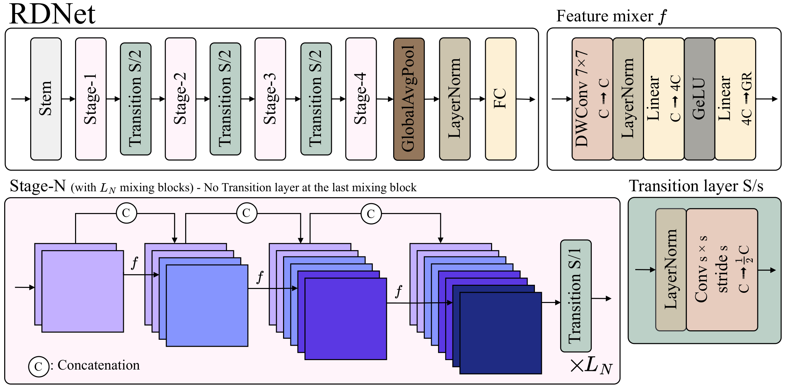
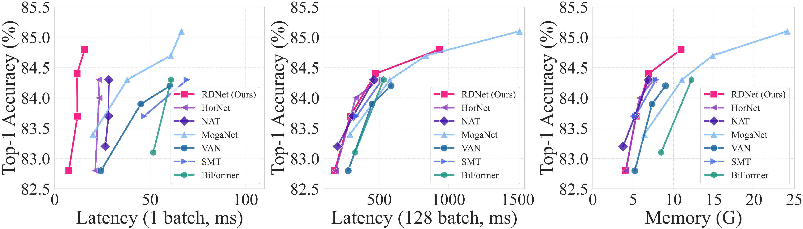
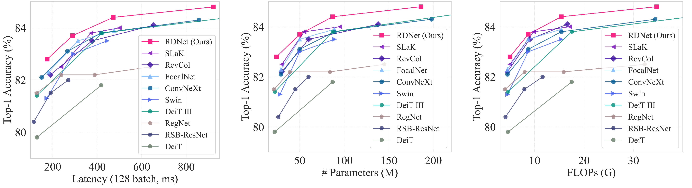
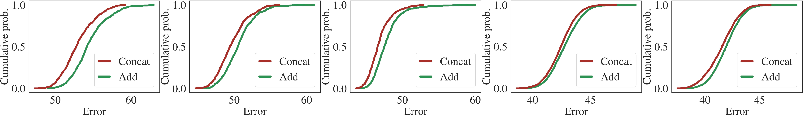
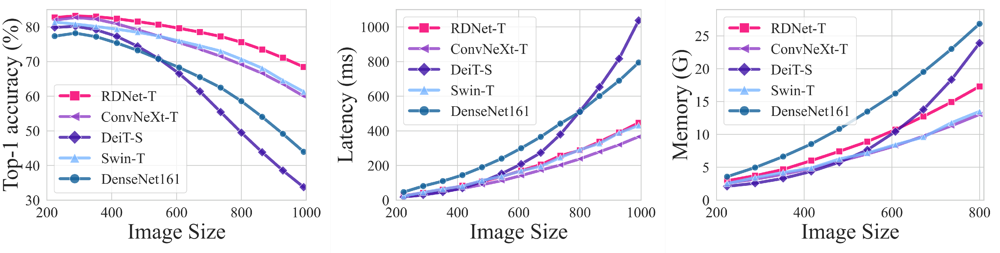
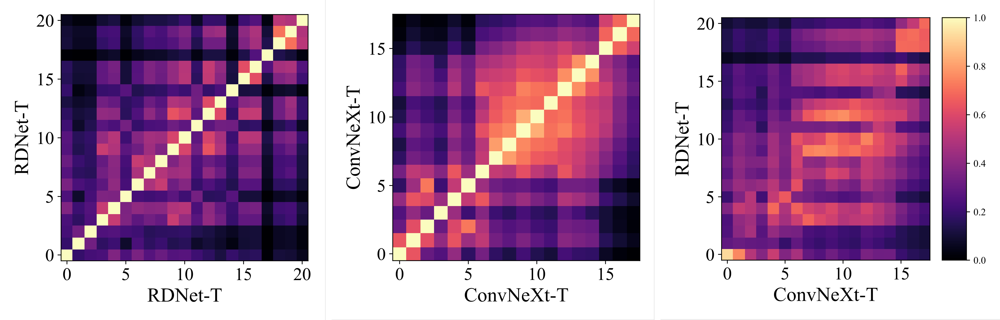
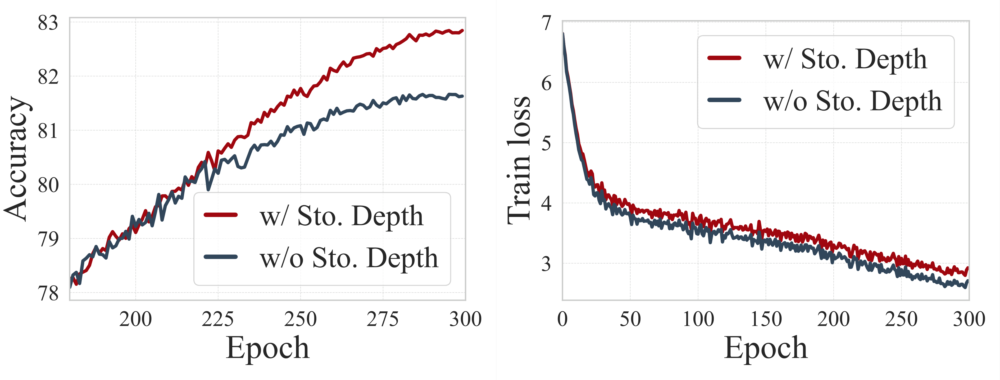
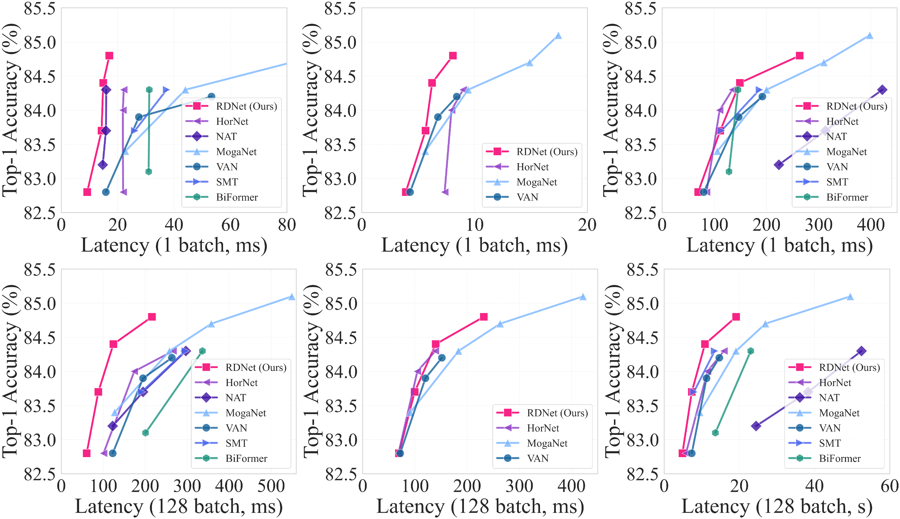
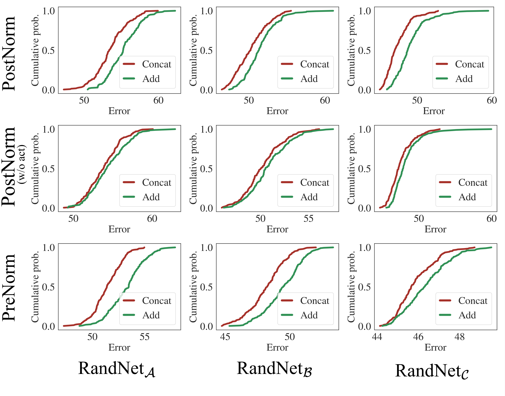
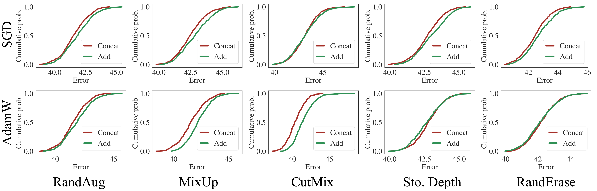

# DenseNets Reloaded: ResNet と ViT を超えるパラダイムシフト

> 原題: DenseNets Reloaded: Paradigm Shift Beyond ResNets and ViTs
> 著者: Donghyun Kim*, Byeongho Heo, Dongyoon Han（* 同等の貢献、責任著者は Dongyoon Han）
> 所属: NAVER Cloud AI / NAVER AI Lab
> 出典: arXiv:2403.19588 → **ECCV 2024**
> コード: <https://github.com/naver-ai/rdnet>

> 翻訳メモ: 本翻訳は CLAUDE.md §4 の標準ルールと異なり、**Appendix 0.A〜0.I をすべて翻訳対象に含めている**（ユーザーからの個別指示による）。References のみ除外。原典 markdown（ar5iv 由来）には**画像が 4 枚しか埋め込まれておらず、本論文の看板図であるアーキテクチャ図（図1）が欠落している**ため、図はすべて arXiv e-print（arXiv:2403.19588）に同梱された PDF から生成した。また ar5iv の変換の都合で §5.2〜5.3 の本文が二重に出力されているが、本翻訳では重複を除いている。巨大な HTML テーブルは markdown テーブルに変換した。

## Abstract（要旨）

本論文は **Densely Connected Convolutional Networks（DenseNets）**を復活させ、支配的な ResNet 型のアーキテクチャに対する**過小評価されてきた有効性**を明らかにする。我々は、**手つかずの訓練手法と伝統的な設計要素がその能力を十分に引き出していなかった**ために DenseNets の潜在能力が見過ごされてきたと考える。我々のパイロット研究は、**連結（concatenation）による密な接続が強力である**ことを示し、DenseNets が現代のアーキテクチャと競争できるよう復活させられることを実証する。我々は最適でない構成要素を系統的に洗練する——アーキテクチャの調整、ブロックの再設計、そして **DenseNets を広くしメモリ効率を高める方向への改善された訓練レシピ**であり、その間も**連結ショートカットは保持する**。単純なアーキテクチャ要素を用いる我々のモデルは、最終的に **Swin Transformer、ConvNeXt、DeiT-III——残差学習の系譜における主要なアーキテクチャ——を上回る**。さらに、我々のモデルは ImageNet-1K でごく最近のモデルに匹敵する最先端に近い性能を示し、下流タスクである ADE20k セマンティックセグメンテーションと COCO 物体検出/インスタンスセグメンテーションでも同様である。最後に、**加算的ショートカットに対する連結の利点**を明らかにする経験的解析を提供し、DenseNet 型の設計への選好の刷新を導く。

## 1 Introduction（はじめに）

「ImageNet の瞬間」は、画期的な AlexNet に始まる畳み込みニューラルネットワーク（ConvNets）の出現によって引き起こされた。続いて VGG と GoogleNet が ConvNets において複数の畳み込み層を積み重ねることの利点をさらに強調した。同じ時代に、記念碑的なアーキテクチャである ResNet とその系列が際立った存在となった。それは**加算的なスキップ接続（additive skip connection、加算的ショートカットまたは恒等写像とも呼ばれる）**という画期的な概念を導入し、最大 1,000 層の積み重ねを可能にしたためである。**それを伴う残差学習の導入はゲームチェンジャーであり、恒等写像の微分から入力の勾配が常に 1 のままであることを保証することで勾配消失の問題を軽減した。** この革新は一連の後継——記念碑的な ConvNets である EfficientNet と ConvNeXt——を生み、さらに Transformer、Vision Transformer（ViT）、階層型 ViT といった次の飛躍への道を開いた。これは**加算的ショートカットの持続的な影響力**を際立たせている。

残差学習が支配するこの時期の初期段階において、**DenseNets** は新規のアプローチを導入した。加算的ショートカットを用いる代わりに**特徴の連結を通してショートカット接続を維持する**というものである。これは**特徴の再利用（feature reuse）**という概念につながり、より小型のモデルを可能にし、初期の層への明示的な教師の伝播を通して過学習を減らした。DenseNets はセマンティックセグメンテーションのようなタスクで効率性と優れた性能を示した。DenseNet 以後のアーキテクチャ設計の進化は ResNets の支配に挑戦するかに見えたが、**加算的ショートカットの利点に影を落とされ、その人気は衰退した**。

## 2 Related Work（関連研究）

#### Densely Connected Neural Networks（密結合ニューラルネットワーク）

（DenseNet の系譜と、メモリ効率化の試み、セマンティックセグメンテーションでの成功などが記述されている。）

#### Modern architectures.（現代のアーキテクチャ）

（ResNet 系の再訪（RSB-ResNet 等）、ConvNeXt、Swin、DeiT-III、および HorNet・VAN・NAT・SMT・MogaNet といった最近のモデル群が記述されている。）

## 3 Methodology: Revitalizing DenseNets（手法: DenseNets の復活）

### 3.1 Preliminary（予備的考察）

#### Motivation.（動機）

ResNets は $l$ 層目における単純な定式化のために有名である。

$$\mathbf{X}_{l+1}=\mathbf{X}_{l}+f(\mathbf{X}_{l}\mathbf{W})$$

ここで入力 $\mathbf{X}_{l}$ と重み $\mathbf{W}$ である。極めて重要な要素は**残差接続（すなわち加算的ショートカット、+）**であり、これは Swin、ConvNeXt、ViT で実証されているようにモジュール化されたアーキテクチャ設計を促進する。一方で DenseNets は次の定式化に従う。

$$\mathbf{X}_{l+1}=[\mathbf{X}_{l},\ f(\mathbf{X}_{l}\mathbf{W})]$$

これは**連結を通した密な接続**に基づき、明示的なパラメータ効率を持つ。

DenseNets は当初 ResNets を上回ったが、完全なパラダイムシフトを実現できず、その適用可能性の問題により初期の勢いを失った。特に、メモリのための努力にもかかわらず、**DenseNets にとって幅のスケーリングは問題のままであり、DenseNet-161/-233 のようなより広いモデルはより多くのメモリを消費する**。にもかかわらず、先行研究に着想を得、セマンティックセグメンテーションのような密予測タスクでの成功に動機づけられ、我々は DenseNets が人気のあるアーキテクチャを上回り、その潜在能力のさらなる探求に値すると考える。

#### Our conjecture.（我々の予想）

**連結ショートカットはランクを増やす効果的な方法である。** 重み $\mathbf{W}\in\mathbb{R}^{d_{in}\times d_{out}}$、入力 $\mathbf{X}\in\mathbb{R}^{N\times d_{in}}$、非線形性 $f$ を持つ層の出力 $f(\mathbf{X}\mathbf{W})$ を考える。ここで事例数は $N\gg d_{in}$ と仮定する。$f$ の行列ランクに注目すると、$d_{in}$ がそれほど小さくないとき、非線形性のために $\mathrm{rank}(f(\mathbf{X}\mathbf{W}))$ は一般に $d_{out}$ に近づく。**文献は $d_{out}>d_{in}$ である層 $\mathbf{W}$ が増加した表現能力を提供することを明らかにしてきた。**

**戦略的な設計はメモリの懸念を緩和する。** 積み重ねられた層の出力 $\mathbf{X}\mathbf{W}_{1}f(\mathbf{W}_{2})$ を考える。ここで重み $\mathbf{W}_{1}\in\mathbb{R}^{d_{in}\times d_{r}}$、$\mathbf{W}_{2}\in\mathbb{R}^{d_{r}\times d_{out}}$、$d_{r}<d_{in},d_{out}$ であり、$\mathbf{W}_{2}$ の後に非線形性 $f$ がある。同様に、$d_{r}$ がそれほど小さくなければランクは保たれる可能性が高い。**これは $\mathbf{W}_{1}$ のような中間の次元削減器（すなわち遷移層）を用いてもランクに大きな影響を与えないかもしれないことを示唆する。我々は、それを頻繁に適用することがメモリの懸念に効果的に対処すると主張する。**

#### Pilot study.（パイロット研究）

我々は予想を検証するため、**Tiny-ImageNet 上で 15,000 を超えるネットワークをサンプリングする**パイロット研究を行う。それらのショートカットは ResNets のような加算的なものか、DenseNets における連結のいずれかである。計算コストに関して慎重に実験を制御し、バランスの取れた包括的な比較を保証するため多様な訓練設定を含める。**興味深いことに、連結ショートカットはすべて加算的なものを上回り、Tiny-ImageNet の平均精度は 56.8±3.9（連結）対 55.9±4.1（加算）であり、我々の主張を経験的に支持する。**

### 3.2 Revitalizing DenseNets（DenseNets の復活）

連結を通した中核的な原理を維持しつつ DenseNets を再訪する。我々の戦略は DenseNets を広くする方法を探り、効果的な要素を特定する。

**表1**: ImageNet-1K の性能の進行。ベースラインである DenseNet-201 から始め、進行を通したすべての性能変化を報告する。**連結を通した特徴再利用という DenseNet の原理はモデルの進行の核として保持する。** GR は成長率（growth rate、連結される特徴の量）を表す。

| | 要素 | Top-1 (%) | Param (M) | FLOPs (G) | Lat b1 (ms) | Lat b128 (ms) | Lat 訓練 (ms) | Mem 訓練 (GB) |
| --- | --- | --- | --- | --- | --- | --- | --- | --- |
| (a) | **DenseNet-201** | 79.7 | 20.0 | 4.3 | 38.4 | 190 | 131 | 3.9 |
| (b) | (a) + **より広く浅く** | 79.5 (−0.2) | 21.8 (+1.8) | 11.1 (+6.8) | **8.5 (−29.9)** | 170 (−20) | 85 (−46) | 3.2 (−0.7) |
| (c) | (b) + **近代化されたブロック** | 80.4 (+0.9) | 12.9 (−8.9) | 4.8 (−6.3) | 10.4 (+2.9) | 230 (+60) | 112 (+27) | 3.4 (+0.2) |
| (d) | (c) + **中間チャネル次元↑（GR↓）** | 80.8 (+0.4) | 19.9 (+7.0) | 4.7 (−0.1) | 11.8 (+1.4) | 184 (−46) | 88 (−24) | 3.1 (−0.3) |
| (e) | (d) + **遷移層↑（GR↑）** | **82.3 (+1.5)** | 21.2 (+1.3) | 5.0 (+0.3) | 11.0 (+0.8) | 183 (−1) | 90 (+2) | 3.4 (+0.3) |
| (f) | (e) + **パッチ化ステム** | 82.4 (+0.1) | 21.2 (−0.0) | 4.9 (−0.1) | 11.0 (−0.0) | 179 (−6) | 88 (−2) | 3.2 (−0.2) |
| (g) | (f) + **洗練された遷移層** | 82.6 (+0.2) | 22.4 (+1.2) | 4.9 (+0.0) | 13.6 (+2.6) | 170 (−9) | 97 (+9) | 3.1 (−0.1) |
| (h) | (g) + **チャネル再スケーリング** | **82.8 (+0.2)** | 23.9 (+1.5) | 5.0 (+0.1) | 14.0 (+0.4) | 175 (+5) | 99 (+2) | 3.1 (+0.0) |

#### Baseline.（ベースライン）

ResNets の再訪の系列が示したように、**洗練された訓練レシピは有意な改善をもたらす**。同様に、我々は DenseNet-201 を現代的な訓練設定で訓練し、これをベースラインとする。よく探求された設定に従い、**Label Smoothing、RandAugment、Random Erasing、Mixup、CutMix、Stochastic Depth** を含め、**コサイン学習率スケジュールと線形ウォームアップを伴う AdamW** を、一般的な大エポックの訓練設定（すなわち 300）で用いる。

#### Going wider and shallower.（より広く、より浅く）

DenseNets はもともと極めて深いアーキテクチャ（例: DenseNet-265）を提案し、スケーラビリティを効果的に示した。**我々は、資源の制約のもとで高い成長率（GR）による特徴次元の強化と深さの増加を同時に達成することは困難であると主張する。** 先行研究は効率、特にレイテンシを達成するためにより浅いネットワークを設計してきた。これに着想を得て、DenseNet を好ましいベースラインへ修正する。すなわち **GR を増やしてネットワークを広くしつつ深さを減らす**。具体的には **GR を 32 から 120 へ大幅に増やす**。

#### Improved feature mixers.（改善された特徴混合器）

特徴混合ブロックには ConvNeXt の基本ブロックを採用する。ただし使用前に、1) DenseNets が加算的ショートカットを用いなかったこと、2) その構築ブロックがもともと次元を逐次的に減らすよう設計されていたことから、我々の場合について研究を再評価すべきである。次の設定が依然として成り立つことを見出す。**1) BatchNorm の代わりに LayerNorm、2) post-activation、3) depthwise 畳み込み、4) より少ない正規化と活性化、5) カーネルサイズ 7。** 我々のブロックの独自の側面は、**出力チャネルが GR 次元になる**ことである。

<figure>

<figcaption>図1: RDNet の模式図。RDNet は主として特徴の連結を用いることにより、ResNet 型のアーキテクチャと区別される独自の設計を持つ。全スケールにわたって 4 つのステージを設計し、各 Stage-N は 3 つの特徴混合器と 1 つの遷移層からなる L_N 個の混合ブロックで構成される（最後の混合ブロックは遷移層を持たない）。特徴混合器 f は DWConv 7×7 → LayerNorm → Linear（C から 4C）→ GELU → Linear（4C から GR）で、以前に連結された特徴を GR 次元の特徴へ圧縮して連結に供する。遷移層は LayerNorm → Conv s×s stride s で、チャネル数を半分にしつつダウンサンプリングも行う。図中の丸 C が連結を表す。</figcaption>
</figure>

#### Larger intermediate channel dimensions.（より大きな中間チャネル次元）

**depthwise 畳み込みにとって大きな入力次元は決定的に重要である。** 先行研究は inverted bottleneck の**拡張率（ER）**を巧みに調整することで、ブロック内の中間テンソルのサイズを入力次元より大きくして有意な性能を達成した（例: ER は 6 に調整された）。

DenseNets も同様に ER の概念を採用したが、**入力次元ではなく成長率（GR）に適用した**（例: ER = 4 × GR）。これは入力と出力の両方の次元を減らすためである。**我々は、これが非線形性を通した符号化された特徴の能力を損なうと主張する。** そこで **ER を入力次元に比例させる（すなわち ER を GR から切り離す）**ようアプローチを再設計する。この変更はより大きな中間次元による計算需要の増加をもたらすため、**GR を半分にする（例: 120 から 60）**ことで精度を損なわずに需要を管理する。

#### More transition layers.（より多くの遷移層）

ステージ間の遷移層はチャネル数を減らすことを意図している。**すべてのブロックにおける密な接続のため、特徴の集積の激化が高い成長率を許さない。** これは第 3 ステージのように単一のステージ内に多数のブロックが積まれる場合に悪化する。**我々はこれに対処するため、より多くの遷移層を用いるという新規の側面を導入する。** 具体的には、各ステージの後だけでなく、**3 ブロックごとにストライド 1 の遷移層を用いる**ことを提案する。

加えて、モデルが FLOPs に比べてパラメータ数が少ないことに注意する。これを**ステージごとに異なる GR**（例: 64, 104, 128, 192）を導入することで是正する。表 8d の研究は、**一様な成長率が精度と効率の両方を損なう**ことを示唆する。

#### Patchification stem（パッチ化ステム）

最近の進歩はステム内で画像パッチを入力として用いることの有効性を明らかにした。我々は**パッチサイズ 4、ストライド 4** の同一の設定をパッチ化として用いる（LN が続く）。経験的な発見は、**パッチ化の採用が精度を損なわずに計算速度の顕著な加速をもたらす**ことを示唆する。

#### Refined transition layers（洗練された遷移層）

遷移層のもう 1 つの役割はダウンサンプリングであり、そのために追加の平均プーリングが採用されていた。我々は遷移層を洗練し、**平均プーリングを除去して、カーネルサイズとストライドを調整した畳み込みに置き換える**（LN が BN を置き換える）。したがって我々の遷移層は 2 つの追加の役割を果たす。**1) 前述の次元削減、2) ダウンサンプリング**である。各ステージの後に遷移層を置くと +0.2%p の向上を示す。

#### Channel re-scaling.（チャネル再スケーリング）

**連結された特徴の多様な分散**のためにチャネルの再スケーリングが必要かを調査する。我々が提案する再スケーリングのアプローチは、**チャネル layer-scale と効果的な squeeze-excitation ネットワークを統合した**同様の定式化を持つ。表 1(h) はこれが +0.2%p のわずかな改善を達成することを示す。ただしごく軽微な非効率を伴う。

### 3.3 Revitalized DenseNet (RDNet)（復活した DenseNet）

最終的に **Revitalized DenseNet（RDNet と呼ぶ）**を導入する。我々の最終的なモデルは精度と効率の両方の向上を達成し、特に**大幅に高速な速度**を享受する。RDNet のモデル系列は広く採用されているスケールに整合する。我々のモデルは独自に成長率 $\text{GR}=(GR_{1},GR_{2},GR_{3},GR_{4})$ と各ステージにおける特徴混合器の数 $\text{B}=(B_{1},B_{2},B_{3},B_{4})$ を含み、**各ステージあたりの特徴混合器の数を 3 の倍数に割り当てる**（すなわち $B_{N}=3L_{N}$、$L_{N}$ は混合ブロックの数）。

- **RDNet-T**: $\text{GR}=(64,104,128,224)$, $\text{B}=(3,3,12,3)$
- **RDNet-S**: $\text{GR}=(64,128,128,240)$, $\text{B}=(3,3,21,6)$
- **RDNet-B**: $\text{GR}=(96,128,168,336)$, $\text{B}=(3,3,21,6)$
- **RDNet-L**: $\text{GR}=(128,192,256,360)$, $\text{B}=(3,3,24,6)$

## 4 Experiment（実験）

### 4.1 Image Classification（画像分類）

ImageNet-1K でモデル系列を評価する。**公平な比較を保証し設定の微調整を目的としないため**、Swin Transformer と ConvNeXt の訓練設定に従う。バッチサイズ 512、初期学習率 1e-4 の AdamW で 300 エポック訓練する。ConvNeXt と同一のデータ拡張/正則化技法を採用し、**EMA は訓練に用いない**。

<figure>

<figcaption>図2: 最先端モデル間の ImageNet-1K 性能のトレードオフ。トップ性能で知られる最先端モデルの間の比較を可視化する。左からバッチサイズ 1 のレイテンシ、バッチサイズ 128 のレイテンシ、訓練メモリに対する精度。RDNet はモデルの速度とメモリ消費の点で実用上きわめて競争力があることが分かる。</figcaption>
</figure>

**表2**（抜粋）: 最新モデルとの ImageNet-1K の比較。b$n$ はバッチサイズ $n$ で測定したレイテンシ（ms）、Mem はバッチサイズ 16 で測定したメモリ占有（GB）。**興味深いことに、我々のモデルは精度でわずかに劣るものの、優れた速度の指標で大きく埋め合わせる。**

| Model | Date | Param | FLOPs | Top-1 | b1 | b128 | Mem |
| --- | --- | --- | --- | --- | --- | --- | --- |
| **RDNet-T** | Ours | 24 | 5.0 | 82.8 | **7.4** | 175.2 | 4.1 |
| HorNet-T | NeurIPS'22 | 22 | 4.0 | 82.8 | 21.2 | 183.7 | 4.1 |
| VAN-B2 | CVMJ'23 | 27 | 5.0 | 82.8 | 24.2 | 274.8 | 5.2 |
| BiFormer-S | CVPR'23 | 26 | 4.5 | **83.8** | 51.6 | 197.2 | 8.5 |
| NAT-T | CVPR'23 | 28 | 4.3 | 83.2 | 26.5 | 335.3 | 3.8 |
| SMT-S | ICCV'23 | 21 | 4.7 | 83.7 | 46.9 | 335.3 | 5.3 |
| MogaNet-S | ICLR'24 | 25 | 5.0 | 83.4 | 20.0 | 288.1 | 6.4 |
| **RDNet-S** | Ours | 50 | 8.7 | 83.7 | **11.9** | 289.0 | 5.4 |
| HorNet-S | NeurIPS'22 | 50 | 8.8 | 84.0 | 23.2 | 328.9 | 5.7 |
| SMT-B | ICCV'23 | 32 | 7.7 | **84.3** | 69.3 | 518.7 | 7.8 |
| **RDNet-B** | Ours | 87 | 15.4 | **84.4** | **11.7** | 471.6 | 6.9 |
| MogaNet-L | ICLR'24 | 83 | 15.9 | 84.7 | 60.8 | 838.6 | 14.9 |
| **RDNet-L** | Ours | 186 | 34.7 | **84.8** | **15.7** | 933.7 | 10.9 |
| MogaNet-XL | ICLR'24 | 181 | 34.5 | **85.1** | 66.3 | 1512.5 | 24.1 |

<figure>

<figcaption>図3: 過去のマイルストーン間の ImageNet-1K 性能のトレードオフ。左からレイテンシ、パラメータ数、FLOPs に対する精度。実際の差を強調するため速度の比較も含めている。我々のモデルは競合する現代のアーキテクチャを上回り、密な接続の潜在能力を明らかにする。</figcaption>
</figure>

**表4**（抜粋）: マイルストーンとの ImageNet-1K 性能比較。Lat は 128 枚の推論時間（ms）、Mem はバッチサイズ 16 のメモリ使用量（GB）。すべてのモデルは ImageNet-1k でゼロから（事前）訓練されている。

| Model | Res | Param | FLOPs | Lat | Mem | Top-1 |
| --- | --- | --- | --- | --- | --- | --- |
| RSB-ResNet50 | 224² | 26 | 4.1 | 115 | 2.1 | 80.4 |
| Deit-S | 224² | 22 | 4.6 | 128 | 1.9 | 79.8 |
| Swin-T | 224² | 28 | 4.5 | 173 | 2.6 | 81.3 |
| ConvNeXt-T | 224² | 29 | 4.5 | 150 | 2.7 | 82.1 |
| Deit III-S | 224² | 22 | 4.6 | 128 | 2.0 | 81.4 |
| InceptionNeXt-T | 224² | 28 | 4.2 | 132 | 3.3 | 82.3 |
| **RDNet-T** | 224² | 24 | 5.0 | 175 | 4.1 | **82.8** |
| Swin-S | 224² | 50 | 8.7 | 293 | 3.9 | 83.0 |
| ConvNeXt-S | 224² | 50 | 8.7 | 266 | 4.0 | 83.1 |
| NFNet-F0 | 224² | 71 | 12.4 | 235 | 3.5 | 83.6 |
| SLaK-S | 224² | 55 | 9.8 | 372 | 5.0 | **83.8** |
| **RDNet-S** | 224² | 50 | 8.7 | 289 | 5.4 | 83.7 |
| Swin-B | 224² | 89 | 15.4 | 445 | 5.4 | 83.5 |
| ConvNeXt-B | 224² | 89 | 15.4 | 417 | 5.4 | 83.8 |
| DeiT III-B | 224² | 87 | 17.5 | 422 | 4.0 | 83.8 |
| CSWin-B | 224² | 78 | 15.0 | 543 | 6.5 | 84.2 |
| **RDNet-B** | 224² | 87 | 15.4 | 472 | 6.9 | **84.4** |
| DeiT III-L | 224² | 304 | 61.6 | 1375 | 10.5 | 84.9 |
| ConvNeXt-L | 224² | 198 | 34.4 | 857 | 8.6 | 84.3 |
| **RDNet-L** | 224² | 186 | 34.7 | 934 | 10.9 | **84.8** |
| ConvNeXt-L | 384² | 198 | 101.1 | 2550 | 19.0 | 85.5 |
| DeiT III-L | 384² | 304 | 191.2 | 4586 | 28.1 | **85.8** |
| **RDNet-L** | 384² | 186 | 101.9 | 2714 | 24.3 | **85.8** |

### 4.2 Zero-shot Image Classification（ゼロショット画像分類）

**表3**: ImageNet-1K のゼロショット分類の結果。**我々のものは効率の面でさらに ConvNeXt を上回る。**

| Models | Param | Top-1 | Top-5 |
| --- | --- | --- | --- |
| ConvNeXt-B | 152 | 51.2 | 79.3 |
| **RDNet-B** | 150 | **54.1** | **82.1** |

**異なる訓練方式のもとでの適用可能性を検証するため**、CLIP を訓練することで RDNet の ImageNet-1k のゼロショット性能を評価する。ConvNeXt-OpenCLIP の訓練プロトコルに従い、**CC3M・CC12M・RedCaps を集約した集合からの 12.8 億の見られた画像**を用いる。OpenCLIP のコードベースを用いる。

### 4.3 Semantic Segmentation（セマンティックセグメンテーション）

ImageNet-1K の事前学習済み重みを用いて **UperNet** で **ADE20K** のセマンティックセグメンテーションを行う。学習率 8e-5、weight decay 0.03 を用い、RDNet-T/-S/-B にそれぞれ stochastic depth 率 0.1/0.2/0.3 を用いる。

**表5**: ADE20K セマンティックセグメンテーションの結果。すべて UperNet（160K）で訓練。FLOPs (G) は $512\times 2048$ 解像度で測定。

| Architecture | Crop | Param | FLOPs | mIoU (ss) | mIoU (ms) |
| --- | --- | --- | --- | --- | --- |
| Swin-T | 512² | 60 | 945 | 44.5 | 46.1 |
| ConvNeXt-T | 512² | 60 | 939 | 46.0 | 46.7 |
| RevCol-T | 512² | 60 | 937 | 47.4 | 47.8 |
| NAT-T | 512² | 58 | 934 | 47.1 | 48.4 |
| **RDNet-T** | 512² | 58 | 961 | **47.6** | **48.6** |
| Swin-S | 512² | 81 | 1038 | 47.6 | 49.5 |
| ConvNeXt-S | 512² | 82 | 1027 | 48.7 | 49.6 |
| **RDNet-S** | 512² | 86 | 1040 | **48.7** | **49.8** |
| Swin-B | 512² | 121 | 1188 | 48.1 | 49.7 |
| ConvNeXt-B | 512² | 122 | 1170 | 49.1 | 49.9 |
| DeiT III-B | 512² | 128 | 1283 | 49.3 | 50.2 |
| **RDNet-B** | 512² | 127 | 1187 | **49.6** | **50.5** |

### 4.4 Object Detection（物体検出）

**Mask-RCNN** を用いて **COCO** の物体検出の性能を評価する。学習率 3e-5、stochastic depth 率 0.2 を用いる。残りの訓練設定は再び ConvNeXt に従う。

**表6**: COCO 物体検出とセグメンテーションの結果。Mask-RCNN の 3x スケジュールを利用。FLOPs (G) は画像サイズ (1280, 800) で計算。

| Backbone | Param | FLOPs | AP^box | AP^box_50 | AP^box_75 | AP^mask | AP^mask_50 | AP^mask_75 |
| --- | --- | --- | --- | --- | --- | --- | --- | --- |
| PVT-S | 44M | 304G | 43.0 | 65.3 | 46.9 | 39.9 | 62.5 | 42.8 |
| Swin-T | 48M | 267G | 46.0 | 68.1 | 50.3 | 41.6 | 65.1 | 44.9 |
| ConvNeXt-T | 48M | 262G | 46.2 | 67.9 | 50.8 | 41.7 | 65.0 | 44.9 |
| **RDNet-T** | **43M** | 278G | **47.5** | **68.5** | **52.1** | **42.4** | **65.6** | **45.7** |

## 5 Discussions（議論）

### 5.1 Pilot Study - Random Network Experiments（パイロット研究 — ランダムネットワーク実験）

この研究は**残差接続に対する密な接続の有効性**を明らかにすることを目指す。**多数のランダムネットワークをさまざまなシナリオで訓練する**。それは 1) 複数のネットワークのスケール、2) 複数の型の構築ブロック、3) さまざまなネットワークのアーキテクチャ要素、4) 異なる訓練設定を含む。

#### Parameter spaces and cost constraints.（パラメータ空間とコスト制約）

**表7（左）**: 3 つの個別のスケールのパラメータ空間。パラメータ数、FLOPs、メモリ消費といった予算に関して探索空間を多様化する。**空間 $\mathcal{C}$ からデータ拡張を組み込んで $\mathcal{D}$ へ、さらにデータ拡張と異なるオプティマイザの両方を伴う $\mathcal{E}$ へ拡張する。** 事前に定義された予算を満たすランダムに生成されたネットワークのみを訓練する。**Tiny-ImageNet で 90 エポックの訓練設定**を用いる。

| パラメータ空間 | $\mathcal{A}$ | $\mathcal{B}$ | $\mathcal{C}$ |
| --- | --- | --- | --- |
| Param ($x$ M) | $2<x<2.5$ | $4<x<5$ | $9<x<10$ |
| FLOPs ($x$ G) | $2<x<2.5$ | $4<x<5$ | $9<x<10$ |
| 深さ | (3, 6, 1) | (3, 8, 1) | (3, 12, 1) |
| 中間チャネル次元 | (32, 96, 8) | (64, 128, 8) | (64, 192, 8) |
| 出力チャネル次元 | (32, 96, 8) | (64, 128, 8) | (64, 192, 8) |
| 活性化 | \[ReLU, SiLU, Mish, GELU, LeakyReLU\] | | |
| 正規化層 | \[BatchNorm, LayerNorm\] | | |
| カーネルサイズ | \[3, 5, 7, 9\] | | |

| パラメータ空間 | $\mathcal{D}$ | $\mathcal{E}$ |
| --- | --- | --- |
| ベース空間 | $\mathcal{C}$ | $\mathcal{C}$ |
| オプティマイザ | – | AdamW |
| データ拡張 | ✓ | ✓ |

**表7（右）**: ランダムネットワーク実験の結果。

| Model | Skip | FLOPs | Param | Mem | Top-1 (%) |
| --- | --- | --- | --- | --- | --- |
| RandNet$_\mathcal{A}$ | add | 2.25±0.13 | 2.21±0.13 | 0.65±0.03 | 45.8±2.0 |
| RandNet$_\mathcal{A}$ | **concat** | 2.24±0.14 | 2.24±0.13 | 0.75±0.08 | **47.5±2.1** |
| RandNet$_\mathcal{B}$ | add | 4.53±0.27 | 4.44±0.26 | 0.78±0.05 | 50.1±2.1 |
| RandNet$_\mathcal{B}$ | **concat** | 4.53±0.29 | 4.51±0.28 | 0.90±0.11 | **51.2±2.1** |
| RandNet$_\mathcal{C}$ | add | 9.61±0.23 | 9.41±0.23 | 1.01±0.09 | 53.2±2.2 |
| RandNet$_\mathcal{C}$ | **concat** | 9.53±0.26 | 9.44±0.26 | 1.24±0.17 | **54.3±2.0** |
| RandNet$_\mathcal{D}$ | add | 9.60±0.23 | 9.40±0.23 | 1.02±0.09 | 57.4±1.5 |
| RandNet$_\mathcal{D}$ | **concat** | 9.54±0.26 | 9.44±0.26 | 1.24±0.16 | **58.1±1.4** |
| RandNet$_\mathcal{E}$ | add | 9.59±0.23 | 9.38±0.23 | 1.02±0.09 | 58.2±1.5 |
| RandNet$_\mathcal{E}$ | **concat** | 9.54±0.26 | 9.44±0.26 | 1.25±0.17 | **58.9±1.6** |

<figure>

<figcaption>図4: 訓練されたモデルの累積確率 vs 誤差。左から RandNet A、RandNet B、RandNet C、データ拡張を伴う空間 D、AdamW を伴う空間 E。赤が Concat、緑が Add。すべての設定で赤（連結）の曲線が左に位置し、より低い誤差に集中していることが分かる。</figcaption>
</figure>

#### RandNet architecture.（RandNet のアーキテクチャ）

ResNet に基づき、第 1 ステージ内にランダムな構築ブロックを積む。制約されたコストのもとで柔軟性を提供するため、**多様な深さ・幅・活性化・正規化・カーネルサイズ**を含むパラメータ空間でランダムネットワークを生成する。さらに、より広範な実験を行うためすべての探索空間で構築ブロックも多様化する。**PreNorm、PostNorm、PostNorm（活性化なし）**と呼ぶ 3 つの異なるアーキテクチャのブロックが、pre-activation とショートカットの位置の使用によって区別される。

#### Result interpretation.（結果の解釈）

**表7（右）は、連結がすべての構成にわたって一貫して加算的ショートカットを上回ることを示す。** さらに図4 は連結ベースのアーキテクチャの優れた能力を実証する。

### 5.2 Impact of Input Size on Performance（入力サイズが性能に与える影響）

<figure>

<figcaption>図5: 解像度に対する精度/レイテンシ/メモリ。RDNet はさまざまな入力画像サイズに対して精度を維持する解像度ロバスト性を享受する。さらに RDNet は ConvNeXt や Swin Transformer と同様のレイテンシ/メモリの傾向を示し、DeiT-S や DenseNet161 と比べて大きな画像でも増加が最小限に留まる。左のパネルでは画像サイズ 1000 において RDNet-T が約 68% を保つのに対し、DeiT-S は約 34%、DenseNet161 は約 44% まで落ちる。</figcaption>
</figure>

入力サイズに関する説得力のある発見を提供する。第一に、図5（左）は **RDNet が入力サイズの変動に対して強い適応性を享受する**ことを示す。**興味深いことに、DenseNet161 は強いデータ拡張なしで訓練されているにもかかわらず適応性を享受し、強いデータ拡張で訓練された DeiT-S を上回る。我々はこれを密な接続の有効性に帰する。**

さらに我々の発見は、大きな中間テンソルのために大きな入力サイズで遅くなる幅志向のネットワークと異なり、**我々のモデルの最適化された幅がレイテンシ/メモリの損失を回避する**ことを示す。図5（中・右）は RDNet が ConvNeXt と Swin Transformer に匹敵し、**画像サイズが大きくなるにつれて遅くなりより多くのメモリを消費する DenseNet161 から乖離する**ことを図示する。

### 5.3 CKA analysis（CKA 解析）

<figure>

<figcaption>図6: CKA（Centered Kernel Alignment）解析。左が RDNet-T の層間類似度、中央が ConvNeXt-T の層間類似度、右が RDNet-T と ConvNeXt-T の間の類似度。RDNet は対角成分以外が全体に暗く、各層で異なる特徴を学習していることが分かる。一方 ConvNeXt は中盤の層同士が明るく（高い類似度）、似た特徴を繰り返し学習している。右のパネルは両者が互いに異なる特徴を学ぶことを示す。</figcaption>
</figure>

**Centered Kernel Alignment（CKA）**を用いて RDNet の層ごとの特徴を ConvNeXt と比較して解析する。図6 は **RDNet がすべての層で異なる特徴を学習し、ConvNeXt と比べて異なるパターンを示す**ことを表示する。第 3 列では、**ConvNeXt と RDNet が比較したとき驚くほど異なる特徴を学習しており、各モデルの独自の学習動力学を強調している**。

### 5.4 Revisiting Stochastic Depth（Stochastic Depth の再訪）

**注目すべきことに、DenseNets はネットワークの接続パターンの類似性を共有するために、もともとモデルの訓練に Stochastic Depth を採用していなかった。**

<figure>

<figcaption>図7: Stochastic depth は密な接続でも効果的であることが分かる。それは依然として正則化子として働く。左が検証精度、右が訓練損失の推移。</figcaption>
</figure>

**表9**: Stochastic depth は密な接続と両立する。

| Ratio | Param | FLOPs | Top-1 |
| --- | --- | --- | --- |
| 0 | 23.9 | 5.0 | **81.6** |
| 0.05 | 23.9 | 5.0 | 82.5 |
| 0.10 | 23.9 | 5.0 | 82.6 |
| **0.15** | 23.9 | 5.0 | **82.8** |
| 0.20 | 23.9 | 5.0 | 82.6 |

**我々は Stochastic Depth を見過ごすべきではないと主張する。** 我々のモデルに組み込んだとき顕著な改善を示す。**また小さな stochastic depth 率が深く影響することも観察する**（0 → 0.15 で **+1.2%p**）。

### 5.5 Ablation Studies（アブレーション研究）

**表8**（抜粋）: アブレーション研究の結果。各表は他とほぼ同等の計算コストになるよう入念に調整されたモデルを含む。

**(a) 深さ/幅のスケーリング**

| Depth | Param | FLOPs | Top-1 |
| --- | --- | --- | --- |
| 3, 3, 9, 3 | 23.3 | 5.0 | 82.5 |
| **3, 3, 12, 3** | 23.9 | 5.0 | **82.8** |
| 3, 3, 15, 3 | 23.5 | 5.0 | 82.8 |
| 3, 3, 18, 6 | 50.3 | 8.7 | 83.5 |
| **3, 3, 21, 6** | 50.4 | 8.7 | **83.7** |
| 3, 3, 24, 6 | 49.9 | 8.7 | 83.6 |
| 3, 3, 18, 6 | 89.2 | 15.4 | 84.2 |
| **3, 3, 21, 6** | 86.2 | 15.4 | **84.4** |
| 3, 3, 24, 6 | 87.4 | 15.4 | 84.2 |

**(b) ブロックの構成**

| Block conf | Param | FLOPs | Top-1 |
| --- | --- | --- | --- |
| **(a) RDNet-T** | 23.9 | 5.0 | **82.8** |
| (a) + more act | 23.9 | 5.0 | 81.9 |
| (a) ↔ 3×3 dwconv | 23.5 | 4.9 | 82.4 |
| (a) ↔ 5×5 dwconv | 23.7 | 5.0 | 82.5 |

## 6 Conclusion（結論）

本論文では、ResNet・ConvNeXt・ViT のような加算ベースのショートカットを用いるモデルが支配するこの時代において、かつて ResNet を上回った DenseNet の過去の成功を再訪した。**まず、パイロット研究を通して、DenseNet の連結ショートカットが ResNet 型の加算ベースのショートカットという慣習の表現力を上回るという過小評価されてきた事実に焦点を当て、DenseNet の潜在能力を再発見した。** 次に、時代遅れの訓練設定と古典的なマクロブロックの設計が DenseNet の有効性を減じていたことを強調した。

**限界。** 我々のモデルは「-large」水準までスケールされたが、**資源の制約により ViT-G のような上位のスケールへのさらなる拡張ができていない**。

## Appendix 0.A Experimental Settings（実験設定）

### 0.A.1 ImageNet Training（ImageNet の訓練）

表 A は ImageNet-1K における RDNet の訓練設定を提示する。RDNet の各派生はこれらの設定に従う。ただし stochastic depth 率は各モデルの派生に合わせて調整される。**ファインチューニングでは、ConvNeXt で取られたアプローチと同様に、層ごとの学習率減衰のために連続する 3 つの特徴混合器ブロックをグループ化する。** モデルの訓練には **timm** パッケージを用いる。

### 0.A.2 Downstream Tasks（下流タスク）

ConvNeXt で概説されたハイパーパラメータのスイープのプロトコルに従うが、**はるかに軽くスイープする**。

- **ADE20K の UperNet 訓練**: 学習率 {8e-5, 1e-3}、weight decay {0.01, 0.03, 0.05}
- **COCO の Mask-RCNN 訓練**: 学習率 {1e-3, 2e-3, 3e-3}、weight decay {0.05, 0.1}、stochastic depth {0.1, 0.2}
- **COCO の Cascade Mask-RCNN 訓練**: 学習率 {8e-5, 1e-4}、weight decay {0.05, 0.1}、stochastic depth {0.4, 0.5, 0.6}

### 0.A.3 Benchmark Setup（ベンチマークの設定）

**V100 GPU** 上で PyTorch 1.13.1 と CUDA 11.6 を利用してレイテンシとメモリを測定する。すべての測定で **channels-last のメモリ形式**を採用する。メモリはバッチサイズ 16 の訓練フェーズで測定される。

## Appendix 0.B Model Configurations of RDNet（RDNet のモデル構成）

実務家の視点からは、RDNet の特徴のチャネル数を確認することが困難でありうる。したがって詳細なモデル構成を表 B に提供する。解像度とチャネルの値は出力特徴に基づく。**効率のため遷移層の出力次元が 8 の倍数になるよう保証している。**

**表B**（抜粋）: RDNet-T の層ごとの構成と、RDNet モデル系列の構成。

| Stage | GR | Layer | Resolution | #Channels |
| --- | --- | --- | --- | --- |
| | | Patchification | 56×56 | 64 |
| S1 | 64 | Feature mixer | 56×56 | 128 |
| | | Feature mixer | 56×56 | 192 |
| | | ... | | |

| Stage | Settings | Tiny | Small | Base | Large |
| --- | --- | --- | --- | --- | --- |
| S1 | Growth Rate | 64 | 64 | 96 | 128 |
| | # Mixing Block | 1 | 1 | 1 | 1 |
| | *Transition S/2* | | | | |
| S2 | Growth Rate | 104 | 128 | 128 | 192 |
| | # Mixing Block | 1 | 1 | 1 | 1 |

## Appendix 0.C More ImageNet Accuracy vs. Latency Trade-offs（精度 vs レイテンシのトレードオフの追加）

モデルの実用性を評価するため、**多様なテストベッド**にわたって速度を測定する。**NVIDIA A100 GPU 上の PyTorch、Intel Xeon Gold 5120 CPU、および NVIDIA A100 GPU 上の TensorRT 推論エンジン**を用いて推論速度を正確に測定する。テスト環境は PyTorch 1.13.1、CUDA 11.6、TensorRT 8.5.3 を組み込んでいる。

<figure>

<figcaption>図B: ImageNet-1K 性能のさらなるトレードオフ。A100・TensorRT・CPU を含む多様な環境における最先端モデルとの比較を可視化する。上段がバッチサイズ 1、下段がバッチサイズ 128。左から PyTorch（A100 GPU）、TensorRT（A100 GPU）、CPU（Xeon Gold 5120）。RDNet はモデルの速度の点で実用上きわめて競争力があることが分かる。</figcaption>
</figure>

**図B は、我々のモデルがすべての評価設定にわたって一貫して優れた精度 vs レイテンシのトレードオフを示す**ことを表す。なお図B(b) には、CUDA のカスタムカーネルがコンパイルされなかったために評価から除外されたモデルがあるため、より少ないモデルしか含まれていない。

## Appendix 0.D More Comparison with ResNets and ConvNeXts（ResNets と ConvNeXts とのさらなる比較）

表 8a では、パラメータ数と FLOPs の点で ResNets と ConvNeXts に合わせた RDNets の性能を提示した。ここでは、以前のモデルより ResNets と ConvNeXts に**より近く整合させた** RDNets の性能をさらに報告する。すなわち、1) 同一の深さを持つ、2) 各ステージで同じ数の構築ブロックを持つ、3) パラメータと FLOPs を ResNet と ConvNeXt のものにできる限り近く合わせる。したがって比較はより**「りんご対りんご」の比較**に近い。**表 D が示すように、RDNet が密な接続にとって最適な幅と深さを持たないにもかかわらず、依然として競争力のある性能を示す。**

## Appendix 0.E More Object Detection/Instance Segmentation results（物体検出/インスタンスセグメンテーションの追加結果）

本文の表6 における 3x スケジュールの Mask-RCNN の結果の拡張として、より包括的で公平な比較のため **1x スケジュール**の Mask-RCNN も追加で訓練する。表 E が示すように、事前学習済みの RDNet モデルは競争力のある性能を実証する。さらに **Cascade Mask-RCNN** ヘッドを用いて事前学習済みモデルを評価する。表 F が示すように RDNet は競争力のある性能を示す。**なお我々のモデルは、ConvNeXt のものと比較して最大の精度のための訓練ハイパーパラメータの網羅的なファインチューニングを経ていない。**

## Appendix 0.F Transferability Evaluation（転移性の評価）

ImageNet-1K 事前学習済みモデルの転移性をベンチマークする。細粒度分類のデータセット——**CIFAR-10、CIFAR-100、Flowers-102、Stanford-Cars**——を利用する。さらに**長尾分類**の能力を検証するため **iNaturalist-2018 と iNaturalist-2019** を利用する。DeiT の訓練レシピに従う。

**表G**: ImageNet-1k 事前学習済みモデルによるさまざまな分類タスクの Top-1 精度 (%)。

| Model | Param | FLOPs | CIFAR10 | CIFAR100 | Flowers | Cars | **iNat18** | **iNat19** |
| --- | --- | --- | --- | --- | --- | --- | --- | --- |
| Grafit ResNet-50 | 26 | 4.1 | – | – | 98.2 | 92.5 | 69.8 | 75.9 |
| DeiT-III-S | 22 | 4.6 | 98.9 | 90.6 | 96.4 | 89.9 | 67.1 | 72.7 |
| **RDNet-T** | 24 | 5.0 | 98.9 | 90.4 | **98.6** | **93.9** | **77.0** | **81.2** |
| ResNet-152 | 60 | 11.6 | – | – | – | – | 69.1 | – |
| **RDNet-S** | 50 | 8.7 | 99.0 | 91.1 | 98.4 | **94.2** | **79.1** | **82.4** |
| DeiT-B | 87 | 17.5 | 99.1 | 90.8 | 98.4 | 92.1 | 73.2 | 77.7 |
| DeiT-III-B | 87 | 17.5 | 99.3 | 92.5 | 98.6 | 93.4 | 73.6 | 78.0 |
| **RDNet-B** | 87 | 15.4 | 99.3 | 91.4 | 98.6 | **94.1** | **80.5** | **83.5** |
| **RDNet-L** | 186 | 34.7 | 99.3 | 91.5 | 98.6 | **94.2** | **81.5** | **83.7** |
| DeiT-III-L | 304 | 61.6 | 99.3 | **93.4** | **98.9** | **94.5** | 75.6 | 79.3 |

表 G が実証するように、**RDNet は強い転移性を示す。特筆すべきは長尾分類のタスクで印象的な性能を発揮することである。RDNet-T は iNaturalist-2018 と iNaturalist-2019 で DeiT-III-L を上回る**（304M パラメータの相手に 24M で勝つ）。

## Appendix 0.G Dense Connections for Generative Models（生成モデルのための密な接続）

生成モデルである **WGAN** を、生成器の ResNet-GAN を我々の連結ベースのモデルで置き換えることでテストする。**識別器のアーキテクチャ、訓練設定、そして同程度のモデルサイズを同一に保つ。** CIFAR-10 での概念実証に焦点を当て、我々のモデルがより速い収束で上回れるかを示す。

**表H**: WGAN の実験。

| Model | Param | IS↑ | FID↓ |
| --- | --- | --- | --- |
| ResBlock | 5.4M | 7.27±0.26 | 27.79±1.06 |
| **Ours** | 5.6M | **7.52±0.10** | **25.37±0.21** |

表 H の結果は**我々のモデルが複数の実行にわたって機能する**ことを確認した。より大きなモデルへの研究の拡張を計画している。

## Appendix 0.H Robustness Evaluation（頑健性の評価）

ImageNet の**分布外（OOD）ベンチマーク**——ImageNet-V2、ImageNet-A、ImageNet-Sketch、ImageNet-R、ObjectNet——を用いてモデルの頑健性をさらに評価する。

**表I**（抜粋）: 頑健性の評価。Avg Shift は OOD スコアの平均。

| Model | Param | FLOPs | IN | **Avg Shift** | V2 | Obj | A | Sketch | R |
| --- | --- | --- | --- | --- | --- | --- | --- | --- | --- |
| Swin-T | 28 | 4.5 | 81.3 | 38.9 | 69.7 | 33.1 | 21.1 | 29.3 | 41.5 |
| ConvNeXt-T | 29 | 4.5 | 82.1 | 42.7 | 72.5 | 35.6 | 24.2 | 33.8 | 47.2 |
| HorNet-T | 22 | 4.0 | 82.8 | 43.4 | 72.3 | 37.5 | 26.6 | 34.1 | 46.6 |
| NAT-T | 28 | 4.3 | **83.2** | 44.0 | 72.2 | 37.8 | **33.0** | 31.9 | 44.9 |
| **RDNet-T** | 24 | 5.0 | 82.8 | **44.7** | **72.9** | 36.9 | 27.7 | **37.0** | **49.0** |
| ConvNeXt-S | 50 | 8.7 | 83.1 | 45.7 | 72.5 | 38.0 | 31.3 | 37.1 | 49.6 |
| HorNet-S | 50 | 8.8 | **84.0** | 47.3 | 73.6 | **39.9** | 36.2 | 36.9 | 49.7 |
| SLaK-S | 55 | 9.8 | 83.8 | **48.2** | 73.6 | 39.6 | **39.3** | 37.5 | 50.9 |
| **RDNet-S** | 50 | 8.7 | 83.7 | 47.8 | **73.8** | 39.3 | 33.5 | **39.8** | **52.8** |
| ConvNeXt-B | 89 | 15.4 | 83.8 | 47.9 | 73.7 | 39.9 | 36.7 | 38.2 | 51.2 |
| SLaK-B | 95 | 17.1 | 84.0 | 48.9 | 74.0 | 39.7 | **41.6** | 38.5 | 50.8 |
| **RDNet-B** | 87 | 15.4 | **84.4** | **49.0** | **74.2** | 39.7 | 38.1 | **40.1** | **52.7** |
| ConvNeXt-L | 198 | 34.4 | 84.3 | 49.9 | 74.2 | 40.6 | 41.3 | 40.1 | 53.5 |
| **RDNet-L** | 186 | 34.7 | **84.8** | **52.2** | **75.0** | **42.1** | **42.9** | **44.5** | **56.5** |

表 I は **RDNet が他のモデルと比較して優れた頑健性を実証する**ことを示す。ImageNet-1K の精度が同等のモデル（HorNet、SLaK、NAT）を特に選んで、我々のモデルの優れた OOD 性能を実証している。**注目すべきことに、RDNet が競合モデルより ImageNet-1K で低い精度を示す場合でさえ、高い OOD スコアを達成する。**

## Appendix 0.I More Details and Extended Pilot Study（詳細と拡張されたパイロット研究）

### 0.I.1 More Details of Pilot Study（パイロット研究の詳細）

制御された設定のもとで行われた個別の RandNet の実験結果を提示する。**予算・ブロック型・スキップ接続型の各構成について 200 回の実験**を行う。図 C と表 J により、**連結はパラメータ空間 $\mathcal{A}$、$\mathcal{B}$、$\mathcal{C}$ を横断して加算を上回る**。

データ拡張を用いるパラメータ空間 $\mathcal{D}$ と $\mathcal{E}$ については、次のハイパーパラメータを実験に用いる。**RandAugment** は強度の値を {3, 5, 7} に制限し、**MixUp** と **CutMix** はそれぞれ alpha 値 {0.1, 0.3, 0.5} を採用し、**Stochastic Depth** も同様である。

各データ拡張における多様な設定のため、**各要素について 600 回の実験**を行う。加えて、オプティマイザを AdamW に切り替えた場合も、各拡張について 600 のランダムネットワークを訓練する。**図 D と表 K は、データ拡張が加算的ショートカットと連結的ショートカットの間の性能差を縮めることを示唆する。特に、AdamW で stochastic depth を用いて訓練された要素は加算的ショートカットからより恩恵を受ける。にもかかわらず、AdamW の訓練においてすら、連結ベースのモデルが加算的ショートカットに対する優位を支配し続けることを我々は観察し続ける。**

<figure>

<figcaption>図C: 表J の訓練されたモデルの累積確率 vs 誤差。各行が 3 つのブロック型を、各列がパラメータ空間 A・B・C を示す。</figcaption>
</figure>

**表J**（抜粋）: 連結 vs 加算。パラメータ空間 $\mathcal{A}$、$\mathcal{B}$、$\mathcal{C}$ に対応。**各パラメータ空間内で 200 のランダムネットワークをサンプル**し、FLOPs・パラメータ数・メモリ消費の計算コストが同程度になるよう保証して個別に Tiny-ImageNet で訓練する。

| Model | Skip type | Block type | FLOPs (G) | Param (M) | Mem (GB) | Top-1 (%) |
| --- | --- | --- | --- | --- | --- | --- |
| RandNet$_\mathcal{A}$ | Add | PostNorm | 2.24±0.14 | 2.20±0.13 | 0.66±0.03 | 45.6±2.3 |
| RandNet$_\mathcal{A}$ | **Concat** | PostNorm | 2.24±0.14 | 2.25±0.14 | 0.71±0.05 | **46.9±2.2** |
| RandNet$_\mathcal{A}$ | Add | PostNorm (w/o act) | 2.24±0.13 | 2.20±0.13 | 0.66±0.02 | 45.1±2.1 |
| RandNet$_\mathcal{A}$ | **Concat** | PostNorm (w/o act) | 2.23±0.14 | 2.24±0.14 | 0.76±0.06 | **46.8±2.2** |
| RandNet$_\mathcal{A}$ | Add | PreNorm | 2.24±0.13 | 2.2±0.13 | 0.66±0.02 | 46.8±1.67 |
| RandNet$_\mathcal{A}$ | **Concat** | PreNorm | 2.25±0.14 | 2.25±0.14 | 0.82±0.08 | **48.7±1.6** |
| RandNet$_\mathcal{B}$ | Add | PostNorm | 4.51±0.27 | 4.42±0.26 | 0.78±0.05 | 49.9±2.2 |
| RandNet$_\mathcal{B}$ | **Concat** | PostNorm | 4.53±0.28 | 4.52±0.28 | 0.88±0.09 | **50.7±2.2** |
| RandNet$_\mathcal{B}$ | Add | PostNorm (w/o act) | 4.52±0.27 | 4.43±0.26 | 0.78±0.05 | 49.4±2.3 |
| RandNet$_\mathcal{B}$ | **Concat** | PostNorm (w/o act) | 4.51±0.28 | 4.50±0.28 | 0.84±0.08 | **50.7±2.1** |
| RandNet$_\mathcal{B}$ | Add | PreNorm | 4.51±0.26 | 4.42±0.26 | 0.78±0.05 | 51.1±1.6 |
| RandNet$_\mathcal{B}$ | **Concat** | PreNorm | 4.50±0.30 | 4.48±0.29 | 0.97±0.12 | **52.2±1.5** |
| RandNet$_\mathcal{C}$ | Add | PostNorm | 9.58±0.23 | 9.37±0.23 | 1.00±0.09 | 52.8±2.2 |
| RandNet$_\mathcal{C}$ | **Concat** | PostNorm | 9.55±0.27 | 9.46±0.27 | 1.05±0.11 | **53.8±2.1** |
| RandNet$_\mathcal{C}$ | Add | PostNorm (w/o act) | 9.60±0.24 | 9.39±0.23 | 1.02±0.09 | 52.5±2.2 |
| RandNet$_\mathcal{C}$ | **Concat** | PostNorm (w/o act) | 9.56±0.27 | 9.46±0.26 | 1.11±0.13 | **53.9±2.1** |
| RandNet$_\mathcal{C}$ | Add | PreNorm | 9.58±0.22 | 9.37±0.21 | 1.02±0.10 | 54.4±1.6 |
| RandNet$_\mathcal{C}$ | **Concat** | PreNorm | 9.56±0.26 | 9.46±0.25 | 1.24±0.17 | **55.1±1.3** |

<figure>

<figcaption>図D: 表K の訓練されたモデルの累積確率 vs 誤差。パラメータ空間 D と E に対応する。各行がオプティマイザを、各列が拡張を示す。</figcaption>
</figure>

**表K**（抜粋）: データ拡張を伴う連結 vs 加算。パラメータ空間 $\mathcal{D}$ と $\mathcal{E}$ に対応。**拡張の実験では PreNorm ブロックを利用**し、データ拡張の度合いが多様なため **600 のランダムネットワークをサンプル**する。

| Model | Skip type | Augmentation | AdamW | Top-1 (%) |
| --- | --- | --- | --- | --- |
| RandNet$_\mathcal{D}$ | Add | RandAug | | 57.8±1.3 |
| RandNet$_\mathcal{D}$ | **Concat** | RandAug | | **58.7±1.2** |
| RandNet$_\mathcal{D}$ | Add | MixUp | | 57.3±1.4 |
| RandNet$_\mathcal{D}$ | **Concat** | MixUp | | **57.9±1.2** |
| RandNet$_\mathcal{D}$ | Add | CutMix | | 57.0±1.7 |
| RandNet$_\mathcal{D}$ | **Concat** | CutMix | | **57.5±1.5** |
| RandNet$_\mathcal{D}$ | Add | Sto. Depth | | 57.3±1.4 |
| RandNet$_\mathcal{D}$ | **Concat** | Sto. Depth | | **57.8±1.2** |
| RandNet$_\mathcal{D}$ | Add | RandErase | | 57.8±1.3 |
| RandNet$_\mathcal{D}$ | **Concat** | RandErase | | **58.2±1.2** |
| RandNet$_\mathcal{E}$ | Add | RandAug | ✓ | 58.5±1.4 |
| RandNet$_\mathcal{E}$ | **Concat** | RandAug | ✓ | **59.2±1.3** |
| RandNet$_\mathcal{E}$ | Add | MixUp | ✓ | 58.2±1.3 |
| RandNet$_\mathcal{E}$ | **Concat** | MixUp | ✓ | **58.9±1.3** |
| RandNet$_\mathcal{E}$ | Add | CutMix | ✓ | 58.9±1.6 |
| RandNet$_\mathcal{E}$ | **Concat** | CutMix | ✓ | **60.2±1.4** |
| RandNet$_\mathcal{E}$ | Add | **Sto. Depth** | ✓ | **57.5±1.3** |
| RandNet$_\mathcal{E}$ | **Concat** | **Sto. Depth** | ✓ | **57.5±1.1** |
| RandNet$_\mathcal{E}$ | Add | **RandErase** | ✓ | **58.1±1.1** |
| RandNet$_\mathcal{E}$ | **Concat** | **RandErase** | ✓ | **58.1±1.0** |

### 0.I.2 Scaled-up Pilot Study（スケールアップしたパイロット研究）

パイロット研究をさらに拡張するため、**パラメータ空間 $\mathcal{C}$、$\mathcal{D}$、$\mathcal{E}$ にわたって ImageNet-1K の実験**を行う。パラメータ空間 $\mathcal{C}$ ではモデルを 60 エポック訓練する。$\mathcal{D}$ と $\mathcal{E}$ では拡張の影響を評価するため訓練エポックを 90 に延ばす。空間 $\mathcal{C}$ では**各スキップ接続の型について 150 回の実験**を、$\mathcal{D}$ と $\mathcal{E}$ では**拡張とスキップ接続の型の各組み合わせについて 60 回の実験**を行う。

**表L**: ImageNet-1K でのスケールアップしたパイロット研究——連結 vs 加算。空間 $\mathcal{C}$ の各行は 150 実験、$\mathcal{D}$ と $\mathcal{E}$ の各行は 300 実験の統計。**スケールアップの実験では PreNorm ブロックのみを利用する。**

| Model | Skip type | FLOPs (G) | Param (M) | Mem (GB) | Top-1 (%) |
| --- | --- | --- | --- | --- | --- |
| RandNet$_\mathcal{C}$ | Add | 9.51±0.28 | 9.41±0.28 | 1.02±0.09 | 54.9±2.2 |
| RandNet$_\mathcal{C}$ | **Concat** | 9.45±0.22 | 9.47±0.20 | 1.24±0.17 | **55.1±2.0** |
| RandNet$_\mathcal{D}$ | Add | 9.60±0.24 | 9.46±0.20 | 1.02±0.09 | 54.7±2.6 |
| RandNet$_\mathcal{D}$ | **Concat** | 9.55±0.26 | 9.45±0.26 | 1.25±0.16 | **55.1±2.7** |
| RandNet$_\mathcal{E}$ | Add | 9.60±0.27 | 9.38±0.26 | 1.02±0.09 | 55.8±2.8 |
| RandNet$_\mathcal{E}$ | **Concat** | 9.55±0.27 | 9.44±0.26 | 1.25±0.16 | **56.7±2.7** |

**表 L が示すように、ImageNet でさえ**（Tiny-ImageNet だけでなく）**連結が加算を上回る**。
