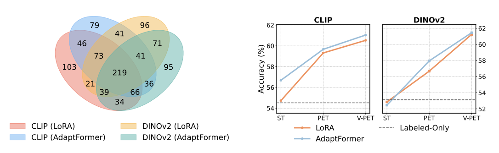
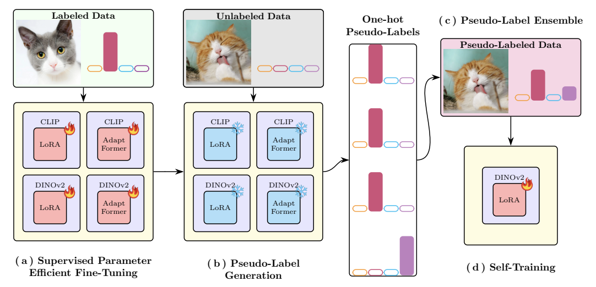
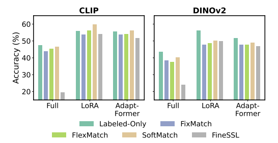
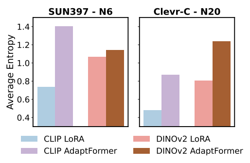
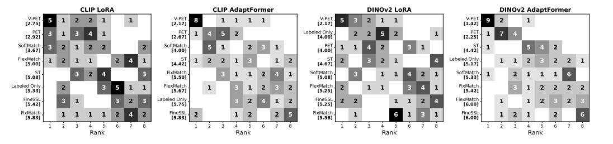
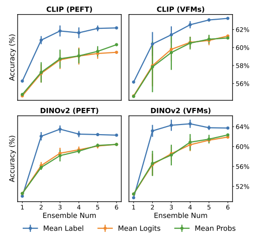

# 基盤モデル時代における半教師あり学習の再考

> 原題: Revisiting Semi-Supervised Learning in the Era of Foundation Models
> 著者: Ping Zhang, Zheda Mai, Quang-Huy Nguyen, Wei-Lun Chao
> 所属: The Ohio State University
> 出典: NeurIPS 2025
> コード: https://github.com/OSU-MLB/SSL-Foundation-Models

## Abstract（要旨）

半教師あり学習（SSL）は、限られたラベルあきデータと並んで豊富なラベルなしデータを活用することで、モデル性能を向上させる。Vision Foundation Models（VFM）が現代のビジョン応用の中心になるにつれ、本論文ではこれらの強力な事前学習モデルの文脈で SSL を再考する。我々は凍結された VFM が低性能となるタスクに関する体系的研究を行い、ファインチューニング時のいくつかの重要な洞察を明らかにする。第一に、ラベルあきデータのみを使用したパラメータ効率的ファインチューニング（PEFT: Parameter-Efficient Fine-Tuning）が、ラベルなしデータへのアクセスがあっても、伝統的な SSL 手法を凌駕することが多い。第二に、PEFT モデルが生成する疑似ラベルはラベルなしデータに対して価値ある教師信号を提供し、異なる PEFT 技術が補完的な疑似ラベルを生み出す。これらの発見は、VFM 時代のためのシンプルかつ効果的な SSL ベースラインを動機づける：*多様な PEFT 手法と VFM バックボーン間でアンサンブル疑似ラベリングを行うこと*。広範な実験がこのアプローチの有効性を検証し、VFM を伴う SSL への実用的な洞察を提供し、基盤モデル時代におけるよりスケーラブルで堅牢な半教師あり学習への道を切り拓く。

## 1 Introduction（はじめに）

機械学習（ML）モデルの品質は、入手可能なラベルあきデータの量に密接に結びつくことが多いが、アノテーションは高コストまたは労力を要する。豊富なラベルなしデータを限られたラベルあきデータと並んで活用する**半教師あり学習（SSL: Semi-Supervised Learning）** は、広範なラベリングなしで ML モデルを開発する有望なパラダイムとして登場した。過去数十年にわたり、この分野を進展させるために多数の SSL アルゴリズムが開発されてきた。深層学習時代の代表的手法には Mean Teacher、MixMatch、FixMatch があり、これらは蒸留と一貫性に基づいてラベルなしデータに動的に目的関数を課すことで学習性能を向上させる。*なお、これらの手法の多くは、もともとニューラルネットワークを「スクラッチから」訓練するために設計されたものである。*

最近では、外部のラベルあきまたはラベルなしデータでの事前学習が、多くの機械学習応用領域で事実上の標準になっている。例えばコンピュータビジョンでは、最近の多くのアルゴリズムが CLIP や DINOv2 のような**Vision Foundation Models（VFM）** に基づいて構築されている。これらのモデルは数百万、もしくは数十億のデータ点という巨大なデータセットで事前学習されている。結果として、幅広いタスクにわたって顕著な汎化性を示し、わずかなファインチューニングのみで、または場合によっては凍結バックボーンとして効果的に機能する。

両分野の有望な進展を踏まえ、本論文ではそれらの相互作用を探求する。具体的には、以下の質問に取り組む：既存の SSL アルゴリズムは VFM をバックボーンとして使用する際にも依然として有効か？性能を向上させるためにどのような調整が必要か？最後に、VFM の力を活用して、より効果的かつシンプルな SSL アルゴリズムを開発できるか？

**研究設計**: そのために我々は、視覚表現を評価するために設計された多様な分類タスクスイートである **Visual Task Adaptation Benchmark（VTAB）** に基づく新しい SSL ベンチマークデータセットを導入する。*我々の焦点は、凍結された VFM が低性能となるタスクであり、さらなるファインチューニングが必要であり、SSL が有益な解決策を提供できる場面である。* 我々は次に、3 つの代表的な SSL 手法 ——FixMatch、FlexMatch、SoftMatch—— を体系的に評価する。ハイパーパラメータは、教師なしドメイン適応のために提案された技術を用いて慎重に選択し、既存研究で議論されているデータリーク問題を回避する。

**重要な洞察**: 我々の経験的結果は 2 つの主要な発見を強調する。第一に、代表的 SSL アルゴリズムで VFM をファインチューニングすることは、ラベルあきデータのみを使ってファインチューニングする場合に対して限定的な利点しか提供しない。第二に、**パラメータ効率的ファインチューニング（PEFT）** ——VFM の大部分を凍結したまま小さなパラメータサブセットを更新するか、軽量な学習可能モジュールを追加する手法—— は、学習パラダイムに関わらず一貫して大幅な性能向上をもたらす。

これらの観察は 2 つの重要な方向性を含意する。第一に、VFM 専用に調整された SSL 手法が必要である。第二に、ラベルあきデータのみで訓練された PEFT モデルが標準的な SSL アプローチの性能にすでに匹敵することから、それらの予測——すなわち疑似ラベル——を活用することが、半教師あり設定における性能をさらに向上させる有望な道を提供する。

**VFM 時代の SSL ベースライン**: これらの洞察を基に、VFM をバックボーンとして活用するシンプルかつ効果的な SSL アプローチを導入する。我々の手法は**自己訓練（self-training）** の原理に基づいている。これは、モデルがラベルなしデータの疑似ラベルを生成し、さらなる訓練を導くために使用するという直接的な SSL 戦略である。伝統的な自己訓練は低品質な疑似ラベルに苦しむことが多いが、我々は VFM と PEFT 手法の 2 つの重要な特性——強力な初期性能と補完的な挙動——を活用することでこれに対処する。

具体的には、既存研究で観察されているように、異なる VFM バックボーンと PEFT 手法は、全体的な精度が類似していても、しばしば多様な予測を生み出す。図 1 に示すように、この多様性は複数の VFM-PEFT ペアからの予測を**アンサンブル**することを動機づける。多様な信頼度分布を明示的に補正することで、明示的なフィルタリングなしに、かなり堅牢な疑似ラベルを得る。その結果は、ラベルあきデータとラベルなしデータの両方を効果的に活用する、よりシンプルで信頼性の高い自己訓練パイプライン（図 2）であり、既存の SSL 手法を大幅に上回る性能向上を達成する。

我々は新たに提案したベンチマークデータセット上で、提案アプローチ**V-PET（VFM-PEFT Ensemble Training）** を広範に検証する。V-PET はほとんどのタスクで既存の SSL 手法を一貫して凌駕し、これには VFM にも基づく最近提案された FineSSL も含まれる。これらの結果は PET を基盤モデル時代のためのシンプルで効果的、競争力のある SSL ベースラインとして確立する。

<figure>



<figcaption>図1: 左: 様々な VFM と PEFT による上位 20% の高信頼度予測のベン図（DTD 3-shot 設定）。多様な疑似ラベル予測を生み出すという固有の特性を示している。右: これらの多様な疑似ラベル予測をアンサンブルすると、アンサンブル数が増えるほど（Self-Training → PET → V-PET）下流性能が漸進的に向上することを示す。結果は各ベンチマーク 12 設定の平均。</figcaption>
</figure>

**注釈**: 自己訓練、疑似ラベリング、アンサンブル手法は ML 文献で広範に研究されており、深層学習以前と深層学習時代の両方に渡る。我々の目標は既存手法と競合することではなく、基盤モデルの固有の特性を取り入れつつ、その強みを活用する*シンプルかつ効果的な半教師あり学習ベースラインを確立すること*である。アンサンブルにおける重要なステップは、多様で同等の性能を持つ複数のベース学習器を得ることである、と我々は指摘する。我々の貢献は、複数の基盤モデルと PEFT 手法の補完的挙動を活用することにある——基盤モデル時代に特化したアプローチである。

代表的 SSL 研究と一致して、我々の主要な焦点は分類である。それにもかかわらず、我々の洞察がセグメンテーションや検出のような他の下流 SSL タスクに転移可能であり、将来の研究を刺激することを期待する。

## 2 Related Works（関連研究）

**半教師あり学習（SSL）**: 近年、多くの SSL 手法は信頼性のある疑似ラベルの生成と選択に重点を置いてきた。FixMatch は固定の信頼度閾値を使用し、FlexMatch はクラス固有の閾値を採用し、SoftMatch はラベルの品質と量のバランスをとるためにソフト閾値を適用する。しかし、これらのアプローチはスクラッチからの訓練のために設計されており、VFM との互換性については未解決の問題が残っている。もう一つの重要なパラダイムは**自己訓練（self-training）** であり、(1) ラベルあきデータで教師を訓練し、(2) ラベルなしサンプルの疑似ラベルを生成し、(3) 両方で生徒を訓練する。疑似ラベルの信頼性を確保するには通常、教師なし事前学習、信頼度閾値、または一貫性制約が必要となる。我々は代わりに、より堅牢な疑似ラベルを生成するために VFM を活用し、スクラッチ指向の SSL アルゴリズムが基盤モデル時代にも有効であり続けるかを問う。

**転移学習と自己教師あり学習**: 転移学習——特に基盤モデルを効率的に適応させるための PEFT（または PETL）——は、下流タスクを促進するために事前学習モデルを長らく活用してきた。我々のアプローチでは、ラベルあきデータ上で PEFT を介して VFM をファインチューニングし、その後適応済みモデルを使ってラベルなし例の疑似ラベルを生成し、転移学習と半教師あり手法を橋渡しする。関連パラダイムである自己教師あり学習もラベルなしデータを利用し、しばしば SSL 比較のベースラインとして機能するが、低リソース設定では成り立たない可能性のある豊富なラベルなしデータを仮定する。

**Vision Foundation Models**: 大規模データで事前学習された Vision Transformer（ViT）は、現代の AI 開発に不可欠となった。**Vision Foundation Models（VFM）** と呼ばれるこれらのモデルは、幅広いタスクで優れた性能を示している。例えば、数百万の画像-テキストペアで訓練された CLIP-ViT は、前例のないゼロショット能力と分布シフトへの堅牢性を示し、様々な強力な生成モデルのエンコーダとして機能する。一方、自己教師あり目的関数を用いてキュレーションされた広範な画像セットで事前学習された DINOv2 は、きめ細かい位置特定特徴量を効果的に捉える。さらに、戦略的に複数の VFM を融合することで相乗的な利得を引き出せるとの認識が広がっており、視覚質問応答からオブジェクト検出までの最先端性能をもたらしている。

**SSL のための VFM 活用**: VFM の存在感が増す中、SSL での使用を探求した最近の研究は少ない。我々の研究と最も関連性が高いのは **FineSSL** であり、これは SSL 設定での CLIP 視覚バックボーンの使用を具体的に調査し、平衡マージン softmax による疑似ラベル精錬を伴う。評価は CIFAR-10 のような単純な小規模データセットに限定されており、そこでは凍結 VFM がすでに高い精度を達成できる。他のいくつかの研究は、CLIP のような完全 VFM とビジョン・テキストエンコーダの両方を持つゼロショット能力を持つ VFM のみに研究を制約している。対照的に、我々の研究は VFM の多様性と評価ベンチマークの両方に範囲を広げ、基盤モデル時代における SSL の初の包括的研究を確立する。

**表1: 人気の SSL データセット（CIFAR、Food101）と我々のベンチマーク間の教師あり線形プロービング性能（%）の比較。N は 1 クラスあたりのラベルサンプル数。凍結 VFM は標準 SSL データセットで既に優れているが、我々のベンチマーク——多様なタスク、ドメイン、サイズで構成される——では苦戦する。これは VFM の完全な潜在能力を引き出すための SSL の可能性を強調する。**

|  | CIFAR-10 (N=4) | CIFAR-100 (N=100) | FOOD-101 (N=10) | DTD (N=6) | SUN397 (N=2) | RESISC45 (N=6) | Retinopathy (N=80) | CLEVR-C (N=20) | KITTI (N=10) |
|---|---|---|---|---|---|---|---|---|---|
| CLIP | 85.0 | 78.3 | 80.2 | 61.8 | 63.7 | 69.3 | 35.9 | 33.1 | 51.1 |
| DINOv2 | 91.7 | 88.1 | 83.1 | 66.7 | 65.3 | 52.4 | 41.2 | 30.5 | 51.3 |

## 3 On Evaluation of SSL in the Era of VFMs（VFM 時代における SSL の評価について）

### 3.1 Problem Definition（問題定義）

ラベルなしデータセット $\mathcal{U} := \{\boldsymbol{x}_i^u\}_{i=1}^{|\mathcal{U}|}$ がはるかに小さいラベルあきデータセット $\mathcal{L} := \{(\boldsymbol{x}_i^l, y_i^l)\}_{i=1}^{|\mathcal{L}|}$ と並んで存在する $C$ クラス分類問題を SSL で考える。ここで $\boldsymbol{x}_i^l$ と $\boldsymbol{x}_i^u$ は訓練サンプル、$y_i^l$ はグランドトゥルースクラスラベルであり、$|\mathcal{U}| \gg |\mathcal{L}|$ を満たす。SSL は $\mathcal{U}$ と $\mathcal{L}$ を使ってパラメータ $\boldsymbol{\theta}$ を持つモデル $f_{\boldsymbol{\theta}}$ を学習することを目指す。$\boldsymbol{\theta}$ をランダムに初期化する従来の SSL と異なり、我々のフレームワークは VFM（例：CLIP や DINOv2）から開始し、下流タスクのためにファインチューニングする。

### 3.2 A Comprehensive SSL Image Classification Benchmark（包括的 SSL 画像分類ベンチマーク）

SSL の最近の進展にもかかわらず、ほとんどの研究は CIFAR-10/100、STL-10、Food101 のような古典的データセットでの評価を続けている。しかし、これらのベンチマークは VFM の下で 2 つの主要な制限を示す：**VFM 下での困難さの減少**: 先行 PEFT-on-VFM 研究に倣い、我々は主要な性能指標として線形プロービングを使用する。表 1 に示すように、凍結 VFM バックボーン上での線形プロービングは、限られたラベルあきデータでさえ顕著な精度を提供する。様々な分類ヘッドサイズの結果も付録 B.4 に報告する。**ドメインカバレッジの狭さ**: これらのベンチマークは主に自然画像に焦点を当てているため、実世界の VFM 応用の限定的な視点しか提供しない。VFM 時代の SSL 手法を効果的に評価するため——半教師あり画像分類のみに焦点を当てた——、異なるドメインとデータセットサイズ間の実世界応用の複雑さを捉えるように設計された新しいベンチマークを提案する。

**データセットとレジーム**: VTAB プロトコルに従い、3 つの VTAB カテゴリ——**Natural、Specialized、Structured**——から 6 つの分類データセットを選択する。具体的には、各カテゴリから 2 つのデータセットを選ぶ：*Natural* から DTD と SUN397、*Specialized* から RESISC45 と Retinopathy、*Structured* から CLEVR-C と KITTI。これらのデータセットは、テクスチャ認識、シーン理解、リモートセンシング、医療画像、合成推論、自動運転を含む多様なドメインに渡る。SSL 手法の堅牢性を評価するため、1 クラスあたりのラベルサンプル数を変化させ、**線形プロービング**を評価プロトコルとして採用する。ショット数は、凍結された表現でも各タスクを十分に挑戦的に保つために選ばれている。この構成は表 1 で強調されているように、凍結表現に実質的な困難をもたらし、その完全な潜在能力を引き出すための SSL の必要性を強調する。データセットの概要は表 2 に示し、詳細な説明は付録 A にある。これらを合わせて、このベンチマークは半教師あり画像分類のより多様で包括的な基盤モデル時代の評価を提供する。

### 3.3 Fair Hyperparameter Tuning for SSL（SSL のための公正なハイパーパラメータチューニング）

ハイパーパラメータチューニングは SSL における長年の課題であり、既存文献の多くで曖昧で標準化されていないままである。ラベルあきデータの希少性のため、標準的な訓練-検証分割はしばしば実行不可能である。保留したラベルあき検証集合やテスト集合でのチューニングは、大幅なデータリークを引き起こし、過度に楽観的な結果と不公正な比較をもたらす可能性がある。この問題に取り組み、我々のベンチマークを補完するため、SSL におけるハイパーパラメータチューニングのためのより厳密なプロトコルを確立する。

**表2: ベンチマークの概要。Rem. Sen.: リモートセンシング; Recog.: 認識; $|\mathcal{L}|$: ラベルあき訓練データ数; $|\mathcal{U}|$: ラベルなし訓練データ数。**

| データセット | タスク | ドメイン | $|\mathcal{L}|+|\mathcal{U}|$ | クラス数 | $|\mathcal{L}|$/クラス |
|---|---|---|---|---|---|
| DTD | Recog. | Textural | 3,008 | 47 | 3, 6 |
| SUN397 | Recog. | Natural | 49,601 | 397 | 3, 6 |
| RESISC45 | Recog. | Rem. Sen. | 20,160 | 45 | 1, 2 |
| Retinopathy | Recog. | Medical | 36,825 | 5 | 4, 8 |
| CLEVR-C | Count | Synthetic | 56,000 | 8 | 1, 2 |
| KITTI | Depth | Auto Drive | 5,416 | 4 | 5, 10 |

我々の核心的洞察は、SSL の定義的特性——豊富なラベルなし*訓練*データ——を活用して、教師なしの方法でパラメータを調整し、データリークの落とし穴を回避することである。最近の研究では、ドメイン適応のためにこのようなアイデアを探求し、RankMe や AMI のような教師なし基準を使用して各ハイパーパラメータ設定の有効性を推定している。

しかし、その研究はまた、すべてのシナリオで信頼できるハイパーパラメータを選択できる単一基準は存在しないことも明らかにした。この発見に動機づけられ、我々は**7 つの教師なし基準**——特徴量から導出される 5 つ（AMI、ARI、V-Measure、FMI、BNM）と、ロジットから導出される 2 つ（RankMe、CHI）——をより堅牢な選択のために統合することを提案する。具体的には、各ハイパーパラメータ設定とその対応するモデルについて、保留した教師なし*検証*集合 $\mathcal{V} := \{\boldsymbol{x}_i^v\}_{i=1}^{|\mathcal{V}|}$ を使用して 7 つの基準すべてを計算する。次に、各基準ごとにすべてのハイパーパラメータ設定をランク付けし、それらすべてで最低の平均ランクを達成するものを選ぶ。形式的な定義と詳細な手順は付録 C.1 に、提案手法の有効性は §6.3 で示す。保留したラベルあき検証集合への依存を排除することにより、我々の手法はデータリークを緩和し、SSL のためのより実用的で公正なチューニングプロトコルを促進する。

## 4 Systematic Evaluation of SSL with VFMs（VFM を伴う SSL の体系的評価）

我々のベンチマーク（表 1）における凍結 VFM の苦戦する性能を踏まえ、その有効性を高めるために 2 つの直接的な戦略を考える：(1) ラベルあきデータのみでファインチューニングすることで VFM の固有の汎化性を活用する、(2) ラベルあきとラベルなしの両方のデータを活用するために SSL を採用する。§3 で導入した多様なベンチマークとハイパーパラメータチューニングプロトコルを用いて、既存の SSL アルゴリズムが VFM をバックボーンとして採用する際にも有効であり続けるかを調査することを目指す。

**評価設定**: 2 つの代表的 VFM ——**ViT-B/16 CLIP** と **ViT-B/14 DINOv2** ——に焦点を当てる。これらは言語-画像対比事前学習と自己教師あり事前学習戦略をそれぞれカバーする。4 つの代表的 SSL 手法——**FixMatch、FlexMatch、SoftMatch、FineSSL**——を検討し、ベースラインとしてラベルあきのみのファインチューニングを使用する。**AdamW** オプティマイザを使用し、バッチサイズ 32 と重み減衰 $5 \times 10^{-4}$ で 35 エポックモデルをファインチューニングする。学習率と他のハイパーパラメータは提案したチューニングプロトコルで調整する。分類性能はテストデータセットの Top-1 精度で評価する。

**ラベルあきのみファインチューニングの驚くべき有効性**: 驚くべきことに、公正な比較の下で、*完全な*ファインチューニングは 1 クラスあたりわずか数枚のラベルあき画像でも SSL 手法に匹敵するか凌駕する（図 3 で示される）。言い換えれば、大量の追加ラベルなしデータがあっても、SSL は限られたラベルあきデータで VFM をファインチューニングする場合に対してほとんど利点を提供しない。この発見は、7 年前に行われた包括的調査でなされた観察を彷彿とさせる。

SSL 手法でラベルなしデータに関連する本質的にノイズの多い教師信号のため、SSL に VFM のすべてのパラメータを更新させることは、その組み込みの汎化性を意図せず低下させる可能性があると我々は仮説を立てる。

**PEFT は救いになるか？**: ラベルあき下流データが希少な場合、最近の研究では**パラメータ効率的ファインチューニング（PEFT）** ——パラメータの小さなサブセットを更新するか、凍結された VFM に軽量な学習可能モジュールを導入する手法——が VFM 上で完全なファインチューニングをしばしば凌駕することが示されている。ラベルあきデータが限られた SSL シナリオを検討する際、自然な疑問が生じる：PEFT は SSL と互換性があるか？最近の研究は SSL に PEFT を適用する初期の試みを行ったが、異なる VFM バックボーン、PEFT 手法、SSL アプローチとの包括的な互換性分析はまだ欠けている。したがって、2 つの一般的に使用される PEFT 戦略を評価する：**LoRA**（Transformer 層の重み更新を近似するために追加的な低ランク行列を訓練する）と**AdaptFormer**（コンピュータビジョンで効果的であることが証明されたアダプタベースアプローチ）。これらの PEFT 手法のハイパーパラメータを調整するために §3 で示されたのと同じプロトコルに従う。

図 3 の結果は、PEFT が確かに VFM 上で SSL を改善することを示している。しかし、それはラベルあきのみのファインチューニングも改善し、結果は SSL に匹敵するままである。これは VFM と組み合わせた場合の既存の SSL 手法でラベルなしデータを使用することの限定的な有効性を強調する。

**議論**: これらの発見から 3 つの重要な要点が浮かび上がる。第一に、よく調整されたラベルあきのみの PEFT が VFM を伴う SSL の競争力のあるベースラインとして機能する。第二に、既存の SSL 手法でのラベルなしデータの非効率な使用は、VFM 専用に設計された SSL アプローチの必要性を強調する。最後に、ラベルあきのみの PEFT が SSL に匹敵する精度を達成できることを考えると、ラベルなしデータでのその予測は十分な品質の疑似ラベルを生成する。これらの疑似ラベルを活用してモデル性能をさらに高めることは有望な方向性である。

## 5 A Simple, Effective SSL Baseline for VFMs（VFM のためのシンプルで効果的な SSL ベースライン）

§4 の議論をまとめるため、Vision Foundation Models に特化した新しい半教師あり学習手法を提案する。具体的には、**自己訓練（self-training）** ——モデルを改善する追加の教師信号としてラベルなしデータからの疑似ラベルを使用する、概念的にシンプルな SSL ベースライン——に基づいて構築する。以降のセクションでは、まず自己訓練を簡潔にレビューする。

### 5.1 Self-training（自己訓練）

$\boldsymbol{x}$ が与えられたクラス $c$ の予測事後確率を $p(c|\boldsymbol{x}; f(\boldsymbol{\theta}))$ と表記する。自己訓練の核心アイデアは、高信頼度予測に基づいてラベルなしデータ $\mathcal{U} = \{\boldsymbol{x}_i^u\}_{i=1}^{|\mathcal{U}|}$ に徐々に疑似ラベルを割り当てることである：

$$\hat{y}_i^u := \arg\max_c p(c | \boldsymbol{x}_i^u; f_{\boldsymbol{\theta}}) \quad \text{if} \quad \max_c p(c | \boldsymbol{x}_i^u; f_{\boldsymbol{\theta}}) \geq \tau$$

これらの疑似ラベル付きデータを教師あり学習用のラベルあき集合 $\mathcal{L} = \{(\boldsymbol{x}_i^l, y_i^l)\}_{i=1}^{|\mathcal{L}|}$ に追加する。ここで $\boldsymbol{\theta}$ は現在の分類器の重みを表し、$\tau$ は信頼度閾値である。もし (a) 高信頼度予測が正しく、(b) 更新されたモデルが残りのデータでの信頼度を徐々に増加させるなら、自己訓練は完全なラベルでの完全教師あり学習と同等の効果を持ち得る。

我々の文脈では、ラベルあきデータセット $\mathcal{L}$ を使って PEFT でファインチューニングされた VFM が、$\mathcal{U}$ の疑似ラベルを生成するための現在のモデルとして機能し、その後 VFM をさらにファインチューニングするために使用される。

**課題**: 自己訓練は概念的にはシンプルだが、信頼度閾値 $\tau$ を選択するのは難しい。高い $\tau$ は誤ったラベル付きサンプルを除外するが、学習用にはあまりにも少ないサンプルしか残さない。低い $\tau$ はバイアスを強化するエラーを許容する。さらに、最適な $\tau$ は反復間でシフトする。疑似ラベル選択の広範な研究にもかかわらず、ほとんどのアプローチは発見的または過度に複雑なままで、自己訓練の実用性と信頼性を損なう。

**我々の目標**: 上記の課題を回避しながらラベルあき専用 PEFT からの高品質疑似ラベルを活用するため、シンプルで効果的かつ実用的な自己訓練ベースの SSL アルゴリズムを開発することを目指す。具体的には、利用可能なすべての疑似ラベル（すなわち $\tau = 0$ に設定）を活用することで複雑な疑似ラベル選択の必要性を排除することを目指す。これにより自己訓練を 1 ラウンドで完了させることも可能になり、追加のハイパーパラメータを除去する。

<figure>



<figcaption>図2: V-PET の図解。VFM の時代に豊富なラベルなしデータと希少なラベルあきデータを効果的に活用するため、我々のアプローチは 4 つのフェーズに従う：(a) Supervised Parameter Efficient Fine-Tuning（教師あり PEFT）—— 様々な PEFT アルゴリズムを用いて事前学習 VFM をラベルあきデータでファインチューニング；(b) Pseudo-Label Generation（疑似ラベル生成）—— ファインチューニング済み VFM の汎化能力を活用してラベルなしデータの疑似ラベルを生成；(c) Pseudo-Label Ensemble（疑似ラベルアンサンブル）—— 複数のファインチューニング済み VFM の疑似ラベルを集約して堅牢性を高める；(d) Self-Training（自己訓練）—— すべての知識を 1 つのモデルに統合する。</figcaption>
</figure>

### 5.2 Ensembling of multiple PEFT and VFMs（複数の PEFT と VFM のアンサンブル）

我々の目標を達成するための必要なステップは、エラー伝播を防ぐために疑似ラベルが十分に高い品質であることを保証することである。そのため、複数のモデルからの予測を組み合わせて疑似ラベルの全体的な品質と信頼性を高める**アンサンブル技術**を採用する。

**何をアンサンブルするか？**: ブートストラッピング、ランダム初期化、または周期的学習率スケジュールを通じて複数の同等の性能を持つが多様なベース学習器を訓練する従来の手法とは異なり、我々のアプローチは**PEFT と VFM の独特な特性**を活用する。具体的には、異なる PEFT 手法が下流タスクで類似の全体精度を達成しながら、個々のサンプルに対して多様な予測を生み出すことが観察されている。同様に、異なるデータセットや異なる目的関数で訓練された VFM は多様な能力を示し、どのモデルも明確な全体的優位性を示さない。

**どうアンサンブルするか？**: 異なる予測をアンサンブルする一般的な戦略は、(a) **Mean Logits**——クラスロジットの平均化、(b) **Mean Probabilities**——クラス確率の平均化（両方とも同様の出力スケールを仮定する。典型的には同一アーキテクチャとブートストラップ訓練の場合）。しかし、異なる方法で訓練され様々な PEFT 手法でファインチューニングされた VFM は、一貫性のないスケールを生み出し（図 4）、いくつかのモデルが支配的になりアンサンブルを弱める。

**Algorithm 1: V-PET（図 2）**

```
入力: ラベルあきデータセット L とラベルなしデータセット U
      n ∈ [1, N] でインデックスされる PEFT 手法
      m ∈ [1, M] でインデックスされる VFM
      PEFT 上の VFM の初期化パラメータ θ_{n,m}

出力: 最適なパラメータ θ*

// (a) Supervised Parameter Efficient Fine-Tuning
for n ∈ [1, N], m ∈ [1, M] do:
    θ̃_{n,m} = θ_{n,m} を L 上でファインチューニング

// (b) Pseudo-Label Generation
for n ∈ [1, N], m ∈ [1, M] do:
    P_{n,m} = { one_hot(argmax_c f_{θ̃_{n,m}}(u)) | ∀u ∈ U } を計算

// (c) Pseudo-Label Ensemble
アンサンブル疑似ラベル P = {p̄_i}^{|U|}, ここで:
    p̄_i = (1/(N×M)) Σ_{n∈[1,N], m∈[1,M]} P_{n,m}[i]

// (d) Self-Training
n* ∈ [1, N], m* ∈ [1, M] を選択し、P 上で θ_{n*,m*} をファインチューニング
して θ* を得る
```

この問題に対処するため、**Mean Labels** と呼ぶシンプルな解決策を導入する。まず各モデルから予測を取得し、一様性を保証するために one-hot エンコーディングに変換し、ソフト疑似ラベルを得るために平均化する。最後に、平均化されたソフト疑似ラベルを使って拡張されたデータセット $\mathcal{P}$ を生成し、PEFT ベースの VFM モデルをファインチューニングする。アルゴリズム 1 で提案パイプラインを提示する。

**アンサンブルの時間効率**: アルゴリズム 1 のステップ (a)〜(d) の中で、ステップ (d) が壁時計時間を支配する。なぜなら疑似ラベル集合はラベルあき集合よりも桁違いに大きいからである。我々の手法は $N \times M$ モデルをアンサンブルするが、全体的な時間オーバーヘッドはわずかなままである：ステップ (a) はラベルあき集合が小さいため高速で、ステップ (b) と (c) は計算的に軽い。例えば、V-PET の場合、推定実行時間は他の SSL ベースラインの約 **1.16 倍**にすぎない。

## 6 Experiment（実験）

4 つの質問に取り組むために実験を行う——(1) 我々の手法は既存の SSL とどう比較されるか？ (2) より多くの PEFT と VFM でスケールするか？ (3) アンサンブル戦略はどの程度効果的か？ §3 と §4 のセットアップに従い、2 つのバリアントを評価する：**V-PET**（PEFT 手法と VFM 全体でのアンサンブル）と **PET**（単一 VFM 上の PEFT 手法のアンサンブル）。ベースラインとして **ST**（アンサンブルなしの自己訓練）を使用し、すべての場合で疑似ラベルでファインチューニングする前に元の事前学習 VFM から再初期化する。

<figure>



<figcaption>図3: 12 設定全体で完全ファインチューニングまたは PEFT を使った平均 SSL 精度。公正なハイパーパラメータチューニングでは、限定的なラベルでのファインチューニングが SSL を凌駕できる；PEFT は SSL を改善するがラベルあきのみのファインチューニングと同等にとどまる。現在の VFM ベース SSL におけるラベルなしデータの利点は最小限であることを示している（付録 B.3 を参照）。</figcaption>
</figure>

<figure>



<figcaption>図4: 異なるファインチューニング済み VFM の予測確率分布の平均エントロピー。疑似ラベル間のエントロピーギャップを強調し、キャリブレーション不良を示している。</figcaption>
</figure>

### 6.1 Performance Comparison（性能比較）

12 設定全体での ST、PET、V-PET と既存 SSL 手法間の性能比較を表 3 にまとめる。**平均（Average）** 列に示されているように、全体的に V-PET は他と比較して優れた性能を達成している。結果をさらに分析するため、図 5 はランキング頻度を可視化する。ここで各行列エントリ $(i, j)$ は手法 $i$ が 12 設定全体で $j$ 番目にランクされる頻度を示す。次に、各手法の平均ランク（括弧内の数字）を計算し、それに応じてソートする。V-PET はすべての単一設定で 1 位を獲得しないが、最も頻繁にトップランクを確保し、疑似ラベルアンサンブルの有効性を示し、VFM 時代における**シンプルかつ強力なベースライン**として確立する。

3 つの ST ベース手法をより深く掘り下げると、図 1 に示すように、より多様な疑似ラベルがアンサンブルに導入されるにつれて一貫した性能向上が観察される（すなわち ST → PET → V-PET）。これは疑似ラベル間の多様性の重要性を強調する。

### 6.2 Scalability of Ensembling（アンサンブルのスケーラビリティ）

我々の実験のほとんどは LoRA と AdaptFormer のアンサンブルを探求するが、追加の疑似ラベルソースを統合する際にアンサンブル手法がどれだけうまくスケールするかも検討する。具体的には、評価を 2 つの次元——VFM と PEFT 手法——に拡張して、アンサンブル戦略のより広い適用性を評価する。

**VFM**: ViT-B（CLIP、DINOv2）を超えて、合計 6 つの VFM をさらに 4 つ組み込む。4 つの ViT-B（CLIP、DINOv2、OpenCLIP、ImageNet21k）と 2 つの ViT-L（CLIP、DINOv2）を含む。

**PEFT**: 同じセットアップに従い、LoRA と AdaptFormer から始めて、4 つの追加 PEFT を続ける：**ConvPass、BitFit、VPT-Deep、Fact-TT**。これらの手法は、選択ベース、アダプタベース、プロンプトベース技術を含む幅広い PEFT アプローチに渡る。

**表3: 6 つの多様なデータセット（12 設定）でのベースライン、既存 SSL アプローチ、我々の提案手法の性能（%）比較。各 PEFT と VFM 内での最良結果は**太字**で強調される。完全な結果は付録 B.2 に報告される。**

|  |  | DTD-3 | DTD-6 | SUN397-3 | SUN397-6 | RESISC45-1 | RESISC45-2 | Retin.-40 | Retin.-80 | CLEVR-10 | CLEVR-20 | KITTI-5 | KITTI-10 | Average |
|---|---|---|---|---|---|---|---|---|---|---|---|---|---|---|
| **CLIP / LoRA** |  |  |  |  |  |  |  |  |  |  |  |  |  |  |
|  | Labeled Only | 57.9 | 64.1 | 60.7 | 66.8 | 59.5 | 72.1 | 35.4 | 42.2 | 35.2 | 50.8 | 60.1 | 64.3 | 55.7 |
|  | FixMatch | 56.8 | 68.6 | 62.2 | 72.8 | 47.6 | 77.4 | 32.5 | 39.1 | 32.2 | 42.6 | 59.8 | 52.6 | 53.7 |
|  | FlexMatch | 56.5 | 67.0 | 66.4 | 71.9 | 51.2 | 78.4 | 32.8 | 38.7 | 36.9 | 75.4 | 44.6 | 55.0 | 56.2 |
|  | SoftMatch | 59.8 | 68.0 | 66.3 | 70.9 | 78.7 | 83.7 | 42.1 | 42.9 | 29.8 | 71.2 | 42.9 | 60.5 | 59.7 |
|  | FineSSL | 63.1 | 69.1 | 56.3 | 61.8 | 74.2 | 83.5 | 35.0 | 43.6 | 33.6 | 48.1 | 53.7 | 48.2 | 53.9 |
|  | ST | 58.9 | 63.8 | 49.2 | 52.7 | 64.4 | 77.4 | 35.7 | 42.5 | 36.5 | 51.6 | 59.8 | 64.3 | 54.7 |
|  | PET | 63.4 | 68.2 | 65.6 | 70.8 | 67.5 | 78.6 | 36.4 | 42.4 | 38.3 | 54.6 | 60.3 | 65.7 | 59.3 |
|  | **V-PET** | **65.6** | **71.7** | **67.2** | **72.8** | 66.6 | 77.2 | 38.9 | 51.2 | 36.7 | 58.5 | 58.0 | 62.3 | **60.5** |
| **CLIP / AdaptFormer** |  |  |  |  |  |  |  |  |  |  |  |  |  |  |
|  | Labeled Only | 61.5 | 65.0 | 61.1 | 68.2 | 61.0 | 72.8 | 34.4 | 39.0 | 37.8 | 48.6 | 57.8 | 59.1 | 55.6 |
|  | FixMatch | 61.2 | 67.3 | 64.6 | 71.2 | 63.1 | 80.5 | 29.0 | 42.4 | 33.1 | 44.8 | 30.0 | 57.2 | 53.7 |
|  | FlexMatch | 60.3 | 68.8 | 64.3 | 70.7 | 58.1 | 78.1 | 31.0 | 35.9 | 38.5 | 52.2 | 34.2 | 54.2 | 53.9 |
|  | SoftMatch | 61.3 | 69.3 | 65.3 | 72.3 | 67.0 | 83.6 | 38.2 | 42.7 | 34.5 | 56.1 | 33.9 | 55.1 | 56.3 |
|  | FineSSL | 61.9 | 68.1 | 58.4 | 64.9 | 73.9 | 84.2 | 25.3 | 29.8 | 26.0 | 36.9 | 42.2 | 47.1 | 51.6 |
|  | ST | 62.0 | 67.2 | 58.1 | 61.5 | 68.8 | 79.3 | 34.4 | 39.6 | **39.0** | 50.3 | 58.2 | 61.9 | 56.7 |
|  | PET | 63.8 | 68.9 | 66.8 | 71.7 | 69.5 | 80.2 | 37.1 | 41.5 | 38.4 | 55.8 | **60.5** | 61.7 | 59.7 |
|  | **V-PET** | **65.7** | **71.8** | **67.8** | 73.2 | 67.9 | 78.4 | 38.9 | 51.2 | 37.0 | 59.0 | 58.2 | **63.3** | **61.0** |
| **DINOv2 / LoRA** |  |  |  |  |  |  |  |  |  |  |  |  |  |  |
|  | Labeled Only | 61.0 | 68.4 | 59.7 | 66.8 | 48.6 | 63.1 | 40.7 | 48.0 | 35.9 | 61.7 | 46.7 | 71.7 | 56.0 |
|  | FixMatch | 57.4 | 68.4 | 56.6 | 71.4 | 36.6 | 66.7 | 38.1 | 41.2 | 35.7 | 41.0 | 14.8 | 42.9 | 47.6 |
|  | FlexMatch | 52.8 | 65.4 | 55.7 | 67.7 | 33.1 | 72.6 | 36.6 | 35.8 | **37.1** | **66.9** | 26.2 | 33.6 | 48.6 |
|  | SoftMatch | 53.6 | 64.0 | 60.4 | 67.3 | 46.6 | 79.5 | 32.1 | 44.5 | 33.6 | 65.1 | 27.4 | 27.9 | 50.2 |
|  | FineSSL | 66.9 | 72.7 | 54.6 | 62.1 | **69.8** | **87.4** | 31.0 | 24.6 | 24.8 | 31.7 | 31.9 | 39.8 | 49.8 |
|  | ST | 52.3 | 56.9 | 45.4 | 50.5 | 54.7 | 72.4 | **42.6** | 49.6 | 36.3 | 52.7 | 57.3 | **77.8** | 52.9 |
|  | PET | 66.7 | 72.2 | 58.6 | 65.3 | 55.8 | 70.6 | 41.0 | **54.3** | 33.1 | 56.9 | 42.6 | 63.3 | 56.7 |
|  | **V-PET** | **67.8** | **74.1** | **67.1** | **73.2** | 66.0 | 77.0 | 39.2 | 52.5 | 36.8 | 59.3 | **58.2** | 63.7 | **61.2** |
| **DINOv2 / AdaptFormer** |  |  |  |  |  |  |  |  |  |  |  |  |  |  |
|  | Labeled Only | 63.0 | 67.6 | 58.9 | 67.0 | 47.0 | 57.4 | 34.4 | 53.1 | 27.3 | 41.8 | 52.3 | 49.8 | 51.6 |
|  | FixMatch | 59.5 | 70.4 | 57.9 | 69.7 | 26.4 | 62.3 | 38.7 | 45.6 | 32.7 | 38.9 | 19.8 | 50.4 | 47.7 |
|  | FlexMatch | 57.1 | 65.9 | 56.0 | 67.5 | 51.3 | 64.0 | 33.4 | 40.2 | 33.4 | 42.2 | 34.3 | 27.9 | 47.8 |
|  | SoftMatch | 58.7 | 66.2 | 60.0 | 66.7 | 53.1 | 78.1 | 33.5 | 32.2 | 32.9 | 45.0 | 24.5 | 30.9 | 48.5 |
|  | FineSSL | 64.0 | 71.2 | 56.0 | 63.1 | 62.3 | 69.7 | 17.7 | 24.3 | 25.8 | 30.0 | 31.8 | 45.0 | 46.8 |
|  | ST | 62.5 | 67.0 | 59.0 | 67.1 | 54.1 | 66.2 | 34.9 | **56.0** | 27.4 | 45.1 | 43.9 | 48.7 | 52.5 |
|  | PET | 67.2 | 73.0 | 63.5 | 70.9 | 56.2 | 72.0 | **40.2** | 55.5 | 33.1 | 58.0 | 45.2 | 60.9 | 58.0 |
|  | **V-PET** | **68.2** | **74.2** | **71.7** | 73.4 | 66.3 | 78.0 | 39.4 | 52.5 | 36.8 | 60.0 | 59.2 | **61.7** | **61.5** |

**Mean Label が一貫して凌駕する**: 図 6 に示すように、3 つのアンサンブル戦略を調査する：(1) **Mean Label**（我々の提案）；(2) **Mean Logits**；(3) **Mean Probabilities**。Mean Label 戦略が 3 つの中で最も効果的であることがわかる。異なるアンサンブルソースとアンサンブルサイズ全体で他の 2 つの戦略を一貫して凌駕する。これは Mean Label アプローチが疑似ラベルの多様性をより良く捉え、アンサンブルソースからの情報利用を最大化することを示唆する。

**PEFT と VFM の両方が助ける**: 異なる PEFT または VFM 全体で生成された疑似ラベルをアンサンブルすると、性能は一貫して改善され、両方が疑似ラベルの多様性に貢献しアンサンブルの堅牢性を向上させることを示す。

**収穫逓減**: アンサンブルソースの数を増やすにつれて性能改善は逓減し、アンサンブルからの性能向上が線形にスケーラブルでないことを示唆する。性能と計算コストのバランスを取るため、この場合は **2 から 4** を使用することを推奨する。

**疑似ラベル品質の影響**: V-PET を適用する際、ある人は疑問に思うかもしれない：異なる VFM の性能が大きく異なる場合、それらの疑似ラベルを依然としてアンサンブルして下流結果を高めることができるか？答えはイエスであり、付録 B.6 で結果を示す。

### 6.3 The Effectiveness of Hyperparameter Tuning（ハイパーパラメータチューニングの有効性）

提案したハイパーパラメータチューニング戦略が SSL 手法の性能を正確に評価するかも調査した。その利点を説明するため、2 つのベースラインと比較する。両方ともオラクルテスト性能からの絶対差で測定される。具体的には、オラクルテスト性能は全ハイパーパラメータ探索空間全体で最高の精度として定義される；各手法はハイパーパラメータ構成を選択し、その結果の精度がこの最適からどれだけ離れているかを記録する。この差の絶対値を取ることで、各チューニング手法が最良の可能な結果にどれだけ近似しているかを定量化する。

<figure>



<figcaption>図5: 提案されたベンチマークでの SSL 手法全体のランキング頻度。(i, j) の数字は、12 設定全体で手法 i が j 番目にランクされる頻度を示す。括弧内の数字は平均ランクで、高いランクほど良い。</figcaption>
</figure>

**表4: ハイパーパラメータチューニング比較：我々の手法 vs ベースライン（ランダムまたは 1 つの基準で選択）。オラクルテスト精度からの絶対誤差（%）（小さいほど良い）は、12 データセット、5 SSL ベースライン、2 PEFT で訓練された 2 VFM 全体で平均化されている。報告値は平均 ± 標準偏差形式。**

| RankMe | AMI | ARI | V-Measure | FMI | CHI | BNM | Random | **Ours** |
|---|---|---|---|---|---|---|---|---|
| 7.9±8.6 | 2.8±5.0 | 2.8±4.9 | 2.8±4.9 | 2.9±4.9 | 3.7±7.0 | 12.0±12.1 | 8.9±8.1 | **2.6±4.3** |

我々のベースラインは：(1) *Random expectation*（探索空間からランダムに選んだハイパーパラメータで得られる平均性能を表す）、(2) *Single criterion*（1 つのメトリックのみを使用して最良ハイパーパラメータ構成を選択する）。(1) との比較は、純粋にランダムな選択と比較して我々の手法がどれだけうまく探索空間を活用しているかについての洞察を提供し、(2) との比較は複数の評価基準を統合する利点を示す。表 4 に示すように、12 データセット、5 SSL ベースライン、2 VFM（CLIP と DINOv2）、2 PEFT 手法（LoRA と AdaptFormer）全体で、各手法の選ばれた精度とオラクルの最良精度（すなわち探索空間で達成可能な最大精度）の間の平均絶対誤差を測定する。

<figure>



<figcaption>図6: より多くの PEFT 手法と VFM をアンサンブルするためのスケーリング分析。LoRA ファインチューニングから始めて、性能は多様な疑似ラベルで改善されるが、アンサンブルソースが増えるほど利得は逓減する。Mean Label は一貫して Mean Logits と Mean Probabilities を凌駕する。</figcaption>
</figure>

我々の手法はほとんどのケースで両方のベースラインを凌駕する。これは複数のメトリックを組み合わせることが SSL 手法のより信頼性が高く堅牢な評価をもたらすことを示唆する。将来の研究がこのアプローチを採用して SSL 評価を強化することを期待する。

## 7 Conclusion（結論）

我々は VFM の時代における SSL の包括的で体系的な経験的研究を行い、VFM は依然として SSL から恩恵を受けることができるが、専用に調整されたアプローチが必要であることを明らかにした。特に、複数の VFM とパラメータ効率的ファインチューニング（PEFT）技術からの疑似ラベルをアンサンブルするシンプルだが非常に効果的な自己訓練アルゴリズムを提案する。全体的に、我々の研究は VFM を伴う SSL への実用的な洞察を提供し、基盤モデル時代におけるよりスケーラブルで実用的な半教師あり学習の基盤を築く。

## Acknowledgment（謝辞）

本研究は National Science Foundation（ICICLE: OAC-2112606）の助成金により支援されている。Ohio Supercomputer Center（OSC）からの計算リソースの寛大な支援に感謝する。
