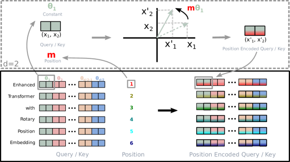
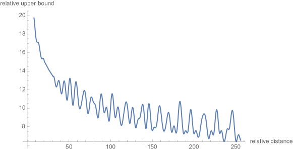
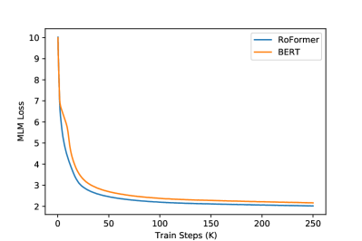

# RoFormer: 回転位置埋め込みを備えた強化版 Transformer

> 原題: RoFormer: Enhanced Transformer with Rotary Position Embedding
> 著者: Jianlin Su, Yu Lu, Shengfeng Pan, Ahmed Murtadha, Bo Wen, Yunfeng Liu（Zhuiyi Technology Co., Ltd., Shenzhen）
> 出典: arXiv:2104.09864
> 公開コード: https://github.com/ZhuiyiTechnology/roformer
> Huggingface 統合: https://huggingface.co/docs/transformers/model_doc/roformer

## Abstract（要旨）

位置エンコーディングは最近、Transformer アーキテクチャにおいて有効性を示している。これは系列内の異なる位置にある要素間の依存関係をモデル化するための、価値ある教師信号を可能にする。本論文ではまず、Transformer ベースの言語モデルの学習過程に位置情報を統合する様々な手法を調査する。次に、位置情報を効果的に活用するための新規手法 **Rotary Position Embedding（RoPE, 回転位置埋め込み）** を提案する。具体的には、提案する RoPE は絶対位置を回転行列で符号化し、同時に self-attention の定式化において明示的な相対位置依存性を取り込む。注目すべきは、RoPE が以下のような価値ある性質を可能にすることである：系列長の柔軟性、相対距離の増加に伴うトークン間依存性の減衰、線形 self-attention に相対位置エンコーディングを装備できる能力。最後に、回転位置埋め込みを備えた強化版 Transformer（**RoFormer**）を、様々な長文分類ベンチマーク・データセットで評価する。実験は、それが代替手法を一貫して上回ることを示す。さらに、いくつかの実験結果を説明するための理論的分析を提供する。RoFormer は既に Huggingface に統合されている。

*キーワード*: 事前学習済み言語モデル、位置情報エンコーディング、事前学習、自然言語処理

## 1 Introduction（はじめに）

単語の順序は自然言語理解に大きな価値を持つ。RNN ベースのモデルは、時間方向に隠れ状態を再帰的に計算することでトークンの順序を符号化する。CNN ベースのモデル [^1] は伝統的に位置非依存と考えられてきたが、近年の研究 [^2] では、よく使われるパディング操作が暗黙的に位置情報を学習しうることが示されている。最近、Transformer [^3] の上に構築された事前学習済み言語モデル（PLM）が、文脈表現学習 [^4]、機械翻訳 [^3]、言語モデリング [^5] など様々な NLP タスクで SOTA 性能を達成している。RNN や CNN ベースのモデルと異なり、PLM は self-attention 機構を用いて与えられたコーパスの文脈表現を意味的に捉える。その結果、PLM は RNN に対する並列化の大幅な改善と、CNN に対するより長い系列内関係のモデル化能力の改善を達成している。

現在の PLM の self-attention アーキテクチャは位置非依存であることが示されている [^6]。この主張に従い、学習過程に位置情報を符号化する様々なアプローチが提案されてきた。一方で、文脈表現に加算される事前定義関数による生成的絶対位置エンコーディング [^3] や、訓練可能な絶対位置エンコーディング [^1] [^4] [^7] [^8] [^5] [^9] がある。他方で、先行研究 [^10]〜[^18] は相対位置エンコーディングに焦点を当て、典型的には attention 機構の中に相対位置情報を符号化する。これらに加え、[^19] の著者は Neural ODE [^20] の視点から位置エンコーディングの依存性をモデル化することを提案し、[^21] の著者は位置情報を複素空間でモデル化することを提案した。これらのアプローチは有効ではあるが、共通して位置情報を文脈表現に加算するため、線形 self-attention アーキテクチャには不向きである。

本論文では、PLM の学習過程に位置情報を活用するための新規手法、すなわち **Rotary Position Embedding（RoPE）** を導入する。具体的には、RoPE は絶対位置を回転行列で符号化し、同時に self-attention の定式化で明示的な相対位置依存性を取り込む。提案する RoPE は、系列長の柔軟性、相対距離の増加に伴うトークン間依存性の減衰、線形 self-attention に相対位置エンコーディングを装備できる能力など、価値ある性質を通じて既存手法より優先される。様々な長文分類ベンチマーク・データセットでの実験結果は、回転位置埋め込みを備えた強化版 Transformer すなわち RoFormer が、ベースライン代替手法より良い性能を示すことを示し、提案する RoPE の有効性を実証する。

要約すると、我々の貢献は以下の 3 つである：

- 既存の相対位置エンコーディング手法を調査し、それらが主に「位置エンコーディングを文脈表現に加算する」分解の発想に基づいて構築されていることを見出した。我々は、位置情報を PLM の学習過程に活用する新規手法 **Rotary Position Embedding（RoPE）** を導入する。鍵となるアイデアは、明確な理論的解釈を持つ回転行列を文脈表現に乗算することで相対位置を符号化することである。
- RoPE の性質を研究し、相対距離が増加すると減衰することを示す。これは自然言語符号化に望ましい性質である。以前の相対位置エンコーディング・ベース手法は線形 self-attention と両立しないことを丁寧に主張する。
- 様々な長文ベンチマーク・データセットで提案する RoFormer を評価する。実験は、それが代替手法より一貫して良い性能を達成することを示す。事前学習済み言語モデルでのいくつかの実験は GitHub で公開している。

論文の残りは以下のように構成される。Section 2 で self-attention アーキテクチャにおける位置エンコーディング問題の形式的記述を確立し、先行研究を再訪する。次に Section 3 で回転位置エンコーディング（RoPE）を記述しその性質を研究する。Section 4 で実験を報告する。最後に Section 5 で論文を結ぶ。

## 2 Background and Related Work（背景と関連研究）

### 2.1 Preliminary（準備）

$\mathbb{S}_{N}=\{w_{i}\}_{i=1}^{N}$ を $N$ 個の入力トークンの系列とし、$w_{i}$ は $i$ 番目の要素とする。$\mathbb{S}_{N}$ に対応する単語埋め込みは $\mathbb{E}_{N}=\{{\boldsymbol{x}}_{i}\}_{i=1}^{N}$ と表記する。ここで ${\boldsymbol{x}}_{i}\in\mathbb{R}^{d}$ はトークン $w_{i}$ の d 次元単語埋め込みベクトルで、位置情報を含まない。self-attention はまず単語埋め込みに位置情報を組み込み、query / key / value 表現に変換する：

$$
{\boldsymbol{q}}_{m} = f_{q}({\boldsymbol{x}}_{m}, m), \quad {\boldsymbol{k}}_{n} = f_{k}({\boldsymbol{x}}_{n}, n), \quad {\boldsymbol{v}}_{n} = f_{v}({\boldsymbol{x}}_{n}, n) \tag{1}
$$

ここで ${\boldsymbol{q}}_{m}, {\boldsymbol{k}}_{n}, {\boldsymbol{v}}_{n}$ はそれぞれ $f_{q}, f_{k}, f_{v}$ を通じて $m$ 番目と $n$ 番目の位置を組み込む。query と key の値は attention 重みの計算に使われ、出力は value 表現上の重み付き和として計算される：

$$
a_{m,n} = \frac{\exp\bigl(\tfrac{{\boldsymbol{q}}_{m}^{\intercal}{\boldsymbol{k}}_{n}}{\sqrt{d}}\bigr)}{\sum_{j=1}^{N}\exp\bigl(\tfrac{{\boldsymbol{q}}_{m}^{\intercal}{\boldsymbol{k}}_{j}}{\sqrt{d}}\bigr)}, \quad \mathbf{o}_{m} = \sum_{n=1}^{N} a_{m,n} {\boldsymbol{v}}_{n} \tag{2}
$$

既存の Transformer ベースの位置エンコーディング手法は、主に Equation 1 を形成するための適切な関数の選択に焦点を当てている。

### 2.2 Absolute position embedding（絶対位置埋め込み）

Equation 1 の典型的な選択は：

$$
f_{t:t\in\{q,k,v\}}({\boldsymbol{x}}_{i}, i) := {\boldsymbol{W}}_{t}({\boldsymbol{x}}_{i} + {\boldsymbol{p}}_{i}) \tag{3}
$$

ここで ${\boldsymbol{p}}_{i}\in\mathbb{R}^{d}$ はトークン ${\boldsymbol{x}}_{i}$ の位置に依存する d 次元ベクトル。先行研究 [^4] [^7] [^8] [^5] [^9] は訓練可能なベクトル集合 ${\boldsymbol{p}}_{i}\in\{{\boldsymbol{p}}_{t}\}_{t=1}^{L}$（$L$ は最大系列長）の使用を導入した。[^3] の著者は ${\boldsymbol{p}}_{i}$ を正弦波関数で生成することを提案した：

$$
\begin{cases}{\boldsymbol{p}}_{i,2t}&=\sin(k/10000^{2t/d})\\ {\boldsymbol{p}}_{i,2t+1}&=\cos(k/10000^{2t/d})\end{cases} \tag{4}
$$

ここで ${\boldsymbol{p}}_{i,2t}$ は d 次元ベクトル ${\boldsymbol{p}}_{i}$ の $2t$ 番目の要素。次節で、提案する RoPE が正弦波関数の視点からこの直観と関連していることを示す。しかし、位置を文脈表現に直接加算する代わりに、RoPE は正弦波関数を乗算することで相対位置情報を組み込むことを提案する。

### 2.3 Relative position embedding（相対位置埋め込み）

[^11] の著者は Equation 1 の異なる設定を適用した：

$$
f_{q}({\boldsymbol{x}}_{m}) := {\boldsymbol{W}}_{q}{\boldsymbol{x}}_{m}, \quad f_{k}({\boldsymbol{x}}_{n}, n) := {\boldsymbol{W}}_{k}({\boldsymbol{x}}_{n}+\tilde{{\boldsymbol{p}}}^{k}_{r}), \quad f_{v}({\boldsymbol{x}}_{n}, n) := {\boldsymbol{W}}_{v}({\boldsymbol{x}}_{n}+\tilde{{\boldsymbol{p}}}^{v}_{r}) \tag{5}
$$

ここで $\tilde{{\boldsymbol{p}}}^{k}_{r}, \tilde{{\boldsymbol{p}}}^{v}_{r}\in\mathbb{R}^{d}$ は訓練可能な相対位置埋め込み。$r=\operatorname{clip}(m-n, r_{\text{min}}, r_{\text{max}})$ は位置 $m$ と $n$ の間の相対距離を表す。彼らは「ある距離を超えた精密な相対位置情報は有用でない」という仮説で相対距離をクリップした。Equation 3 の形を保ちつつ、[^13] の著者は Equation 2 の ${\boldsymbol{q}}_{m}^{\intercal}{\boldsymbol{k}}_{n}$ を以下のように分解することを提案した：

$$
{\boldsymbol{q}}_{m}^{\intercal}{\boldsymbol{k}}_{n} = {\boldsymbol{x}}_{m}^{\intercal}{\boldsymbol{W}}_{q}^{\intercal}{\boldsymbol{W}}_{k}{\boldsymbol{x}}_{n} + {\boldsymbol{x}}_{m}^{\intercal}{\boldsymbol{W}}_{q}^{\intercal}{\boldsymbol{W}}_{k}{\boldsymbol{p}}_{n} + {\boldsymbol{p}}_{m}^{\intercal}{\boldsymbol{W}}_{q}^{\intercal}{\boldsymbol{W}}_{k}{\boldsymbol{x}}_{n} + {\boldsymbol{p}}_{m}^{\intercal}{\boldsymbol{W}}_{q}^{\intercal}{\boldsymbol{W}}_{k}{\boldsymbol{p}}_{n} \tag{6}
$$

鍵となるアイデアは、絶対位置埋め込み ${\boldsymbol{p}}_{n}$ をその正弦波エンコードされた相対対応物 $\tilde{{\boldsymbol{p}}}_{m-n}$ で置き換え、第 3・第 4 項の絶対位置 ${\boldsymbol{p}}_{m}$ を query 位置に依存しない 2 つの訓練可能ベクトル $\mathbf{u}$、$\mathbf{v}$ で置き換えること。さらに、${\boldsymbol{W}}_{k}$ は内容ベース key ベクトル ${\boldsymbol{x}}_{n}$ と位置ベース key ベクトル ${\boldsymbol{p}}_{n}$ で区別され、それぞれ ${\boldsymbol{W}}_{k}$ と $\widetilde{{\boldsymbol{W}}}_{k}$ とする：

$$
{\boldsymbol{q}}_{m}^{\intercal}{\boldsymbol{k}}_{n} = {\boldsymbol{x}}_{m}^{\intercal}{\boldsymbol{W}}_{q}^{\intercal}{\boldsymbol{W}}_{k}{\boldsymbol{x}}_{n} + {\boldsymbol{x}}_{m}^{\intercal}{\boldsymbol{W}}_{q}^{\intercal}\widetilde{{\boldsymbol{W}}}_{k}\tilde{{\boldsymbol{p}}}_{m-n} + \mathbf{u}^{\intercal}{\boldsymbol{W}}_{q}^{\intercal}{\boldsymbol{W}}_{k}{\boldsymbol{x}}_{n} + \mathbf{v}^{\intercal}{\boldsymbol{W}}_{q}^{\intercal}\widetilde{{\boldsymbol{W}}}_{k}\tilde{{\boldsymbol{p}}}_{m-n} \tag{7}
$$

注目すべきは、value 項の位置情報は $f_{v}({\boldsymbol{x}}_{j}) := {\boldsymbol{W}}_{v}{\boldsymbol{x}}_{j}$ と設定することで除かれていることである。後の研究 [^15] [^17] [^16] [^18] は、相対位置情報を attention 重みのみに符号化するというこの設定に従った。しかし、[^15] の著者は Equation 6 を以下のように再構成した：

$$
{\boldsymbol{q}}_{m}^{\intercal}{\boldsymbol{k}}_{n} = {\boldsymbol{x}}_{m}^{\intercal}{\boldsymbol{W}}_{q}^{\intercal}{\boldsymbol{W}}_{k}{\boldsymbol{x}}_{n} + b_{i,j} \tag{8}
$$

ここで $b_{i,j}$ は訓練可能なバイアス。[^16] の著者は Equation 6 の中間 2 項を調査し、絶対位置と単語の間にほとんど相関がないことを見出した。[^15] の著者は単語または位置のペアを異なる射影行列でモデル化することを提案した：

$$
{\boldsymbol{q}}_{m}^{\intercal}{\boldsymbol{k}}_{n} = {\boldsymbol{x}}_{m}^{\intercal}{\boldsymbol{W}}_{q}^{\intercal}{\boldsymbol{W}}_{k}{\boldsymbol{x}}_{n} + {\boldsymbol{p}}_{m}^{\intercal}\mathbf{U}_{q}^{\intercal}\mathbf{U}_{k}{\boldsymbol{p}}_{n} + b_{i,j} \tag{9}
$$

[^17] の著者は、2 つのトークンの相対位置は Equation 6 の中間 2 項のみでフルにモデル化できると主張した。結果として、絶対位置埋め込み ${\boldsymbol{p}}_{m}$ と ${\boldsymbol{p}}_{n}$ は単に相対位置埋め込み $\tilde{{\boldsymbol{p}}}_{m-n}$ で置き換えられた：

$$
{\boldsymbol{q}}_{m}^{\intercal}{\boldsymbol{k}}_{n} = {\boldsymbol{x}}_{m}^{\intercal}{\boldsymbol{W}}_{q}^{\intercal}{\boldsymbol{W}}_{k}{\boldsymbol{x}}_{n} + {\boldsymbol{x}}_{m}^{\intercal}{\boldsymbol{W}}_{q}^{\intercal}{\boldsymbol{W}}_{k}\tilde{{\boldsymbol{p}}}_{m-n} + \tilde{{\boldsymbol{p}}}_{m-n}^{\intercal}{\boldsymbol{W}}_{q}^{\intercal}{\boldsymbol{W}}_{k}{\boldsymbol{x}}_{n} \tag{10}
$$

相対位置埋め込みの 4 つの変種の比較 [^9] は、Equation 10 に類似する変種が他の 3 つの中で最も効率的であることを示した。一般的に言えば、これらのアプローチはすべて、Equation 2 の self-attention 設定下で Equation 3 の分解に基づいて Equation 6 を修正しようと試みている（[^3] が最初に提案）。これらは共通して位置情報を文脈表現に直接加算することを導入する。これと異なり、我々のアプローチは何らかの制約の下で Equation 1 から相対位置エンコーディングを導出することを目指す。次に、文脈表現の回転で相対位置情報を取り込むことによって、導出されたアプローチがより解釈可能であることを示す。

## 3 Proposed approach（提案手法）

本節では、提案する **rotary position embedding（RoPE）** を議論する。まず Section 3.1 で相対位置エンコーディング問題を定式化し、次に Section 3.2 で RoPE を導出し、Section 3.3 でその性質を調査する。

### 3.1 Formulation（定式化）

Transformer ベースの言語モデリングは通常、self-attention 機構を通じて個々のトークンの位置情報を活用する。Equation 2 で観察できるように、${\boldsymbol{q}}_{m}^{\intercal}{\boldsymbol{k}}_{n}$ は典型的に異なる位置のトークン間の知識伝達を可能にする。相対位置情報を組み込むため、query ${\boldsymbol{q}}_{m}$ と key ${\boldsymbol{k}}_{n}$ の内積が、単語埋め込み ${\boldsymbol{x}}_{m}$、${\boldsymbol{x}}_{n}$ およびその相対位置 $m-n$ のみを入力変数とする関数 $g$ で定式化されることを要求する。言い換えれば、内積が位置情報を相対形式でのみ符号化することを望む：

$$
\langle f_{q}({\boldsymbol{x}}_{m}, m), f_{k}({\boldsymbol{x}}_{n}, n)\rangle = g({\boldsymbol{x}}_{m}, {\boldsymbol{x}}_{n}, m-n) \tag{11}
$$

最終目標は、前述の関係に従うように関数 $f_{q}({\boldsymbol{x}}_{m}, m)$ と $f_{k}({\boldsymbol{x}}_{n}, n)$ を解くための等価な符号化機構を見つけることである。

### 3.2 Rotary position embedding（回転位置埋め込み）

#### 3.2.1 A 2D case（2 次元の場合）

我々は次元 $d=2$ の単純なケースから始める。この設定の下で、2 次元平面上のベクトルの幾何学的性質とその複素形式を活用し（詳細は Section 3.4.1 参照）、定式化 Equation 11 の解が以下であることを証明する：

$$
f_{q}({\boldsymbol{x}}_{m}, m) = ({\boldsymbol{W}}_{q}{\boldsymbol{x}}_{m})e^{im\theta} \tag{12}
$$

$$
f_{k}({\boldsymbol{x}}_{n}, n) = ({\boldsymbol{W}}_{k}{\boldsymbol{x}}_{n})e^{in\theta} \tag{13}
$$

$$
g({\boldsymbol{x}}_{m}, {\boldsymbol{x}}_{n}, m-n) = \operatorname{Re}[({\boldsymbol{W}}_{q}{\boldsymbol{x}}_{m})({\boldsymbol{W}}_{k}{\boldsymbol{x}}_{n})^{*} e^{i(m-n)\theta}] \tag{14}
$$

ここで $\operatorname{Re}[\cdot]$ は複素数の実部、$({\boldsymbol{W}}_{k}{\boldsymbol{x}}_{n})^{*}$ は $({\boldsymbol{W}}_{k}{\boldsymbol{x}}_{n})$ の共役複素数。$\theta\in\mathbb{R}$ は事前設定された非零定数。$f_{\{q,k\}}$ をさらに乗算行列で書ける：

$$
f_{\{q,k\}}({\boldsymbol{x}}_{m}, m) = \begin{pmatrix}\cos{m\theta} & -\sin{m\theta} \\ \sin{m\theta} & \cos{m\theta}\end{pmatrix} \begin{pmatrix}W^{(11)}_{\{q,k\}} & W^{(12)}_{\{q,k\}} \\ W^{(21)}_{\{q,k\}} & W^{(22)}_{\{q,k\}}\end{pmatrix} \begin{pmatrix}x^{(1)}_{m} \\ x^{(2)}_{m}\end{pmatrix}
$$

ここで $(x^{(1)}_{m}, x^{(2)}_{m})$ は 2D 座標で表現された ${\boldsymbol{x}}_{m}$。同様に $g$ も行列として見なせるため、Section 3.1 の定式化の 2D ケース下での解が可能になる。**具体的には、相対位置埋め込みの組み込みは単純である：アフィン変換された単語埋め込みベクトルを、その位置インデックスの倍数の角度だけ回転させるだけ**。これが Rotary Position Embedding の背後にある直観の解釈である。

#### 3.2.2 General form（一般形）

2D の結果を任意の ${\boldsymbol{x}}_{i}\in\mathbb{R}^{d}$（$d$ は偶数）に一般化するため、d 次元空間を $d/2$ の部分空間に分割し、内積の線形性によりそれらを結合し、$f_{\{q,k\}}$ を以下のように変換する：

$$
f_{\{q,k\}}({\boldsymbol{x}}_{m}, m) = {\boldsymbol{R}}^{d}_{\Theta, m}{\boldsymbol{W}}_{\{q,k\}}{\boldsymbol{x}}_{m} \tag{15}
$$

ここで

$$
{\boldsymbol{R}}^{d}_{\Theta, m}=\begin{pmatrix}\cos{m\theta_{1}}&-\sin{m\theta_{1}}&0&0&\cdots&0&0\\ \sin{m\theta_{1}}&\cos{m\theta_{1}}&0&0&\cdots&0&0\\ 0&0&\cos{m\theta_{2}}&-\sin{m\theta_{2}}&\cdots&0&0\\ 0&0&\sin{m\theta_{2}}&\cos{m\theta_{2}}&\cdots&0&0\\ \vdots&\vdots&\vdots&\vdots&\ddots&\vdots&\vdots\\ 0&0&0&0&\cdots&\cos{m\theta_{d/2}}&-\sin{m\theta_{d/2}}\\ 0&0&0&0&\cdots&\sin{m\theta_{d/2}}&\cos{m\theta_{d/2}}\end{pmatrix}
$$

は事前定義パラメータ $\Theta=\{\theta_{i}=10000^{-2(i-1)/d}, i\in[1,2,...,d/2]\}$ を持つ回転行列である。RoPE のグラフィカル説明を Figure 1 に示す。我々の RoPE を Equation 2 の self-attention に適用すると、以下を得る：

$$
{\boldsymbol{q}}_{m}^{\intercal}{\boldsymbol{k}}_{n} = ({\boldsymbol{R}}^{d}_{\Theta, m}{\boldsymbol{W}}_{q}{\boldsymbol{x}}_{m})^{\intercal}({\boldsymbol{R}}^{d}_{\Theta, n}{\boldsymbol{W}}_{k}{\boldsymbol{x}}_{n}) = {\boldsymbol{x}}_{m}^{\intercal}{\boldsymbol{W}}_{q}^{\intercal}{\boldsymbol{R}}^{d}_{\Theta, n-m}{\boldsymbol{W}}_{k}{\boldsymbol{x}}_{n} \tag{16}
$$

ここで ${\boldsymbol{R}}^{d}_{\Theta, n-m} = ({\boldsymbol{R}}^{d}_{\Theta, m})^{\intercal}{\boldsymbol{R}}^{d}_{\Theta, n}$。${\boldsymbol{R}}^{d}_{\Theta}$ が直交行列であることに留意。これは位置情報の符号化過程の安定性を保証する。加えて、$R^{d}_{\Theta}$ のスパース性により、Equation 16 のように行列乗算を直接適用することは計算効率的でない；我々は理論的説明で別の実装を提供する。

**先行研究で採用された加算的な性質の位置埋め込み手法（Equations 3, 4, 5, 6, 7, 8, 9, 10）と対照的に、我々のアプローチは乗算的である**。さらに、RoPE は self-attention に適用されたとき、加算的位置エンコーディングの展開式の項を改変する代わりに、回転行列の積を通じて自然に相対位置情報を取り込む。

<figure>

<figcaption>図1: Rotary Position Embedding（RoPE）の実装。</figcaption>
</figure>

### 3.3 Properties of RoPE（RoPE の性質）

#### Long-term decay（長期減衰）

[^3] に従い、$\theta_{i}=10000^{-2i/d}$ と設定する。この設定が**長期減衰性**を提供することを証明できる（詳細は Section 3.4.3 参照）。これは相対位置が増加すると内積が減衰することを意味する。この性質は「長い相対距離を持つトークン対は接続が少ないべき」という直観と一致する。

#### RoPE with linear attention（線形 attention と組み合わせた RoPE）

self-attention はより一般的な形式で書き直せる：

$$
\operatorname{Attention}(\mathbf{Q}, \mathbf{K}, \mathbf{V})_{m} = \frac{\sum_{n=1}^{N}\operatorname{sim}({\boldsymbol{q}}_{m}, {\boldsymbol{k}}_{n}){\boldsymbol{v}}_{n}}{\sum_{n=1}^{N}\operatorname{sim}({\boldsymbol{q}}_{m}, {\boldsymbol{k}}_{n})} \tag{17}
$$

オリジナルの self-attention は $\operatorname{sim}({\boldsymbol{q}}_{m}, {\boldsymbol{k}}_{n}) = \exp({\boldsymbol{q}}_{m}^{\intercal}{\boldsymbol{k}}_{n}/\sqrt{d})$ を選ぶ。オリジナルの self-attention はトークンのすべての対について query と key の内積を計算する必要があり、二次計算量 $\mathbb{O}(N^{2})$ を持つことに留意。[^22] に従い、線形 attention は Equation 17 を以下のように再定式化する：

$$
\operatorname{Attention}({\boldsymbol{Q}}, {\boldsymbol{K}}, {\boldsymbol{V}})_{m} = \frac{\sum_{n=1}^{N}\phi({\boldsymbol{q}}_{m})^{\intercal}\varphi({\boldsymbol{k}}_{n}){\boldsymbol{v}}_{n}}{\sum_{n=1}^{N}\phi({\boldsymbol{q}}_{m})^{\intercal}\varphi({\boldsymbol{k}}_{n})} \tag{18}
$$

ここで $\phi(\cdot), \varphi(\cdot)$ は通常非負関数。[^22] の著者は $\phi(x) = \varphi(x) = \operatorname{elu}(x)+1$ を提案し、行列乗算の結合性を活用してまず key と value の乗算を計算した。[^23] では softmax 関数が query と key を内積前に別々に正規化するために使われており、これは $\phi({\boldsymbol{q}}_{i})=\operatorname{softmax}({\boldsymbol{q}}_{i})$ と $\phi({\boldsymbol{k}}_{j})=\exp({\boldsymbol{k}}_{j})$ に等価。本節では、RoPE を Equation 18 と組み合わせる議論に焦点を当てる。**RoPE は回転で位置情報を注入し、それが隠れ表現のノルムを変えないため、回転行列を非負関数の出力に乗算することで RoPE を線形 attention と組み合わせられる**：

$$
\operatorname{Attention}(\mathbf{Q}, \mathbf{K}, \mathbf{V})_{m} = \frac{\sum_{n=1}^{N}\bigl({\boldsymbol{R}}^{d}_{\Theta, m}\phi({\boldsymbol{q}}_{m})\bigr)^{\intercal}\bigl({\boldsymbol{R}}^{d}_{\Theta, n}\varphi({\boldsymbol{k}}_{n})\bigr){\boldsymbol{v}}_{n}}{\sum_{n=1}^{N}\phi({\boldsymbol{q}}_{m})^{\intercal}\varphi({\boldsymbol{k}}_{n})} \tag{19}
$$

注目すべきは、ゼロ除算のリスクを避けるため分母を変えずに保つこと、分子の総和は負の項を含み得ることである。Equation 19 の各 value ${\boldsymbol{v}}_{i}$ に対する重みは厳密には確率的に正規化されていないが、その計算は依然として value の重要度をモデル化できると丁寧に主張する。

### 3.4 Theoretical Explanation（理論的説明）

#### 3.4.1 Derivation of RoPE under 2D（2D 下での RoPE の導出）

$d=2$ のケースで、query と key に対応する 2 つの単語埋め込みベクトル ${\boldsymbol{x}}_{q}$、${\boldsymbol{x}}_{k}$ と、それらの位置 $m$、$n$ をそれぞれ考える。Equation 1 によれば、それらの位置エンコード版は：

$$
{\boldsymbol{q}}_{m} = f_{q}({\boldsymbol{x}}_{q}, m), \quad {\boldsymbol{k}}_{n} = f_{k}({\boldsymbol{x}}_{k}, n)
$$

ここで ${\boldsymbol{q}}_{m}$ と ${\boldsymbol{k}}_{n}$ の添字はエンコードされた位置情報を示す。$f_{\{q,k\}}$ によって生成されるベクトル間の内積を定義する関数 $g$ が存在すると仮定する：

$$
{\boldsymbol{q}}_{m}^{\intercal}{\boldsymbol{k}}_{n} = \langle f_{q}({\boldsymbol{x}}_{m}, m), f_{k}({\boldsymbol{x}}_{n}, n)\rangle = g({\boldsymbol{x}}_{m}, {\boldsymbol{x}}_{n}, n-m) \tag{21}
$$

さらに以下の初期条件を満たすことを要求する：

$$
{\boldsymbol{q}} = f_{q}({\boldsymbol{x}}_{q}, 0), \quad {\boldsymbol{k}} = f_{k}({\boldsymbol{x}}_{k}, 0)
$$

これは「位置情報を含まないベクトル」と読める。これらの設定の下で、$f_{q}$、$f_{k}$ の解を見つけることを試みる。まず、2D ベクトルの幾何学的意味とその複素対応物を活用し、Equations 20, 21 の関数を以下のように分解する：

$$
f_{q}({\boldsymbol{x}}_{q}, m) = R_{q}({\boldsymbol{x}}_{q}, m)e^{i\Theta_{q}({\boldsymbol{x}}_{q}, m)}, \quad f_{k}({\boldsymbol{x}}_{k}, n) = R_{k}({\boldsymbol{x}}_{k}, n)e^{i\Theta_{k}({\boldsymbol{x}}_{k}, n)}
$$

$$
g({\boldsymbol{x}}_{q}, {\boldsymbol{x}}_{k}, n-m) = R_{g}({\boldsymbol{x}}_{q}, {\boldsymbol{x}}_{k}, n-m)e^{i\Theta_{g}({\boldsymbol{x}}_{q}, {\boldsymbol{x}}_{k}, n-m)}
$$

ここで $R_{f}$、$R_{g}$ と $\Theta_{f}$、$\Theta_{g}$ はそれぞれ $f_{\{q,k\}}$ と $g$ の動径と角度成分。これらを Equation 21 に代入すると、関係を得る：

$$
R_{q}({\boldsymbol{x}}_{q}, m)R_{k}({\boldsymbol{x}}_{k}, n) = R_{g}({\boldsymbol{x}}_{q}, {\boldsymbol{x}}_{k}, n-m), \quad \Theta_{k}({\boldsymbol{x}}_{k}, n) - \Theta_{q}({\boldsymbol{x}}_{q}, m) = \Theta_{g}({\boldsymbol{x}}_{q}, {\boldsymbol{x}}_{k}, n-m) \tag{24}
$$

対応する初期条件：

$$
{\boldsymbol{q}} = \|{\boldsymbol{q}}\|e^{i\theta_{q}} = R_{q}({\boldsymbol{x}}_{q}, 0)e^{i\Theta_{q}({\boldsymbol{x}}_{q}, 0)}, \quad {\boldsymbol{k}} = \|{\boldsymbol{k}}\|e^{i\theta_{k}} = R_{k}({\boldsymbol{x}}_{k}, 0)e^{i\Theta_{k}({\boldsymbol{x}}_{k}, 0)} \tag{25}
$$

ここで $\|{\boldsymbol{q}}\|$、$\|{\boldsymbol{k}}\|$ と $\theta_{q}$、$\theta_{k}$ は 2D 平面上の ${\boldsymbol{q}}$ と ${\boldsymbol{k}}$ の動径と角度成分。

次に、Equation 24 で $m=n$ と置き、Equation 25 の初期条件を考慮すると：

$$
R_{q}({\boldsymbol{x}}_{q}, m)R_{k}({\boldsymbol{x}}_{k}, m) = R_{g}({\boldsymbol{x}}_{q}, {\boldsymbol{x}}_{k}, 0) = \|{\boldsymbol{q}}\|\|{\boldsymbol{k}}\| \tag{26a}
$$

$$
\Theta_{k}({\boldsymbol{x}}_{k}, m) - \Theta_{q}({\boldsymbol{x}}_{q}, m) = \theta_{k} - \theta_{q} \tag{26b}
$$

一方で、Equation 26a から $R_{f}$ の直接的な解を形成できる：

$$
R_{q}({\boldsymbol{x}}_{q}, m) = \|{\boldsymbol{q}}\|, \quad R_{k}({\boldsymbol{x}}_{k}, n) = \|{\boldsymbol{k}}\|, \quad R_{g}({\boldsymbol{x}}_{q}, {\boldsymbol{x}}_{k}, n-m) = \|{\boldsymbol{q}}\|\|{\boldsymbol{k}}\|
$$

これは動径関数 $R_{q}$、$R_{k}$、$R_{g}$ が位置情報から独立であることを解釈する。一方で、Equation 26b では $\Theta_{q}({\boldsymbol{x}}_{q}, m) - \theta_{q} = \Theta_{k}({\boldsymbol{x}}_{k}, m) - \theta_{k}$ は角度関数が query と key に依存しないことを示している。これらを $\Theta_{f} := \Theta_{q} = \Theta_{k}$ と置き、$\Theta_{f}({\boldsymbol{x}}_{\{q,k\}}, m) - \theta_{\{q,k\}}$ は位置 $m$ の関数で単語埋め込み ${\boldsymbol{x}}_{\{q,k\}}$ に依存しない関数を表すため、これを $\phi(m)$ と表記する：

$$
\Theta_{f}({\boldsymbol{x}}_{\{q,k\}}, m) = \phi(m) + \theta_{\{q,k\}}
$$

さらに、Equation 24 に $n=m+1$ を代入し上式を考慮すると：

$$
\phi(m+1) - \phi(m) = \Theta_{g}({\boldsymbol{x}}_{q}, {\boldsymbol{x}}_{k}, 1) + \theta_{q} - \theta_{k}
$$

RHS は $m$ に無関係な定数なので、整数入力 $m$ に対する $\phi(m)$ は等差数列となる：

$$
\phi(m) = m\theta + \gamma
$$

ここで $\theta, \gamma\in\mathbb{R}$ は定数で $\theta$ は非零。最終的に：

$$
f_{q}({\boldsymbol{x}}_{q}, m) = \|{\boldsymbol{q}}\|e^{i\theta_{q}+m\theta+\gamma} = {\boldsymbol{q}}e^{i(m\theta+\gamma)}, \quad f_{k}({\boldsymbol{x}}_{k}, n) = \|{\boldsymbol{k}}\|e^{i\theta_{k}+n\theta+\gamma} = {\boldsymbol{k}}e^{i(n\theta+\gamma)}
$$

Equation 3 と比較可能にするため、${\boldsymbol{q}} = f_{q}({\boldsymbol{x}}_{m}, 0) = {\boldsymbol{W}}_{q}{\boldsymbol{x}}_{n}$、${\boldsymbol{k}} = f_{k}({\boldsymbol{x}}_{n}, 0) = {\boldsymbol{W}}_{k}{\boldsymbol{x}}_{n}$ と定義し、$\gamma=0$ と置く：

$$
f_{q}({\boldsymbol{x}}_{m}, m) = ({\boldsymbol{W}}_{q}{\boldsymbol{x}}_{m})e^{im\theta}, \quad f_{k}({\boldsymbol{x}}_{n}, n) = ({\boldsymbol{W}}_{k}{\boldsymbol{x}}_{n})e^{in\theta}
$$

#### 3.4.2 Computational efficient realization of rotary matrix multiplication（回転行列乗算の効率的実装）

Equation 15 の ${\boldsymbol{R}}^{d}_{\Theta, m}$ のスパース性を活用すると、$R^{d}_{\Theta}$ と ${\boldsymbol{x}}\in\mathbb{R}^{d}$ の乗算のより計算効率的な実装は：

$$
{\boldsymbol{R}}^{d}_{\Theta, m}{\boldsymbol{x}} = \begin{pmatrix}x_{1}\\ x_{2}\\ x_{3}\\ x_{4}\\ \vdots\\ x_{d-1}\\ x_{d}\end{pmatrix} \otimes \begin{pmatrix}\cos{m\theta_{1}}\\ \cos{m\theta_{1}}\\ \cos{m\theta_{2}}\\ \cos{m\theta_{2}}\\ \vdots\\ \cos{m\theta_{d/2}}\\ \cos{m\theta_{d/2}}\end{pmatrix} + \begin{pmatrix}-x_{2}\\ x_{1}\\ -x_{4}\\ x_{3}\\ \vdots\\ -x_{d}\\ x_{d-1}\end{pmatrix} \otimes \begin{pmatrix}\sin{m\theta_{1}}\\ \sin{m\theta_{1}}\\ \sin{m\theta_{2}}\\ \sin{m\theta_{2}}\\ \vdots\\ \sin{m\theta_{d/2}}\\ \sin{m\theta_{d/2}}\end{pmatrix}
$$

#### 3.4.3 Long-term decay of RoPE（RoPE の長期減衰）

ベクトル ${\boldsymbol{q}} = {\boldsymbol{W}}_{q}{\boldsymbol{x}}_{m}$ と ${\boldsymbol{k}} = {\boldsymbol{W}}_{k}{\boldsymbol{x}}_{n}$ の要素を対で組み、Equation 16 の RoPE の内積は複素数乗算として書ける：

$$
({\boldsymbol{R}}^{d}_{\Theta, m}{\boldsymbol{W}}_{q}{\boldsymbol{x}}_{m})^{\intercal}({\boldsymbol{R}}^{d}_{\Theta, n}{\boldsymbol{W}}_{k}{\boldsymbol{x}}_{n}) = \operatorname{Re}\bigg{[}\sum_{i=0}^{d/2-1}{\boldsymbol{q}}_{[2i:2i+1]}{\boldsymbol{k}}_{[2i:2i+1]}^{*} e^{i(m-n)\theta_{i}}\bigg{]}
$$

ここで ${\boldsymbol{q}}_{[2i:2i+1]}$ は ${\boldsymbol{q}}$ の $2i$ 番目から $(2i+1)$ 番目の要素を表す。$h_{i} = {\boldsymbol{q}}_{[2i:2i+1]}{\boldsymbol{k}}_{[2i:2i+1]}^{*}$、$S_{j} = \sum_{i=0}^{j-1}e^{i(m-n)\theta_{i}}$ とし、$h_{d/2}=0$ と $S_{0}=0$ とすると、アーベル変換を使って総和を書き直せる：

$$
\sum_{i=0}^{d/2-1}{\boldsymbol{q}}_{[2i:2i+1]}{\boldsymbol{k}}_{[2i:2i+1]}^{*} e^{i(m-n)\theta_{i}} = -\sum_{i=0}^{d/2-1}S_{i+1}(h_{i+1}-h_{i})
$$

したがって：

$$
\bigg{|}\sum_{i=0}^{d/2-1}{\boldsymbol{q}}_{[2i:2i+1]}{\boldsymbol{k}}_{[2i:2i+1]}^{*} e^{i(m-n)\theta_{i}}\bigg{|} \leq \bigl(\max_{i}|h_{i+1}-h_{i}|\bigr)\sum_{i=0}^{d/2-1}|S_{i+1}|
$$

$\theta_{i}=10000^{-2i/d}$ と設定すると、$\frac{1}{d/2}\sum_{i=1}^{d/2}|S_{i}|$ の値が相対距離 $m-n$ の増加と共に減衰することに留意する（Figure 2 参照）。

<figure>

<figcaption>図2: RoPE の長期減衰。横軸は相対距離、縦軸は |S_i| の平均値。距離が大きくなるにつれて attention の上界が減衰することが確認できる。</figcaption>
</figure>

## 4 Experiments and Evaluation（実験と評価）

提案する RoFormer を以下の様々な NLP タスクで評価する。Section 4.1 で機械翻訳タスクで提案手法の性能を検証する。次に Section 4.2 で事前学習段階で RoPE 実装を BERT と比較する。事前学習済みモデルに基づき、Section 4.3 で GLUE ベンチマークの異なる下流タスクで評価を行う。加えて Section 4.4 で PerFormer の線形 attention と組み合わせた RoPE で実験を行う。最後に Section 4.5 で中国語データでの追加テストを含める。すべての実験は 4 × V100 GPU を持つ 2 つのクラウド・サーバで実行された。

### 4.1 Machine Translation（機械翻訳）

#### 4.1.1 Experimental Settings（実験設定）

我々はまず系列対系列言語翻訳タスクで RoFormer の性能を示す。標準的な WMT 2014 英独データセット [^26]（約 450 万文対）を選ぶ。Transformer ベースのベースライン [^3] と比較する。

#### 4.1.2 Implementation details（実装詳細）

ベースライン・モデル [^3] の self-attention 層に修正を加え、RoPE を学習過程に有効にする。joint source・target byte pair encoding（BPE）[^27] に基づく 37k 語彙で英独翻訳の設定を複製する。評価では最後の 5 チェックポイントを平均化した単一モデルを用いる。結果はビームサイズ 4 と長さペナルティ 0.6 でビーム探索を使う。fairseq ツールキット（MIT License）[^28] の PyTorch で実装。Adam オプティマイザを使用、$\beta_{1}=0.9$、$\beta_{2}=0.98$、学習率を $1e-7$ から $5e-4$ に線形に上昇させ、その後ステップ数の逆平方根に比例して減衰。ラベル平滑化 0.1 を採用。テストセット上の BLEU [^29] スコアを最終指標として報告。

#### 4.1.3 Results（結果）

ベースライン・モデルと RoFormer を同じ設定で訓練し、Table 1 に結果を報告する。我々のモデルはベースライン Transformer と比較してより良い BLEU スコアを与える。

**表1**: 提案する RoFormer は WMT 2014 英独翻訳タスクでベースラインより良い BLEU スコアを与える。

| モデル | BLEU |
| --- | --- |
| Transformer-base [^3] | 27.3 |
| **RoFormer** | **27.5** |

### 4.2 Pre-training Language Modeling（事前学習言語モデリング）

第 2 の実験は、文脈表現学習の観点から提案の性能を検証することである。これを達成するため、BERT のオリジナル正弦波位置エンコーディングを事前学習段階で RoPE で置き換える。

#### 4.2.1 Experimental Settings（実験設定）

Huggingface Datasets ライブラリ（Apache License 2.0）の BookCorpus [^30] と Wikipedia Corpus [^31] を事前学習に使う。コーパスはさらに 8:2 比で train/validation に分割。訓練過程のマスク言語モデリング（MLM）損失値を評価指標として使う。BERT [^4] をベースライン・モデルとして採用（実験では bert-base-uncased を使用）。

#### 4.2.2 Implementation details（実装詳細）

RoFormer ではベースライン・モデルの self-attention ブロックの正弦波位置エンコーディングを提案する RoPE で置き換え、Equation 16 に従って self-attention を実現。BERT と RoFormer をバッチサイズ 64、最大系列長 512 で 100k ステップ訓練。AdamW [^32] をオプティマイザとして使用、学習率 1e-5。

#### 4.2.3 Results（結果）

事前学習中の MLM 損失を Figure 3 の左プロットに示す。vanilla BERT と比較して、RoFormer はより速い収束を経験する。

<figure>

<figcaption>図3: 言語モデリング事前学習における RoPE の評価。左: BERT と RoFormer の訓練損失。右: RoPE 有無の PerFormer の訓練損失。</figcaption>
</figure>

### 4.3 Fine-tuning on GLUE tasks（GLUE タスクでのファインチューニング）

#### 4.3.1 Experimental Settings（実験設定）

GLUE のいくつかのデータセットを見る：MRPC [^33]、SST-2 [^34]、QNLI [^35]、STS-B [^36]、QQP [^37]、MNLI [^38]。MRPC と QQP では F1 スコア、STS-B では Spearman 相関、残りでは精度を評価指標として使う。

#### 4.3.2 Implementation details（実装詳細）

Huggingface Transformers ライブラリ（Apache License 2.0）[^39] を使い、各下流タスクを 3 エポックでファインチューン、最大系列長 512、バッチサイズ 32、学習率 2e-5、3e-5、4e-5、5e-5。[^4] に従い、validation セットでの best-averaged 結果を報告。

**表2**: GLUE 下流タスクでのファインチューニングによる RoFormer と BERT の比較。

| モデル | MRPC | SST-2 | QNLI | STS-B | QQP | MNLI(m/mm) |
| --- | --- | --- | --- | --- | --- | --- |
| BERT [^4] | 88.9 | **93.5** | **90.5** | 85.8 | 71.2 | **84.6/83.4** |
| **RoFormer** | **89.5** | 90.7 | 88.0 | **87.0** | **86.4** | 80.2/79.8 |

#### 4.3.3 Results（結果）

ファインチューニング・タスクの評価結果を Table 2 に報告。RoFormer は 6 つのデータセット中 3 つで BERT を有意に上回り、改善は相当である。

### 4.4 Performer with RoPE（RoPE を組み込んだ Performer）

Performer [^25] は入力系列長で二次的にスケールする計算コストを避けるよう設計された代替 attention 機構（線形 attention）を導入する。Section 3.3 で議論したように、提案する RoPE は PerFormer モデルに容易に実装でき、self-attention の線形にスケールする複雑度を保ちつつ相対位置エンコーディングを実現できる。言語モデリングの事前学習タスクでその性能を実証する。

#### 4.4.1 Implementation details（実装詳細）

英語 Wikipedia から markup、特殊文字、英語以外のテキストを含む Enwik8 データセット [^40] でテストを行う。768 次元・12 ヘッドの 12 層 char-based PerFormer に RoPE を組み込む。同じ設定（学習率 1e-4、バッチサイズ 128、固定最大系列長 1024）で、RoPE 有無の事前学習過程の損失曲線を報告。

#### 4.4.2 Results（結果）

Figure 3 の右プロットに示すように、RoPE を Performer に置換すると同じ訓練ステップ量で急速な収束とより低い損失をもたらす。これらの改善は線形複雑度に加えて Performer をより魅力的にする。

### 4.5 Evaluation on Chinese Data（中国語データでの評価）

英語データの実験に加え、中国語データでの追加結果を示す。長文での RoFormer の性能検証のため、512 文字を超える長文書で実験を行う。

#### 4.5.1 Implementation（実装）

これらの実験では、WoBERT [^41] の絶対位置埋め込みを提案する RoPE で置き換える修正を加えた。他の中国語事前学習済み Transformer ベース・モデル（BERT [^4]、WoBERT [^41]、NEZHA [^42]）との横断比較として、表 3 にトークン化レベルと位置埋め込み情報をまとめる。

**表3**: 中国語データでの RoFormer と他の事前学習済みモデルの横断比較。「abs」と「rel」はそれぞれ絶対位置埋め込みと相対位置埋め込みを示す。

| モデル | BERT [^4] | WoBERT [^41] | NEZHA [^42] | RoFormer |
| --- | --- | --- | --- | --- |
| トークン化レベル | char | word | char | word |
| 位置埋め込み | abs. | abs. | rel. | RoPE |

#### 4.5.2 Pre-training（事前学習）

RoFormer を中国語 Wikipedia、ニュース、フォーラムから収集した約 34GB データで事前学習。事前学習は様々なシナリオへの適応のため、バッチサイズと最大入力系列長を変えながら複数段階で実施。表 4 に示すように、RoFormer の精度は系列長の上限増加と共に上昇する。これは RoFormer が長文を扱う能力を実証し、提案する RoPE の優れた汎化性に起因すると主張する。

**表4**: 中国語データセットでの RoFormer の事前学習戦略。訓練手順は複数の連続段階に分割される。各段階で、最大系列長とバッチサイズの特定の組合せでモデルを訓練。

| 段階 | 最大系列長 | バッチサイズ | 訓練ステップ | 損失 | 精度 |
| --- | --- | --- | --- | --- | --- |
| 1 | 512 | 256 | 200k | 1.73 | 65.0% |
| 2 | 1536 | 256 | 12.5k | 1.61 | 66.8% |
| 3 | 256 | 256 | 120k | 1.75 | 64.6% |
| 4 | 128 | 512 | 80k | 1.83 | 63.4% |
| 5 | 1536 | 256 | 10k | 1.58 | 67.4% |
| 6 | 512 | 512 | 30k | 1.66 | 66.2% |

#### 4.5.3 Downstream Tasks & Dataset（下流タスクとデータセット）

長文を扱う RoFormer の能力（意味的テキストマッチング）を示すため、Chinese AI and Law 2019 Similar Case Matching（CAIL2019-SCM）[^43] データセットを選ぶ。CAIL2019-SCM は中国最高人民法院が公開した 8964 のケース 3 つ組 (A, B, C) を含む。タスクは事前定義された類似度尺度の下で対 (A, B) が (A, C) より近いかを予測すること。文書の長さ（ほとんどが 512 文字超）のため、既存手法は CAIL2019-SCM で有意な性能を示せないことに留意。標準的な 6:2:2 比で train/validation/test に分割。

#### 4.5.4 Results（結果）

事前学習済み RoFormer モデルを異なる入力長で CAIL2019-SCM に適用。同じ事前学習データで事前学習された BERT と WoBERT モデルと比較（表 5）。短いテキスト・カットオフ（512）では、RoFormer の結果は WoBERT と同等で BERT 実装よりやや良い。しかし最大入力テキスト長を 1024 に増やすと、RoFormer は WoBERT を絶対値 1.5% 上回る。

**表5**: CAIL2019-SCM タスクの実験結果。第 1 列の数字は最大カットオフ系列長を示す。結果は精度（%）で示す。

| モデル | Validation | Test |
| --- | --- | --- |
| BERT-512 | 64.13% | 67.77% |
| WoBERT-512 | 64.07% | 68.10% |
| RoFormer-512 | 64.13% | 68.29% |
| **RoFormer-1024** | **66.07%** | **69.79%** |

#### 4.5.5 Limitations of the work（本研究の限界）

理論的根拠と有望な実験的正当化を提供したが、本手法は以下の事実に制限される：

- 相対位置関係を 2D 部分空間下の回転として数学的にフォーマットしたが、なぜ他の位置エンコーディング戦略を組み込むベースライン・モデルより速く収束するかについての徹底的な説明はない。
- トークン間積に対する長期減衰の好ましい性質を証明したが、これは既存の位置エンコーディング機構に類似する。我々のモデルは長文で同類モデルより優れた性能を示すが、忠実な説明をまだ得られていない。

我々の提案する RoFormer は Transformer ベースの基盤の上に構築されており、事前学習目的のためにハードウェア・リソースを要する。

## 5 Conclusions（結論）

本研究では、self-attention 内に明示的な相対位置依存性を組み込み、Transformer アーキテクチャの性能を強化する新しい位置埋め込み手法を提案した。我々の理論的分析は、相対位置が self-attention のベクトル積を用いて自然に定式化でき、絶対位置情報が回転行列を通じて符号化されることを示す。加えて、Transformer に適用された時の提案手法の有利な性質を数学的に説明した。最後に、英語と中国語ベンチマーク・データセットの実験は、本手法が事前学習でより速い収束を促すことを実証した。実験結果はまた、提案する RoFormer が長文タスクでより良い性能を達成できることを示す。

