# SAM 2: Segment Anything in Images and Videos（画像と動画における Segment Anything）

> 原題: SAM 2: Segment Anything in Images and Videos
> 著者: Nikhila Ravi, Valentin Gabeur, Yuan-Ting Hu, Ronghang Hu, Chaitanya Ryali, Tengyu Ma, Haitham Khedr, Roman Rädle, Chloe Rolland, Laura Gustafson, Eric Mintun, Junting Pan, Kalyan Vasudev Alwala, Nicolas Carion, Chao-Yuan Wu, Ross Girshick, Piotr Dollár, Christoph Feichtenhofer（Meta FAIR）
> 出典: arXiv:2408.00714 / ICLR 2025
> プロジェクト: <https://sam2.metademolab.com>

## Abstract（要旨）

我々は Segment Anything Model 2（SAM 2）を提示する。これは画像と動画における **promptable visual segmentation**（プロンプト可能視覚セグメンテーション）を解くことを目指す基盤モデルである。我々はデータエンジンを構築し――これはユーザーとの対話を通してモデルとデータの両方を改善する――これまでで最大の動画セグメンテーションデータセットを収集した。我々のモデルは、実時間の動画処理のためのストリーミングメモリを備えた、シンプルな Transformer アーキテクチャである。我々のデータで訓練された SAM 2 は、広範なタスクを横断して強力な性能を提供する。動画セグメンテーションでは、先行アプローチに比べ 3 倍少ない対話で、より高い精度を観察する。画像セグメンテーションでは、SAM（Segment Anything Model）よりも高精度かつ **6 倍高速** である。我々は我々のデータ、モデル、洞察が、動画セグメンテーションおよび関連知覚タスクにとっての重要なマイルストーンとなると信じている。我々はモデルの一版、データセット、対話的デモを公開する。

## 1. Introduction（はじめに）

<figure>

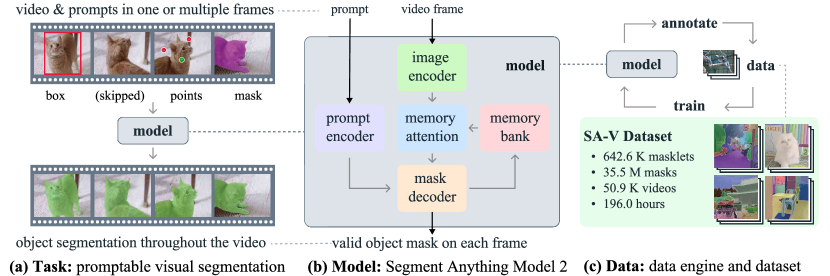

<figcaption>図1: 我々は Segment Anything Model 2（SAM 2）を導入する。(a) promptable visual segmentation タスクを (b) 我々の基盤モデルで解くことを目指し、(c) データエンジンで収集された大規模 SA-V データセットで訓練する。SAM 2 は、過去のプロンプトと予測を保存するストリーミングメモリを利用することで、1 つまたは複数の動画フレームにおけるプロンプト（クリック、ボックス、マスク）を通じて領域を対話的にセグメントできる。</figcaption>
</figure>

Segment Anything（SA）は画像における promptable segmentation のための基盤モデルを導入した。しかし画像は実世界の静的なスナップショットに過ぎず、視覚セグメントは複雑な動きを示し得る。マルチメディアコンテンツの急速な成長により、現在では大きな部分が時間次元を持って記録されており、特に動画データがそうである。AR/VR、ロボティクス、自動運転車、動画編集の多くの重要応用は、画像レベルセグメンテーションを超えた時間的位置特定を必要とする。我々は、汎用視覚セグメンテーションシステムは画像にも動画にも適用可能であるべきだと信じている。

動画におけるセグメンテーションは実体の時空間的範囲を決定することを目指すが、画像にはない独自の課題を提示する。実体は動き、変形、遮蔽、照明変化、その他の要因により外観に大きな変化を被り得る。動画はしばしばカメラの動き、ブレ、低解像度のため画像より低品質である。さらに、多数のフレームの効率的処理は鍵となる課題である。SA は画像セグメンテーションに成功裏に対処したが、既存の動画セグメンテーションモデルとデータセットは「動画における anything のセグメント」能力に匹敵するものを提供できていない。

我々は Segment Anything Model 2（SAM 2）を導入する。これは動画と画像の統一モデルである（画像は単一フレーム動画とみなす）。我々の研究にはタスク、モデル、データセットが含まれる（図 1 参照）。

我々は **Promptable Visual Segmentation（PVS）タスク** に焦点を当てる。これは画像セグメンテーションを動画ドメインへ一般化する。タスクは動画の任意のフレーム上の点、ボックス、マスクを入力として取り、関心領域を定義し、その時空間マスク（すなわち「masklet」）を予測することを目指す。masklet が予測されると、追加フレームでプロンプトを与えることで反復的に洗練できる。

我々のモデル（§4）は単一画像と動画フレーム横断で関心オブジェクトのセグメンテーションマスクを生成する。SAM 2 はオブジェクトと過去の対話に関する情報を保存する**メモリ**を備えており、これにより動画全体を通して masklet 予測を生成し、過去に観察されたフレームからの保存されたメモリコンテキストに基づいてこれらの予測を効果的に修正することもできる。我々のストリーミングアーキテクチャは SAM を動画ドメインへ自然に一般化したものであり、動画フレームを 1 つずつ処理し、対象オブジェクトの過去のメモリに注意を払う memory attention モジュールを備えている。画像に適用するとき、メモリは空になり、モデルは SAM のように振る舞う。

我々はデータエンジン（§5）を用い、モデルをアノテーターとのループに使って新たな困難データを対話的にアノテートすることで訓練データを生成する。既存のほとんどの動画セグメンテーションデータセットと異なり、我々のデータエンジンは特定のカテゴリのオブジェクトに制限されず、代わりに**有効な境界を持つ任意のオブジェクト（部位や部分を含む）のセグメンテーション**のための訓練データを提供することを目指す。既存のモデル支援アプローチと比較して、SAM 2 をループに持つ我々のデータエンジンは同等の品質で **8.4 倍高速** である。我々の最終的な Segment Anything Video（SA-V）データセット（§5.2）は **50.9K 動画にわたる 35.5M マスク** からなり、これは既存のどの動画セグメンテーションデータセットよりも **53 倍** 多くのマスクを持つ。SA-V は動画全体を通して遮蔽されたり再出現したりする小さなオブジェクトや部位を含む困難なデータセットである。SA-V データセットは地理的に多様であり、SAM 2 の公平性評価は、知覚される性別による動画セグメンテーション性能の最小限の差異を示し、評価した 3 つの知覚される年齢グループ間でほとんど差異がないことを示している。

我々の実験（§6）は、SAM 2 が動画セグメンテーション体験における段階的変化をもたらすことを示す。SAM 2 は先行アプローチより **3 倍少ない対話** でより良いセグメンテーション精度を生成できる。さらに、SAM 2 は確立された動画オブジェクトセグメンテーションベンチマークで複数の評価設定下で先行研究を上回り、画像セグメンテーションベンチマークでも SAM より良い性能を提供しつつ **6 倍高速** である。SAM 2 は動画セグメンテーション用 17 と単一画像セグメンテーション用 37 を含む数多くのゼロショットベンチマークを通して観察されるように、様々な動画と画像分布で効果的である。

我々は我々の研究を寛容なオープンライセンスで公開する。SA-V データセット（CC by 4.0）、モデル SAM 2 の一版（Apache 2.0）、および対話的オンラインデモ <https://sam2.metademolab.com> を含む。

## 2. Related work（関連研究）

#### 画像セグメンテーション.

Segment Anything は promptable image segmentation タスクを導入する。入力プロンプト（バウンディングボックス、関心オブジェクトを参照する点など）が与えられたとき妥当なセグメンテーションマスクを出力することを目標とする。SA-1B データセットで訓練された SAM は柔軟なプロンプティングでゼロショットセグメンテーションを可能にし、広範な下流応用への採用を可能にした。最近の研究は品質改善により SAM を拡張している。例えば HQ-SAM は高品質出力トークンを導入し、細粒度マスクでモデルを訓練することで SAM を強化する。別の研究の流れは実世界・モバイル応用の広範な利用を可能にする SAM の効率性に焦点を当てる：EfficientSAM、MobileSAM、FastSAM など。SAM の成功は医療画像、リモートセンシング、運動セグメンテーション、カモフラージュ物体検出など広範な応用への採用につながった。

#### 対話的動画オブジェクトセグメンテーション（iVOS）.

対話的動画オブジェクトセグメンテーションは、しばしばスクリブル、クリック、バウンディングボックス形式のユーザーガイダンスを使って動画内のオブジェクトセグメント（masklet）を効率的に得る重要なタスクとして現れている。一部の初期アプローチはセグメンテーションアノテーションプロセスをガイドするためグラフベース最適化を展開する。より最近のアプローチはしばしばモジュラー設計を採用し、ユーザー入力を単一フレーム上のマスク表現に変換し、それを他のフレームに伝播させる。我々の研究はこれらの研究と動画横断でオブジェクトを良好な対話的体験でセグメントするという類似目標を共有し、この目標の追求において強力なモデルを大規模で多様なデータセットとともに構築する。

特に DAVIS interactive ベンチマークは複数フレーム上のスクリブル入力でオブジェクトを対話的にセグメントできる。DAVIS interactive ベンチマークに着想を得て、我々も §6.1 で promptable video segmentation タスクの対話的評価設定を採用する。

クリックベース入力は対話的動画セグメンテーションに対し容易に収集できる。最近の研究は画像上の SAM とマスクベースまたは点ベースの動画トラッカーの組み合わせを使ってきた。しかしこれらのアプローチには限界がある：トラッカーがすべてのオブジェクトで動作するわけではない、SAM が動画のフレームでうまく動作しないことがある、エラーフレームで SAM でゼロから再アノテートしてそこからトラッキングを再開する以外にモデルのミスを対話的に修正するメカニズムがない。

#### 半教師あり動画オブジェクトセグメンテーション（VOS）.

半教師あり VOS は通常、最初のフレームにおけるオブジェクトマスクを入力として始まり、これを動画全体を通して正確に追跡する必要がある。入力マスクは最初のフレームのみで利用可能なオブジェクト外観の教師信号と見なせるため「半教師あり」と呼ばれる。動画編集、ロボティクス、自動背景除去など様々な応用での関連性のため、このタスクは大きな注目を集めてきた。

初期のニューラルネット手法は、対象オブジェクトに適応するためしばしば最初の動画フレーム上のオンラインファインチューニングや全フレームでのオンラインファインチューニングを用いた。より高速な推論は、最初のフレームのみまたは前フレームも統合したオフライン訓練モデルで達成された。このマルチコンディショニングは RNN とクロス注意で全フレームへ拡張された。最近のアプローチは単一の vision transformer を拡張して、現在のフレームを前のすべてのフレームと関連予測とともに同時処理し、結果として単純なアーキテクチャだが推論コストが法外なものになる。半教師あり VOS は我々の PVS タスクの特殊ケースとみなせる。これは最初の動画フレームにマスクプロンプトのみを提供するのに等価だからである。それでも、最初のフレームで必要な高品質オブジェクトマスクをアノテートすることは実用上困難で時間がかかる。

#### 動画セグメンテーションデータセット.

VOS タスクをサポートするため多くのデータセットが提案されてきた。DAVIS のような初期 VOS データセットは高品質アノテーションを含むが、その限定的サイズは深層学習ベースアプローチの訓練を許さない。4 千本の動画にわたる 94 のオブジェクトカテゴリをカバーする YouTube-VOS は VOS タスク用の最初の大規模データセットである。アルゴリズムが改善されベンチマーク性能が飽和し始めると、研究者は遮蔽、長い動画、極端な変形、オブジェクト多様性、シーン多様性に特化して VOS タスクの難易度を上げることを検討してきた。

我々は現在の動画セグメンテーションデータセットが「動画における anything のセグメント」能力を達成するのに十分なカバレッジを持たないことを見出している。それらのアノテーションは典型的にオブジェクト全体（部位ではない）をカバーし、データセットはしばしば人、車両、動物など特定のオブジェクトクラスを中心としている。これらのデータセットと比較して、我々の公開する SA-V データセットはオブジェクト全体だけでなくオブジェクト部位も広範囲にカバーし、桁違いに多いマスクを含む。

## 3. Task: promptable visual segmentation（タスク: プロンプト可能視覚セグメンテーション）

PVS タスクは動画の任意のフレームでモデルにプロンプトを提供することを許す。プロンプトは正/負のクリック、バウンディングボックス、マスクであり得、セグメントするオブジェクトを定義したりモデル予測マスクを洗練するために用いる。対話的体験を提供するため、特定フレームでプロンプトを受け取ったら、モデルはそのフレームでのオブジェクトの妥当なセグメンテーションマスクで即座に応答すべきである。初期（1 つまたは複数）のプロンプトを受け取った後（同じフレームか異なるフレーム）、モデルはこれらのプロンプトを伝播させ、動画全体にわたるオブジェクトの masklet を得る。これはすべての動画フレームでの対象オブジェクトのセグメンテーションマスクを含む。動画全体を通してセグメントを洗練するため、追加プロンプトを任意のフレームでモデルに提供できる（図 2 の例）。タスクの詳細は §A 参照。

次節（§4）で導入される SAM 2 は、SA-V データセット（§5）構築のため PVS タスクのデータ収集ツールとして適用される。モデルは §6 で対話的動画セグメンテーションシナリオをシミュレートするオンラインとオフライン設定、第 1 フレームのみにアノテーションを制限する従来の半教師あり VOS 設定、SA ベンチマークでの画像セグメンテーションで評価される。

<figure>

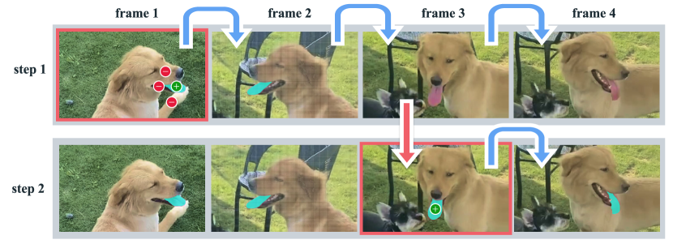

<figcaption>図2: SAM 2 による対話的セグメンテーション。ステップ 1（選択）: フレーム 1 で SAM 2 にプロンプトを与え、対象オブジェクト（舌）のセグメントを得る。緑/赤の点はそれぞれ正/負のプロンプトを示す。SAM 2 はセグメントを後続フレームへ自動的に伝播させ（青い矢印）、masklet を形成する。SAM 2 がオブジェクトを失った場合（フレーム 2 の後）、新フレームで追加プロンプトを提供することで masklet を修正できる（赤い矢印）。ステップ 2（洗練）: フレーム 3 での 1 クリックだけでオブジェクトを回復し、伝播させて正しい masklet を得るのに十分。分離された SAM + 動画トラッカーアプローチは、セグメンテーションがゼロから再開されるため、フレーム 3 で正しく再アノテートするのにフレーム 1 と同様の複数クリックが必要となる。SAM 2 のメモリでは 1 クリックで舌を回復できる。</figcaption>
</figure>

## 4. Model（モデル）

我々のモデルは SAM の動画（および画像）ドメインへの一般化と見なせる。SAM 2（図 3）は個別フレーム上での点、ボックス、マスクプロンプトをサポートし、動画横断でセグメントするオブジェクトの空間範囲を定義する。画像入力に対して、モデルは SAM と類似に振る舞う。プロンプト可能で軽量なマスクデコーダはフレーム埋め込みと（あれば）現在フレーム上のプロンプトを受け取り、そのフレームのセグメンテーションマスクを出力する。プロンプトはフレーム上で反復的に追加でき、マスクを洗練する。

SAM と異なり、SAM 2 デコーダが使うフレーム埋め込みは画像エンコーダから直接ではなく、過去の予測とプロンプトされたフレームのメモリに条件付けられる。プロンプトされたフレームは現在フレームに対して「未来から」来ることもあり得る。フレームのメモリは現在の予測に基づいて memory encoder により作成され、後続フレームで使うため memory bank に置かれる。memory attention 操作は画像エンコーダからの per-frame 埋め込みを取り、それを memory bank に条件付けて埋め込みを生成し、それがマスクデコーダに渡される。

個々のコンポーネントと訓練は以下で記述し、詳細は Appendix C で提供する。

#### Image encoder（画像エンコーダ）.

任意長動画の実時間処理のため、ストリーミングアプローチを取り、動画フレームを利用可能になるにつれ消費する。画像エンコーダは対話全体で 1 回だけ走り、その役割は各フレームを表現する条件付けされていないトークン（特徴量埋め込み）を提供することである。我々は **MAE 事前学習済み Hiera 画像エンコーダ** を使う。これは階層的で、デコード中に多スケール特徴量を使えるようにする。

<figure>

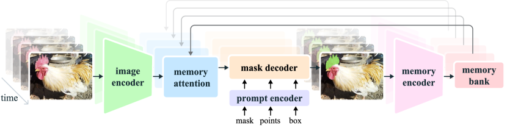

<figcaption>図3: SAM 2 のアーキテクチャ。あるフレームについて、セグメンテーション予測は現在のプロンプトおよび/または過去に観察されたメモリに条件付けられる。動画はストリーミング方式で処理され、フレームが 1 つずつ画像エンコーダで消費され、過去のフレームからの対象オブジェクトのメモリにクロス注意される。マスクデコーダは（オプションで入力プロンプトも取り）そのフレームのセグメンテーションマスクを予測する。最後に memory encoder が予測と画像エンコーダ埋め込み（図には示されていない）を将来フレームで使うため変換する。</figcaption>
</figure>

#### Memory attention（メモリ注意）.

memory attention の役割は、現在フレームの特徴量を過去のフレームの特徴量と予測、および任意の新しいプロンプトに条件付けることである。L 個の transformer ブロックを積み、最初のブロックは現在フレームからの画像エンコーディングを入力として取る。各ブロックは self-attention を実行し、その後（プロンプトされた／されない）フレームのメモリとオブジェクトポインタ（後述）への cross-attention（memory bank に保存されている、後述）、その後 MLP を実行する。self-attention と cross-attention にはバニラ注意操作を使い、効率的注意カーネルの最近の発展（FlashAttention）から利益を得られるようにする。

#### Prompt encoder and mask decoder.

我々の prompt encoder は SAM と同一で、クリック（正または負）、バウンディングボックス、マスクによってプロンプトでき、与えられたフレームでのオブジェクトの範囲を定義する。疎プロンプトは各プロンプト型の学習埋め込みと和を取った位置エンコーディングで表現され、マスクは畳み込みで埋め込まれフレーム埋め込みと和を取る。

我々のデコーダ設計は主に SAM に従う。プロンプトとフレーム埋め込みを更新する「two-way」transformer ブロックを積む。SAM のように、曖昧なプロンプト（つまり 1 クリック）で複数の互換的な対象マスクがあり得る場合、複数のマスクを予測する。この設計は、モデルが妥当なマスクを出力することを保証するために重要である。動画では曖昧性が動画フレーム横断に拡張し得るので、モデルは各フレームで複数のマスクを予測する。後続プロンプトが曖昧性を解決しない場合、モデルは現在フレームに対する最高の予測 IoU を持つマスクのみを伝播させる。

正のプロンプトが与えられたとき常にセグメントすべき妥当なオブジェクトが存在する SAM と異なり、PVS タスクでは一部のフレームで妥当なオブジェクトが存在しないことが可能である（例: 遮蔽による）。この新しい出力モードを考慮するため、関心オブジェクトが現在フレームに存在するかを予測する追加ヘッドを加える。SAM とのもう一つの違いは、マスクデコードのため高解像度情報を組み込むのに（memory attention をバイパスする）階層的画像エンコーダからのスキップ接続を使うことである（§C 参照）。

#### Memory encoder（メモリエンコーダ）.

memory encoder は出力マスクを畳み込みモジュールでダウンサンプルし、画像エンコーダからの条件付けされていないフレーム埋め込み（図 3 には示されていない）と要素ごとに和を取り、軽量畳み込み層で情報を融合することでメモリを生成する。

#### Memory bank（メモリバンク）.

memory bank は最大 N 個の最近フレームのメモリを保持する FIFO キューと、最大 M 個のプロンプトされたフレームの情報を保存する FIFO キューを維持することで、動画における対象オブジェクトの過去の予測に関する情報を保持する。例えば、初期マスクのみがプロンプトの VOS タスクでは、memory bank は最初のフレームのメモリと最大 N 個の最近の（プロンプトされていない）フレームのメモリを常に保持する。両セットのメモリは空間特徴量マップとして保存される。

空間メモリに加え、各フレームのマスクデコーダ出力トークンに基づき、セグメントするオブジェクトの高レベル意味情報のための軽量ベクトルとしてオブジェクトポインタのリストを保存する。我々の memory attention は空間メモリ特徴量とこれらのオブジェクトポインタの両方にクロス注意する。

時間位置情報を N 個の最近フレームのメモリに埋め込み、モデルが短期オブジェクト動を表現できるようにする。一方プロンプトされたフレームのメモリにはそうしない。プロンプトされたフレームからの訓練信号がよりまばらで、訓練中に見られたものとは非常に異なる時間範囲からのプロンプトフレームがあり得る推論設定に汎化することがより難しいためである。

#### Training（訓練）.

モデルは画像と動画データで共同訓練される。先行研究と同様に、モデルの対話的プロンプティングをシミュレートする。8 フレームの系列をサンプルし、ランダムに最大 2 フレームを選んでプロンプトし、訓練中に正解 masklet とモデル予測を使ってサンプルされる修正クリックを確率的に受ける。訓練タスクは正解 masklet を逐次的に（「対話的に」）予測することである。モデルへの初期プロンプトは確率 0.5 で正解マスク、確率 0.25 で正解マスクからサンプルされた正のクリック、確率 0.25 でバウンディングボックス入力であり得る。詳細は §C 参照。

## 5. Data（データ）

動画で「anything をセグメント」する能力を開発するため、大規模で多様な動画セグメンテーションデータセットを収集するデータエンジンを構築した。人間アノテーターを伴う対話的なモデル・イン・ザ・ループセットアップを用いる。SAM と同様、アノテーションされた masklet に意味論的制約を課さず、オブジェクト全体（例: 人）と部位（例: 人の帽子）の両方に焦点を当てる。データエンジンは 3 フェーズを経て、各フェーズはアノテーターに提供されるモデル支援のレベルに基づいて分類される。次に各データエンジンフェーズと SA-V データセットを記述する。

### 5.1 Data engine（データエンジン）

#### Phase 1: SAM per frame.

初期フェーズでは画像ベースの対話的 SAM を使って人間アノテーションを支援した。アノテーターは SAM と、画素精密な手動編集ツール（「ブラシ」「消しゴム」）を使って動画の各フレームで対象オブジェクトのマスクを 6 フレーム/秒（FPS）でアノテートするタスクが課された。マスクの他フレームへの時間伝播を助けるトラッキングモデルは関与しない。これは per-frame 方法でありすべてのフレームでマスクアノテーションをゼロから必要とするためプロセスは遅く、我々の実験では平均アノテーション時間はフレームあたり **37.8 秒** であった。しかし、これはフレームごとに高品質な空間アノテーションをもたらす。このフェーズで、1.4K 動画にわたる 16K masklet を収集した。さらに、評価中の SAM 2 の潜在的バイアスを軽減するため、このアプローチで SA-V val と test セットもアノテートした。

#### Phase 2: SAM + SAM 2 Mask.

第 2 フェーズでは SAM 2 をループに加えた。ここで SAM 2 は **マスクのみをプロンプトとして受け取る**。このバージョンを SAM 2 Mask と呼ぶ。アノテーターは Phase 1 と同様 SAM と他ツールを使って最初のフレームで空間マスクを生成し、SAM 2 Mask を使ってアノテートされたマスクを他のフレームに時間伝播し完全な時空間 masklet を得た。任意の後続動画フレームで、アノテーターは SAM、「ブラシ」/「消しゴム」でゼロからマスクをアノテートすることで SAM 2 Mask が行った予測を空間的に修正し、SAM 2 Mask で再伝播し、このプロセスを masklet が正しくなるまで繰り返せた。SAM 2 Mask は最初に Phase 1 データと公開データセットで訓練された。Phase 2 中にアノテーションループで収集データを使って SAM 2 Mask を 2 回再訓練・更新した。Phase 2 で **63.5K masklet** を収集した。アノテーション時間はフレームあたり 7.4 秒に下がり、Phase 1 に対し約 5.1 倍の高速化となった。

アノテーション時間の改善にもかかわらず、この分離アプローチは中間フレームでのマスクをゼロから（過去のメモリなしで）アノテートする必要がある。次に我々は対話的画像セグメンテーションとマスク伝播の両方を統一モデルで実行できる完全機能版 SAM 2 の開発に進んだ。

#### Phase 3: SAM 2.

最終フェーズでは、点とマスクを含む様々なプロンプト型を受け入れる完全機能版 SAM 2 を利用する。SAM 2 は時間次元横断でオブジェクトのメモリから利益を得てマスク予測を生成する。これは、メモリコンテキストを持たない空間 SAM でゼロからアノテートするのと異なり、アノテーターは中間フレームで予測 masklet を編集するためときどきの洗練クリックを SAM 2 に提供するだけで済むことを意味する。Phase 3 中、収集アノテーションを使って SAM 2 を 5 回再訓練・更新した。SAM 2 をループに持つことで、フレームあたりのアノテーション時間は **4.5 秒** に下がり、Phase 1 に対し **約 8.4 倍の高速化** となった。Phase 3 で **197.0K masklet** を収集した。

#### Quality verification（品質検証）.

高水準のアノテーションを維持するため、検証ステップを導入する。別のアノテーターセットが各アノテーションされた masklet の品質を「満足」（すべてのフレームで対象オブジェクトを正しく一貫して追跡）または「不満足」（対象オブジェクトは明確な境界で定義されているが masklet が正しくないか一貫していない）として検証するタスクを課された。不満足な masklet はアノテーションパイプラインに戻され洗練される。明確に定義されていないオブジェクトを追跡している masklet はすべて完全に拒否された。

#### Auto masklet generation（自動 masklet 生成）.

アノテーションの多様性を確保することはモデルの anything 能力を可能にするのに重要である。人間アノテーターは典型的に顕著なオブジェクトに焦点を当てるかもしれないので、自動的に生成された masklet（「Auto」と呼ぶ）でアノテーションを拡張する。これはアノテーションのカバレッジ増加とモデル失敗ケースの識別の二重目的を果たす。auto masklet 生成のため、最初のフレームで規則的な点グリッドで SAM 2 にプロンプトし候補 masklet を生成する。これらは次に masklet 検証ステップに送られフィルタリングされる。「満足」とタグ付けされた自動 masklet は SA-V データセットに加えられる。「不満足」（つまりモデル失敗ケース）と識別された masklet はサンプルされてアノテーターに提示され、SAM 2 をループに使って洗練される（データエンジンの Phase 3）。これらの自動 masklet は大きな顕著中心オブジェクトをカバーするが、背景にも様々なサイズと位置のオブジェクトもカバーする。

**表1: データエンジン各フェーズの進化を示す（フレームあたりの平均アノテーション時間、masklet あたりの編集フレーム平均率、クリックされたフレームあたりの手動クリック数、マスクサイズ別の Phase 1 マスクアラインメントスコア）。**

| フェーズ | モデル・イン・ザ・ループ | フレームあたり時間 | 編集フレーム | クリックされたフレームあたりのクリック | All | Small | Medium | Large |
|---|---|---|---|---|---|---|---|---|
| Phase 1 | SAM のみ | 37.8 s | 100.00% | 4.80 | - | - | - | - |
| Phase 2 | SAM + SAM 2 Mask | 7.4 s | 23.25% | 3.61 | 86.4% | 71.3% | 80.4% | 97.9% |
| Phase 3 | SAM 2 | 4.5 s | 19.04% | 2.68 | 89.1% | 72.8% | 81.8% | 100.0% |

#### Analysis（分析）.

表 1 は制御実験を通した各データエンジンフェーズのアノテーションプロトコルの比較を示す（詳細は §D.2.2）。フレームあたりの平均アノテーション時間、masklet あたりの手動編集されたフレームの平均率、クリックされたフレームあたりの平均クリック数を比較する。品質評価のため、対応する Phase 1 のマスクに対する IoU が 0.75 を超えるマスクの割合として **Phase 1 マスクアラインメントスコア** を定義する。Phase 1 データは、フレームごとに高品質な手動アノテーションを持つため、参照として選ばれる。SAM 2 をループに持つ Phase 3 は効率増加と同等品質をもたらす：Phase 1 より 8.4 倍速く、最低の編集フレーム率とフレームあたりクリック数を持ち、より良いアラインメントになる。

**表2: 各データエンジンフェーズからデータを追加することによるセグメンテーション精度（𝒥&ℱ メトリクス）の改善。「VOS」は動画オブジェクトセグメンテーションデータセットのセット。詳細は §E。**

| 訓練データ | SA-V val | 9 zero-shot |
|---|---|---|
| VOS + SA-1B | 50.0 | 62.5 |
| + Phase 1 | 53.0 | 66.9 |
| + Phase 2 | 58.8 | 70.9 |
| + Phase 3 | 62.5 | 71.2 |
| + Auto | 63.2 | 71.5 |

表 2 では、イテレーション数を固定して各フェーズの最終時点で利用可能なデータで訓練された SAM 2 の性能比較を示し、追加データの影響だけを測定する。我々自身の SA-V val セットと 9 個のゼロショットベンチマーク（§E.1 に詳細）で、最初のフレームでの 3 クリックプロンプティング時に標準 𝒥&ℱ 精度メトリクス（高いほど良い）を使って評価する。各フェーズのデータを反復的に含めることで、in-domain の SA-V val セットだけでなく 9 個のゼロショットベンチマークでも一貫した改善を観察する。

<figure>

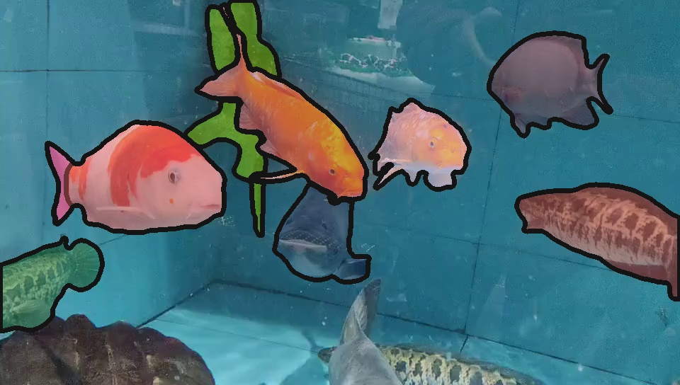

<figcaption>図4: SA-V データセットからの masklet がオーバーレイされた例動画（手動と自動）。各 masklet には固有色があり、各行は 1 動画からのフレームを表現し、1 秒間隔。</figcaption>
</figure>

### 5.2 SA-V dataset

データエンジンで収集された SA-V データセットは **50.9K 動画 × 642.6K masklet** からなる。表 3 では SA-V の構成を一般的な VOS データセットと動画数、masklet 数、マスク数で比較する。注目すべきは、アノテーションされたマスク数が既存のどの VOS データセットよりも **53 倍**（auto なしで 15 倍）大きく、将来の研究に大きなリソースを提供することである。我々は寛容なライセンスで SA-V を公開する。

#### Videos（動画）.

クラウドワーカーが撮影した 50.9K 動画の新セットを収集した。動画は 54% 屋内シーン、46% 屋外シーン、平均 14 秒の長さからなる。動画は「in-the-wild」の多様な環境を特徴とし、様々な日常シナリオをカバーする。我々のデータセットは既存 VOS データセットより多くの動画を持ち、図 5 に示すように動画は **47 か国** にまたがり、多様な参加者（自己申告人口統計）によって撮影された。

#### Masklets.

アノテーションは **190.9K の手動 masklet アノテーション** と **451.7K の自動 masklet** からなる（データエンジンで収集）。masklet がオーバーレイされた例動画（手動と自動）は図 4 に示される。SA-V は最大の VOS データセットより 53 倍（auto アノテーションなしで 15 倍）多くのマスクを持つ。SA-V Manual における disappearance rate（アノテーションされた masklet のうち少なくとも 1 フレームで消えてから再出現するものの割合）は **42.5%** で、既存データセットの中で競合的である。図 5(a) は DAVIS、MOSE、YouTubeVOS とのマスクサイズ分布（動画解像度で正規化）の比較を示す。SA-V マスクの **88% 以上** が正規化マスク面積 0.1 未満を持つ。

#### SA-V training, validation and test splits.

我々は動画の作成者（およびその地理的位置）に基づき SA-V を分割し、類似オブジェクトの重複を最小化する。SA-V val と SA-V test セットを作成するため、動画を選ぶ際に困難なシナリオに焦点を当て、アノテーターに高速移動、他オブジェクトによる複雑な遮蔽、消失/再出現パターンを持つ **困難な対象** を識別するよう求める。これらの対象は §5.1 のデータエンジン Phase 1 セットアップを使って 6 FPS でアノテートされた。SA-V val 分割には 293 masklet と 155 動画、SA-V test 分割には 278 masklet と 150 動画がある。

#### Internal dataset.

訓練セットをさらに増強するため、内部で利用可能なライセンス取得済み動画データも使った。我々の内部データセットは Phase 2 と Phase 3 でアノテートされた 62.9K 動画と 69.6K masklet（訓練用）、Phase 1 でアノテートされた 96 動画と 189 masklet（Internal-test）からなる。

データエンジンと SA-V データセットの詳細は Appendix D 参照。

**表3: 我々のデータセットとオープンソース VOS データセットの比較。**

| データセット | 動画数 | 時間 | masklet 数 | マスク数 | フレーム数 | Disapp. Rate |
|---|---|---|---|---|---|---|
| DAVIS 2017 | 0.2K | 0.1 hr | 0.4K | 27.1K | 10.7K | 16.1% |
| YouTube-VOS | 4.5K | 5.6 hr | 8.6K | 197.3K | 123.3K | 13.0% |
| UVO-dense | 1.0K | 0.9 hr | 10.2K | 667.1K | 68.3K | 9.2% |
| VOST | 0.7K | 4.2 hr | 1.5K | 175.0K | 75.5K | 41.7% |
| BURST | 2.9K | 28.9 hr | 16.1K | 600.2K | 195.7K | 37.7% |
| MOSE | 2.1K | 7.4 hr | 5.2K | 431.7K | 638.8K | 41.5% |
| Internal | 62.9K | 281.8 hr | 69.6K | 5.4M | 6.0M | 36.4% |
| **SA-V Manual** | **50.9K** | **196.0 hr** | **190.9K** | **10.0M** | **4.2M** | **42.5%** |
| **SA-V Manual+Auto** | **50.9K** | **196.0 hr** | **642.6K** | **35.5M** | **4.2M** | **27.7%** |

## 6. Zero-shot experiments（ゼロショット実験）

ここでは SAM 2 を先行研究とゼロショット動画タスク（§6.1）と画像タスク（§6.2）で比較する。動画には標準 𝒥&ℱ メトリクス、画像タスクには mIoU メトリクスを報告する。特に明記しない限り、本節で報告される結果はデフォルトセットアップ（Hiera-B+ 画像エンコーダ + 解像度 1024 + 全データセット組み合わせで訓練、表 7 の SAM 2 (Hiera-B+)）に従う（詳細は §C.2 参照）。

### 6.1 Video tasks（動画タスク）

#### 6.1.1 Promptable video segmentation（プロンプト可能動画セグメンテーション）

<figure>

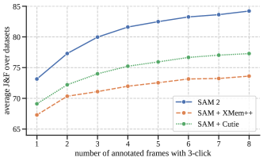

<figcaption>図6: 9 データセット上の対話的オフラインとオンライン評価設定でのゼロショット精度。SAM 2 は両設定で SAM+XMem++ と SAM+Cutie を上回る。</figcaption>
</figure>

我々はまずユーザー体験に似た対話的設定をシミュレートする promptable video segmentation を評価する。2 つの設定がある：オフライン評価（最大モデルエラーに基づいて対話するフレームを選ぶため動画を複数回パスする）、オンライン評価（フレームが動画を 1 回前方パスでアノテートされる）。これらの評価は 9 個の密にアノテートされたゼロショット動画データセットで N_click = 3 クリック/フレームを使って実施される（詳細は §E.1）。

我々は動画オブジェクトセグメンテーションの 2 つの SOTA モデル XMem++ と Cutie に基づく **SAM+XMem++ と SAM+Cutie** という 2 つの強力なベースラインを作成する。XMem++ を使って 1 つまたは複数フレームのマスク入力に基づき動画セグメンテーションを生成する。SAM は初期マスクの提供や出力洗練（現在のセグメンテーションをマスクプロンプトとして SAM に供給）に使われる。SAM+Cutie ベースラインのため、複数フレームでマスク入力を取れるよう Cutie を修正する。

図 6 では、N_frame = 1,...,8 対話フレーム上の平均 𝒥&ℱ 精度を報告する。SAM 2 はオフラインとオンライン評価設定の両方で SAM+XMem++ と SAM+Cutie を上回る。9 データセット全て（per-dataset 結果は §E.1）で SAM 2 が両方の手法を支配し、SAM 2 が少数のクリックから高品質動画セグメンテーションを生成し、さらなるプロンプトで結果の継続的洗練を許せることを確認している。全体的に、SAM 2 は **3 倍以上少ない対話** でより良いセグメンテーション精度を生成できる。

#### 6.1.2 Semi-supervised video object segmentation（半教師あり動画オブジェクトセグメンテーション）

**表4: 異なるプロンプト下での半教師あり VOS 評価における 17 個の動画データセットを横断したゼロショット精度。**

| 手法 | 1-click | 3-click | 5-click | bounding box | ground-truth mask |
|---|---|---|---|---|---|
| SAM+XMem++ | 56.9 | 68.4 | 70.6 | 67.6 | 72.7 |
| SAM+Cutie | 56.7 | 70.1 | 72.2 | 69.4 | 74.1 |
| **SAM 2** | **64.3** | **73.2** | **75.4** | **72.9** | **77.6** |

次に最初のフレームのみでのクリック、ボックス、マスクプロンプトで半教師あり動画オブジェクトセグメンテーション（VOS）設定を評価する。クリックプロンプトを使うとき、最初の動画フレームで 1、3、または 5 クリックを対話的にサンプルし、これらのクリックに基づいてオブジェクトをトラックする。

§6.1.1 の対話的設定と類似に、クリックとボックスプロンプトに SAM を使う XMem++ と Cutie、マスクプロンプトを使うときデフォルト設定の XMem++ と Cutie と比較する。VOST 以外で標準 𝒥&ℱ 精度を報告する。VOST ではその標準プロトコルに従い 𝒥 メトリクスを報告する。結果は表 4 に示される。SAM 2 は様々な入力プロンプトを使って 17 データセットで両ベースラインを上回る。結果は SAM 2 がマスク入力を伴う従来の非対話的 VOS タスク（これらの他の研究が専門に設計されている）でも優れていることを強調する。詳細は §E.1.3 参照。

#### 6.1.3 Fairness evaluation（公平性評価）

**表5: 保護された人口統計グループに対する SAM 2 の公平性評価（𝒥&ℱ メトリクス）。**

| | 1-click | 3-click | mask |
|---|---|---|---|
| **性別** | | | |
| 男性 | 81.9 | 95.1 | 95.9 |
| 女性 | 75.1 | 94.1 | 95.2 |
| **年齢** | | | |
| 18-26 | 77.2 | 95.0 | 95.7 |
| 26-50 | 76.7 | 94.7 | 95.8 |
| 50+ | 81.4 | 95.1 | 96.2 |

我々は人口統計グループを横断した公平性で SAM 2 を評価する。Ego-Exo4D データセットの people カテゴリのアノテーションを収集する。これは動画の被験者が提供した自己申告人口統計情報を含む。SA-V val と test セットと同じアノテーションセットアップを使用し、これを第三者（exo）動画からの 20 秒クリップに適用する。SAM 2 をこのデータで第 1 フレームでの 1、3 クリックと正解マスクで評価する。

表 5 は性別と年齢を横断した人々セグメンテーションの SAM 2 の 𝒥&ℱ 精度比較を示す。3 クリックと正解マスクプロンプトで最小限の差異がある。1 クリック予測を手動で検査し、モデルがしばしば人物の代わりに部位のマスクを予測することを見出す。人物が正しくセグメントされたクリップに比較を限定するとき、1 クリックでのギャップは大幅に縮小する（𝒥&ℱ 男性 94.3、女性 92.7）、差異が部分的にプロンプトの曖昧性に起因し得ることを示唆する。

Appendix G で SA-V のモデル、データ、アノテーションカードを提供する。

### 6.2 Image tasks（画像タスク）

我々は SAM 2 を Segment Anything タスクで 37 個のゼロショットデータセット（SAM 用に以前使われた 23 データセットを含む）で評価する。1 クリックと 5 クリック mIoU を表 6 で報告し、データセットドメインとモデル速度（単一 A100 GPU で fps）別の平均 mIoU を示す。

最初の列（SA-23 All）は SAM の 23 データセットでの精度を示す。SAM 2 は SAM より高精度（1 クリックで 58.9 mIoU vs SAM 58.1 mIoU）を、追加データを使わずに、かつ **6 倍速** で達成する。これは主に SAM 2 のより小さく効果的な Hiera 画像エンコーダに帰属できる。

最後の行は SA-1B と動画データミックスでの訓練が 23 データセットでの平均精度を 61.4% にさらに改善できることを示す。SA-23 の動画ベンチマーク（動画データセットは [SAM] と同様画像として評価される）と追加した 14 個の新動画データセットでも例外的なゲインが見られる。

**表6: 37 データセットを横断した Segment Anything タスクでのゼロショット精度。SAM 2 と SAM のドメイン（画像/動画）別の平均 1 クリック・5 クリック mIoU。SAM が使った 23 データセット（SA-23）と追加 14 個のゼロショット動画データセットでの平均メトリクス（§E.3 で詳細）を報告。**

| モデル | データ | SA-23 All | SA-23 Image | SA-23 Video | 14 new Video | FPS |
|---|---|---|---|---|---|---|
| SAM | SA-1B | 58.1 (81.3) | 60.8 (82.1) | 54.5 (80.3) | 59.1 (83.4) | 21.7 |
| SAM 2 | SA-1B | 58.9 (81.7) | 60.8 (82.1) | 56.4 (81.2) | 56.6 (83.7) | **130.1** |
| **SAM 2** | **our mix** | **61.4 (83.7)** | **63.1 (83.9)** | **59.1 (83.3)** | **69.6 (86.0)** | **130.1** |

全体として、発見は SAM 2 が対話的動画と画像セグメンテーションの両方の能力を持つことを強調し、これは動画と静的画像を視覚ドメイン横断で含む我々の多様な訓練データから派生する強みである。データセット別の詳細結果を含む詳細は §E.3。

## 7. Comparison to state-of-the-art in semi-supervised VOS（半教師あり VOS における SOTA との比較）

我々の主要焦点は一般的・対話的な PVS タスクだが、特定の半教師あり VOS 設定（第 1 フレームでの正解マスクがプロンプト）にも対処する。これは歴史的に一般的なプロトコルだからである。SAM 2 の 2 バージョンを、異なる速度 vs 精度トレードオフを持つ画像エンコーダサイズ（Hiera-B+/-L）で評価する。バッチサイズ 1 を使う単一 A100 GPU で fps を測定する。Hiera-B+ と Hiera-L に基づく SAM 2 はそれぞれ 43.8 と 30.2 FPS の実時間速度で動作する。

既存 SOTA との比較を表 7 で提示し、標準プロトコルで精度を報告する。SAM 2 は既存の最良手法より大きな改善を示す。より大きい画像エンコーダを使うことが全体に大きな精度ゲインをもたらすことを観察する。

「any」オブジェクトクラスのオープンワールドセグメントの性能を測定する SA-V val と test セットでの既存研究も評価する。このベンチマークで比較すると、ほとんどの先行手法がほぼ同じ精度でピークに達することがわかる。先行研究の SA-V val と SA-V test での最高性能は大幅に低く、「動画における anything のセグメント」能力へのギャップを示す。最後に SAM 2 は LVOS ベンチマーク結果で観察される、長期動画オブジェクトセグメンテーションでも顕著なゲインをもたらすことを見る。

**表7: 先行研究との VOS 比較。SAM 2 は第 1 フレーム正解マスクプロンプトに基づく動画セグメンテーション（𝒥&ℱ, 𝒢）で良好な精度を発揮。SAM 2 は SA-V val/test で大幅に良い性能。**

| 手法 | MOSE val | DAVIS 2017 val | LVOS val | SA-V val | SA-V test | YTVOS 2019 val |
|---|---|---|---|---|---|---|
| XMem | 59.6 | 86.0 | - | 60.1 | 62.3 | 85.6 |
| DEVA | 66.0 | 87.0 | 55.9 | 55.4 | 56.2 | 85.4 |
| Cutie-base+ | 71.7 | 88.1 | - | 61.3 | 62.8 | 87.5 |
| **SAM 2 (Hiera-B+)** | **75.8** | **90.9** | **74.9** | **73.6** | **74.1** | **88.4** |
| **SAM 2 (Hiera-L)** | **77.2** | **91.6** | **76.1** | **75.6** | **77.6** | **89.1** |

## 8. Data and model ablations（データとモデルのアブレーション）

本節は SAM 2 の設計決定を導いたアブレーションを提示する。MOSE 開発セット（"MOSE dev"、MOSE 訓練分割からランダムサンプルされた 200 動画でアブレーションの訓練データから除外）、SA-V val、9 ゼロショット動画データセット平均で評価する。比較指標として、1 クリック領域と VOS 風マスクプロンプトの中間としての第 1 フレームでの 3 クリック入力下での 𝒥&ℱ を報告する。さらに SAM が SA タスクの画像に対し使った 23 データセットベンチマーク上の平均 1 クリック mIoU を報告する。特に明記しない限り、アブレーションは 512 解像度で SA-V manual と SA-1B の 10% サブセットで実行する。追加詳細は §C.2 参照。

### 8.1 Data ablations（データのアブレーション）

#### Data mix ablation（データミックスのアブレーション）.

表 8 で異なるデータミックスで訓練された SAM-2 の精度を比較する。SA-1B で事前学習し、その後各設定で別のモデルを訓練する。訓練データのみが実験間で変わり、イテレーション数（200k）とバッチサイズ（128）を固定する。SA-V val セット、MOSE、9 ゼロショット動画ベンチマーク、SA-23 タスク（§6.2）で精度を報告する。行 1 は純粋に VOS データセット（Davis、MOSE、YouTubeVOS）で訓練されたモデルが in-domain の MOSE dev では良好だが、9 ゼロショット VOS データセットを含む他すべてで劣る（59.7 𝒥&ℱ）ことを示す。

データエンジンデータを訓練ミックスに加えることから驚異的な利益を観察する（9 ゼロショットデータセットでの +12.1% 平均性能改善、行 11 vs 1）。これは VOS データセットの限定されたカバレッジとサイズに起因し得る。SA-1B 画像を加えると VOS 能力を低下させずに画像セグメンテーションタスクの性能が改善する（行 3 vs 4、5 vs 6、9 vs 10、11 vs 12）。SA-V と SA-1B のみで訓練（行 4）すれば MOSE 以外のすべてのベンチマークで強力な性能を得るのに十分。全体的に、すべてのデータセット（VOS、SA-1B、データエンジンデータ）をミックスするときに最良の結果を得る（行 12）。

#### Data quantity ablation（データ量のアブレーション）.

次に訓練データのスケーリングの影響を研究する。SAM 2 は SA-V で訓練前に SA-1B で事前学習される。3 ベンチマーク（SA-V val、ゼロショット、MOSE dev）で第 1 フレーム 3 クリックプロンプティング時の平均 𝒥&ℱ スコアを報告する。図 7 はすべてのベンチマークで訓練データ量と動画セグメンテーション精度の間に一貫した冪乗則関係を示す。

<figure>

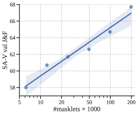

<figcaption>図7: SA-V 量の関数としての SAM 2 の性能。第 1 フレーム 3 クリックプロンプト下での 𝒥&ℱ 精度を SA-V val（左）、9 ゼロショットデータセット（中）、MOSE dev（右）で報告。すべてのベンチマークで冪乗則スケーリングを観察。</figcaption>
</figure>

#### Data quality ablation（データ品質のアブレーション）.

表 9 で品質のフィルタリング戦略を実験する。SA-V から 50k masklet をランダムまたはアノテーターに最も編集された masklet を取ることでサブサンプルする。編集フレーム数に基づくフィルタリングは、ランダムサンプリングを上回り、25% のデータだけで強力な性能をもたらす。しかし、すべての 190k SA-V masklet を使うよりは悪い。

### 8.2 Model architecture ablations（モデルアーキテクチャのアブレーション）

本節ではモデルアブレーションを提示する（デフォルトで 512 入力解像度の小モデルセットアップで実施）。各アブレーション設定について、動画（𝒥&ℱ）と画像（mIoU）タスクのセグメンテーション精度、その相対動画セグメンテーション速度（灰色のアブレーションデフォルトセットアップに対する最大推論スループット）を報告する。我々は画像と動画コンポーネントの設計選択が大きく分離可能であることを発見した――これは我々のモジュラー設計と訓練戦略に帰属できる。

#### 8.2.1 Capacity ablations（容量のアブレーション）

##### Input size（入力サイズ）.

訓練中、固定解像度と固定長（ここでは #frames で示す）のフレーム系列をサンプルする。それらの影響を表 10(a), 10(b) でアブレートする。より高い解像度は画像と動画タスクで大きな改善をもたらし、最終モデルでは入力解像度 1024 を使う。フレーム数増加は動画ベンチマークで顕著なゲインをもたらし、速度と精度のバランスを取るためデフォルトで 8 を使う。

##### Memory size（メモリサイズ）.

最大メモリ数 N を増やすことは一般的に性能を助けるが分散があり得る（表 10(c)）。時間コンテキスト長と計算コストのバランスを取るため過去 6 フレームのデフォルト値を使う。メモリにより少ないチャネルを使っても性能はほとんど劣化せず（表 10(d)）、保存に必要なメモリは 4 倍小さくなる。

##### Model size（モデルサイズ）.

画像エンコーダや memory-attention（#self-/#cross-attention block）の容量増加は一般的に結果を改善する（表 10(e), 10(f)）。画像エンコーダのスケーリングは画像と動画メトリクス両方でゲインをもたらすが、memory-attention のスケーリングは動画メトリクスのみを改善する。我々は速度と精度の妥当なバランスを提供する B+ 画像エンコーダをデフォルトで使う。

#### 8.2.2 Relative positional encoding（相対位置エンコーディング）

デフォルトで画像エンコーダと memory attention の両方で常に絶対位置エンコーディングを使う。表 11 で相対位置エンコーディング設計選択を研究する。ここでは長期動画オブジェクトセグメンテーションのベンチマークとして第 1 フレーム 3 クリックでの LVOSv2 でも評価する。

SAM がすべての画像エンコーダ層に relative positional bias（RPB）を加える先行研究に従う一方、Hiera 論文は global attention 層以外のすべてで RPB を除去しつつ大きな速度ゲインをもたらす「absolute-win」位置エンコーディングを採用することでこれを改善する。我々はさらに画像エンコーダから RPB をすべて除去することでこれを改善する。SA-23 で性能劣化なし、動画ベンチマークで最小限の劣化（表 11 参照）、1024 解像度で大きな速度ブーストを与える。memory attention で **2D-RoPE** を使うことも有益であることを発見した。

#### 8.2.3 Memory architecture ablations（メモリアーキテクチャのアブレーション）

##### Recurrent memory（再帰メモリ）.

メモリ特徴量を memory bank に加える前に GRU に供給する有効性を調査する。表 12 の我々の発見は、このアプローチが（LVOSv2 でわずかに以外）改善を提供しないことを示唆する。代わりにメモリ特徴量を memory bank に直接保存することが十分で、よりシンプルかつ効率的であることがわかる。

##### Object pointers（オブジェクトポインタ）.

他フレームのマスクデコーダ出力からオブジェクトポインタベクトルへのクロス注意の影響をアブレートする。表 12 の結果は、オブジェクトポインタへのクロス注意が 9 ゼロショットデータセットを横断した平均性能を強化しない一方、SA-V val データセットと困難な LVOSv2 ベンチマーク（検証分割）での性能を大幅に押し上げることを示す。したがって、memory bank と一緒にオブジェクトポインタへのクロス注意をデフォルトとする。

## 9. Conclusion（結論）

我々は 3 つの主要側面に基づき、Segment Anything の動画ドメインへの自然な進化を提示する：(i) promptable segmentation タスクを動画へ拡張、(ii) 動画に適用するときメモリを使うように SAM アーキテクチャを装備、(iii) 訓練・ベンチマーキング用の多様な SA-V データセット。我々は SAM 2 が視覚知覚における大きな進歩を示し、本貢献がさらなる研究と応用を推進するマイルストーンとして位置づけられると信じる。

## Appendix A. Details on the PVS Task（PVS タスクの詳細）

Promptable Visual Segmentation（PVS）タスクは Segment Anything（SA）タスクの静的画像から動画への拡張と見なせる。PVS 設定では、入力動画が与えられたとき、モデルはクリック、ボックス、マスクを含む異なる種類の入力で動画の任意フレームで対話的にプロンプトでき、動画全体で妥当なオブジェクトをセグメント（およびトラック）することを目標とする。動画と対話するとき、モデルはプロンプトされているフレームで即時応答を提供し（画像での SAM の対話的体験に似て）、動画全体でのオブジェクトのセグメンテーションを近実時間で返す。SAM と同様に焦点は明確に定義された境界を持つ妥当なオブジェクトにあり、視覚境界のない領域は考慮しない。図 8 がタスクを示す。

<figure>

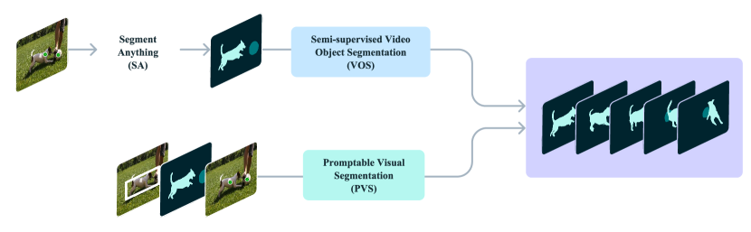

<figcaption>図8: Promptable Visual Segmentation タスク（PVS）の図解。Segment Anything（SA）や半教師あり Video Object Segmentation（VOS）のような従来研究されたタスクは PVS タスクの特殊ケースとして見なせる。</figcaption>
</figure>

PVS は静的画像と動画ドメインのいくつかのタスクに関連する。画像では、SA タスクは動画が単一フレームに削減された PVS のサブセットと見なせる。同様に、伝統的な半教師ありと対話的 VOS タスクは PVS の特殊ケースで、それぞれ第 1 フレームでのみ提供されるマスクプロンプトと、動画全体でオブジェクトをセグメントするための複数フレーム上のスクリブルに限定される。PVS では、プロンプトはクリック、マスク、ボックスのいずれかで、焦点は対話的体験の強化で、最小限の対話でオブジェクトのセグメンテーションの容易な洗練を可能にする。

## Appendix B. Limitations（限界）

SAM 2 は静的画像と動画ドメインの両方で強力な性能を実証するが、特定のシナリオで困難に遭遇する。モデルは **ショット変化を横断したオブジェクトのセグメント** に失敗し得、混雑シーン、長い遮蔽後、長い動画でオブジェクトを失ったり混同し得る。この問題を緩和するため、任意のフレームで SAM 2 にプロンプトを与えられる能力を設計した：モデルがオブジェクトを失ったりエラーをする場合、追加フレームでの洗練クリックがほとんどの場合正しい予測を迅速に回復できる。SAM 2 は **非常に細い・細かい詳細を持つオブジェクト**、特に高速移動するものの正確な追跡にも苦戦する。もう一つの困難なシナリオは **類似外観の近接オブジェクト**（例: 複数の同一ジャグリングボール）がある場合に発生する。SAM 2 に明示的運動モデリングを組み込むことで、こうしたケースのエラーを緩和できるかもしれない。

SAM 2 は動画内で複数オブジェクトを同時にトラックできるが、SAM 2 は各オブジェクトを別々に処理し、共有 per-frame 埋め込みのみを利用し、オブジェクト間通信はない。このアプローチはシンプルだが、共有オブジェクトレベルのコンテキスト情報を組み込むことで効率を改善できるかもしれない。

我々のデータエンジンは masklet 品質を検証し修正を必要とするフレームを選ぶため人間アノテーターに依存する。将来の発展ではこのプロセスを自動化して効率を強化できるかもしれない。

## Appendix C. SAM 2 details

### C.1 Architecture

ここでは §4 のモデル記述を拡張するさらなるアーキテクチャ詳細を議論する。

#### Image encoder.

各フレームの画像埋め込みを生成するため、Hiera 画像エンコーダの Stage 3 と 4 からの stride 16 と 32 特徴量を融合する feature pyramid network を使う。さらに、Stage 1 と 2 からの stride 4 と 8 特徴量は memory attention では使われないが、図 9 に示すようにマスクデコーダのアップサンプリング層に加えられ、高解像度セグメンテーション詳細を生成するのを助ける。Hiera 論文に従い、Hiera 画像エンコーダで windowed 絶対位置埋め込みを使う。Hiera ではすべての画像エンコーダ層を RPB が画像エンコーダ内で windows 横断の位置情報を提供したが、それに代えて、windows を横断するためグローバル位置埋め込みを補間するというよりシンプルなアプローチを採用する。我々は relative positional encoding を使わない。T、S、B+、L の異なる画像エンコーダサイズでモデルを訓練する。我々は画像エンコーダ層の一部のサブセットのみで global attention を使う先行研究 [62] に従う。

#### Memory attention.

sinusoidal 絶対位置埋め込みに加え、self-attention と cross-attention 層で **2D 空間 Rotary Positional Embedding（RoPE）** を使う。オブジェクトポインタトークンは特定の空間対応を持たないため RoPE から除外される。デフォルトで memory attention は L=4 層を使う。

<figure>

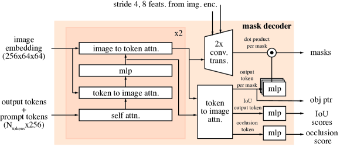

<figcaption>図9: マスクデコーダのアーキテクチャ。設計は主に SAM に従い、さらにアップサンプリング中の画像エンコーダからの stride 4 と 8 特徴量を含める。出力マスクに対応するマスクトークンをオブジェクトポインタとして使い、関心オブジェクトが現在フレームで可視かを示す occlusion score を生成する。</figcaption>
</figure>

#### Prompt encoder and mask decoder.

prompt encoder の設計は SAM に従い、次に mask decoder の設計変更の追加詳細を議論する。出力マスクに対応するマスクトークンをそのフレームのオブジェクトポインタトークンとして使い、memory bank に置く。§4 で議論したように、occlusion 予測ヘッドも導入する。これはマスクと IoU 出力トークンとともに追加トークンを含むことで達成される。追加 MLP ヘッドがこの新トークンに適用され、関心オブジェクトが現在フレームで可視である尤度を示すスコアを生成する（図 9 参照）。

SAM は画像中でセグメントされるオブジェクトについて曖昧性に直面したとき複数の妥当マスクを出力する能力を導入した。例えば、人物が自転車のタイヤをクリックするとき、モデルはこのクリックをタイヤのみまたは自転車全体を参照すると解釈でき、複数の予測を出力できる。動画では、この曖昧性が動画フレーム横断に拡張し得る。例えば、あるフレームで唯一タイヤが可視なら、タイヤへのクリックはタイヤだけに関係するかもしれないし、後続フレームで自転車のさらに多くが可視になるにつれて、このクリックは自転車全体のために意図された可能性がある。この曖昧性を扱うため、SAM 2 は動画の各ステップで複数のマスクを予測する。さらなるプロンプトが曖昧性を解決しない場合、モデルは動画でのさらなる伝播のために現在フレームに対する最高の予測 IoU を持つマスクを選択する。

#### Memory encoder and memory bank.

我々の memory encoder は追加画像エンコーダを使わず、代わりに Hiera エンコーダが生成した画像埋め込みを再利用する。これは予測マスク情報と融合してメモリ特徴量を生成する（§4 で議論したように）。この設計はメモリ特徴量が画像エンコーダが生成した強力な表現から利益を得ることを可能にする（特に画像エンコーダをより大きなサイズにスケールするとき）。さらに、memory bank のメモリ特徴量を 64 次元に投影し、memory bank へのクロス注意のため 256 次元オブジェクトポインタを 64 次元の 4 トークンに分割する。

### C.2 Training

#### C.2.1 Pre-training.

まず静的画像で SA-1B データセット上で SAM 2 を事前学習する。表 13(a) は SA-1B での事前学習中に使われた設定を詳細に示す――ここで言及されていない他の設定は SAM 論文に従う。画像エンコーダは **MAE 事前学習済み Hiera** から初期化される。SAM と同様、画像の 90% を超えるマスクをフィルタリングし、画像あたりランダムサンプルされた 64 マスクに訓練を制限する。

SAM と異なり、IoU 予測をより積極的に教師あり学習し、IoU ロジットに sigmoid 活性化を適用して出力を 0 と 1 の範囲に制限するために **ℓ1 損失** を使うことが有益であることを発見した。多重マスク予測（最初のクリックで）の場合、いつマスクが悪いかをより良く学習するためすべてのマスクの IoU 予測を教師あり学習するが、最低セグメンテーション損失（focal と dice 損失の線形結合）を持つマスクロジットのみを教師あり学習する。SAM では点の反復サンプリング中、追加プロンプトなしで（前マスクロジットのみを供給して）2 イテレーションが挿入された――我々は訓練中そのようなイテレーションを加えず、（SAM の 8 に対し）7 修正クリックを使う。訓練中に水平反転拡張も使用し、画像を 1024×1024 の正方形にリサイズする。

AdamW を使い、画像エンコーダに層別減衰を適用し、reciprocal square-root スケジュールに従う。事前学習段階のハイパーパラメータは表 13(a) 参照。

#### C.2.2 Full training.

事前学習後、SAM 2 を我々が導入したデータセット SA-V + Internal、SA-1B の 10% サブセット、DAVIS、MOSE、YouTubeVOS を含むオープンソース動画データセットの混合で訓練する。我々が公開するモデルは SA-V manual + Internal と SA-1B で訓練される。

SAM 2 は 2 つのタスクのために設計されている：PVS タスク（動画）と SA タスク（画像）。訓練は画像と動画データで共同で行われる。訓練中のデータ利用と計算リソースを最適化するため、動画データ（複数フレーム）と静的画像（単一フレーム）の間で **交互訓練戦略** を採用する。具体的には各訓練イテレーションで、画像または動画データセットから完全バッチをサンプルし、サンプリング確率は各データソースのサイズに比例する。このアプローチは両タスクへのバランスの取れた露出と、計算利用を最大化する各データソースに対する異なるバッチサイズを許す。画像タスクの設定はここで明示的に言及されていない限り事前学習フェーズの設定に従う。完全訓練段階のハイパーパラメータは表 13(b) 参照。訓練データミックスは約 15.2% SA-1B、約 70% SA-V、約 14.8% Internal からなる。オープンソースデータセットが含まれるときも同じ設定が使われ、追加データが含まれる（約 1.3% DAVIS、約 9.4% MOSE、約 9.2% YouTubeVOS、約 15.5% SA-1B、約 49.5% SA-V、約 15.1% Internal）。

**表13(a) 事前学習設定**: データ SA-1B、ステップ約 90k、解像度 1024、bfloat16、AdamW（β₁,β₂=0.9, 0.999）、勾配クリッピング ℓ2 max 0.1、weight decay 0.1、lr 4e-4、reciprocal sqrt スケジュール、ウォームアップ 1k iter、クールダウン 5k iter、層別減衰 0.8/0.9/0.925（T,S/B+/L）、水平反転拡張、バッチサイズ 256、drop path 0.1/0.2/0.3（T,S/B+/L）、マスク損失（focal 20 + dice 1）、IoU ℓ1（1）、画像あたり最大マスク 64、修正点 7、global attn block 5-7-9（T）/7-10-13（S）/12-16-20（B+）/23-33-43（L）

**表13(b) 完全訓練設定**: データ SA-1B + Internal + SA-V、ステップ約 300k、解像度 1024、bfloat16、AdamW、lr 画像エンコーダ 6e-5 / 他 3e-4、cosine スケジュール、ウォームアップ 15k iter、画像 augmentation: 水平反転 + 1024 リサイズ、動画 augmentation: hflip + affine + colorjitter + grayscale + per frame colorjitter、バッチサイズ 256、occlusion 損失（cross-entropy 1）、フレームあたり最大マスク 画像 64 / 動画 3、修正点 7

8 フレーム系列をサンプリングし、（第 1 フレームを含む）最大 2 フレームをランダムに修正クリックのため選ぶ対話的設定をシミュレートして訓練する。訓練中、正解 masklet とモデル予測を使ってプロンプトをサンプルし、初期プロンプトは正解マスク（50% 確率）、正解マスクからの正クリック（25%）、バウンディングボックス入力（25%）。

各 8 フレーム系列の masklet 最大数を 3 にランダム選択で制限する。時間順を 50% 確率で反転し、双方向伝播への一般化を助ける。修正クリックをサンプルするとき――小確率 10% で、モデル予測に関係なく正解マスクからランダムにクリックをサンプルし、マスク洗練に追加の柔軟性を許す。

#### Losses and optimization.

マスク予測には focal と dice 損失の線形結合、IoU 予測には mean-absolute-error（MAE）損失、オブジェクト予測には cross-entropy 損失で、それぞれ 20:1:1:1 の比率でモデルの予測を教師あり学習する。事前学習中と同様、多重マスク予測の場合、最低セグメンテーション損失を持つマスクのみを教師あり学習する。フレームに対する正解マスクが含まれていない場合、マスク出力のいずれも教師あり学習しない（が、フレームにマスクが存在すべきかを予測する occlusion 予測ヘッドは常に教師あり学習する）。

### C.3 Speed benchmarking

すべてのベンチマーキング実験を単一 A100 GPU で PyTorch 2.3.1 と CUDA 12.1 を使い、bfloat16 での自動混合精度下で実施する。すべての SAM 2 モデルで画像エンコーダを torch.compile でコンパイルし、SA タスクでの直接比較のため SAM と HQ-SAM でも同じことを行う（表 6 と 15）。SA タスクの FPS 測定はバッチサイズ 10 画像で実施され、3 モデル型すべてで最高 FPS をもたらすことが発見された。動画タスクには動画セグメンテーションの一般プロトコルに従いバッチサイズ 1 を使う。

## Appendix D. Data details

### D.1 SA-V dataset details

**動画**: 解像度は 240p から 4K まで、平均 1,401 × 1,037。長さは 4 秒から 2.3 分まで、平均 13.8 秒、合計 4.2M フレームと 196 時間。

**自動 masklet**: SAM 論文と同様、自動 masklet は規則的グリッドでモデルにプロンプトすることで生成される。最初のフレームで **32×32 グリッド** でモデルにプロンプトし、さらに最初のフレームの 4 ズーム画像クロップ（2×2 重複窓から派生）で 16×16 グリッドを使い、最初のフレームの 16 ズーム画像クロップ（4×4 重複窓から派生）で 4×4 グリッドを使う。全フレームで 2 つの後処理ステップを適用する。第 1 に、面積 200 ピクセル未満の小さな切断成分を除去する。第 2 に、面積 200 ピクセル未満であればセグメンテーションマスクの穴を埋める。自動生成 masklet と手動作成 masklet を組み合わせることで、図 10 に示すように SA-V データセットのアノテーションカバレッジを強化する。

<figure>

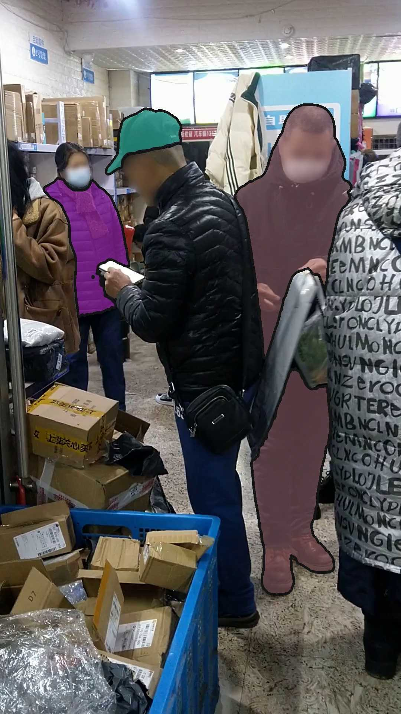

<figcaption>図10: 第 1 フレームにオーバーレイされたアノテーション: (a) 手動ラベル（ML）のみ、(b) 自動ラベル（Auto）付き。自動ラベルは多様性とカバレッジを増加させる。</figcaption>
</figure>

### D.2 Data engine details

#### D.2.1 Annotation protocol.

データエンジンで使われたアノテーションプロトコルの図を図 11 に示す。アノテーションタスクは異なるアノテーターによって実行される各ステップに分離された：ステップ 1 と 2 はオブジェクト選択に、ステップ 3 と 4 は masklet トラッキングに、ステップ 5 は品質検証に焦点を当てる。SAM 2 は API として GPU 上にデプロイされ、対話的使用を可能にするためアノテーションツールに組み込まれた。

<figure>

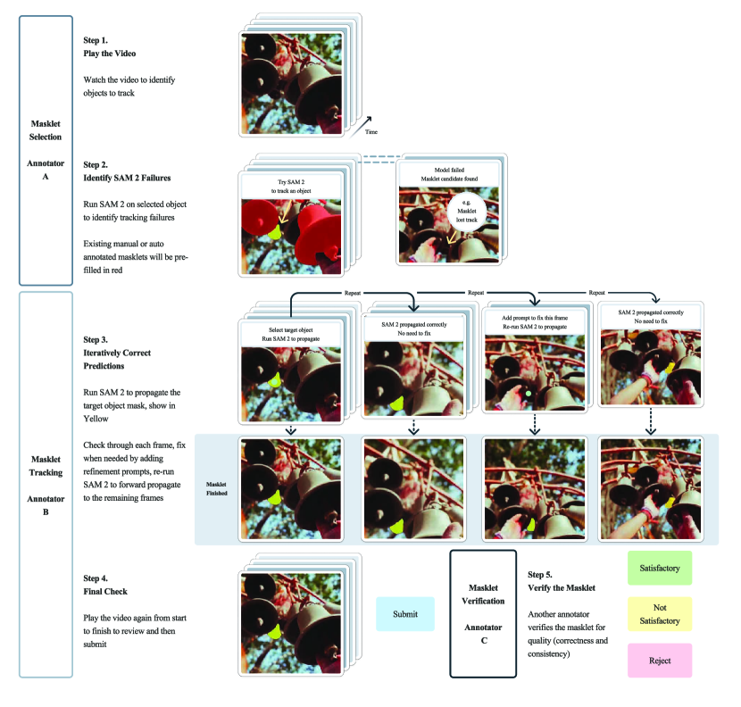

<figcaption>図11: アノテーションガイドライン概要。3 つの主要アノテーションタスクがある：masklet 選択、masklet トラッキング、masklet 検証。各タスクは異なるアノテーターのセットが作業する。</figcaption>
</figure>

画像セグメンテーションアノテーションと比較して、大規模動画セグメンテーションアノテーションは独自の課題を提示し、アノテーションタスクの設計とプロトコルの革新を必要とする。モデルの「anything をセグメント」する能力を改善するため、SAM 2 が苦戦する困難なオブジェクトにアノテーションを集中させることが重要だった。我々はオンラインのモデル・イン・ザ・ループセットアップを活用してこれを可能にし、アノテーターに SAM 2 を対話的に使って失敗モードを識別しそれらを修正するよう要求した。

編集フレーム数がオブジェクトの「困難さ」の代理になることを表 9 で見出した。したがってアノテーターには SAM 2 をループに持つときに少なくとも 2 編集フレームを必要とするオブジェクトをアノテートするよう求めた。あまり顕著でないより困難なケースにアノテーションを集中させるため、検証された満足な自動 masklet で事前充填された動画がアノテーターに提示され、アノテートされていない困難なオブジェクトを見つけるよう求められた。さらにオブジェクト選択タスクをアノテーションタスクから分離する：選択タスクではアノテーターは 1 フレームでの困難なオブジェクトを選ぶことに集中する一方、アノテーションタスクでは困難な対象オブジェクトが提示され、動画全体を通して一貫した masklet をアノテートするよう要求される。

#### D.2.2 Data engine phase comparison.

表 1 で示されたデータエンジンフェーズ比較は 169 動画と 452 masklet を使った制御実験として実施された。3 つのアノテーターサブセットに各フェーズのアノテーションプロトコルで同じオブジェクトセットをアノテートするよう求める。第 1 フレームのマスク面積に基づき masklet を 3 つのバケットに分類する（small: 1 から 32²、medium: 32² から 96²、large: 96² 以上）。Phase 1 データは SAM を使ったフレームごとの手動アノテーションからの高品質マスクを持つため品質参照として使われる。

## Appendix E. Details on zero-shot transfer experiments

### E.1 Zero-shot video tasks

#### E.1.1 Video dataset details.

SAM 2 を 17 個のゼロショットデータセット（多様なベンチマーク）で評価する：EndoVis 2018（ロボティック楽器を含む医療外科動画）、ESD（しばしば運動ブラを伴うロボットマニピュレータカメラからの動画）、LVOSv2（長期動画オブジェクトセグメンテーションのベンチマーク）、LV-VIS（多様なオープン語彙オブジェクトカテゴリの動画）、UVO（オープンワールドオブジェクトセグメンテーション）、VOST（大きな変形を経るオブジェクト、卵割れや紙破れ）、PUMaVOS（人の頬など部位周りのセグメント）、Virtual KITTI 2（合成運転シーン）、VIPSeg（パノプティック動画でのオブジェクトセグメンテーション）、Wildfires（Corsican Fire Database からの野火動画）、VISOR（手とアクティブオブジェクト周りのキッチンエゴセントリック動画）、FBMS（動画内の動くオブジェクトの運動セグメンテーション）、Ego-Exo4D（様々な人間活動周りのエゴセントリック動画の大規模データセット）、Cityscapes（都市運転シーン）、Lindenthal Camera（野生動物公園の動画、鳥や哺乳類の観察セグメント）、HT1080WT Cells（細胞セグメントを含む顕微鏡動画）、Drosophila Heart（果蝿の心臓の顕微鏡動画）。

上記 17 ゼロショット動画データセットのうち、9 個（EndoVis、ESD、LVOSv2、LV-VIS、UVO、VOST、PUMaVOS、Virtual KITTI 2、VIPSeg）は各動画フレームでオブジェクトセグメントが密にアノテートされている。残り 8 個（Wildfires、VISOR、FBMS、Ego-Exo4D、Cityscapes、Lindenthal Camera、HT1080WT Cells、Drosophila Heart）では、オブジェクトセグメントが動画フレームのサブセットのみで疎にアノテートされており、正解セグメンテーションマスクが利用可能なフレームでメトリクスを計算する。論文のほとんどの評価では、9 個の密にアノテートされたデータセットでのみゼロショット性能を評価するが、半教師あり VOS 評価（§6.1.2）では上記すべての 17 データセットで評価する。

#### E.1.2 Interactive offline and online evaluation details.

オフライン評価は動画全体の複数パスを伴う。第 1 フレームでのクリックプロンプトから始まり、動画全体を通してオブジェクトをセグメントし、次のパスで正解に対する最低セグメンテーション IoU を持つフレームをプロンプトの新フレームとして選ぶ。モデルは以前受け取ったすべてのプロンプトに基づいて動画全体を通してオブジェクトを再びセグメントし、最大 N_frame パス（各パスで 1 つの新プロンプトフレーム）に達するまで続ける。

オンライン評価は動画全体の 1 パスのみを伴う。第 1 フレームでのクリックプロンプトから始まり、低品質予測（正解との IoU < 0.75）のフレームに遭遇したとき伝播を一時停止し、動画全体でプロンプトを伝播する。次に一時停止フレームに追加クリックプロンプトを加えてこのフレームでセグメントを修正し、別の低品質フレーム（IoU < 0.75）に達するまで前方伝播を再開する。これはプロンプトされたフレーム数が最大 N_frame 未満である限り繰り返される。前のオフライン評価と異なり、この設定では新プロンプトは現在の一時停止フレーム後のフレームにのみ影響し、それ以前のフレームには影響しない。

両設定で、§E.1.1 の 9 個の密にアノテートされたデータセットで評価する。動画が正解アノテーションで複数オブジェクトを含む場合、各オブジェクトで独立に推論を実行する。N_click = 3 クリック/フレームで対話的動画セグメンテーションをシミュレートする。ユーザーがラベル付けするオブジェクトを視覚的に位置特定（初期クリックで）または現在のセグメンテーション予測を洗練（修正クリックで）すると仮定する。具体的には、最初のパス開始時（既存予測がまだない）、第 1 フレームのオブジェクト正解マスクの中心に初期クリックを置き、次にエラー領域（第 1 フレームの正解マスクと予測セグメント間）の中心に基づき対話的にもう 2 クリック追加する。後続パス（すでに予測セグメントがある）では、エラー領域（プロンプトされているフレームの正解マスクと予測セグメント間）の中心に基づき対話的に 3 クリック追加する。

N_frame = 1,...,8 対話フレーム上の平均 𝒥&ℱ メトリクスと、動画上の異なるアノテーション時間下の 𝒥&ℱ メトリクスを次の仮定に基づいて報告する：T_loc = 1 秒（フレーム内のオブジェクトの視覚的位置特定）、T_click = 1.5 秒/クリック、オフラインモードで T_exam = 30 秒（300 フレーム動画での各ラウンドの結果検査）、オンラインモードで T_exam = 30 秒（300 フレーム動画での結果の追跡）。

<figure>

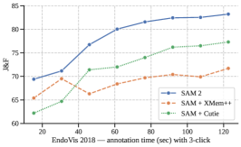

<figcaption>図12: 3 クリック/対話フレームを使う異なる対話フレーム数下での対話的オフライン評価における SAM 2 vs ベースライン（SAM+XMem++ と SAM+Cutie）のゼロショット性能。</figcaption>
</figure>

<figure>

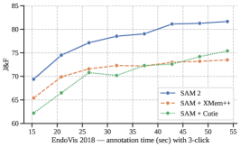

<figcaption>図13: 3 クリック/対話フレームを使う異なる対話フレーム数下での対話的オンライン評価における SAM 2 vs ベースラインのゼロショット性能。</figcaption>
</figure>

#### E.1.3 Semi-supervised VOS evaluation details.

§6.1.2 では半教師あり VOS 設定下で先行動画トラッキング手法と比較する。プロンプト（前景/背景クリック、バウンディングボックス、正解オブジェクトマスク）は動画の第 1 フレームのみで提供される。クリックプロンプトを使うときは第 1 動画フレームで 1、3、または 5 クリックを対話的にサンプルし、これらのクリックに基づきオブジェクトをトラックする。先行研究 [58, 88] のクリックベース評価に従い、初期クリックはオブジェクト中心に置かれ、後続クリックはエラー領域の中心から得られる。

対話的設定と同様、ここでも SAM+XMem++ と SAM+Cutie を 2 つのベースラインとして使う。クリックまたはボックスプロンプトでは、SAM がまずクリックまたはバウンディングボックス入力を処理し、その出力マスクが XMem++ または Cutie への入力として使われる。マスクプロンプトでは、第 1 フレームの正解オブジェクトマスクが XMem++ と Cutie への入力として直接使われる――これは標準半教師あり VOS 設定で、SAM を使わずに XMem++ と Cutie を評価する。

この設定では §E.1.1 のすべての 17 ゼロショット動画データセットで評価する。データセットが標準 VOS 形式に従わない場合、MOSE と類似の形式に前処理する。処理中、各動画のすべてのオブジェクトが第 1 フレームで有効な非空セグメンテーションマスクを持つことを保証し、半教師あり VOS 評価と互換にする。オブジェクトが第 1 フレームに現れない場合、それが現れる最初のフレームから始まる別の動画を作成する。

<figure>

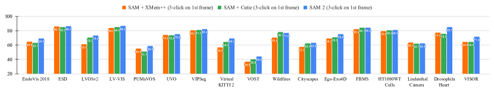

<figcaption>図14: 17 動画データセットでの半教師あり VOS 評価における SAM 2 vs 2 つのベースライン（SAM+XMem++ と SAM+Cutie）のゼロショット性能。</figcaption>
</figure>

#### E.1.4 SAM+XMem++ and SAM+Cutie baseline details.

我々は promptable video segmentation のため SAM+XMem++ と SAM+Cutie を 2 つのベースラインとして採用する。クリック（またはボックス）プロンプトはまず SAM で処理されオブジェクトマスクを得、次に XMem++ / Cutie モデルがこの SAM マスクを動画横断でトラックして最終 masklet を得る。これら 2 つのベースラインで、SAM は第 1 フレームでの初期オブジェクトマスク提供にも、XMem++ または Cutie が出力する既存オブジェクトマスクの修正にも使われる。これは対話的オフラインとオンライン評価中の後続対話フレームに使われ、新しい正と負のクリックが既存マスクの修正として提供される。

### E.2 DAVIS interactive benchmark

DAVIS interactive ベンチマークでも評価する。これは §6.1.1 の対話的オフライン評価に似ている。評価サーバが最悪のセグメンテーション性能を持つフレームでの新アノテーションを各対話ラウンドで提供する。公式 DAVIS eval toolkit は対話中にスクリブルプロンプトを提供する一方、CiVOS のような他の研究はこれをクリックプロンプトをカバーするよう拡張している。

ここでは CiVOS に従い正と負のクリックを入力プロンプトとして使い、クリックサンプリングの同じ戦略を採用する。このベンチマークでその評価者が提供する 𝒥&ℱ@60s と AUC-𝒥&ℱ メトリクスを報告し、2 ベースラインと比較する：MiVOS（提供されたスクリブルを scribble-to-mask モジュールで直接使う）と CiVOS（提供されたスクリブルからクリックをサンプル）。SAM 2（クリック入力に基づく）はクリック入力下で両ベースラインを上回る。SAM 2 は最初のクリックでしばしばオブジェクト部位（例: 人物の腕）をセグメントする傾向があり、DAVIS データセットは主にオブジェクト全体（例: 人物全体）を含むため、これは SAM 2 の 𝒥&ℱ 性能をこのベンチマークでペナルティし得る。

### E.3 Zero-shot image tasks

#### E.3.1 Dataset details.

対話的セグメンテーションタスクのため、SAM 2 を 37 データセットの包括スイートで評価した。このスイートには SAM が以前ゼロショット評価に使った 23 データセットが含まれる。完全性のため、23 データセットを列挙する：LVIS、ADE20K、Hypersim、Cityscapes、BBBC038v1、DOORS、DRAM、EgoHOS、GTEA、iShape、NDD20、NDISPark、OVIS、PPDLS、Plittersdorf、STREETS、TimberSeg、TrashCan、VISOR、WoodScape、PIDRay、ZeroWaste-f、IBD。これら 23 データセットに加え、SAM 2 の動画ドメインからの画像での性能を評価するため 14 動画データセットからサンプルされたフレームでも評価した。動画データセットは以下：Lindenthal Camera Traps（LCT）、VOST、LV-VIS、FBMS、Virtual KITTI 2、Corsican Fire Database（CFD）、VIPSeg、Drosophila Heart OCM（DH OCM）、EndoVis 2018、ESD、UVO、Ego-Exo4d、LVOSv2、HT1080WT。

#### E.3.2 Detailed zero-shot experiments.

本節では §6.2 の実験のより詳細版を含める。表 15 で SAM 2 を異なるモデルサイズの SAM と HQ-SAM と比較する。評価に使う主要メトリクスは 1 クリックと 5 クリック mIoU で、データセットドメイン別に結果を分類する。

表 15 はまず、画像のみで訓練された（SA タスク用）異なる画像エンコーダサイズのモデルの比較を SA-23 ベンチマークと新たに導入された 14 動画データセット両方で示す。SA-1B のみで訓練された SAM 2（Hiera-B+）は 1 クリック精度で SAM（ViT-H）を、5 クリック精度で SAM（ViT-H）と HQ-SAM（ViT-H）の両方を上回りつつ、**6 倍速** である。SAM 2（Hiera-L）は平均 1 クリック精度をさらに 1 ポイント改善するが、速度をトレードオフする。Hiera-B+ より遅いものの、SAM（ViT-H）より 3.4 倍速く、SAM（ViT-B）より 1.5 倍速い。

表 15 の最後 2 行は、画像と動画データの我々のミックスでの訓練の利益を示す。これは Hiera-B+ 画像エンコーダで 23 データセット横断の平均精度を 61.4% にブーストする。さらに、SA-23 の動画ベンチマークと新たに導入された 14 動画データセットでも実質的な改善を観察する。Hiera-L を超えてスケールしないが、より大きなモデルでより良い性能を期待する。

<figure>

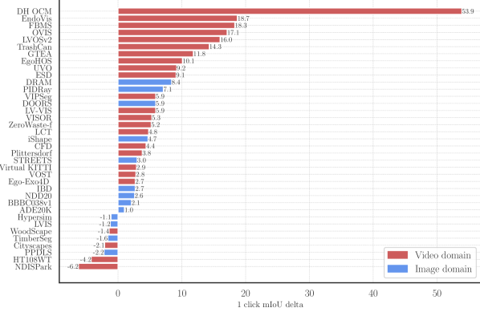

<figcaption>図15: 37 データセットスイートでの SAM 2 vs SAM のゼロショット性能。SAM 2 と SAM の center 1 クリック mIoU 差を示す。動画分布由来データセットは赤、画像分布由来データセットは青でハイライト。</figcaption>
</figure>

データセット横断の精度内訳は図 15 で提示され、SAM に対する per-dataset 1 クリック mIoU 差がデータ型（画像または動画）を示すよう色分けされている。注目すべきは、より小さい Hiera-B+ 画像エンコーダを使っているにもかかわらず、SAM 2（Hiera-B+）が 29 データセットで SAM を最大 53.9 mIoU 上回ることである。

<figure>

<figcaption>図17: SAM 2 のゼロショット動画ベンチマークスイートからの例。</figcaption>
</figure>

## Appendix F. Details on comparison to state-of-the-art in semi-supervised VOS

半教師あり VOS（§7）における先行 SOTA との比較について追加詳細を提供する。SA-1B、SA-V、Internal データのみで訓練された SAM 2 を異なるエンコーダサイズで含める。

**定性比較**: ベースライン（Cutie-base+、上段）と我々のモデル（SAM 2、下段）の比較を、第 1 フレームでマスクプロンプトされたときに示す。第 1 フレームのマスクプロンプトが人物のシャツのみをカバーするのに対し、ベースラインが予測した masklet は誤って人物全体に伝播する。一方、我々のモデルは masklet を対象オブジェクトに制限できる。

**定量比較**: SAM 2 が SA-V ベンチマークで「動画で anything をセグメントする」能力を示す（表 17）。

## Appendix G. Model, data and annotation cards

### G.1 Model card

**表18: SAM 2 のモデルカード（[72] の構造に従う）。**

| 項目 | 内容 |
|---|---|
| 名前 | SAM 2（Segment Anything Model 2） |
| バージョン | 1.0 |
| 日付 | 2024 |
| 組織 | Meta FAIR |
| モデル型 | プロンプト可能セグメンテーションモデル |
| アーキテクチャ | §4 参照 |
| リポジトリ | <https://github.com/facebookresearch/segment-anything-2> |
| ライセンス | Apache 2.0 |
| 主要意図ユーザー | SAM 2 はプロンプト可能動画・画像セグメンテーションの統一モデル。研究主目的。Apache 2.0 で公開 |
| グループ | クラス不可知、任意オブジェクトをセグメントしトラックできる |
| 環境 | 動画ベンチマーク: 運転、顕微鏡、エゴセントリック、ロボティック外科。画像ベンチマーク: 水中、絵画、魚眼など |
| メトリクス | 𝒥&ℱ（promptable video segmentation、semi-supervised VOS）、𝒢（YTVOS 2019）、mIoU（promptable image segmentation） |
| 訓練データ | SA-V + 内部ライセンス動画データ |
| 倫理的考察 - データ | §5 参照、SA-V の地理・人口統計分布を §3 で開示 |
| 計算コスト | 256 A100 × 108 時間 = 12,165 kWh、推定 3.89 トン CO₂eq（米国平均ガソリン車約 10k マイル走行に相当） |

### G.2 Dataset card for SA-V dataset

#### Motivation.

データセットは PVS タスク用に設計された。コンピュータビジョンコミュニティへの貢献：(1) 50.9K 動画 × 642.6K masklet で公開されている最大の動画セグメンテーションデータセット、(2) **Creative Commons Attribution 4.0 International Public License** で <https://ai.meta.com/datasets/segment-anything-video/> から利用可能、(3) 既存より地理的に多様な公開動画セグメンテーションデータセット。Meta FAIR が作成・資金提供。基盤動画は契約済み第三者会社経由で収集。

#### Composition.

50.9K 動画。明示的画像を含むコンテンツのアノテーションは拒否するようレビュアーに指示。各動画は動画を通してオブジェクトをトラックする masklet でアノテーション。データは 6 FPS でアノテート。動画あたり平均 3.8 手動 masklet と 8.9 自動 masklet、合計 642.6K masklet。動画は顔ぼかしモデルにかけられた。

#### Collection Process.

masklet は次の 2 方法で収集：(1) SAM 2 支援手動アノテーション、(2) SAM 2 で自動生成されアノテーターが検証。動画は契約済み第三者ベンダーによってクラウドワーカーで撮影。動画は **2023 年 11 月から 2024 年 3 月** に撮影。masklet アノテーションは 2024 年 4 月から 7 月に収集。

#### Preprocessing.

動画は 24 fps に再サンプルされ mp4 形式に変換された。

#### Distribution.

**CC by 4.0 ライセンスで配布**。2024 年 7 月から <https://ai.meta.com/datasets/segment-anything-video/> で利用可能。

#### Maintenance.

Meta FAIR がメンテナンス。連絡先: segment-anything@meta.com。

### G.3 Data annotation card

アノテーターは動画関連タスクに訓練されたフルタイムワーカー。研究チームは日次フィードバックと週次 Q&A セッションを実施。アノテーターはトレーニングキューを 1〜2 週間経て本番キューへ移行。プロダクションキューのアノテーションは vendor Q&A チームと研究チームによって日次で手動レビューされ、フィードバックは日次共有された。ベンダーはケニア（マスク annotators）と異なる地域（動画クラウドワーカー）に基づき、すべて時給制。
