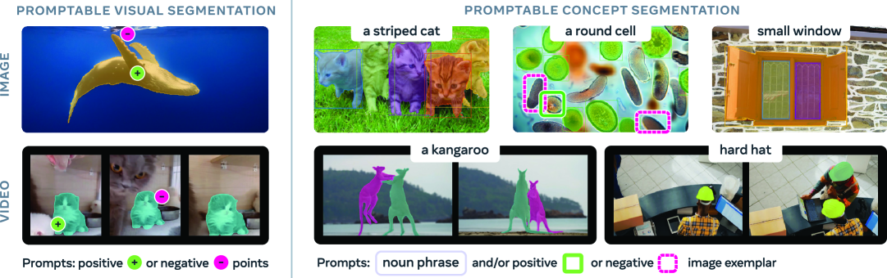
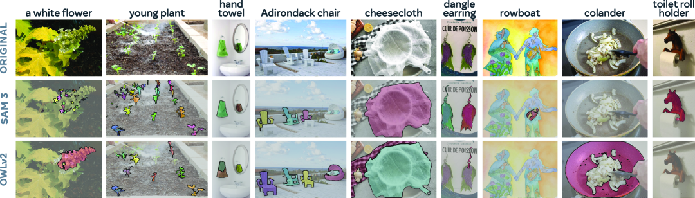
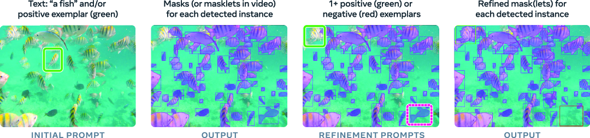
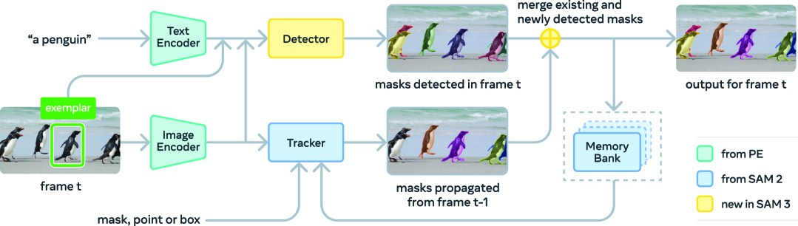
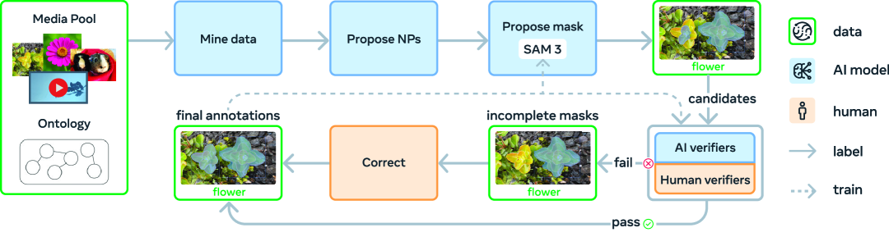
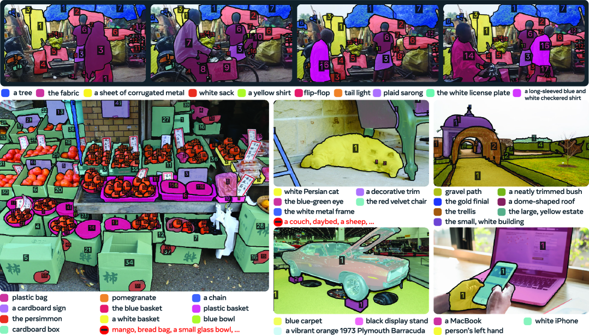
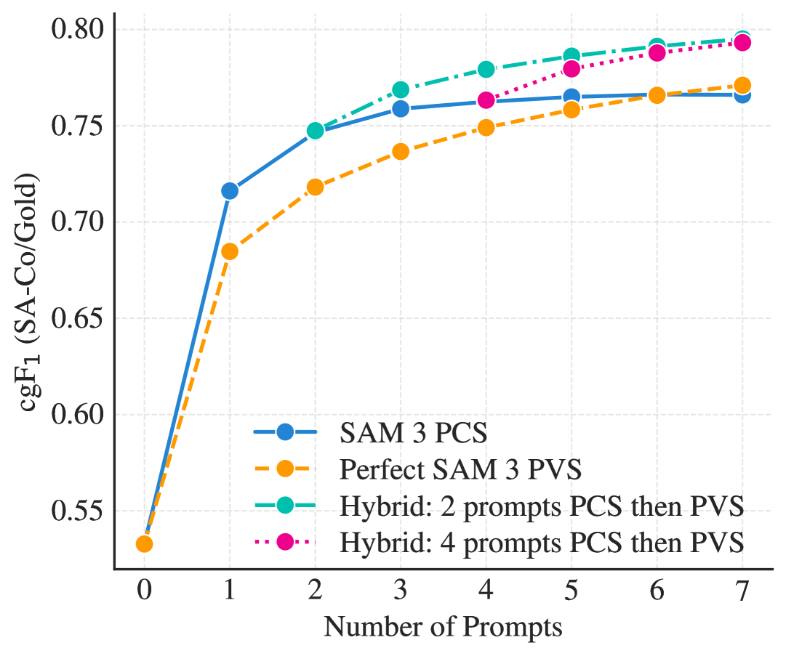
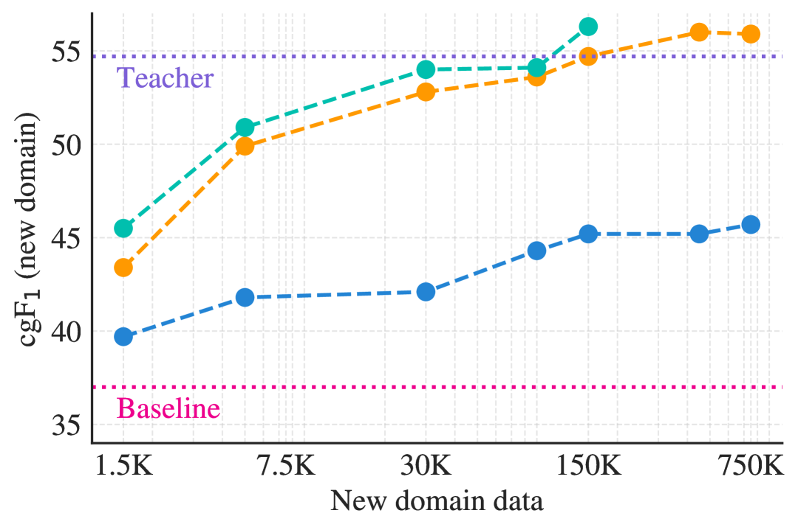

# SAM 3: Segment Anything with Concepts（コンセプトに基づくあらゆるものをセグメント化）

> 原題: SAM 3: Segment Anything with Concepts
> 著者: Nicolas Carion, Laura Gustafson, Yuan-Ting Hu, Shoubhik Debnath, Ronghang Hu, Didac Suris, Chaitanya Ryali, Kalyan Vasudev Alwala, Haitham Khedr, Andrew Huang, Jie Lei, Tengyu Ma, Baishan Guo, Arpit Kalla, Markus Marks, Joseph Greer, Meng Wang, Peize Sun, Roman Rädle, Triantafyllos Afouras, Effrosyni Mavroudi, Katherine Xu, Tsung-Han Wu, Yu Zhou, Liliane Momeni, Rishi Hazra, Shuangrui Ding, Sagar Vaze, Francois Porcher, Feng Li, Siyuan Li, Aishwarya Kamath, Ho Kei Cheng, Piotr Dollár, Nikhila Ravi, Kate Saenko, Pengchuan Zhang, Christoph Feichtenhofer（Meta Superintelligence Labs）
> 出典: arXiv:2511.16719（2025 年 11 月）

## Abstract（要旨）

我々は Segment Anything Model (SAM) 3 を提示する。これは **コンセプトプロンプト** に基づいて画像と動画中のオブジェクトを検出・セグメント・追跡する統一モデルである。コンセプトプロンプトは、短い名詞句（例: "yellow school bus"）、画像 exemplar、またはその両方の組み合わせと定義する。**Promptable Concept Segmentation (PCS)** はそのようなプロンプトを取り、マッチするすべてのオブジェクトインスタンスのセグメンテーションマスクと一意の同一性を返す。PCS を前進させるため、我々は画像と動画にわたって 4M のユニークなコンセプトラベル（hard negative を含む）を持つ高品質データセットを生成するスケーラブルなデータエンジンを構築する。我々のモデルは画像レベルの検出器と単一の backbone を共有するメモリベースの動画トラッカーから構成される。**Presence head** で認識と位置特定を分離し、検出精度を向上させる。SAM 3 は既存システムの精度を画像と動画 PCS の両方で 2 倍にし、視覚セグメンテーションタスクで以前の SAM の能力も改善する。我々は SAM 3 を、promptable concept segmentation のための新しい **Segment Anything with Concepts (SA-Co) ベンチマーク** とともにオープンソース化する。

## 1. Introduction（はじめに）

<figure>

<figcaption>図1: SAM 3 はクリックによる promptable visual segmentation で SAM 2 を改善（左）し、新しい promptable concept segmentation 能力を導入（右）。ユーザーは短い名詞句、画像 exemplar（正または負）、またはその両方の組み合わせで指定された視覚コンセプトのすべてのインスタンスをセグメントできる。</figcaption>
</figure>

視覚シーンの中であらゆるものを見つけてセグメントする能力は、マルチモーダル AI にとって基盤的なものであり、ロボティクス、コンテンツ作成、拡張現実、データアノテーション、より広範な科学における応用を駆動する。SAM シリーズは画像と動画の promptable segmentation タスクを導入し、点・ボックス・マスクで **プロンプトあたり単一のオブジェクト** をセグメントする **Promptable Visual Segmentation (PVS)** に焦点を当てた。これらの手法は突破口を達成したが、入力中のどこかに現れるコンセプトのすべてのインスタンス（例: 動画中のすべての "cats"）を見つけてセグメントする一般タスクには対処しなかった。

このギャップを埋めるため、我々は SAM 3 を提示する。これは画像と動画における promptable segmentation での段階的変化を達成し、SAM 2 に対する PVS を改善し、**Promptable Concept Segmentation (PCS)** の新しい標準を設定するモデルである。我々は PCS タスク（§2）を、テキストおよび/または画像 exemplar を入力として取り、コンセプトにマッチするすべての単一オブジェクトのインスタンスとセマンティックマスクを予測しつつ、動画フレームを横断してオブジェクト同一性を保持するものとして定式化する（図 1 参照）。原子的視覚コンセプトの認識に焦点を当てるため、テキストを "red apple" や "striped cat" のような単純な名詞句（NP, noun phrase）に制限する。SAM 3 は長い指示表現や推論を必要とするクエリ用に設計されていないが、より複雑な言語プロンプトを扱うため Multimodal Large Language Model (MLLM) と直截的に組み合わせられることを示す。以前の SAM 版と一貫して、SAM 3 は完全に対話的で、ユーザーが洗練プロンプトを加えてモデルを意図する出力へ導くことで曖昧性を解決できる。

<figure>

<figcaption>図2: SA-Co ベンチマークにおける OWLv2 と比較した、open-vocabulary コンセプトのセグメンテーションを SAM 3 が改善する例。</figcaption>
</figure>

我々の **モデル**（§3）は、視覚エンコーダ（Perception Encoder, PE）を共有する **検出器とトラッカー** から構成される。検出器は DETR ベースのモデルで、テキスト、ジオメトリ、画像 exemplar で条件付けされる。Open-vocabulary コンセプト検出の課題に対処するため、**認識と位置特定を分離する別個の presence head** を導入する。これは特に困難な negative 句で訓練するときに効果的である。トラッカーは SAM 2 の transformer encoder-decoder アーキテクチャを継承し、動画セグメンテーションと対話的洗練をサポートする。検出と追跡のための分離設計は、検出器が同一性に不可知である必要がある一方、トラッカーの主要目的は動画内で同一性を分離することであるため、タスクの衝突を回避する。

主要な性能ゲインを引き出すため、我々は人間とモデルがループに入る **データエンジン**（§4）を構築する。これは大規模で多様な訓練データセットをアノテートする。我々は先行データエンジンに対し 3 つの主要な方法で革新する：(i) **メディアキュレーション**: 同質的なウェブソースに依存する過去のアプローチよりも多様なメディアドメインをキュレートする、(ii) **ラベルキュレーション**: ontology とマルチモーダル LLM を「**AI アノテーター**」として活用し、名詞句と hard negative を生成することでラベルの多様性と難易度を大幅に増加させる、(iii) **ラベル検証**: MLLM を「**AI 検証者**」としてファインチューンすることで、人間に近い精度を達成しつつアノテーションスループットを 2 倍にする。

ノイジーなメディア-句-マスクの疑似ラベルから始まり、我々のデータエンジンは人間と AI 検証者の両方を使ってマスク品質と網羅性をチェックし、正しくラベル付けされた例を除外し、困難なエラーケースを識別する。次に人間アノテーターはマスクを手動で修正してこれらのエラーを修正することに集中する。これにより我々は **4M のユニークな句と 52M のマスク** を持つ高品質訓練データと、**38M の句と 1.4B のマスク** を持つ合成データセットをアノテートできる。我々はさらに PCS のための **Segment Anything with Concepts (SA-Co) ベンチマーク**（§5）を作成する。これは 120K の画像と 1.7K の動画における網羅的なマスクを持つ **207K のユニークなコンセプト** を含み、既存のベンチマークの **50 倍以上のコンセプト** を持つ。

我々の **実験**（§6）は、SAM 3 が promptable segmentation で新しい SOTA を設定することを示す。例えば LVIS でゼロショットマスク AP 48.8（現在の最良 38.5）に到達し、新しい SA-Co ベンチマークで少なくとも 2 倍ベースラインを上回り（図 2 の例を参照）、視覚プロンプトで SAM 2 を改善する。アブレーション（§A）では backbone・新規 presence head・hard negative の追加すべてが結果を押し上げることを検証し、PCS タスクで我々の高品質データセットと合成データセットの両方についてスケーリング則を確立する。我々は SA-Co ベンチマークをオープンソース化し、SAM 3 のチェックポイントと推論コードを公開する。**H200 GPU で SAM 3 は単一画像（100+ 検出オブジェクト）に対し 30ms で動作する**。動画では推論レイテンシがオブジェクト数とともにスケールし、約 5 個の同時オブジェクトで近実時間性能を維持する。関連研究は §7 でレビューする。次に、タスクに飛び込む。

## 2. Promptable Concept Segmentation (PCS)

<figure>

<figcaption>図3: PCS タスクでサポートされる初期プロンプトとオプションの対話的洗練プロンプトの例示。</figcaption>
</figure>

我々は Promptable Concept Segmentation タスクを次のように定義する：画像または短い動画（30 秒以下）が与えられたとき、短いテキスト句、画像 exemplar、またはその両方の組み合わせで指定された **視覚コンセプトのすべてのインスタンス** を検出・セグメント・追跡する。我々はコンセプトを、名詞と任意の修飾子からなる **単純な名詞句（NP）** で定義されるものに制限する。名詞句プロンプト（提供される場合）は画像/動画の全フレームにわたってグローバルである一方、画像 exemplar は個別フレームで正または負のバウンディングボックスとして提供され、対象マスクを反復的に洗練できる（図 3 参照）。

すべてのプロンプトはカテゴリ定義において一貫している必要があり、そうでなければモデルの挙動は未定義である。例えば "fish" は後続の "tail" だけの exemplar プロンプトで洗練できない。代わりにテキストプロンプトを更新すべきである。Exemplar プロンプトは、モデルが最初にいくつかのインスタンスを見逃すか、コンセプトが希少なときに特に有用である。

我々の語彙は、視覚シーンで grounding 可能な任意の単純な名詞句を含み、これはタスクを本質的に曖昧にする。多義語（"mouse" デバイス vs. 動物）、主観的記述子（"cozy", "large"）、漠然としたあるいは文脈依存の句（grounding 不可能な "brand identity" など）、境界の曖昧性（"mirror" にフレームが含まれるか）、遮蔽・ブラなどオブジェクトの範囲を不明瞭にする要因などから生じる、句の複数解釈があり得る。大規模 closed-vocabulary コーパス（LVIS など）でも類似の問題は現れるが、語彙を慎重にキュレートし、すべての関心クラスの明確な定義を設定することで緩和される。我々は次の方法で曖昧性問題に対処する：3 人の専門家からテスト アノテーションを収集、評価プロトコルを複数の妥当解釈を許すよう適応、データパイプライン/ガイドラインをアノテーションでの曖昧性を最小化するよう設計、モデルに曖昧性モジュール（§画像実装詳細）を含める。

## 3. Model（モデル）

SAM 3 は SAM 2 の一般化で、新しい PCS タスク（§2）と PVS タスクの両方をサポートする。コンセプトプロンプト（単純名詞句、画像 exemplar）または視覚プロンプト（点、ボックス、マスク）を取り、（個別に）時空間でセグメントされるオブジェクトを定義する。画像 exemplar と視覚プロンプトは個別フレームで反復的に追加でき、対象マスクを洗練できる――偽陽性と偽陰性のオブジェクトはそれぞれ画像 exemplar で除去または追加でき、個別マスク（masklet）は SAM 2 のスタイルで PVS を使って洗練できる。我々のアーキテクチャは SAM と (M)DETR の系列に大きく基づいている。図 4 は SAM 3 のアーキテクチャを示す。これは dual encoder-decoder transformer――画像レベル能力のための **検出器**――から構成され、動画用の **トラッカーとメモリ** と組み合わせて使われる。検出器とトラッカーは整列された **Perception Encoder (PE)** backbone から視覚-言語入力を取り込む。以下に概要を提示する。詳細は §モデル詳細参照。

#### Detector Architecture（検出器アーキテクチャ）

検出器のアーキテクチャは一般的な DETR パラダイムに従う。画像とテキストプロンプトはまず PE によってエンコードされ、画像 exemplar が存在する場合は exemplar エンコーダによってエンコードされる。我々は画像 exemplar トークンとテキストトークンを総称して「**プロンプトトークン**」と呼ぶ。fusion エンコーダは次に画像エンコーダからの条件付けされていない埋め込みを受け取り、プロンプトトークンへのクロス注意によりそれらを条件付ける。fusion の後に DETR 風デコーダが続き、ここで学習済みオブジェクトクエリが fusion エンコーダからの条件付けされた画像埋め込みにクロス注意する。

各デコーダ層は各オブジェクトクエリの分類ロジット（我々の場合、オブジェクトがプロンプトに対応するかの二値ラベル）と、前の層が予測したバウンディングボックスからのデルタを予測する（Deformable DETR に従う）。我々は box-region-positional bias（Plain-DETR）を使って各オブジェクトに注意を集中させるのを助けるが、最近の DETR モデルと異なり、バニラ注意に固執する。訓練中、DAC-DETR からの dual supervision と Align loss を採用する。マスクヘッドは MaskFormer から適応される。さらに、画像中の各画素がプロンプトに対応するかどうかを示す二値ラベルを予測する **セマンティックセグメンテーションヘッド** も持つ。詳細は §モデル詳細。

#### Presence Token（プレゼンストークン）

各 proposal クエリが画像/フレーム中のオブジェクトを **認識（何）と位置特定（どこ）の両方** をすることは困難であり得る。認識コンポーネントには、画像全体からの文脈的手がかりが重要である。しかし、proposal クエリにグローバルコンテキストを理解することを強いることは逆効果になり得る。それは位置特定目的の本質的に局所的な性質と衝突するからである。我々は学習されたグローバル **presence token** を導入することで認識と位置特定のステップを分離する。このトークンは、名詞句（NP）形式の対象コンセプトが画像/フレームに存在するかを予測することのみに責任を持つ、つまり $p(\text{NP が入力に存在})$。各 proposal クエリ $q_i$ は位置特定問題 $p(q_i \text{ がマッチ} | \text{NP が入力に存在})$ のみを解けばよい。各 proposal クエリの最終スコアは自身のスコアと presence スコアの積である。

<figure>

<figcaption>図4: SAM 3 アーキテクチャ概要。</figcaption>
</figure>

#### Image Exemplars and Interactivity（画像 exemplar と対話性）

SAM 3 は画像 exemplar をサポートする。これはペア――バウンディングボックスと関連する二値ラベル（正または負）――として与えられ、単独で使うか、テキストプロンプトを補完するために使える。次にモデルはプロンプトにマッチするすべてのインスタンスを検出する。例えば、犬上の正のバウンディングボックスが与えられたとき、モデルは画像中の **すべての** 犬を検出する。これは SAM 1 と 2 の PVS タスクと異なる。そこでは視覚プロンプトが単一のオブジェクトインスタンスのみを生成する。各画像 exemplar は exemplar エンコーダによって別個にエンコードされる。位置の埋め込み、ラベルの埋め込み、ROI プールされた視覚特徴量を使い、次に連結されて小さな transformer で処理される。結果として得られるプロンプトはテキストプロンプトに連結され、プロンプトトークンを構成する。画像 exemplar は現在の検出のエラーに基づき対話的に提供され、出力を洗練できる。

#### Tracker and Video Architecture（トラッカーと動画アーキテクチャ）

動画とプロンプト P が与えられたとき、検出器とトラッカー（図 4 参照）を使って動画全体を通してプロンプトに対応するオブジェクトを検出・追跡する。各フレームで、検出器は新しいオブジェクト $\mathcal{O}_t$ を見つけ、トラッカーは前の時間 $t-1$ のフレームから masklet（時空間マスク）$\mathcal{M}_{t-1}$ を現在のフレーム時間 $t$ での新しい位置 $\mathcal{\hat{M}}_t$ に伝播させる。我々はマッチング関数を使って伝播された masklet $\mathcal{\hat{M}}_t$ を現在のフレームに現れる新しいオブジェクトマスク $\mathcal{O}_t$ と関連付ける：

$$\mathcal{\hat{M}}_t = \mathrm{propagate}(\mathcal{M}_{t-1}), \quad \mathcal{O}_t = \mathrm{detect}(I_t, P), \quad \mathcal{M}_t = \mathrm{match\_and\_update}(\mathcal{\hat{M}}_t, \mathcal{O}_t).$$

#### Tracking an Object with SAM 2 Style Propagation（SAM 2 スタイル伝播によるオブジェクト追跡）

masklet は第 1 フレームで検出されたすべてのオブジェクトに対して初期化される。次に各後続フレームで、トラッカーモジュールは SAM 2 における動画オブジェクトセグメンテーションタスクと類似の single-frame 伝播ステップを通して、すでに追跡されているオブジェクトの前の位置 $\mathcal{M}_{t-1}$ に基づいてその新しい masklet 位置 $\mathcal{\hat{M}}_t$ を予測する。トラッカーは検出器と同じ画像/フレームエンコーダ（PE backbone）を共有する。検出器を訓練した後、PE を凍結し SAM 2 のようにトラッカーを訓練する。これにはプロンプトエンコーダ、マスクデコーダ、メモリエンコーダ、過去フレームと conditioning フレーム（オブジェクトが最初に検出されるかユーザーによってプロンプトされるフレーム）からの特徴を使ってオブジェクトの外観をエンコードするメモリバンクが含まれる。メモリエンコーダは現在フレーム上の視覚特徴量を横断する self-attention と、視覚特徴量からメモリバンク内の空間メモリ特徴量への cross-attention を持つ transformer である。動画アプローチの詳細は §密追跡ヒューリスティクスで述べる。

推論中、オブジェクトが信頼度高く存在するフレームのみをメモリバンクに保持する。マスクデコーダはエンコーダの隠れ状態と出力トークンの間の two-way transformer である。曖昧性を扱うため、各フレームで追跡された各オブジェクトに対し 3 つの出力マスクとその信頼度を予測し、最も信頼度の高い出力を現在フレーム上の予測マスクとして選択する。

#### Matching and Updating Based on Detections（検出に基づくマッチングと更新）

追跡されたマスク $\mathcal{\hat{M}}_t$ を得た後、シンプルな IoU ベースの **マッチング関数** を通してそれらを現在フレームの検出 $\mathcal{O}_t$ とマッチさせ、現在フレームの $\mathcal{M}_t$ に加える。マッチされなかったすべての新規検出オブジェクトに対しても新しい masklet を生成する。マージは特に混雑シーンで曖昧性に苦しみ得る。我々はこれに対し次の 2 つの時間的曖昧性解消戦略で対処する。

第一に、masklet が時間ウィンドウ内で検出にどれほど一貫してマッチしているかを測定する **masklet detection score** の形で時間情報を使う（検出にマッチした過去フレームの数に基づく）。masklet の detection score が閾値を下回ると、それを抑制する。第二に、トラッカーの遮蔽や distractor による特定の失敗モードを解決するため、検出器の出力を使う。トラッカーを高信頼度検出マスク $\mathcal{O}_t$ で定期的に再プロンプトし、トラッカー自身の予測 $\mathcal{\hat{M}}_t$ を置き換える。これにより、メモリバンクが（トラッカー自身の予測以外の）最近で信頼できる参照を持つことを保証する。

#### Instance Refinement with Visual Prompts（視覚プロンプトによるインスタンス洗練）

マスク（または masklet）の初期セットを得た後、SAM 3 は正と負のクリックを使って個別マスク（masklet）を洗練することを許す。具体的には、ユーザーのクリックが与えられたとき、プロンプトエンコーダを適用してそれらをエンコードし、エンコードされたプロンプトをマスクデコーダに供給して調整されたマスクを予測する。動画では、マスクは動画全体に伝播され、洗練された masklet を得る。

#### Training Stages（訓練ステージ）

SAM 3 を 4 ステージで訓練し、データと能力を段階的に追加する：1) **Perception Encoder (PE) 事前学習**、2) **検出器事前学習**、3) **検出器ファインチューニング**、4) **凍結 backbone を用いたトラッカー訓練**。詳細は §訓練ステージ。

## 4. Data Engine（データエンジン）

<figure>

<figcaption>図5: 最終 SAM 3 データエンジンの概要。</figcaption>
</figure>

SAM 3 で PCS の段階的変化を達成するには、既存データセットを超える大規模で多様なコンセプトと視覚ドメインの集合での訓練が必要である。我々は SAM 3、人間アノテーター、**AI アノテーター** とのフィードバックループを介してアノテートデータを反復的に生成する効率的データエンジンを構築し、現在の SAM 3 が高品質訓練データを生成できないメディア-句のペアを積極的にマイニングしてさらにモデルを改善する。特定タスクを AI アノテーターに委任することで――それは人間の精度にマッチするか上回るモデル――人間のみのアノテーションパイプラインに比べてスループットを 2 倍以上にする。データエンジンを 4 フェーズで開発する。各フェーズで AI モデルの使用を増やし、人間の努力を最も困難な失敗ケースに導き、視覚ドメインカバレッジを拡大する。Phase 1-3 は画像のみに焦点を当て、Phase 4 で動画に拡張する。ここでは主要ステップを記述する。詳細とメトリクスは §データエンジン詳細にある。

#### Data Engine Components（データエンジンコンポーネント）

メディア入力（画像または動画）は、キュレートされた ontology の助けで大きなプールからマイニングされる。AI モデルは視覚コンセプトを記述する名詞句（NP）を提案し、続いて別のモデル（例: SAM 3）が提案された NP それぞれに対し候補インスタンスマスクを生成する。提案されたマスクは 2 段階プロセスで検証される：まず **Mask Verification (MV)** で、アノテーターが品質と NP との関連性に基づきマスクを accept または reject する。次に **Exhaustivity Verification (EV)** で、アノテーターは入力中の NP のすべてのインスタンスがマスクされているかをチェックする。exhaustivity チェックを通らなかったメディア-NP ペアは手動修正段階に送られ、そこで人間はマスクを追加・除去・編集する（ブラウザベースツール内の SAM 1 を使用）か、小さく分離困難なオブジェクトには「group」マスクを使う。アノテーターは grounding 不可能または曖昧な句を reject できる。

#### Phase 1: Human Verification（人間検証）

まずシンプルなキャプショナーとパーサーで画像と NP 提案をランダムサンプルする。初期マスク提案モデルは off-the-shelf open-vocabulary 検出器の出力でプロンプトされる SAM 2 で、初期検証者は人間。このフェーズで初期 SA-Co/HQ データセットとして **4.3M の image-NP ペア** を収集した。我々はこのデータで SAM 3 を訓練し、次のフェーズのマスク提案モデルとして使う。

#### Phase 2: Human + AI Verification（人間 + AI 検証）

この次のフェーズでは、Phase 1 で収集された MV と EV タスクからの人間 accept/reject ラベルを使って Llama 3.2 をファインチューンし、MV と EV タスクを自動的に実行する **AI 検証者** を作成する。これらのモデルは画像-句-マスクトリプレットを受け取り、マスク品質または exhaustivity の多肢選択評価を出力する。この新しい自動検証プロセスにより、人間の努力を最も困難なケースに集中させられる。我々は新たに収集されたデータで SAM 3 を再訓練し続け、6 回更新する。SAM 3 と AI 検証者が改善するにつれ、より高い割合のラベルが自動生成され、データ収集をさらに加速する。MV と EV への AI 検証者の導入により、データエンジンのスループットは人間アノテーターに対し約 2 倍になる。AI 検証者がデータエンジンのスループットをどう改善するかの詳細分析は §効率的ドメイン拡張参照。NP 提案ステップをさらに、SAM 3 に敵対的な hard negative NP も提案する Llama ベースのパイプラインにアップグレードする。Phase 2 は **122M の image-NP ペア** を SA-Co/HQ に追加する。

<figure>

<figcaption>図6: アノテートされた句とインスタンスマスク/ID を持つ SA-Co からの例動画（上）と画像（下）。</figcaption>
</figure>

#### Phase 3: Scaling and Domain Expansion（スケーリングとドメイン拡張）

第 3 フェーズでは、AI モデルを使ってますます困難なケースをマイニングし、SA-Co/HQ のドメインカバレッジを 15 データセットに拡大する。**ドメイン** はテキストと視覚データのユニークな分布である。新ドメインでは MV AI 検証者はゼロショットでよく動作するが、EV AI 検証者は控えめなドメイン固有の人間教師あり学習で改善する必要がある。利用可能な場合は画像 alt-text から NP を抽出し、Wikidata に基づく **22.4M ノードの SA-Co ontology**（17 トップレベルカテゴリ、72 サブカテゴリ）からコンセプトをマイニングすることで、コンセプトカバレッジを long-tail で細粒度なコンセプトに拡大する。SAM 3 訓練を 7 回、AI 検証者を 3 回繰り返し、**19.5M の image-NP ペア** を SA-Co/HQ に追加する。

#### Phase 4: Video Annotation（動画アノテーション）

このフェーズはデータエンジンを動画に拡張する。成熟した画像 SAM 3 を使って動画固有の課題を捉えるターゲット品質アノテーションを収集する。データマイニングパイプラインはシーン/動きフィルタ、コンテンツバランシング、ランキング、ターゲット検索を適用する。動画フレームはサンプルされ（ランダムまたはオブジェクト密度別）、画像アノテーションフロー（Phase 3 から）に送られる。**Masklet**（時空間マスク）は SAM 3（現在動画に拡張）で生成され、重複除去と trivial マスクの除去で後処理される。動画アノテーションがより困難なので、混雑オブジェクトと追跡失敗が多いクリップを優先して、可能性のある失敗に人間を集中させる。収集された動画データ SA-Co/VIDEO は **52.5K 動画と 467K masklet** からなる。詳細は §動画データエンジン。

## 5. Segment Anything with Concepts (SA-Co) Dataset

#### Training Data（訓練データ）

我々は PCS タスクのために 3 つの **画像データセット** を収集する：(i) **SA-Co/HQ**、Phase 1-4 のデータエンジンから収集された高品質画像データ、(ii) **SA-Co/SYN**、成熟したデータエンジン（Phase 3）によって人間関与なしでラベル付けされた合成データセット、(iii) **SA-Co/EXT**、インスタンスマスクアノテーションを持ち、ontology パイプラインを使って hard negative で強化された 15 個の外部データセット。特に SA-Co/HQ データセットでは **5.2M の画像と 4M のユニーク NP** をアノテートしており、最大の高品質 open-vocab セグメンテーションデータセットとなっている。我々はまた **52.5K 動画と 24.8K ユニーク NP**（134K の video-NP ペア）を含む **動画データセット** **SA-Co/VIDEO** をアノテートする。動画は平均で 6 fps で 84.1 フレームを持つ。詳細（全統計、既存データセットとの比較、コンセプトの分布を含む）は §訓練データ詳細。

#### SA-Co Benchmark

SA-Co 評価ベンチマークは **207K のユニーク句**、121K の画像と動画、open-vocabulary 認識をテストする hard negative ラベル付き 3M 以上のメディア-句ペアを持つ。4 つの分割を持つ：**SA-Co/Gold** は 7 ドメインで各 image-NP ペアが 3 人の異なるアノテーターによってアノテートされる（人間性能の測定に使う）。**SA-Co/Silver** は 10 ドメインで image-NP ペアあたり 1 人の人間アノテーションのみ。**SA-Co/Bronze** と **SA-Co/Bio** は既存のマスクアノテーションを持つか SAM 2 へのボックスプロンプトで生成されたマスクを持つ 9 つの既存データセット。**SA-Co/VEval** ベンチマークは 3 ドメインと video-NP ペアあたり 1 アノテーター。データセット統計は §ベンチマーク統計、例アノテーションは図 6 参照。

#### Metrics（メトリクス）

我々はモデルの下流応用での有用性を測定することを目指す。average precision (AP) のような検出メトリクスはキャリブレーションを考慮しないため、モデルが実用上難しい場合がある。これを修正するため、信頼度 0.5 を超える予測のみを評価し、下流使用を模した閾値を効果的に導入し、良好なキャリブレーションを強制する。PCS タスクは自然に **位置特定** と **分類** の 2 サブタスクに分けられる。位置特定は少なくとも 1 つの ground-truth マスクを持つ positive メディア-句ペアでの **positive micro F1**（$\mathrm{pmF}_1$）で評価する。分類は **image-level Matthews Correlation Coefficient (IL_MCC)** で測定する。これは $[-1, 1]$ の範囲で、マスク品質を考慮せず画像レベルでの二値予測（「オブジェクトは存在するか？」）を評価する。我々の主要メトリクス、**classification-gated F1**（cgF₁）は次のようにこれらを結合する：$\mathrm{cgF_1} = 100 \times \mathrm{pmF_1} \times \mathrm{IL\_MCC}$。完全定義は §メトリクス。

#### Handling Ambiguity（曖昧性の扱い）

我々は SA-Co/Gold で NP あたり 3 アノテーションを収集する。各予測をすべての ground truth と比較し最良スコアを選択して **oracle** 精度を測定する。

## 6. Experiments（実験）

我々は SAM 3 を画像と動画セグメンテーション、検出とカウンティングベンチマークへの few-shot 適応、複雑な言語クエリでのセグメンテーション（SAM 3 + MLLM）にわたって評価する。アブレーションのサブセットも示し、より多くは §A にある。

#### Image PCS with Text（テキストでの画像 PCS）

我々は外部と我々のベンチマークでインスタンスセグメンテーション、ボックス検出、セマンティックセグメンテーションを評価する。SAM 3 は 1 度に単一 NP でプロンプトされ、インスタンスマスク、バウンディングボックス、セマンティックマスクを予測する。ベースラインとして OWLv2、GroundingDino (gDino)、LLMDet をボックス検出で評価し、それらのボックスで SAM 1 にプロンプトしてセグメンテーションを評価する。APE、DINO-X、Gemini 2.5 Flash（汎用 LLM）とも比較する。

**表1（要約）**: SAM 3 はゼロショットで closed-vocabulary COCO、COCO-O、LVIS ボックスで新しい SOTA を設定し、LVIS マスクで大幅に良好。open-vocabulary SA-Co/Gold で **SAM 3 は最強ベースライン OWLv2*の cgF₁ スコアの 2 倍以上** を達成し、推定人間性能の **74%** を達成。他の SA-Co 分割での改善はさらに高い。Open vocabulary semantic segmentation 結果（ADE-847、PascalConcept-59、Cityscapes）は SAM 3 が強力な専門ベースライン APE を上回ることを示す。

| Model | LVIS cgF₁ | LVIS AP | SA-Co/Gold cgF₁ | SA-Co/Silver cgF₁ |
|---|---|---|---|---|
| Human | – | – | **72.8** | – |
| OWLv2 | 20.1 | – | 17.3 | 7.6 |
| OWLv2* | 29.3 | 43.4 | 24.6 | 11.5 |
| gDino-T | 14.7 | – | 3.3 | 2.7 |
| LLMDet-L | 35.1 | 36.3 | 6.5 | 7.1 |
| APE-D* | – | 53.0 | 16.4 | 7.3 |
| DINO-X | – | 38.5 | 21.3 | – |
| Gemini 2.5 | 13.4 | – | 13.0 | 8.3 |
| **SAM 3** | **37.2** | **48.5** | **54.1** | **49.6** |

#### Few-Shot Adaptation（少数ショット適応）

我々は ODinW13 と RF100-VL での SAM 3 のゼロショットと few-shot 転移を評価する。プロンプトチューニングは行わない。SAM 3 をマスク損失なしでファインチューンし、平均 bbox mAP を報告する。**SAM 3 は SOTA 10-shot 性能** を達成し、Gemini の in-context プロンプティングとオブジェクト検出専門家（gDino）を上回る。RF-100VL は SAM 3 の現在のスコープ外の専門プロンプトを持つドメインを含むが、SAM 3 はベースラインよりファインチューニングを通じて効率的に適応する。

#### PCS with 1 Exemplar（1 つの exemplar での PCS）

まず ground truth からランダムサンプルされた単一の入力ボックスを使って画像 exemplar を評価する。これは「positive」データでのみ可能で、各プロンプトされたオブジェクトが画像に現れる。表 3 で 3 設定にわたる対応する AP⁺ を報告する：テキストプロンプト (T)、exemplar 画像 (I)、両方 (T+I)。**SAM 3 は先行 SOTA T-Rex2 を COCO で +18.3、LVIS で +10.3、ODinW で +20.5 の健全なマージンで上回る**。

#### PCS with K Exemplars（K 個の exemplar での PCS）

次に対話的設定（人間アノテーターとの協調をシミュレート）で SAM 3 を評価する。テキストプロンプトから始め、1 つの exemplar プロンプトを反復的に追加する：見逃した ground truth は positive プロンプト候補、偽陽性検出は negative プロンプト候補。結果（図 7）は完全 PVS ベースラインと比較する。ここではユーザーが理想的なボックス → マスク修正を使ってエラーを手動修正することをシミュレートする。**SAM 3 の PCS は cgF₁ をより速く改善する**。exemplar から一般化するからである（例: 類似オブジェクトの検出または抑制）一方、PVS は個別インスタンスのみを修正する。**3 クリック後、対話的 PCS はテキストのみより +21.6 cgF₁ ポイント、PVS 洗練より +2.0 上回る**。性能は 4 クリック後にプラトーに達する。exemplar が品質の悪いマスクを修正できないからである。この時点で PVS への hybrid 切り替えをシミュレートすると利得が得られ、相補性を示す。

<figure>

<figcaption>図7: SA-Co/Gold 句で平均された、理想的な PVS ベースラインと比較した SAM 3 の対話的ボックスプロンプト数 vs cgF₁。</figcaption>
</figure>

#### Object Counting（オブジェクトカウンティング）

我々はオブジェクトカウンティングベンチマーク CountBench と PixMo-Count で評価し、Accuracy (%) と Mean Absolute Error (MAE) を使っていくつかの MLLM と比較する。**SAM 3 は良好なオブジェクトカウンティング精度を達成し、ほとんどの MLLM が提供できないオブジェクトセグメンテーションも提供する**。

| Model | CountBench MAE↓ | CountBench Acc↑ |
|---|---|---|
| DINO-X | 0.62 | 82.9 |
| Qwen2-VL-72B | 0.28 | 86.7 |
| Molmo-72B | 0.27 | 92.4 |
| Gemini 2.5 Pro | 0.24 | 92.4 |
| **SAM 3** | **0.12** | **93.8** |

#### Video PCS with Text（テキストでの動画 PCS）

我々は SA-Co/VEval ベンチマークと既存公開ベンチマークの両方でテキストプロンプトでの動画セグメンテーションを評価する。SA-Co/VEval では cgF₁ と pHOTA メトリクスをそのサブセット（SA-V, YT-Temporal-1B, SmartGlasses）にわたって報告する。公開ベンチマークではその公式メトリクスを使う。ベースラインには GLEE（open-vocabulary 画像と動画セグメンテーションモデル）、「LLMDet + SAM 3 Tracker」（検出器を LLMDet に置き換え）、「SAM 3 Detector + T-by-D」（トラッカーを tracking-by-detection パラダイムに基づく関連付けモジュールに置き換え）を含む。**SAM 3 はこれらのベースラインを大きく上回り**、特に NP 数が非常に多いベンチマークで。SA-Co/VEval では **人間 pHOTA の 80% 以上** に到達する。

#### PVS

我々は SAM 3 を Video Object Segmentation (VOS) と対話的画像セグメンテーションを含む様々な視覚プロンプティングタスクで評価する。表 5 は SAM 3 を VOS タスクの最近の SOTA 手法と比較する。**SAM 3 はほとんどのベンチマークで SAM 2 に対する大幅な改善を達成する**。特に困難な MOSEv2 データセットでは、SAM 3 は先行研究を **6.5 ポイント** 上回る。対話的画像セグメンテーションタスクには、SAM 2 で導入された 37 データセットベンチマークで SAM 3 を評価する。表 6 で示すように、**SAM 3 は平均 mIoU で SAM 2 を上回る**。

| Model | MOSEv1 val | DAVIS17 val | LVOSv2 val | SA-V val | SA-V test | YTVOS19 val | MOSEv2 val |
|---|---|---|---|---|---|---|---|
| SAM 2.1 L | 77.9 | 90.7 | 79.6 | 77.9 | 78.4 | 89.3 | 47.9 |
| SeC | 75.3 | 91.3 | 86.5 | 82.7 | 81.7 | 88.6 | 53.8 |
| **SAM 3** | **78.4** | **92.2** | **88.5** | **83.5** | **84.4** | **89.7** | **60.3** |

#### SAM 3 Agent

我々は MLLM が SAM 3 をツールとして使い、より複雑なテキストクエリをセグメントする実験を行う。MLLM は SAM 3 にプロンプトを与える名詞句クエリを提案し、返されたマスクを分析し、マスクが満足になるまで反復する。表 7 はこの「SAM 3 Agent」がゼロショットで ReasonSeg と OmniLabel で評価され、**指示表現セグメンテーションや推論セグメンテーションデータでの訓練なしに先行研究を上回る** ことを示す。SAM 3 Agent は RefCOCO+ と RefCOCOg でも先行のゼロショット結果を上回る。SAM 3 は同じシステムプロンプトセットで様々な MLLM と組み合わせられ、SAM 3 の頑健性を示す。

| Model | MLLM | ReasonSeg val (gIoU) | ReasonSeg test All | OmniLabel descr |
|---|---|---|---|---|
| RSVP | GPT-4o | 64.7 | 55.4 | – |
| Overall SOTA | – | 65.0 | 61.3 | 36.5 |
| **SAM 3 Agent** | **Gemini 2.5 Pro** | **77.0** | **74.0** | **45.3** |

#### Selected Ablations（選択されたアブレーション）

表 8 でより広範なアブレーションのサブセットを §A から報告する。**Presence head は cgF₁ を +1.5 押し上げ、画像レベル認識（IL_MCC）を +0.05 改善**。Hard negatives の追加はモデル性能を大幅に改善し、特に画像レベル IL_MCC を 0.44 から 0.68 へ。**合成 (SYN) 訓練データは外部 (EXT) より +8.8 cgF₁ 改善し、我々の高品質 (HQ) アノテーションはこのベースラインの上にさらに +14.6 cgF₁ を追加**。詳細なデータスケーリング則は §img_data_ablation。AI 検証者が疑似ラベルを改善する方法も示す。SAM 3 の presence スコアを exhaustivity verification (EV) AI 検証者のスコアで置き換えると cgF₁ が +7.2 押し上げられる。MV AI 検証者を使って悪いマスクを除去するとさらに 1.1 ポイント追加される。**全体的に、AI 検証者は SAM 3 と人間性能の間のギャップの半分を閉じる**。

#### Domain adaptation ablation（ドメイン適応のアブレーション）

ドメイン固有の合成データを SAM 3 + AI 検証者で生成することで、人間アノテーションなしで新ドメインの性能を大幅に改善できることを示す。SA-Co ドメインの 1 つ「Food&drink」を SAM 3 と AI 検証者の訓練から holdout する。次に「Food&drink」novel ドメインのための 3 つの訓練データ変種を使う：SA-Co/HQ のような高品質 AI+人間アノテーション（SA-Co/HQ-Food と参照）、SA-Co/SYN のような合成アノテーション、AI を使うが人間なし（SA-Co/SYN-Food）、AI 検証ステップ前に生成された疑似ラベル、つまり AI 検証者と人間の両方をスキップ（PL-Food）。**HQ-Food と SYN-Food は類似のスケーリング挙動** を示し、SYN-Food はやや低いが最終的に追いつく――人間アノテーションコストを発生させずに。これは新データ分布での性能を改善するスケーラブルな方法を指し示す。

<figure>

<figcaption>図9: 合成データによるドメイン適応。SAM 3 + AI 検証者（teacher システム）で生成された合成 (SYN) データは、人間アノテーション (HQ) データと類似のスケーリング挙動を達成する。</figcaption>
</figure>

## 7. Related Work（関連研究）

#### Promptable and Interactive Visual Segmentation.

SAM は対話的洗練を伴う「promptable」画像セグメンテーションを導入する。元のタスク定義にはテキストプロンプトが含まれていたが、完全には開発されなかった。SAM 2 は promptable visual segmentation タスクを動画に拡張し、任意のフレームでの洗練点を許す。SAM 3 はジオメトリベースセグメンテーションを継承しつつ、画像と動画におけるコンセプトのすべてのインスタンスをセグメントするテキストと画像 exemplar プロンプトを含めるよう拡張する。

#### Open-Vocabulary Detection and Segmentation in Images

は open-vocabulary オブジェクトカテゴリのすべてのインスタンスを粗いバウンディングボックス（検出）または細粒度画素マスク（セグメンテーション）で網羅的にラベル付けする。最近の open-vocabulary (OV) 検出とセグメンテーション手法は CLIP のような大規模視覚-言語エンコーダを活用し、訓練中に一度も見たことがないものを含む任意のテキストで記述されるカテゴリを扱う。DETR は訓練中に見た closed セットのカテゴリに限定されるが、MDETR は生のテキストクエリで条件付けるアプローチに進化する。望ましいオブジェクトカテゴリを指定するプロンプトとして使われる画像 exemplar（例: DINOv, T-Rex2）はテキストへの実用的代替を提示するが、オブジェクトの抽象コンセプトをテキストプロンプトほど効果的に伝えるには至らない。我々は **先行研究の 100 倍以上のユニークコンセプト** を持つ OV セグメンテーション用の新ベンチマークを導入する。

#### Visual Grounding

は画像の領域を参照する言語表現をボックスまたはマスクで局所化する。GLIP と GroundingDino はオブジェクト検出を句 grounding として定式化し、訓練中に両タスクを統一する。MQ-GLIP は画像 exemplar をクエリとしてテキストに加える。複数タスクとモダリティをサポートするモデルへのこのトレンドに基づき、GLEE は画像と動画両方でのカテゴリとインスタンス grounding にテキスト句、指示表現、視覚プロンプトを許す。SAM 3 と異なり、GLEE は exemplar や対話的洗練をサポートしない。LISA は推論を必要とするセグメンテーションを許し、OMG-LLaVA と GLaMM は対応するセグメンテーションマスクとインターリーブされた自然言語応答を生成する。GLaMM はテキストとオプションの画像プロンプトを入力として受け入れる。一部の汎用 MLLM はボックスとマスク（Gemini2.5）または点（Molmo）を出力できる。SAM 3 は §6 で MLLM と組み合わせて「視覚ツール」として使われ得る。

#### Multi-Object Tracking and Segmentation

手法は動画中のオブジェクトインスタンスを識別・追跡し、各々に一意の ID を関連付ける。tracking-by-detection 手法では、検出は各フレームで独立に実行されてボックスと信頼度スコアを生成し、続いて SORT、Tracktor、ByteTrack、SAM2MOT、OC-SORT のような動きベースと外観ベースのマッチングを使ったボックスの関連付けが続く。代替は end-to-end 訓練可能アーキテクチャで、オブジェクトを同時に検出・関連付ける（例: TrackFormer、TransTrack、MOTR）。TrackFormer は静的オブジェクトクエリから新しいトラックを初期化し、同一性保持トラッククエリで既存トラックを auto-regressive に追従する DETR 風 encoder-decoder を使う。joint モデルの課題は **検出と追跡の衝突** である。一方は意味論に焦点を当てる必要があり、もう一方は同一性を解きほぐすのに集中する必要がある、たとえそれらの空間位置が時間を超えて重なっていても。SAM 3 は動画でコンセプトをセグメントするためトラッカーに密結合された強力な画像検出器である。

## 8. Conclusion（結論）

我々は Segment Anything with Concepts を提示し、対話的セグメンテーションでのプロンプトとして open-vocabulary テキストと画像 exemplar を可能にする。我々の主要貢献は：(i) PCS タスクと SA-Co ベンチマークの導入、(ii) 認識、位置特定、追跡を分離し、視覚セグメンテーション能力を保持しつつコンセプトセグメンテーションを解くために SAM 2 を拡張するアーキテクチャ、(iii) 人間と AI アノテーターの相補的強みを活用する高品質で効率的なデータエンジン。SAM 3 は新しい SOTA 結果を達成し、画像と動画における SA-Co での PCS で先行システムの性能を 2 倍にする。とは言え、我々のモデルにはいくつかの限界がある。例えば、ドメイン外用語への汎化に苦戦する。これは自動ドメイン拡張で緩和できるが、追加訓練を必要とする。これと他のモデルの限界は §限界で議論する。我々は SAM 3 と SA-Co ベンチマークが重要なマイルストーンとなり、コンピュータビジョンにおける将来の研究と応用の道を切り開くと信じる。

## 9. Acknowledgements（謝辞）

謝辞は本翻訳では省略する（原典 §9 参照）。

## Appendix（付録）

> **注記**: 原典ファイルでは Appendix セクションラベル（A〜H）はリストされているが、A.1「Presence Token」冒頭部分以外の本文は実体として含まれていない（取り込み制約による）。以下では A.1 の取得可能部分のみを翻訳する。

## Appendix A. Ablations（アブレーション）

### A.1 Model Ablations（モデルのアブレーション）

#### Presence Token

まず presence token とその訓練アプローチの影響をアブレートする。presence token はデコーダに含まれ（§画像実装詳細でさらに議論）、オブジェクトクエリとともに、コンセプト presence スコアを予測する。presence スコアは joint 訓練中に PCS タスクでのみ勾配を受け取り、二値クロスエントロピー損失を使って画像中のコンセプトの存在（または不在）で常に教師あり学習される。presence token を使って presence と localization を分離することは性能に大きな利得をもたらし、特に IL_MCC で顕著である。

presence スコアと共に使うとき、コンセプトが画像レベルの negative である場合、box/mask オブジェクトスコアが勾配を受け取らない方が良いことを発見した（Setting (a)、§presence_token_training）。これは典型的な DETR 変種のアプローチと対照的である。そこではすべての個別オブジェクトスコアが画像中のコンセプト不在を反映するよう negative に教師あり学習される（Setting (b)）。我々は (b) が presence スコアと共に使われるとき (a) より悪く動作することを発見する。コンセプトが画像に存在するとき、個別オブジェクトクエリは常に Hungarian マッチングに基づく分類教師あり学習を受け取る。Setting (a) は我々の認識-位置特定分離設計と一貫している。そこでは presence スコアが認識（画像中の存在）を担当し、オブジェクトスコアが位置特定（つまりすべての proposal の中で positive ground-truth との最良マッチを最高にランクすることを担当する。

推論中、グローバル presence スコアとオブジェクトスコアの積を全オブジェクトスコアとして使う。Setting (c) では、全オブジェクトスコア（典型的なオブジェクトスコアの代わりに）を positive または negative として直接教師あり学習することを探索した（マッチングで決定）。この設定は全体的な cgF₁ をわずかに改善できるが、presence とオブジェクトスコアが joint にキャリブレートされるためより柔軟性が低く、例えばそのようなモデルは画像に存在することがわかっているコンセプトでの条件付けに不向きである。最後に、Setting (d) では全スコアを教師あり学習しつつ presence スコアを計算グラフから detach することを調査するが、これは (c) より改善しない。

> **注記**: Appendix A.1 の Presence Token 以降の本文（A.1 の続き、A.2-A.6、Appendix B-H）は原典ファイルに含まれないため翻訳できない。
