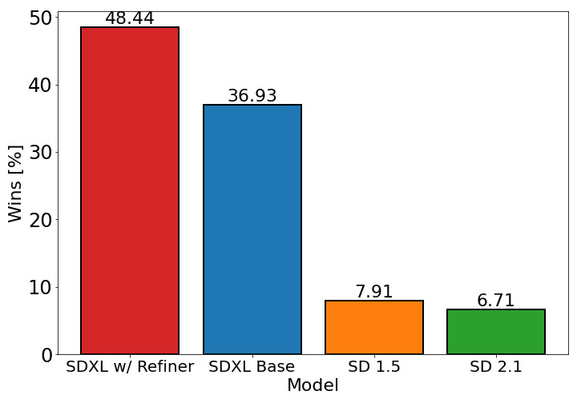
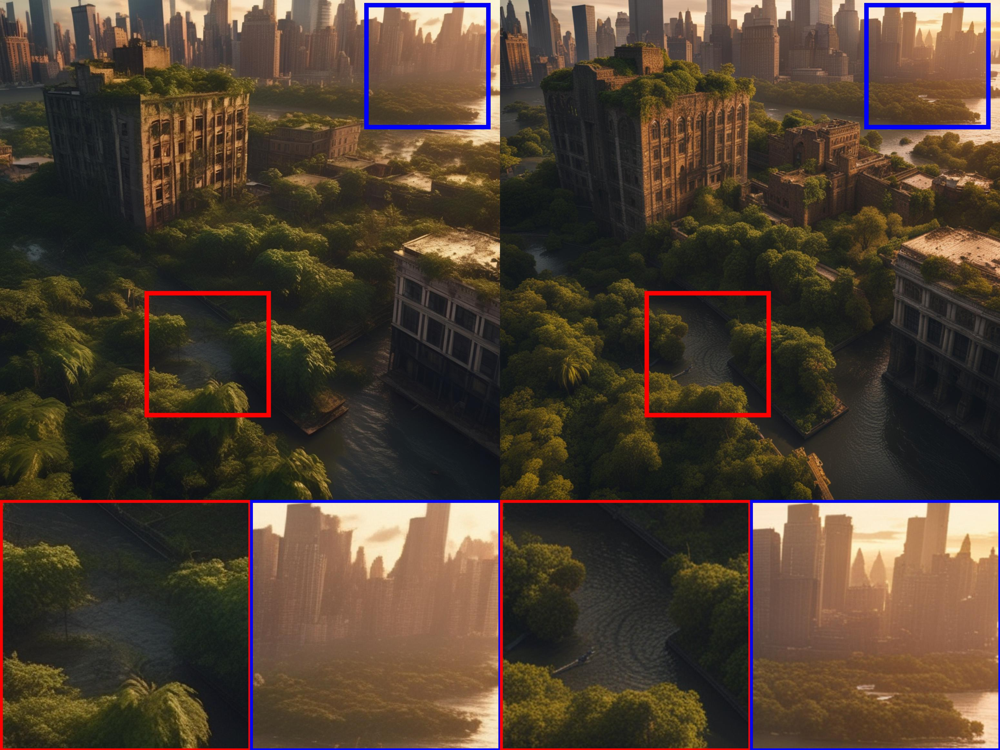
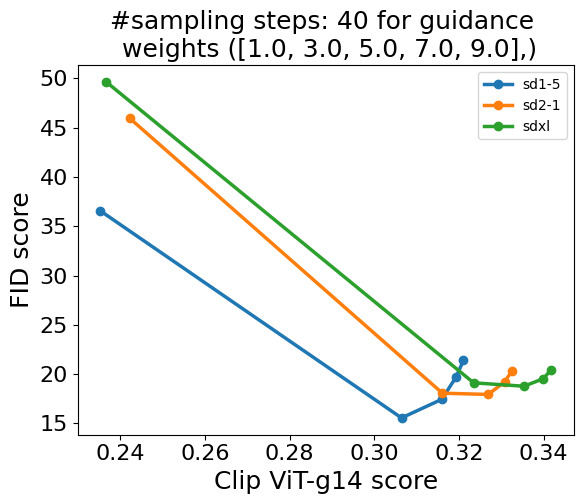

# SDXL: 高解像度画像合成のための潜在拡散モデル改良

> 原題: SDXL: Improving Latent Diffusion Models for High-Resolution Image Synthesis
> 著者: Dustin Podell, Zion English, Kyle Lacey, Andreas Blattmann, Tim Dockhorn, Jonas Müller, Joe Penna, Robin Rombach
> 所属: Stability AI, Applied Research
> 出典: arXiv:2307.01952（2023 年 7 月）
> Code: https://github.com/Stability-AI/generative-models
> Model weights: https://huggingface.co/stabilityai/

## Abstract（要旨）

我々は **SDXL** を提示する。これはテキストから画像への合成のための **潜在拡散モデル（Latent Diffusion Model, LDM）**である。**Stable Diffusion** の従来版と比較して、SDXL は **3 倍大きい UNet バックボーン**を活用する：モデル・パラメータの増加は主に **より多くのアテンション・ブロック**と、SDXL が **2 つ目のテキスト・エンコーダ**を使うことによる **より大きなクロス・アテンション文脈**による。我々は **複数の新規条件付け方式**を設計し、**複数のアスペクト比**で SDXL を訓練する。また **refinement model（精緻化モデル）**を導入し、SDXL が生成したサンプルの視覚的忠実度を **事後的な image-to-image 技術**で改善するために使用する。SDXL は Stable Diffusion の従来版と比較して劇的に改善された性能を示し、**ブラックボックス最先端の画像生成器に匹敵する結果**を達成することを実証する。**オープン研究の促進と大規模モデルの訓練・評価の透明性**を促す精神で、我々はコードとモデル重みへのアクセスを提供する。

## 1. Introduction（はじめに）

過去 1 年で、自然言語、音声、視覚メディアなど様々なデータ領域にわたって深層生成モデリングで巨大な飛躍がもたらされた。本報告では後者に焦点を当て、Stable Diffusion の劇的に改善された版である **SDXL** を発表する。Stable Diffusion は潜在テキスト-画像拡散モデル（DM）であり、3D 分類、制御可能な画像編集、画像のパーソナル化、合成データ拡張、GUI プロトタイピングなどの最近の進歩の **基盤**として機能してきた。注目すべきは、応用範囲が音楽生成や fMRI 脳スキャンからの画像再構築のような多様な分野にも及ぶことである。

ユーザ研究は、SDXL が Stable Diffusion の全ての従来版を有意なマージンで一貫して凌駕することを実証している（図 1 参照）。本報告では、この性能向上をもたらす設計上の選択を提示する：

(i) 従来の Stable Diffusion モデルと比較して **3× 大きい UNet バックボーン**（§2.1）
(ii) **追加の監督を必要としない 2 つの単純だが効果的な追加条件付け技術**（§2.2）
(iii) SDXL が生成した潜在変数に **noising-denoising プロセス**を適用してサンプルの視覚品質を改善する **別個の拡散ベース refinement モデル**（§2.5）

視覚メディア作成分野における主要な懸念は、ブラックボックス・モデルが最先端と認識されることがしばしばあるが、その構造の不透明性が忠実な性能の評価と検証を妨げることである。この透明性の欠如は再現性を妨げ、革新を抑圧し、コミュニティがこれらモデルの上にさらなる科学と芸術の進歩を構築することを妨げる。SDXL により、ブラックボックス画像生成モデルに匹敵する性能を達成する **オープン・モデル**を公開する（図 10 & 図 11 参照）。

## 2. Improving Stable Diffusion（Stable Diffusion の改良）

本節では、Stable Diffusion アーキテクチャの改良を提示する。これらは **モジュール式**であり、個別にまたは組み合わせて任意のモデルを拡張するために使用できる。以下の戦略は **潜在拡散モデル（LDM）**への拡張として実装されるが、そのほとんどは **ピクセル空間の対応物**にも適用可能である。

<figure>



<figcaption>図1: 左: SDXL と Stable Diffusion 1.5 & 2.1 のユーザ選好比較。SDXL は既に 1.5 & 2.1 を明確に上回るが、追加の refinement 段階で性能がさらに向上する。右: 2 段階パイプラインの可視化—SDXL を用いて 128×128 サイズの初期潜在変数を生成し、その後、特化型高解像度 refinement モデルを使い、第 1 段階で生成された潜在変数に SDEdit を同じプロンプトで適用する。SDXL と refinement モデルは同じオートエンコーダを使用する。</figcaption>
</figure>

### 2.1 Architecture & Scale（アーキテクチャと規模）

**表1**: SDXL と従来 Stable Diffusion モデルの比較。

| Model | **SDXL** | SD 1.4/1.5 | SD 2.0/2.1 |
| --- | --- | --- | --- |
| # of UNet params | **2.6B** | 860M | 865M |
| Transformer blocks | **[0, 2, 10]** | [1, 1, 1, 1] | [1, 1, 1, 1] |
| Channel mult. | **[1, 2, 4]** | [1, 2, 4, 4] | [1, 2, 4, 4] |
| Text encoder | **CLIP ViT-L & OpenCLIP ViT-bigG** | CLIP ViT-L | OpenCLIP ViT-H |
| Context dim. | **2048** | 768 | 1024 |
| Pooled text emb. | **OpenCLIP ViT-bigG** | N/A | N/A |

DDPM が画像合成のための強力な生成モデルとして DM を実証して以来、**畳み込み UNet 構造**が拡散ベース画像合成の支配的なアーキテクチャであった。しかし基盤的 DM の発展とともに、根底のアーキテクチャは常に進化してきた：**自己注意と改良アップスケーリング層**の追加、テキスト-画像合成のための **クロス・アテンション**、純粋な **transformer ベース構造**まで。

我々はこのトレンドに従い、**UNet の低レベル特徴に transformer 計算の大部分をシフト**させる。元の Stable Diffusion 構造とは対照的に、我々は **UNet 内で異種の transformer ブロック分布**を使用する：効率上の理由から、**最高特徴レベルでは transformer ブロックを省略**し、**低レベルでは 2 と 10 ブロックを使用**、UNet の **最低レベル（8× ダウンサンプリング）を完全に削除**する—表 1 参照。

テキスト条件付けには、より強力な事前学習済みテキスト・エンコーダを選ぶ：**[[entities/clip|CLIP]] ViT-L と OpenCLIP ViT-bigG を組み合わせ**、ペナルティメイト・テキスト・エンコーダ出力をチャンネル軸に沿って **連結**する。クロス・アテンション層でテキスト入力に条件付けする以外に、追加で **OpenCLIP からの pooled テキスト埋め込み**にもモデルを条件付けする。これら変更により、UNet で **26 億パラメータ**のモデル・サイズとなる。テキスト・エンコーダの合計サイズは **817M パラメータ**。

### 2.2 Micro-Conditioning（マイクロ条件付け）

<figure>


<figcaption>図2: 我々の事前学習データセットの高さ vs 幅分布。提案された size-conditioning がなければ、256 ピクセル未満の辺長を持つデータの 39% が破棄される（破線の黒線で可視化）。各セルの色強度はサンプル数に比例。</figcaption>
</figure>

#### 画像サイズによるモデルの条件付け

LDM パラダイムの悪名高い欠点は、その 2 段階アーキテクチャにより訓練に **最小画像サイズ**を要求することである。この問題に対処する 2 つの主要アプローチは：(a) 一定の最小解像度未満のすべての訓練画像を破棄（例: Stable Diffusion 1.4/1.5 は 512 ピクセル未満のサイズを持つ画像を破棄）、または (b) 小さすぎる画像をアップスケール。しかし所望の画像解像度に応じて、前者の方法は **訓練データの大部分を破棄**することにつながり、性能損失と汎化を害する可能性が高い。図 2 で SDXL の事前学習データに対するこの効果を可視化する：このデータ選択について、**256² ピクセル未満のサンプルすべてを破棄すると、データの 39% が破棄される**。後者の方法は通常 **アップスケーリング・アーティファクト**を導入し、ぼやけたサンプルなど最終モデル出力に漏れる。

代わりに、我々は **UNet モデルを元の画像解像度に条件付け**することを提案する。具体的には、画像の元の（つまりリスケール前の）高さと幅を追加条件として提供する：

$$\mathbf{c}_{\text{size}} = (h_{\text{original}}, w_{\text{original}})$$

各成分は独立に **フーリエ特徴エンコーディング**で埋め込まれ、これらエンコーディングは単一ベクトルに連結され、**timestep 埋め込みに加算**してモデルに供給する。

<figure>


<figcaption>図3: size-conditioning を変化させる効果。SDXL から同じランダム・シードで 4 サンプルを描画し、size-conditioning を上のように変化させる。より大きな画像サイズに条件付けると画像品質が明らかに向上する。512² モデルからのサンプル。</figcaption>
</figure>

推論時、ユーザは **size-conditioning** を介して画像の所望の **見かけの解像度**を設定できる。図 3 から明らかなように、モデルは条件付け $c_{\text{size}}$ を解像度依存の画像特徴と関連付けることを学習しており、これは特定のプロンプトに対応する出力の外観を変更するために活用できる。

**表2**: 元の空間サイズによる条件付けは、クラス条件付き ImageNet (512²) で性能を改善する。

| model | FID-5k ↓ | IS-5k ↑ |
| --- | --- | --- |
| CIN-512-only | 43.84 | 110.64 |
| CIN-nocond | 39.76 | 211.50 |
| **CIN-size-cond** | **36.53** | **215.34** |

この単純だが効果的な条件付け技術の効果を定量的に評価するため、3 つの LDM を class conditional ImageNet で 512² で訓練・評価する：(i) **CIN-512-only**: 少なくとも 1 辺が 512 ピクセル未満の訓練例をすべて破棄（結果として **70k 画像のみの訓練データセット**）、(ii) **CIN-nocond**: すべての訓練例を size-conditioning なしで使用、(iii) **CIN-size-cond**: 追加 size-conditioning を使用。

訓練後、各モデルに対して 50 DDIM ステップと（classifier-free）guidance scale 5 で 5k サンプルを生成し、**IS と FID**（完全な検証セットに対して）を計算する。CIN-size-cond については常に $c_{\text{size}} = (512, 512)$ で条件付ける。表 2 に結果をまとめ、**CIN-size-cond が両指標でベースラインモデルを改善**することを確認する。CIN-512-only の劣化した性能は **小さな訓練データセットへの過学習による悪い汎化**に起因し、CIN-nocond のサンプル分布における **ぼやけたサンプル・モードの効果**が FID スコアの低下をもたらす。

#### クロッピング・パラメータによるモデルの条件付け

<figure>


<figcaption>図4: SDXL の出力を Stable Diffusion の従来版と比較。各プロンプトについて、それぞれのモデルの 50 ステップ DDIM サンプラーと cfg-scale 8.0 でランダムに 3 サンプルを表示。</figcaption>
</figure>

図 4 の最初の 2 行は、従来 SD モデルの典型的な失敗モードを示す：**合成された物体が切り取られる**（左の例で SD 1.5 と SD 2.1 で猫の頭が切れている）。この行動の直観的な説明は、訓練中の **ランダム・クロッピング**の使用である：PyTorch のような DL フレームワークでバッチをまとめるには同じサイズのテンソルが必要なため、典型的な処理パイプラインは (i) 最短辺が所望のターゲット・サイズに一致するように画像をリサイズし、(ii) 長軸に沿ってランダムに画像をクロップする。ランダム・クロッピングは自然なデータ拡張だが、**生成されたサンプルに漏れて**上記の悪意的効果を引き起こす。

この問題を修正するため、別の単純だが効果的な条件付け方法を提案する：データロード中、クロップ座標 $c_{\text{top}}$ と $c_{\text{left}}$（左上隅から高さ・幅軸に沿ってクロップされたピクセル量を指定する整数）を **一様にサンプリング**し、上記の size-conditioning と同様に **フーリエ特徴埋め込み**を介してモデルに条件付けパラメータとして供給する。連結された埋め込み $\mathbf{c}_{\text{crop}}$ が追加条件付けパラメータとして使用される。

**Algorithm 1: size- + crop-conditioning パイプライン**

```
入力: 訓練データセット D、ターゲット画像サイズ s = (h_tgt, w_tgt)
リサイズ関数 R、クロップ関数 C、モデル学習ステップ T

while not converged:
    x ~ D
    w_original = width(x)
    h_original = height(x)
    c_size = (h_original, w_original)
    x = R(x, s)  # smaller image size を target size s にリサイズ
    if h_original <= w_original:
        c_left ~ U(0, width(x) - s_w)
        c_top = 0
    else:
        c_top ~ U(0, height(x) - s_h)
        c_left = 0
    c_crop = (c_top, c_left)
    x = C(x, s, c_crop)  # size s に左上座標 (c_top, c_left) でクロップ
    converged = T(x, c_size, c_crop)  # c_size と c_crop で条件付けて訓練
```

大規模データセットは平均的に物体中心であると我々の経験で判明しているため、推論時には $(c_{\text{top}}, c_{\text{left}}) = (0, 0)$ を設定し、**訓練モデルから物体中心のサンプル**を得る。

<figure>


<figcaption>図5: crop-conditioning を変化させる効果。SD 1.5 と 2.1 のサンプル（このパラメータの明示的制御がないためクロップ・アーティファクトが導入される）は図 4 と 14 を参照。512² モデルからのサンプル。</figcaption>
</figure>

図 5 を参照：$(c_{\text{top}}, c_{\text{left}})$ を調整することで、推論時の **クロッピング量を成功的にシミュレート**できる。これは **条件付け増強**の一形態で、自己回帰モデルや最近の拡散モデルで様々な形で使用されてきた。

データ・バケッティングのような他の方法も同じタスクに成功的に取り組むが、我々は **クロッピング誘発データ拡張の恩恵**を依然として得つつ、それが **生成プロセスに漏れないこと**を確保する—実際にはこれを利用して画像合成プロセスのより多くの制御を得る。さらに、実装が簡単で、追加のデータ前処理なしに訓練中にオンライン方式で適用できる。

### 2.3 Multi-Aspect Training（マルチ・アスペクト訓練）

実世界のデータセットは、サイズとアスペクト比が広く変動する画像を含む（図 2 参照）。テキスト-画像モデルの共通出力解像度は 512×512 または 1024×1024 ピクセルの正方形画像だが、ランドスケープ（例: 16:9）やポートレート形式のスクリーンの広範な分布と使用を考えると、これはむしろ不自然な選択だと我々は主張する。

これに動機付けられ、**複数アスペクト比を同時に扱う**ようにモデルを微調整する：共通慣行に従いデータを **異なるアスペクト比のバケット**に分割し、**ピクセル数を 1024² ピクセルにできるだけ近く保ち**、高さと幅を **64 の倍数で**変化させる。すべてのアスペクト比のリストは付録 I に記載。最適化中、訓練バッチは **同じバケットの画像で構成**され、各訓練ステップでバケット・サイズを **交替**する。さらに、モデルは **バケット・サイズ（target size）**を条件付けとして受け取る：

$$\mathbf{c}_{\text{ar}} = (h_{\text{tgt}}, w_{\text{tgt}})$$

これは size- と crop-conditioning と同様にフーリエ空間に埋め込まれる。

実用上、固定アスペクト比と解像度で事前訓練した後の **微調整段階**としてマルチ・アスペクト訓練を適用し、§2.2 で導入した条件付け技術と **チャンネル軸沿いに連結**して組み合わせる。crop-conditioning と multi-aspect 訓練は **相補的操作**であることに注意し、crop-conditioning は **バケット境界内（通常 64 ピクセル）でのみ動作**する。

### 2.4 Improved Autoencoder（改良オートエンコーダ）

**表3**: COCO2017 検証分割（256×256 画像）でのオートエンコーダ再構成性能。

| model | PSNR ↑ | SSIM ↑ | LPIPS ↓ | rFID ↓ |
| --- | --- | --- | --- | --- |
| **SDXL-VAE** | **24.7** | **0.73** | **0.88** | **4.4** |
| SD-VAE 1.x | 23.4 | 0.69 | 0.96 | 5.0 |
| SD-VAE 2.x | 24.5 | 0.71 | 0.92 | 4.7 |

Stable Diffusion は **LDM** で、事前訓練済み・学習済み（固定）のオートエンコーダの潜在空間で動作する。意味的構成の大部分は LDM が行うが、**オートエンコーダの改良で生成画像の局所的高周波詳細を改善**できる。この目的のため、元の Stable Diffusion で使用されたのと同じオートエンコーダ構造を **より大きなバッチサイズ（256 vs 9）で訓練**し、追加で **EMA で重みを追跡**する。結果として得られるオートエンコーダはすべての評価された再構成指標で元のモデルを凌駕する（表 3 参照）。我々はこのオートエンコーダをすべての実験で使用する。

### 2.5 Putting Everything Together（すべてを統合）

最終モデル **SDXL** を **多段階手順**で訓練する。SDXL は §2.4 のオートエンコーダと、**1000 ステップの離散時間拡散スケジュール**を使用する。

**訓練段階**:
1. **256×256 ピクセル**で **600,000 最適化ステップ**、バッチサイズ 2048、size- と crop-conditioning を使用
2. **512×512 ピクセル**でさらに **200,000 最適化ステップ**
3. **マルチ・アスペクト訓練**を **offset-noise レベル 0.05** と組み合わせて使用、~1024×1024 ピクセル面積の異なるアスペクト比で訓練

#### Refinement Stage（精緻化段階）

経験的に、結果モデルが **時々局所品質の低いサンプル**を生成することを発見する（図 6 参照）。サンプル品質を改善するため、**同じ潜在空間で別個の LDM を訓練**し、**高品質・高解像度データに特化**させ、ベースモデルからのサンプルに **SDEdit によって導入された noising-denoising プロセス**を採用する。我々はこの refinement モデルを **最初の 200（離散）ノイズ・スケール**に特化させる。推論時、ベース SDXL から潜在変数をレンダリングし、**同じテキスト入力**を使って refinement モデルで **潜在空間で直接拡散・ノイズ除去**する（図 1 参照）。この段階は **任意**だが、**詳細な背景や人間の顔のサンプル品質を改善**する（図 6 と図 13 で実証）。

モデルの性能（refinement 段階あり/なし）を評価するため、**ユーザ研究**を実施し、以下の 4 モデルからユーザの好みの生成物を選ばせた：SDXL、SDXL（refiner あり）、Stable Diffusion 1.5、Stable Diffusion 2.1。結果は **refinement 段階を持つ SDXL が最も高評価**で、SD 1.5 & 2.1 を有意なマージンで凌駕することを実証する：

- **SDXL w/ refinement: 48.44%**
- **SDXL base: 36.93%**
- Stable Diffusion 1.5: 7.91%
- Stable Diffusion 2.1: 6.71%

しかし FID と CLIP スコアのような古典的性能指標を使うと、SDXL の従来手法に対する改善は反映されない（図 12、付録 F で議論）。

<figure>



<figcaption>図6: SDXL の 1024² サンプル（ズームイン付き）—refinement モデルなし（左）とあり（右）。プロンプト: "Epic long distance cityscape photo of New York City flooded by the ocean and overgrown buildings and jungle ruins in rainforest, at sunset, cinematic shot, highly detailed, 8k, golden light"。</figcaption>
</figure>

## 3. Future Work（今後の研究）

本報告は、テキスト-画像合成のための基盤モデル Stable Diffusion への改善の **予備的分析**を提示する。合成画像品質、プロンプト追従性、構成において有意な改善を達成しているが、以下にモデルがさらに改善可能と考える側面を議論する：

- **単一段階**: 現在、追加 refinement モデルを伴う **2 段階アプローチ**で SDXL から最良サンプルを生成する。これは **2 つの大きなモデルをメモリにロード**する必要があり、アクセシビリティとサンプリング速度を妨げる。将来の研究は等価以上の品質の単一段階を提供する方法を調査すべきである
- **テキスト合成**: スケールと大きなテキスト・エンコーダ（OpenCLIP ViT-bigG）は Stable Diffusion の従来版でのテキスト・レンダリング能力を改善するが、**バイトレベル・トークナイザの組み込み**や、単にモデルをより大きなサイズに拡張することで、テキスト合成をさらに改善できる
- **アーキテクチャ**: 本作の探索段階で UViT や DiT のような **transformer ベース構造**を簡単に実験したが、即座の利益を発見しなかった。しかし、慎重なハイパーパラメータ研究が最終的により大きな transformer 支配型構造へのスケーリングを可能にすると楽観的である
- **蒸留**: 元の Stable Diffusion モデルに対する改善は有意だが、**推論コストの増加**（VRAM とサンプリング速度の両方）を伴う。将来の研究は推論に必要な計算を削減し、サンプリング速度を増加することに焦点を当てる—guidance, knowledge, progressive distillation を通じて
- 我々のモデルは Ho らの **離散時間定式化**で訓練され、**aesthetically pleasing な結果のため offset-noise を必要**とする。**EDM フレームワーク**は将来のモデル訓練の有望な候補で、連続時間での定式化により増加サンプリング柔軟性を可能にし、ノイズ・スケジュール補正を必要としない

---

# 付録（Appendix）

## Appendix B: Limitations（限界）

我々のモデルは現実的画像の生成と複雑なシーンの合成で印象的な能力を実証しているが、その固有の限界を認識することは重要である。

**まず**、モデルは **人間の手のような複雑な構造**を合成する際に課題に遭遇する場合がある（図 7 上左）。多様なデータで訓練されているが、人間解剖学の複雑性が一貫した正確表現の達成を困難にする。この限界は **細粒度詳細の合成を特にターゲットとした追加スケーリングと訓練技術**の必要性を示唆する。手のような物体は写真で非常に高い分散で現れ、モデルがその場合の **実 3D 形状と物理的限界の知識**を抽出することが困難であることが理由かもしれない。

**次に**、生成画像で著しいレベルの現実性を達成するが、**完全な写真現実性は達成していない**ことに注目する重要性。微妙な照明効果や微細なテクスチャ変化のような特定のニュアンスは、生成画像でまだ欠落しているか、忠実度低く表現される可能性がある。

さらに、**モデルの訓練プロセスは大規模データセットに大きく依存**しており、これは **社会的・人種的バイアス**を不注意に導入する可能性がある。結果として、モデルは画像生成や視覚属性推論時にこれらのバイアスを不注意に悪化させる可能性がある。

サンプルが **複数の物体や主体を含む特定の場合**、モデルは **"concept bleeding"**（概念漏れ）として知られる現象を示すことがある。これは異なる視覚要素の意図しない融合や重複として現れる。例えば図 14 では、オレンジのサングラスが観察され、オレンジのセーターからの concept bleeding のインスタンスを示す。図 8 では、ペンギンは「青い帽子」と「赤い手袋」を持つはずだが、代わりに **青い手袋と赤い帽子**で生成される。この根本原因は、使用される事前訓練済みテキスト・エンコーダにある可能性がある：(i) **すべての情報を単一トークンに圧縮**するよう訓練されているため、正しい属性と物体のみを **バインド**することに失敗する可能性、(ii) **対比損失**も寄与する可能性—異なるバインディングを持つネガティブ例が同じバッチ内で必要となるため。

加えて、SD の従来版に対する有意な進歩を表すが、**長く判読可能なテキストのレンダリング**にまだ困難に遭遇する。たまに、生成テキストはランダム文字を含むか、不整合を示すことがある。この限界の克服には、**文字レベル・テキスト・トークナイザ**を介したテキスト・レンダリング能力強化技術のさらなる調査と開発が必要である。あるいは、モデルのスケーリングがテキスト合成をさらに改善する。

## Appendix C: Diffusion Models（拡散モデルの概要）

本セクションでは DM の簡潔な概要を提供する。**連続時間 DM フレームワーク**を考慮し、Karras et al. (EDM, 2022) の発表に従う。

データ分布を $p_{\text{data}}(\mathbf{x}_0)$ とし、データに i.i.d. $\sigma^2$ 分散ガウス・ノイズを追加して得られる分布を $p(\mathbf{x}; \sigma)$ とする。十分に大きな $\sigma_{\max}$ に対して、$p(\mathbf{x}; \sigma_{\max}^2)$ は $\sigma_{\max}^2$ 分散ガウス・ノイズとほぼ区別不可能である。この観察を活用し、**DM は高分散ガウス・ノイズ $\mathbf{x}_M \sim \mathcal{N}(\mathbf{0}, \sigma_{\max}^2)$ をサンプリング**し、**逐次的に $\mathbf{x}_M$ を $\mathbf{x}_i \sim p(\mathbf{x}_i; \sigma_i)$ にノイズ除去**する（$i \in \{0, \dots, M\}$、$\sigma_i < \sigma_{i+1}$、$\sigma_M = \sigma_{\max}$）。よく訓練された DM と $\sigma_0 = 0$ について、結果の $\mathbf{x}_0$ はデータに従って分布する。

**サンプリング**: 実用上、上記の反復的ノイズ除去プロセスは **Probability Flow ODE** の数値シミュレーションで実装できる：

$$d\mathbf{x} = -\dot{\sigma}(t)\sigma(t) \nabla_{\mathbf{x}} \log p(\mathbf{x}; \sigma(t)) dt$$

ここで $\nabla_{\mathbf{x}} \log p(\mathbf{x}; \sigma)$ は **スコア関数**。スケジュール $\sigma(t): [0, 1] \to \mathbb{R}_+$ はユーザ指定。あるいは **確率微分方程式（SDE）**も数値シミュレーションできる：

$$d\mathbf{x} = \underbrace{-\dot{\sigma}(t)\sigma(t) \nabla_{\mathbf{x}} \log p(\mathbf{x}; \sigma(t)) dt}_{\text{Probability Flow ODE}} - \underbrace{\beta(t)\sigma^2(t) \nabla_{\mathbf{x}} \log p(\mathbf{x}; \sigma(t)) dt + \sqrt{2\beta(t)}\sigma(t) d\omega_t}_{\text{Langevin diffusion 成分}}$$

ここで $d\omega_t$ は標準ウィーナー・プロセス。原則的に、Probability Flow ODE または SDE のいずれをシミュレーションしても **同じ分布からのサンプル**が得られる。

**訓練**: DM 訓練はスコア関数 $\nabla_{\mathbf{x}} \log p(\mathbf{x}; \sigma)$ のためのモデル $\mathbf{s}_{\boldsymbol{\theta}}(\mathbf{x}; \sigma)$ の学習に帰着する。モデルは例えば次のようにパラメータ化できる：

$$\nabla_{\mathbf{x}} \log p(\mathbf{x}; \sigma) \approx s_{\boldsymbol{\theta}}(\mathbf{x}; \sigma) = (D_{\boldsymbol{\theta}}(\mathbf{x}; \sigma) - \mathbf{x}) / \sigma^2$$

ここで $D_{\boldsymbol{\theta}}$ は **学習可能 denoiser** で、ノイズ・データ点 $\mathbf{x}_0 + \mathbf{n}$、$\mathbf{x}_0 \sim p_{\text{data}}(\mathbf{x}_0)$、$\mathbf{n} \sim \mathcal{N}(\mathbf{0}, \sigma^2 \mathbf{I}_d)$ を与えられ、ノイズ・レベル $\sigma$ に条件付けて、**クリーンな $\mathbf{x}_0$ を予測**する。

denoiser $D_{\boldsymbol{\theta}}$ は **denoising score matching (DSM)** を介して訓練できる：

$$\mathbb{E}_{(\mathbf{x}_0, \mathbf{c}) \sim p_{\text{data}}, (\sigma, \mathbf{n}) \sim p(\sigma, \mathbf{n})} \left[ \lambda_\sigma \| D_{\boldsymbol{\theta}}(\mathbf{x}_0 + \mathbf{n}; \sigma, \mathbf{c}) - \mathbf{x}_0 \|_2^2 \right]$$

本作では $p(\sigma)$ を **1000 ノイズ・レベル**にわたる離散分布とし、$\lambda_\sigma = \sigma^{-2}$ と設定する。

**Classifier-free guidance**: classifier-free guidance は **条件付きと無条件モデルの予測を混合**することで DM の反復サンプリング・プロセスを条件付け信号 $\mathbf{c}$ に向けてガイドする技術：

$$D^w(\mathbf{x}; \sigma, \mathbf{c}) = (1 + w) D(\mathbf{x}; \sigma, \mathbf{c}) - w D(\mathbf{x}; \sigma)$$

ここで $w \geq 0$ は **guidance strength**。実用上、無条件モデルは式 3 で **条件付け信号 $\mathbf{c}$ をランダムに null 埋め込みに置換**する（例えば 10% の時間）ことで、単一ネットワークで条件付きモデルと共同で訓練できる。Classifier-free guidance は、多様性とのトレードオフで **サンプリング品質を改善する**ためテキスト-画像 DM で広く使用される。

## Appendix D: Comparison to the State of the Art（最先端との比較）

SDXL を **DeepFloyd IF、DALL-E 2、Bing Image Creator、Midjourney v5.2** と質的比較する。cherry-picking から生じるバイアスを軽減するため、**Parti (P2) プロンプトをランダムに選択**する。Seed 3 は、そのようなパラメータが指定可能なすべてのモデルにわたって一様に適用される。

## Appendix E: Comparison to Midjourney v5.1（Midjourney v5.1 との比較）

### E.1 Overall Votes（全体投票）

SDXL の生成品質を評価するため、最先端テキスト-画像生成プラットフォーム **Midjourney** に対するユーザ研究を実施する。画像キャプションのソースとして **PartiPrompts (P2) ベンチマーク**を使用する。

我々の研究では、各カテゴリから 5 つのランダム・プロンプトを選択し、各プロンプトについて **Midjourney（v5.1、シード 2 設定）と SDXL の両方で 1024×1024 画像を 4 枚生成**。これら画像は **AWS GroundTruth タスクフォース**に提示され、プロンプト追従性に基づいて投票された。全体として、**SDXL がプロンプト追従性で Midjourney よりわずかに好まれる**。

### E.2 Category & challenge comparisons on PartiPrompts (P2)

P2 ベンチマークの各プロンプトは **カテゴリ**と **チャレンジ**に組織化される。各カテゴリ（図 10）とチャレンジ（図 11）の比較を示す。**6 カテゴリ中 4 で SDXL が Midjourney を凌駕**し、**10 チャレンジ中 7 で両モデル間に有意差がないか SDXL が Midjourney を凌駕**する。

**17,153 のユーザ選好比較**で、**SDXL v0.9 は Midjourney V5.1 に対して 54.9% の時間で好まれた**。

## Appendix F: On FID Assessment of Generative Text-Image Foundation Models（FID 評価について）

<figure>



<figcaption>図12: 異なる cfg スケールでの FID vs CLIP スコアのプロット。SDXL は CLIP-score で測定されたテキスト整合のわずかな改善のみを示し、人間評価者の判断と整合しない。FID は SD-1.5 および SD-2.1 より悪い、人間評価者は明らかに SDXL の生成を好むにもかかわらず。</figcaption>
</figure>

過去数年間、生成テキスト-画像モデルの評価では **COCO のような自然画像の複雑で小規模なテキスト-画像データセットでのゼロショット FID と CLIP-score の評価**が一般的慣行であった。しかし、視覚的構成性だけでなく、**深いテキスト理解、独自芸術スタイル間の細粒度区別、特に視覚的美学の明確な感覚**などの困難なタスクもターゲットとする基盤的テキスト-画像モデルの登場により、この特定形態のモデル評価はますます疑問視されるようになった。

**Kirstain et al. (Pick-a-pic, 2023) は COCO ゼロショット FID が視覚美学と負の相関**を持つことを実証し、そのようなモデルの生成性能は **人間評価者**によって測定されるべきと示唆する。我々は SDXL について調査し、COCO からの 10k テキスト-画像対について FID-vs-CLIP 曲線を可視化する。**人間評価者（図 1）と質的（図 4 と図 14）に劇的に改善された性能を示すにもかかわらず**、SDXL は以前の SD バージョンよりも **良い FID スコアを達成しない**。逆に、SDXL の FID は比較された 3 モデルの中で **最悪**で、CLIP スコア（OpenClip ViT g-14 で測定）はわずかに改善されているだけ。これは Kirstain et al. の発見を裏付け、**特にテキスト-画像基盤モデルのための追加の定量的性能スコアの必要性**をさらに強調する。

## Appendix G: Additional Comparison between Single- and Two-Stage SDXL pipeline

SDXL サンプル（ズームイン付き）—refinement モデルなし（左）とあり（右）。プロンプト（上）"close up headshot, futuristic young woman, wild hair sly smile in front of gigantic UFO, dslr, sharp focus, dynamic composition"、（下）"Three people having dinner at a table at new years eve, cinematic shot, 8k"。詳細を見るためズームイン。

## Appendix H: Comparison between SD 1.5 vs. SD 2.1 vs. SDXL

SD 1.5、SD 2.1、SDXL の出力比較の追加結果。各プロンプトについて、それぞれのモデルの 50 ステップ DDIM サンプラーと cfg-scale 8.0 でランダムに 3 サンプルを表示。

## Appendix I: Multi-Aspect Training Hyperparameters（マルチ・アスペクト訓練ハイパーパラメータ）

§2.3 で記述された混合アスペクト比微調整に使用する画像解像度（**40 種類、合計面積 ~1024²**）：

| Height | Width | Aspect Ratio |
| --- | --- | --- |
| 512 | 2048 | 0.25 |
| 512 | 1984 | 0.26 |
| 512 | 1920 | 0.27 |
| 512 | 1856 | 0.28 |
| 576 | 1792 | 0.32 |
| 576 | 1728 | 0.33 |
| 576 | 1664 | 0.35 |
| 640 | 1600 | 0.4 |
| 640 | 1536 | 0.42 |
| 704 | 1472 | 0.48 |
| 704 | 1408 | 0.5 |
| 704 | 1344 | 0.52 |
| 768 | 1344 | 0.57 |
| 768 | 1280 | 0.6 |
| 832 | 1216 | 0.68 |
| 832 | 1152 | 0.72 |
| 896 | 1152 | 0.78 |
| 896 | 1088 | 0.82 |
| 960 | 1088 | 0.88 |
| 960 | 1024 | 0.94 |
| **1024** | **1024** | **1.0** |
| 1024 | 960 | 1.07 |
| 1088 | 960 | 1.13 |
| 1088 | 896 | 1.21 |
| 1152 | 896 | 1.29 |
| 1152 | 832 | 1.38 |
| 1216 | 832 | 1.46 |
| 1280 | 768 | 1.67 |
| 1344 | 768 | 1.75 |
| 1408 | 704 | 2.0 |
| 1472 | 704 | 2.09 |
| 1536 | 640 | 2.4 |
| 1600 | 640 | 2.5 |
| 1664 | 576 | 2.89 |
| 1728 | 576 | 3.0 |
| 1792 | 576 | 3.11 |
| 1856 | 512 | 3.62 |
| 1920 | 512 | 3.75 |
| 1984 | 512 | 3.88 |
| 2048 | 512 | 4.0 |

## Appendix J: Pseudo-code for Conditioning Concatenation along the Channel Axis

§2.1-2.3 で導入された追加条件付けをチャンネル次元沿いに連結する Python コード：

```python
from einops import rearrange
import torch

batch_size = 16
pooled_dim = 512  # テキスト・エンコーダの pooled 出力のチャンネル次元

def fourier_embedding(inputs, outdim=256, max_period=10000):
    """
    拡散モデルで一般的に使用される古典的正弦波 timestep 埋め込み
    :param inputs: 整数スカラーのバッチ、shape [b,]
    :param outdim: 埋め込み次元
    :param max_period: 追加された最大周波数
    :return: 埋め込みバッチ、shape [b, outdim]
    """
    ...

def cat_along_channel_dim(x: torch.Tensor) -> torch.Tensor:
    if x.ndim == 1:
        x = x[..., None]
    assert x.ndim == 2
    b, d_in = x.shape
    x = rearrange(x, "b din -> (b din)")
    # fourier fn は追加次元を追加
    emb = fourier_embedding(x)
    d_f = emb.shape[-1]
    emb = rearrange(emb, "(b din) df -> b (din df)", b=b, din=d_in, df=d_f)
    return emb

def concat_embeddings(
    c_size: torch.Tensor,      # §3.2 size/crop 条件付けバッチ
    c_crop: torch.Tensor,
    c_ar: torch.Tensor,        # §3.3 アスペクト比条件付けバッチ
    c_pooled_txt: torch.Tensor # §3.1 pooling 後のテキスト・エンコーダ最終出力
) -> torch.Tensor:
    c_size_emb = cat_along_channel_dim(c_size)
    c_crop_emb = cat_along_channel_dim(c_crop)
    c_ar_emb = cat_along_channel_dim(c_ar)
    # 連結出力はノイズ・レベル条件付けと同じチャンネル次元にマップされ、
    # UNet に供給される前にその条件付けに加算される
    return torch.cat([c_pooled_txt, c_size_emb, c_crop_emb, c_ar_emb], dim=1)

# §3.2 のように c_size と c_crop をシミュレート
c_size = torch.zeros((batch_size, 2)).long()
c_crop = torch.zeros((batch_size, 2)).long()
# §3.3 のように c_ar と pooled テキスト・エンコーダ出力をシミュレート
c_ar = torch.zeros((batch_size, 2)).long()
c_pooled = torch.zeros((batch_size, pooled_dim)).long()

# 連結された埋め込みを取得
c_concat = concat_embeddings(c_size, c_crop, c_ar, c_pooled)
```

**図 16**: §2.1-2.3 で導入された追加条件付けをチャンネル次元沿いに連結する Python コード。
