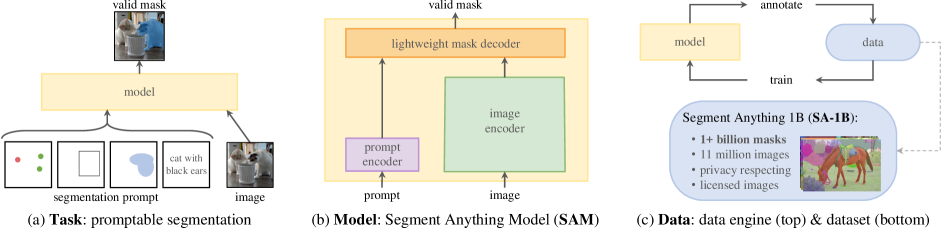
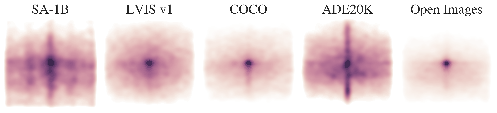
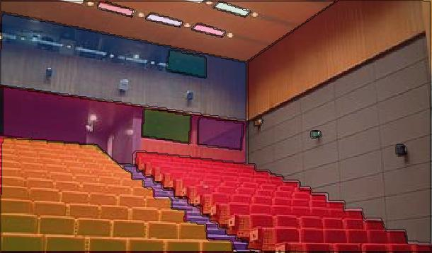
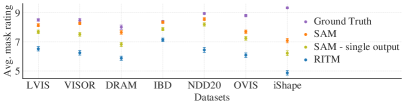
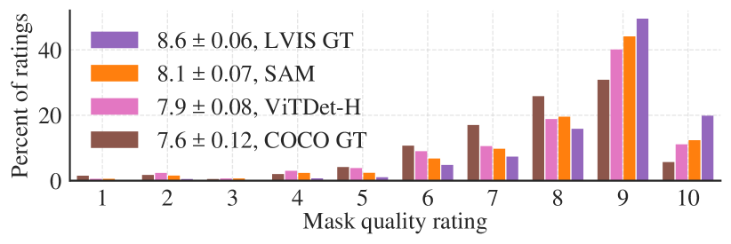
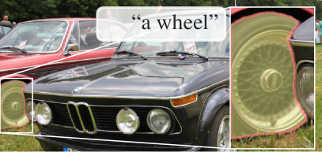
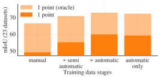
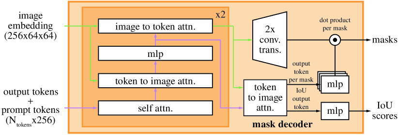
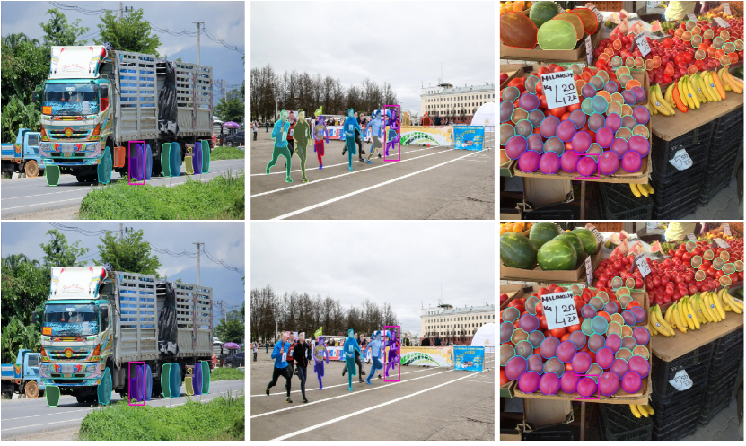

# Segment Anything（あらゆるものをセグメント化する）

> 原題: Segment Anything
> 著者: Alexander Kirillov, Eric Mintun, Nikhila Ravi, Hanzi Mao, Chloe Rolland, Laura Gustafson, Tete Xiao, Spencer Whitehead, Alexander C. Berg, Wan-Yen Lo, Piotr Dollár, Ross Girshick（Meta AI Research, FAIR）
> 出典: arXiv:2304.02643 / ICCV 2023

## Abstract（要旨）

我々は Segment Anything（SA）プロジェクトを提案する。これは画像セグメンテーションのための新しいタスク・モデル・データセットからなるプロジェクトである。我々は効率的なモデルをデータ収集ループの中で用いることで、これまでで最大（はるかに最大）のセグメンテーションデータセットを構築した。このデータセットは、ライセンス取得済みかつプライバシーに配慮した 1,100 万枚の画像上に 10 億を超えるマスクを含む。本モデルは「プロンプト可能（promptable）」となるよう設計・訓練されており、新しい画像分布や新しいタスクへゼロショットで転移できる。我々は数多くのタスクで本モデルの能力を評価し、そのゼロショット性能が印象的であること――しばしば従来の完全教師ありの結果に対して競合的あるいは優位ですらある――を見出した。我々は Segment Anything Model（SAM）と対応するデータセット（SA-1B、10 億マスク・1,100 万画像）を <https://segment-anything.com> で公開し、コンピュータビジョンにおける基盤モデル（foundation model）の研究を促進する。

<figure>

<figcaption>図1: 我々は、3 つの相互に関連した構成要素――(a) プロンプト可能なセグメンテーションタスク、(b) データアノテーションを駆動しかつプロンプトエンジニアリングを介して様々なタスクへゼロショット転移を可能にするセグメンテーションモデル SAM、(c) 10 億を超えるマスクを持つ我々のデータセット SA-1B を集めるためのデータエンジン――を導入することで、セグメンテーションのための基盤モデルを構築することを目指す。</figcaption>
</figure>

## 1. Introduction（はじめに）

Web スケールのデータセット上で事前学習された大規模言語モデルは、強力なゼロショット汎化・少数ショット汎化により NLP に革命を起こしている。こうした「基盤モデル」は、訓練時に見たタスクやデータ分布を超えて汎化することができる。この能力はしばしば *プロンプトエンジニアリング* によって実装される。プロンプトエンジニアリングでは、手作りのテキストを使って言語モデルにプロンプトを与え、当該タスクに対する妥当なテキスト応答を生成させる。Web からの豊富なテキストコーパスでスケールして訓練されたとき、これらのモデルのゼロショット・少数ショット性能は、ファインチューニングされたモデルと驚くほど互角に（場合によっては同等に）戦う。経験的トレンドは、モデル規模・データセットサイズ・総訓練計算量の増大とともにこの挙動が改善することを示している。

基盤モデルはコンピュータビジョンでも探索されているが、その範囲はまだ限定的である。おそらく最も顕著な例は、Web から取得したペア化されたテキストと画像をアラインメントするものである。例えば CLIP や ALIGN は、テキストと画像の 2 つのモダリティをアラインメントするテキストエンコーダと画像エンコーダを対比学習（contrastive learning）で訓練する。一度訓練されると、エンジニアリングされたテキストプロンプトにより、新しい視覚概念やデータ分布へのゼロショット汎化が可能になる。こうしたエンコーダはまた、画像生成（例: DALL·E）のような下流タスクを可能にするために他のモジュールと効果的に合成できる。視覚と言語のエンコーダに関しては多くの進展があったが、コンピュータビジョンにはこの範囲を超える広範な問題群が含まれ、そしてその多くについては潤沢な訓練データが存在しない。

本研究における我々の目標は、*画像セグメンテーションのための基盤モデル* を構築することである。すなわち、強力な汎化を可能にするタスクを使って、プロンプト可能なモデルを開発し、それを広範なデータセットで事前学習することを目指す。このモデルにより、新しいデータ分布上における様々な下流セグメンテーション問題を、プロンプトエンジニアリングを使って解くことを目指す。

この計画の成功は、3 つの要素――タスク、モデル、データ――にかかっている。これらを開発するため、我々は画像セグメンテーションに関する以下の問いに取り組む：

1. ゼロショット汎化を可能にするのはどのようなタスクか？
2. それに対応するモデルアーキテクチャは何か？
3. このタスクとモデルを駆動できるデータは何か？

これらの問いは絡み合っており、包括的な解決を要する。我々はまず、強力な事前学習目的としても、また広範な下流応用を可能にするのにも十分に一般的な *promptable segmentation*（プロンプト可能セグメンテーション）タスクを定義することから始める。このタスクは、柔軟なプロンプトをサポートし、対話的な利用のためにプロンプトされたとき実時間でセグメンテーションマスクを出力できるモデルを要求する。モデルを訓練するためには、多様で大規模なデータソースが必要である。残念ながら、セグメンテーションのための Web スケールのデータソースは存在しない。これに対処するため、我々は「データエンジン」を構築する。すなわち、効率的なモデルを使ってデータ収集を支援し、新たに収集されたデータを使ってモデルを改善する、というイテレーションを行う。次に、それぞれ相互に関連したコンポーネントを順に紹介し、続いて我々が作成したデータセットとアプローチの有効性を示す実験について述べる。

#### Task（タスク, §2）.

NLP およびより最近のコンピュータビジョンでは、新しいデータセットやタスクに対するゼロショット学習・少数ショット学習を「プロンプティング」技法を使ってしばしば実行できる、有望な発展としての基盤モデルが現れている。この流れに着想を得て、我々は *promptable segmentation* タスクを提案する。このタスクの目標は、任意のセグメンテーション *プロンプト* が与えられたとき、*妥当な（valid）* セグメンテーションマスクを返すことである（図 1a 参照）。プロンプトは単に、画像中の何をセグメントするかを指定する。例えばプロンプトには、対象オブジェクトを特定する空間情報やテキスト情報を含めることができる。妥当な出力マスクが必要だという要件は、プロンプトが曖昧で複数のオブジェクトを指し得る場合（例えばシャツ上の 1 点はシャツとそれを着ている人物のどちらも指し得る）でも、出力はそれらのうち少なくとも 1 つに対する合理的なマスクであるべきだ、という意味である。我々はこの promptable segmentation タスクを、事前学習目的としても、またプロンプトエンジニアリングを介して一般の下流セグメンテーションタスクを解くためにも用いる。

#### Model（モデル, §3）.

promptable segmentation タスクと実世界での利用という目標は、モデルアーキテクチャに制約を課す。具体的には、モデルは *柔軟なプロンプト* をサポートし、対話的な利用を可能にするためマスクを償却的（amortized）に *実時間* で計算する必要があり、そして *曖昧性に気付ける（ambiguity-aware）* 必要がある。驚くべきことに、我々はこれら 3 つの制約をすべて満たすシンプルな設計を見出した。すなわち、強力な画像エンコーダが画像埋め込みを計算し、プロンプトエンコーダがプロンプトを埋め込み、それからこの 2 つの情報源が軽量なマスクデコーダで結合され、セグメンテーションマスクを予測する。我々はこのモデルを Segment Anything Model（SAM）と呼ぶ（図 1b 参照）。SAM を画像エンコーダと高速プロンプトエンコーダ／マスクデコーダに分離することで、同じ画像埋め込みを異なるプロンプトに対して再利用（コストを償却）できる。画像埋め込みが与えられているとき、プロンプトエンコーダとマスクデコーダは Web ブラウザ内で約 50ms でプロンプトからマスクを予測する。我々は点・ボックス・マスクのプロンプトに焦点を当て、また自由形式テキストプロンプトに関する初期結果も示す。SAM を曖昧性に気付くようにするため、我々は単一のプロンプトに対して複数のマスクを予測するよう設計しており、これにより SAM はシャツ vs. 人物のような曖昧性を自然に扱える。

#### Data engine（データエンジン, §4）.

新しいデータ分布への強い汎化を達成するためには、既存のどのセグメンテーションデータセットをも超える、大規模かつ多様なマスクのセットで SAM を訓練する必要があると我々は見出した。基盤モデルの典型的なアプローチはオンラインでデータを取得することだが、マスクは自然に大量に存在するわけではないため、別の戦略が必要である。我々の解決策は「データエンジン」を構築することだ。すなわち、モデル・イン・ザ・ループのデータセットアノテーション（図 1c 参照）と協調してモデルを共進化させる。我々のデータエンジンは 3 段階を持つ：*assisted-manual*（モデル支援手動）、*semi-automatic*（半自動）、*fully automatic*（完全自動）である。最初の段階では、SAM は古典的な対話的セグメンテーションのセットアップと同様に、アノテーターのマスクアノテーションを支援する。第 2 段階では、SAM がもっともらしいオブジェクト位置をプロンプトとして与えられて自動的にマスクの一部を生成でき、アノテーターは残りのオブジェクトのアノテーションに集中することで、マスクの多様性を高めるのに寄与する。最終段階では、SAM に前景点の規則的グリッドをプロンプトとして与え、画像 1 枚あたり平均約 100 個の高品質マスクを得る。

#### Dataset（データセット, §5）.

最終的なデータセット SA-1B は、ライセンス取得済みかつプライバシー保護された 1,100 万枚の画像から 10 億を超えるマスクを含む（図 2 参照）。SA-1B は完全自動でデータエンジンの最終段階を使って収集されたもので、既存のどのセグメンテーションデータセットよりも 400 倍多くのマスクを持ち、我々が広範に検証したように、マスクは高品質で多様である。SA-1B が SAM を頑健で汎用的に訓練することに使われるだけでなく、新しい基盤モデルを構築することを目指す研究にとって貴重なリソースとなることを期待している。

#### Responsible AI（責任ある AI, §6）.

我々は、SA-1B と SAM の利用に伴う潜在的な公平性の懸念とバイアスについて調査・報告する。SA-1B の画像は地理的・経済的に多様な国々にわたっており、SAM は人々の異なるグループ間で同程度の性能を示すことを確認した。これらを総合して、本研究を現実世界の利用に対してより公正なものにすることを期待する。我々は付録においてモデルカードとデータセットカードを提供している。

#### Experiments（実験, §7）.

我々は SAM を広範に評価する。第一に、23 個の多様なセグメンテーションデータセットからなる新たな評価スイートを用いて、SAM が単一の前景点から、しばしば人手アノテーション済み正解にわずかに劣るだけの高品質マスクを生成することを見出す。第二に、プロンプトエンジニアリングを使うゼロショット転移プロトコルにおいて、エッジ検出・オブジェクト提案生成・インスタンスセグメンテーション・テキスト・トゥ・マスク予測の予備的探索を含む、様々な下流タスクで一貫して強い定量・定性結果を示す。これらの結果は、SAM がプロンプトエンジニアリングを介して、SAM の訓練データを超えるオブジェクト・画像分布を含む多様なタスクをそのまま（out-of-the-box）解くために使えることを示している。それでも改善の余地は残っており、§8 で議論する。

#### Release（公開）.

我々は SA-1B データセットを研究目的で公開し、SAM を寛容なオープンライセンス（Apache 2.0）の下で <https://segment-anything.com> にて公開する。また、SAM の能力を [オンラインデモ](https://segment-anything.com/demo) でも紹介している。

<figure>

<figcaption>図2: SA-1B からのサンプル画像（マスク数 < 50 のもの）。SA-1B には平均で画像 1 枚あたり約 100 個のマスクが含まれる（全データセットでは 11M 画像 × 1.1B マスク）。</figcaption>
</figure>

## 2. Segment Anything Task（Segment Anything タスク）

我々は NLP に着想を得る。NLP では次トークン予測タスクが基盤モデルの事前学習に *かつ* プロンプトエンジニアリングを介して多様な下流タスクを解くために用いられる。セグメンテーションのための基盤モデルを構築するために、我々は類似の能力を持つタスクを定義することを目指す。

#### Task.

我々はまず NLP からセグメンテーションへとプロンプトのアイデアを翻案する。ここでプロンプトは、前景／背景点の集合、おおまかなボックスやマスク、自由形式テキスト、あるいは一般に画像中の何をセグメントするかを示す任意の情報であり得る。*promptable segmentation* タスクとは、任意の *プロンプト* が与えられたとき *妥当な* セグメンテーションマスクを返すことである。「妥当」なマスクが必要だという要件は、プロンプトが *曖昧* で複数のオブジェクトを指し得る場合（例えばシャツ vs. 人物の例を思い出し、図 3 を見よ）でも、出力はそれらのうち *少なくとも 1 つ* に対する合理的なマスクであるべきだ、という意味に過ぎない。この要件は、言語モデルが曖昧なプロンプトに対して整合した応答を出力することを期待するのと類似している。我々はこのタスクを選んだ。なぜならこれは自然な事前学習アルゴリズムをもたらし、*かつ* プロンプティングを介して下流セグメンテーションタスクへゼロショット転移する一般的方法をもたらすからである。

#### Pre-training（事前学習）.

promptable segmentation タスクは、訓練サンプルごとにプロンプト列（例: 点、ボックス、マスク）をシミュレートし、モデルのマスク予測を正解と比較するという自然な事前学習アルゴリズムを示唆する。我々はこの方法を対話的セグメンテーションから借用するが、対話的セグメンテーションが十分なユーザー入力後に最終的に妥当なマスクを予測することを目指すのに対し、我々の狙いはプロンプトが *曖昧* な場合でさえも任意のプロンプトに対して常に *妥当なマスク* を予測することにある。これは、データエンジン §4 に必要な自動アノテーションを含む、曖昧性を伴う利用ケースで事前学習済みモデルが効果的であることを保証する。我々はこのタスクで良好に振る舞うことが困難であり、専門的なモデリングと訓練損失の選択を要することに留意する。これらは §3 で議論する。

#### Zero-shot transfer（ゼロショット転移）.

直観的には、我々の事前学習タスクはモデルに「推論時に任意のプロンプトに適切に応答する能力」を授け、それゆえ下流タスクは適切なプロンプトをエンジニアリングすることで解ける。例えば、猫用のバウンディングボックス検出器を持っていれば、検出器のボックス出力を我々のモデルへのプロンプトとして与えることで猫のインスタンスセグメンテーションが解ける。一般に、幅広い実用的なセグメンテーションタスクをプロンプティングとして定式化できる。自動データセットラベリングに加えて、§7 の実験で 5 つの多様な例タスクを探索する。

<figure>

<figcaption>図3: 各列は、単一の曖昧な点プロンプト（緑円）から SAM が生成した 3 つの妥当なマスクを示す。</figcaption>
</figure>

#### Related tasks（関連タスク）.

セグメンテーションは広範な分野である：対話的セグメンテーション、エッジ検出、スーパーピクセル化、オブジェクト提案生成、前景セグメンテーション、セマンティックセグメンテーション、インスタンスセグメンテーション、パノプティックセグメンテーションなどがある。我々の promptable segmentation タスクの目標は、プロンプトエンジニアリングを介して *多くの*（すべてではないにせよ）既存および *新規の* セグメンテーションタスクへ適応できる、広く能力のあるモデルを生み出すことである。この能力はタスク汎化の一形態である。これは従来のマルチタスクセグメンテーションシステムの研究とは異なる点に留意されたい。マルチタスクシステムでは、単一のモデルが *固定された* タスク集合を実行する（例えばセマンティック・インスタンス・パノプティックセグメンテーションを同時に行う）が、訓練タスクとテストタスクは同一である。我々の研究における重要な違いは、promptable segmentation のために訓練されたモデルが、推論時にはより大きなシステムの *構成要素* として振る舞うことで、新しい異なるタスクを実行できる点である。例えば、インスタンスセグメンテーションを行うには、promptable segmentation モデルを既存のオブジェクト検出器と *組み合わせる*。

#### Discussion（議論）.

プロンプティングと合成（composition）は、単一のモデルを拡張的に使えるようにする強力な道具であり、モデル設計時には想像されなかったタスクをも達成し得る可能性を持つ。このアプローチは他の基盤モデルの使われ方と類似している。例えば CLIP が DALL·E 画像生成システムにおけるテキスト・画像アラインメントの構成要素として使われている例である。我々は SAM とともにこの種の合成を簡単にすることを目指す。我々はこの目標を、SAM が幅広いセグメンテーションプロンプトに対して妥当なマスクを予測するよう要求することで達成することを目指す。その効果は、SAM と他のコンポーネントの間に信頼できるインターフェイスを作ることである。プロンプティングなどの技術によって駆動される合成可能（composable）なシステム設計は、固定されたタスク集合のために専用に訓練されたシステムよりも、より幅広い応用を可能にするだろうと期待される。また、合成のレンズを通して promptable と interactive のセグメンテーションを比較するのも興味深い。対話的セグメンテーションモデルは人間ユーザーを念頭に置いて設計されるが、promptable segmentation 用に訓練されたモデルは、我々が後ほど示すように、より大きなアルゴリズムシステムの中にも合成できる。

<figure>

<figcaption>図4: Segment Anything Model（SAM）の概要。重厚な画像エンコーダが画像埋め込みを出力し、これは様々な入力プロンプトによって効率的にクエリされ、償却的実時間スピードでオブジェクトマスクを生成できる。複数オブジェクトに対応する曖昧なプロンプトに対しては、SAM は複数の妥当なマスクと関連する信頼度スコアを出力できる。</figcaption>
</figure>

## 3. Segment Anything Model（Segment Anything モデル）

次に、promptable segmentation のための Segment Anything Model（SAM）を記述する。SAM には 3 つのコンポーネントがあり、図 4 に示されている。すなわち、画像エンコーダ、柔軟なプロンプトエンコーダ、高速マスクデコーダである。我々は（償却的）実時間性能のための具体的なトレードオフを持って Transformer 視覚モデルを基盤としている。ここでは高水準にコンポーネントを記述し、詳細は §A に示す。

#### Image encoder（画像エンコーダ）.

スケーラビリティと強力な事前学習法の動機から、我々は MAE 事前学習済みの Vision Transformer（ViT）を、高解像度入力を処理するように最小限適応したものを使用する。画像エンコーダは画像 1 枚あたり 1 回だけ走り、モデルへのプロンプティングの前に適用できる。

#### Prompt encoder（プロンプトエンコーダ）.

2 種類のプロンプトを考える：*疎（sparse）*（点、ボックス、テキスト）と *密（dense）*（マスク）である。点とボックスは、位置エンコーディングをプロンプトの種類ごとの学習済み埋め込みと和を取って表現する。自由形式テキストは CLIP の市販のテキストエンコーダで表現する。密プロンプト（すなわちマスク）は畳み込みで埋め込まれ、画像埋め込みと要素ごとに和を取られる。

#### Mask decoder（マスクデコーダ）.

マスクデコーダは画像埋め込み、プロンプト埋め込み、出力トークンを効率的にマスクへ写像する。この設計は、Transformer デコーダブロックの修正版と、その後に動的マスク予測ヘッドを採用したものである。我々の修正したデコーダブロックは、*すべての* 埋め込みを更新するために、プロンプトの自己注意と双方向（プロンプト → 画像埋め込みおよびその逆）のクロス注意を用いる。2 つのブロックを走らせた後、画像埋め込みをアップサンプルし、MLP が出力トークンを動的線形分類器に写像し、それが画像位置ごとのマスク前景確率を計算する。

#### Resolving ambiguity（曖昧性の解消）.

単一出力の場合、モデルは曖昧なプロンプトが与えられたとき複数の妥当なマスクを平均することになる。これに対処するため、我々はモデルを修正して単一のプロンプトに対して複数の出力マスクを予測させる（図 3 参照）。我々は 3 つのマスク出力が大半のよくあるケースに対処するのに十分であることを見出した（入れ子のマスクは多くの場合 3 段階までしか深くならない：全体・部位・部分）。訓練中は、マスク間の最小損失のみを逆伝播する。マスクをランク付けするため、モデルは各マスクに対する信頼度スコア（すなわち推定 IoU）を予測する。

#### Efficiency（効率性）.

モデル全体の設計は主に効率性によって動機付けられている。事前計算済みの画像埋め込みが与えられているとき、プロンプトエンコーダとマスクデコーダは Web ブラウザ内・CPU 上で約 50ms で走る。この実行時性能により、本モデルのシームレスかつ実時間の対話的プロンプティングが可能になる。

#### Losses and training（損失と訓練）.

我々は focal loss と dice loss の線形結合でマスク予測を教師あり学習する。我々は幾何学的プロンプト（テキストプロンプトは §7.5 参照）の混合を使って promptable segmentation タスクのために訓練する。先行研究に従い、マスクごとに 11 ラウンドでプロンプトをランダムサンプリングすることで対話的セットアップをシミュレートする。これにより SAM をデータエンジンにシームレスに統合できる。

## 4. Segment Anything Data Engine（Segment Anything データエンジン）

セグメンテーションマスクはインターネット上に大量に存在しないため、我々は 11 億マスクのデータセット SA-1B を収集するためにデータエンジンを構築した。データエンジンは 3 段階を持つ：(1) モデル支援手動アノテーション段階、(2) 自動予測マスクとモデル支援アノテーションの混合の半自動段階、(3) 我々のモデルがアノテーター入力なしにマスクを生成する完全自動段階。次に各段階の詳細を示す。

#### Assisted-manual stage（モデル支援手動段階）.

第 1 段階では、古典的な対話的セグメンテーションに似ており、専門アノテーターのチームが、SAM を動力源とするブラウザベースの対話的セグメンテーションツールを使って、前景／背景オブジェクト点をクリックすることでマスクをラベル付けした。マスクは画素精密な「ブラシ」「消しゴム」ツールで洗練できた。我々のモデル支援アノテーションは（事前計算済みの画像埋め込みを使って）ブラウザ内で直接実時間で走り、真の意味で対話的体験を可能にした。我々はオブジェクトラベリングに意味論的制約を課さず、アノテーターは「stuff（物質）」と「things（物体）」の両方を自由にラベル付けした。我々はアノテーターが名前を付けたり説明したりできるオブジェクトをラベル付けするよう提案したが、これらの名前や説明は収集しなかった。アノテーターは顕著さの順にオブジェクトをラベル付けするよう求められ、マスクのアノテーションが 30 秒を超えたら次の画像に進むよう奨励された。

この段階の開始時、SAM は一般的な公開セグメンテーションデータセットを使って訓練されていた。十分なデータアノテーションの後、SAM は新たにアノテーションされたマスクのみを使って再訓練された。より多くのマスクが収集されるにつれ、画像エンコーダは ViT-B から ViT-H へとスケールされ、その他のアーキテクチャ詳細も進化した。合計で我々はモデルを 6 回再訓練した。マスクあたりの平均アノテーション時間は、モデルが改善するにつれて 34 秒から 14 秒へと減少した。14 秒は COCO のマスクアノテーションの 6.5 倍速く、極端点を使ったバウンディングボックスのラベリングよりわずか 2 倍遅いだけである。SAM が改善するにつれ、画像 1 枚あたりの平均マスク数は 20 から 44 へと増加した。全体としてこの段階で 120k 枚の画像から 430 万マスクを収集した。

#### Semi-automatic stage（半自動段階）.

この段階では、モデルの「あらゆるものをセグメントする」能力を向上させるため、マスクの *多様性* を高めることを目指した。アノテーターをより顕著でないオブジェクトに集中させるため、我々はまず信頼度の高いマスクを自動的に検出した。次にこれらのマスクで事前充填された画像をアノテーターに提示し、アノテーションされていない追加のオブジェクトをアノテーションするよう求めた。信頼度の高いマスクを検出するため、すべての第 1 段階マスクで汎用「object」カテゴリを使ってバウンディングボックス検出器を訓練した。この段階の間に、180k 枚の画像で追加の 590 万マスクを収集した（合計 1,020 万マスク）。第 1 段階と同様に、新たに収集されたデータでモデルを定期的に再訓練した（5 回）。これらのオブジェクトはラベル付けがより困難であったため、マスクあたりの平均アノテーション時間は（自動マスクを除き）34 秒へと戻った。画像 1 枚あたりの平均マスク数は（自動マスクを含めて）44 から 72 へと増加した。

#### Fully automatic stage（完全自動段階）.

最終段階では、アノテーションは *完全に自動* であった。これは我々のモデルへの 2 つの主要な強化により実現可能となった。第一に、この段階の開始時点で、前段階からの多様なマスクを含め、モデルを大きく改善するのに十分なマスクを収集していた。第二に、この段階までに曖昧性に気付くモデルを開発しており、これにより曖昧なケースでも妥当なマスクを予測できた。具体的には、モデルに 32×32 の点の規則的グリッドをプロンプトとして与え、各点について妥当なオブジェクトに対応し得るマスクの集合を予測した。曖昧性に気付くモデルでは、点が部分や部位の上に乗っていれば、モデルは部分・部位・全体を返す。モデルの IoU 予測モジュールを使って *信頼度の高い* マスクを選択した。さらに、*安定（stable）* なマスクのみを識別・選択した（確率マップを 0.5−δ と 0.5+δ で閾値処理した結果が類似マスクである場合、マスクを安定とみなす）。最後に、信頼度の高い安定マスクを選択した後、非最大抑制（NMS）を適用して重複を除去した。小さいマスクの品質をさらに改善するため、複数の重複ズームイン画像クロップも処理した。この段階のさらなる詳細は §B 参照。我々は完全自動マスク生成を全 1,100 万画像に適用し、合計 11 億の高品質マスクを生成した。次に、結果として得られたデータセット SA-1B を記述・分析する。

<figure>

<figcaption>図5: 画像サイズで正規化したマスク中心分布。SA-1B は LVIS v1 と ADE20K に比べ、画像コーナーのカバレッジが大きい一方、COCO と Open Images V5 はより顕著な中心バイアスを持つ。</figcaption>
</figure>

<figure>

<figcaption>図6: データセットのマスク特性。凡例は各データセットの画像数とマスク数を示す。SA-1B は最大の既存セグメンテーションデータセット Open Images よりも 11 倍多くの画像と 400 倍多くのマスクを持つ。（左）画像あたりマスク数の分布、（中央）画像相対マスクサイズ、（右）マスク凹度（concavity）。</figcaption>
</figure>

## 5. Segment Anything Dataset（Segment Anything データセット）

我々のデータセット SA-1B は、1,100 万枚の多様で高解像度・ライセンス取得済み・プライバシー保護された画像と、データエンジンで収集された 11 億の高品質セグメンテーションマスクからなる。SA-1B を既存のデータセットと比較し、マスクの品質と特性を分析する。我々は SA-1B を、コンピュータビジョンのための基盤モデルの将来の発展に寄与するために公開する。SA-1B は特定の研究利用に対する有利なライセンス契約の下で、研究者向けの保護を伴って公開されることに留意する。

#### Images（画像）.

我々は写真家と直接連携するプロバイダから 1,100 万枚の新規画像セットをライセンス取得した。これらの画像は高解像度（平均 3300×4950 ピクセル）で、結果として生じるデータサイズはアクセシビリティと保存の課題を提示し得る。したがって、短辺を 1500 ピクセルに設定したダウンサンプル画像を公開する。ダウンサンプル後でも、我々の画像は多くの既存視覚データセット（例: COCO 画像は約 480×640 ピクセル）より大幅に高解像度である。今日のほとんどのモデルははるかに低い解像度の入力で動作することに留意する。公開画像では顔と車両のナンバープレートがぼかし処理されている。

#### Masks（マスク）.

我々のデータエンジンは 11 億マスクを生成し、その 99.1% は完全自動で生成された。したがって、自動マスクの品質は中心的に重要である。我々はこれらを直接、専門アノテーションと比較し、また様々なマスク特性が顕著なセグメンテーションデータセットとどう比較されるかを見る。我々の主たる結論は、以下の分析と §7 の実験で示されるように、自動マスクは高品質でモデル訓練に効果的だということである。これらの発見に基づき、SA-1B には *自動生成マスクのみが含まれる*。

#### Mask quality（マスク品質）.

マスク品質を推定するため、我々はランダムに 500 枚の画像（約 50k マスク）をサンプルし、専門アノテーターにこれらの画像内のすべてのマスクの品質を改善するよう求めた。アノテーターはモデルと画素精密な「ブラシ」「消しゴム」編集ツールを使ってそれを行った。この手順により、自動予測マスクと専門的に修正されたマスクのペアが得られた。我々は各ペア間の IoU を計算し、94% のペアが 90% を超える IoU（97% のペアが 75% を超える IoU）を持つことを見出した。比較として、先行研究はアノテーター間整合性を 85〜91% IoU と推定している。§7 の実験は人手評価により、マスク品質が様々なデータセットに対して相対的に高いこと、また我々のモデルを自動マスクで訓練することがデータエンジンが生成したすべてのマスクを使うのとほぼ同等に良いことを確認している。

<figure>

<figcaption>図7: SA-1B 画像の推定地理分布。世界のほとんどの国に 1000 枚以上の画像が含まれ、画像数の最多の 3 か国は世界の異なる地域から来ている。</figcaption>
</figure>

#### Mask properties（マスク特性）.

図 5 では、SA-1B のオブジェクト中心の空間分布を最大の既存セグメンテーションデータセットと比較してプロットしている。すべてのデータセットには一般的な写真家のバイアスが見られる。我々は、最も類似分布の LVIS v1 と ADE20K に比べ SA-1B が画像コーナーのカバレッジを大きく持つ一方、COCO と Open Images V5 がより顕著な中心バイアスを持つことを観察する。図 6（凡例）でこれらのデータセットをサイズで比較する。SA-1B は 2 番目に大きい Open Images よりも 11 倍多くの画像と 400 倍多くのマスクを持つ。平均すると、Open Images よりも 36 倍多くのマスクを画像 1 枚あたり持つ。この点で最も近いデータセットの ADE20K でさえ、画像あたりのマスク数は 3.5 倍少ない。図 6（左）は画像あたりマスク数の分布をプロットする。次に、画像相対マスクサイズ（マスク面積の平方根を画像面積の平方根で割ったもの）を図 6（中央）で見る。期待通り、我々のデータセットは画像あたりのマスク数がより多いため、小さい・中程度の相対サイズのマスクの割合がより大きくなる傾向がある。最後に、形状の複雑さを分析するため、マスク凹度（1 から、マスク面積をマスクの凸包面積で割ったものを引いたもの）を図 6（右）で見る。形状の複雑さはマスクサイズと相関するため、ビン化されたマスクサイズから層化サンプリングを行うことでデータセットのマスクサイズ分布を制御する。我々のマスクの凹度分布は他のデータセットのそれと広くは類似していることを観察する。

## 6. Segment Anything RAI Analysis（Segment Anything 責任ある AI 分析）

次に、SA-1B と SAM の利用に伴う潜在的な公平性の懸念とバイアスを調査することにより、我々の研究の責任ある AI（Responsible AI, RAI）分析を行う。SA-1B の地理的・収入分布と、人々の保護属性を横断した SAM の公平性に焦点を当てる。データセット、データアノテーション、モデルカードも §F に示す。

**表1: 地理的・収入別表現の比較。SA-1B はヨーロッパ・アジア＆オセアニア、および中所得国の表現がより高い。アフリカ、ラテンアメリカ＆カリブ、低所得国の画像は、すべてのデータセットで過少表現である。**

|  | # 国 | SA-1B 画像数 | SA-1B マスク数 | SA-1B % | COCO % | O.I. % |
|---|---|---|---|---|---|---|
| アフリカ | 54 | 300k | 28M | 2.8% | 3.0% | 1.7% |
| アジア＆オセアニア | 70 | 3.9M | 423M | 36.2% | 11.4% | 14.3% |
| ヨーロッパ | 47 | 5.4M | 540M | 49.8% | 34.2% | 36.2% |
| ラテンアメリカ＆カリブ | 42 | 380k | 36M | 3.5% | 3.1% | 5.0% |
| 北米 | 4 | 830k | 80M | 7.7% | 48.3% | 42.8% |
| 高所得国 | 81 | 5.8M | 598M | 54.0% | 89.1% | 87.5% |
| 中所得国 | 108 | 4.9M | 499M | 45.0% | 10.5% | 12.0% |
| 低所得国 | 28 | 100k | 9.4M | 0.9% | 0.4% | 0.5% |

#### Geographic and income representation（地理・収入の表現）.

我々は標準的な手法を使って画像が撮影された国を推測する（§C 参照）。図 7 で SA-1B の国ごとの画像数（左）と最多画像を持つ 50 か国（右）を可視化する。トップ 3 の国は世界の異なる地域からのものであることに留意する。次に表 1 で SA-1B、COCO、Open Images の地理的・収入別表現を比較する。SA-1B はヨーロッパ・アジア＆オセアニア、および中所得国の画像の割合が大幅に高い。すべてのデータセットでアフリカと低所得国は過少表現である。SA-1B では、アフリカを含むすべての地域で少なくとも 2,800 万マスク――以前のどのデータセットの *総* マスク数の 10 倍より多い――を持つことに留意する。最後に、（図示していないが）画像あたりの平均マスク数は地域・収入を横断してかなり一貫している（画像あたり 94〜108）。

#### Fairness in segmenting people（人々のセグメンテーションにおける公平性）.

我々は、SAM のグループ間性能差を測定することにより、知覚される性別表現、知覚される年齢グループ、知覚される肌色を横断した潜在的な公平性の懸念を調査する。性別表現と年齢には More Inclusive Annotations for People（MIAP）データセットを、肌色には独自データセットを使う（§C 参照）。評価ではシミュレートされた対話的セグメンテーション（1 点・3 点のランダムサンプリング、§D 参照）を用いる。表 2（左上）は知覚される性別表現の結果を示す。女性が検出・セグメンテーションデータセットで過少表現されていることが示されてきたが、SAM はグループ間で類似の性能を示すことを観察する。年齢に関する分析を表 2（左下）で繰り返す。より若いと知覚される者と高齢と知覚される者が大規模データセットで過少表現されていることが示されてきたが、SAM は高齢と知覚される者で最高の性能を示す（信頼区間は大きい）。最後に、肌色について表 2（右）で同じ分析を繰り返す。明るいと見える肌色を持つ者は大規模データセットで過剰表現されており、暗い肌色を持つ者は過少表現されていることが示されてきた。MIAP には知覚される肌色のアノテーションがないため、知覚される Fitzpatrick 肌タイプ（1: 最も明るい肌色 〜 6: 最も暗い肌色）のアノテーションを含む独自データセットを使う。平均値はやや異なるが、グループ間で有意な差は見出されない。我々の発見はタスクの性質に由来すると考えており、SAM がより大きなシステムの構成要素として使われる場合にバイアスが生じ得ることは認識している。最後に、§C では衣服のセグメンテーションへ分析を拡張し、知覚される性別表現を横断したバイアスの兆候を見出している。

**表2: 知覚される性別表現、年齢グループ、肌色を横断した SAM の人々セグメンテーション性能。95% 信頼区間。各グループ内で、すべての信頼区間は重なる――高齢 vs. 中年を除いて。**

| | mIoU @ 1 点 | mIoU @ 3 点 |
|---|---|---|
| **知覚される性別表現** | | |
| 女性 | 54.4 ± 1.7 | 90.4 ± 0.6 |
| 男性 | 55.7 ± 1.7 | 90.1 ± 0.6 |
| **知覚される年齢グループ** | | |
| 高齢 | 62.9 ± 6.7 | 92.6 ± 1.3 |
| 中年 | 54.5 ± 1.3 | 90.2 ± 0.5 |
| 若年 | 54.2 ± 2.2 | 91.2 ± 0.7 |
| **知覚される肌色（Fitzpatrick）** | | |
| 1（最明） | 52.9 ± 2.2 | 91.0 ± 0.9 |
| 2 | 51.5 ± 1.4 | 91.1 ± 0.5 |
| 3 | 52.2 ± 1.9 | 91.4 ± 0.7 |
| 4 | 51.5 ± 2.7 | 91.7 ± 1.0 |
| 5 | 52.4 ± 4.2 | 92.5 ± 1.4 |
| 6（最暗） | 56.7 ± 6.3 | 91.2 ± 2.4 |

## 7. Zero-Shot Transfer Experiments（ゼロショット転移実験）

本節では、Segment Anything Model（SAM）による *ゼロショット転移* 実験を提示する。我々は 5 つのタスクを考慮するが、そのうち 4 つは SAM の訓練に使った promptable segmentation タスクとは大きく異なる。これらの実験は、訓練中に見られなかったデータセットとタスクで SAM を評価する（我々の「ゼロショット転移」の用法は CLIP のそれに従う）。データセットは水中画像やエゴセントリック画像のような新規の画像分布を含み得る（例: 図 8）。我々の知る限り、これらは SA-1B には現れない。

我々の実験はまず promptable segmentation の核心目標である「任意のプロンプトから妥当なマスクを生成する」をテストすることから始まる。我々は *単一の* 前景点プロンプトという困難なシナリオを強調する。なぜならこれは他のより具体的なプロンプトより曖昧になりやすいからである。次に、低・中・高水準の画像理解をたどり、おおむねこの分野の歴史的発展に並列する一連の実験を示す。具体的には、SAM にプロンプティングを行い、(1) エッジ検出、(2) すべてのオブジェクトをセグメントする（オブジェクト提案生成）、(3) 検出されたオブジェクトをセグメントする（インスタンスセグメンテーション）、(4) 概念実証として、自由形式テキストからオブジェクトをセグメントすることを行う。これら 4 つのタスクは SAM が訓練された promptable segmentation タスクとは大きく異なり、プロンプトエンジニアリングを介して実装される。実験はアブレーション研究で締めくくる。

#### Implementation（実装）.

特に明記しない限り：(1) SAM は MAE 事前学習済み ViT-H 画像エンコーダを使う、(2) SAM は SA-1B で訓練されており、このデータセットにはデータエンジンの最終段階からの自動生成マスクのみが含まれている。ハイパーパラメータ等のその他のモデル・訓練詳細は §A を参照。

### 7.1 Zero-Shot Single Point Valid Mask Evaluation（ゼロショット単一点妥当マスク評価）

#### Task.

*単一の* 前景点からオブジェクトをセグメントすることを評価する。このタスクは ill-posed である。なぜなら 1 点が複数のオブジェクトを指し得るからである。ほとんどのデータセットの正解マスクは *すべての* 可能なマスクを列挙しておらず、これは自動評価指標を信頼できないものにし得る。したがって、標準的な mIoU 指標を、アノテーターがマスク品質を 1（無意味）から 10（画素完璧）で評価する人手評価で補完する。詳細は §D.1、§E、§G 参照。

デフォルトでは、対話的セグメンテーションの標準評価プロトコルに従い、正解マスクの「中心」（マスクの内部距離変換の最大値の点）から点をサンプルする。SAM は複数のマスクを予測できるので、デフォルトではモデルの最も信頼度の高いマスクのみを評価する。ベースラインはすべて単一マスク手法である。我々は主に、他の強力なベースラインに比べ我々のベンチマークで最高性能を発揮する強力な対話的セグメンタである RITM と比較する。

<figure>

<figcaption>図8: SAM のゼロショット転移能力評価に使われた 23 個の多様なセグメンテーションデータセットからのサンプル。</figcaption>
</figure>

#### Datasets.

新たに編集された 23 個の多様な画像分布を持つデータセットスイートを使う。図 8 はデータセットを列挙し、それぞれからのサンプルを示す（詳細は付録表 7 参照）。mIoU 評価には 23 個すべてのデータセットを使う。人手評価には、（こうした評価の資源要件のため）図 9b に列挙された部分集合を使う。この部分集合は、自動指標によれば SAM が RITM を上回るデータセットと下回るデータセットの両方を含む。

<figure>

<figcaption>図9: 23 データセット上での点 → マスク評価。(a) SAM と最強の単一点セグメンタ RITM の平均 IoU。曖昧性のため単一マスクは正解とマッチしないことがある。円は SAM の 3 つの予測のうち最も関連するものの「オラクル」結果。(b) アノテーターによる 1〜10 のマスク品質評価のデータセット別比較。すべての手法は正解マスク中心をプロンプトとして使う。(c, d) 点数を変えた mIoU。SAM は 1 点で先行対話的セグメンタを大きく上回り、点数を増やすと同等になる。1 点の絶対 mIoU が低いのは曖昧性の結果。</figcaption>
</figure>

#### Results.

まず 23 データセットの全スイートに対する自動評価を mIoU で見る。RITM に対するデータセットごとの結果を図 9a で比較する。SAM は 23 データセット中 16 で高い結果を出し、最大で約 47 IoU の差をつける。SAM の 3 つのマスクのうち最も関連するものを（信頼度が最も高いものを選ぶデフォルトではなく）正解と比較することで選ぶ「オラクル」結果も提示する。これは曖昧性が自動評価に与える影響を明らかにする。特に、曖昧性解消のオラクルを使うと、SAM は *すべて* のデータセットで RITM を上回る。

人手評価の結果は図 9b で提示される。エラーバーは平均マスク評価の 95% 信頼区間である（すべての差は有意；詳細は §E）。我々は、アノテーターが SAM のマスク品質を最強ベースライン RITM より大幅に高く一貫して評価することを観察する。単一出力マスクを持つアブレーション版「曖昧性非対応」SAM は一貫して低い評価を持つが、それでも RITM よりは高い。SAM の平均評価は 7〜9 の間に収まり、これは定性的評価ガイドラインの「*高スコア（7-9）：オブジェクトは識別可能で、エラーは小さく稀（例: 隠れた小さな切断成分を見逃すなど）*」に対応する。これらの結果は、SAM が単一の点から妥当なマスクをセグメントすることを学習したことを示す。DRAM と IBD のような自動指標で SAM が悪いデータセットでも、*人手評価では一貫してより高い評価を受けることに留意*。

図 9c は追加ベースラインの SimpleClick と FocalClick を示し、これらは RITM や SAM より低い単一点性能を得る。点数が 1 から 9 に増えるにつれ、手法間の差が縮小することを観察する。これはタスクが容易になるので予想通りであり、また SAM は非常に高い IoU 領域に最適化されていない。最後に、図 9d ではデフォルトの中心点サンプリングをランダム点サンプリングに置き換える。SAM とベースラインの差が広がり、SAM はどちらのサンプリング方法でも同等の結果を達成できることを観察する。

### 7.2 Zero-Shot Edge Detection（ゼロショットエッジ検出）

#### Approach.

我々は古典的な低水準タスクであるエッジ検出について SAM を BSDS500 で評価する。我々の自動マスク生成パイプラインの簡略版を使う。具体的には、SAM に 16×16 の前景点の規則的グリッドをプロンプトとして与え、768 個の予測マスク（点ごとに 3 個）を得る。冗長マスクは NMS で除去する。次にエッジマップは、閾値処理前のマスク確率マップに Sobel フィルタリングを適用し、標準的な軽量後処理（エッジ NMS を含む）で計算する（詳細は §D.2）。

<figure>

<figcaption>図10: BSDS500 上でのゼロショットエッジ予測。SAM はエッジマップ予測を訓練されておらず、また訓練中に BSDS 画像やアノテーションへのアクセスもなかった。</figcaption>
</figure>

**表3: BSDS500 でのゼロショットエッジ検出への転移。**

| 手法 | 年 | ODS | OIS | AP | R50 |
|---|---|---|---|---|---|
| HED | 2015 | .788 | .808 | .840 | .923 |
| EDETR | 2022 | .840 | .858 | .896 | .930 |
| *ゼロショット転移手法:* | | | | | |
| Sobel filter | 1968 | .539 | - | - | - |
| Canny | 1986 | .600 | .640 | .580 | - |
| Felz-Hutt | 2004 | .610 | .640 | .560 | - |
| SAM | 2023 | .768 | .786 | .794 | .928 |

#### Results.

代表的なエッジマップを図 10 で可視化する（追加は図 15）。定性的には、SAM はエッジ検出のために訓練されていないにもかかわらず合理的なエッジマップを生成することを観察する。正解と比較すると、SAM は BSDS500 でアノテーションされていない理にかなったエッジを含め、より多くのエッジを予測する。このバイアスは表 3 で定量的に反映されている。50% 精度での再現率（R50）は精度の犠牲のもとで高い。SAM は当然のことながら、BSDS500 のバイアス（どのエッジを抑制するか）を学習する SOTA 手法に遅れを取る。それでも SAM は HED（これも BSDS500 で訓練）のような先駆的深層学習手法と比べてよく振る舞い、先行する（認めるところでは時代遅れの）ゼロショット転移手法を大幅に上回る。

### 7.3 Zero-Shot Object Proposals（ゼロショットオブジェクト提案）

#### Approach.

次に、中水準タスクのオブジェクト提案生成について SAM を評価する。このタスクはオブジェクト検出研究で重要な役割を果たし、先駆的システムにおける中間ステップとして機能してきた。オブジェクト提案を生成するため、我々の自動マスク生成パイプラインの少し修正したバージョンを実行し、マスクを提案として出力する（詳細は §D.3）。

LVIS v1 で標準的な平均再現率（AR）指標を計算する。LVIS に焦点を当てるのは、その大量のカテゴリが困難なテストを提示するからである。*強力な* ベースラインとして、cascade Mask R-CNN ViT-H を持つ ViTDet 検出器として実装されたものと比較する。この「ベースライン」は、AR をゲーミングすることが示された「Detector Masquerading as Proposal generator」（DMP）手法に対応するため、真に厳しい比較となる。

**表4: LVIS v1 上のオブジェクト提案生成。SAM はゼロショットで適用される、すなわちオブジェクト提案生成のために訓練されておらず、LVIS 画像やアノテーションにアクセスもしなかった。**

| 手法 | all | small | med. | large | freq. | com. | rare |
|---|---|---|---|---|---|---|---|
| ViTDet-H | 63.0 | 51.7 | 80.8 | 87.0 | 63.1 | 63.3 | 58.3 |
| *ゼロショット転移手法:* | | | | | | | |
| SAM – single out. | 54.9 | 42.8 | 76.7 | 74.4 | 54.7 | 59.8 | 62.0 |
| SAM | 59.3 | 45.5 | 81.6 | 86.9 | 59.1 | 63.9 | 65.8 |

#### Results.

表 4 で、当然のことながら ViTDet-H の検出をオブジェクト提案として使う（DMP）方法が全体で最良であることが分かる。しかし SAM はいくつかの指標で著しく良く振る舞う。特に中・大オブジェクト、希少・一般オブジェクトで ViTDet-H を上回る。実際、SAM が ViTDet-H を下回るのは小オブジェクトと頻出オブジェクトのみで、これらは ViTDet-H が LVIS で訓練されているため LVIS 固有のアノテーションバイアスを学習しやすい領域である（SAM は学習しない）。また、すべての AR 指標で SAM より大幅に悪い、曖昧性非対応版 SAM（"single out."）とも比較する。

### 7.4 Zero-Shot Instance Segmentation（ゼロショットインスタンスセグメンテーション）

#### Approach.

より高水準の視覚へ進み、インスタンスセグメンタのセグメンテーションモジュールとして SAM を使う。実装はシンプルである。我々はオブジェクト検出器（先程使った ViTDet）を実行し、その出力ボックスで SAM にプロンプトを与える。これはより大きなシステムで SAM を *合成する* ことを示す。

#### Results.

SAM と ViTDet が予測したマスクを COCO と LVIS で表 5 で比較する。マスク AP 指標を見ると両データセットでギャップがあり、SAM は妥当に近いが ViTDet には確かに劣る。出力を可視化すると、SAM のマスクは ViTDet のものより定性的にしばしばより良く、より鮮明な境界を持つことを観察した（§D.4 と図 16 参照）。この観察を調査するため、追加の人手評価を行い、アノテーターに ViTDet のマスクと SAM のマスクを先程使った 1〜10 の品質スケールで評価するよう求めた。図 11 で、SAM が人手評価で一貫して ViTDet を上回ることを観察する。

**表5: インスタンスセグメンテーション結果。SAM は ViTDet ボックスでプロンプトされゼロショットセグメンテーションを行う。完全教師あり ViTDet は SAM を上回るが、より高品質の LVIS マスクではギャップが縮小する。興味深いことに、人手評価では SAM が ViTDet を上回る（図 11 参照）。**

| | COCO AP | AP^S | AP^M | AP^L | LVIS v1 AP | AP^S | AP^M | AP^L |
|---|---|---|---|---|---|---|---|---|
| ViTDet-H | 51.0 | 32.0 | 54.3 | 68.9 | 46.6 | 35.0 | 58.0 | 66.3 |
| *ゼロショット転移手法（セグメンテーションモジュールのみ）:* | | | | | | | | |
| SAM | 46.5 | 30.8 | 51.0 | 61.7 | 44.7 | 32.5 | 57.6 | 65.5 |

<figure>

<figcaption>図11: 我々の人手評価における、LVIS 正解ボックスに適用された ViTDet と SAM のマスク品質評価分布。LVIS と COCO 正解品質も報告。凡例は評価平均と 95% 信頼区間。表 5 ではより低い AP にもかかわらず、SAM は ViTDet より高い評価を持ち、ViTDet が COCO と LVIS の訓練データバイアスを利用していることを示唆。</figcaption>
</figure>

我々は次のように仮説する：COCO ではマスク AP のギャップが大きく、正解品質が（人手評価で示されるように）相対的に低いため、ViTDet が COCO マスクの特定のバイアスを学習している。SAM はゼロショット手法なので、これらの（一般に望ましくない）バイアスを利用できない。LVIS データセットは高品質な正解を持つが、依然として特定の特異性（例: マスクは穴を含まない、構造上単純な多角形である）と modal vs. amodal マスクのバイアスがある。やはり SAM はこれらのバイアスを学習するよう訓練されていないが、ViTDet は利用できる。

### 7.5 Zero-Shot Text-to-Mask（ゼロショットテキスト・トゥ・マスク）

#### Approach.

最後に、さらに高水準のタスクを考える：自由形式テキストからオブジェクトをセグメントする。この実験は SAM のテキストプロンプト処理能力の概念実証である。前述のすべての実験で同じ SAM を使ったが、この実験のためには SAM の訓練手順をテキスト対応にするように修正する。ただし新しいテキストアノテーションを必要としない形でである。具体的には、面積が 100² より大きい各手動収集マスクについて、CLIP の *画像* 埋め込みを抽出する。訓練中、SAM に抽出された CLIP 画像埋め込みを最初の対話としてプロンプトする。ここでの鍵となる観察は、CLIP の *画像* 埋め込みがその *テキスト* 埋め込みとアラインされるよう訓練されているため、画像埋め込みで訓練しつつ推論ではテキスト埋め込みを使えるという点である。すなわち、推論時に CLIP のテキストエンコーダにテキストを通し、結果として得られるテキスト埋め込みを SAM へのプロンプトとして与える（詳細は §D.5）。

<figure>

<figcaption>図12: ゼロショット・テキスト・トゥ・マスク。SAM はシンプルなテキストプロンプトとニュアンス付きテキストプロンプトの両方で動作できる。SAM が正しい予測に失敗するとき、追加の点プロンプトが助けになる。</figcaption>
</figure>

#### Results.

定性的結果を図 12 に示す。SAM は "a wheel"（車輪）のようなシンプルなテキストプロンプトでも、"beaver tooth grille"（ビーバーの歯のようなグリル）のような句でもオブジェクトをセグメントできる。SAM がテキストプロンプトのみから正しいオブジェクトを選ぶのに失敗したとき、追加の点でしばしば予測を修正できる。

<figure>

<figcaption>図13: データエンジン段階、画像エンコーダスケーリング、訓練データスケーリングのアブレーション研究。（左）データエンジン各段階が 23 データセットスイートでの改善をもたらし、自動データのみの訓練（デフォルト）は 3 段階すべてのデータを使うのとほぼ同等の結果。（中央）SA-1B の約 10% と全データで訓練した SAM は同等。デフォルトでは全 11M 画像を使うが、1M 画像は妥当な実用設定。（右）SAM の画像エンコーダのスケーリングは意味のあるが飽和的な利得を示す。それでも、より小さい画像エンコーダが特定の設定で好まれる場合がある。</figcaption>
</figure>

### 7.6 Ablations（アブレーション）

23 データセットスイートで、単一中心点プロンプトプロトコルを使ったいくつかのアブレーションを行う。単一点は曖昧であり得るし、その曖昧性が（点ごとに単一マスクしか含まない）正解で表現されていない可能性があることを思い出されたい。SAM はゼロショット転移設定で動作しているので、SAM のトップランクマスクとデータアノテーションガイドラインから得られるマスクの間には系統的バイアスがあり得る。したがって追加で、正解に対する最良マスク（「オラクル」）も報告する。

図 13（左）はデータエンジン段階からの累積データで訓練した場合の SAM の性能をプロットする。各段階が mIoU を増加させることを観察する。3 段階すべてで訓練する場合、自動マスクが手動と半自動マスクを大幅に上回る。これに対処するため、訓練中に手動と半自動マスクを 10 倍オーバーサンプリングすることが最良の結果を与えることを発見した。このセットアップは訓練を複雑にする。したがって、自動生成マスクのみを使う第 4 のセットアップをテストした。このデータでは、SAM は全データを使うのに比べわずかに低い性能を出すのみ（約 0.5 mIoU）であった。したがって、デフォルトでは自動生成マスクのみを使い訓練セットアップを簡素化する。

図 13（中央）でデータ量の影響を見る。全 SA-1B は 11M 画像を含み、これを 1M と 0.1M に一様にサブサンプリングしてアブレーションを行う。0.1M 画像では、すべての設定下で mIoU が大きく低下することを観察する。しかし、全データセットの約 10% の 1M 画像では、全データセットを使うのに匹敵する結果を観察する。約 1 億マスクを依然含むこのデータ領域は、多くの利用ケースで実用的設定となり得る。

最後に、図 13（右）は ViT-B、ViT-L、ViT-H 画像エンコーダの結果を示す。ViT-H は ViT-B を実質的に改善するが、ViT-L に対しては限界的な利得しか持たない。これ以上の画像エンコーダのスケーリングは現時点では実りある様子ではない。

## 8. Discussion（議論）

#### Foundation models（基盤モデル）.

機械学習の初期から、事前学習済みモデルは下流タスクへ適応されてきた。このパラダイムは近年スケールが強調されるにつれて重要性を増しており、こうしたモデルは最近「基盤モデル」（"broad data at scale で訓練され、広範な下流タスクに適応可能なモデル"）として（再）ブランド化された。我々の研究はこの定義によく相関するが、画像セグメンテーションのための基盤モデルは、コンピュータビジョンの重要かつ部分的な部分集合に過ぎないため、本質的に範囲が限定されることに留意する。また、我々のアプローチの一面は CRFM の文書（[8]）と対比される。CRFM は基盤モデルにおける *自己教師あり* 学習の役割を強調する。我々のモデルは自己教師あり技法（MAE）で初期化されているが、その能力の大部分は大規模な *教師あり* 訓練から来ている。データエンジンが利用可能なアノテーションをスケールできる我々のような場合、教師あり訓練は効果的な解決策を提供する。

#### Compositionality（合成性）.

事前学習済みモデルは訓練時に想像されたものをも超える新しい能力を駆動できる。一つの顕著な例は、CLIP が DALL·E のような大きなシステムで *構成要素* として使われる方法である。我々の目標は SAM でこの種の合成を直截的にすることである。我々はこれを SAM に幅広いセグメンテーションプロンプトに対して妥当なマスクを予測するよう要求することで達成することを目指す。その効果は SAM と他のコンポーネントの間に信頼できるインターフェイスを作ることである。例えば MCC は単一 RGB-D 画像からの 3D 復元のために、SAM を使って関心オブジェクトを容易にセグメントし、未見オブジェクトへの強い汎化を達成できる。別の例では、SAM は装着型デバイスで検出された視線点でプロンプトでき、新しい応用を可能にする。SAM のエゴセントリック画像のような新ドメインへの汎化能力により、このようなシステムは追加訓練を必要とせず動作する。

#### Limitations（限界）.

SAM は一般によく振る舞うが、完璧ではない。微細構造を見逃すことがあり、時に小さな切断成分を幻覚し、境界を「ズームイン」するより計算集約的な手法ほど鮮明には生成しない。一般に、多くの点が提供される場合は専用の対話的セグメンテーション手法が SAM を上回ると期待される。これらの手法と異なり、SAM は高 IoU の対話的セグメンテーションよりも汎用性と幅広い利用のために設計されている。さらに、SAM はプロンプトを実時間で処理できるが、それでも重い画像エンコーダを使うときの SAM の全体性能は実時間ではない。テキスト・トゥ・マスクタスクへの我々の試みは探索的で完全には頑健ではないが、努力を重ねれば改善できると信じている。SAM は多くのタスクを実行できるが、セマンティックセグメンテーションやパノプティックセグメンテーションを実装する簡単なプロンプトをどう設計するかは不明である。最後に、各ドメイン専門ツール（[7] など）が SAM をそのドメインで上回ると期待される。

#### Conclusion（結論）.

Segment Anything プロジェクトは画像セグメンテーションを基盤モデルの時代へ引き上げる試みである。我々の主たる貢献は、この飛躍を可能にする新しいタスク（promptable segmentation）、モデル（SAM）、データセット（SA-1B）である。SAM が基盤モデルの地位を達成するかどうかは、コミュニティでどう使われるかにかかっているが、いずれにせよ我々はこの研究の観点、10 億を超えるマスクの公開、そして promptable segmentation モデルが今後の道を切り開く助けになると期待している。

## Appendix A. Segment Anything Model and Task Details（Segment Anything モデルとタスクの詳細）

#### Image encoder.

一般に、画像エンコーダは C×H×W の画像埋め込みを出力する任意のネットワークであり得る。スケーラビリティと強力な事前学習へのアクセスを動機として、我々は MAE 事前学習済み Vision Transformer（ViT）を高解像度入力を処理するように最小限適応したものを使う。具体的には ViT-H/16 で、14×14 のウィンドウ注意と 4 つの等間隔のグローバル注意ブロックを持つ。画像エンコーダの出力は入力画像の 16 倍ダウンスケールされた埋め込みである。実行時の目標は各プロンプトを実時間で処理することなので、画像エンコーダの FLOP は高くてよい――それらは画像 1 枚あたり 1 回しか計算されず、プロンプトごとではないからである。

標準的な実践に従い、画像を再スケールし短辺をパディングして得る 1024×1024 の入力解像度を使う。画像埋め込みは従って 64×64 となる。チャネル次元を削減するため、1×1 畳み込みで 256 チャネルに、続いて 256 チャネルの 3×3 畳み込みを行う。各畳み込みの後にはレイヤー正規化が続く。

#### Prompt encoder.

疎プロンプトは次のように 256 次元のベクトル埋め込みに写像される。点は、点の位置の位置エンコーディングと、その点が前景か背景かを示す 2 つの学習済み埋め込みのいずれかとの和として表現される。ボックスは埋め込みのペアで表現される：(1) その左上隅の位置エンコーディングと「左上隅」を表す学習済み埋め込みの和、(2) 同じ構造だが「右下隅」を表す学習済み埋め込みを使う。最後に、自由形式テキストを表現するため、CLIP のテキストエンコーダを使う（一般には任意のテキストエンコーダが可能）。本節の残りは幾何学的プロンプトに焦点を当て、テキストプロンプトは §D.5 で深く議論する。

密プロンプト（すなわちマスク）は画像と空間的対応を持つ。マスクを入力画像より 4 倍低い解像度で入力し、出力チャネルがそれぞれ 4 と 16 の 2×2 ストライド 2 畳み込みを 2 回使ってさらに 4 倍ダウンスケールする。最後の 1×1 畳み込みがチャネル次元を 256 へ写像する。各層は GELU 活性化とレイヤー正規化で分離される。マスクと画像埋め込みは次に要素ごとに和される。マスクプロンプトがない場合、「マスクなし」を表す学習済み埋め込みが各画像埋め込み位置に加えられる。

<figure>

<figcaption>図14: 軽量マスクデコーダの詳細。2 層デコーダがクロス注意を介して画像埋め込みとプロンプトトークンの両方を更新する。次に画像埋め込みがアップスケールされ、更新された出力トークンを使って動的にマスクが予測される。（図の明瞭さのために図示せず：各注意層で位置エンコーディングが画像埋め込みに加えられ、元の完全なプロンプトトークン（位置エンコーディングを含む）がトークンクエリとキーに再加算される。）</figcaption>
</figure>

#### Lightweight mask decoder.

このモジュールは画像埋め込みとプロンプト埋め込みの集合を出力マスクへと効率的に写像する。これらの入力を結合するため、Transformer セグメンテーションモデルから着想を得て、標準的な Transformer デコーダを修正する。我々のデコーダを適用する前に、まずプロンプト埋め込みの集合に学習済み出力トークン埋め込み――デコーダ出力で使われ、ViT の [class] トークンに類似――を挿入する。簡潔さのため、これらの埋め込み（画像埋め込みを *含まない*）をまとめて「トークン」と呼ぶ。

我々のデコーダ設計は図 14 に示されている。各デコーダ層は 4 ステップを実行する：(1) トークンに対する自己注意、(2) トークン（クエリとして）から画像埋め込みへのクロス注意、(3) 点単位 MLP が各トークンを更新する、(4) 画像埋め込み（クエリとして）からトークンへのクロス注意。この最後のステップが画像埋め込みをプロンプト情報で更新する。クロス注意中、画像埋め込みは 64² 個の 256 次元ベクトル集合として扱われる。各自己／クロス注意と MLP は残差接続、レイヤー正規化、訓練時 0.1 のドロップアウトを持つ。次のデコーダ層は前層から更新されたトークンと更新された画像埋め込みを取る。我々は 2 層デコーダを使う。

デコーダが重要な幾何学的情報にアクセスできるようにするため、位置エンコーディングは注意層に参加するたびに画像埋め込みに加えられる。さらに、*完全な* 元のプロンプトトークン（位置エンコーディングを含む）は注意層に参加するたびに更新されたトークンに再加算される。これにより、プロンプトトークンの幾何学的位置と種類の両方への強い依存が可能になる。

デコーダを実行した後、2 つの転置畳み込み層で更新された画像埋め込みを 4 倍アップサンプルする（これで入力画像に対して 4 倍ダウンスケールされる）。次にトークンが画像埋め込みにもう一度注意を払い、更新された出力トークン埋め込みを、アップスケールされた画像埋め込みのチャネル次元に合致するベクトルを出力する小さな 3 層 MLP に渡す。最後に、アップスケールされた画像埋め込みと MLP の出力の間の空間的に点単位の積でマスクを予測する。

Transformer は 256 の埋め込み次元を使う。Transformer の MLP ブロックは 2048 の大きい内部次元を持つが、MLP は数の少ない（20 を超えることは稀）プロンプトトークンにのみ適用される。一方、64×64 の画像埋め込みを持つクロス注意層では、計算効率のためクエリ・キー・値のチャネル次元を 2 倍 128 へと削減する。すべての注意層は 8 ヘッドを使う。

出力画像埋め込みをアップスケールするのに使う転置畳み込みは 2×2 ストライド 2 で、出力チャネル次元はそれぞれ 64 と 32 で、GELU 活性化を持つ。これらはレイヤー正規化で分離される。

#### Making the model ambiguity-aware（モデルを曖昧性に気付かせる）.

述べたように、単一の入力プロンプトは複数の妥当なマスクに対応するという意味で曖昧であり得、モデルはこれらのマスクを平均するよう学習する。この問題をシンプルな修正で消す。単一マスクを予測する代わりに、少数の出力トークンを使い複数のマスクを同時に予測する。デフォルトでは 3 つのマスクを予測する。なぜなら 3 段階（全体、部位、部分）が入れ子マスクを表現するのにしばしば十分だからである。訓練中、正解と各予測マスクの間で損失を計算するが、最小損失からのみ逆伝播する。これは複数出力モデルでよく使われる技法である。応用での利用のため予測マスクをランク付けしたいので、各予測マスクとそれがカバーするオブジェクトの間の IoU を推定する小さなヘッド（追加の出力トークンに作用）を追加する。

複数プロンプトでは曖昧性ははるかに稀で、3 つの出力マスクは通常類似してくる。訓練時の退化損失計算を最小化し、単一の曖昧でないマスクが定期的な勾配信号を受け取ることを保証するため、複数プロンプトが与えられる場合は単一マスクのみを予測する。これは追加のマスク予測のための 4 つ目の出力トークンを加えることで達成される。この 4 つ目のマスクは単一プロンプトの場合は決して返されず、複数プロンプトの場合のみ返される唯一のマスクである。

#### Losses.

我々はマスク予測を focal loss と dice loss の線形結合（focal:dice = 20:1）で教師あり学習する。先行研究と異なり、各デコーダ層の後の補助的深層教師あり学習は役立たないことを観察する。IoU 予測ヘッドは IoU 予測と予測マスクの正解マスクに対する IoU の間の平均二乗誤差損失で訓練される。これはマスク損失に定数スケーリング係数 1.0 で加えられる。

#### Training algorithm（訓練アルゴリズム）.

最近の手法に従い、訓練中に対話的セグメンテーションセットアップをシミュレートする。まず等確率で、目標マスクに対して前景点かバウンディングボックスをランダムに選ぶ。点は正解マスクから一様にサンプルする。ボックスは正解マスクのバウンディングボックスとして取られ、各座標にボックス辺長の 10% に等しい標準偏差のランダムノイズを最大 20 ピクセルまで加える。このノイズプロファイルは、対象オブジェクトの周りに密なボックスを生成するインスタンスセグメンテーションのような応用と、ユーザーが緩いボックスを描き得る対話的セグメンテーションの間の妥当な妥協である。

この最初のプロンプトから予測を行った後、後続の点は前のマスク予測と正解マスクの間のエラー領域から一様に選ばれる。エラー領域が偽陰性か偽陽性かに応じて、各新点は前景か背景となる。前回のイテレーションからのマスク予測も追加のプロンプトとしてモデルに供給する。次のイテレーションに最大限の情報を提供するため、二値化マスクではなく閾値処理前のマスクロジットを供給する。複数マスクが返される場合、次のイテレーションに渡され次の点をサンプルするのに使われるマスクは、最高の予測 IoU を持つものである。

我々は 8 回反復的にサンプルされた点の後に逓減的収穫を見出した（16 までテストした）。さらに、供給されたマスクから利益を得るようモデルを促すため、追加の点がサンプルされない 2 イテレーションも使う。これらのイテレーションのうち 1 つは 8 回の反復サンプル点の中にランダムに挿入され、もう 1 つは常に最後にある。これで合計 11 イテレーションとなる：1 回のサンプル初期入力プロンプト、8 回の反復サンプル点、2 回の追加外部情報なしのイテレーション（モデルが自身のマスク予測を洗練することを学習する）。比較的多いイテレーション数が可能なのは、我々の軽量マスクデコーダが画像エンコーダの 1% 未満の計算しか必要としないためで、したがって各イテレーションは小さなオーバーヘッドしか加えない。これは最適化更新ごとに 1 回または数回の対話的ステップしか行わない先行対話的手法と異なる。

#### Training recipe（訓練レシピ）.

我々は AdamW オプティマイザ（β₁=0.9, β₂=0.999）と 250 イテレーションの線形学習率ウォームアップ、ステップ的学習率減衰スケジュールを使う。ウォームアップ後の初期学習率は 8e-4。90k イテレーション（約 2 SA-1B エポック）訓練し、60k と 86666 イテレーションで lr を 10 分の 1 ずつ減衰させる。バッチサイズは 256 画像。SAM を正則化するため、weight decay を 0.1 に設定し、drop path 率 0.4 を適用する。0.8 の層別学習率減衰を使う。データ拡張は適用しない。SAM は MAE 事前学習済み ViT-H から初期化する。大きな画像エンコーダと 1024×1024 入力サイズのため 256 GPU 上で訓練を分散する。GPU メモリ使用を制限するため、GPU あたり最大 64 個のランダムサンプリングされたマスクで訓練する。さらに、SA-1B マスクのうち画像の 90% を超えるものを軽くフィルタリングして破棄することが定性的に結果を改善することを発見した。

アブレーションと訓練の他の変種（例: §D.5 のテキスト・トゥ・マスク）では、上記のデフォルトレシピから次のように逸脱する。第 1 ・第 2 データエンジン段階からのみのデータで訓練するときは、[0.1, 2.0] のスケール範囲で large-scale jitter で入力を拡張する。直感的には、訓練データがより限られている場合、データ拡張は役立ち得る。ViT-B と ViT-L を訓練するときは、128 GPU で分散したバッチサイズ 128 で 180k イテレーションを使う。ViT-B/L にはそれぞれ lr = 8e-4 / 4e-4、ld = 0.6/0.8、wd = 0.1、dp = 0.6/0.4 を設定する。

## Appendix B. Automatic Mask Generation Details（自動マスク生成の詳細）

ここでは、公開された SA-1B の生成に使われたデータエンジンの完全自動段階の詳細を議論する。

#### Cropping（クロッピング）.

マスクは全画像上の 32×32 の点の規則的グリッドと、2×2 と 4×4 の部分的に重複するウィンドウから生じる追加 20 個のズームイン画像クロップ（それぞれ 16×16 と 8×8 の規則的点グリッドを使用）から生成された。元の高解像度画像がクロッピングに使われた（高解像度画像を使ったのはこの時だけ）。クロップ内の境界に接するマスクを除去した。標準的な貪欲ボックスベース NMS（効率性のためボックスを使用）を 2 段階で適用した：まず各クロップ内、次にクロップ間。クロップ内 NMS を適用するときはモデルの予測 IoU でマスクをランク付けした。クロップ間 NMS を適用するときは、ソースクロップに基づき、最もズームインされたもの（4×4 クロップ）から最もズームインされていないもの（元画像）へとマスクをランク付けした。両方の場合で 0.7 の NMS 閾値を使った。

#### Filtering（フィルタリング）.

マスク品質を高めるため 3 つのフィルタを使った。第一に、*信頼度の高い* マスクのみを保つため、モデルの予測 IoU スコアを閾値 88.0 でフィルタリングした。第二に、*安定（stable）* マスクのみを保つため、同じ基になる柔らかいマスクから異なる値で閾値処理して得られる 2 つの二値マスクを比較した。−1 と +1 で閾値処理したマスクのペア間の IoU が 95.0 以上の場合のみ予測（ロジットを 0 で閾値処理した結果の二値マスク）を保持した。第三に、自動マスクが画像全体をカバーすることが時折あることに気付いた。これらのマスクは一般に興味深くないので、画像の 95% 以上をカバーするマスクを除去してフィルタリングした。すべてのフィルタリング閾値は、§5 で記述された方法を使う専門アノテーターによって判断される、多数のマスクと高マスク品質の両方を達成するように選ばれた。

#### Postprocessing（後処理）.

後処理で容易に緩和される 2 つのエラータイプを観察した。第一に、推定 4% のマスクが小さな偽の成分を含む。これらに対処するため、面積 100 ピクセル未満の連結成分を除去した（最大成分がこの閾値以下のマスク全体の除去を含む）。第二に、別の推定 4% のマスクが小さな偽の穴を含む。これらに対処するため、面積 100 ピクセル未満の穴を埋めた。穴は反転マスクの成分として識別された。

#### Automatic mask generation model（自動マスク生成モデル）.

我々は完全自動マスク生成のために特別な版の SAM を訓練した。これは推論速度を犠牲にしてマスク生成特性を改善する。我々のデフォルト SAM とデータ生成に使われたものの違いをここで述べる：手動と半自動データのみで訓練、より長く訓練（90k ではなく 177656 イテレーション）、large-scale jitter データ拡張、シミュレートされた対話的訓練では点とマスクプロンプトのみ（ボックスなし）、訓練中マスクあたり 4 点のみサンプル（デフォルトの 9 から 4 への削減は訓練イテレーションを高速化し 1 点性能に影響なし、ただしより多くの点で評価すると mIoU を悪化させ得る）、最後にマスクデコーダが 2 層ではなく 3 層を使用。

#### SA-1B examples.

SA-1B のサンプルを図 2 に示す。さらなる例は[データセットエクスプローラ](https://www.segment-anything.com/dataset/index.html)を参照。

## Appendix C. RAI Additional Details（RAI 追加詳細）

#### Inferring geographic information for SA-1B（SA-1B の地理情報推定）.

SA-1B の画像はジオタグ付けされていないが、各画像にはその内容と撮影場所を記述するキャプションが付随する。これらのキャプションから Elmo ベースの固有表現認識モデルを使って画像のおおよそのジオロケーションを推測する。抽出された各位置エンティティは、マッチするすべての国・州・市に写像される。キャプションは、まずマッチする国を考慮し、次に州、最後に市と考慮することで単一の国に写像される。この方法には曖昧性とバイアスの可能性があることに留意する（例: "Georgia" は国でも米国の州でもあり得る）。そのため、データセット全体の分析に抽出位置を使うが、推測された位置は公開しない。キャプションは画像プロバイダの要件により公開されない。

#### Inferring geographic information for COCO and Open Images（COCO と Open Images の地理情報推定）.

COCO と Open Images データセットはジオロケーションを提供しない。先行研究に従い、Flickr API を使って地理メタデータを取得する。COCO 訓練セットの 24%（19,562 画像）、Open Images については訓練セットの 18%（マスクを持つ画像のみを考慮した上で 493,517 画像）の位置を取得した。地理情報は近似的であり、この情報を持つ画像のサンプルは完全データセット分布と完全には一致しないことに留意する。

#### Inferring income information（収入情報の推測）.

各画像の推測国を使い、世界銀行が定義したレベルでその収入水準を引く。中所得上位と中所得下位を 1 つの中所得レベルにまとめる。

#### Fairness in segmenting people.

SAM の人々セグメンテーションでの公平性を調査するため、More Inclusive Annotations for People（MIAP）の Open Images 用テストセットアノテーションを使い、SAM の知覚される性別表現と知覚される年齢グループ間の性能を比較できるようにする。MIAP はボックスアノテーションを提供するが、この分析には正解マスクが必要である。正解マスクを得るため、Open Images の各人物カテゴリマスクを、その対応するバウンディングボックスが MIAP のアノテーションされたバウンディングボックスから（相対ボックス辺長に基づき）1% のマージン内にある場合に選び、結果として 3.9k マスクを得る。

**表6: 知覚される性別表現と年齢グループを横断した SAM の衣服セグメンテーション性能。知覚される性別の区間は互いに素で、男性の mIoU がより高い。年齢グループの信頼区間は重なる。**

| | mIoU @ 1 点 | mIoU @ 3 点 |
|---|---|---|
| **知覚される性別表現** | | |
| 女性 | 76.3 ± 1.1 | 90.7 ± 0.5 |
| 男性 | 81.0 ± 1.2 | 92.3 ± 0.4 |
| **知覚される年齢グループ** | | |
| 高齢 | 81.9 ± 3.8 | 92.8 ± 1.6 |
| 中年 | 78.2 ± 0.8 | 91.3 ± 0.3 |
| 若年 | 77.3 ± 2.7 | 91.5 ± 0.9 |

#### Fairness in segmenting clothing（衣服セグメンテーションにおける公平性）.

§6 から分析を衣服セグメンテーションへ拡張する。SAM の、衣服を着ている人々の属性に対する衣服上の性能を見る。Open Images の MIAP からの人物ボックス内にある clothing スーパークラス下のカテゴリの全 6.5k 正解マスクを使う。表 6 では知覚される性別表現と年齢グループを横断して性能を比較する。我々は SAM が主に男性として表現される人々の衣服のセグメンテーションが優れている（互いに素な 95% 信頼区間で）ことを発見する。1 点から 3 点評価へ移ると差は縮まる。年齢グループの差は有意ではない。我々の結果は、1 点プロンプトで知覚される性別表現を横断した衣服セグメンテーションにバイアスがあることを示し、SAM のユーザーにこの限界を意識するよう促す。

## Appendix D. Experiment Implementation Details（実験実装詳細）

### D.1 Zero-Shot Single Point Valid Mask Evaluation

**表7: 点プロンプトを使うゼロショットセグメンテーション評価に使われたセグメンテーションデータセット。23 個のデータセットは「image type」列に示される広範なドメインをカバーする。15k マスクを超えるデータセットはサブサンプルされる。具体的には、サンプルされた画像のマスク総数が約 10k になるよう画像をランダムサンプリングした。**

主要データセット例：PPDLS（植物葉）、BBBC038v1（顕微鏡）、DOORS（岩塊）、TimberSeg（木材）、NDD20（水中・イルカ）、LVIS（シーン）、STREETS（交通カメラ）、ZeroWaste-f（リサイクル）、iShape（不規則形状）、ADE20K（シーン）、OVIS（遮蔽）、Hypersim（シミュレーション）、NDISPark（駐車場）、VISOR（エゴセントリック調理）、Plittersdorf（ステレオ画像・野生動物）、EgoHOS（エゴセントリック手・物体）、IBD（ドローン・屋根）、WoodScape（魚眼運転）、Cityscapes（運転）、PIDray（X 線手荷物）、DRAM（絵画）、TrashCan（水中ゴミ）、GTEA（エゴセントリック手）。

#### Datasets.

先行研究からの 23 個の多様なセグメンテーションデータセットスイートを使ってモデルのゼロショット転移能力を評価する新ベンチマークを構築した。各データセットの説明は表 7 に示す。例は本文図 8 参照。このスイートはエゴセントリック、顕微鏡、X 線、水中、空撮、シミュレーション、運転、絵画の画像を含む様々なドメインをカバーする。15k マスクを超えるデータセットは効率的評価のためサブサンプルした。具体的にはサンプル画像のマスク総数が約 10k になるよう画像をランダムに選んだ。すべてのデータセットで人々の顔をぼかした。

#### Point sampling（点サンプリング）.

我々のデフォルト点サンプリングは対話的セグメンテーションの標準的実践に従う。最初の点はオブジェクト境界から最も遠い点として決定論的に選ばれる。後続の各点は正解と前回の予測の間のエラー領域の境界から最も遠い点である。一部の実験（指定されたとき）はより困難なサンプリング戦略を使う。すなわち最初の点は決定論的に選ばれた「中心」点ではなくランダム点である。後続の各点は上記のように選ばれる。この設定は、最初の点がマスクの中心近くにあると確実に期待できない利用ケース（視線によるプロンプティングなど）をより良く反映する。

#### Evaluation.

N 点プロンプト後の予測と正解マスクの間の IoU を測定する（N = {1,2,3,5,9}、点は上述の戦略のいずれかで反復的にサンプル）。データセットごとの mIoU は、データセット内のすべてのオブジェクトを横断した平均マスク IoU である。最後に、23 データセットすべてを横断した平均データセット mIoU をトップラインメトリクスとして報告する。我々の評価は標準的な対話的セグメンテーション評価プロトコル（X% の IoU を達成するのに必要な平均点数を最大 20 点まで測定する）と異なる。多くの利用ケースが単一または非常に少数のプロンプトを含むので、ちょうど 1 点、あるいは数点後の予測に焦点を当てる。応用焦点（実時間プロンプト処理が必要）を考えると、多くの点を使うときに最良の対話的セグメンテーションモデルが SAM を上回ると期待される。

#### Baselines.

3 つの最近の強い対話的ベースラインを使う：RITM、FocalClick、SimpleClick。それぞれについて、著者によって公開された、最も広いデータセットで訓練された最大のモデルを使う。RITM については HRNet32 IT-M を著者が導入した COCO と LVIS の組み合わせで訓練したものを使う。FocalClick については 8 つの異なるセグメンテーションデータセットを含む「結合データセット」で訓練された SegFormerB3-S2 を使う。SimpleClick については COCO と LVIS の組み合わせで訓練された ViT-H448 を使う。データ前処理のための推奨デフォルト戦略（データ拡張、画像リサイズ）に従い、評価のためにパラメータを変更・適応しない。実験では RITM が 1 点評価で 23 データセットスイートで他のベースラインを上回ることを観察する。したがって RITM をデフォルトベースラインとして使う。より多くの点で評価するときはすべてのベースラインの結果を報告する。

#### Single point ambiguity and oracle evaluation（単一点曖昧性とオラクル評価）.

N 点プロンプト後の IoU に加え、SAM の 3 つの予測のうち正解と最もマッチする予測マスクを評価することで、SAM の 1 点での「オラクル」性能を報告する（SAM 自身がランク 1 と評価するものを使うデフォルトと異なる）。このプロトコルは、複数の妥当オブジェクトの中で 1 つの正しいマスクを当てるという要件を緩和することで、可能な単一点プロンプト曖昧性に対処する。

<figure>

<figcaption>図15: BSDS500 上のゼロショットエッジ予測の追加可視化。SAM はエッジマップ予測の訓練を受けておらず、訓練中に BSDS 画像やアノテーションへのアクセスもなかった。</figcaption>
</figure>

### D.2 Zero-Shot Edge Detection

#### Dataset and metrics.

BSDS500 でゼロショットエッジ検出実験を行う。各画像の正解は 5 人の異なる被験者の手動アノテーションから来る。200 画像のテスト部分集合で 4 つの標準エッジ検出指標を報告する：最適データセットスケール（ODS）、最適画像スケール（OIS）、平均精度（AP）、50% 精度での再現率（R50）。

#### Method.

ゼロショット転移のため、自動マスク生成パイプラインの簡略版を使う。SAM に 16×16 の規則的前景点グリッドをプロンプトし、768 個の予測マスク（点ごとに 3）を得る。予測 IoU や安定性でフィルタしない。冗長マスクは NMS で除去される。次に残りのマスクの閾値処理前の確率マップに Sobel フィルタを適用し、マスクの外境界画素と交差しなければ値を 0 にする。最後に、すべての予測でピクセル単位最大を取り、結果を線形に [0,1] に正規化し、エッジ NMS を適用してエッジを細める。

#### Visualizations.

図 15 で SAM のゼロショットエッジ予測の追加例を示す。これらの定性例は、エッジ検出のために訓練されていないにもかかわらず SAM がしばしば妥当なエッジマップを出力する傾向があることをさらに示す。エッジは人手アノテーションとよく整合し得ることが分かる。ただし、前述のとおり SAM はエッジ検出のために訓練されていないので BSDS500 データセットのバイアスを学習せず、しばしば正解アノテーションに存在するより多くのエッジを出力する。

### D.3 Zero-Shot Object Proposals

#### Dataset and metrics.

LVIS v1 検証セットでマスクに対する標準的な 1000 提案での平均再現率（AR）指標を報告する。LVIS は 1203 のオブジェクトクラスに対する高品質マスクを持つので、オブジェクト提案生成に困難なテストを提供する。我々のモデルのオープンワールド性質（LVIS の 1203 クラスを超える多くの妥当マスクを生成し得る）のため、AR@1000 に焦点を当てる。頻出・一般・希少カテゴリの性能を測るため、対応する LVIS カテゴリのみを含む正解集合に対して測定された AR@1000 を使う。

#### Baseline.

LVIS で AP 最高のモデル cascade ViTDet-H をベースラインとして使う。本文に記したように、ドメイン内で訓練されたオブジェクト検出器は AR を「ゲーミング」でき、オープンワールド提案やセグメンテーションに焦点を当てた他のモデルより強いベースラインと期待される。1000 提案を生成するため、3 つの cascade 段階でスコア閾値を無効にし、段階あたりの予測最大数を 1000 に上げる。

#### Method.

ゼロショット転移のため SAM の自動マスク生成パイプラインの修正版を使う。第一に、推論時間を ViTDet と比較可能にするため、画像クロップを処理しない。第二に、予測 IoU と安定性のフィルタを除去する。これで、画像 1 枚あたり約 1000 マスクを得るために 2 つの調整可能パラメータ――入力点グリッドと重複マスク抑制 NMS 閾値――が残る。64×64 点グリッドと 0.9 NMS 閾値を選び、これで画像 1 枚あたり平均約 900 マスクを生成する。評価時、画像内で 1000 を超えるマスクが提案されている場合、信頼度と安定性スコアの平均でランク付けし、トップ 1000 提案に切り詰める。

我々は、SAM の複数マスク出力能力がこのタスクに特に価値があると仮説する。なぜなら再現率は単一入力点から複数スケールで生成された提案から利益を得るはずだからである。これをテストするため、3 つではなく単一マスクを出力するアブレーション版 SAM（SAM - single-output）と比較する。このモデルはより少ないマスクを生成するので、サンプル点数と NMS 閾値をそれぞれ 128×128 と 0.95 にさらに増やし、画像 1 枚あたり平均約 950 マスクを得る。さらに、single-output SAM は自動マスク生成パイプラインで NMS のマスクランキングに使われる IoU スコアを生成しないので、マスクはランダムにランク付けされる。テストでは、これがマスクの最大ロジット値をモデル信頼度の代理として使うようなより洗練された方法と類似性能を持つことを示唆する。

<figure>

<figcaption>図16: LVIS v1 上のゼロショットインスタンスセグメンテーション。SAM は ViTDet より高品質なマスクを生成する。ゼロショットモデルとして、SAM は特定の訓練データバイアスを学習する機会がない。例として右上に示すのは SAM が modal 予測を行うのに対し、LVIS の正解は穴がない設計のため amodal となっている例。</figcaption>
</figure>

### D.4 Zero-Shot Instance Segmentation

#### Method.

ゼロショットインスタンスセグメンテーションのため、COCO と LVIS v1 検証分割上の完全教師あり ViTDet-H が出力したボックスで SAM にプロンプトする。最も信頼度の高い予測マスクとボックスプロンプトをマスクデコーダに送り戻して最終予測を生成する追加のマスク洗練イテレーションを適用する。LVIS でのゼロショットインスタンスセグメンテーションを図 16 に示す。ViTDet に比べ、SAM はより清潔な境界を持つより高品質マスクを生成する傾向がある。§7.4 の人手評価でこの観察を確認する。ゼロショットモデルとして、SAM はデータセットのアノテーションバイアスを学習できないことに留意する。例えば、SAM は皿に対し妥当な modal 予測を行うが、LVIS マスクは設計上穴を含まないので皿が amodally アノテーションされている。

### D.5 Zero-Shot Text-to-Mask

#### Model and training.

テキスト・画像埋め込みを計算するため、公開されている最大の CLIP モデル（ViT-L/14@336px）を使い、利用前に ℓ² 正規化する。SAM を訓練するため、データエンジンの最初の 2 段階からのマスクを使う。さらに、面積 100² ピクセル未満のすべてのマスクを破棄する。バッチサイズ 128 で 120k イテレーション、large-scale jitter で訓練する。他のすべての訓練パラメータはデフォルト設定に従う。

#### Generating training prompts（訓練プロンプトの生成）.

入力プロンプトを抽出するため、まず各マスク周りのバウンディングボックスを 1× から 2× の間のランダム係数で拡大し、拡大ボックスをそのアスペクト比を維持するように正方形クロップし、336×336 ピクセルにリサイズする。クロップを CLIP 画像エンコーダに渡す前に、50% の確率でマスク外の画素をゼロアウトする。埋め込みがオブジェクトに焦点を当てることを保証するため、最終層でマスク内画像位置への出力トークンからの注意を制限するマスク注意を使う。最後に、我々のプロンプトは出力トークン埋め込みである。訓練のため、まず CLIP ベースのプロンプトを供給し、続いて予測を洗練する追加の反復点プロンプトを与える。

#### Inference.

推論中、SAM のプロンプトを作成するため CLIP のテキストエンコーダを修正なしで使う。我々はテキストと画像埋め込みが CLIP によってアラインされているという事実に依存しており、これにより明示的なテキスト教師なしで訓練しつつ推論にテキストベースプロンプトを使える。

<figure>

<figcaption>図17: SAM の潜在空間からのマスク埋め込みの類似度閾値処理の可視化。マゼンタボックスがクエリ、上段は低閾値マッチ、下段は高閾値マッチ。同じ画像内の最も類似したマスク埋め込みは、SAM が明示的な意味教師なしで訓練されていないにもかかわらず、しばしばクエリマスク埋め込みと意味的に類似し得る。</figcaption>
</figure>

### D.6 Probing the Latent Space of SAM（SAM の潜在空間の探査）

最後に、SAM が学習した潜在空間を定性的に探査する初期調査を行う。特に、SAM が明示的な意味教師ありで訓練されていないにもかかわらず、その表現で何らかの意味論を捉えているかに興味がある。これを行うため、マスク周りの画像クロップとその水平反転版から SAM の画像埋め込みを抽出し、画像埋め込みに二値マスクを掛け、空間位置で平均することで *マスク埋め込み* を計算する。図 17 では、クエリマスクと同じ画像内の（潜在空間で）類似したマスクの 3 例を示す。各クエリの最近傍は完璧ではないが、ある程度の形状的・意味的類似性を示すことを観察する。これらは予備結果だが、SAM からの表現が、さらなるデータラベリング、データセット内容の理解、下流タスクの特徴量などの様々な目的に有用となり得ることを示している。

## Appendix E. Human Study Experimental Design（人手評価実験設計）

ここでは §7.1 と §7.4 でマスク品質を評価するのに使った人手評価の詳細を記述する。人手評価の目的は、予測マスク品質の指標として正解との IoU を使うことの 2 つの限界に対処することである。第 1 の限界は、単一の点のような曖昧な入力では、モデルが正解と異なるオブジェクトの妥当マスクを返したことに対し強くペナルティを受け得ること。第 2 の限界は、正解マスクが様々なバイアス（エッジ品質の体系的エラーや、遮蔽オブジェクトを modally / amodally セグメントする決定など）を含み得ることである。ドメイン内訓練されたモデルはこれらのバイアスを学習でき、必ずしもより良いマスクを生成しなくても高い IoU を得られる。人手レビューはこれらの問題を緩和するため、基となる正解マスクとは独立にマスク品質の指標を得られる。

#### Models.

単一点評価では、RITM、single-output SAM、SAM を使い 2 つの仮説をテストする。第一に、IoU のような指標では明らかにならない場合でも、SAM が単一点を与えられたときベースライン対話的セグメンテーションモデルより視覚的に高品質なマスクを生成すると仮説する。第二に、SAM のマスク曖昧性解消能力が単一点入力のマスク品質を改善すると仮説する。single output SAM は曖昧マスクを平均したマスクを返し得るからである。

インスタンスセグメンテーション実験では、cascade ViTDet-H と SAM を評価し、SAM が（検証データセットの特定のアノテーションバイアスを学習できないため）より低い AP を得ても視覚的に高品質マスクを生成するという仮説をテストする。

#### Datasets.

単一点実験には、全 23 データセットスイートが人手レビューには大きすぎるので 7 データセットを選ぶ。LVIS v0.5、VISOR、DRAM、IBD、NDD20、OVIS、iShape を選ぶ。これらはシーンレベル、エゴセントリック、絵画、上空、水中、合成画像など多様な画像コレクションを提供する。さらにこのセットは、IoU 指標で SAM が RITM を上回るデータセットと逆のデータセットの両方を含む。インスタンスセグメンテーション実験には LVIS v1 検証セットを使い、LVIS で訓練された ViTDet との直接比較を可能にする。

#### Methodology.

専門アノテーターにモデルが生成したマスクを提示し、与えられたガイドライン（完全なガイドラインは §G 参照）に従って各マスクを評価するよう求めた。アノテーターはデータエンジンの手動アノテーションマスクを集めた同じ会社から調達された。アノテーターには画像、単一モデルの予測マスク、モデルへの入力（単一点か単一ボックス）にアクセスを与えられ、3 基準でマスクを判断するよう求められた：マスクは妥当なオブジェクトに対応するか？マスクはきれいな境界を持つか？マスクは入力に対応するか？次にマスクの全体品質を示す 1〜10 の評価を提出した。

1 のスコアはオブジェクトに対応しないマスクを示す。低スコア（2-4）は他オブジェクトの広範な領域を含んだり無意味境界の広い領域を持つなど大きなエラーを持つマスクを示す。中スコア（5-6）はほぼ妥当だが依然として有意な意味論的またはバウンダリーエラーを持つマスクを示す。高スコア（7-9）は小さな境界エラーのみのマスクを示す。スコア 10 は目に見えるエラーのないマスク。アノテーターには異なるエラータイプの識別を助ける 5 つの異なるビューを提供した。

単一点実験では、ゼロショット対話的セグメンテーションのベンチマーキングに使われた部分集合からランダムに 1000 マスクをデータセットごとに選んだ（部分集合詳細は §D.1）。モデル入力はマスクの境界からの距離変換の最大値として計算された最中心点であった。インスタンスセグメンテーション実験では LVIS v1 検証セットから 1000 マスクを選び、モデル入力は LVIS 正解ボックスであった。すべての実験で、24² ピクセル未満のサイズのマスクは正確に判断するには小さすぎる評価者へ提示しないようサンプリングから除外した。メモリと表示の両方の理由から、大きな画像はマスク予測前に最大辺長 2000 になるように再スケールされた。すべての実験で、各モデルに同じ入力が送られ予測マスクを生成した。

比較のため、各データセットの正解マスクも評価のため提出された。単一点実験ではこれによりデータセットあたり計 4000 評価ジョブ（RITM、SAM single-output、SAM、正解それぞれ 1000 マスク）。インスタンスセグメンテーション実験では 3000 ジョブ（ViTDet、SAM、正解）。

#### Results.

図 18 は単一点実験の各データセットの評価ヒストグラムを示す。2 つの仮説の統計的検定を行う：(1) SAM がベースラインモデル（RITM か ViTDet）より高いスコアを得る、(2) SAM が single-output SAM より高いスコアを得る。P 値はモデルスコアの平均に対するペアあり t 検定で計算し、ペアあり bootstrap 検定（10k サンプル）で補完し平均差の 99% 信頼区間を求めた。表 8 はこれらのテストの p 値と信頼区間を示す。すべての統計的検定は強く有意で、すべての信頼区間はゼロを排除する。

インスタンスセグメンテーションについて、本文図 11 は評価のヒストグラムを示す。COCO 正解との比較のため、人手レビュー処理のテスト中に収集された COCO 正解マスクの 794 評価も追加で含める。これらのマスクは LVIS 結果と同じセットアップで評価者に提示された。公平比較のため、図 11 の LVIS 結果は各モデルと正解について同じ 794 入力にサブサンプルされた。表 8 では完全 1000 評価で統計的検定を実行し、SAM のマスク品質改善が ViTDet に対し統計的に有意であることを示す。

## Appendix F. Dataset, Annotation, and Model Cards（データセット・アノテーション・モデルカード）

§F.1 では SA-1B のデータセットカードを質問と回答のリスト形式で提供する。次に、§4 で記述したデータエンジンの最初の 2 段階に対するデータアノテーションカードを §F.2 で提供する。モデルカードは §F.3（表 9）で提供する。

### F.1 Dataset Card for SA-1B

#### Motivation

データセット作成の目的：(1) 11M 画像と 1.1B マスクのデータセット（最大の既存セグメンテーションデータセット）を公開、(2) プライバシー保護データセット（顔とナンバープレートをぼかし）、(3) 広範な利用条件の下でライセンス（<https://ai.facebook.com/datasets/segment-anything>）、(4) より地理的に多様で、より公正で公平なモデル作成へ向けてコミュニティを一歩前進させる。Meta AI の FAIR チームが Meta AI の資金で作成、画像は第三者写真会社から収集・ライセンス。

#### Composition

11M の画像（写真）。すべて異なる画像、ただし同じ被写体の写真セットがあり得る。プロバイダがライセンスしたすべてのインスタンスを含む。約 2k 画像をテスト目的で保留。各画像は顔とナンバープレートをぼかし処理。各画像にはマスクのアノテーションがあり（テキストやカテゴリは付随しない）、画像 1 枚あたり平均約 100 マスク、合計約 1.1B マスク。各画像にはその内容と撮影場所を記述する短いキャプションが付随するが、プロバイダとの合意により公開されない（地理分布分析に内部使用）。マスクはセグメンテーションモデルにより生成されたので、エラーや不一致があり得る。

人々のサブポピュレーション（年齢、性別など）は識別しない。顔のぼかしで個人特定不可能。少数の画像が抗議集会や宗教・政治集会を含み得るが、すべての顔がぼかされている。

#### Collection Process

画像はライセンスされ、写真家により異なるカメラで撮影された写真。マスクは SAM が自動的に推測したもの。モデル支援手動アノテーションで収集されたマスクは公開されない。約 2k 画像をテスト目的で保留。写真撮影は 2022 年までの幅広い年。内部プライバシーレビューを実施。

#### Preprocessing / Cleaning / Labeling

高解像度ライセンス画像を短辺 1500 ピクセルにリサイズし、識別可能な個人情報（顔、ナンバープレート）を除去するためのみ処理。元のデータは安全とプライバシーのために公開しない。顔検出に RetinaFace モデル（<https://github.com/serengil/retinaface>）を使用。

#### Uses

セグメンテーションモデル SAM の訓練に使用。ライセンス契約は <https://ai.facebook.com/datasets/segment-anything>。

#### Distribution

研究コミュニティ向けに 2023 年に配布。ライセンス契約と利用条件に同意する必要がある。

#### Maintenance

連絡先: segment-anything@meta.com。報告された画像の除去のみ更新。古いバージョンは維持しない。

### F.2 Data Annotation Card

データアノテーターは 130 人、全員ケニア在住。タスクは「画像内のすべてのオブジェクトのマスク生成」。アノテーターは時給で支払い、B Corporation 認定ベンダー。アノテーション品質は週次でレビュー、内部 QA チームによる毎日のフィードバックも実施。

### F.3 Model Card

**表9: SAM のモデルカード。**

| 項目 | 内容 |
|---|---|
| 名前 | SAM または Segment Anything Model |
| バージョン | 1.0 |
| 日付 | 2023 |
| 組織 | Meta AI FAIR チーム |
| モデル型 | プロンプト可能セグメンテーションモデル |
| アーキテクチャ | §3 参照 |
| リポジトリ | <https://github.com/facebookresearch/segment-anything> |
| 引用 | <https://research.facebook.com/publications/segment-anything> |
| ライセンス | Apache 2.0 |
| 主要意図利用 | 任意のプロンプトベースセグメンテーションタスク。点（§7.1）、エッジ検出（§7.2）、全オブジェクトセグメント（§7.3）、検出オブジェクトセグメント（§7.4）、テキストからオブジェクトセグメント（§7.5）を探索。 |
| 主要意図ユーザー | 研究主目的 |
| 注意・推奨 | ゼロショット設定では複数の妥当な正解マスクがあり得る。SAM は微細構造を見逃し、小さな切断成分を幻覚し得る。 |
| 関連要因 | stuff と things 含むあらゆるオブジェクトをセグメントするよう設計 |
| メトリクス | mIoU、人手評価、AP、AR@1000、ODS/OIS/AP/R50（エッジ検出標準） |
| 訓練データ | データカード §F.1 参照（SA-1B） |
| 倫理的考察（コスト・影響） | 256 A100 GPU × 68 時間で訓練。約 6963 kWh、推定 2.8 トン CO₂eq（米国平均ガソリン車約 7000 マイル走行に相当）。再訓練の必要を減らし、大規模視覚研究への参入障壁を下げるため SAM モデルを公開。 |

## Appendix G. Annotation Guidelines（アノテーションガイドライン）

§7.1 と §7.4 でマスク品質の人手レビューにアノテーターに与えられた完全ガイドラインは図 19 と図 20 で提供される（本翻訳では省略）。
