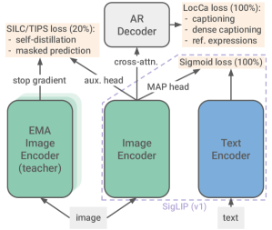
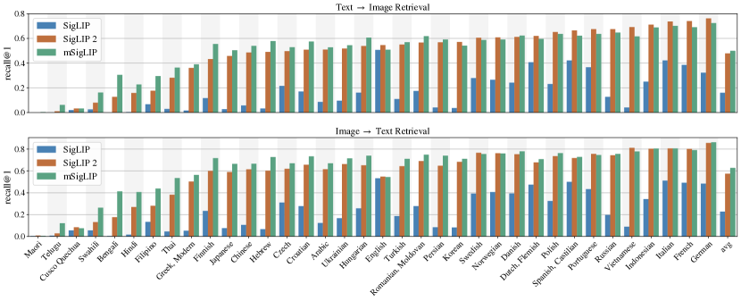
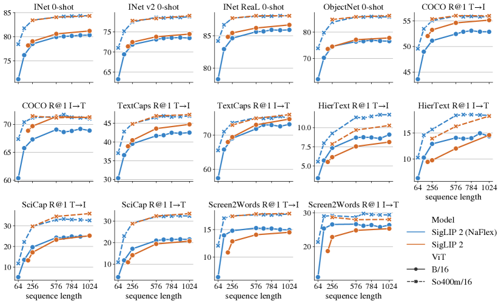
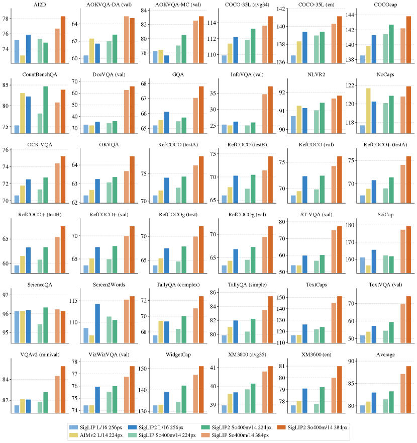
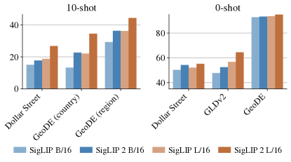
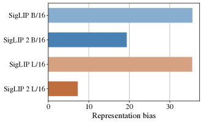

# SigLIP 2: 意味理解・位置特定・dense 特徴量を改善した多言語視覚-言語エンコーダ

> 原題: SigLIP 2: Multilingual Vision-Language Encoders with Improved Semantic Understanding, Localization, and Dense Features
> arXiv: 2502.14786
> 著者: Michael Tschannen, Alexey Gritsenko, Xiao Wang, Muhammad Ferjad Naeem, Ibrahim Alabdulmohsin, Nikhil Parthasarathy, Talfan Evans, Lucas Beyer, Ye Xia, Basil Mustafa, Olivier Hénaff, Jeremiah Harmsen, Andreas Steiner, Xiaohua Zhai（Google DeepMind ほか）
> 出典: arXiv 2502.14786, 2025

## Abstract（要旨）

我々は SigLIP 2 を導入する。これは初版 SigLIP の成功の上に構築された、新しい多言語視覚-言語エンコーダのファミリーである。

この第 2 イテレーションでは、初版の画像-テキスト訓練目的を、いくつかの先行する独立に開発された技法と統一されたレシピへと拡張する。これにはキャプション生成ベースの事前学習、自己教師あり損失（自己蒸留、マスク予測）、オンラインデータキュレーションが含まれる。

これらの変更により、SigLIP 2 モデルは、ゼロショット分類、画像-テキスト検索、視覚-言語モデル（VLM）のための視覚表現抽出という中核能力において、すべてのモデルスケールで SigLIP の対応モデルを上回る。

さらに、この新しい訓練レシピは、位置特定タスクと dense 予測タスクにおいて顕著な改善をもたらす。

我々はまた、複数解像度をサポートし入力の native アスペクト比を保持するバリアントも訓練する。

最後に、de-bias 化技法を含むより多様なデータ混合で訓練することで、多言語理解とフェアネスが大幅に向上する。

ユーザーが推論コストと性能のトレードオフを取れるよう、ViT-B（86M）、L（303M）、So400m（400M）、g（1B）の 4 つのサイズでモデルチェックポイントを公開する。

## 1. Introduction（はじめに）

CLIP [^50] と ALIGN [^28] が切り拓いた、十億スケールのデータセットで訓練された対比的（contrastive）画像-テキスト埋め込みモデルは、視覚データの高レベル・意味的理解のための主流アプローチとなった。

これらのモデルは、教師あり手法に匹敵する品質で細粒度なゼロショット分類を可能にし、効率的なテキスト→画像／画像→テキスト検索を実現する。

さらに、大規模言語モデル（Large Language Models, LLMs）と組み合わせて視覚-言語モデル（Vision-Language Models, VLMs）を構築すると、優れた視覚-言語理解能力を発揮する。

CLIP の成功に発展する形で、いくつかの改善が提案されてきた。たとえば、画像の再キャプション化（re-captioning）[^38]、画像のみの自己教師あり損失の追加 [^45][^38]、キャプション生成や位置特定などの補助タスクのための小型 decoder との同時訓練 [^67][^32][^62] などである。

同時に、いくつかのグループがオープンソースコミュニティ向けにモデルチェックポイントを公開してきた [^50][^70][^27][^57][^19]。しかし、これらの公開モデルは、CLIP の元のアプローチに比較的近いままで、最新の改善の全範囲を単一モデルに組み込んではいない。

ここでは、SigLIP の訓練レシピ [^71] を土台に、先行研究からの複数の改善を取り入れ、新しいオープンモデルファミリー[^1] を公開する。これは CLIP の中核能力（ゼロショット分類、検索、VLM 向けの特徴抽出）で優れた性能を発揮しつつ、vanilla CLIP スタイルのモデルが遅れを取る領域（位置特定や dense で意味的な表現の抽出）も改善する。

要約すると、SigLIP 2 モデルは以下を提供する：

- **強力な多言語視覚-言語エンコーダ**: SigLIP 2 は英語中心の視覚-言語タスクで優れた性能を発揮しつつ、単一モデルで多言語ベンチマークでも強い結果を出す。これにより、幅広い言語と文化的文脈での利用が可能になる。
- **Dense 特徴量**: 自己教師あり損失および decoder ベースの損失を組み込むことで、より良い dense 特徴量（例: セグメンテーションや深度推定向け）と、位置特定タスク（例: 参照表現理解, referring expression comprehension）の改善を実現する。
- **後方互換性**: SigLIP 2 は同じアーキテクチャに依拠することで、SigLIP との後方互換性を持つように設計されている。これにより、既存ユーザーはモデル重みとトークナイザ（現在は多言語版）を単純に差し替えるだけで、幅広いタスクで改善を得られる。
- **Native アスペクト比と可変解像度**: SigLIP 2 はまた NaFlex バリアントを含み、これは複数解像度をサポートし、native 画像アスペクト比を保持する。これらのモデルは、文書理解のような アスペクト感度の高い応用を改善する可能性を持つ。
- **強力な小型モデル**: SigLIP 2 は、active なデータキュレーションを介した蒸留技法を用いることで、小型モデル（B/16 と B/32 モデル）の性能をさらに最適化する。

次節では、SigLIP 2 の訓練レシピの詳細を述べる。第 3 節では、SigLIP 2 モデルとベースラインを多様なタスクとベンチマークで評価する。最後に第 4 節で関連研究の短い概観を、第 5 節で結論を述べる。

<figure>

<figcaption>図1: SigLIP 2 は、SigLIP の sigmoid 損失に対し、LocCa [62] からのキャプション生成ベースの事前学習、SILC [45] と TIPS [38] からの自己蒸留・マスク予測（訓練の最後の 20% で）を加える。一部のバリアントでは、レシピにさらに、データキュレーション [61] によるファインチューニング、または native アスペクト比・可変系列長 [6][12] への適応も含まれる。</figcaption>
</figure>

## 2. Training recipe（訓練レシピ）

我々は、初版 SigLIP の訓練レシピ [^71] を、decoder ベースの事前学習 [^60][^62] に加えて、DINO 系統の研究 [^9][^47] のような自己蒸留とマスク予測と組み合わせる（概観は図 1 を参照）。

画像エンコーダを言語 decoder とともにキャプション生成と参照表現理解で事前学習すると、OCR 能力と位置特定が改善することが示されており [^62]、自己蒸留とマスク予測は dense 予測タスク、ゼロショット分類、検索のためのより良い特徴量をもたらす [^45][^38]。

これらすべての技法を 1 つの run に組み合わせるのではなく、SigLIP 訓練と比較した計算とメモリのオーバーヘッドを管理するために、以下に概説する段階的アプローチを採る。

複数の解像度に適応するために各モデルを個別にアスペクト比を歪めて訓練することに加え、NaViT [^12] のように画像の native アスペクト比をほぼ保持して処理し、FlexiViT [^6] のように異なる系列長をサポートするバリアントも訓練する。このバリアントを NaFlex と呼び、§2.4.2 で詳述する。

最後に、最小モデルの品質を改善するために、[^61] のアプローチに従い、能動的サンプル選択による暗黙的蒸留でファインチューニングを行う。

### 2.1 Architecture, training data, optimizer（アーキテクチャ・訓練データ・最適化器）

アーキテクチャに関しては、既存ユーザーがエンコーダ重みを単純に差し替えられるよう、SigLIP [^71] に従う。

具体的には、固定解像度バリアントは学習済み位置埋め込みを持つ標準 ViT アーキテクチャ [^15] に依拠する。

画像 tower とテキスト tower で同じアーキテクチャを使うが、g サイズの視覚エンコーダだけは So400m サイズ [^1] のテキストエンコーダとペアになる。

視覚表現とテキスト表現は MAP ヘッド（attention pooling）[^69] でプールする。

テキスト長は 64 に設定し、語彙サイズ 256k の多言語 Gemma トークナイザ [^22] を使用し、トークン化前にテキストを小文字化する。

我々は WebLI データセット [^10] を使用する。これは 109 言語をカバーする 100 億画像と 120 億 alt-text を含む。

英語と多言語の視覚-言語ベンチマーク両方で良いバランスを取るため、訓練画像-テキスト対の 90% を英語 Web ページから、残り 10% を非英語 Web ページから sourcing するよう混合を構成する。これは [^49] の推奨に従う。

さらに、機微属性に関する表現と関連性のデータバイアスを軽減するため、[^2] のフィルタリング技法を適用する。

特に断らない限り、学習率 $10^{-3}$、decoupled weight decay $10^{-4}$ [^37]、ノルム 1 への勾配クリッピングで Adam 最適化器を使用する。バッチサイズは 32k、20k ステップの warmup を持つ cosine スケジュールを使い、合計 400 億サンプル分訓練する。

モデルは最大 2048 個の TPUv5e チップ [^24] で、fully-sharded data-parallel 戦略（FSDP [^72]）を用いて訓練する。

### 2.2 Training with Sigmoid loss and decoder（Sigmoid 損失と decoder による訓練）

事前学習の第 1 段階では、SigLIP [^71] と LocCa [^62] を、2 つの損失を等しい重みで単純に組み合わせる。

CLIP [^50] が対比損失（contrastive loss）に依拠するのと異なり、SigLIP はミニバッチ内のすべての画像埋め込みをすべてのテキスト埋め込みと組み合わせて二値分類問題を作り、ロジスティック回帰（sigmoid 損失）でマッチング／非マッチングペアを分類するよう埋め込みを訓練する。

元の実装を使用し、詳細は [^71] を参照する。

LocCa については、pool 前の視覚エンコーダ表現（MAP ヘッド適用前）に cross-attention で標準的な transformer decoder を取り付ける。

Decoder はテキストエンコーダの形状に従うが、cross-attention 層を追加し、層数を半分にする。

画像キャプション生成に加え、LocCa は **automatic referring expression prediction**（自動的な参照表現予測）と **grounded captioning**（接地キャプション生成）でも訓練される。前者は特定画像領域を記述するキャプションに対するバウンディングボックス座標の予測に該当し、後者はバウンディングボックス座標が与えられたときの領域固有キャプションの予測を含む。

領域-キャプション対は、最初に alt-text から n-gram を抽出し、次に [^41] のレシピでオープン語彙検出を適用することで自動的に注釈される。

加えて、n-gram の代わりに [^10] の固定オブジェクトカテゴリセットを使う。

各サンプルについて、decoder は 3 つの予測対象すべてを予測するよう訓練される（3 回の decoder forward パスに相当）。

キャプション生成の対象は、確率 50% で **parallel prediction** [^60]（並列予測）で予測される。すなわち、すべてのキャプショントークンは causal attention マスクなしに、mask トークンから並列に予測される。

詳細は [^62] を参照されたい。

最後に、大語彙によるメモリ消費を減らすため、decoder 損失の chunked 版を実装する。

すべてのモデルサイズについて、視覚エンコーダのパッチサイズを 16 に、画像解像度を 256 に設定する（画像表現系列長は 256 となる）。

最後に、decoder はここでは表現学習のためだけに用いられ、モデルリリースの一部ではない点に注意する。

### 2.3 Training with self-distillation and masked prediction（自己蒸留とマスク予測による訓練）

SILC [^45] と TIPS [^38] に従い、§2.2 で述べた訓練セットアップを **local-to-global correspondence learning**（局所-大域対応学習）に自己蒸留とマスク予測損失 [^9][^75][^47] を加えて拡張し、（pool 前の）特徴表現の局所的意味性を改善する。

この表現は通常、セグメンテーションや深度推定など dense 予測タスクに使用される。

具体的には、§2.2 で述べた損失に次の 2 項を追加する。

**第 1 項** は、[^45] の local-to-global 一貫性損失である。ここでは視覚エンコーダが student ネットワークとなり、訓練画像の部分的（局所的）ビューを受け取り、全画像から導出された teacher の表現にマッチするよう訓練される。

この補助的マッチングタスクは、別個の MLP ヘッドで計算される高次元特徴空間で実行される。

文献で一般的なように、teacher のパラメータは student パラメータの過去イテレーションでの指数移動平均（EMA）として得られる。

我々は単一の global（teacher）ビューと 8 個の local（student）ビューに依拠し、それ以外は [^45] の augmentation、損失、ハイパーパラメータに従う。

**第 2 項** は [^38] のマスク予測目的である。student ネットワークで埋め込まれた画像パッチの 50% を mask トークンで置き換え、マスクされた位置で teacher の特徴量にマッチするよう student を訓練する。

損失は第 1 項（一貫性損失）と同様に定義されるが、pool された画像レベル表現ではなくパッチごとの特徴量に適用される。

さらに、student と teacher は同じ global ビューを見る（student ではマスキングを除く）。

我々は訓練完了の 80% でこれらの損失を追加し、teacher を student パラメータで初期化し、残りの追加パラメータ（ヘッド、mask トークン、対応する最適化器パラメータ）をランダム初期化する。

前節からの SigLIP と LocCa の損失計算には元の画像を使い、追加損失は追加 augmentation されたビューに適用する。

これは、[^45] が推奨するように、データ augmentation が画像-テキストアラインメントに悪影響を与えないようにするためである。

第 1 項と第 2 項の重みはそれぞれ 1 と 0.25 に設定する。

さらに、global／意味的タスクと dense タスクでモデル品質のバランスを取るため、B、L、So400m、g モデルサイズに対し、これら 2 項をさらに 0.25、0.5、1.0、0.5 の係数で再重み付けする。

### 2.4 Adaptation to different resolutions（異なる解像度への適応）

**表1**: SigLIP 2 と複数ベースラインのゼロショット分類・10-shot 分類（検証セット上）・検索性能（recall@1）。SigLIP 2 は多言語であるにもかかわらず、しばしば大きなマージンでベースラインを上回る。DFN [^19] は ImageNet, COCO, Flickr でファインチューンされたデータフィルタリングネットワークに依拠する点に注意。

| ViT | Res. | Seq. | Model | IN-1k val | IN-1k v2 | IN-1k ReaL | IN-1k ObjNet | IN-1k 10s | COCO T→I | COCO I→T | Flickr T→I | Flickr I→T | XM3600 T→I | XM3600 I→T |
|---|---|---|---|---|---|---|---|---|---|---|---|---|---|---|
| B/32 | 224 | 49 | MetaCLIP [^66] | 67.7 | 59.6 | – | 52.8 | – | 46.6 | – | 72.9 | – | – | – |
| B/32 | 256 | 64 | OpenCLIP [^27] | 72.8 | 64.8 | – | 59.6 | – | 39.9 | 57.9 | 64.9 | 84.8 | – | – |
| B/32 | 256 | 64 | **SigLIP 2** | **74.0** | **66.9** | **81.4** | **66.1** | **66.6** | **47.2** | **63.7** | **75.5** | **89.3** | **38.3** | **49.0** |
| B/16 | 224 | 196 | CLIP [^50] | 68.3 | 61.9 | – | 55.3 | – | 33.1 | 52.4 | 62.1 | 81.9 | – | – |
| B/16 | 224 | 196 | OpenCLIP [^27] | 70.2 | 62.3 | – | 56.0 | – | 42.3 | 59.4 | 69.8 | 86.3 | – | – |
| B/16 | 224 | 196 | MetaCLIP [^66] | 72.4 | 65.1 | – | 60.0 | – | 48.9 | – | 77.1 | – | – | – |
| B/16 | 224 | 196 | EVA-CLIP [^57] | 74.7 | 67.0 | – | 62.3 | – | 42.2 | 58.7 | 71.2 | 85.7 | – | – |
| B/16 | 224 | 196 | SigLIP [^71] | 76.2 | 69.5 | 82.8 | 70.7 | 69.9 | 47.2 | 64.5 | 77.9 | 89.6 | 22.4 | 29.3 |
| B/16 | 224 | 196 | DFN [^19] | 76.2 | 68.2 | – | 63.2 | – | 51.9 | – | 77.3 | – | – | – |
| B/16 | 224 | 196 | **SigLIP 2** | **78.2** | **71.4** | **84.8** | **73.6** | **72.1** | **52.1** | **68.9** | **80.7** | **93.0** | **40.3** | **50.7** |
| B/16 | 256 | 256 | SigLIP [^71] | 76.7 | 70.1 | 83.1 | 71.3 | 70.3 | 47.4 | 65.1 | 78.3 | 91.1 | 22.5 | 29.9 |
| B/16 | 256 | 256 | **SigLIP 2** | **79.1** | **72.5** | **85.4** | **74.5** | **73.1** | **53.2** | **69.7** | **81.7** | **94.4** | **40.7** | **51.0** |
| B/16 | 384 | 576 | SigLIP [^71] | 78.6 | 72.0 | 84.6 | 73.8 | 72.7 | 49.7 | 67.5 | 80.7 | 92.2 | 23.3 | 30.3 |
| B/16 | 384 | 576 | **SigLIP 2** | **80.6** | **73.8** | **86.2** | **77.1** | **74.7** | **54.6** | **71.4** | **83.8** | **94.9** | **41.2** | **51.6** |
| B/16 | 512 | 1024 | SigLIP [^71] | 79.2 | 72.9 | 84.9 | 74.8 | 73.3 | 50.4 | 67.6 | 81.6 | 92.5 | 23.5 | 30.5 |
| B/16 | 512 | 1024 | **SigLIP 2** | **81.2** | **74.5** | **86.7** | **77.8** | **75.2** | **55.2** | **71.2** | **84.5** | **95.5** | **41.4** | **52.0** |
| L/14 | 224 | 256 | OpenCLIP [^27] | 74.0 | 61.1 | – | 66.4 | – | 46.1 | 62.1 | 75.0 | 88.7 | – | – |
| L/14 | 224 | 256 | CLIP [^50] | 75.5 | 69.0 | – | 69.9 | – | 36.5 | 56.3 | 65.2 | 85.2 | – | – |
| L/14 | 224 | 256 | MetaCLIP [^66] | 79.2 | 72.6 | – | 74.6 | – | 55.7 | – | 83.3 | – | – | – |
| L/14 | 224 | 256 | CLIPA-v2 [^33] | 79.7 | 72.8 | – | 71.1 | – | 46.3 | 64.1 | 73.0 | 89.1 | – | – |
| L/14 | 224 | 256 | EVA-CLIP [^57] | 79.8 | 72.9 | – | 75.3 | – | 47.5 | 63.7 | 77.3 | 89.7 | – | – |
| L/14 | 224 | 256 | DFN [^19] | 82.2 | 75.7 | – | 74.8 | – | 59.6 | – | 84.7 | – | – | – |
| L/16 | 256 | 256 | SigLIP [^71] | 80.5 | 74.2 | 85.9 | 77.9 | 76.8 | 51.2 | 69.6 | 81.3 | 92.0 | 30.9 | 40.1 |
| L/16 | 256 | 256 | **SigLIP 2** | **82.5** | **76.8** | **87.3** | **83.0** | **78.8** | **54.7** | **71.5** | **84.1** | **94.5** | **46.5** | **56.5** |
| L/16 | 384 | 576 | SigLIP [^71] | 82.1 | 75.9 | 87.1 | 80.9 | 78.7 | 52.8 | 70.5 | 82.6 | 92.9 | 31.4 | 39.7 |
| L/16 | 384 | 576 | **SigLIP 2** | **83.1** | **77.4** | **87.6** | **84.4** | **79.5** | **55.3** | **71.4** | **85.0** | **95.2** | **47.1** | **56.3** |
| L/16 | 512 | 1024 | **SigLIP 2** | **83.5** | **77.8** | **87.7** | **84.6** | **79.6** | **55.2** | **72.1** | **85.3** | **95.8** | **47.4** | **56.7** |
| So/14 | 224 | 256 | SigLIP [^71] | 82.2 | 76.0 | 87.1 | 80.5 | 78.2 | 50.8 | 69.0 | 76.6 | 90.7 | 16.0 | 22.8 |
| So/14 | 224 | 256 | **SigLIP 2** | **83.2** | **77.7** | **87.8** | **84.6** | **79.5** | **55.1** | **71.5** | **84.3** | **94.6** | **47.9** | **57.5** |
| So/14 | 384 | 729 | SigLIP [^71] | 83.2 | 77.1 | 87.5 | 82.9 | 79.4 | 52.0 | 70.2 | 80.5 | 93.5 | 17.8 | 26.6 |
| So/14 | 384 | 729 | **SigLIP 2** | **84.1** | **78.7** | **88.1** | **86.0** | **80.4** | **55.8** | **71.7** | **85.7** | **94.9** | **48.4** | **57.5** |
| So/16 | 256 | 256 | mSigLIP [^71] | 80.8 | 74.1 | 86.1 | 79.5 | 77.1 | 49.4 | 68.6 | 80.0 | 92.1 | 50.0 | 62.8 |
| So/16 | 256 | 256 | **SigLIP 2** | **83.4** | **77.8** | **87.7** | **84.8** | **79.7** | **55.4** | **71.5** | **84.4** | **94.2** | **48.1** | **57.5** |
| So/16 | 384 | 576 | **SigLIP 2** | **84.1** | **78.4** | **88.1** | **85.8** | **80.4** | **56.0** | **71.2** | **85.3** | **95.9** | **48.3** | **57.5** |
| So/16 | 512 | 1024 | **SigLIP 2** | **84.3** | **79.1** | **88.1** | **86.2** | **80.5** | **56.0** | **71.3** | **85.5** | **95.4** | **48.3** | **57.6** |
| H/14 | 224 | 256 | MetaCLIP [^66] | 80.5 | 74.1 | – | 76.5 | – | 57.5 | – | 85.0 | – | – | – |
| H/14 | 224 | 256 | DFN [^19] | 83.4 | 77.3 | – | 76.5 | – | 63.1 | – | 86.5 | – | – | – |
| g/16 | 256 | 256 | **SigLIP 2** | **84.5** | **79.2** | **88.3** | **87.1** | **82.1** | **55.7** | **72.5** | **85.3** | **95.3** | **48.2** | **58.2** |
| g/16 | 384 | 576 | **SigLIP 2** | **85.0** | **79.8** | **88.5** | **88.0** | **82.5** | **56.1** | **72.8** | **86.0** | **95.4** | **48.6** | **57.9** |

#### 2.4.1 Fixed-resolution variant（固定解像度バリアント）

複数解像度の固定解像度チェックポイントを得るため、訓練の 95% で（系列長 256・パッチサイズ 16 の）チェックポイントを resume し、位置埋め込みを目標系列長にリサイズし（一部のケースでは [^6] の擬似逆行列（PI）-resize 戦略でパッチ埋め込みをパッチサイズ 16 から 14 にリサイズ）、すべての損失を持つ状態で目標解像度で訓練を再開する。

このアプローチを選んだのは、最終チェックポイントを小さな学習率と weight decay なしでファインチューンするという一般的戦略 [^71] が、すべてのサイズと解像度で良い結果をもたらさなかったためである。

#### 2.4.2 Variable aspect and resolution (NaFlex)（可変アスペクト比と解像度: NaFlex）

<figure>

<figcaption>図2: Crossmodal-3600 [58] における言語別の画像-テキスト検索性能（SigLIP, SigLIP 2, mSigLIP）。SigLIP 2 は、英語の視覚-言語タスクで実質的により良い性能を示しつつ（表1）、mSigLIP（多言語データで訓練された SigLIP）の性能にほぼ匹敵する。</figcaption>
</figure>

NaFlex は FlexiViT [^6] のアイデア（単一 ViT モデルで複数の事前定義された系列長をサポート）と NaViT [^12] のアイデア（画像をその native アスペクト比で処理）を組み合わせる。

これにより、異なるタイプの画像を適切な解像度で処理できる。例えば、より大きな解像度で文書画像を処理しつつ、特定の推論タスク（例: OCR）でのアスペクト比歪みの影響を最小化する。

パッチサイズと目標系列長が与えられたとき、NaFlex は最初に入力画像をリサイズすることでデータを前処理する。リサイズ後の高さと幅はパッチサイズの倍数となり、(1) アスペクト比歪みをできるだけ小さく保ち、(2) 高々目標系列長の系列を生成する。

幅と高さの結果として生じる歪みは、それぞれ高々 (patch_size-1)/width および (patch_size-1)/height となり、一般的な解像度とアスペクト比では小さくなる傾向にある。

NaViT も同じタイプの歪みを引き起こすことに注意。

リサイズ後、画像はパッチの系列に分割され、パッチ座標とパディング情報を持つマスク（実際の系列長が目標長より小さい場合を扱うため）が追加される。

ViT で異なる系列長（およびアスペクト比）を処理するため、学習済み位置埋め込みをリサイズされた入力画像の目標・非正方パッチ格子へ bilinear リサイズ（anti-aliasing 付き）する。

学習済み位置埋め込みの長さは 256 に設定し、リサイズ前の 16×16 パッチ格子を仮定する。

リサイズ後の系列長が目標系列長より小さい場合、attention 層（MAP ヘッドを含む）は余分なパディングトークンを無視するようにマスクされる。

固定解像度の適応バリアントと同様、§2.2 で述べたセットアップで訓練されたデフォルトチェックポイント、すなわちアスペクト比を保持しない 256px へのリサイズで系列長 256 になるものから開始する。

訓練完了の 90% でチェックポイントを取り、アスペクト比保持リサイズに切り替え、ミニバッチごとに $\{128, 256, 576, 784, 1024\}$ から系列長を一様にサンプリングする。

同時に、最後の 10% に対応する学習率スケジュールを 3.75 倍に引き伸ばし、各解像度が十分多くのサンプルで訓練されるようにする。

最大の系列長については、out-of-memory エラーを避けるためバッチサイズを半分にし、訓練ステップ数を倍にする。

実装と計算の複雑さを管理可能に保つため、§2.3 の自己蒸留とマスク予測は適用しない。

<figure>

<figcaption>図3: NaFlex（モデルサイズあたり単一チェックポイントで native アスペクト比と可変系列長／解像度をサポート）と、各系列長／解像度に別チェックポイントを使う標準の正方形入力 SigLIP 2 バリアントの比較。x 軸に注釈された系列長は、NaFlex の訓練時系列長に対応する。NaFlex は訓練解像度間でかなりうまく補間するが、外挿はうまくいかない（図示なし）。</figcaption>
</figure>

### 2.5 Distillation via active data curation（能動的データキュレーションによる蒸留）

最小の固定解像度モデル（ViT-B/16 と ViT-B/32）の性能を最大化するため、短いファインチューニング段階で teacher（reference）モデルから知識を蒸留する。

学習率を $10^{-5}$ に下げ、weight decay を除去し、これらのモデルを画像-テキスト sigmoid 損失のみを使って追加で 40 億サンプル分訓練する。

この段階では、[^61] で提案された **ACID** 法を使って暗黙的な「データを通じた蒸留」を行う。

簡潔に述べると、各訓練ステップで teacher モデルと現在の learner モデルを使ってサンプルを「学習可能性（learnability）」[^42] でスコアリングする。

これらのスコアは、より大きな super-batch [^16] からサイズ 32k の最適なバッチを共同選択するために使われる。

ここでは、キュレーションによる gain と訓練計算コストのバランスを取るため、フィルタリング比 0.5（すなわち super-batch サイズ 64k）でデータを選択する。

B/32 モデルについては、フィルタリング比 0.75 が追加コストに見合う価値があると分かった。

[^61] の著者らは、より多様なデータで訓練された第 2 の teacher を使った明示的 softmax 蒸留と ACID を組み合わせた **ACED** 法で最高の性能が得られると示唆している。

しかし、ここでは、明示的蒸留なしに ACID をこれらの利点を捉えるよう適応させる方法を提案し、計算量を大幅に節約する。

具体的には、2 つの別個の teacher モデルを利用する代わりに、多様なデータで訓練された単一の強力な teacher（この場合、SigLIP 2 So400m モデル）を取り、[^16] の高品質キュレーションデータセットで 10 億サンプル分ファインチューンする。

そしてこのファインチューンされた teacher を上述のように ACID 法で使用する。

この teacher は事前学習からの概念に関する多様な知識と（キュレーションデータセットからの）高品質性についての知識を融合しているため、ACID の暗黙的蒸留だけで ACED の利点を回復するのに十分である。

<figure>

<figcaption>図4: 凍結視覚エンコーダで Gemma 2 LLM を 5000 万ステップ訓練（PaliGemma [7] stage 1）した後、VLM を個別データセットでファインチューン（PaliGemma stage 3）した結果の異なる視覚エンコーダ比較。SigLIP 2 は、異なるモデルサイズと解像度で、SigLIP と AIMv2 [20] より良い性能を示す。表 6 と同じデータ。</figcaption>
</figure>

## 3. Experiments and results（実験と結果）

### 3.1 Zero-shot classification and retrieval（ゼロショット分類と検索）

表 1 で、一般的なゼロショット分類（ImageNet [^13], ObjectNet [^4], ImageNet-v2 [^53], ImageNet ReaL [^5]）と画像-テキスト検索ベンチマークでの SigLIP 2 とベースラインの性能を報告する。

SigLIP 2 は SigLIP や他の（オープン重み）ベースラインに対し、全面的により良い性能を発揮する。これは、ベースライン（mSigLIP [^71] を除く）と異なり多くの言語をサポートしているにもかかわらずである。

これらのベンチマークで SigLIP 2 に最も近い性能を示す DFN [^19] は、データ品質改善のためのフィルタとして ImageNet, COCO, Flickr（表 1 の主要ベンチマーク）でファインチューンされたネットワークを使用している点に注意。

SigLIP 2 のベースラインに対する改善は、§2.5 の蒸留により B サイズモデルで特に顕著である。

さらに、画像解像度とモデルサイズの関数として、一般的なスケーリング傾向も観察される。

表 1 と図 2 はさらに、36 言語をカバーする Crossmodal-3600（XM3600）[^58] での多言語検索性能を示す。

SigLIP 2 の recall は SigLIP のそれを大きなマージンで超える一方、mSigLIP に対しては僅かに遅れるだけである。一方 mSigLIP は、英語中心のベンチマークで SigLIP と SigLIP 2 より実質的に劣る性能を示す。

**表2**: 一連の dense 予測タスクに対する凍結 SigLIP 2 表現のプロービング（指標—セグメンテーション: mIoU; 深度: RMSE; 法線: 角度 RMSE）。SigLIP 2 は他の人気あるオープン重みモデルをしばしば顕著なマージンで上回る。

| Model | ViT | Res. | PASCAL Seg | ADE20k Seg | NYUv2 Depth | NAVI Depth | NYUv2 Normals | NAVI Normals |
|---|---|---|---|---|---|---|---|---|
| CLIP [^50] | L/14 | 224 | 74.5 | 39.0 | 0.553 | 0.073 | 24.3 | 25.5 |
| OpenCLIP [^27] | G/14 | 224 | 71.4 | 39.3 | 0.541 | – | – | – |
| SigLIP [^71] | So/14 | 224 | 72.0 | 37.6 | 0.576 | 0.083 | 25.9 | 26.0 |
| **SigLIP 2** | So/14 | 224 | **77.1** | **41.8** | **0.493** | **0.067** | **24.9** | **25.4** |
| SigLIP [^71] | So/14 | 384 | 73.8 | 40.8 | 0.563 | 0.069 | 24.1 | 25.4 |
| **SigLIP 2** | So/14 | 384 | **78.1** | **45.4** | **0.466** | **0.064** | **23.0** | **25.0** |

#### 3.1.1 NaFlex variant（NaFlex バリアント）

図 3 は、系列長の関数として、固定解像度・正方アスペクト比（標準）SigLIP 2 と、アスペクト比保持 NaFlex バリアント（すべての系列長で 1 つのチェックポイント）を比較する。

前節の検索ベンチマークに加え、TextCaps [^55], HierText [^36], SciCap [^26], Screen2Words [^63] という OCR／文書／スクリーンに焦点を当てた画像-テキストベンチマーク群を追加する。

NaFlex バリアントは、これらの検索ベンチマークの大部分で、特にアスペクト比歪みの影響を受けやすい小さな系列長（と対応する解像度）で、標準バリアントを上回る。

主に自然画像に基づくベンチマークでは、標準 B サイズバリアントが NaFlex を上回る。これは蒸留ステップのおかげと思われる。一方 So400m アーキテクチャでは両者は同等である。

これは注目に値する。標準バリアントは §2.3 の自己蒸留段階の恩恵も受けているにもかかわらずである。

### 3.2 SigLIP 2 as a vision encoder for VLMs（VLM のための視覚エンコーダとしての SigLIP 2）

CLIP や SigLIP のような視覚エンコーダの人気ある用途は、VLM のための視覚表現抽出である [^3][^32][^48][^35][^7][^39][^59]。

一般的なパラダイムは、事前学習済み視覚エンコーダと事前学習済み LLM を組み合わせ、視覚-言語タスクの豊富な混合に対してマルチモーダル訓練を行う。

この応用での SigLIP 2 の性能を評価するため、PaliGemma 2 [^56] と類似のレシピを開発する。

具体的には、SigLIP 2 視覚エンコーダとベースラインを Gemma 2 2B LLM [^23] と組み合わせ、[^7][^56] の Stage 1 訓練混合の 5000 万サンプル分で LLM を訓練する。これにはキャプション生成、OCR、grounded captioning、視覚的質問応答、検出、インスタンスセグメンテーションが含まれる（最後の 4 タスクの注釈は機械生成、詳細は [^7] を参照）。

視覚エンコーダは凍結したまま（これは品質に本質的に影響しない [^7]）、典型的なオープンモデル用途を反映するよう訓練期間を短縮する。

結果として得られた VLM を、[^56] の transfer 設定で幅広い下流タスクでファインチューンする。

入力解像度の影響を理解するため、解像度 224 または 256（パッチサイズ 14 と 16 のモデルでそれぞれ 256 個の画像トークンを抽出）および 384px で実験を行う。ただし [^7][^56] と異なり、224px バリアントから開始するのではなく 384px で stage 1 を繰り返す。

図 4 は各データセットでのファインチューン後の結果を示す。

全体として、SigLIP 2 は解像度とモデルサイズに渡って SigLIP を明確に上回る。

L サイズ視覚エンコーダでは、SigLIP 2 は最近公開された AIMv2 モデル [^20] も上回る。

図 4 のデータは表 6 にもある。

**表3**: Cat-Seg [^11] を使い、[^45] と同様にいくつかのモデルのオープン語彙セグメンテーション性能（mIoU）を比較する。SigLIP 2 が同等および更に大きなモデルに対しても respectable な改善を提供することを観察する。

| Model | ViT | A-847 | PC-459 | A-150 | PC-59 | VOC-20 | VOC-21 |
| --- | --- | --- | --- | --- | --- | --- | --- |
| CLIP [^50] | L/16 | 10.8 | 20.4 | 31.5 | 62.0 | 96.6 | 81.8 |
| OpenCLIP [^27] | G/14 | 13.3 | 21.4 | 36.2 | 61.5 | 97.1 | 81.4 |
| SigLIP [^71] | L/16 | 14.0 | 23.9 | 37.5 | 61.6 | 96.1 | 81.1 |
| **SigLIP 2** | L/16 | **14.3** | **24.1** | **38.8** | **62.4** | **97.0** | **82.3** |

### 3.3 Dense prediction tasks（Dense 予測タスク）

#### 3.3.1 Semantic segmentation, depth estimation, surface normal estimation（意味的セグメンテーション・深度推定・表面法線推定）

[^38] の評価プロトコルを採用し、凍結 SigLIP 2 表現を、線形層または DPT decoder [^52] で、意味的セグメンテーション・単眼深度推定・表面法線推定にまたがる 6 つのベンチマークでプロービングする（プロトコルとハイパーパラメータの詳細は [^38] を参照）。

なお、ここでは 1 つの（必要な）変更を加える。元の方法では CLS トークンを各パッチ特徴ベクトルに連結するが、CLS トークンの代わりに MAP ヘッドを使うので、代わりに MAP ヘッドの出力埋め込みを連結する。

表 2 の結果は、SigLIP 2 が SigLIP を含むいくつかの先行する CLIP スタイル視覚エンコーダを、しばしば顕著なマージンで上回ることを示している。

#### 3.3.2 Open-vocabulary segmentation（オープン語彙セグメンテーション）

オープン語彙セグメンテーションは、固定訓練語彙を超えた任意の新規クラスをセグメントできるモデルを開発することを目指す。

ここでは、このタスクでの SigLIP 2 の性能を評価する。

Cat-Seg [^11] をフレームワークとして使い、[^45] で提案されたように異なるモデル間で性能を比較する。

Cat-Seg を 172 クラスの COCO-Stuff-164k [^8] で訓練し、異なる語彙を持つ代表的データセットでテストする: 847 または 150 クラスの ADE20k [^74][^73]（A-847/A-150）、Pascal Context（PC-459/PC-59）[^43]、Pascal VOC（VOC-20/VOC-21）[^17]。

結果は表 3 にある。

SigLIP 2 at L/16 が SigLIP を改善し、さらに大きな OpenCLIP G/14 モデル [^27] も超えることを観察する。

### 3.4 Localization tasks（位置特定タスク）

#### 3.4.1 Referring expression comprehension（参照表現理解）

異なる RefCOCO バリアント [^29][^68] における SigLIP 2 の参照表現理解能力をプロービングするため、[^62] の評価プロトコルを適用する。

pool 前の凍結視覚エンコーダ表現に 6 層 transformer decoder を cross-attention で接続し、すべての RefCOCO バリアントの混合でスクラッチから訓練する（詳細は [^62] を参照）。

表 5 の結果は、SigLIP 2 が SigLIP および CLIP、画像キャプション化（Cap）による事前学習を、解像度とモデルサイズに渡って大きなマージンで上回ることを示している。

これは §2.2 で述べた decoder ベース事前学習に帰属できる。

SigLIP 2 は LocCa にのみ上回られるが、これは SigLIP 2 が多言語データで事前学習されているためかもしれない、と我々は仮説する。一方 LocCa は英語 Web サイトのテキストのみで訓練される。

最後に、LocCa で観察されたように事前学習からの decoder を使うと顕著な改善が期待できる点に注意。

#### 3.4.2 Open-vocabulary detection（オープン語彙検出）

OWL-ViT [^40] は CLIP スタイル視覚-言語モデルをオープン語彙検出に適応させる人気ある方法である。

ここでは、このアプローチを SigLIP と SigLIP 2 モデルに、[^40] のデータと最適化器構成に近く従って適用する。

表 4 の結果は、SigLIP 2 が COCO [^34] と LVIS [^25] という 2 つの人気あるベンチマークで SigLIP より良い性能を達成することを示している。

相対的改善は LVIS の rare カテゴリで最も顕著である。

さらに、ここでの結果は [^40] のものより良いが、これは [^40] が SigLIP ではなく CLIP を使ったためだろう。

### 3.5 Cultural diversity and fairness（文化的多様性と公平性）

SigLIP 2 のモデル品質の改善に加え、SigLIP 2 は 2 つの側面でより包摂的（inclusive）でもある。

第一に、[^49] の推奨に従い、英語と多言語データを含む訓練混合を利用して文化的多様性を高める。

第二に、訓練データの潜在的社会的バイアスに対処するため、[^2] のデータ de-bias 化技法を統合する。

これらの技法は、性別表現の格差のような一次統計のバイアスと、性別と職業の偏った関連のような二次統計のバイアスの両方を軽減するために適用される。

次に、評価結果を示す。

**表4**: OWL-ViT [^40] によりオープン語彙検出でファインチューンされた SigLIP と SigLIP 2。

| ViT | Model | COCO (AP) | LVIS (AP) | LVIS (APr) |
|---|---|---|---|---|
| B/16 | SigLIP | 42.2 | 33.0 | 31.0 |
| B/16 | **SigLIP 2** | **42.8** | **34.4** | **32.7** |
| So/14 | SigLIP | 44.3 | 39.5 | 40.9 |
| So/14 | **SigLIP 2** | **45.2** | **40.5** | **42.3** |

**表5**: SigLIP 2 モデルと、SigLIP および文献の他のベースラインを参照表現理解（Acc@0.5）で比較。マッチするモデルサイズと系列長（seq.）について、SigLIP 2 モデルは SigLIP モデルを実質的に上回る。SigLIP 2 は LocCa にのみ上回られるが、LocCa は同じ decoder ベース損失を使うものの、英語 Web サイトのキャプションのみで訓練される。

| ViT | Seq. | Model | RefCOCO val | RefCOCO testA | RefCOCO testB | RefCOCO+ val | RefCOCO+ testA | RefCOCO+ testB | RefCOCOg val-u | RefCOCOg test-u |
|---|---|---|---|---|---|---|---|---|---|---|
| B | 256 | SigLIP [^71] | 64.05 | 70.10 | 57.89 | 55.77 | 63.57 | 47.51 | 59.06 | 60.33 |
| B | 256 | **SigLIP 2** | **83.76** | **86.21** | **79.57** | **74.26** | **79.85** | **65.83** | **77.25** | **77.83** |
| B | 576 | SigLIP [^71] | 67.17 | 72.94 | 60.94 | 59.09 | 67.26 | 50.22 | 61.98 | 62.64 |
| B | 576 | **SigLIP 2** | **85.18** | **87.92** | **80.53** | **76.08** | **82.17** | **67.10** | **79.08** | **79.60** |
| L | 256 | Cap [^60] | 60.64 | 65.47 | 56.17 | 52.56 | 58.32 | 45.99 | 56.75 | 57.99 |
| L | 256 | CapPa [^60] | 64.17 | 69.90 | 58.25 | 56.14 | 63.68 | 48.18 | 58.90 | 59.91 |
| L | 256 | CLIP [^50] | 65.21 | 71.28 | 58.17 | 57.53 | 66.44 | 47.77 | 59.32 | 60.24 |
| L | 256 | SigLIP [^71] | 67.33 | 72.40 | 61.21 | 59.57 | 67.09 | 51.08 | 61.89 | 62.90 |
| L | 256 | **SigLIP 2** | **86.04** | **89.02** | **81.85** | **77.29** | **83.28** | **70.16** | **80.11** | **80.78** |
| L | 256 | LocCa [^62] | 88.34 | 91.20 | 85.10 | 79.39 | 85.13 | 72.61 | 81.69 | 82.64 |
| L | 576 | SigLIP [^71] | 70.76 | 76.32 | 63.79 | 63.38 | 71.48 | 54.65 | 64.73 | 65.74 |
| L | 576 | **SigLIP 2** | **87.28** | **90.29** | **82.85** | **79.00** | **85.00** | **70.92** | **81.84** | **82.15** |
| So | 256 | SigLIP [^71] | 64.68 | 71.23 | 58.40 | 57.43 | 66.06 | 49.38 | 59.66 | 60.88 |
| So | 256 | **SigLIP 2** | **86.42** | **89.41** | **82.48** | **77.81** | **84.36** | **70.67** | **80.83** | **81.27** |
| So | 729 | SigLIP [^71] | 67.66 | 74.12 | 62.36 | 60.74 | 69.73 | 52.12 | 62.61 | 63.24 |
| So | 729 | **SigLIP 2** | **87.88** | **91.13** | **83.59** | **80.06** | **86.30** | **72.66** | **82.68** | **83.63** |
| g | 256 | **SigLIP 2** | **87.31** | **90.24** | **83.25** | **79.25** | **85.23** | **71.60** | **81.48** | **82.14** |
| g | 576 | **SigLIP 2** | **88.45** | **91.53** | **84.95** | **80.44** | **87.09** | **73.53** | **83.12** | **84.14** |

#### Cultural Diversity（文化的多様性）

文化的多様性を評価するため、Dollar Street [^54], GeoDE [^51], Google Landmarks Dataset v2（GLDv2）[^65] を使用してゼロショット分類精度結果を報告する。

[^49] で提案された、Dollar Street と GeoDE での 10-shot 地理位置特定も含める。

Dollar Street でのゼロショット評価には、[^54] で概説された方法論を実装し、データセット内の 96 トピックを対応する ImageNet クラスにマッピングする。

このプロセスにより、分析のための 21K 画像のサブセットが得られる。

図 5 は代表的結果のセットを示す（完全な結果は Appendix C を参照）。

これらの指標で、同じモデルサイズと解像度の SigLIP と比較して SigLIP 2 で改善が観察され、改善は地理位置特定タスクで特に顕著である。

例えば、GeoDE（region）での 10-shot 地理位置特定精度は SigLIP L/16 at 256px で 36.2% から SigLIP 2 で 44.4% に改善する。

同様に、同じモデルでの Dollar Street での 0-shot 精度は 52.1% から 55.2% に改善する。

#### Fairness（公平性）

公平性に関しては、2 つの指標を報告する。

第一は [^2] で定義されている「representation bias（表現バイアス）」で、これはランダムなオブジェクト（例: 車）を特定の性別グループに関連付けるモデルの傾向を測る。

図 6 に示すように、SigLIP 2 は SigLIP より *顕著に* 良い。

例えば、SigLIP L/16 at 256px は約 35.5% の representation bias を持つ—つまり、ランダムな画像を「男性」と「女性」のいずれかと関連付ける際に、85.5% 以上の確率で男性を優先する—一方、同じサイズと解像度の SigLIP 2 はわずか 7.3% の representation bias を持つ。

加えて、[^2] の先行知見と一致して、より大きなモデルは小さなモデルより少ない representation bias を示す傾向にある。

我々はまた、[^49] のように Dollar Street の 0-shot 結果を所得水準別に、GeoDE の結果を地理的地域別に調査する。

しかし、この文脈では、マッチするサイズと解像度の SigLIP と SigLIP 2 モデルを比較したとき、ごく僅かな利点しか観察されないか、利点なしである（一部の結果は表 9 に示す）。

## 4. Related work（関連研究）

CLIP [^50] と ALIGN [^28] が普及させた対比的事前学習は、分類と検索で良い性能を発揮する高レベル・意味的・視覚表現を学習するための支配的アプローチとなり、VLM のための視覚エンコーダ [^3][^32][^48][^35][^7][^39][^59] および検出 [^40][^30][^41] とセグメンテーション [^14][^11] を含むオープン語彙タスクで使用されてきた。

元の CLIP リリースに加え、いくつかのプロジェクトがオープン重み対比モデルを公開してきた [^27][^57][^71][^33][^19][^66]。

高レベルでは、これらの研究は元の CLIP 手法に比較的近い訓練法に従い、主に [^71] が修正された損失関数を、[^19][^66] がデータ品質とフィルタリングを対象としている。

より一般に、対比訓練への多数の修正と改善が文献で提案されてきた。

[^21][^19][^66][^16][^61] はデータ品質改善のためのフィルタリング技法を研究している。

同様の動機から、[^18][^46][^31][^38] は訓練画像を VLM で再キャプション化し、キャプション品質と訓練信号の品質を改善する。

別の有望な領域は、損失関数の修正または拡張である。

[^44][^45][^38] は CLIP を自己教師あり損失と組み合わせる。

別の人気あるアプローチは、補助タスクとしてキャプション化で訓練するために言語 decoder を追加することである [^67][^32]。

スタンドアロンの表現学習タスクとしてのキャプション化は注目を集めていないが、対比訓練に競争力のある視覚表現を生み出すことができる [^64][^60][^62][^20]。

<figure>

<figcaption>図5: 地理的に多様なオブジェクト分類タスク（Dollar Street, GeoDE）、地理位置特定（GeoDE country/region）、ランドマーク位置特定（GLDv2）タスクでの 10-shot および 0-shot 精度。SigLIP 2 は SigLIP より一貫してより良い性能を発揮する（追加結果は表 8 を参照）。</figcaption>
</figure>

## 5. Conclusion（結論）

この研究では、SigLIP の成功の上に構築されたオープン重み多言語視覚-言語エンコーダのファミリーである SigLIP 2 を導入した。

decoder ベース事前学習、自己教師あり損失、能動的データキュレーションのような技法の組み合わせを取り入れることで、SigLIP 2 はゼロショット分類、VLM の視覚エンコーダとしての transfer 性能、位置特定と dense 予測タスクで顕著な改善を達成する。

さらに、多言語データでの訓練と de-bias 化フィルタの適用のおかげで、SigLIP 2 は文化的に多様なデータでよりバランスの取れた品質を達成する。

最後に、NaFlex バリアントにより、native 画像アスペクト比を保持しつつ、単一モデルチェックポイントで複数解像度をサポートできる。

我々の SigLIP 2 リリースが、オープンソースコミュニティ内で多くのエキサイティングな応用を可能にすることを願う。

<figure>

<figcaption>図6: 異なるモデルの representation bias（ランダムオブジェクトと性別の関連; 低いほど良い）。</figcaption>
</figure>

##### Acknowledgments（謝辞）

Josip Djolonga, Neil Houlsby, Andre Araujo, Kevis Maninis, Phoebe Kirk による議論とこのプロジェクトへのフィードバックに感謝する。

また、このプロジェクトに役立った big_vision コードベースへのインフラ貢献について、Joan Puigcerver, André Susano Pinto, Alex Bewley に感謝する。

---

## Appendix A: Full PaliGemma results（PaliGemma 全結果）

**表6**: 最初の 3 列は 256 トークンの Large サイズモデルを比較する（パッチサイズ 14 の AIMv2 モデルでは 224px、パッチサイズ 16 の SigLIP モデルでは 256px）。最後の 4 列は So400M サイズの SigLIP モデルをパッチサイズ 14、2 つの解像度（と対応するトークン数）で比較する。図 4 と同じデータ。

| | Large 224/256px SigLIP | Large 224/256px AIMv2 | Large 224/256px SigLIP2 | So400m/14 224px SigLIP | So400m/14 224px SigLIP2 | So400m 384px SigLIP | So400m 384px SigLIP2 |
|---|---|---|---|---|---|---|---|
| AI2D | 75.2 | 73.2 | 75.9 | 75.3 | 74.8 | 76.7 | 78.3 |
| AOKVQA-DA (val) | 60.3 | 62.3 | 61.7 | 62.0 | 62.8 | 64.9 | 64.7 |
| AOKVQA-MC (val) | 78.3 | 78.4 | 77.6 | 79.0 | 80.5 | 82.5 | 83.1 |
| COCO-35L (avg34) | 109.9 | 111.4 | 112.2 | 111.9 | 113.2 | 113.6 | 114.8 |
| COCO-35L (en) | 136.7 | 138.3 | 139.4 | 139.0 | 139.4 | 140.3 | 141.1 |
| COCOcap | 138.6 | 139.9 | 141.3 | 141.4 | 142.7 | 142.2 | 143.8 |
| CountBenchQA | 75.3 | 83.1 | 82.2 | 78.2 | 84.7 | 80.8 | 83.9 |
| DocVQA (val) | 33.0 | 32.3 | 35.4 | 34.3 | 35.9 | 62.7 | 65.9 |
| GQA | 65.2 | 65.6 | 66.1 | 65.5 | 65.7 | 67.0 | 67.8 |
| InfoVQA (val) | 25.3 | 25.1 | 26.3 | 25.1 | 26.0 | 34.7 | 37.1 |
| NLVR2 | 90.7 | 91.3 | 91.1 | 91.0 | 91.4 | 91.7 | 91.8 |
| NoCaps | 117.7 | 121.7 | 120.3 | 120.1 | 120.9 | 120.8 | 121.9 |
| OCR-VQA | 70.6 | 71.8 | 72.5 | 71.3 | 72.7 | 74.4 | 75.2 |
| OKVQA | 62.4 | 62.7 | 63.3 | 63.1 | 63.4 | 63.7 | 64.5 |
| RefCOCO (testA) | 71.0 | 71.9 | 74.3 | 72.4 | 74.5 | 76.6 | 78.2 |
| RefCOCO (testB) | 66.0 | 67.8 | 70.3 | 67.5 | 70.5 | 71.4 | 74.5 |
| RefCOCO (val) | 68.7 | 69.5 | 72.4 | 69.9 | 72.5 | 74.3 | 76.1 |
| RefCOCO+ (testA) | 67.5 | 69.0 | 70.8 | 69.0 | 71.4 | 74.1 | 75.9 |
| RefCOCO+ (testB) | 59.6 | 61.5 | 63.3 | 60.8 | 63.3 | 65.4 | 67.6 |
| RefCOCO+ (val) | 63.6 | 65.1 | 67.6 | 64.9 | 67.8 | 70.0 | 72.0 |
| RefCOCOg (test) | 63.9 | 65.4 | 67.5 | 64.7 | 67.9 | 69.9 | 72.1 |
| RefCOCOg (val) | 63.3 | 64.3 | 66.8 | 64.5 | 67.3 | 69.5 | 71.7 |
| ST-VQA (val) | 54.0 | 53.9 | 59.8 | 56.7 | 60.1 | 75.0 | 77.3 |
| SciCap | 161.1 | 156.4 | 165.5 | 162.3 | 161.8 | 177.2 | 179.3 |
| ScienceQA | 96.1 | 96.1 | 96.2 | 95.4 | 96.3 | 96.2 | 96.1 |
| Screen2Words | 108.7 | 106.9 | 114.3 | 111.3 | 110.6 | 115.3 | 116.1 |
| TallyQA (complex) | 67.6 | 69.4 | 69.3 | 68.4 | 70.0 | 71.0 | 72.5 |
| TallyQA (simple) | 79.9 | 81.0 | 82.0 | 80.4 | 82.2 | 83.5 | 85.4 |
| TextCaps | 116.5 | 116.8 | 126.1 | 121.7 | 123.8 | 145.0 | 150.9 |
| TextVQA (val) | 51.9 | 53.9 | 57.3 | 54.5 | 59.4 | 69.7 | 74.0 |
| VQAv2 (minival) | 81.5 | 82.1 | 82.1 | 81.9 | 82.8 | 84.3 | 85.2 |
| VizWizVQA (val) | 74.4 | 74.4 | 76.0 | 75.5 | 76.0 | 76.8 | 77.6 |
| WidgetCap | 132.8 | 133.0 | 139.1 | 134.4 | 142.0 | 147.0 | 151.1 |
| XM3600 (avg35) | 39.0 | 39.6 | 39.7 | 39.8 | 40.1 | 40.8 | 41.1 |
| XM3600 (en) | 77.7 | 78.0 | 79.1 | 77.8 | 79.2 | 80.0 | 81.0 |

## Appendix B: Full NaFlex results（NaFlex 全結果）

**表7**: NaFlex（native アスペクト比と可変系列長（Seq.）をサポート）と、各系列長に別チェックポイントを使う標準正方形入力 SigLIP バリアントの比較。図 3 のプロットに対応する数値データ。TC: TextCaps, HT: HierText, SC: SciCap, S2W: Screen2Words。

| ViT | Seq. | Model | IN-1k val | IN-1k v2 | IN-1k ReaL | IN-1k ObjNet | COCO T→I | COCO I→T | TC T→I | TC I→T | HT T→I | HT I→T | SC T→I | SC I→T | S2W T→I | S2W I→T |
|---|---|---|---|---|---|---|---|---|---|---|---|---|---|---|---|---|
| B/16 | 64 | SigLIP 2 (NaF.) | 71.2 | 63.2 | 78.3 | 62.1 | 43.6 | 60.4 | 30.4 | 57.5 | 3.4 | 6.4 | 5.2 | 4.0 | 6.4 | 11.0 |
| B/16 | 144 | SigLIP 2 (NaF.) | 76.2 | 69.4 | 82.9 | 70.2 | 49.0 | 65.7 | 36.5 | 65.8 | 5.7 | 10.3 | 13.5 | 11.8 | 13.9 | 25.4 |
| B/16 | 196 | SigLIP 2 | 78.2 | 71.4 | 84.8 | 73.6 | 52.1 | 68.9 | 38.9 | 68.0 | 5.5 | 9.5 | 13.3 | 10.9 | 10.8 | 18.7 |
| B/16 | 256 | SigLIP 2 | 79.1 | 72.5 | 85.4 | 74.5 | 53.2 | 69.7 | 40.5 | 69.4 | 6.1 | 9.8 | 17.1 | 14.2 | 12.9 | 22.9 |
| B/16 | 256 | SigLIP 2 (NaF.) | 78.5 | 71.9 | 84.6 | 74.6 | 51.1 | 67.3 | 39.5 | 69.0 | 7.4 | 12.9 | 19.7 | 17.1 | 14.8 | 26.6 |
| B/16 | 576 | SigLIP 2 | 80.6 | 73.8 | 86.2 | 77.1 | 54.6 | 71.4 | 43.6 | 73.0 | 7.5 | 12.0 | 23.3 | 19.4 | 14.1 | 24.8 |
| B/16 | 576 | SigLIP 2 (NaF.) | 80.0 | 73.1 | 85.6 | 76.4 | 52.5 | 69.1 | 41.6 | 71.8 | 8.7 | 14.1 | 24.3 | 21.0 | 15.3 | 26.7 |
| B/16 | 676 | SigLIP 2 (NaF.) | 80.1 | 73.5 | 85.7 | 76.5 | 52.9 | 68.6 | 41.8 | 73.0 | 8.8 | 13.9 | 24.3 | 21.4 | 15.2 | 26.2 |
| B/16 | 784 | SigLIP 2 (NaF.) | 80.2 | 73.5 | 85.9 | 76.9 | 53.1 | 68.8 | 42.5 | 72.9 | 8.7 | 14.0 | 24.8 | 21.5 | 15.2 | 26.4 |
| B/16 | 900 | SigLIP 2 (NaF.) | 80.3 | 73.6 | 85.9 | 76.6 | 52.9 | 69.2 | 42.3 | 72.6 | 8.6 | 15.0 | 24.8 | 21.6 | 15.0 | 25.8 |
| B/16 | 1024 | SigLIP 2 | 81.2 | 74.5 | 86.7 | 77.8 | 55.2 | 71.2 | 44.7 | 74.7 | 8.1 | 14.6 | 25.2 | 20.7 | 14.5 | 25.3 |
| B/16 | 1024 | SigLIP 2 (NaF.) | 80.4 | 73.5 | 85.9 | 76.6 | 52.9 | 68.9 | 42.5 | 73.2 | 9.1 | 14.4 | 25.1 | 21.5 | 14.9 | 26.4 |
| So/16 | 64 | SigLIP 2 (NaF.) | 78.5 | 71.0 | 84.2 | 73.8 | 49.6 | 67.4 | 37.0 | 65.5 | 5.6 | 10.3 | 11.8 | 10.9 | 12.1 | 21.4 |
| So/16 | 144 | SigLIP 2 (NaF.) | 81.8 | 75.2 | 86.7 | 79.8 | 53.4 | 70.4 | 42.8 | 71.0 | 8.0 | 14.6 | 22.2 | 23.1 | 17.1 | 29.0 |
| So/16 | 256 | SigLIP 2 | 83.4 | 77.8 | 87.7 | 84.8 | 55.4 | 71.5 | 44.8 | 72.9 | 7.9 | 13.9 | 29.7 | 28.8 | 17.4 | 28.7 |
| So/16 | 256 | SigLIP 2 (NaF.) | 83.5 | 77.5 | 87.7 | 83.8 | 55.1 | 71.2 | 44.9 | 73.6 | 9.2 | 15.7 | 29.8 | 29.2 | 17.5 | 29.2 |
| So/16 | 576 | SigLIP 2 | 84.1 | 78.4 | 88.1 | 85.8 | 56.0 | 71.2 | 47.0 | 74.9 | 9.7 | 16.3 | 34.5 | 32.4 | 17.8 | 28.0 |
| So/16 | 576 | SigLIP 2 (NaF.) | 84.1 | 78.6 | 88.0 | 85.7 | 55.9 | 71.4 | 46.5 | 75.1 | 11.3 | 18.4 | 32.9 | 32.0 | 17.7 | 28.8 |
| So/16 | 676 | SigLIP 2 (NaF.) | 84.2 | 78.5 | 88.0 | 85.7 | 55.8 | 71.7 | 46.9 | 74.9 | 11.3 | 18.5 | 33.3 | 32.2 | 17.7 | 29.8 |
| So/16 | 784 | SigLIP 2 (NaF.) | 84.3 | 78.6 | 88.0 | 85.9 | 55.9 | 71.3 | 46.7 | 74.9 | 11.5 | 18.5 | 33.0 | 32.3 | 17.6 | 29.5 |
| So/16 | 900 | SigLIP 2 (NaF.) | 84.3 | 78.6 | 88.1 | 85.8 | 55.8 | 71.2 | 46.8 | 75.4 | 11.7 | 18.5 | 32.9 | 32.5 | 17.7 | 29.4 |
| So/16 | 1024 | SigLIP 2 | 84.3 | 79.1 | 88.1 | 86.2 | 56.0 | 71.3 | 47.3 | 76.0 | 10.3 | 18.3 | 35.9 | 33.5 | 17.9 | 28.1 |
| So/16 | 1024 | SigLIP 2 (NaF.) | 84.4 | 78.8 | 88.1 | 85.8 | 55.8 | 71.0 | 46.9 | 74.9 | 11.7 | 18.4 | 32.6 | 32.4 | 17.8 | 29.4 |

## Appendix C: Full cultural diversity and fairness results（文化的多様性と公平性の全結果）

**表8**: 地理的に多様なオブジェクト分類タスク（Dollar Street, GeoDE）、地理位置特定（GeoDE country/region）、ランドマーク位置特定（GLDv2）タスクでの 10-shot および 0-shot 精度。SigLIP 2 はほとんどのベンチマークで SigLIP を一貫して上回る。

| ViT | Res. | Model | 10-shot Dollar Street | 10-shot GeoDE country | 10-shot GeoDE region | 0-shot Dollar Street | 0-shot GLDv2 | 0-shot GeoDE |
|---|---|---|---|---|---|---|---|---|
| B/32 | 256 | SigLIP 2 | 13.1 | 13.9 | 29.3 | 50.5 | 44.7 | 90.6 |
| B/16 | 224 | SigLIP | 13.8 | 12.7 | 27.3 | 50.1 | 48.5 | 92.4 |
| B/16 | 224 | **SigLIP 2** | **16.2** | **20.0** | **34.9** | **53.4** | **50.8** | **92.9** |
| B/16 | 256 | SigLIP | 15.0 | 13.3 | 29.3 | 50.3 | 47.7 | 92.8 |
| B/16 | 256 | **SigLIP 2** | **17.7** | **22.7** | **36.3** | **54.2** | **52.5** | **93.3** |
| B/16 | 384 | SigLIP | 16.1 | 16.4 | 31.5 | 51.5 | 51.9 | 93.6 |
| B/16 | 384 | **SigLIP 2** | **19.8** | **25.6** | **41.4** | **54.8** | **55.2** | **93.9** |
| B/16 | 512 | SigLIP | 16.6 | 17.7 | 32.3 | 51.3 | 53.1 | 94.1 |
| B/16 | 512 | **SigLIP 2** | **21.7** | **28.2** | **43.1** | **54.9** | **57.6** | **94.2** |
| L/16 | 256 | SigLIP | 18.8 | 22.1 | 36.2 | 52.1 | 56.7 | 93.6 |
| L/16 | 256 | **SigLIP 2** | **26.8** | **34.5** | **44.4** | **55.2** | **64.5** | **94.9** |
| L/16 | 384 | SigLIP | 22.8 | 26.0 | 41.7 | 52.9 | 60.5 | 94.3 |
| L/16 | 384 | **SigLIP 2** | **30.4** | **39.3** | **48.0** | **55.4** | **66.1** | **95.1** |
| L/16 | 512 | SigLIP 2 | 32.5 | 42.5 | 50.6 | 55.2 | 67.6 | 95.3 |
| So400m/14 | 224 | SigLIP | 26.6 | 31.9 | 45.8 | 55.1 | 74.1 | 94.7 |
| So400m/14 | 224 | SigLIP 2 | 31.9 | 38.1 | 49.1 | 55.4 | 65.6 | 94.8 |
| So400m/14 | 384 | SigLIP | 32.1 | 36.5 | 51.6 | 56.3 | 71.7 | 94.9 |
| So400m/14 | 384 | SigLIP 2 | 38.3 | 45.2 | 56.1 | 56.6 | 68.6 | 95.2 |
| So400m/16 | 256 | SigLIP 2 | 33.2 | 39.8 | 50.9 | 55.8 | 66.7 | 95.0 |
| So400m/16 | 256 | mSigLIP | 27.1 | 33.3 | 48.5 | 54.2 | 57.5 | 94.3 |
| So400m/16 | 384 | SigLIP 2 | 38.2 | 44.1 | 54.4 | 56.5 | 67.8 | 95.3 |
| So400m/16 | 512 | SigLIP 2 | 40.8 | 47.6 | 58.6 | 56.6 | 69.2 | 95.3 |
| g-opt/16 | 256 | SigLIP 2 | 37.6 | 46.6 | 54.0 | 56.9 | 71.2 | 95.4 |
| g-opt/16 | 384 | SigLIP 2 | 44.5 | 52.0 | 58.7 | 57.2 | 72.2 | 95.7 |

**表9**: Disparity: 所得水準別に精度を分解したときの Dollar Street での 0-shot 精度の最大差に対応。SigLIP 2 は性能格差を僅かに減らすことを観察する。Rep. bias: representation bias; 低い値ほど良い。de-bias 化データで訓練された SigLIP 2 は、その前身より顕著に削減された representation bias を示す。加えて、[^2] の先行知見と一致して、より大きなモデルは小さなモデルより良い。

| ViT | Res. | Model | Disparity | Rep. bias |
|---|---|---|---|---|
| B/32 | 256 | SigLIP 2 | 33.3 | 16.6 |
| B/16 | 224 | SigLIP | 31.2 | 36.6 |
| B/16 | 224 | SigLIP 2 | 31.0 | **17.2** |
| B/16 | 256 | SigLIP | 30.2 | 35.6 |
| B/16 | 256 | SigLIP 2 | 29.7 | **19.4** |
| B/16 | 384 | SigLIP | 30.9 | 35.8 |
| B/16 | 384 | SigLIP 2 | 30.6 | **18.0** |
| B/16 | 512 | SigLIP | 31.5 | 35.4 |
| B/16 | 512 | SigLIP 2 | 30.8 | **20.0** |
| L/16 | 256 | SigLIP | 32.0 | 35.5 |
| L/16 | 256 | SigLIP 2 | 31.1 | **7.3** |
| L/16 | 384 | SigLIP | 32.0 | 34.8 |
| L/16 | 384 | SigLIP 2 | 30.4 | **6.6** |
| L/16 | 512 | SigLIP 2 | 29.2 | 6.8 |
| So400m/14 | 224 | SigLIP | 30.5 | 33.3 |
| So400m/14 | 224 | SigLIP 2 | 29.7 | **7.4** |
| So400m/14 | 384 | SigLIP | 29.2 | 33.9 |
| So400m/14 | 384 | SigLIP 2 | 28.1 | **7.5** |
| So400m/16 | 256 | SigLIP 2 | 28.4 | 7.2 |
| So400m/16 | 256 | mSigLIP | 31.6 | 37.3 |
| So400m/16 | 384 | SigLIP 2 | 29.0 | 11.0 |
| So400m/16 | 512 | SigLIP 2 | 28.2 | 10.8 |
| g-opt/16 | 256 | SigLIP 2 | 28.1 | 7.9 |
| g-opt/16 | 384 | SigLIP 2 | 28.3 | **4.9** |

---

## 訳注

- **NaFlex**: NaViT（Native-resolution ViT）+ FlexiViT（Flexible patch size ViT）の合成造語。
- **MAP ヘッド (Multi-head Attention Pooling)**: 学習可能 query で attention を行い、可変長のトークン列を 1 つのベクトルに pool するヘッド。Zhai et al. 2022（[^69]）が提案。CLS トークンの代替として使われる。
- **LocCa**: Location-aware Captioner。decoder ベース事前学習で、キャプション生成・参照表現予測・grounded captioning を同時に訓練するレシピ。
- **SILC**: Self-supervised + Image-Language Contrastive learning。CLIP に DINO スタイル局所-大域一貫性損失を組み合わせる。
- **TIPS**: Text-Image Pretraining with Spatial awareness。CLIP に DINO スタイル損失とマスク予測を組み合わせ、特に dense feature を改善する。
- **ACID**: Active Curation Implicit Distillation。teacher と learner のスコアでデータをフィルタすることで「データを通じた暗黙的蒸留」を行う手法。
- **ACED**: ACID + 明示的 softmax 蒸留の組み合わせ。SigLIP 2 では ACID 単独に置き換え可能と示した。
- **NaViT** / **FlexiViT**: NaViT は native アスペクト比処理、FlexiViT は可変パッチサイズ／系列長対応の ViT バリアント。NaFlex は両者を統合。
- **representation bias**: モデルがランダムなオブジェクト画像を見せられたとき、ある性別グループ（多くは「男性」）に偏って関連付ける度合い。SigLIP 2 では 35.5% → 7.3% に大幅減（L/16@256px）。
- **Gemma トークナイザ**: Google Gemma で使われる SentencePiece ベースのトークナイザ、語彙 256k、多言語対応。
