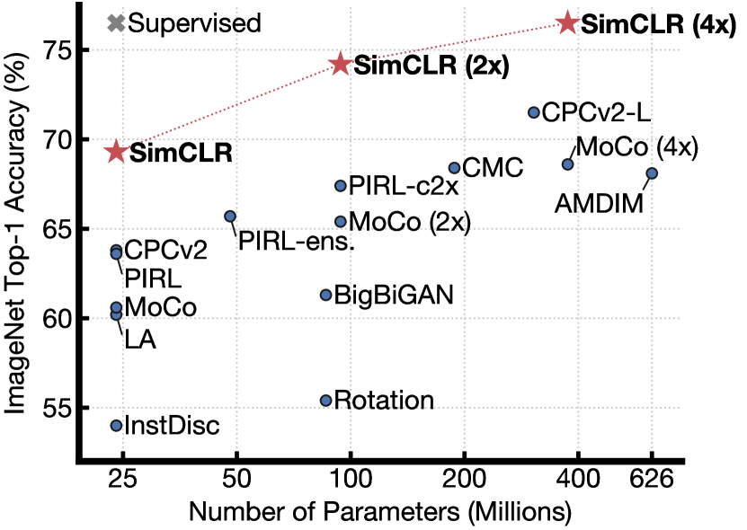

# 視覚的表現の対比学習のためのシンプルなフレームワーク

> 原題: A Simple Framework for Contrastive Learning of Visual Representations
> 著者: Ting Chen, Simon Kornblith, Mohammad Norouzi, Geoffrey Hinton
> 出典: ICML 2020（arXiv 2002.05709）

---

## Abstract（要旨）

本論文では SimCLR を提示する：視覚的表現の対比学習のためのシンプルなフレームワーク。我々は、特殊なアーキテクチャやメモリバンクを必要とせずに、最近提案された対比的自己教師あり学習アルゴリズムを簡素化する。対比予測タスクが有用な表現を学習できる要因を理解するため、我々はフレームワークの主要コンポーネントを系統的に研究する。我々は次のことを示す：（1）データ拡張の構成は、有効な予測タスクを定義する上で重要な役割を果たす；（2）表現と対比損失の間に学習可能な非線形変換を導入することで、学習された表現の品質が大幅に向上する；（3）対比学習は、教師あり学習に比べて、より大きなバッチサイズとより多くの学習ステップから恩恵を受ける。これらの知見を組み合わせることで、我々は ImageNet における自己教師あり学習および半教師あり学習の以前の最先端手法を大幅に上回ることができる。SimCLR によって学習された自己教師あり表現上で訓練された線形分類器は、top-1 精度 76.5% を達成しており、これは以前の最先端に対して 7% の相対的な改善であり、教師あり ResNet-50 の性能と一致する。ラベルの 1% のみでファインチューニングした場合、我々は top-5 精度 85.8% を達成しており、100 倍少ないラベルで AlexNet を上回る。

---

## 1 Introduction（はじめに）

人間の監督なしに効果的な視覚的表現を学習することは、長年の課題である。主流のアプローチのほとんどは、生成的アプローチと識別的アプローチの 2 つのクラスのいずれかに分類される。生成的アプローチは、入力空間でピクセルを生成するか、それ以外の方法でモデル化することを学習する。しかし、ピクセルレベルの生成は計算コストが高く、表現学習に必ずしも必要ではないかもしれない。識別的アプローチは、教師あり学習に使用されるものと同様の目的関数を用いて表現を学習するが、入力とラベルの両方がラベルなしデータセットから導出される pretext タスクをネットワークに実行させて訓練する。このようなアプローチの多くは、heuristics に依存して pretext タスクを設計しており、これが学習された表現の汎用性を制限する可能性がある。潜在空間での対比学習に基づく識別的アプローチは、最近大きな可能性を示し、最先端の結果を達成している。

<figure>

<figcaption>図1: 異なる自己教師あり手法で学習された表現上で訓練された線形分類器の ImageNet Top-1 精度（ImageNet で事前学習）。灰色の × は教師あり ResNet-50 を示す。我々の手法 SimCLR は太字で示されている。</figcaption>
</figure>

本研究では、視覚的表現の対比学習のためのシンプルなフレームワークを紹介し、これを SimCLR と呼ぶ。SimCLR は以前の研究を上回る（図 1）だけでなく、特殊なアーキテクチャやメモリバンクを必要とせず、よりシンプルでもある。

良い対比的表現学習を可能にするものを理解するため、我々はフレームワークの主要コンポーネントを系統的に研究し、次のことを示す：

- 複数のデータ拡張操作の構成は、有効な表現を生み出す対比予測タスクを定義する上で重要である。加えて、教師なし対比学習は教師あり学習よりも強力なデータ拡張から恩恵を受ける。
- 表現と対比損失の間に学習可能な非線形変換を導入することで、学習された表現の品質が大幅に向上する。
- 正規化された埋め込みと適切に調整された温度パラメータを用いた対比クロスエントロピー損失は、より良い結果をもたらす。
- 対比学習は、その教師あり対応物と比較して、より大きなバッチサイズとより長い学習から恩恵を受ける。教師あり学習と同様に、対比学習はより深く広いネットワークから恩恵を受ける。

我々はこれらの知見を組み合わせて、ImageNet ILSVRC-2012 における自己教師あり学習および半教師あり学習において新たな最先端を達成する。線形評価プロトコルの下で、SimCLR は top-1 精度 76.5% を達成し、これは以前の最先端に対して 7% の相対的な改善である。ImageNet ラベルの 1% のみでファインチューニングした場合、SimCLR は top-5 精度 85.8% を達成し、10% の相対的な改善となる。他の自然画像分類データセットでファインチューニングした場合、SimCLR は 12 データセット中 10 において、強力な教師あり baseline と同等かそれ以上の性能を発揮する。

---

## 2 Method（手法）

### 2.1 対比学習フレームワーク

最近の対比学習アルゴリズムにインスパイアされて（概観については §7 を参照）、SimCLR は潜在空間での対比損失を通じて、同じデータ例の異なる拡張されたビュー間の一致を最大化することで表現を学習する。図 2 に示すように、このフレームワークは以下の 4 つの主要コンポーネントから構成される。

- 与えられたデータ例をランダムに変換する確率的データ拡張モジュールで、同じ例の 2 つの相関したビュー（$\tilde{\bm{x}}_i$ と $\tilde{\bm{x}}_j$ と表記）を生成し、これを正例ペアとみなす。本研究では、3 つのシンプルな拡張を順次適用する：ランダムクロッピングとそれに続く元のサイズへのリサイズ、ランダムカラー歪み、およびランダムガウシアンブラー。§3 に示すように、ランダムクロップとカラー歪みの組み合わせが良い性能を達成するために重要である。
- 拡張されたデータ例から表現ベクトルを抽出するニューラルネットワーク基盤エンコーダ $f(\cdot)$。我々のフレームワークはアーキテクチャの選択に制約なく様々なものを許容する。我々はシンプルさのために、一般的に使用される ResNet を採用し、$\bm{h}_i = f(\tilde{\bm{x}}_i) = \text{ResNet}(\tilde{\bm{x}}_i)$（ここで $\bm{h}_i \in \mathbb{R}^d$ は平均プーリング層後の出力）を得る。
- 対比損失が適用される空間に表現をマッピングする小さなニューラルネットワーク射影ヘッド $g(\cdot)$。我々は 1 つの隠れ層を持つ MLP を使用して $\bm{z}_i = g(\bm{h}_i) = W^{(2)}\sigma(W^{(1)}\bm{h}_i)$（ここで $\sigma$ は ReLU 非線形性）を得る。§4 に示すように、$\bm{h}_i$ よりも $\bm{z}_i$ 上で対比損失を定義することが有益であることがわかった。
- 対比予測タスクのために定義された対比損失関数。正例ペア $\tilde{\bm{x}}_i$ と $\tilde{\bm{x}}_j$ を含む集合 $\{\tilde{\bm{x}}_k\}$ が与えられた場合、対比予測タスクは、与えられた $\tilde{\bm{x}}_i$ に対して $\{\tilde{\bm{x}}_k\}_{k \neq i}$ の中から $\tilde{\bm{x}}_j$ を識別することを目指す。

> **図 2** (フレームワーク図): 元の画像 $\bm{x}$ から 2 つの拡張 $\tilde{\bm{x}}_i$, $\tilde{\bm{x}}_j$ を生成し、それぞれエンコーダ $f(\cdot)$ で表現 $\bm{h}_i$, $\bm{h}_j$ を得て、射影ヘッド $g(\cdot)$ で $\bm{z}_i$, $\bm{z}_j$ に変換し、一致を最大化する構造。

ミニバッチから $N$ 個のサンプルをランダムに取り出し、ミニバッチから導出された拡張サンプルのペアに対して対比予測タスクを定義すると、$2N$ のデータポイントが得られる。我々は負例を明示的にサンプリングしない。代わりに、正例ペアが与えられた場合、ミニバッチ内の他の $2(N-1)$ 個の拡張サンプルを負例として扱う。$\text{sim}(\bm{u}, \bm{v}) = \bm{u}^\top\bm{v} / \lVert\bm{u}\rVert\lVert\bm{v}\rVert$ を $\ell_2$ 正規化された $\bm{u}$ と $\bm{v}$ の内積（すなわちコサイン類似度）とする。正例ペア $(i, j)$ に対する損失関数は次のように定義される：

$$
\ell_{i,j} = -\log \frac{\exp(\text{sim}(\bm{z}_i, \bm{z}_j)/\tau)}{\sum_{k=1}^{2N} \mathbbm{1}_{[k\neq i]} \exp(\text{sim}(\bm{z}_i, \bm{z}_k)/\tau)}
$$

ここで $\mathbbm{1}_{[k\neq i]} \in \{0,1\}$ は $k \neq i$ のとき 1 に評価される指示関数であり、$\tau$ は温度パラメータを表す。最終損失はミニバッチ内のすべての正例ペア（$(i,j)$ と $(j,i)$ の両方）にわたって計算される。この損失は以前の研究でも使用されており、我々はこれを NT-Xent（正規化温度スケールクロスエントロピー損失）と呼ぶ。

**アルゴリズム 1** は提案手法の主要な学習アルゴリズムを要約する：バッチサイズ $N$ のミニバッチ $\{\bm{x}_k\}$ に対し、各サンプルに 2 つの異なる拡張を適用して $\tilde{\bm{x}}_{2k-1}$ と $\tilde{\bm{x}}_{2k}$ を生成し、$\bm{h}$ と $\bm{z}$ を計算し、全正例ペアに対して NT-Xent 損失 $\mathcal{L}$ を最小化してネットワーク $f$ と $g$ を更新する。訓練後はエンコーダ $f(\cdot)$ を返し、$g(\cdot)$ は捨てる。

### 2.2 大きなバッチサイズでの訓練

シンプルさを保つため、我々はモデルをメモリバンクで訓練しない。代わりに、訓練バッチサイズ $N$ を 256 から 8192 まで変化させる。バッチサイズ 8192 では、両拡張ビューから正例ペアあたり 16382 個の負例が得られる。大きなバッチサイズでの訓練は、線形学習率スケーリングを用いた標準的な SGD/Momentum では不安定になる場合がある。訓練を安定させるため、すべてのバッチサイズに対して LARS オプティマイザを使用する。我々はバッチサイズに応じて 32 から 128 コアのクラウド TPU でモデルを訓練する。

**Global BN（グローバルバッチ正規化）**: 標準的な ResNet はバッチ正規化を使用する。データ並列性を用いた分散訓練では、BN の平均と分散は通常デバイスごとにローカルで集約される。我々の対比学習では、正例ペアが同じデバイスで計算されるため、モデルは表現を改善せずに予測精度を上げるためにローカルな情報リークを利用できてしまう。我々はこの問題を、訓練中にすべてのデバイスにわたって BN の平均と分散を集約することで対処する。

### 2.3 評価プロトコル

**データセットとメトリクス**: 教師なし事前学習（ラベルなしでエンコーダネットワーク $f$ を学習する）の研究のほとんどは ImageNet ILSVRC-2012 データセットを使用して行われる。転移学習のための事前学習実験は付録 B.9 の CIFAR-10 でも行われる。学習された表現を評価するために、凍結した基盤ネットワーク上で線形分類器を訓練し、テスト精度を表現品質の代理として使用する、広く使用されている線形評価プロトコルに従う。

**デフォルト設定**: 特に断りのない限り、データ拡張にはランダムクロップとリサイズ（ランダムフリップ付き）、カラー歪み、ガウシアンブラー（詳細は付録 A を参照）を使用する。基盤エンコーダネットワークとして ResNet-50 を使用し、2 層 MLP 射影ヘッドで表現を 128 次元の潜在空間に射影する。損失として NT-Xent を使用し、学習率 4.8（$= 0.3 \times \text{BatchSize}/256$）および重み減衰 $10^{-6}$ の LARS で最適化する。バッチサイズ 4096 で 100 エポック訓練する。さらに、最初の 10 エポックに線形ウォームアップを使用し、再起動なしのコサイン減衰スケジュールで学習率を減衰させる。

---

## 3 対比的表現学習のためのデータ拡張

**データ拡張は予測タスクを定義する**: データ拡張は教師あり・教師なしの両方の表現学習で広く使用されてきたが、対比予測タスクを系統的に定義する方法として考慮されてこなかった。多くの既存のアプローチはアーキテクチャを変更することで対比予測タスクを定義する。例えば、一部の手法はネットワークアーキテクチャで受容野を制限することでグローバルからローカルへのビュー予測を達成し、別の手法は固定された画像分割手続きとコンテキスト集約ネットワークで隣接ビュー予測を達成する。我々は、ターゲット画像の単純なランダムクロッピング（リサイズ付き）を実行することでこの複雑さを回避できることを示し、これにより上記 2 つを包含する予測タスクファミリーが作られる（図 3）。このシンプルな設計の選択は、予測タスクとニューラルネットワークアーキテクチャなどの他のコンポーネントを都合よく切り離す。

**図 3**: ランダムクロッピングが（a）グローバル↔ローカルビュー予測と（b）隣接ビュー予測という 2 種類の予測タスクを自然に包含することを示す概念図。

### 3.1 データ拡張操作の構成が良い表現の学習に重要

データ拡張の影響を系統的に研究するため、いくつかの一般的な拡張を考える。一種類の拡張はデータの空間的・幾何学的変換を含む（クロッピングとリサイズ（水平フリップ付き）、回転、カットアウトなど）。もう一種類の拡張は外観変換を含む（カラー歪み（カラードロッピング、輝度、コントラスト、彩度、色相など）、ガウシアンブラー、ソーベルフィルタリングなど）。

個々のデータ拡張の影響と拡張の構成の重要性を理解するため、個別または対で拡張を適用した場合のフレームワークの性能を調査する。ImageNet の画像はサイズが異なるため、常に画像をクロップしてリサイズする。この交絡因子を排除するため、アブレーションに非対称なデータ変換設定を考える：常に最初に画像をランダムにクロップして同じ解像度にリサイズし、ターゲット変換のみをフレームワークの一方のブランチに適用する（他方はアイデンティティのまま）。

<figure>

<figcaption>図5: 個別または構成されたデータ拡張（1 つのブランチのみに適用）の下での線形評価（ImageNet top-1 精度）。最後の列を除くすべての列で、対角エントリは単一変換に対応し、非対角は 2 つの変換の構成（順次適用）に対応する。最後の列は行の平均を反映する。</figcaption>
</figure>

図 5 は、個別および変換の組み合わせの下での線形評価結果を示す。単一の変換だけでは良い表現の学習に不十分であることが観察される。たとえモデルが対比タスクの正例ペアをほぼ完璧に識別できるとしても。拡張を構成すると、対比予測タスクはより困難になるが、表現の品質は劇的に向上する。

突出した拡張の組み合わせが 1 つある：ランダムクロッピングとランダムカラー歪み。我々は、データ拡張としてランダムクロッピングのみを使用する場合の深刻な問題は、画像のほとんどのパッチが似たようなカラー分布を共有していることだと推測する。図 6 は、カラーヒストグラムだけで画像を区別するのに十分であることを示す。ニューラルネットは、予測タスクを解くためにこのショートカットを利用する可能性がある。したがって、汎化可能な特徴を学習するために、クロッピングとカラー歪みを組み合わせることが重要である。

### 3.2 対比学習は教師あり学習よりも強いデータ拡張を必要とする

**表 1**: 様々なカラー歪み強度とその他のデータ変換の下での、線形評価を使用した教師なし ResNet-50 と教師あり ResNet-50 の top-1 精度。強度 1 (+Blur) が我々のデフォルトデータ拡張ポリシーである。

| 手法 | 1/8 | 1/4 | 1/2 | 1 | 1 (+Blur) | AutoAug |
|---|---|---|---|---|---|---|
| SimCLR | 59.6 | 61.0 | 62.6 | 63.2 | 64.5 | 61.1 |
| 教師あり | 77.0 | 76.7 | 76.5 | 75.7 | 75.4 | 77.1 |

カラー拡張の重要性をさらに示すために、表 1 に示すようにカラー拡張の強度を調整する。より強いカラー拡張は、学習された教師なしモデルの線形評価を大幅に向上させる。この文脈で、教師あり学習を使用して見つけられた洗練された拡張ポリシーである AutoAugment は、シンプルなクロッピング＋（より強い）カラー歪みよりも良い結果をもたらさない。同じ拡張セットで教師ありモデルを訓練した場合、より強いカラー拡張は性能を向上させず、むしろ低下させる場合さえある。したがって、我々の実験は、教師なし対比学習が教師あり学習よりも強い（カラー）データ拡張から恩恵を受けることを示している。

---

## 4 エンコーダとヘッドのアーキテクチャ

### 4.1 教師なし対比学習はより大きなモデルからより多くの恩恵を受ける

<figure>

<figcaption>図7: 深さと幅を変えたモデルの線形評価。青い点は我々の 100 エポック訓練モデル、赤い星は我々の 1000 エポック訓練モデル、緑の × は教師あり ResNet（90 エポック）。長く訓練しても教師あり ResNet の性能は向上しない。</figcaption>
</figure>

図 7 は、深さと幅の両方を増加させると性能が向上することを示す。教師あり学習でも同様の知見が得られるが、モデルサイズが増加するにつれて、教師ありモデルと教師なしモデル上で訓練された線形分類器の間のギャップが縮小することがわかる。これは、教師なし学習が教師あり学習よりもより大きなモデルからより多くの恩恵を受けることを示唆している。

### 4.2 非線形射影ヘッドがその前の層の表現品質を向上させる

<figure>

<figcaption>図8: 異なる射影ヘッド g(·) と z の様々な次元を用いた表現の線形評価。ここでの表現 h（射影前）は 2048 次元である。</figcaption>
</figure>

次に、射影ヘッド $g(\bm{h})$ を含めることの重要性を研究する。図 8 は、3 つの異なるアーキテクチャを使用した線形評価結果を示す：（1）恒等写像；（2）線形射影（いくつかの以前のアプローチで使用）；（3）追加の隠れ層（ReLU 活性化付き）を持つデフォルトの非線形射影。非線形射影は線形射影よりも優れており（+3%）、射影なしよりもはるかに優れている（>10%）ことが観察される。射影ヘッドを使用する場合、出力次元に関わらず同様の結果が観察される。さらに、非線形射影が使用される場合でも、射影ヘッドの前の層 $\bm{h}$ は、射影後の層 $\bm{z} = g(\bm{h})$ よりもはるかに優れている（>10%）。これは、射影ヘッドの前の隠れ層が射影後の層よりも優れた表現であることを示している。

射影前の表現を使用することの重要性は、対比損失によって引き起こされる情報の損失によるものだと我々は推測する。特に、$\bm{z} = g(\bm{h})$ はデータ変換に不変になるよう訓練される。したがって、$g$ はカラーやオブジェクトの向きなど、下流タスクに有用な情報を除去する可能性がある。非線形変換 $g(\cdot)$ を活用することで、より多くの情報を $\bm{h}$ に形成・維持できる。

**表 3**: 適用された変換を予測するために異なる表現上で追加 MLP を訓練する精度。$\bm{h}$ と $g(\bm{h})$ は同じ次元（2048）である。

| 予測対象 | ランダム推測 | $\bm{h}$ | $g(\bm{h})$ |
|---|---|---|---|
| カラー vs グレースケール | 80 | 99.3 | 97.4 |
| 回転 | 25 | 67.6 | 25.6 |
| 元 vs 破損 | 50 | 99.5 | 59.6 |
| 元 vs ソーベルフィルタ | 50 | 96.6 | 56.3 |

$\bm{h}$ は適用された変換についてはるかに多くの情報を含むが、$g(\bm{h})$ は情報を失うことが確認される。

---

## 5 損失関数とバッチサイズ

### 5.1 調整可能な温度を用いた正規化クロスエントロピー損失は代替手法より優れている

NT-Xent 損失を、ロジスティック損失やマージン損失などの一般的に使用される対比損失関数と比較する。勾配を見ると、次の 2 点が観察される：1）コサイン類似度（$\ell_2$ 正規化）と温度の組み合わせが異なる例を効果的に重み付けし、適切な温度はモデルが hard negative から学習するのを助ける；2）クロスエントロピーとは異なり、他の目的関数は負例をその相対的な困難さで重み付けしない。

**表 4**: 異なる損失関数で訓練されたモデルの線形評価（top-1）。「sh」はセミハード負例マイニングの使用を意味する。

| Margin | NT-Logi. | Margin (sh) | NT-Logi.(sh) | NT-Xent |
|---|---|---|---|---|
| 50.9 | 51.6 | 57.5 | 57.9 | 63.9 |

$\ell_2$ 正規化なし（コサイン類似度の代わりに内積）と不適切な温度スケーリングは性能を大幅に低下させる。

### 5.2 対比学習はより大きなバッチサイズと長い訓練から（より多くの）恩恵を受ける

<figure>

<figcaption>図9: 異なるバッチサイズとエポック数で訓練された ResNet-50 モデルの線形評価。各バーはスクラッチからの単一実行。</figcaption>
</figure>

図 9 は、異なる数のエポックで訓練された場合のバッチサイズの影響を示す。訓練エポック数が少ない（例えば 100 エポック）場合、大きなバッチサイズは小さいものに比べて大きな優位性を持つことがわかる。より多くの訓練ステップ/エポックがあると、バッチがランダムに再サンプリングされる限り、異なるバッチサイズ間のギャップは減少するか消える。教師あり学習とは対照的に、対比学習では、より大きなバッチサイズはより多くの負例を提供し、収束を促進する（所与の精度に対してより少ないエポックとステップが必要）。より長い訓練もより多くの負例を提供し、結果を向上させる。

---

## 6 最先端手法との比較

本節では、3 つの異なる隠れ層幅（幅乗数 $1\times$, $2\times$, $4\times$）で ResNet-50 を使用する。より良い収束のために、ここでのモデルは 1000 エポック訓練される。

**線形評価**: 表 6 は、線形評価設定での以前のアプローチとの比較を示す。特別に設計されたアーキテクチャを必要とする以前の手法と比較して、標準的なネットワークを使用して大幅に優れた結果を得ることができる。ResNet-50 ($4\times$) で得られた最良の結果は、教師あり事前学習済み ResNet-50 と一致する。

**表 6**: 異なる自己教師あり手法で学習された表現上で訓練された線形分類器の ImageNet 精度。

| 手法 | アーキテクチャ | パラメータ (M) | Top 1 | Top 5 |
|---|---|---|---|---|
| Local Agg. | ResNet-50 | 24 | 60.2 | - |
| MoCo | ResNet-50 | 24 | 60.6 | - |
| PIRL | ResNet-50 | 24 | 63.6 | - |
| CPC v2 | ResNet-50 | 24 | 63.8 | 85.3 |
| **SimCLR（我々）** | ResNet-50 | 24 | **69.3** | **89.0** |
| AMDIM | Custom-ResNet | 626 | 68.1 | - |
| CMC | ResNet-50 (2×) | 188 | 68.4 | 88.2 |
| MoCo | ResNet-50 (4×) | 375 | 68.6 | - |
| CPC v2 | ResNet-161 (*) | 305 | 71.5 | 90.1 |
| **SimCLR（我々）** | ResNet-50 (2×) | 94 | **74.2** | **92.0** |
| **SimCLR（我々）** | ResNet-50 (4×) | 375 | **76.5** | **93.2** |

**半教師あり学習**: 1% または 10% の ImageNet ラベルでファインチューニングした結果（表 7）。SimCLR は 1% と 10% のラベルで最先端を大幅に改善する。

**表 7**: 少ないラベルで訓練されたモデルの ImageNet 精度。

| 手法 | アーキテクチャ | 1% Top 5 | 10% Top 5 |
|---|---|---|---|
| 教師あり baseline | ResNet-50 | 48.4 | 80.4 |
| PIRL | ResNet-50 | 57.2 | 83.8 |
| CPC v2 | ResNet-161 | 77.9 | 91.2 |
| **SimCLR（我々）** | ResNet-50 | 75.5 | 87.8 |
| **SimCLR（我々）** | ResNet-50 (2×) | 83.0 | 91.2 |
| **SimCLR（我々）** | ResNet-50 (4×) | **85.8** | **92.6** |

**転移学習**: 12 の自然画像データセットにわたる転移学習性能（表 8、ResNet-50 ($4\times$) モデル）。線形評価設定では、SimCLR は多くのデータセットで教師あり baseline と同等の性能を発揮する。ファインチューニング設定では、我々の自己教師ありモデルは 5 つのデータセットで教師あり baseline を大幅に上回り、教師ありが優れているのは 2 つ（Pets と Flowers）のみ。残りの 5 つでは統計的に同等である。

---

## 7 関連研究

変換下での画像の表現を一致させるというアイデアは、1992 年にさかのぼる。我々は、データ拡張、ネットワークアーキテクチャ、対比損失の最近の進歩を活用することでこれを拡張する。

**手作り pretext タスク**: 自己教師あり学習の最近の復活は、相対パッチ予測、ジグソーパズルの解決、色付け、回転予測などの人工的に設計された pretext タスクから始まった。より大きなネットワークと長い訓練によって良い結果を得ることができるが、これらの pretext タスクはいくぶど ad-hoc なヒューリスティックスに依存しており、学習された表現の汎用性を制限する。

**対比的視覚表現学習**: Hadsell ら（2006）にさかのぼるこれらのアプローチは、正例ペアと負例ペアを対比させることで表現を学習する。InstDisc はメモリバンクを使用してインスタンスクラス表現ベクトルを保存する。MoCo, PIRL は momentum encoder + memory bank で大規模化する。最近の文献では、相互情報の最大化と対比アプローチの成功を関連付ける試みがあるが、成功が相互情報によるものか対比損失の具体的な形によるものかは不明である。

我々のフレームワークの個別のコンポーネントのほとんどは以前の研究に現れている。以前の研究と比較した我々のフレームワークの優位性は、単一の設計選択によるものではなく、それらの構成によるものである。

---

## 8 Conclusion（結論）

本研究では、対比的視覚表現学習のためのシンプルなフレームワークとその実例化を提示する。我々はそのコンポーネントを注意深く研究し、異なる設計選択の効果を示す。我々の知見を組み合わせることで、自己教師あり学習、半教師あり学習、転移学習において以前の手法を大幅に改善する。

我々のアプローチは、データ拡張の選択、ネットワーク末尾の非線形ヘッドの使用、損失関数の点でのみ ImageNet 上での標準的な教師あり学習と異なる。このシンプルなフレームワークの強力さは、最近の関心の高まりにもかかわらず、自己教師あり学習がまだ過小評価されていることを示唆している。

---

## Appendix A データ拡張の詳細

デフォルトの事前学習設定では、ランダムクロップ（リサイズとランダムフリップ付き）、ランダムカラー歪み、ランダムガウシアンブラーをデータ拡張として使用する。

**ランダムクロップとリサイズ（224×224）**: 標準的な Inception スタイルのランダムクロッピングを使用する。元のサイズの 0.08 〜 1.0（面積で一様）のランダムサイズと、元のアスペクト比の 3/4 〜 4/3 のランダムなアスペクト比のクロップを作成する。このクロップは最終的に元のサイズにリサイズされる。さらに、ランダムクロップ（リサイズ付き）は常に 50% の確率でランダムな水平/左右フリップが続く。

**カラー歪み**: カラー歪みはカラージッタリングとカラードロッピングで構成される。通常、より強いカラージッタリングが役立つため、強度パラメータを設定する。カラージッタリングは確率 0.8 で輝度・コントラスト・彩度・色相をランダムに変化させ、カラードロッピングは確率 0.2 でグレースケールに変換する。

**ガウシアンブラー**: 画像の 50% の時間に、ガウシアンカーネルを使用してぼかす。$\sigma \in [0.1, 2.0]$ をランダムにサンプリングし、カーネルサイズは画像の高さ/幅の 10% に設定する。このデータ拡張は我々のデフォルトポリシーに含まれており、100 エポック訓練で ResNet-50 の性能を 63.2% から 64.5% に向上させる。

---

## Appendix B 追加実験結果（抜粋）

### B.1 バッチサイズと訓練ステップ

大きなバッチサイズ（最大 32K）と長い訓練（最大 3200 エポック）でも訓練した。バッチサイズ 8192 では性能が飽和するように見えるが、より長い訓練は依然として性能を大幅に向上させる。

**表 B.1**: 異なるバッチサイズと訓練エポック下での線形評価（top-1）。スラッシュの左は線形 LR スケーリング、右は平方根 LR スケーリング。

より少ないエポックで小さなバッチサイズを使用する場合、LARS オプティマイザとの平方根学習率スケーリング（$\text{LR} = 0.075 \times \sqrt{\text{BatchSize}}$）が線形スケーリングより望ましい。

### B.2 より広いデータ拡張の構成

デフォルト拡張ポリシーを（1）ソーベルフィルタリング、（2）追加カラー歪み（equalize, solarize）、（3）モーションブラーを含むように拡大すると、さらに改善される：ResNet-50 ($1\times, 2\times, 4\times$) がそれぞれ 70.0 (+0.7)、74.4 (+0.2)、76.8 (+0.3) を達成する。

### B.4 非線形射影ヘッドの理解

線形射影行列 $W \in \mathbb{R}^{2048 \times 2048}$ の固有値分布は、比較的少ない大きな固有値を持ち、ほぼ低ランクであることを示している。t-SNE 可視化では、$\bm{h}$ のクラスは $\bm{z}=g(\bm{h})$ よりも分離されている。

### B.9 CIFAR-10

ResNet-50 を使用した CIFAR-10 の最良モデル（バッチサイズ 1024）は線形評価精度 94.0% を達成する（教師あり baseline は 95.1%）。CIFAR-10 での線形評価結果を報告する最良の自己教師ありモデルは AMDIM で 91.2% を達成するが、25 倍大きいモデルを使用している。

---

## Appendix C 関連手法との詳細な比較

**表 C.1**: 各手法の設計選択と訓練設定の高レベル比較（ImageNet での最良結果）。

| モデル | データ拡張 | 基盤エンコーダ | 射影ヘッド | 損失 | バッチサイズ | 訓練エポック |
|---|---|---|---|---|---|---|
| CPC v2 | Custom | ResNet-161 (modified) | PixelCNN | Xent | 512 | ~200 |
| AMDIM | Fast AutoAug. | Custom ResNet | 非線形 MLP | Xent w/clip,reg | 1008 | 150 |
| CMC | Fast AutoAug. | ResNet-50 (2×, L+ab) | 線形 | Xent w/ l2, τ | 156 | 280 |
| MoCo | Crop+color | ResNet-50 (4×) | 線形 | Xent w/ l2, τ | 256 | 200 |
| PIRL | Crop+color | ResNet-50 (2×) | 線形 | Xent w/ l2, τ | 1024 | 800 |
| **SimCLR** | **Crop+color+blur** | ResNet-50 (4×) | **非線形 MLP** | **Xent w/ l2, τ** | **4096** | **1000** |

主な違い：
- DIM/AMDIM はアーキテクチャを変更してグローバル↔ローカル予測を達成するが、我々はランダムクロッピングで切り離す
- CPC v1/v2 は決定論的なパッチ分割とコンテキスト集約ネットワークを使用するが、我々はより単純
- InstDisc, MoCo, PIRL は明示的メモリバンクを使用するが、我々は大きなバッチで代替
- CMC は各ビューに別々のネットワークを使用するが、我々はすべてのビューで単一の共有ネットワーク
