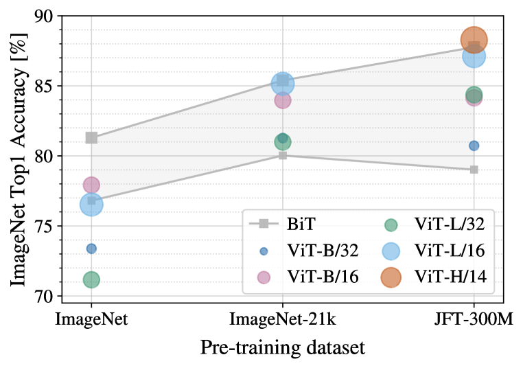
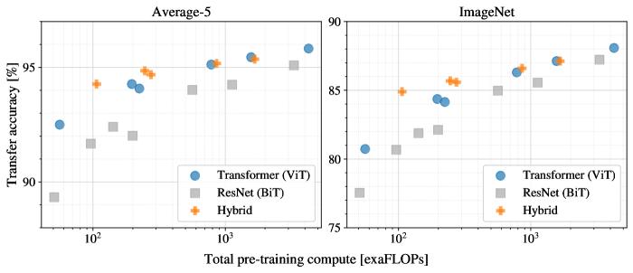
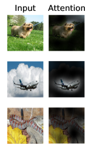
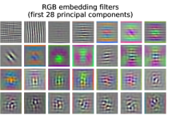

# 一枚の画像は 16×16 単語に値する：大規模画像認識のための Transformer

> 原題: An Image is Worth 16x16 Words: Transformers for Image Recognition at Scale
> 著者: Alexey Dosovitskiy*, Lucas Beyer*, Alexander Kolesnikov*, Dirk Weissenborn*, Xiaohua Zhai*, Thomas Unterthiner, Mostafa Dehghani, Matthias Minderer, Georg Heigold, Sylvain Gelly, Jakob Uszkoreit, Neil Houlsby* (Google Research, Brain Team)
> 出典: arXiv:2010.11929、ICLR 2021
> 公開コード: https://github.com/google-research/vision_transformer

## Abstract（要旨）

Transformer アーキテクチャは自然言語処理タスクのデファクト・スタンダードになっているが、コンピュータ・ビジョンへの応用は限定的である。視覚では、attention は畳み込みネットワークと併用されるか、畳み込みネットワークの全体構造を保ちつつ特定の構成要素を置き換えるために使われる。我々は、この CNN への依存は必要なく、画像パッチの系列に直接適用される**純粋な Transformer** が画像分類タスクで非常に良い性能を発揮できることを示す。大量のデータで事前学習され、複数の中・小サイズの画像認識ベンチマーク（ImageNet、CIFAR-100、VTAB 等）に転移されると、**Vision Transformer（ViT）** は SOTA の畳み込みネットワークと比較して優秀な結果を達成し、訓練に必要な計算資源は大幅に少なくて済む。

## 1 Introduction（はじめに）

自己注意ベースのアーキテクチャ、特に Transformer [^47] は、自然言語処理（NLP）で第一選択のモデルとなっている。主流アプローチは、大規模テキスト・コーパスで事前学習し、その後より小さなタスク固有データセットでファインチューンすること [^14]。Transformer の計算効率性とスケーラビリティのおかげで、1000 億パラメータを超える前例のないサイズのモデルを訓練することが可能になった [^6] [^29]。モデルとデータセットが成長するにつれて、性能の飽和の兆候はまだ見られない。

しかしコンピュータ・ビジョンでは、畳み込みアーキテクチャが依然として支配的である [^28] [^27] [^16]。NLP の成功に触発されて、複数の研究が CNN 風アーキテクチャと自己注意を組み合わせること [^51] [^7]、あるいは畳み込みを完全に置き換えること [^41] [^48] を試みている。後者のモデルは理論的には効率的だが、特殊な attention パターンの使用のため、現代のハードウェア・アクセラレータ上でまだ効果的にスケールされていない。したがって、大規模画像認識では、古典的な ResNet 風アーキテクチャが依然として最先端である [^33] [^55] [^25]。

NLP における Transformer のスケーリング成功に触発されて、我々は**最小限の修正で標準的な Transformer を画像に直接適用する**実験を行う。これを行うため、画像をパッチに分割し、これらパッチの線形埋め込みの系列を Transformer への入力として与える。画像パッチは NLP 応用におけるトークン（単語）と同じように扱われる。モデルを教師あり方式で画像分類について訓練する。

ImageNet のような中サイズのデータセットで強い正則化なしに訓練されると、これらのモデルは同サイズの ResNet より数パーセント低い控えめな精度を出す。この一見落胆させる結果は予想されうるものである：**Transformer は CNN に内在するいくつかの帰納バイアス（平行移動同変性や局所性など）を欠いており**、したがって不十分な量のデータで訓練されたときには十分に汎化しない。

しかし、モデルがより大きなデータセット（14M〜300M 画像）で訓練されると、状況は変わる。**大規模訓練は帰納バイアスに勝る**ことを我々は見出した。我々の Vision Transformer（ViT）は、十分なスケールで事前学習され、より少ないデータ点を持つタスクに転移されると優秀な結果を達成する。公開 ImageNet-21k データセットまたは社内 JFT-300M データセットで事前学習されると、ViT は複数の画像認識ベンチマークで SOTA に迫るか上回る。特に、最良モデルは ImageNet で **88.55%**、ImageNet-ReaL で **90.72%**、CIFAR-100 で **94.55%**、19 タスクの VTAB スイートで **77.63%** に達する。

## 2 Related Work（関連研究）

Transformer は機械翻訳のために [^47] によって提案され、それ以来多くの NLP タスクで最先端の手法となった。大規模 Transformer ベース・モデルは、しばしば大規模コーパスで事前学習され、手元のタスクのためにファインチューンされる：BERT [^14] はノイズ除去自己教師あり事前学習タスクを使い、GPT 系統の研究は言語モデリングを事前学習タスクとして使う [^39] [^40] [^6]。

画像への自己注意の素朴な適用は、各ピクセルが他のすべてのピクセルに注意することを要求する。ピクセル数の二次コストでは、これは現実的な入力サイズにスケールしない。したがって、画像処理の文脈で Transformer を適用するため、過去にいくつかの近似が試みられてきた。[^36] は各クエリ・ピクセルについて自己注意を局所近傍にのみ適用した。そのような局所多頭ドット積自己注意ブロックは畳み込みを完全に置き換えることができる [^20] [^41] [^58]。別系統の研究では Sparse Transformer [^11] が、画像に適用可能にするためグローバル自己注意へのスケーラブルな近似を採用する。attention をスケールする代替方法は、様々なサイズのブロックで適用することで、極端な場合は個々の軸に沿ってのみ適用する [^52] [^18] [^48]。これら特殊化された attention アーキテクチャの多くはコンピュータ・ビジョン・タスクで有望な結果を示すが、ハードウェア・アクセラレータ上で効率的に実装するために複雑なエンジニアリングを要する。

我々の研究に最も関連するのは [^12] のモデルで、入力画像から $2\times 2$ サイズのパッチを抽出し、その上にフルの自己注意を適用する。このモデルは ViT に非常に似ているが、我々の研究は**大規模事前学習が vanilla Transformer を SOTA の CNN と競争的（あるいはより良い）にする**ことを示すまで進む。さらに、[^12] は $2\times 2$ ピクセルの小さなパッチサイズを使うので、モデルは小解像度画像にしか適用できないが、我々は中解像度画像も扱う。

CNN と自己注意の形式を組み合わせることへの関心も多く、たとえば画像分類のための特徴マップ拡張 [^4] や、CNN の出力を自己注意でさらに処理する例：物体検出 [^19] [^7]、動画処理 [^51] [^43]、画像分類 [^53]、教師なし物体発見 [^31]、統一テキスト・ビジョン・タスク [^10] [^32] [^30] がある。

別の最近の関連モデルは image GPT（iGPT）[^8] で、画像解像度と色空間を削減した後に Transformer を画像ピクセルに適用する。モデルは生成モデルとして教師なしで訓練され、結果として得られる表現は分類性能のためにファインチューンまたは線形プローブされ、ImageNet で最大 72% の精度を達成。

我々の研究は、標準的な ImageNet データセットより大規模での画像認識を探究する論文集に追加する。追加のデータソースの使用は標準ベンチマークで SOTA を達成することを可能にする [^33] [^44] [^55]。さらに [^42] は CNN 性能がデータセット・サイズでどうスケールするかを研究し、[^25] [^15] は ImageNet-21k や JFT-300M のような大規模データセットからの CNN 転移学習の実証的探究を行う。我々もこれら 2 つの後者のデータセットに焦点を当てるが、ResNet ベース・モデルではなく Transformer を訓練する。

## 3 Method（手法）

<figure>

<figcaption>図1: モデル概要。画像を固定サイズのパッチに分割し、各パッチを線形埋め込みし、位置埋め込みを加算し、結果として得られるベクトル系列を標準的な Transformer エンコーダに供給する。分類を行うため、系列に追加の学習可能な「分類トークン」を加える標準的アプローチを採用する。Transformer エンコーダの説明は [47] に着想を得た。</figcaption>
</figure>

モデル設計においては、オリジナル Transformer [^47] にできるだけ忠実に従う。この意図的にシンプルなセットアップの利点は、スケーラブルな NLP Transformer アーキテクチャとその効率的実装をほぼそのまま使えることである。

### 3.1 Vision Transformer (ViT)

モデルの概要を図 1 に示す。標準的な Transformer はトークン埋め込みの 1D 系列を入力として受け取る。2D 画像を扱うため、画像 $\mathbf{x}\in\mathbb{R}^{H\times W\times C}$ を平坦化された 2D パッチの系列 $\mathbf{x}_{p}\in\mathbb{R}^{N\times(P^{2}\cdot C)}$ に再形成する。ここで $(H,W)$ は元の画像の解像度、$C$ はチャンネル数、$(P,P)$ は各画像パッチの解像度、$N=HW/P^{2}$ は結果として得られるパッチ数で、これは Transformer の実効入力系列長としても機能する。Transformer はすべての層を通じて一定の潜在ベクトル・サイズ $D$ を使うので、パッチを平坦化し訓練可能な線形射影で $D$ 次元にマップする（式 1）。この射影の出力を**パッチ埋め込み**と呼ぶ。

BERT の `[class]` トークンと同様に、埋め込まれたパッチ系列に学習可能な埋め込みを前置する（$\mathbf{z}_{0}^{0}=\mathbf{x}_{\text{class}}$）。Transformer エンコーダの出力での状態（$\mathbf{z}^{0}_{L}$）が画像表現 $\mathbf{y}$ として機能する（式 4）。事前学習・ファインチューンの両方で、分類ヘッドが $\mathbf{z}^{0}_{L}$ に取り付けられる。分類ヘッドは事前学習時には 1 つの隠れ層を持つ MLP として、ファインチューン時には単一の線形層として実装される。

**位置埋め込み**はパッチ埋め込みに加算され位置情報を保持する。我々は標準的な**学習可能な 1D 位置埋め込み**を使う。より高度な 2D 認識位置埋め込みから有意な性能向上を観察しなかったからである（Appendix D.4）。結果として得られる埋め込みベクトル系列はエンコーダへの入力として機能する。

Transformer エンコーダ [^47] は、多頭自己注意（Multi-Head Self-Attention, MSA、Appendix A 参照）と MLP ブロックの交互の層から成る（式 2、3）。**LayerNorm（LN）は各ブロックの前に適用**され、残差接続は各ブロックの後に適用される [^50] [^3]。MLP は GELU 非線形性を持つ 2 層を含む。

$$
\mathbf{z}_{0} = [\mathbf{x}_{\text{class}};\, \mathbf{x}^{1}_{p}\mathbf{E};\, \mathbf{x}^{2}_{p}\mathbf{E};\cdots;\, \mathbf{x}^{N}_{p}\mathbf{E}] + \mathbf{E}_{pos}, \quad \mathbf{E}\in\mathbb{R}^{(P^{2}\cdot C)\times D},\, \mathbf{E}_{pos}\in\mathbb{R}^{(N+1)\times D} \tag{1}
$$

$$
\mathbf{z}'_{\ell} = \operatorname{MSA}(\operatorname{LN}(\mathbf{z}_{\ell-1})) + \mathbf{z}_{\ell-1}, \quad \ell=1\ldots L \tag{2}
$$

$$
\mathbf{z}_{\ell} = \operatorname{MLP}(\operatorname{LN}(\mathbf{z}'_{\ell})) + \mathbf{z}'_{\ell}, \quad \ell=1\ldots L \tag{3}
$$

$$
\mathbf{y} = \operatorname{LN}(\mathbf{z}_{L}^{0}) \tag{4}
$$

##### Inductive bias（帰納バイアス）

Vision Transformer は CNN よりはるかに少ない画像固有の帰納バイアスを持つことに留意する。CNN では局所性、2 次元近傍構造、平行移動同変性が**モデル全体を通じて各層に組み込まれて**いる。ViT では**MLP 層のみが局所的・平行移動同変であり、自己注意層はグローバル**である。2 次元近傍構造は非常に控えめに使われる：モデルの最初で画像をパッチに切るときと、異なる解像度の画像のためにファインチューン時に位置埋め込みを調整するときに使われる。それ以外では、初期化時の位置埋め込みはパッチの 2D 位置に関する情報を持たず、**パッチ間のすべての空間関係はゼロから学習される必要がある**。

##### Hybrid Architecture（ハイブリッド・アーキテクチャ）

生の画像パッチの代替として、入力系列は CNN の特徴マップから形成できる [^28]。このハイブリッド・モデルでは、パッチ埋め込み射影 $\mathbf{E}$（式 1）は CNN 特徴マップから抽出されたパッチに適用される。特殊なケースとして、パッチは 1×1 の空間サイズを持ちうる。これは特徴マップの空間次元を単に平坦化して Transformer 次元に射影することで入力系列が得られることを意味する。分類入力埋め込みと位置埋め込みは前述のように加算される。

### 3.2 Fine-tuning and Higher Resolution（ファインチューンと高解像度）

典型的に、我々は ViT を大規模データセットで事前学習し、（より小さい）下流タスクにファインチューンする。このため、事前学習済み予測ヘッドを除去し、ゼロ初期化された $D\times K$ フィードフォワード層を取り付ける。ここで $K$ は下流クラス数。**事前学習より高い解像度でファインチューンするのがしばしば有益**である [^44] [^25]。より高い解像度の画像を供給するとき、パッチサイズは同じに保つので、これはより大きな実効系列長をもたらす。Vision Transformer は任意の系列長（メモリ制約まで）を扱えるが、事前学習済み位置埋め込みはもはや意味を持たない可能性がある。したがって、元の画像内の位置に従って事前学習済み位置埋め込みの 2D 補間を行う。**この解像度調整とパッチ抽出が、画像の 2D 構造に関する帰納バイアスが Vision Transformer に手動で注入される唯一の点である**ことに留意する。

## 4 Experiments（実験）

ResNet、Vision Transformer（ViT）、およびハイブリッドの表現学習能力を評価する。各モデルのデータ要求を理解するため、様々なサイズのデータセットで事前学習し多くのベンチマーク・タスクで評価する。モデル事前学習の計算コストを考慮すると、ViT は非常に有利な性能を示し、ほとんどの認識ベンチマークでより低い事前学習コストで SOTA を達成する。最後に、自己教師ありを使う小さな実験を行い、自己教師あり ViT が将来に有望であることを示す。

### 4.1 Setup（セットアップ）

**データセット**: モデルのスケーラビリティを探究するため、1k クラス・130 万画像の ILSVRC-2012 ImageNet データセット（以降「ImageNet」と呼ぶ）、21k クラス・14M 画像の上位集合 ImageNet-21k [^13]、18k クラス・3 億 300 万高解像度画像の JFT [^42] を使う。下流タスクのテストセットに関して事前学習データセットを重複排除する [^25]。これらデータセットで訓練されたモデルを複数のベンチマーク・タスクに転移する：オリジナル validation ラベルと整備された ReaL ラベル [^5] での ImageNet、CIFAR-10/100 [^26]、Oxford-IIIT Pets [^35]、Oxford Flowers-102 [^34]。これらデータセットでは前処理は [^25] に従う。

19 タスク VTAB 分類スイート [^57] でも評価する。VTAB はタスクあたり 1000 訓練例を使い、多様なタスクへの低データ転移を評価する。タスクは 3 グループに分けられる：**Natural**（Pets、CIFAR 等）、**Specialized**（医療・衛星画像）、**Structured**（局所化など幾何学的理解を要するタスク）。

**モデル変種**: ViT 構成は BERT [^14] で使われたものに基づき、表 1 にまとめる。「Base」と「Large」モデルは BERT から直接採用し、より大きな「Huge」モデルを追加する。以下では、モデル・サイズと入力パッチサイズを示すために簡潔な表記を使う：たとえば **ViT-L/16** は 16×16 の入力パッチサイズを持つ「Large」変種を意味する。Transformer の系列長はパッチサイズの 2 乗に反比例するので、より小さなパッチサイズのモデルは計算的にはより高価。

**表1**: Vision Transformer モデル変種の詳細

| モデル | 層数 | 隠れサイズ $D$ | MLP サイズ | ヘッド数 | パラメータ数 |
|---|---|---|---|---|---|
| ViT-Base | 12 | 768 | 3072 | 12 | 86M |
| ViT-Large | 24 | 1024 | 4096 | 16 | 307M |
| ViT-Huge | 32 | 1280 | 5120 | 16 | 632M |

ベースライン CNN には ResNet [^16] を使うが、Batch Normalization 層 [^23] を Group Normalization [^54] で置き換え、標準化された畳み込み [^38] を使う。これらの修正は転移を改善する [^25]。修正されたモデルを「**ResNet (BiT)**」と表記する。ハイブリッドでは、中間特徴マップをパッチサイズ 1 の "ピクセル" で ViT に供給する。異なる系列長で実験するため、(i) 通常の ResNet50 のステージ 4 の出力を取るか、(ii) ステージ 4 を除去しステージ 3 に同じ層数を配置し（総層数を保持）、この拡張ステージ 3 の出力を取る。オプション (ii) は 4 倍長い系列長と、より高価な ViT モデルをもたらす。

**訓練とファインチューン**: ResNet を含むすべてのモデルを、$\beta_{1}=0.9$、$\beta_{2}=0.999$、バッチサイズ 4096 の Adam [^24] で訓練し、すべてのモデルの転移に有用と分かった高い weight decay 0.1 を適用する（Appendix D.1 は、一般的な慣行と対照的に、我々の設定では Adam が ResNet で SGD よりわずかに良いことを示す）。線形学習率ウォームアップと減衰を使う（詳細は Appendix B.1）。ファインチューンには momentum 付き SGD、バッチサイズ 512、すべてのモデルに対して使う（Appendix B.1.1）。表 2 の ImageNet 結果では、より高い解像度でファインチューン：ViT-L/16 で 512、ViT-H/14 で 518、また 0.9999 [^41] [^49] の係数で [^37] 平均化も使用。

**指標**: 下流データセットでの結果を、few-shot またはファインチューン精度で報告する。ファインチューン精度はそれぞれのデータセットでファインチューンした後の各モデルの性能を捉える。Few-shot 精度は、訓練画像の部分集合の（凍結された）表現を $\{-1,1\}^{K}$ 目標ベクトルにマップする正則化最小二乗回帰問題を解くことで得られ、閉じた形で正確な解を復元できる。主にファインチューン性能に焦点を当てるが、ファインチューンが高コスト過ぎる場合の高速なオンザフライ評価のために、線形 few-shot 精度を時々使う。

### 4.2 Comparison to State of the Art（SOTA との比較）

まず最大のモデル ViT-H/14 と ViT-L/16 を文献の SOTA CNN と比較する。第 1 の比較点は Big Transfer（BiT）[^25] で、大規模 ResNet で教師あり転移学習を行う。第 2 は Noisy Student [^55] で、ラベルを除いた ImageNet と JFT-300M で半教師あり学習を使って訓練された大規模 EfficientNet。現在、Noisy Student は ImageNet で、BiT-L は他のデータセットで SOTA。すべてのモデルは TPUv3 ハードウェアで訓練され、それぞれの事前学習に費やした **TPUv3-core-days**（訓練に使った TPU v3 コア数（チップ 1 つにつき 2 つ）× 訓練時間日数）を報告する。

**表2**: 人気のある画像分類ベンチマークでの SOTA との比較。3 回のファインチューン実行の精度の平均と標準偏差を報告。JFT-300M で事前学習された Vision Transformer モデルは、すべてのデータセットで ResNet ベースラインを上回り、事前学習に必要な計算資源は大幅に少ない。

| | Ours-JFT (ViT-H/14) | Ours-JFT (ViT-L/16) | Ours-I21k (ViT-L/16) | BiT-L (ResNet152x4) | Noisy Student (EfficientNet-L2) |
|---|---|---|---|---|---|
| ImageNet | **88.55** ± 0.04 | 87.76 ± 0.03 | 85.30 ± 0.02 | 87.54 ± 0.02 | 88.4/88.5* |
| ImageNet ReaL | **90.72** ± 0.05 | 90.54 ± 0.03 | 88.62 ± 0.05 | 90.54 | 90.55 |
| CIFAR-10 | **99.50** ± 0.06 | 99.42 ± 0.03 | 99.15 ± 0.03 | 99.37 ± 0.06 | - |
| CIFAR-100 | **94.55** ± 0.04 | 93.90 ± 0.05 | 93.25 ± 0.05 | 93.51 ± 0.08 | - |
| Oxford-IIIT Pets | **97.56** ± 0.03 | 97.32 ± 0.11 | 94.67 ± 0.15 | 96.62 ± 0.23 | - |
| Oxford Flowers-102 | 99.68 ± 0.02 | **99.74** ± 0.00 | 99.61 ± 0.02 | 99.63 ± 0.03 | - |
| VTAB (19 tasks) | **77.63** ± 0.23 | 76.28 ± 0.46 | 72.72 ± 0.21 | 76.29 ± 1.70 | - |
| TPUv3-core-days | **2.5k** | **0.68k** | **0.23k** | 9.9k | 12.3k |

表 2 が結果を示す。JFT-300M で事前学習されたより小さな ViT-L/16 は、同じデータセットで事前学習された BiT-L をすべてのタスクで上回り、訓練に必要な計算資源は大幅に少ない。より大きなモデル ViT-H/14 は性能をさらに改善し、特により困難なデータセット（ImageNet、CIFAR-100、VTAB スイート）で改善が大きい。興味深いことに、このモデルでさえ以前の SOTA より大幅に少ない計算で事前学習された。しかし、事前学習効率はアーキテクチャ選択だけでなく、訓練スケジュール・オプティマイザ・weight decay 等の他のパラメータにも影響されることに留意。性能と計算の制御研究は Section 4.4 で提供する。最後に、公開 ImageNet-21k データセットで事前学習された ViT-L/16 モデルも、ほとんどのデータセットで良い性能を発揮し、より少ない資源で事前学習可能：標準的なクラウド TPUv3 8 コアで約 30 日で訓練可能。

<figure>

<figcaption>図2: Natural、Specialized、Structured タスク・グループでの VTAB 性能の内訳。</figcaption>
</figure>

図 2 は VTAB タスクをそれぞれのグループに分解し、このベンチマークでの以前の SOTA 手法と比較する：BiT、VIVI（ImageNet と Youtube で co-train された ResNet）[^46]、S4L（ImageNet での教師あり + 半教師あり学習）[^56]。**ViT-H/14 は BiT-R152x4 と他の手法を Natural と Structured タスクで上回る**。Specialized では上位 2 モデルの性能は同等。

### 4.3 Pre-training Data Requirements（事前学習データ要求）

<figure>

<figcaption>図3: ImageNet への転移。大きな ViT モデルは小さなデータセットで事前学習されると BiT ResNet（陰影領域）より性能が悪いが、より大きなデータセットで事前学習されると輝く。同様に、データセットが大きくなるにつれて、より大きな ViT 変種がより小さなものを上回る。</figcaption>
</figure>

Vision Transformer は大規模 JFT-300M データセットで事前学習されたとき良い性能を発揮する。ResNet より視覚に対する帰納バイアスが少ない中、データセット・サイズはどれほど重要か？2 系列の実験を行う。

第 1 に、ViT モデルを増加するサイズのデータセット（ImageNet、ImageNet-21k、JFT-300M）で事前学習する。小さなデータセットで性能を高めるため、3 つの基本正則化パラメータ（weight decay、ドロップアウト、ラベル平滑化）を最適化する。図 4 が ImageNet にファインチューンした後の結果を示す（他のデータセットでの結果は表 5）。**最小のデータセット（ImageNet）で事前学習されると、ViT-Large モデルは（適度な）正則化にもかかわらず ViT-Base モデルより性能が悪い**。ImageNet-21k 事前学習では、それらの性能は同等。**JFT-300M でのみ、より大きなモデルの完全な恩恵が見える**。図 4 は異なるサイズの BiT モデルが張る性能領域も示す。BiT CNN は ImageNet で ViT を上回るが、より大きなデータセットでは ViT が追い抜く。

第 2 に、9M、30M、90M および完全な JFT-300M データセットのランダム部分集合でモデルを訓練する。小さな部分集合では追加正則化を行わず、すべての設定で同じハイパーパラメータを使う。これにより正則化の効果ではなくモデル本来の性質を評価する。ただし early-stopping を使い、訓練中に達成された最良の validation 精度を報告。計算を節約するため、完全なファインチューン精度ではなく few-shot 線形精度を報告する。図 4 が結果を含む。**Vision Transformer は同じ計算コストの ResNet より小さなデータセットでより過学習する**。たとえば ViT-B/32 は ResNet50 より少し速い；9M 部分集合ではより悪い性能だが、90M+ 部分集合ではより良い。ResNet152x2 と ViT-L/16 でも同様。この結果は、「**畳み込みの帰納バイアスは小さなデータセットには有用だが、大きなデータセットではデータから直接関連パターンを学習することで十分、あるいは有益でさえある**」という直観を強化する。

全体として、ImageNet での few-shot 結果（図 4）と VTAB での低データ結果（表 2）は、非常に低いデータ転移に対して有望に見える。ViT の few-shot 性質のさらなる分析は将来研究の興味深い方向。

<figure>

<figcaption>図5: 異なるアーキテクチャ（Vision Transformer、ResNet、ハイブリッド）の事前学習計算 vs 性能。Vision Transformer は一般に同じ計算予算で ResNet を上回る。ハイブリッドはより小さなモデル・サイズで純粋 Transformer を改善するが、より大きなモデルではギャップが消える。</figcaption>
</figure>

### 4.4 Scaling Study（スケーリング研究）

JFT-300M からの転移性能を評価することで、異なるモデルの制御されたスケーリング研究を行う。この設定ではデータ・サイズはモデルの性能のボトルネックではなく、各モデルの性能対事前学習コストを評価する。モデル集合は以下を含む：7 ResNet（R50x1, R50x2, R101x1, R152x1, R152x2、7 エポック事前学習、R152x2 と R200x3 は 14 エポック）；6 Vision Transformer（ViT-B/32, B/16, L/32, L/16、7 エポック、L/16 と H/14 は 14 エポック）；5 ハイブリッド（R50+ViT-B/32, B/16, L/32, L/16、7 エポック、R50+ViT-L/16 は 14 エポック）。

図 5 が転移性能対総事前学習計算を含む（計算コスト詳細は Appendix D.5）。いくつかのパターンが観察できる。**第 1 に、Vision Transformer は性能/計算のトレードオフで ResNet を支配**する。ViT は同じ性能を達成するためにおよそ **2-4 倍少ない計算**を使う（5 データセットの平均）。**第 2 に、ハイブリッドは小さな計算予算で ViT をわずかに上回るが、より大きなモデルでは差が消える**。畳み込み局所特徴処理が任意のサイズで ViT を助けると予想されるので、この結果はやや驚くべき。**第 3 に、Vision Transformer は試した範囲内で飽和しないように見え、将来のスケーリング努力の動機付けとなる**。

### 4.5 Inspecting Vision Transformer（Vision Transformer の内部検査）

<figure>

<figcaption>図6: 出力トークンから入力空間への attention の代表例。詳細は Appendix D.7 参照。</figcaption>
</figure>

Vision Transformer が画像データを処理する方法を理解し始めるため、その内部表現を分析する。Vision Transformer の第 1 層は平坦化されたパッチをより低い次元空間に線形射影する（式 1）。図 7（左）が学習された埋め込みフィルタの上位主成分を示す。**成分は各パッチ内の細かい構造の低次元表現のための妥当な基底関数に似ている**。

射影の後、学習された位置埋め込みがパッチ表現に加算される。図 7（中央）は、**モデルが画像内の距離を位置埋め込みの類似度として符号化することを学習する**ことを示す。すなわち、より近いパッチはより類似した位置埋め込みを持つ傾向。さらに、行・列構造が現れる：同じ行/列のパッチは類似した埋め込みを持つ。最後に、より大きなグリッドでは正弦波構造が時々明瞭（Appendix D）。**位置埋め込みが 2D 画像トポロジーを表現することを学習するという事実が、手作りの 2D 認識埋め込み変種が改善をもたらさない理由を説明する**（Appendix D.4）。

<figure>

<figcaption>図7: 左：第 1 線形射影層の RGB 埋め込みフィルタ（28 個のうち主成分上位）。中央：位置埋め込みの類似度（行・列構造が現れる）。右：層別の頭ごとの attention 距離（layer index に対する平均距離をピクセルで、各点が 1 つのヘッドに対応）。</figcaption>
</figure>

**自己注意は ViT に最低層でも画像全体にわたって情報を統合することを可能にする**。我々はネットワークがこの能力をどの程度利用するかを調査する。具体的には、attention 重みに基づき、情報が統合される画像空間での平均距離を計算する（図 7 右）。この「**attention 距離**」は **CNN の受容野サイズに類似**。**いくつかのヘッドは最低層で既に画像のほとんどに注意を払う**ことを我々は見出し、グローバルに情報を統合する能力がモデルによって実際に使われていることを示す。他の attention ヘッドは低層で一貫して小さな attention 距離を持つ。この**高度に局所化された attention は、ResNet を Transformer の前に適用するハイブリッド・モデルではあまり顕著でなく**、CNN の初期畳み込み層と類似の機能を果たすことを示唆。さらに、**attention 距離はネットワークの深さと共に増加する**。グローバルには、モデルは分類に意味的に関連する画像領域に注意することを我々は見出す（図 6）。

### 4.6 Self-supervision（自己教師あり）

Transformer は NLP タスクで印象的な性能を示す。しかし、その成功の多くは優れたスケーラビリティだけでなく**大規模自己教師あり事前学習**にも由来する [^14] [^39]。我々も BERT で使われたマスク言語モデリング・タスクを模倣して、**マスク・パッチ予測**による自己教師ありの予備探究を行う。自己教師あり事前学習で、より小さな ViT-B/16 モデルは ImageNet で **79.9% 精度**を達成し、ゼロから訓練に対して 2% の有意な改善だが、教師あり事前学習にまだ 4% 遅れる。Appendix B.1.2 が詳細を含む。対比事前学習 [^9] [^17] [^2] [^22] の探究は将来研究に残す。

## 5 Conclusion（結論）

我々は Transformer の画像認識への直接適用を探究した。コンピュータ・ビジョンで自己注意を使う以前の研究と異なり、最初のパッチ抽出ステップを除いてアーキテクチャに画像固有の帰納バイアスを導入しない。代わりに、**画像をパッチの系列として解釈し、NLP で使われるような標準的な Transformer エンコーダで処理する**。このシンプルでスケーラブルな戦略は、大規模データセットでの事前学習と組み合わさったとき驚くほど良く機能する。したがって、Vision Transformer は多くの画像分類データセットで SOTA に匹敵するか超え、事前学習が比較的安価。

これらの初期結果は奨励的だが、多くの課題が残る。1 つは ViT を検出やセグメンテーションなど他のコンピュータ・ビジョン・タスクに適用すること。我々の結果は [^7] の結果と共に、このアプローチの有望さを示す。もう 1 つの課題は自己教師あり事前学習法の探究を続けること。初期実験は自己教師あり事前学習からの改善を示すが、自己教師ありと大規模教師あり事前学習の間には依然として大きなギャップがある。最後に、ViT のさらなるスケーリングはおそらく性能向上に繋がるだろう。

