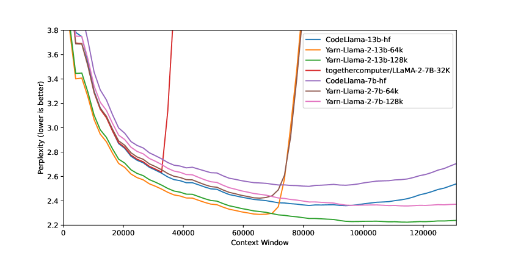
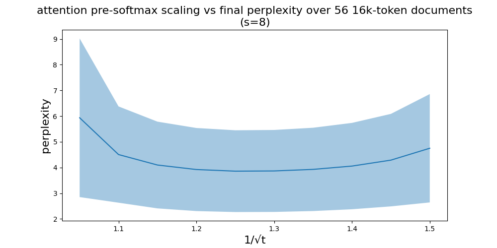
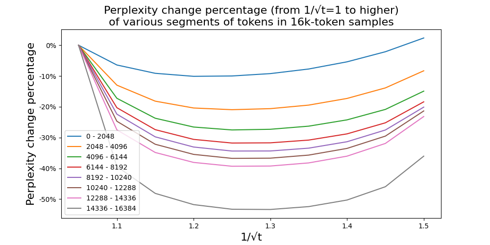
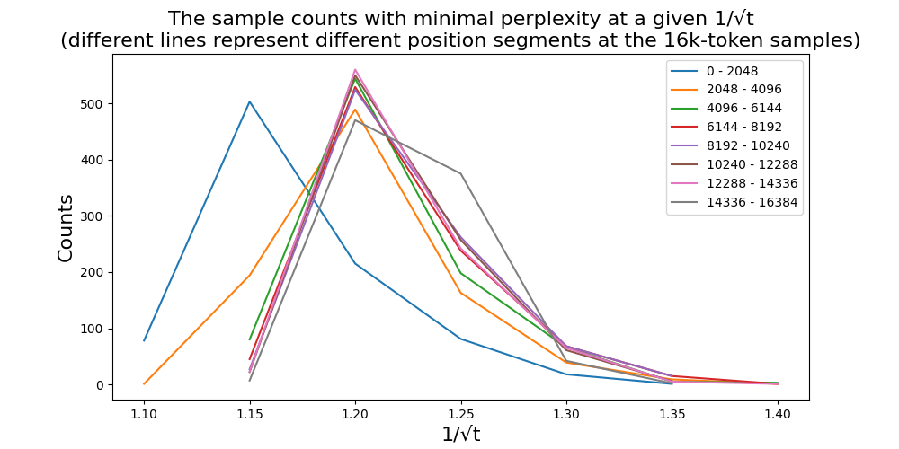
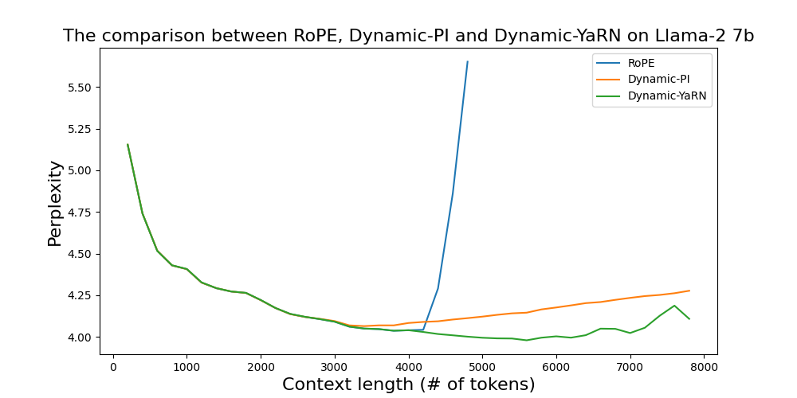
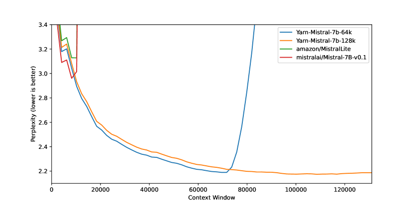

# YaRN: 大規模言語モデルの効率的な文脈窓拡張

> 原題: YaRN: Efficient Context Window Extension of Large Language Models
> 著者: Bowen Peng (Nous Research), Jeffrey Quesnelle (Nous Research), Honglu Fan (EleutherAI / University of Geneva), Enrico Shippole
> 出典: arXiv:2309.00071（2023 年 8 月）
> 公開コード: https://github.com/jquesnelle/yarn

## Abstract（要旨）

Rotary Position Embeddings（RoPE, [[sources/roformer]]）は Transformer ベースの言語モデルで位置情報を効果的に符号化することが示されている。しかし、これらモデルは訓練された系列長を超えて汎化できない。我々は **YaRN（Yet another RoPE extensioN method）** を提示する。これは、このようなモデルの文脈窓を拡張する計算効率的な手法で、**以前の手法より 10× 少ないトークンと 2.5× 少ない訓練ステップ**で済む。YaRN を使うことで、LLaMA モデルが元の事前学習が許す範囲よりはるかに長い文脈長を効果的に活用・外挿できることを示し、また文脈窓拡張における従来の SOTA を上回ることを実証する。さらに YaRN がファインチューニング・データセットの限られた文脈を超えて外挿する能力を持つことも示す。YaRN でファインチューンしたモデルは https://github.com/jquesnelle/yarn でオンラインで公開・再現されており、最大 128k 文脈長まで対応。

<figure>

<figcaption>図1: 10 個の 128k Proof-pile 文書を評価文脈窓サイズで切り詰めた場合のスライディング・ウィンドウ perplexity（S=256）。YaRN（s=32）が 128k まで perplexity が低下し続ける一方、PI は 8k を超えると爆発し、NTK は 100k 付近で増加する。</figcaption>
</figure>

## 1 Introduction（はじめに）

Transformer ベースの大規模言語モデル（LLM）は、**in-context learning（ICL, 文脈内学習）** のような長距離能力が重要な多くの自然言語処理タスクで、ほぼ普遍的な選択となっている。NLP タスク実行において、訓練過程で決まる系列の最大長（**文脈窓, context window**）は事前学習済み LLM の主要な制限の 1 つだった。少量のファインチューニングで（あるいはファインチューニングなしで）動的に文脈窓を拡張できることがますます望まれている。この目的のため、Transformer の位置エンコーディングが議論の中心にある。

オリジナル Transformer は絶対正弦波位置エンコーディングを使い、後に学習可能絶対位置エンコーディングに改良された。それ以来、相対位置エンコーディング体系が Transformer の性能をさらに改善した。現在、最も人気のある相対位置エンコーディングは **T5 Relative Bias**、**RoPE**、**XPos**、**ALiBi** である。

位置エンコーディングの再発する制限の 1 つは、訓練時に見た文脈窓を超えて汎化できないこと。ALiBi など一部の手法は限定的な汎化が可能だが、事前学習長より有意に長い系列に汎化できる手法はない。

このような制限を克服する研究がいくつかある。Chen ら（[^9]）と並行して Kaiokendev（[^21]）は、**Position Interpolation（PI, 位置補間）** で RoPE を少し修正し少量データでファインチューンすることで文脈長拡張を提案した。代替として bloc97（[^6]）は高周波情報の損失を考慮した **「NTK-aware」補間** を提案した。それ以来、「NTK-aware」補間の 2 つの改良が提案されている：

- **「Dynamic NTK」補間** [^14]: ファインチューニングなしの事前学習済みモデル向け
- **「NTK-by-parts」補間** [^7]: 少量の長文脈データでファインチューンした場合に最良の性能

「NTK-aware」補間と「Dynamic NTK」補間は既にオープンソース・モデルで採用されている：Code Llama [^31]（「NTK-aware」補間）と Qwen 7B [^2]（「Dynamic NTK」）。

本論文では、「NTK-aware」、「Dynamic NTK」、「NTK-by-parts」補間に関する以前の未発表研究を完全に説明することに加え、**YaRN（Yet another RoPE extensioN method）** を提示する。これは RoPE で訓練されたモデル（LLaMA、GPT-NeoX、PaLM ファミリー等）の文脈窓を効率的に拡張する改良手法。

YaRN は **元の事前学習データの約 0.1% 未満**でファインチューンした後、文脈窓拡張で SOTA 性能を達成する。同時に、推論時技法 **Dynamic Scaling** と組み合わせることで、**Dynamic-YaRN** はファインチューニングなしで **2 倍以上の文脈窓拡張**を可能にする。

## 2 Background and Related Work（背景と関連研究）

### 2.1 Rotary Position Embeddings（RoPE）

我々の研究の基礎は **[[sources/roformer|RoPE]]** [^34]。隠れニューロンの集合 $D$ を持つ隠れ層で作業する。ベクトル系列 $\mathbf{x}_{1},\cdots,\mathbf{x}_{L}\in\mathbb{R}^{|D|}$ が与えられたとき、attention 層はまずベクトルを query/key ベクトルに変換する：

$$
\mathbf{q}_{m}=f_{q}(\mathbf{x}_{m},m)\in\mathbb{R}^{|D|},\quad \mathbf{k}_{n}=f_{k}(\mathbf{x}_{n},n)\in\mathbb{R}^{|D|}
$$

次に attention 重みは以下で計算される：

$$
\text{softmax}\left(\dfrac{\mathbf{q}_{m}^{T}\mathbf{k}_{n}}{\sqrt{|D|}}\right) \tag{2}
$$

ここで $\mathbf{q}_{m},\mathbf{k}_{n}$ は列ベクトルとして扱う。RoPE では $|D|$ が偶数と仮定し、埋め込み空間と隠れ状態を複素ベクトル空間として同一視する：$\mathbb{R}^{|D|}\cong\mathbb{C}^{|D|/2}$。複素座標で関数 $f_{q},f_{k}$ は以下：

$$
f_{q}(\mathbf{x}_{m},m)=e^{im\theta}\mathbf{W}_{q}\mathbf{x}_{m},\quad f_{k}(\mathbf{x}_{n},n)=e^{in\theta}\mathbf{W}_{k}\mathbf{x}_{n}
$$

ここで $\theta=\text{diag}(\theta_{1},\cdots,\theta_{|D|/2})$ は対角行列で **$\theta_{d}=b^{-2d/|D|}$、$b=10000$**。この方法で RoPE は各（複素値の）隠れニューロンを別々の周波数 $\theta_{d}$ と関連付ける。利点は **query と key の内積が相対距離 $m-n$ のみに依存する**：

$$
\langle f_{q}(\mathbf{x}_{m},m), f_{k}(\mathbf{x}_{n},n)\rangle = g(\mathbf{x}_{m},\mathbf{x}_{n},m-n)
$$

実座標では RoPE は以下のブロック対角回転行列で書ける：

$$
f_{\mathbf{W}}(\mathbf{x}_{m},m,\theta_{d}) = \begin{pmatrix}\cos m\theta_{1}&-\sin m\theta_{1}&0&0&\cdots&0&0\\ \sin m\theta_{1}&\cos m\theta_{1}&0&0&\cdots&0&0\\ 0&0&\cos m\theta_{2}&-\sin m\theta_{2}&\cdots&0&0\\ 0&0&\sin m\theta_{2}&\cos m\theta_{2}&\cdots&0&0\\ \vdots&\vdots&\vdots&\vdots&\ddots&\vdots&\vdots\\ 0&0&0&0&\cdots&\cos m\theta_{l}&-\sin m\theta_{l}\\ 0&0&0&0&\cdots&\sin m\theta_{l}&\cos m\theta_{l}\\ \end{pmatrix}\mathbf{W}\mathbf{x}_{m}
$$

### 2.2 Position Interpolation（位置補間, PI）

言語モデルは通常固定文脈長で事前学習されるため、相対的に少量のデータでファインチューンして文脈長を拡張する方法を問うのは自然である。RoPE を位置埋め込みとして使う言語モデルに対し、Chen ら（[^9]）と並行して Kaiokendev（[^21]）は、事前学習限界を超えて文脈長を拡張する **Position Interpolation（PI）** を提案した。**直接的な外挿は事前学習限界 $L$ より長い系列 $w_{1},\cdots,w_{L}$ ではうまく機能しない**が、彼らは **事前学習限界内に位置インデックスを補間** することは少量のファインチューニングの助けでうまく機能することを発見した。具体的には、RoPE 付き事前学習済み言語モデルが与えられたとき、RoPE を以下のように修正する：

$$
f^{\prime}_{\mathbf{W}}(\mathbf{x}_{m},m,\theta_{d}) = f_{\mathbf{W}}\left(\mathbf{x}_{m},\dfrac{mL}{L^{\prime}},\theta_{d}\right) \tag{10}
$$

ここで $L^{\prime}>L$ は事前学習限界を超えた新しい文脈窓。修正された RoPE 公式と事前学習済みモデルで、彼らは **数桁少ないトークン**（[^9] では数十億）で言語モデルをさらにファインチューンし、文脈窓拡張に成功した。

### 2.3 Additional Notation（追加表記）

拡張された文脈長と元の文脈長の比は特に重要で、以下の表記 $s$ を導入する：

$$
s=\frac{L^{\prime}}{L}
$$

これを **スケール係数（scale factor）** と呼ぶ。

Eq. 10 を以下の一般形に書き換え・単純化する：

$$
f^{\prime}_{\mathbf{W}}(\mathbf{x}_{m},m,\theta_{d}) = f_{\mathbf{W}}(\mathbf{x}_{m},g(m),h(\theta_{d})) \tag{12}
$$

ここで $g(m),h(\theta_{d})$ は手法依存の関数。PI では $g(m)=m/s,\ h(\theta_{d})=\theta_{d}$。

加えて、$d$ 番目の隠れ次元の RoPE 埋め込みの **波長（wavelength）** を $\lambda_{d}$ で定義：

$$
\lambda_{d}=\dfrac{2\pi}{\theta_{d}}=2\pi b^{\frac{2d}{|D|}} \tag{13}
$$

波長は次元 $d$ の RoPE 埋め込みが完全な回転（$2\pi$）を行うのに必要なトークン長を表す。

一部の補間手法（PI など）は次元の波長を気にしないため、これらの手法を **「ブラインド（blind）」補間手法** と呼び、気にする他の手法（YaRN 等）を **「ターゲット（targeted）」補間手法** と分類する。

## 3 Methodology（手法論）

PI が全 RoPE 次元を等しく引き伸ばすのに対し、PI による理論的補間境界は RoPE と LLM の内部埋め込み間の複雑な力学を予測するには不十分であることを我々は見出す。以下の節では、我々が個別に特定し解決した PI の主要問題を記述し、それらを協調して使うことで完全な YaRN 手法を得る道筋を読者に与える。

### 3.1 Loss of High Frequency information - "NTK-aware" interpolation（高周波情報の損失 — NTK-aware 補間）

RoPE を情報符号化の観点のみから見れば、Neural Tangent Kernel（NTK）理論を使って、入力次元が低く対応する埋め込みが高周波成分を欠く場合、**深層ニューラルネットは高周波情報の学習に苦労する**ことが示されている [^36]。ここに類似性が見える：トークンの位置情報は 1 次元で、RoPE はそれを n 次元の複素ベクトル埋め込みに拡張する。

RoPE は **Fourier Features [^36] に多くの点で似ており**、実際 RoPE を Fourier Feature の特別な 1D ケースとして定義できる。**RoPE 埋め込みを無差別に引き伸ばすと、ネットワークがほぼ同一で非常に近い 2 トークンを解像するために必要な重要な高周波詳細を失う**（最小距離を表す回転がネットワークに検出できないほど小さくなる）。

我々は、PI でより大きな文脈サイズでファインチューンした後の短文脈でのわずかな perplexity 増加 [^9] がこの問題に関連しているかもしれないと仮説立てる。理想的状況では、より大きな文脈サイズでのファインチューニングが小さな文脈サイズでの性能を劣化させる理由はない。

RoPE 埋め込みを補間する際の高周波情報損失問題を解決するため、**「NTK-aware」補間** が [^6] で開発された。RoPE の全次元をスケール係数 $s$ で等しくスケールする代わりに、**補間圧力を複数次元にわたって分散させる**：高周波数をより小さくスケールし、低周波数をより大きくスケールする。最も単純な方法は **$\theta$ の値で基底変換** を行うこと。

##### 定義 1（NTK-aware 補間）

**「NTK-aware」補間** は Eq. 12 で以下の関数を使う RoPE の修正である：

$$
g(m) = m, \quad h(\theta_{d}) = {b^{\prime}}^{-2d/|D|}
$$

ここで $b^{\prime}=b\cdot s^{\frac{|D|}{|D|-2}}$。

この手法は [^6] の結果から、非ファインチューンモデルの文脈サイズ拡張で PI よりはるかに良い性能。しかし主要な欠点は **これは単なる補間ではなく一部次元は「境界外」値にわずかに外挿** されること。よって「NTK-aware」補間でのファインチューニングは PI より劣る結果となる。さらに「境界外」値のため、**理論的スケール係数 $s$ が真の文脈拡張スケールを正確に記述しない**。実践では $s$ を期待スケールより高く設定する必要がある。

本論文公開直前に Code Llama [^31] が公開され、**基底 $b$ を手動で 1M にスケールする「NTK-aware」スケーリングを使用**することに留意。

### 3.2 Loss of Relative Local Distances - "NTK-by-parts" interpolation（相対局所距離の損失 — NTK-by-parts 補間）

PI や「NTK-aware」のようなブラインド補間手法では、全 RoPE 隠れ次元を等しく扱う（ネットワークへの影響が同じ）。しかし **ターゲット補間手法の必要性を示す強い手がかり**がある。

本節では Eq. 13 で定義した波長 $\lambda_{d}$ で大いに考える。簡潔のため $\lambda_{d}$ の添字 $d$ を省略し、読者は $\lambda$ を任意の周期関数の波長と考えることを推奨。

RoPE 埋め込みの興味深い観察の 1 つは、**与えられた文脈サイズ $L$ で、波長が事前学習の最大文脈長より長い次元 $d$ が存在する**（$\lambda > L$）こと。これは一部次元の埋め込みが回転領域で均等に分布しない可能性を示唆。そのような場合、全てのユニークな位置対を持つことは絶対位置情報が無傷であることを暗示する。逆に **波長が短い場合、ネットワークは相対位置情報のみアクセス可能**。

さらに、RoPE 全次元をスケール $s$ または基底変換 $b^{\prime}$ で引き伸ばすと、**全トークンが互いに近づく**（2 ベクトルが小さく回転すると内積が大きくなる）。このスケーリングは **LLM の内部埋め込み間の小さな局所関係を理解する能力を著しく損なう**。我々はこの圧縮が **近接トークンの位置順序でモデルが混乱し**、モデル能力を害すると仮説立てる。

この問題を解決するため、上記 2 つの観察から、**高周波次元は補間せず、低周波次元は常に補間する**ことを選ぶ。具体的には：

- 波長 $\lambda$ が文脈サイズ $L$ より遥かに小さい場合：**補間しない**
- 波長 $\lambda$ が文脈サイズ $L$ 以上の場合：**補間のみで外挿を避ける**（以前の「NTK-aware」と異なる）
- 中間の次元：両者の混合（「NTK-aware」に類似）

結果として、元の文脈サイズ $L$ と波長 $\lambda$ の比 $r=\frac{L}{\lambda}$ を導入することが便利。$d$ 番目の隠れ状態で、比 $r$ は以下のように $d$ に依存：

$$
r(d) = \dfrac{L}{\lambda_{d}} = \dfrac{L}{2\pi b^{\prime\frac{2d}{|D|}}}
$$

異なる補間戦略の境界を定義するため、2 つの追加パラメータ $\alpha,\beta$ を導入。$r(d)<\alpha$ の全隠れ次元 $d$ では PI と同じく線形補間（外挿を避ける）、$r(d)>\beta$ では全く補間しない。**ramp 関数 $\gamma$** を定義：

$$
\gamma(r)=\begin{cases}0,&\text{if }r<\alpha\\ 1,&\text{if }r>\beta\\ \dfrac{r-\alpha}{\beta-\alpha},&\text{otherwise}\end{cases}
$$

##### 定義 2（NTK-by-parts 補間）

**「NTK-by-parts」補間** は Eq. 12 で以下の関数を使う RoPE の修正：

$$
g(m) = m, \quad h(\theta_{d}) = \Big(1-\gamma\big(r(d)\big)\Big)\frac{\theta_{d}}{s} + \gamma\big(r(d)\big)\theta_{d}
$$

$\alpha$ と $\beta$ の値はケースバイケースで調整。たとえば **Llama ファミリーでは $\alpha=1, \beta=32$** が良いことを実験的に発見。

本節の技法を使った変種が「NTK-by-parts」補間 [^7] として公開された。**この改良手法は非ファインチューンモデル・ファインチューンモデル両方で、以前の PI と「NTK-aware」より良い性能**を示す。

### 3.3 Dynamic Scaling - "Dynamic NTK" interpolation（動的スケーリング — Dynamic NTK 補間）

多くのユースケースで、1 から最大文脈サイズまでの様々な系列長で複数の forward-pass を行う。典型的例は系列長がステップごとに 1 ずつ増加する自己回帰生成。スケール係数 $s$ を使う補間手法（PI、NTK-aware、NTK-by-parts 含む）を適用する 2 つの方法：

1. **推論サイクル全体で埋め込み層を固定**、スケール係数 $s=L^{\prime}/L$ も固定（$L^{\prime}$ は拡張文脈サイズの固定値）
2. **各 forward-pass で位置埋め込みがスケール係数を更新**：$s=\text{max}(1, l^{\prime}/L)$（$l^{\prime}$ は現在の系列長）

(1) の問題は **モデルが $L$ 未満で性能低下を経験し、$L^{\prime}$ を超えると急激な劣化**。(2) の **Dynamic Scaling** では、訓練文脈限界 $L^{\prime}$ に達したとき即座に壊れるのではなく **優雅に劣化** できる。これを推論時手法 **Dynamic Scaling** と呼ぶ。「NTK-aware」と組み合わせると **「Dynamic NTK」補間**。これは [^14] の reddit 投稿で最初に公開された。

特筆すべきは、**「Dynamic NTK」補間は $L$ で事前学習されたモデルでファインチューニングなし（$L^{\prime}=L$）でも例外的によく機能する**こと。これは Appendix B.3 の実験で裏付けられる。

反復 forward-pass では kv キャッシング [^8] がよく適用され、以前の key-value ベクトルを再利用して全体効率を改善できる。**Dynamic Scaling with kv キャッシングのためには、RoPE 埋め込みのキャッシュに注意が必要**。正しい実装は **RoPE 適用前に kv 埋め込みをキャッシュすべき**。$s$ が変わると全トークンの RoPE 埋め込みが変わるため。

### 3.4 YaRN

以前の補間技法に加え、**attention softmax 前のロジットに温度 $t$ を導入する**ことが、データサンプルとトークン位置に関わらず perplexity に一様な影響を持つことを観察する（Appendix A.2 参照）。具体的に、Eq. 2 の代わりに attention 重みの計算を以下に修正：

$$
\text{softmax}\left(\dfrac{\mathbf{q}_{m}^{T}\mathbf{k}_{n}}{t\sqrt{|D|}}\right) \tag{21}
$$

RoPE を 2D 行列集合として再パラメータ化することは、この attention スケーリング実装に明確な利益をもたらす：「**長さスケーリング**」トリックで $\mathbf{q}_{m}$ と $\mathbf{k}_{n}$ の両方を定数係数 $\sqrt{1/t}$ でスケールし、複素 RoPE 埋め込みを同じだけスケールするだけで実現できる。これで **YaRN はコード変更なしに効果的に attention 機構を変更**できる。さらに **推論時・訓練時の両方でゼロオーバーヘッド**（RoPE 埋め込みは事前生成され全 forward-pass で再利用される）。「NTK-by-parts」補間と組み合わせて **YaRN 手法**を得る。

##### 定義 3（YaRN 手法）

**YaRN 手法**とは、**Eq. 21 の attention スケーリングと Section 3.2 の「NTK-by-parts」補間の組み合わせ**を指す。

LLaMA と Llama 2 モデルでは以下の値を推奨：

$$
\sqrt{\frac{1}{t}} = 0.1\ln(s) + 1 \tag{22}
$$

この式は **LLaMA 7b、13b、33b、65b モデルでファインチューニングなしに「NTK-by-parts」を使い様々な $s$ で最小 perplexity に対する $\sqrt{1/t}$ をフィッティング**して得た。同じ $t$ の値は **Llama 2 モデル（7b、13b、70b）にもかなりよく適用**される。これは **増加エントロピーと温度定数 $t$ の性質が一定の「普遍性」を持ち、いくつかのモデルと訓練データに一般化可能**であることを示唆。

YaRN 手法は我々の全発見を組み合わせ、**ファインチューンと非ファインチューンのシナリオの両方で以前の全手法を上回る**。低フットプリントのおかげで YaRN は **Flash Attention 2 [^13]** のような attention 機構を変更するライブラリと直接互換。

## 4 Experiments（実験）

YaRN が RoPE を位置埋め込みとする言語モデルの文脈窓拡張に成功することを示す。さらにこの結果は **わずか 400 訓練ステップ**で達成され、モデルの元の事前学習コーパスの約 **0.1% で実現**、[^31] から **10× 削減**、[^9] から訓練ステップで **2.5× 削減**で、追加の推論コストなしで高い計算効率を達成。長文書の perplexity を計算し、確立されたベンチマークでスコアして評価し、他のすべての文脈窓拡張手法を上回ることを発見。我々は [^9] の訓練と評価手順に大まかに従った。

### 4.1 Training（訓練）

訓練のため、**Llama 2 [^39] 7B と 13B パラメータ・モデルを拡張**。LLaMA モデル・アーキテクチャは Section 3.4 で記述した埋め込み周波数の計算以外変更なし（$s=16$ と $s=32$）。

学習率 $2\times 10^{-5}$、weight decay なし、20 ステップ線形ウォームアップ、AdamW [^24]（$\beta_{1}=0.9, \beta_{2}=0.95$）。$s=16$ ではグローバル・バッチサイズ 64 で 400 ステップ・ファインチューン、PyTorch の Fully Sharded Data Parallelism [^42] と Flash Attention 2 [^13] を使い、**PG19 データセット [^29] を 64k セグメントに分割し BOS/EOS トークンで挟む**。$s=32$ では同じ手順だが、終了 $s=16$ チェックポイントから始め追加 200 ステップ訓練。

### 4.2 Extrapolation and Transfer Learning（外挿と転移学習）

Code Llama [^31] では **16k 文脈データセットでスケール係数 $s\approx 88.6$ を設定**（355k 文脈サイズ対応）。ネットワークは訓練中にそれら文脈サイズを見ずに **100k 文脈まで外挿**することを示す。同様に YaRN も **データセット長より高いスケール係数 $s$ で訓練**することをサポート。計算制約のため、64k 文脈の同じデータセットで $s=16$ モデルを 200 ステップさらにファインチューンして $s=32$ のみテスト。

Section 4.3.1 で **$s=32$ モデルが訓練中 64k 文脈のみで 128k 文脈まで成功外挿**することを示す。以前の「ブラインド」補間手法と異なり、**YaRN はスケール $s$ を増加させる転移学習で遥かに効率的**。これは、$s=32$ モデルが全文脈サイズで $s=16$ モデルと等価で、200 ステップしか $s=32$ で訓練していないにもかかわらず、**ネットワークが補間埋め込みを再学習する必要なし**で転移学習に成功することを実証。

### 4.3 Evaluation（評価）

評価は 3 側面に焦点：
1. **拡張文脈窓を持つファインチューン・モデルの perplexity スコア**
2. ファインチューン・モデルの **passkey 検索タスク**
3. ファインチューン・モデルの **一般 LLM ベンチマーク結果**

#### 4.3.1 Long Sequence Language Modeling（長系列言語モデリング）

長系列言語モデリング性能評価のため、長系列サンプルを多く含む **GovReport [^18] と Proof-pile [^4] データセット**を使う。全評価でこれらの test split のみ使用。全 perplexity 評価は [^27] のスライディング・ウィンドウ法（$S=256$）で計算。

まず文脈窓を増加させたモデル性能を評価。**Proof-pile から少なくとも 128k トークンの 10 サンプルをランダム選択**し、2k トークンから 128k トークンの系列長で 2k ステップごとに切り詰めた各サンプルの perplexity を評価。

Table 1 は **PI、NTK-aware、YaRN で 4096 から 8192 文脈長に拡張した Llama-2 モデル**の比較を示す。PI と「NTK-aware」モデルは [^9] の手順で訓練、YaRN は同じ手順だが **2.5× 少ない訓練ステップとデータ**。

**表 1**: Llama-2 を PI / NTK / YaRN で拡張、10 個の 128k Proof-pile 文書のスライディング・ウィンドウ perplexity（$S=256$）

| 拡張手法 | 訓練トークン | 文脈窓 | 2048 | 4096 | 6144 | 8192 | 10240 |
|---|---|---|---|---|---|---|---|
| PI ($s=2$) | 1B | 8k | 3.92 | 3.51 | 3.51 | 3.34 | 8.07 |
| NTK ($\theta=20$k) | 1B | 8k | 4.20 | 3.75 | 3.74 | 3.59 | 6.24 |
| **YaRN ($s=2$)** | **400M** | 8k | **3.91** | **3.50** | 3.51 | **3.35** | **6.04** |

さらに $s=16, 32$ で YaRN を評価し、32k 文脈窓を超えて拡張された Llama-2 由来のオープンソース・モデル（Together.ai [^37]、Code Llama [^31] の「NTK-aware」）と比較。結果は Table 2（詳細プロットは Figure 1）。

**表 2**: 10 個の 128k Proof-pile 文書を評価文脈窓で切り詰めた場合のスライディング・ウィンドウ perplexity（$S=256$）

| サイズ | モデル | 文脈窓 | 拡張法 | 8192 | 32768 | 65536 | 98304 | 131072 |
|---|---|---|---|---|---|---|---|---|
| 7B | Together | 32k | PI | 3.50 | 2.64 | $>10^2$ | $>10^3$ | $>10^4$ |
| 7B | Code Llama | 100k | NTK | 3.71 | 2.74 | 2.55 | 2.54 | 2.71 |
| 7B | **YaRN ($s=16$)** | 64k | YaRN | 3.51 | 2.65 | **2.42** | $>10^1$ | $>10^1$ |
| 7B | **YaRN ($s=32$)** | **128k** | YaRN | 3.56 | 2.70 | 2.45 | **2.36** | **2.37** |
| 13B | Code Llama | 100k | NTK | 3.54 | 2.63 | 2.41 | 2.37 | 2.54 |
| 13B | **YaRN ($s=16$)** | 64k | YaRN | **3.25** | **2.50** | 2.29 | $>10^1$ | $>10^1$ |
| 13B | **YaRN ($s=32$)** | **128k** | YaRN | 3.29 | 2.53 | 2.31 | **2.23** | **2.24** |

**全ターゲット文脈サイズで強い性能を示し、YaRN 補間は Llama 2 の有効文脈サイズを 128k に拡張する最初の手法**となった。特筆すべきは **YaRN ($s=32$) モデルが訓練データを 64k に制限したにもかかわらず 128k まで perplexity が低下し続け**、**モデルが未見の文脈長に汎化できる**ことを実証している点。

さらに Appendix B.1 で **少なくとも 16k トークンの 50 GovReport 文書を 32k 最大文脈窓で評価**した結果も示す（Table 4）。Proof-pile と同様、GovReport も **YaRN ファインチューニングが長系列で良い性能**を達成することを示す。

#### 4.3.2 Passkey Retrieval（パスキー検索）

[^25] で定義された passkey 検索タスクは、**大量の無意味テキストの中から単純な passkey（5 桁数字）を検索する能力を測る**。我々の評価では、passkey を 8k から 128k までの異なる文脈窓サイズで一様分布のランダム位置に配置して 10 反復実行。**YaRN で 128k 文脈サイズにファインチューンした 7b/13b モデル両方が、全文脈窓サイズで非常に高い精度（>99%）でパスキー検索に合格**。詳細は Appendix B.2。

#### 4.3.3 Standardized Benchmarks（標準化ベンチマーク）

**Hugging Face Open LLM Leaderboard** は 4 つの公開ベンチマークで LLM を比較：25-shot ARC-Challenge、10-shot HellaSwag、5-shot MMLU、0-shot TruthfulQA。

文脈拡張下でのモデル性能劣化テストのため、このスイートでモデルを評価し Llama 2 ベースライン・公開 PI・「NTK-aware」モデルと比較。結果は Table 3。

**表 3**: Hugging Face Open LLM ベンチマーク・スイートでの文脈窓拡張手法の性能と Llama 2 ベースライン比較

| サイズ | モデル | 文脈窓 | 拡張法 | ARC-c | Hellaswag | MMLU | TruthfulQA |
|---|---|---|---|---|---|---|---|
| 7B | Llama 2 | 4k | None | 53.1 | 77.8 | 43.8 | 39.0 |
| 7B | Together | 32k | PI | 47.6 | 76.1 | 43.3 | 39.2 |
| 7B | Code Llama | 100k | NTK | 39.9 | 60.8 | 31.1 | 37.8 |
| 7B | **YaRN ($s=16$)** | 64k | YaRN | **52.3** | **78.8** | **42.5** | 38.2 |
| 7B | **YaRN ($s=32$)** | 128k | YaRN | 52.1 | 78.4 | 41.7 | 37.3 |
| 13B | Llama 2 | 4k | None | 59.4 | 82.1 | 55.8 | 37.4 |
| 13B | Code Llama | 100k | NTK | 40.9 | 63.4 | 32.8 | **43.8** |
| 13B | **YaRN ($s=16$)** | 64k | YaRN | **58.1** | **82.3** | **52.8** | 37.8 |
| 13B | **YaRN ($s=32$)** | 128k | YaRN | 58.0 | 82.2 | 51.9 | 37.3 |

**YaRN モデルと Llama 2 ベースラインの間に最小限の性能劣化**を観察。YaRN $s=16$ と $s=32$ モデル間でスコア平均 **0.49% 低下**。**64k から 128k への反復拡張は無視可能な性能損失**と結論。

## 5 Conclusion（結論）

我々は YaRN がすべての既存 RoPE 補間手法を改善し、**PI のドロップイン置換**として欠点なし・最小限の実装労力で機能できることを示した。ファインチューンしたモデルは **複数のベンチマークで元の能力を保持しつつ、非常に大きな文脈サイズに注意可能**。さらに YaRN は **短いデータセットでのファインチューニングによる効率的な外挿**を可能にし、**転移学習を活用して高速収束**でき、両者とも計算制約シナリオで重要。最後に YaRN による外挿の有効性を示し、**「短く訓練して長くテスト（train short, test long）」**を可能にする。

## 6 Reproducibility（再現性）

再現性を助けるため、Table 2 の YaRN モデル訓練に使ったコードと、Figure 1、Tables 1, 2, 3, 4, 5 を生成した評価コードを補足資料として提供。コードには論文中で参照される様々な拡張手法の実装も含む。YaRN 訓練には公開 **PG19 データセット [^29] を 64k トークン**にトークン化したものを使用。

---

## Appendix A: Additional details on interpolation methods（補間手法に関する追加詳細）

### A.1 Short notes on the deduction of "NTK-aware" interpolation（NTK-aware 補間の導出）

Section 3.1 で「NTK-aware」補間定義に基底 $b$ から $b^{\prime}$ への変更を導入した。ここに数学的導出の簡潔なノート。

我々の目的は、**補間圧力を周波数を固定係数 $s$ でスケールするのではなく基底変換で隠れ次元にわたって分散させる**こと。保証したい性質は：**最低周波数は線形位置スケーリングと同じだけスケールされ、最高周波数は一定を保つ**。

新しい基底 $b^{\prime}$ を導入し、**最終次元の波長がスケール係数 $s$ の線形補間の波長と一致**するようにする。元の RoPE 手法は $\cos(\frac{2\pi x}{\lambda})$ と $\sin(\frac{2\pi x}{\lambda})$ 成分を単一埋め込みに連結するため奇数次元をスキップするので、最終次元 $d\in D$ は $|D|-2$。

新しい基底 $b^{\prime}$ は以下を満たすよう選ぶ：

$$
{b^{\prime}}^{\frac{|D|-2}{|D|}} = s\cdot b^{\frac{|D|-2}{|D|}}
$$

$b^{\prime}$ について解いて：

$$
b^{\prime} = b\cdot s^{\frac{|D|}{|D|-2}}
$$

### A.2 The impact of pre-softmax scaling of YaRN on perplexity（YaRN の pre-softmax スケーリングの perplexity への影響）

Section 3.4 で attention 重みの softmax 計算内の係数 $t$ の影響を言及した。ここで **RedPajama [^12] からの 896 個の 16k トークン文書**を固定し、異なるスケーリング $1/\sqrt{t}$ で perplexity スコアを計算。結果は Figure 2。比較のため、この場合（$s=8$）の推奨係数：

$$
\sqrt{\frac{1}{t}} = 0.1\ln(s) + 1 \approx 1.208
$$

<figure>

<figcaption>図2: s=8 を固定、異なる 1/sqrt(t) スケーリングでの LLaMA 7b の 896 個の 16k トークン文書での perplexity 比較。陰影領域は標準偏差（68%）を表す。</figcaption>
</figure>

異なるトークン位置への $1/\sqrt{t}$ の影響を示すため、各 16k トークン文書を 2048 トークンのチャンクに切り、各チャンクの $t=1$ との perplexity 変化平均（百分率）をプロット：

$$
\dfrac{\text{ppl}(t) - \text{ppl}(t=1)}{\text{ppl}(t=1)}
$$

プロットは Figure 3。

<figure>

<figcaption>図3: s=8 を固定、異なるトークン位置セグメントでの perplexity 変化百分率の平均を、896 個の 16k トークン文書で異なる 1/sqrt(t) スケーリングで比較。</figcaption>
</figure>

異なるトークン位置でのサンプル全体での $t$ の最良値をさらに実証するため、16k トークン範囲の 8 位置セグメントごとに、与えられた $1/\sqrt{t}$ で最小 perplexity を持つサンプル数を Figure 4 にプロット。

<figure>

<figcaption>図4: 16k トークン範囲の与えられたトークン位置セグメントで、与えられた 1/sqrt(t) で最小 perplexity を持つサンプル数（896 サンプル中）。</figcaption>
</figure>

観察結果：

- **適切な $t$ では、サンプルが拡張文脈窓全体で良い perplexity スコアを得られる**
- **$t$ の最良値は異なるサンプル・位置でほぼ一貫**

この発見は **異なる $s$ 値で一貫**しており、$t$ の最良値は推奨公式（Eq. 22）に近い。

## Appendix B: Additional tables and charts（追加表とチャート）

### B.1 GovReport evaluations（GovReport 評価）

Section 4.3.1 で言及した GovReport 文書の評価結果を Table 4 に詳述。

**表 4**: 50 個の長い GovReport 文書を固定 32k 文脈窓サイズで評価したスライディング・ウィンドウ perplexity（$S=256$）

| サイズ | モデル | 文脈窓 | 拡張法 | Perplexity |
|---|---|---|---|---|
| 7B | Together | 32k | PI | 3.67 |
| 7B | Code Llama | 100k | NTK | 4.44 |
| 7B | **YaRN ($s=16$)** | 64k | YaRN | **3.59** |
| 7B | YaRN ($s=32$) | 128k | YaRN | 3.64 |
| 13B | Code Llama | 100k | NTK | 4.22 |
| 13B | **YaRN ($s=16$)** | 64k | YaRN | **3.35** |
| 13B | YaRN ($s=32$) | 128k | YaRN | 3.39 |

### B.2 Passkey Retrieval（パスキー検索）

**表 5**: 各種モデルのパスキー検索性能。passkey context はパスキー検索精度 ≥80% の最大テスト文脈窓サイズ、passkey accuracy はそれ以下の全テスト文脈サイズでのパスキー検索平均精度。

| サイズ | モデル | スケール係数 $s$ | 文脈窓 | 訓練データ文脈 | 拡張法 | パスキー文脈 | パスキー精度 |
|---|---|---|---|---|---|---|---|
| 7B | Together | 4 | 32k | 32k | PI | 32k | 100% |
| 7B | Code Llama | 88.6 | 100k | 16k | NTK | 112k | 94.3% |
| 7B | YaRN | 16 | 64k | 64k | YaRN | 64k | 96.3% |
| 7B | **YaRN** | **32** | **128k** | 64k | YaRN | **128k** | **99.4%** |
| 13B | Code Llama | 88.6 | 100k | 16k | NTK | 128k | 99.4% |
| 13B | YaRN | 16 | 64k | 64k | YaRN | 64k | 97.5% |
| 13B | **YaRN** | **32** | **128k** | 64k | YaRN | **128k** | **99.4%** |

ここで **最低 perplexity 点だけでは LLM が注意可能な「有効文脈サイズ」の包括的描写を提供しない**ことを観察。Code Llama 13b モデルは 100k 文脈長を超えると perplexity が増加するが、128k 文脈長でパスキーを正確に検索可能だった。これは **Code Llama の出力品質が 100k 文脈サイズを超えると劣化し始める可能性がある一方、強い検索能力は維持できる**ことを示唆。

加えて、YaRN $s=32$ が YaRN $s=16$ より 200 ステップ多く訓練され、類似の perplexity でパスキー精度が高いため、**perplexity が LLM が全トークンに注意できるかの良い指標ではない可能性**を仮説立てる。これはまた YaRN $s=16$ モデルがパスキー検索タスクに対して比較的訓練不足である可能性も示唆。

### B.3 Dynamic scaling on models without any fine-tuning（ファインチューニングなしモデルでの動的スケーリング）

Section 3.3 から再掲、**Dynamic Scaling 技法は PI、「NTK-by-parts」、YaRN のような補間手法で係数 $s$ を動的に更新する推論時技法**。**元の Llama 2 を選び、GovReport のサンプルを固定**、256 トークンのスライディング・ウィンドウで RoPE、Dynamic-PI、Dynamic-YaRN を使って perplexity を計算。

<figure>

<figcaption>図5: Llama 2 を使った長い GovReport サンプルでの RoPE、Dynamic-PI、Dynamic-YaRN の比較。このモデルは長文脈でファインチューンされていない。</figcaption>
</figure>

Llama 2 の元の最大文脈長は 4096 のため、Dynamic Scaling は推論長を効果的に拡張し、**Dynamic-YaRN は Dynamic-PI より良い性能**を達成。チャートは Figure 5。

観察：
- **Dynamic Scaling は事前学習文脈窓を超えた perplexity スコア爆発を効果的に防ぐ**
- **Dynamic-YaRN はファインチューニングなしの事前学習済み Llama 2 で長距離 perplexity で Dynamic-PI を上回る**

### B.4 Mistral

**Mistral 7B v0.1 モデル**（Llama アーキテクチャに概ね従う）も追加で拡張した。Mistral では **64k 文脈窓モデル（$s=8$）を 16k 系列長で 1000 ステップ訓練**、定数学習率 $1\times 10^{-6}$。**モデルのスライディング・ウィンドウ attention サイズを文脈窓サイズと等しく設定**し、効果的にスライディング・ウィンドウ attention を無効化。**さらに $s=16$ で 500 ステップ訓練し、128k 文脈窓モデルを得た**。訓練データは Together Computer の Long-Data Collections [^3] の pre-train と fine-tune split の混合。

Section 4.3.1 と同じ手順で評価し、**ベース v0.1 モデルと MistralLite [^1]（v0.1 の NTK-aware ($\theta=1$M) 版）と比較**。結果（Figure 6 と Table 6）は Llama ファミリーと一貫していた。

<figure>

<figcaption>図6: 10 個の 128k Proof-pile 文書を評価文脈窓サイズで切り詰めた場合の Mistral でのスライディング・ウィンドウ perplexity（S=256）。</figcaption>
</figure>

**表 6**: 10 個の 128k Proof-pile 文書のスライディング・ウィンドウ perplexity（$S=256$、Mistral）

| サイズ | モデル | 文脈窓 | 拡張法 | 4096 | 8192 | 16384 | 65536 | 131072 |
|---|---|---|---|---|---|---|---|---|
| 7B | Mistral v0.1 | 8k | - | 3.09 | 2.96 | 36.8 | $>10^3$ | $>10^3$ |
| 7B | MistralLite | 16k | NTK | 3.26 | 3.13 | 47.3 | $>10^3$ | $>10^3$ |
| 7B | **YaRN ($s=8$)** | 64k | YaRN | **3.18** | **3.04** | **2.65** | **2.20** | 57.4 |
| 7B | **YaRN ($s=16$)** | **128k** | YaRN | 3.21 | 3.08 | 2.68 | 2.24 | **2.19** |

