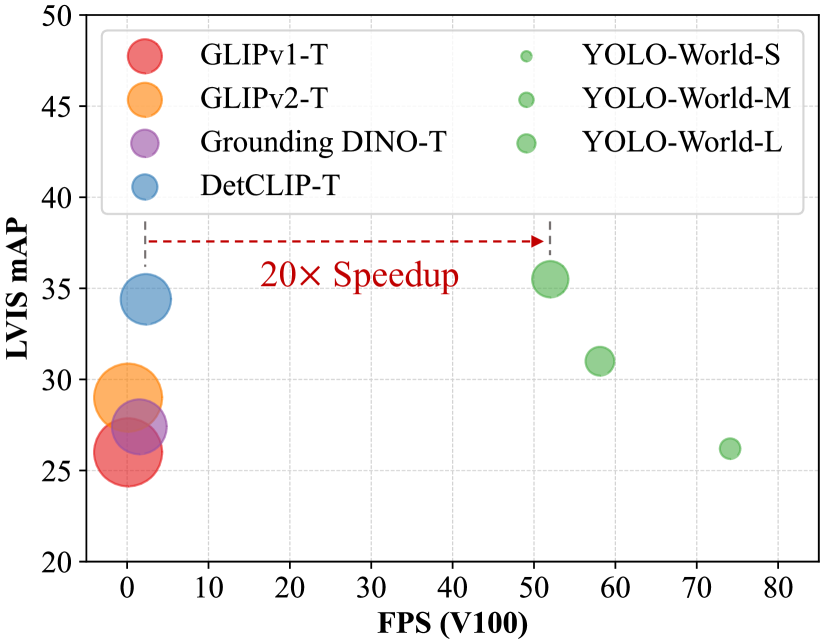
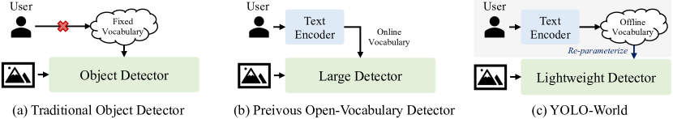
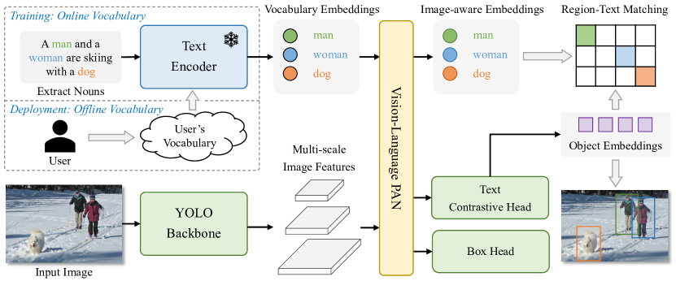
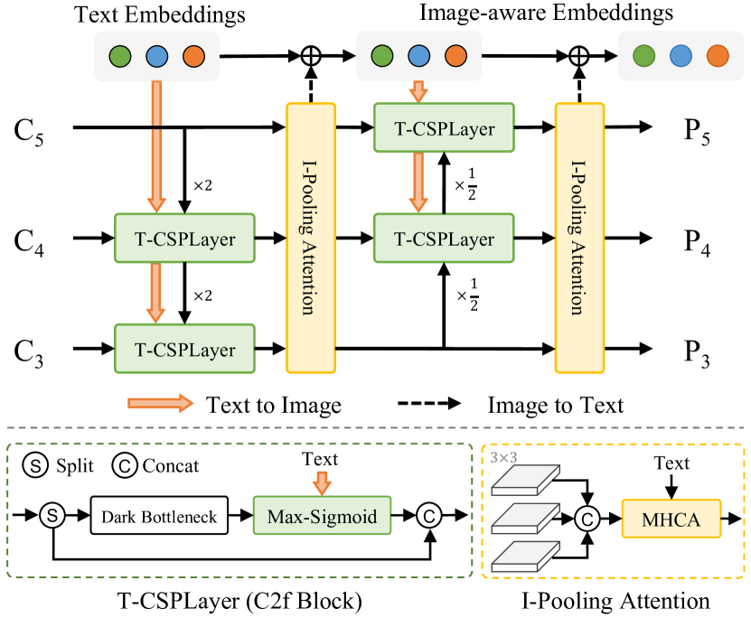
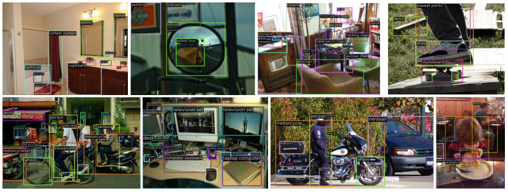
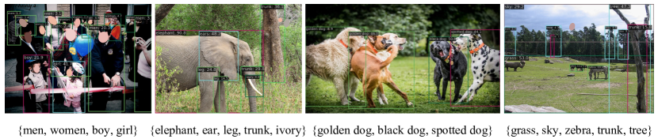
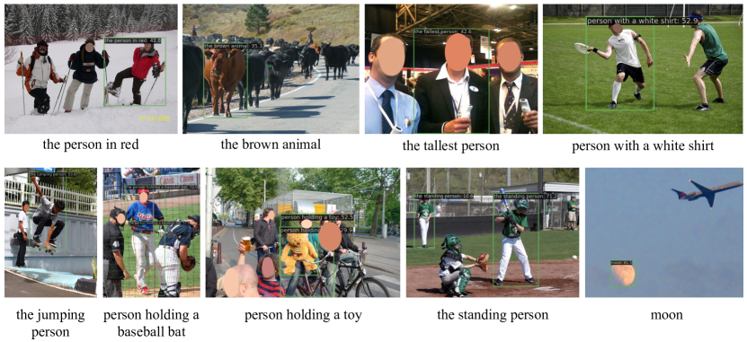

# YOLO-World: リアルタイム Open-Vocabulary 物体検出

> 原題: YOLO-World: Real-Time Open-Vocabulary Object Detection
> arXiv: 2401.17270
> 著者: Tianheng Cheng, Lin Song, Yixiao Ge, Wenyu Liu, Xinggang Wang, Ying Shan（Tencent AI Lab / ARC Lab, Tencent PCG / 華中科技大学）
> 出典: CVPR 2024
> コード: <https://github.com/AILab-CVC/YOLO-World>

## Abstract（要旨）

**You Only Look Once (YOLO)** シリーズの検出器は、効率的かつ実用的なツールとして確立されてきた。しかし、**事前定義された訓練済み物体カテゴリへの依存** がオープンシナリオでの応用性を制限する。

この制限に対処するため、我々は **YOLO-World** を導入する。これは、**視覚-言語モデリング** と **大規模データセットでの事前学習** を通じて、**YOLO を open-vocabulary 検出能力で強化** する革新的なアプローチである。

具体的には、視覚的情報と言語的情報の相互作用を促進するため、新しい **Re-parameterizable Vision-Language Path Aggregation Network (RepVL-PAN)** と **region-text contrastive loss** を提案する。

我々の方法は、**高効率でゼロショット方式で幅広い物体を検出することに優れる**。難易度の高い LVIS データセットで、YOLO-World は **V100 上 52.0 FPS で 35.4 AP** を達成し、精度と速度の両面で多くの state-of-the-art 手法を上回る。

さらに、fine-tune された YOLO-World は **物体検出と open-vocabulary instance segmentation を含む複数の下流タスク** で顕著な性能を達成する。

## 1 Introduction（はじめに）

物体検出は、画像理解、ロボティクス、自律走行など多数の応用を持つコンピュータビジョンの長年の基本課題である。深層ニューラルネットワークの発展により、物体検出で多くの研究 [45, 43, 27, 16] が大きなブレークスルーを達成してきた。

これらの方法の成功にもかかわらず、**固定語彙での物体検出しか扱えない** という限界を持つ。例えば COCO [26] データセットの 80 カテゴリのように。物体カテゴリが定義され注釈されると、訓練された検出器は **それらの特定のカテゴリしか検出できない**。これがオープンシナリオでの能力と応用性を制限する。

<figure>

<figcaption>図1: 速度と精度の曲線。我々は YOLO-World を最近の open-vocabulary 手法と速度と精度の観点で比較する。すべてのモデルは LVIS minival で評価され、推論速度は TensorRT なしで 1 NVIDIA V100 で測定される。円のサイズはモデルのサイズを表す。</figcaption>
</figure>

最近の研究 [58, 13, 8, 53, 48] は、open-vocabulary 検出 [58] に対処するため、**BERT** [5] のような言語エンコーダから語彙知識を蒸留することで、流行の視覚-言語モデル [39, 19] を探求してきた。しかし、これらの蒸留ベース手法は、**訓練データの希少性と限定的な語彙多様性** のために大きく制約される（例: OV-COCO [58] は 48 base カテゴリのみ）。

いくつかの方法 [24, 59, 30, 56, 57] は、物体検出訓練を **region-level 視覚-言語事前学習** として再定式化し、open-vocabulary 物体検出器を大規模に訓練する。しかし、それらの方法は依然として実世界シナリオでの検出に苦戦しており、2 つの側面から問題を抱える: **(1) 重い計算負担、(2) エッジデバイスでの複雑なデプロイメント**。

先行研究 [24, 59, 30, 56, 57] は **大型検出器の事前学習の有望な性能を実証** したが、**小型検出器を open 認識能力で持たせるための事前学習はまだ探求されていない**。

<figure>

<figcaption>図2: 検出パラダイムとの比較。(a) 伝統的物体検出器: これらの物体検出器は、訓練データセットによって事前定義された固定語彙内の物体しか検出できない（例: COCO データセット 26 の 80 カテゴリ）。固定語彙はオープンシーンへの拡張を制限する。(b) 先行 Open-Vocabulary 検出器: 先行手法は、強力な能力を直感的に持つ大型で重い検出器を open-vocabulary 検出のために開発する傾向があった。さらに、これらの検出器は予測のために画像とテキストを同時に入力としてエンコードし、実用応用にとって時間がかかる。(c) YOLO-World: 我々は軽量検出器（YOLO 検出器 42, 20）の強い open-vocabulary 性能を実証する。これは実世界応用にとって大きな意義を持つ。オンライン語彙を使う代わりに、**prompt-then-detect パラダイム** を効率的推論のために提示する。ユーザーが必要に応じて一連のプロンプトを生成し、プロンプトは **オフライン語彙** にエンコードされる。次にデプロイメントとさらなる加速のために **モデル重みに re-parameterize** できる。</figcaption>
</figure>

本論文で我々は、**高効率な open-vocabulary 物体検出を目指した YOLO-World** を提示し、**伝統的な YOLO 検出器を新しい open-vocabulary 世界に押し上げる大規模事前学習スキーム** を探求する。先行手法と比較して、提案する YOLO-World は **著しく効率的で高い推論速度を持ち、下流応用に容易にデプロイ可能** である。

具体的には、YOLO-World は標準 YOLO アーキテクチャ [20] に従い、入力テキストをエンコードするため事前学習された **CLIP** [39] **テキスト encoder を活用** する。我々はさらに、**より良い視覚-意味表現** のためにテキスト特徴と画像特徴を接続する **Re-parameterizable Vision-Language Path Aggregation Network (RepVL-PAN)** を提案する。

**推論時、テキスト encoder は除去可能** であり、**テキスト埋め込みは効率的デプロイメントのために RepVL-PAN の重みに re-parameterize** できる。我々はさらに、**region-text contrastive learning による YOLO 検出器の open-vocabulary 事前学習スキーム** を大規模データセットで調査し、検出データ、grounding データ、画像-テキストデータを **region-text ペアに統一** する。

豊富な region-text ペアで事前学習された YOLO-World は、**大規模語彙検出の強い能力** を実証し、より多くのデータを訓練することで open-vocabulary 能力のより大きな改善につながる。

さらに、我々は **prompt-then-detect パラダイム** を探求して、実世界シナリオでの open-vocabulary 物体検出の効率をさらに改善する。図 2 に示されるように、伝統的物体検出器 [16, 42, 43, 41, 23, 52, 20] は事前定義された訓練済みカテゴリで **固定語彙（close-set）検出** に集中する。一方、先行 open-vocabulary 検出器 [24, 59, 30, 56] は **オンライン語彙のためにテキスト encoder でユーザーのプロンプトをエンコード** し、物体を検出する。特筆すべきは、これらの方法は open-vocabulary 容量を増やすため、Swin-L [32] のような **重い backbone を持つ大型検出器を採用する傾向がある**。

対照的に、**prompt-then-detect パラダイム**（図 2(c)）は最初にユーザーのプロンプトをエンコードして **オフライン語彙を構築** する。語彙は異なるニーズで変化する。次に、効率的な検出器が **プロンプトの再エンコードなしにオフライン語彙でオンザフライ推論** できる。実用応用では、検出器（YOLO-World）を訓練したら、**プロンプトやカテゴリを事前エンコードしてオフライン語彙を構築** し、それを検出器にシームレスに統合できる。

我々の主な貢献は 3 つにまとめられる:

- 実世界応用のための **高効率な cutting-edge open-vocabulary 物体検出器 YOLO-World** を導入する
- **vision と language 特徴を接続する Re-parameterizable Vision-Language PAN** と **YOLO-World のための open-vocabulary region-text contrastive 事前学習スキーム** を提案する
- 大規模データセットで事前学習された YOLO-World は **強いゼロショット性能を実証し、LVIS で 52.0 FPS で 35.4 AP** を達成する。事前学習された YOLO-World は **open-vocabulary instance segmentation と指示物体検出のような下流タスクに容易に適応** できる。さらに、事前学習された重みとコードは、より実用的な応用を促進するためにオープンソース化される

<figure>

<figcaption>図3: YOLO-World の全体アーキテクチャ。伝統的 YOLO 検出器と比較して、open-vocabulary 検出器としての YOLO-World はテキストを入力として採用する。Text Encoder は最初に入力テキストをテキスト埋め込みにエンコードする。次に Image Encoder は入力画像をマルチスケール画像特徴にエンコードし、提案する RepVL-PAN は画像とテキスト特徴の両方でマルチレベル cross-modality 融合を活用する。最後に、YOLO-World は回帰されたバウンディングボックスと、入力テキストに現れるカテゴリや名詞にマッチするためのオブジェクト埋め込みを予測する。</figcaption>
</figure>

## 2 Related Works（関連研究）

### 2.1 Traditional Object Detection（伝統的物体検出）

普及している物体検出研究は **固定語彙（close-set）検出** に集中する。物体検出器は事前定義されたカテゴリのデータセット（COCO データセット [26] や Objects365 データセット [46] など）で訓練され、固定セットのカテゴリ内の物体を検出する。

過去数十年で、伝統的物体検出の方法は単純に 3 つのグループに分類できる: **region-based 手法、pixel-based 手法、query-based 手法**。

- **Region-based 手法** [12, 11, 44, 27, 16] は、Faster R-CNN [44] のように、proposal 生成 [44] と RoI-wise（Region-of-Interest）分類・回帰のための **two-stage フレームワーク** を採用する
- **Pixel-based 手法** [42, 31, 28, 49, 61] は **one-stage 検出器** の傾向があり、事前定義された anchor または pixel に対して分類と回帰を行う
- **DETR** [1] は最初に Transformer [50] を介した物体検出を探求し、広範な **query-based 手法** [64] に影響を与えた

推論速度に関して、Redmon らは **YOLOs** [42, 40, 41] を提示する。これは **シンプルな畳み込みアーキテクチャによるリアルタイム物体検出** を活用する。いくつかの研究 [23, 52, 10, 33, 55] は YOLO のための様々なアーキテクチャや設計を提案する。これには **path aggregation network** [29]、**cross-stage partial network** [51]、**re-parameterization** [6] が含まれ、速度と精度の両方をさらに改善する。

先行 YOLO と比較して、本論文の YOLO-World は **固定語彙を超えて強い汎化能力で物体を検出** することを目指す。

### 2.2 Open-Vocabulary Object Detection（Open-Vocabulary 物体検出）

**Open-vocabulary 物体検出（OVD）** [58] は現代物体検出の新しいトレンドとして登場し、**事前定義されたカテゴリを超えて物体を検出** することを目指す。

初期の研究 [13] は標準 OVD 設定 [58] に従い、**base クラスで検出器を訓練し novel（unknown）クラスで評価** する。それでも、この open-vocabulary 設定は novel 物体を検出・認識する検出器の能力を評価できるが、**限定的なデータセットと語彙での訓練のため、オープンシナリオに対して制限があり他ドメインへの汎化能力に欠ける**。

視覚-言語事前学習 [39, 19] に触発されて、最近の研究 [62, 63, 22, 8, 53] は **open-vocabulary 物体検出を image-text matching として定式化** し、大規模な image-text データを活用して **訓練語彙を大規模化** する。

- **OWL-ViTs** [35, 36]: シンプルな vision transformer [7] を検出と grounding データセットで fine-tune し、有望な性能でシンプルな open-vocabulary 検出器を構築
- **GLIP** [24]: **phrase grounding に基づく open-vocabulary 検出のための事前学習フレームワーク** を提示し、ゼロショット設定で評価
- **Grounding DINO** [30]: cross-modality 融合を持つ検出 transformer [60] に **grounded 事前学習** [24] を組み込む
- いくつかの方法 [59, 25, 56, 57]: 検出データセットと image-text データセットを **region-text マッチング** で統一し、大規模 image-text ペアで検出器を事前学習し、有望な性能と汎化を達成

しかし、**これらの方法はしばしば ATSS [61] や DINO [60] のような重い検出器を Swin-L [32] backbone で使用** し、**高い計算需要とデプロイメントの課題** につながる。

対照的に、我々は **効率的な open-vocabulary 物体検出**（リアルタイム推論と容易な下流応用デプロイメント）を目指した **YOLO-World** を提示する。**ZSD-YOLO** [54] も YOLO で言語モデル整列による open-vocabulary 検出 [58] を探求するが、**YOLO-World は新規 YOLO フレームワークと効果的な事前学習戦略** を導入し、open-vocabulary 性能と汎化を強化する。

## 3 Method（方法）

### 3.1 Pre-training Formulation: Region-Text Pairs（事前学習定式化: Region-Text ペア）

伝統的物体検出方法（YOLO シリーズ [20] を含む）は **インスタンス注釈** $\Omega = \{B_i, c_i\}_{i=1}^N$ で訓練される。これはバウンディングボックス $\{B_i\}$ とカテゴリラベル $\{c_i\}$ からなる。

本論文では、**インスタンス注釈を region-text ペアとして再定式化** する: $\Omega = \{B_i, t_i\}_{i=1}^N$、ここで $t_i$ は領域 $B_i$ の対応するテキストである。具体的には、テキスト $t_i$ は **カテゴリ名、名詞句、または物体記述** のいずれかになる。

さらに、YOLO-World は **画像 $I$ とテキスト $T$（名詞の集合）の両方を入力** として採用し、**予測 box $\{\hat{B}_k\}$ と対応するオブジェクト埋め込み $\{e_k\}$**（$e_k \in \mathbb{R}^D$）を出力する。

### 3.2 Model Architecture（モデルアーキテクチャ）

提案する YOLO-World の全体アーキテクチャは図 3 に示されている。これは **YOLO 検出器、Text Encoder、Re-parameterizable Vision-Language Path Aggregation Network (RepVL-PAN)** からなる。

入力テキストが与えられると、YOLO-World の text encoder はテキストをテキスト埋め込みにエンコードする。YOLO 検出器の画像 encoder は入力画像からマルチスケール特徴を抽出する。次に、画像特徴とテキスト埋め込みの **cross-modality 融合を活用して、テキストと画像表現の両方を強化** するために RepVL-PAN を活用する。

#### YOLO Detector

YOLO-World は主に **YOLOv8** [20] に基づいて開発される。これは画像 encoder としての **Darknet backbone** [43, 20]、マルチスケール特徴ピラミッドのための **path aggregation network (PAN)**、バウンディングボックス回帰とオブジェクト埋め込みのための **head** を含む。

#### Text Encoder

テキスト $T$ が与えられると、CLIP [39] で事前学習された **Transformer text encoder** を採用して、対応するテキスト埋め込み $W = \texttt{TextEncoder}(T) \in \mathbb{R}^{C \times D}$ を抽出する。ここで $C$ は名詞の数、$D$ は埋め込み次元である。

**CLIP text encoder は、テキストのみの言語 encoder [5] と比較して、視覚オブジェクトとテキストを接続するためのより良い視覚-意味能力を提供** する。入力テキストがキャプションや指示表現の場合、**シンプルな n-gram アルゴリズム** を採用して名詞句を抽出し、それを text encoder に供給する。

#### Text Contrastive Head（テキスト対比ヘッド）

先行研究 [20] に従って、**decoupled head** と 2 つの 3×3 conv を採用して、バウンディングボックス $\{b_k\}_{k=1}^K$ とオブジェクト埋め込み $\{e_k\}_{k=1}^K$ を回帰する。ここで $K$ はオブジェクト数を表す。

我々は **text contrastive head** を提示して、オブジェクト-テキスト類似度 $s_{k,j}$ を以下で取得する:

$$
s_{k,j} = \alpha \cdot \texttt{L2-Norm}(e_k) \cdot \texttt{L2-Norm}(w_j)^{\top} + \beta,
$$

ここで $\texttt{L2-Norm}(\cdot)$ は L2 正規化、$w_j \in W$ は $j$ 番目のテキスト埋め込みである。さらに、**学習可能なスケーリング因子 $\alpha$ とシフト因子 $\beta$ を持つアフィン変換** を追加する。**L2 norm とアフィン変換の両方が region-text 訓練を安定化させるために重要** である。

#### Training with Online Vocabulary（オンライン語彙での訓練）

訓練時、**4 つの画像を含む各 mosaic サンプルのためにオンライン語彙 $T$ を構築** する。具体的には、mosaic 画像に含まれるすべての positive 名詞をサンプリングし、対応するデータセットから一部の negative 名詞をランダムサンプリングする。**各 mosaic サンプルの語彙は最大 $M$ 名詞を含み、$M$ はデフォルトで 80 に設定** される。

#### Inference with Offline Vocabulary（オフライン語彙での推論）

推論段階で、効率をさらに高めるために **オフライン語彙での prompt-then-detect 戦略** を提示する。図 3 に示されるように、ユーザーは一連のカスタムプロンプト（キャプションやカテゴリを含む可能性）を定義できる。次に、これらのプロンプトをエンコードするために text encoder を活用し、**オフライン語彙埋め込みを取得** する。**オフライン語彙は各入力に対する計算を回避し、必要に応じて語彙を調整する柔軟性を提供** する。

### 3.3 Re-parameterizable Vision-Language PAN

<figure>

<figcaption>図4: RepVL-PAN の図示。提案する RepVL-PAN は、画像特徴に言語情報を注入するための Text-guided CSPLayer (T-CSPLayer) と、image-aware なテキスト埋め込みを強化するための Image Pooling Attention (I-Pooling Attention) を採用する。</figcaption>
</figure>

図 4 は提案する RepVL-PAN の構造を示す。これは [29, 20] の **top-down と bottom-up パス** に従って、マルチスケール画像特徴 $\{C_3, C_4, C_5\}$ で特徴ピラミッド $\{P_3, P_4, P_5\}$ を確立する。

さらに、画像特徴とテキスト特徴間の相互作用をさらに強化するため、**Text-guided CSPLayer (T-CSPLayer)** と **Image-Pooling Attention (I-Pooling Attention)** を提案する。これにより open-vocabulary 能力のための視覚-意味表現を改善できる。

**推論時、オフライン語彙埋め込みは、デプロイメントのために畳み込みまたは線形層の重みに re-parameterize** できる。

#### Text-guided CSPLayer

図 4 に示されるように、**cross-stage partial layers (CSPLayer)** は top-down または bottom-up 融合の後に活用される。我々は [20] の **CSPLayer（C2f とも呼ばれる）を、マルチスケール画像特徴にテキスト誘導を組み込むことで Text-guided CSPLayer に拡張** する。

具体的には、テキスト埋め込み $W$ と画像特徴 $X_l \in \mathbb{R}^{H \times W \times D}$（$l \in \{3, 4, 5\}$）が与えられると、**最後の dark bottleneck block の後で max-sigmoid attention** を採用して、テキスト特徴を画像特徴に集約する:

$$
X_l^{\prime} = X_l \cdot \delta(\max_{j \in \{1..C\}}(X_l W_j^{\top}))^{\top},
$$

ここで更新された $X_l^{\prime}$ は cross-stage 特徴と連結されて出力となる。$\delta$ は sigmoid 関数を示す。

#### Image-Pooling Attention（画像プーリング注意）

image-aware 情報でテキスト埋め込みを強化するため、我々は **Image-Pooling Attention** を提案し、画像特徴を集約してテキスト埋め込みを更新する。

画像特徴に直接 cross-attention を使うのではなく、**マルチスケール特徴に max pooling を活用して 3×3 領域を取得** し、合計 **27 patch tokens** $\tilde{X} \in \mathbb{R}^{27 \times D}$ を得る。次にテキスト埋め込みは以下で更新される:

$$
W^{\prime} = W + \texttt{MultiHead-Attention}(W, \tilde{X}, \tilde{X})
$$

### 3.4 Pre-training Schemes（事前学習スキーム）

本節で我々は、**大規模検出、grounding、画像-テキストデータセットでの YOLO-World 事前学習** のための訓練スキームを提示する。

#### Learning from Region-Text Contrastive Loss（Region-Text 対比損失からの学習）

mosaic サンプル $I$ とテキスト $T$ が与えられると、YOLO-World は $K$ オブジェクト予測 $\{B_k, s_k\}_{k=1}^K$ を、注釈 $\Omega = \{B_i, t_i\}_{i=1}^N$ とともに出力する。我々は [20] に従って **task-aligned label assignment** [9] を活用し、予測を ground-truth 注釈とマッチさせ、各 positive 予測に **テキストインデックスを分類ラベルとして割り当てる**。

この語彙に基づいて、region-text ペアによる **region-text 対比損失** $\mathcal{L}_{\text{con}}$ を、オブジェクト-テキスト（region-text）類似度とオブジェクト-テキスト割り当ての間のクロスエントロピーで構築する。さらに、バウンディングボックス回帰のために **IoU 損失と分布 focal 損失** を採用し、合計訓練損失は以下で定義される:

$$
\mathcal{L}(I) = \mathcal{L}_{\text{con}} + \lambda_I \cdot (\mathcal{L}_{\text{iou}} + \mathcal{L}_{\text{dfl}}),
$$

ここで $\lambda_I$ は **インジケータ因子** で、入力画像 $I$ が **検出または grounding データからの場合 1**、**画像-テキストデータからの場合 0** に設定される。**画像-テキストデータセットはノイジーな box を持つことを考慮し、正確なバウンディングボックスを持つサンプルに対してのみ回帰損失を計算** する。

#### Pseudo Labeling with Image-Text Data（画像-テキストデータでの疑似ラベリング）

image-text ペアを直接事前学習に使うのではなく、**region-text ペアを生成する自動ラベリングアプローチ** を提案する。具体的には、ラベリングアプローチは 3 つのステップを含む:

1. **名詞句の抽出**: 最初に **n-gram アルゴリズム** を活用してテキストから名詞句を抽出する
2. **疑似ラベリング**: **事前学習された open-vocabulary 検出器（例: GLIP** [24]**）** を採用して、与えられた名詞句に対して各画像で疑似 box を生成し、粗い region-text ペアを提供する
3. **フィルタリング**: **事前学習された CLIP** [39] **を活用して image-text ペアと region-text ペアの関連性を評価** し、低関連性の疑似注釈と画像をフィルタリングする。さらに NMS のような方法を組み込んで冗長なバウンディングボックスをフィルタリングする

上記のアプローチで、CC3M [47] から **246k 画像をサンプリング・ラベリング**、**821k 疑似注釈** を得た。

## 4 Experiments（実験）

本節で我々は、大規模データセットでの事前学習を通じた YOLO-World の有効性を実証し、**LVIS ベンチマークと COCO ベンチマークの両方でゼロショット方式で YOLO-World を評価** する（§4.2）。COCO、LVIS での物体検出のための YOLO-World の fine-tuning 性能も評価する。

### 4.1 Implementation Details（実装詳細）

YOLO-World は **MMYOLO toolbox** [3] と **MMDetection toolbox** [2] に基づいて開発される。[20] に従って、異なるレイテンシ要求のための **3 つのバリアント YOLO-World** を提供する: small (S)、medium (M)、large (L)。入力テキストをエンコードするため、事前学習された重みを持つ **オープンソース CLIP** [39] **text encoder** を採用する。指定がなければ、追加加速メカニズム（FP16 や TensorRT）なしで 1 NVIDIA V100 GPU 上ですべてのモデルの推論速度を測定する。

### 4.2 Pre-training（事前学習）

#### Experimental Setup（実験設定）

事前学習段階で、**初期学習率 0.002、weight decay 0.05 の AdamW** [34] optimizer を採用する。YOLO-World は **32 NVIDIA V100 GPU で合計バッチサイズ 512 で 100 epoch 事前学習** される。事前学習中、[20] に従って **color augmentation、random affine、random flip、4 画像の mosaic** をデータ拡張として採用する。**text encoder は事前学習中凍結** される。

#### Pre-training Data（事前学習データ）

YOLO-World の事前学習のため、主に **Objects365 (V1)** [46]、**GQA** [17]、**Flickr30k** [38] を含む検出または grounding データセットを採用する（表 1）。[24] に従って、GoldG [21]（GQA と Flickr30k）から COCO データセットの画像を除外する。事前学習に使用される検出データセットの注釈は、バウンディングボックスと **カテゴリまたは名詞句** の両方を含む。

さらに、事前学習データを **image-text ペア（CC3M† [47]）** で拡張する。§3.4 で議論した疑似ラベリング方法で **246k 画像をラベリング** した。

**表1: 事前学習データ。** YOLO-World 事前学習のためのデータセット仕様。

| Dataset | Type | Vocab. | Images | Anno. |
|---|---|---|---|---|
| Objects365V1 | Detection | 365 | 609k | 9,621k |
| GQA | Grounding | - | 621k | 3,681k |
| Flickr | Grounding | - | 149k | 641k |
| CC3M† | Image-Text | - | 246k | 821k |

#### Zero-shot Evaluation（ゼロショット評価）

事前学習後、提案する YOLO-World を **ゼロショット方式で LVIS データセット** [14] で直接評価する。LVIS データセットは **1203 物体カテゴリ** を含み、これは事前学習検出データセットのカテゴリよりはるかに多く、大規模語彙検出での性能を測定できる。

先行研究 [21, 24, 56, 57] に従って、主に **LVIS minival** [21] で評価し、公平な比較のため **Fixed AP** [4] を報告する。最大予測数は 1000 に設定される。

#### Main Results on LVIS Object Detection（LVIS 物体検出の主結果）

表 2 で、提案する YOLO-World を最近の state-of-the-art 手法 [21, 59, 56, 57, 30] と LVIS ベンチマークでゼロショット方式で比較する。計算負担とモデルパラメータを考慮して、主にSwin-T [32] のような軽い backbone に基づく方法と比較する。

**特筆すべきは、YOLO-World はゼロショット性能と推論速度の両面で先行 state-of-the-art 手法を上回る**。

- **GLIP、GLIPv2、Grounding DINO** が Cap4M（CC3M+SBU [37]）のようなより多くのデータを組み込むのに対し、**YOLO-World は O365 & GoldG で事前学習されたものでも、より少ないモデルパラメータでより良い性能を獲得**
- **DetCLIP** と比較して、YOLO-World は同等の性能（35.4 vs 34.4）を達成しながら、**推論速度で 20× の増加** を獲得

実験結果は、**小型モデル（YOLO-World-S は 13M パラメータ）も視覚-言語事前学習に使用でき、強い open-vocabulary 能力を獲得できる** ことを実証する。

**表2: LVIS でのゼロショット評価。** YOLO-World を LVIS minival [21] でゼロショット方式で評価。最近の方法との公平な比較のため Fixed AP [4] を報告。† は我々の設定の疑似ラベル CC3M（246k サンプル）を示す。FPS は TensorRT なしで 1 NVIDIA V100 GPU で評価。YOLO-World のパラメータと FPS は re-parameterize 版（括弧外）と元の版（括弧内）の両方で評価。

| Method | Backbone | Params | Pre-trained Data | FPS | AP | APr | APc | APf |
|---|---|---|---|---|---|---|---|---|
| MDETR | R-101 | 169M | GoldG | - | 24.2 | 20.9 | 24.3 | 24.2 |
| GLIP-T | Swin-T | 232M | O365,GoldG | 0.12 | 24.9 | 17.7 | 19.5 | 31.0 |
| GLIP-T | Swin-T | 232M | O365,GoldG,Cap4M | 0.12 | 26.0 | 20.8 | 21.4 | 31.0 |
| GLIPv2-T | Swin-T | 232M | O365,GoldG | 0.12 | 26.9 | - | - | - |
| GLIPv2-T | Swin-T | 232M | O365,GoldG,Cap4M | 0.12 | 29.0 | - | - | - |
| Grounding DINO-T | Swin-T | 172M | O365,GoldG | 1.5 | 25.6 | 14.4 | 19.6 | 32.2 |
| Grounding DINO-T | Swin-T | 172M | O365,GoldG,Cap4M | 1.5 | 27.4 | 18.1 | 23.3 | 32.7 |
| DetCLIP-T | Swin-T | 155M | O365,GoldG | 2.3 | 34.4 | 26.9 | 33.9 | 36.3 |
| **YOLO-World-S** | YOLOv8-S | 13M (77M) | O365,GoldG | **74.1 (19.9)** | 26.2 | 19.1 | 23.6 | 29.8 |
| **YOLO-World-M** | YOLOv8-M | 29M (92M) | O365,GoldG | **58.1 (18.5)** | 31.0 | 23.8 | 29.2 | 33.9 |
| **YOLO-World-L** | YOLOv8-L | 48M (110M) | O365,GoldG | **52.0 (17.6)** | 35.0 | 27.1 | 32.8 | 38.3 |
| **YOLO-World-L** | YOLOv8-L | 48M (110M) | O365,GoldG,CC3M† | **52.0 (17.6)** | **35.4** | 27.6 | 34.1 | 38.0 |

### 4.3 Ablation Experiments（アブレーション実験）

我々は YOLO-World を 2 つの主要側面（事前学習とアーキテクチャ）から分析するために広範なアブレーション研究を提供する。指定がなければ、主に **YOLO-World-L で Objects365 を事前学習し、LVIS minival でゼロショット評価** に基づいてアブレーション実験を実施する。

#### Pre-training Data（事前学習データ）

表 3 で、異なるデータを使った YOLO-World 事前学習の性能を評価する。Objects365 で訓練されたベースラインと比較して、**GQA を追加すると LVIS で 8.4 AP 利得という大きな改善** をもたらす。この改善は **GQA データセットが提供するより豊富なテキスト情報** に起因し、これは大規模語彙物体を認識するモデルの能力を強化できる。

**CC3M サンプルの一部（フルデータセットの 8%）を追加するとさらに 0.5 AP 利得、rare 物体で 1.3 AP** をもたらす。表 3 は、**より多くのデータを追加することが大規模語彙シナリオでの検出能力を効果的に改善できる** ことを実証する。さらに、データ量が増えるにつれて性能は改善し続け、**訓練のためのより大規模で多様なデータセット活用の利点** を強調する。

**表3: 事前学習データに関するアブレーション。** 異なるデータ量で YOLO-World を事前学習した LVIS でのゼロショット性能を評価。

| Pre-trained Data | AP | APr | APc | APf |
|---|---|---|---|---|
| O365 | 23.5 | 16.2 | 21.1 | 27.0 |
| O365,GQA | 31.9 | 22.5 | 29.9 | 35.4 |
| O365,GoldG | 32.5 | 22.3 | 30.6 | 36.0 |
| O365,GoldG,CC3M† | 33.0 | 23.6 | 32.0 | 35.5 |

#### Ablations on RepVL-PAN

表 4 は提案する YOLO-World の RepVL-PAN（**Text-guided CSPLayers と Image Pooling Attention** を含む）の有効性を、ゼロショット LVIS 検出のために実証する。具体的には、2 つの設定（(1) O365 での事前学習、(2) O365 & GQA での事前学習）を採用する。

カテゴリ注釈のみを含む O365 と比較して、**GQA は名詞句の形で豊富なテキストを含む**。表 4 に示されるように、**提案する RepVL-PAN はベースライン（YOLOv8-PAN）を LVIS で 1.1 AP 改善** し、改善は **rare カテゴリ（APr）で顕著**（これは検出・認識が困難）。

さらに、**YOLO-World が GQA データセットで事前学習されたとき改善はより顕著になり**、実験は **提案する RepVL-PAN が豊富なテキスト情報でより良く機能する** ことを示す。

**表4: Re-parameterizable Vision-Language Path Aggregation Network のアブレーション。** 提案する RepVL-PAN の LVIS でのゼロショット性能を評価。T→I と I→T はそれぞれ Text-guided CSPLayers と Image-Pooling Attention を示す。

| GQA | T→I | I→T | AP | APr | APc | APf |
|---|---|---|---|---|---|---|
| ✗ | ✗ | ✗ | 22.4 | 14.5 | 20.1 | 26.0 |
| ✗ | ✓ | ✗ | 23.2 | 15.2 | 20.6 | 27.0 |
| ✗ | ✓ | ✓ | 23.5 | 16.2 | 21.1 | 27.0 |
| ✓ | ✗ | ✗ | 29.7 | 21.0 | 27.1 | 33.6 |
| ✓ | ✓ | ✓ | **31.9** | **22.5** | **29.9** | **35.4** |

#### Text Encoders（テキストエンコーダ）

表 5 で、異なる text encoder（**BERT-base** [5] と **CLIP-base (ViT-base)** [39]）の性能を比較する。事前学習中に 2 つの設定（凍結と fine-tune）を活用し、text encoder の fine-tuning 学習率は基本学習率の **0.01× 因子** である。

表 5 に示されるように、**CLIP text encoder は BERT より優れた結果を獲得**（LVIS rare カテゴリで **+10.1 AP**）。これは **image-text ペアで事前学習され、視覚中心の埋め込みに対してより良い能力を持つ** ためである。事前学習中の **BERT の fine-tune は大きな改善（+3.7 AP）** をもたらすが、**CLIP の fine-tune は深刻な性能低下** につながる。

この低下は、**O365 での fine-tune が事前学習された CLIP の汎化能力を劣化させる可能性** に起因する。O365 は 365 カテゴリのみを含み豊富なテキスト情報を欠くためである。

**表5: YOLO-World の Text Encoder。** ゼロショット LVIS 評価を通じて YOLO-World の異なる text encoder をアブレート。

| Text Encoder | Frozen? | AP | APr | APc | APf |
|---|---|---|---|---|---|
| BERT-base | Frozen | 14.6 | 3.4 | 10.7 | 20.0 |
| BERT-base | Fine-tune | 18.3 | 6.6 | 14.6 | 23.6 |
| CLIP-base | Frozen | **22.4** | **14.5** | **20.1** | **26.0** |
| CLIP-base | Fine-tune | 19.3 | 8.6 | 15.7 | 24.8 |

### 4.4 Fine-tuning YOLO-World（YOLO-World の Fine-tuning）

本節で我々は、事前学習の有効性を実証するため、**COCO データセットと LVIS データセットでの close-set 物体検出のために YOLO-World をさらに fine-tune** する。

#### Experimental Setup（実験設定）

fine-tuning のために事前学習された重みで YOLO-World を初期化する。すべてのモデルは **AdamW optimizer で 80 epoch fine-tune** され、初期学習率は 0.0002 に設定される。さらに、CLIP text encoder を **学習因子 0.01** で fine-tune する。LVIS データセットでは、先行研究 [13, 8, 63] に従って **LVIS-base（common & frequent）で fine-tune し、LVIS-novel（rare）で評価** する。

#### COCO Object Detection（COCO 物体検出）

表 6 で事前学習された YOLO-World を先行 YOLO 検出器 [23, 52, 20] と比較する。COCO データセットでの YOLO-World fine-tuning のために、**COCO データセットの語彙サイズが小さいことを考慮して、さらなる加速のために提案する RepVL-PAN を除去** する。

表 6 で、我々のアプローチが **COCO データセットでまともなゼロショット性能を達成** できることが明らかで、これは **YOLO-World が強い汎化能力を持つ** ことを示す。さらに、COCO train2017 で fine-tune された YOLO-World は **ゼロから訓練された先行方法より高い性能** を実証する。

**表6: COCO 物体検出での YOLO との比較。** YOLO-World を COCO train2017 で fine-tune し、COCO val2017 で評価。YOLOv7 [52] と YOLOv8 [20] の結果は MMYOLO [3] から取得。「O」「G」「C」はそれぞれ Objects365、GoldG、CC3M† での事前学習を示す。FPS は TensorRT 付き 1 NVIDIA V100 で測定。

| Method | Pre-train | AP | AP50 | AP75 | FPS |
|---|---|---|---|---|---|
| **Training from scratch** ||||||
| YOLOv6-S | ✗ | 43.7 | 60.8 | 47.0 | 442 |
| YOLOv6-M | ✗ | 48.4 | 65.7 | 52.7 | 277 |
| YOLOv6-L | ✗ | 50.7 | 68.1 | 54.8 | 166 |
| YOLOv7-T | ✗ | 37.5 | 55.8 | 40.2 | 404 |
| YOLOv7-L | ✗ | 50.9 | 69.3 | 55.3 | 182 |
| YOLOv7-X | ✗ | 52.6 | 70.6 | 57.3 | 131 |
| YOLOv8-S | ✗ | 44.4 | 61.2 | 48.1 | 386 |
| YOLOv8-M | ✗ | 50.5 | 67.3 | 55.0 | 238 |
| YOLOv8-L | ✗ | 52.9 | 69.9 | 57.7 | 159 |
| **Zero-shot transfer** ||||||
| YOLO-World-S | O+G | 37.6 | 52.3 | 40.7 | - |
| YOLO-World-M | O+G | 42.8 | 58.3 | 46.4 | - |
| YOLO-World-L | O+G | 44.4 | 59.8 | 48.3 | - |
| YOLO-World-L | O+G+C | 45.1 | 60.7 | 48.9 | - |
| **Fine-tuned w/ RepVL-PAN** ||||||
| YOLO-World-S | O+G | 45.9 | 62.3 | 50.1 | - |
| YOLO-World-M | O+G | 51.2 | 68.1 | 55.9 | - |
| YOLO-World-L | O+G+C | **53.3** | **70.1** | **58.2** | - |
| **Fine-tuned w/o RepVL-PAN** ||||||
| YOLO-World-S | O+G | 45.7 | 62.3 | 49.9 | 373 |
| YOLO-World-M | O+G | 50.7 | 67.2 | 55.1 | 231 |
| YOLO-World-L | O+G+C | **53.3** | **70.3** | **58.1** | 156 |

#### LVIS Object Detection（LVIS 物体検出）

表 7 で、標準 LVIS データセットでの YOLO-World fine-tuning 性能を評価する。まず、フル LVIS データセットで訓練された oracle YOLOv8s [20] と比較して、**YOLO-World は大きな改善** を達成する（特により大きなモデルで、例: **YOLO-World-L は YOLOv8-L を +7.2 AP と +10.2 APr 上回る**）。

改善は **大規模語彙検出のための提案する事前学習戦略の有効性** を実証できる。さらに、**効率的な one-stage 検出器としての YOLO-World は、学習可能プロンプト [8] や region-based 整列 [13] のような余分な設計なしで、先行 state-of-the-art two-stage 方法 [13, 63, 22, 8, 53] を全体性能で上回る**。

**表7: LVIS での Open-Vocabulary 検出器との比較。** YOLO-World を LVIS-base（common と frequent を含む）で訓練し、bbox AP を報告。YOLOv8 はフル LVIS データセット（base と novel を含む）でクラスバランスサンプリング付きで訓練。

| Method | AP | APr | APc | APf |
|---|---|---|---|---|
| ViLD | 27.8 | 16.7 | 26.5 | 34.2 |
| RegionCLIP | 28.2 | 17.1 | - | - |
| Detic | 26.8 | 17.8 | - | - |
| FVLM | 24.2 | 18.6 | - | - |
| DetPro | 28.4 | 20.8 | 27.8 | 32.4 |
| BARON | 29.5 | 23.2 | 29.3 | 32.5 |
| YOLOv8-S | 19.4 | 7.4 | 17.4 | 27.0 |
| YOLOv8-M | 23.1 | 8.4 | 21.3 | 31.5 |
| YOLOv8-L | 26.9 | 10.2 | 25.4 | 35.8 |
| YOLO-World-S | 23.9 | 12.8 | 20.4 | 32.7 |
| YOLO-World-M | 28.8 | 15.9 | 24.6 | 39.0 |
| **YOLO-World-L** | **34.1** | **20.4** | **31.1** | **43.5** |

### 4.5 Open-Vocabulary Instance Segmentation（Open-Vocabulary インスタンスセグメンテーション）

本節で我々は、**open-vocabulary 設定下でオブジェクトをセグメントするために YOLO-World をさらに fine-tune** する。これは **open-vocabulary instance segmentation (OVIS)** と呼べる。

先行方法 [18] は novel 物体での擬似ラベリングで OVIS を探求した。異なって、**YOLO-World が強い転送と汎化能力を持つことを考慮して、マスク注釈を持つデータのサブセットで YOLO-World を直接 fine-tune** し、**大規模語彙設定下でセグメンテーション性能を評価** する。具体的には、2 つの設定で open-vocabulary instance segmentation をベンチマークする:

- **(1) COCO to LVIS 設定**: マスク注釈付きの COCO データセット（80 カテゴリを含む）で YOLO-World を fine-tune。モデルは 80 カテゴリから 1203 カテゴリ（80→1203）に転送する必要がある
- **(2) LVIS-base to LVIS 設定**: マスク注釈付きの LVIS-base（866 カテゴリ、common & frequent を含む）で YOLO-World を fine-tune。モデルは 866 から 1203 カテゴリ（866→1203）に転送する必要がある

標準 **LVIS val2017（1203 カテゴリ）** で fine-tune されたモデルを評価する。その中で **337 rare カテゴリは unseen** であり、open-vocabulary 性能を測定するのに使える。

#### Results

表 8 は open-vocabulary instance segmentation のための YOLO-World 拡張の実験結果を示す。具体的には、2 つの fine-tuning 戦略を採用する:
1. セグメンテーションヘッドのみを fine-tune
2. すべてのモジュールを fine-tune

戦略 (1) では、fine-tune された YOLO-World は **事前学習段階から獲得したゼロショット能力を保持** し、追加 fine-tuning なしで unseen カテゴリに汎化できる。戦略 (2) は YOLO-World が **LVIS データセットをより良く fit** することを可能にするが、**ゼロショット能力の劣化** をもたらす可能性がある。

表 8 は異なる設定（COCO または LVIS-base）と異なる戦略（seg head fine-tuning または all fine-tuning）での YOLO-World fine-tuning の比較を示す。

- まず、**LVIS-base での fine-tuning は COCO ベースより良い性能**
- ただし、AP と APr の比率（APr/AP）はほぼ変わらない（YOLO-World COCO は 76.5%、LVIS-base は 74.3%）
- 検出器は凍結されることを考慮して、性能ギャップは **LVIS データセットがより詳細で密なセグメンテーション注釈を提供** することに起因する（これはセグメンテーションヘッドの学習に有益）
- すべてのモジュールを fine-tune すると、YOLO-World は LVIS で顕著な改善を獲得（**YOLO-World-L で 9.6 AP 利得**）
- しかし、fine-tuning は **open-vocabulary 性能を劣化** させ、YOLO-World-L で **0.6 box APr 低下** につながる可能性

**表8: Open-Vocabulary Instance Segmentation。** 2 設定下で YOLO-World を open-vocabulary instance segmentation のために評価。セグメンテーションヘッドまたは YOLO-World の全モジュールを fine-tune し、比較のため Mask AP を報告。APb は box AP を示す。

| Model | Fine-tune Data | Fine-tune Modules | AP | APr | APc | APf | APb | APbr |
|---|---|---|---|---|---|---|---|---|
| YOLO-World-M | COCO | Seg Head | 12.3 | 9.1 | 10.9 | 14.6 | 22.3 | 16.2 |
| YOLO-World-L | COCO | Seg Head | 16.2 | 12.4 | 15.0 | 19.2 | 25.3 | 18.0 |
| YOLO-World-M | LVIS-base | Seg Head | 16.7 | 12.6 | 14.6 | 20.8 | 22.3 | 16.2 |
| YOLO-World-L | LVIS-base | Seg Head | 19.1 | 14.2 | 17.2 | 23.5 | 25.3 | 18.0 |
| YOLO-World-M | LVIS-base | All | 25.9 | 13.4 | 24.9 | 32.6 | 32.6 | 15.8 |
| YOLO-World-L | LVIS-base | All | **28.7** | **15.0** | **28.3** | **35.2** | **36.2** | 17.4 |

### 4.6 Visualizations（可視化）

事前学習された YOLO-World-L の可視化結果を 3 つの設定下で提供する:
(a) LVIS カテゴリでのゼロショット推論
(b) 属性付き fine-grained カテゴリのカスタムプロンプト入力
(c) 指示検出

可視化は YOLO-World が **open-vocabulary シナリオに対する強い汎化能力と指示能力** を持つことも実証する。

#### Zero-shot Inference on LVIS（LVIS でのゼロショット推論）

図 5 は事前学習された YOLO-World-L によってゼロショット方式で生成された LVIS カテゴリに基づく可視化結果を示す。事前学習された YOLO-World は **強いゼロショット転送能力** を示し、画像内のできるだけ多くの物体を検出できる。

<figure>

<figcaption>図5: LVIS でのゼロショット推論の可視化結果。事前学習された YOLO-World-L を採用し、LVIS 語彙（1203 カテゴリを含む）で COCO val2017 上で推論する。</figcaption>
</figure>

#### Inference with User's Vocabulary（ユーザー語彙での推論）

図 6 で、我々が定義したカテゴリで YOLO-World の検出能力を探求する。可視化結果は、事前学習された YOLO-World-L が以下の能力を示すことを実証する:
1. **fine-grained 検出**（オブジェクトの部分を検出）
2. **fine-grained 分類**（オブジェクトの異なるサブカテゴリを区別）

<figure>

<figcaption>図6: ユーザー語彙での可視化結果。各入力画像のためにカスタム語彙を定義し、YOLO-World は語彙に従って正確な領域を検出できる。画像は COCO val2017 から取得。</figcaption>
</figure>

#### Referring Object Detection（指示物体検出）

図 7 で、記述的（識別的）名詞句（例: the standing person）を入力として活用し、モデルが **与えられた入力にマッチする画像内の領域やオブジェクトを位置特定** できるかどうかを探求する。

可視化結果は phrase と対応するバウンディングボックスを表示し、事前学習された YOLO-World が **指示または grounding 能力** を持つことを実証する。この能力は **大規模訓練データを持つ提案する事前学習戦略** に起因する。

<figure>

<figcaption>図7: 指示物体検出の可視化結果。事前学習された YOLO-World の記述的名詞句で物体を検出する能力を探求する。画像は COCO val2017 から取得。</figcaption>
</figure>

## 5 Conclusion（結論）

我々は **YOLO-World**、実世界応用における効率と open-vocabulary 能力の改善を目指した **cutting-edge リアルタイム open-vocabulary 検出器** を提示した。本論文で我々は、**普及している YOLO を open-vocabulary 事前学習と検出のための vision-language YOLO アーキテクチャに再形成** し、**vision と language 情報をネットワークで接続し、効率的デプロイメントのために re-parameterize できる RepVL-PAN** を提案した。

さらに、**検出、grounding、image-text データでの効果的な事前学習スキーム** を提示し、YOLO-World に open-vocabulary 検出の強い能力を持たせた。実験は **YOLO-World の速度と open-vocabulary 性能の両面での優位性** を実証でき、**小型モデルでの視覚-言語事前学習の有効性** を示す（これは将来の研究に洞察を提供）。

我々は YOLO-World が **実世界 open-vocabulary 検出に対処するための新しいベンチマーク** として機能することを願う。
